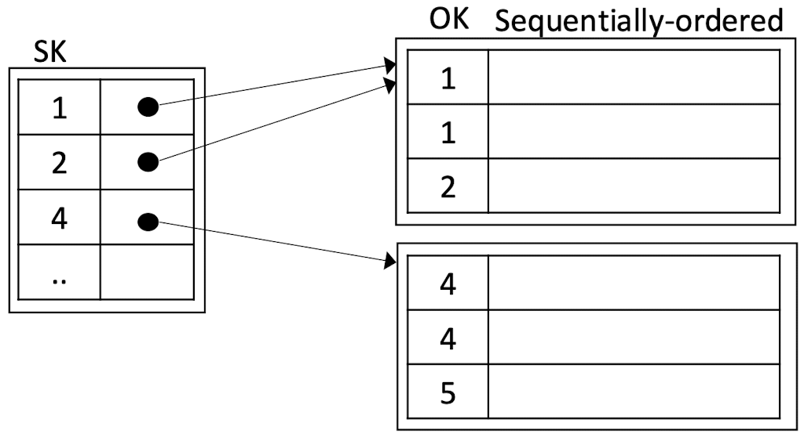
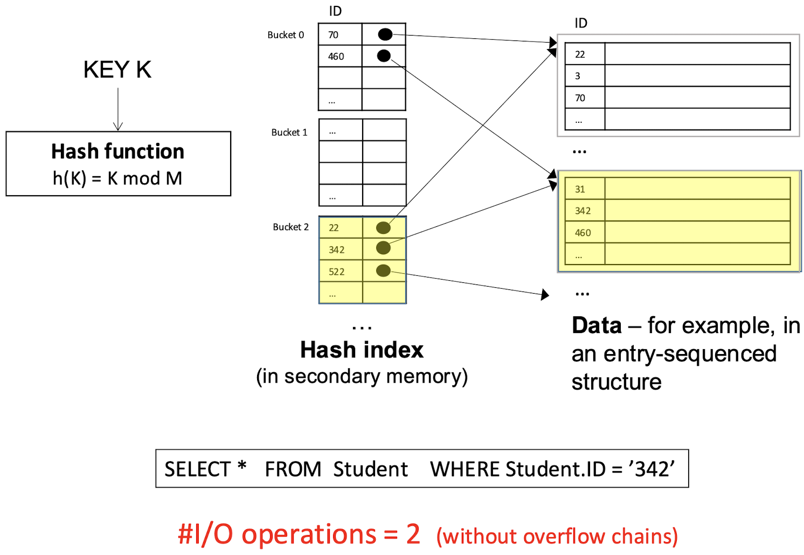
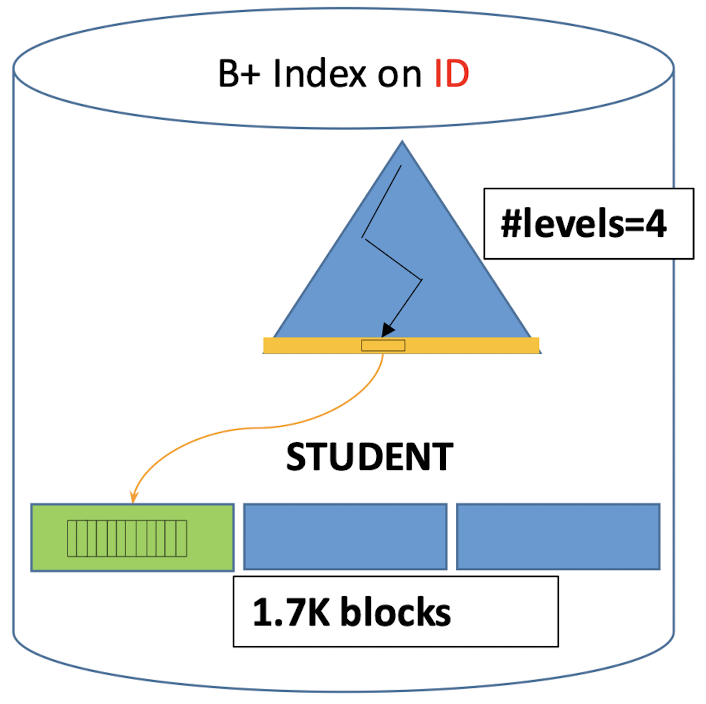
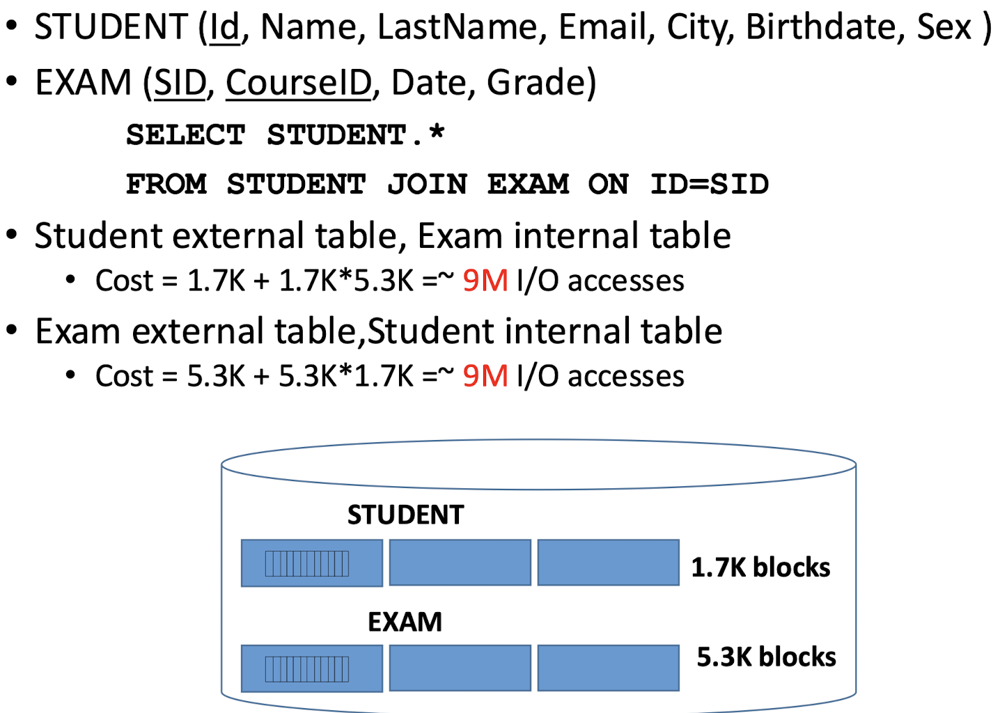
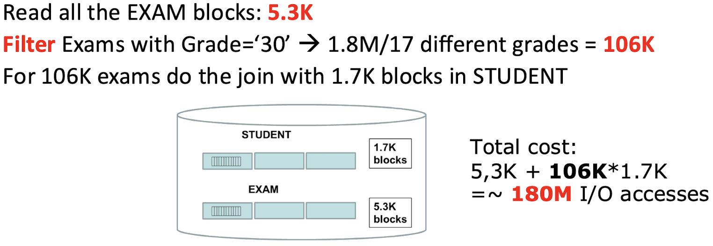

# Query Management in the DBMS Architecture


# Data Access & Cost Model

## Main & Secondary Memory


* **Storage in Secondary Memory**:

	* Databases are primarily stored in secondary memory (like hard drives) for two main reasons:

		* **Size**: Databases are often too large to fit entirely in main memory.

		* **Persistence**: Secondary memory is non-volatile, meaning data is retained even when the system is turned off.

* **Data Transfer from Secondary to Main Memory**:

	* Data stored in secondary memory cannot be directly used by the CPU. It must first be transferred into main memory (RAM) before processing.

	* This process involves moving portions of data from secondary memory to main memory as needed.

* **Units of Storage**:

	* **Page**: In main memory, data is organized into “pages.” Pages are the basic units that the system transfers from secondary memory into main memory for processing.

	* **Block**: In secondary memory, data is organized into “blocks,” which are the units of storage that the database system reads and writes.

* **Buffer**:

	* The buffer is an area in main memory designated for temporarily holding data pages transferred from secondary memory.

	* This buffer allows for quick access to recently used data, reducing the need to repeatedly access slower secondary memory.


## Page & Blocks

* **Blocks in Secondary Memory**:

	* In secondary memory (like hard drives or SSDs), data is organized in fixed-size units called **blocks**.

	* These blocks are typically a few kilobytes in size, making data management and retrieval more efficient.

* **Pages in Main Memory**:

	* In main memory (RAM), data is organized in **pages**, which are also fixed-size units.

	* For simplicity, we assumes that the size of a page in main memory is equal to the size of a block in secondary memory. This assumption simplifies data transfer between the two types of memory.

	* In reality, however, a single page might span multiple blocks or vice versa, depending on system configurations.

* **I/O Operations**:

	* An **I/O operation** involves transferring data between main memory and secondary memory.

	* Specifically, an I/O operation moves a block from secondary memory into main memory (or vice versa), allowing the data to be accessed or updated.

	* The efficiency of these I/O operations is critical for database performance, as frequent data transfers can slow down processing if not managed properly.


## I/O Operations


* **Time to Read a Block**:

	* The time required to read a block from a disk depends on the storage technology used. Different storage devices have varying read and write speeds, which impact the performance of I/O operations.

* **Storage Technologies**:

	* **Mechanical Hard Drives (HDDs)**:

		* These are traditional storage devices with moving parts, such as spinning disks and read/write heads.

		* HDDs are slower in terms of read and write speeds compared to SSDs, especially when handling random I/O operations.

	* **Solid State Drives (SSDs)**:

		* SSDs use flash memory and have no moving parts, allowing them to perform read and write operations much faster than HDDs.
		* SSDs provide a significantly higher I/O throughput, making them ideal for applications requiring quick data access.

* **Cost Considerations**:

	* SSDs are generally more expensive than HDDs. While SSDs offer superior performance, HDDs remain a more cost-effective solution for very large datasets where high-speed access is less critical.

	* For systems that require vast storage but can tolerate slower access times, HDDs may still be the preferred option due to cost savings.


## Main v.s. Secondary Memory Access Time

* **Secondary Memory Access Times**:

	* **Seek Time** (8-12 ms): The time it takes for the hard drive’s head to move to the correct track where the data is located.

	* **Latency Time** (2-8 ms): The time it takes for the correct sector to rotate under the read/write head once the track is reached.

	* **Transfer Time** (~1 ms): The time taken to actually transfer data once the head is positioned at the correct sector.

​	These components of secondary memory access add up, making access times much slower compared to main memory.

* **Access Cost Comparison**:

	* Accessing secondary memory is **4 orders of magnitude** (i.e., 10,000 times) slower than accessing main memory.

	* This difference is primarily due to the mechanical movements involved in secondary memory (e.g., moving the head and waiting for the disk to rotate), which do not exist in main memory.

* **I/O Bound Applications**:
	* In applications that are “I/O bound,” the overall performance largely depends on the number of secondary memory accesses. These applications are slowed down by the time it takes to retrieve data from secondary storage.

* **Cost of a Query**:

	* The cost of executing a query depends on the ==**number of blocks**== that need to be moved from secondary memory to main memory.

	* More blocks to move means higher access time and resource cost, which impacts query performance.


## DBMS & File System

* **File System (FS)**:

	* The file system is a component of the operating system that manages access to secondary memory (like hard drives).

	* It provides basic file management functions, such as creating, deleting, reading, and writing files.

* **DBMS Interaction with File System**:

	* A DBMS only uses a limited set of file system functionalities. It mainly relies on the FS for basic operations like creating or deleting files and reading or writing data blocks.

	* For more complex database operations, the DBMS does not depend on the file system and instead takes over file management.

* **Direct File Management by DBMS**:

	* ==**The DBMS manages the organization of files directly**==, handling how data is distributed within blocks and the structure of each block.

	* This direct control allows the DBMS to optimize the storage layout and access patterns to suit database-specific requirements, enhancing performance and efficiency.

* **Physical Allocation Control**:

	* The DBMS can also control the physical allocation of blocks on the disk. This enables:

		* **Faster Sequential Reads**: By organizing blocks sequentially, the DBMS can reduce seek times during data access.

		* **Fine-Grained Write Control**: The DBMS can manage when and where data is written, helping optimize write performance and execution times.

		* **Reliability**: The DBMS can implement its own reliability mechanisms, potentially offering more robust data protection than the file system alone.


# Physical Access Structures

* **Access Methods**:

	* Each DBMS has a unique and limited set of access methods.

	* ==**Access methods**== are software modules that handle data access and manipulation for each physical data structure in the database. They define the operations (like storing and retrieving data) for specific types of data storage.

	* These methods ensure that data can be efficiently stored and accessed based on the structure and requirements of each data type.

* **Data Organization by Access Methods**:

	* Access methods have their own data structures that help in organizing data within the database.

	* Each table in the database is stored in a single ==**primary physical data structure**==. This is the main structure where the table’s data resides.

	* Additionally, tables can have ==**secondary access structures**== (like indexes) that improve query performance by providing faster data access paths. A table may have multiple secondary structures, depending on the requirements for efficient data retrieval.

		


* ==**Primary Structure**==:

	* The primary structure contains all the **tuples** (rows) of a table, representing the main storage for the actual table content.

	* The main purpose of the primary structure is to store the full data of each table.

* ==**Secondary Structures**==:

	* Secondary structures are used to **index** the primary structure, providing faster access paths for locating specific tuples.
	* They do not store full tuples but contain selected field values along with **pointers** to the relevant blocks in the primary structure.

	* The purpose of secondary structures is to improve search efficiency by enabling faster retrieval of specific data based on certain search criteria.

* **Types of Data Access Structures**:

	* ==**Sequential Structures**==: Organize data in a sequence, allowing for ordered access to records, which can be efficient for range queries.

	* ==**Hash-Based Structures**==: Use hashing techniques to map data to specific locations, ideal for fast, exact-match queries.

	* ==**Tree-Based Structures**==: Use hierarchical structures like B-trees or B+ trees to organize data, supporting efficient retrieval for both exact matches and range queries.

	Not all types of structures are equally suited for implementing the primary storage or a secondary access method

	|                       | Primary       | Secondary   |
	| --------------------- | ------------- | ----------- |
	| Sequential structures | ==Typical==   | Not used    |
	| Hash-based structures | In some DBMSs | Frequent    |
	| Tree-based structures | Obsolete/rare | ==Typical== |


## Blocks & Tuples

* ==**Blocks**==:

	* Blocks are the **physical components** of files in a database.

	* The size of a block is generally ==**fixed**==, determined by the file system and disk formatting. This fixed size allows efficient storage and retrieval of data from disk to memory.

* ==**Tuples**==:

	* Tuples, also known as **records**, are the **logical components** of tables in a database.

	* The size of a tuple is ==**variable**== as it depends on the database schema. Different tuples may have optional fields, variable-length attributes (like VARCHAR), or nullable values, making their sizes flexible within a file.

* **Size and Structure Differences**:

	* Blocks have a fixed size to facilitate efficient storage and transfer, while tuples vary in size due to the nature of the data they store.

	* This structure allows the database to manage data at both physical (block) and logical (tuple) levels, optimizing storage while accommodating varied data types and values.


### Organization of Tuples in Blocks


* **==Block Header== and ==Trailer==**:

	* The block has a **header** and a **trailer** with control information used by the ==**file system**==.

	* These headers and trailers help manage block-level metadata, including aspects like data location and file system integrity.

* **==Page Header== and ==Trailer==**:

	* Inside the block, there is a **page header** and a **page trailer** containing control information specific to the ==**access method**== (such as sequential or hash-based access).

	* This information provides details necessary for the DBMS to understand how to interact with the data based on the chosen storage method.

* ==**Page Dictionary**==:

	* The page dictionary holds pointers (offsets) to each tuple (or elementary data item) in the useful data section of the page.

	* These pointers allow efficient access to individual tuples within the block, making it easier to locate and retrieve specific records.

* ==**Useful Part of the Page**==:
	* This section contains the actual **data** (tuples) stored in the block.
	* The dictionary and the useful data section typically grow towards each other, forming two stacks that extend in opposite directions within the block.

* ==**Checksum**==:

	* The checksum is used to detect corrupted data within the block.

	* By verifying the checksum, the system can ensure data integrity and detect any errors or corruption in the stored data.


### # Tuples in a Block: Block Factor

* ==**Block Factor (B)**==:

	* The block factor, denoted as **B**, is the **number of tuples** (or records) that can be stored within a single block.

	* It is a critical measure for estimating storage and retrieval costs in a database.

* **Importance for Query Cost Estimation**:

	* Knowing the block factor helps estimate the ==**cost of queries**== by determining how much data can be retrieved in each I/O operation.

	* This calculation is fundamental in analyzing and optimizing database performance.

* **Variables**:

	* **SR**: Represents the **average size of a record (tuple)**, assuming a fixed-length record.

	* **SB**: Denotes the **size of a block**.

	* If **SB > SR**, multiple tuples can fit within a block, allowing efficient storage and retrieval.

* **Formula for Block Factor**:
	* The formula for calculating the block factor is: $B = \left\lfloor \frac{SB}{SR} \right\rfloor$
	* This calculation divides the block size by the average tuple size and takes the floor value (rounds down) to get the maximum number of tuples that can fit within a block.

* **Remaining Space in a Block**:

	* The leftover space in a block can be used in two ways:

		* **Unused**: For unspanned records, any extra space in a block that cannot accommodate a full tuple is left empty.

		* **Used**: For spanned records, tuples may span across blocks if allowed by the database, utilizing the remaining space to store parts of tuples (referred to as “hung-up” tuples or records).


## Buffer Manager Primitives

* **Operations in Main Memory**:

	* The Buffer Manager performs its operations in main memory, directly affecting **pages** rather than blocks.

	* For simplicity in the **cost model**, it is assumed that **pages are of equal size and have the same organization as blocks**.

* **Primary Operations**:

	* The Buffer Manager performs several key operations, including insertion, deletion, updating of tuples, and accessing specific fields within tuples.

* **Types of Operations**:

	* **Insertion and Update of a Tuple**:

		* Inserting or updating a tuple may require **reorganization of the page** to accommodate changes in data.

		* For example, an update in a variable-length field (such as a VARCHAR) may trigger reorganization to fit the new data within the available space.

		* In some cases, a new page might be needed if there isn’t enough space on the current page.

	* **Deletion of a Tuple**:

		* Tuples are typically deleted by marking them as **‘invalid’** rather than removing them immediately.

		* This approach can trigger an asynchronous reorganization of the page later on to free up space.

	* **Access to a Field of a Particular Tuple**:

		* Accessing a specific field within a tuple involves using an **offset** from the start of the tuple, combined with the length of the field (information stored in the page dictionary).

		* This allows efficient field access without scanning the entire tuple or page.


## Sequential Structures

* **Sequential Arrangement**:

	* In a sequential structure, tuples are arranged in a sequence in secondary memory, supporting access to the ==**next element**== in the sequence.

	* This arrangement allows for efficient retrieval of consecutive data, making it suitable for full table scans or ordered data access.

* **Block Organization**:

	* Blocks that contain these tuples can either be **contiguous on disk** (stored in consecutive locations) or **sparse** (spread out across non-adjacent locations).

* **Two Cases of Sequential Organization**:

	* ==**Entry-Sequenced Organization**==:

		* In this organization, tuples are stored in the sequence in which they were entered.

		* The order of storage is dictated by the order of entry, meaning new records are appended to the end of the sequence.

		* This approach is straightforward and commonly used when data retrieval in entry order is sufficient.

	* ==**Sequentially-Ordered Organization**==:

		* Here, tuples are stored in an order based on the value of a **key** (one or more attributes).

		* This type of organization is useful for databases where data needs to be accessed in a specific order (e.g., sorted by date or ID).

		* It allows for efficient range queries and ordered data retrieval.


### Entry-sequenced Sequential (a.k.a Heap) Structure

* **Effective For**:

	* **Insertion**:
		* The heap structure is efficient for inserting new records since they are simply added at the end without requiring data shifting or reorganization.

	* **Space Occupancy**:
		* This structure utilizes all available blocks and all the space within blocks, making it space-efficient.

	* **==Sequential== Reading and Writing**:

		* Suitable for operations that involve reading or writing all or most of the file, like `SELECT * FROM T`

		* This efficiency is especially high if blocks are stored contiguously on disk, as it minimizes seek and latency times.

* **Non-Optimal For**:

	* **Searching for Specific Data Units**:

		* Searching for specific records (`SELECT * FROM T WHERE ...`) can be inefficient, as it may require scanning the entire structure to locate a specific record.

			

		* However, ==**indexes**== can be added to improve search performance by providing quicker access to particular attributes.

	* **Updates That Increase Tuple Size**:

		* Updates that make a tuple larger than its original space can be problematic, as they require shifting data within the block or even moving data to a new block.

		* Alternative solutions include marking the original tuple as deleted and inserting the updated tuple as a new entry, but this can lead to fragmentation and wasted space.


### Sequential-ordered Sequential Structure

* **Sorted Arrangement**:

	* In this structure, tuples are ==**sorted based on the value of a key field**==. This ordering allows for efficient access when data needs to be retrieved in a particular order.

* **Effective For**:

	* **Range Queries**: It’s efficient for queries that retrieve tuples within a specified range of key values, as the ordered structure allows for quick access to a subset of data.

	* **`ORDER BY` and `GROUP BY` Queries**: Queries that require sorting or grouping benefit from this structure, as the data is already ordered by the key field.

* **Challenges with Insertions and Updates**:

	* Inserting new tuples or updating existing tuples (especially when the update increases the tuple size) can disrupt the order, necessitating **reordering** within the block.

	* Maintaining the sorted structure requires additional overhead, particularly when data needs to be inserted in the middle of the sorted sequence.

* **Techniques to Avoid Global Reordering**:

	* **Differential Files with Periodic Merging**: Newly inserted records are stored in a separate file (differential file), and the main file is periodically updated by merging the differential file. This approach is similar to maintaining the “yellow pages.”

	* **Free Space in the Block for Local Reordering**: Keeping some space within each block during loading allows for minor reordering operations within the block, reducing the need for global reordering.

	* **Overflow File**: New tuples that don’t fit within the sorted sequence are stored in an overflow file. The main file links to these overflow blocks, creating an overflow chain. This method is commonly used in various storage structures to handle overflows without disturbing the main file structure.


### Comparison

|                                 | Entry-sequenced                                              | Sequentially-ordered                 |
| ------------------------------- | ------------------------------------------------------------ | ------------------------------------ |
| `INSERT`                        | Efficient                                                    | Not efficient                        |
| `UPDATE`                        | Generally efficient (if the update increases the tuple size, the system may need to mark the old tuple as “invalid” and insert a new version, which can be less efficient if finding data is complex) | Not efficient if data size increases |
| `DELETE`                        | "Invalid"                                                    | "Invalid"                            |
| `TUPLE SIZE`                    | Fixed or variable                                            | Fixed or variable                    |
| `SELECT * FROM T WHERE key ...` | Not efficient                                                | More efficient                       |

The **entry-sequenced structure** is a common solution for general-purpose storage, especially when ==paired with **secondary access structures (indexes)**== to improve search efficiency. The **sequentially-ordered structure** is more specialized, optimized for queries that benefit from an ordered dataset but requires more overhead for insertions and updates that disrupt the order.


## Hash-based Access Structures

* **Associative Access**:

	* Hash-based structures enable ==**associative access**== to data, which means data can be accessed based on the value of a ==**key**== rather than its location. This access type is efficient for finding specific records quickly.

* **Buckets**:

	* A hash-based structure contains $N_B$ ==**buckets**==, which are storage units typically sized to fit one block.

	* Buckets are often stored adjacently in the file to allow quick access.

	* The number of buckets is much smaller than the total number of data items, as each bucket can store multiple items.

* **Hash Function**:

	* A **hash function** maps the key to a value between $0$ and $N_B - 1$ .

	* This mapped value is used as an index to identify a bucket in the hash structure, creating a ==**hash table**== that allows for direct access to the desired bucket.

* **Efficiency**:

	* **Small tables with mostly static content**: These tables do not require frequent updates or reorganization.
	* **Point queries**: Queries with equality conditions on the key (e.g., finding a record with a specific ID) are fast because the hash function directly points to the relevant bucket.

* **Inefficiency**:

	* **Range queries and full table scans**: Since hash functions are designed for exact matches, they do not support range queries effectively, making it challenging to retrieve records based on a range of values.

	* **Dynamic tables**: When tables change frequently, such as with insertions and deletions, the hash structure may require rehashing or reorganization, which can be computationally expensive.


### How Hash-based Structures Work

* **Hash Function Format**:

	* The general function for hashing is represented as: $\text{hash(fileId, Key)}: \text{BlockId}$
		* Here, the **fileId** and **key** are used to produce a **BlockId**, which identifies the specific block where the data is stored.

* **Two-Part Implementation**:

	* ==**Folding**==: This step transforms key values (e.g., strings) into **positive integer values**. The folding technique ensures that these values are uniformly distributed over a large range, which helps to spread data evenly across available buckets and minimizes clustering in any single bucket.

	* ==**Hashing**==: The folded integer is then transformed into a value between $0$ and $N_B - 1$ (where $N_B$ is the number of buckets). This step maps the integer to a specific bucket within the hash structure, ensuring that each key is associated with a particular storage location.

		


### Collisions

* **What is a Collision?**

	* A collision occurs when two different keys (tuples) are assigned to the same bucket by the hash function.

	* Example: If the hash function is $h(K) = K \mod 10$ , both $K = 983$ and $K = 723$ would map to **bucket 3**, resulting in a collision.

* **Bucket Capacity and Collision Resolution**

	* When a bucket reaches its maximum capacity (the maximum number of tuples it can hold), **collision resolution techniques** are needed to handle additional tuples that map to the same bucket.

	* Two primary methods are used for collision resolution:

		* ==**Closed Hashing (Open Addressing)**==:

			* In this approach, the system tries to find an available slot in a different bucket within the hash table.

			* One common technique for closed hashing is **linear probing**:

			* Linear probing searches sequentially for the next available bucket, wrapping around to the beginning of the table if necessary.

			* However, this method is generally **not used in DBMS** due to its complexity and inefficiency in managing large datasets.

		* ==**Open Hashing (Separate Chaining)**==:

			* In open hashing, each bucket can accommodate an overflow by creating a **linked chain** of tuples that share the same hash result.

			* When a bucket is full, a **new bucket** is allocated for the overflowed data, and this new bucket is linked to the original, forming a chain.

			* This method is commonly used in DBMS as it efficiently manages overflow while maintaining data accessibility.


### Hash Table for Primary Storage


* We can estimate the cost of accessing the tuple by considering the average length of the overflow chain


### Overflow Chains

* **Overflow Chain Length**:

	* The length of an overflow chain (the list of additional blocks linked to a bucket when it overflows) is influenced by two factors:

	* **Load Factor**: Represents the **occupancy rate** of the buckets, calculated as: $\text{Load Factor} = \frac{T}{B \times N_B}$
		* where $T$ is the number of tuples, $B$ is the block factor (number of tuples per block), and $N_B$ is the number of buckets.

	* **Block Factor (B)**: Indicates the number of tuples that can fit within a single block.

* **Impact of Load Factor and Block Factor**:

	* Higher load factors mean that more slots are occupied, which increases the likelihood of overflow and longer chains.

	* A high block factor (larger $B$ ) allows more tuples per bucket, reducing the need for overflow chains.

	


## Indexes

* **Purpose of Indexes**:

	* Indexes are **data structures** that allow efficient retrieval of tuples (records) based on a ==**search key (SK)**==.

	* They speed up data access by enabling quick lookups, similar to an index in a book that helps locate specific topics or terms.

* **Structure of Index Entries**:
	* An index consists of records in the form `[search key, pointer to block]`.
		* The **search key** is the value used to search for data, while the **pointer** directs the system to the exact block in primary storage where the data resides.

* **Sorting of Index Entries**:

	* Index entries are typically **sorted by the search key**, which allows for efficient searching, particularly in range and exact-match queries.

	* Hash-based indexes, however, do not follow a sorted order as they rely on hash functions to map search keys to specific buckets.

* **Analogy to a Book Index**:

	* The concept of an index is similar to the **analytic index of a book**, where terms (search keys) are listed with corresponding page numbers (pointers to location).

	* This structure allows users to locate information quickly without scanning the entire content.


### Dense v.s. Sparse Index

* **Dense Index**:

	* In a dense index, there is an **index entry ==for every search-key (SK) value==** in the file.

	* **Performance**: Dense indexes provide good performance because searching only requires accessing the index, followed by direct access to the tuple.

	* **Use Case**: Dense indexes can be used with **entry-sequenced primary structures** (heap structures where data is not ordered).

	* **Example**: If there are 1000 unique search keys, a dense index will have 1000 entries, each pointing directly to the corresponding data.

* **Sparse Index**:

	* A sparse index contains **index entries ==for only some of the search-key values==**. It usually has one entry per block instead of one per tuple.

	* **Space Efficiency**: Sparse indexes require less space than dense indexes because they store fewer entries.

	* **Performance**: Searching is slower compared to a dense index because the system may need to scan the block that contains the matching entry, making it a **two-step process** (index search + block scan).

	* **Requirements**: Sparse indexes require **sequential-ordered data structures** and work best when the search key is also the ==**ordering key** (SK = OK)==.

	* **Trade-Off**: Sparse indexes are commonly designed with one index entry per block, which balances storage efficiency with access performance.

		


### Primary Index


* **Definition**:

	* A primary index is an index defined on ==**sequential-ordered structures**== where the data is arranged according to a particular order.

* **Search Key (SK) and Ordering Key (OK)**:

	* The **search key (==SK==)** in a primary index is **unique** and coincides with the **ordering key (==OK==)**, which is the attribute used to order the data. This condition, represented as ==**SK = OK**==, ensures that each key corresponds to a unique data entry.

	* Because the search key is unique, the primary index provides direct access to specific records without ambiguity.

* **Uniqueness of Primary Index**:

	* Only **one primary index** can be defined per table, as it is based on a unique ordering of the data.

	* While the primary index is usually based on the **primary key** of the table, it is not mandatory to use the primary key as the ordering attribute.

* **Dense vs. Sparse Index**:

	* A primary index can be **dense** (with an entry for every record) or **sparse** (with fewer entries, typically one per block).

	* A dense primary index provides faster access but requires more storage, while a sparse primary index is more space-efficient but may involve block scanning.


### Clustering Index



* **Definition**:

	* A clustering index is a **generalization of a primary index ==(SK = OK)==** where the ==**ordering key (OK) does not need to be unique**==.

	* While the primary index requires unique search keys, the clustering index allows multiple records to have the same search key value.

* **Characteristics**:

	* Since the ordering key is not unique, a single search key in the clustering index may point to multiple tuples.

	* The **pointer** in the clustering index points to the **block containing the first tuple** with the given search key, and subsequent tuples with the same key are stored in adjacent locations.

* **Sparse or Dense**:

	* A clustering index can be **sparse** or **dense**, but it is typically **sparse**.

	* In a sparse clustering index, a single entry corresponds to multiple tuples with the same search key, reducing the storage requirements compared to a dense index.


### Secondary Index


* **Definition of a Secondary Index**:

	* A secondary index is an index created on a **search key (SK)** that is different from the **ordering key (OK)** of the file, meaning ==**SK ≠ OK**==.

	* Unlike a primary or clustering index, a secondary index does not rely on the natural order of the data.

* **Multiple Secondary Indexes**:

	* You can have **multiple secondary indexes** on the same table, each based on different search keys.

	* This flexibility allows queries to be optimized based on different search attributes.

* **Necessarily Dense**:

	* A secondary index is **necessarily dense**, meaning it contains an index entry for every tuple in the database.

	* This is required because, with SK ≠ OK, tuples with consecutive search key values might be stored in non-adjacent blocks. A sparse index would not provide sufficient information for efficient access in such cases.


### Search Key != Primary Key

* **Primary Key**:

	* A **primary key** is a set of attributes that uniquely identifies a tuple (row) in a table. It has specific properties:

		* **Minimal**: Contains only the necessary attributes to ensure uniqueness.

		* **Unique**: Ensures no duplicate values across tuples.

		* **Not Null**: Cannot contain null values.

	* In SQL, defining a primary key enforces a **constraint** to ensure data integrity by preventing duplicate or null values in the primary key column(s).

	* While a primary key often has an associated index, **it does not inherently imply an access path** for data retrieval; rather, it is a logical constraint to uniquely identify rows.

* **Search Key**:

	* A **search key** is a set of attributes used in an index to facilitate fast data retrieval by creating an access path.

	* The search key is part of the **physical implementation** of the database’s access structures (like indexes).

	* It defines an **access path** that allows the system to locate tuples quickly.

	* **Properties**:
		* A search key can be **unique** (each key points to a single tuple) or **non-unique** (one key can point to multiple tuples or blocks).
		* It is directly associated with **pointers** in the index, which link to the location of tuples in storage.

* **Differences**:

	* **Primary Key**: A logical constraint for uniqueness, mainly used for data integrity and identification.

	* **Search Key**: A physical construct within an index to improve access speed, which may or may not involve uniqueness.

	* A primary key may also serve as a search key if it’s used in an index, but a search key does not have to be a primary key.


### Summary

| Type of Index | Type of structure                                       | Search Key            | Density                                                      | How many       |
| ------------- | ------------------------------------------------------- | --------------------- | ------------------------------------------------------------ | -------------- |
| Primary       | Sequential-ordered with **SK = OK**                     | Unique                | Dense or sparse                                              | One per table  |
| Secondary     | Entry-sequenced or Sequential-ordered with **SK != OK** | Unique and non unique | Dense (not possible to scan primary data structure w.r.t. SK) | Many per table |
| Clustering    | Sequential-ordered with **SK = OK**                     | Non unique            | Typically sparse                                             | One per table  |

**Warning**: **Terminology may vary** across different database systems. Terms like “primary,” “secondary,” and “clustering” may have specific interpretations depending on the database system. It’s essential to understand these terms within the context of the system being used


### Pros & Cons of Indexes

* **Pros of Indexes**

	* **Smaller Size**:

		* Indexes are generally **smaller than primary data structures** (e.g., the full table), so they can often be loaded into **main memory**.

		* This enables faster access to data, as loading and scanning indexes in memory is more efficient than accessing the full dataset on disk.

	* **Efficient Query Support**:

		* Indexes support **point queries** (exact matches) and **range queries** (data within a certain range), as well as **sorted scans** (ordered data retrieval).

		* They enable quick data access and improve performance for a variety of query types.

		* However, they may be **less efficient than hash-based structures** for simple point queries, as hash structures provide direct access.

* **Cons of Indexes**

	* **Maintenance Overhead**:

		* When indexes are added to a table, the **DBMS must update the index** every time there is an insert, update, or delete operation.

		* This updating process incurs additional overhead because the index must be adjusted to reflect changes in the data, slowing down data modification operations.

	* **Performance Trade-Offs**:

		* Indexes **do not come for free**; while they speed up read operations, they may **slow down write operations** (insert, update, delete) due to the need for constant index updates.

		* This trade-off means that while indexes improve data retrieval performance, they can degrade the performance of transactions that frequently modify data.


### Hash-based Indexes

* **Hash-Based Structures as Secondary Indexes**:

	* Hash-based structures, typically used for primary data organization, can also serve as **secondary indexes**.

	* When used as a secondary index, the hash-based structure provides quick access based on the search key, ideal for exact-match queries on non-ordering attributes.

* **Structure and Management**:

	* The secondary hash index is **shaped and managed similarly to a hash-based primary structure**. This means it uses the same hashing techniques to map keys to specific buckets.

	* However, because it serves as an index, it does not store entire tuples (data entries).

* **Content of Buckets**:

	* In a secondary hash-based index, ==each bucket only contains **key values and pointers**== rather than the actual data.

	* These **pointers** direct to the full records in the primary data structure, allowing quick lookup without duplicating the full tuple.




#### About Hashing

* **Efficiency in Large Databases**:

	* In large databases, scanning all index values to locate data is inefficient.

	* **Hashing** is a technique that allows for direct access to an index entry or data tuple by calculating its exact location, reducing the need for sequential scanning.

* **Direct Location Calculation**:

	* Hashing is used to compute the **direct location** of data within the storage structure.

	* This makes hashing particularly useful for finding exact matches (point queries) by quickly locating the bucket or block containing the desired tuple.

* **Good for Equality Predicates**:

	* Hashing provides excellent performance for ==**equality predicates**== on the key field, meaning it works well when searching for data that exactly matches a specified key.

	* For instance, if you need to find a record with a specific ID, hashing can directly map to the location of that record without additional searching.

* **Limitations**:

	* Hashing is **inefficient for interval predicates** (range queries), where you want to retrieve a range of values, such as all records with values between X and Y.

	* It is also inefficient for queries based on **non-search-key attributes**, as the hash function is designed for exact matches on the search key and cannot accommodate complex conditions or range-based retrieval.


## ==Tree-based Structures==

* **Common Use in Relational DBMS**:

	* Tree-based structures are **frequently used** for **secondary indexes** in relational databases.

	* SQL indexes are typically implemented using tree-based structures due to their efficiency in handling a wide range of queries.

* **Associative Access**:

	* Tree-based indexes allow for **associative access** based on a key search field, making them suitable for both point queries and range queries.

	* By traversing the tree, the system can efficiently locate data corresponding to the specified search key.

* **Balanced Trees (B-trees)**:

	* **B-trees** are a type of balanced tree structure in which the **paths from the root node to all leaf nodes are of equal length**.

	* This balanced nature ensures that data retrieval times are predictable and optimized, as all entries are equidistant from the root.

* **Two Main Types of Tree Structures**:

	* **B-trees**: Store key values in both **internal and leaf nodes**. This design allows B-trees to handle a wide variety of queries, but they are less efficient than B+ trees for certain range queries.

	* ==**B+ trees**==: In **B+ trees (most commonly used)**, all key values are stored exclusively in **leaf nodes**, with internal nodes only storing pointers to guide the search path. This structure improves the efficiency of range queries, as leaf nodes are linked sequentially, allowing for easy traversal of sorted data.


### ==B+ Tree Structures==


* **Evolution from B-Trees**:

	* The **B+ tree** is an evolution of the **B-tree** designed to improve efficiency in range queries and disk-based storage.

	* Unlike B-trees, B+ trees store all key values in the **leaf nodes**, which are linked sequentially, facilitating faster range queries.

* **Multi-Level Index Structure**:

	* B+ trees are organized in a **multi-level hierarchy**:

		* **Root node**: The topmost node that provides entry points to the tree.

		* **Intermediate nodes**: Nodes between the root and leaf levels that help in navigating the tree.

		* **Leaf nodes**: Nodes at the bottom level where all key values are stored, linked sequentially for easy traversal.

* **Node Storage**:

	* Each node in a B+ tree is stored in a **block** (usually a disk page) to optimize storage and retrieval on disk-based systems.

* **Fan-Out (Degree)**:

	* Each node has a large number of child nodes, known as its **fan-out** or **degree**. This high branching factor reduces the tree’s height, making data access faster.

	* Most of the blocks in a B+ tree are **leaf nodes** due to the high fan-out, meaning that leaf nodes store the majority of the data.

* **Fan-Out Factors**:

	* The **fan-out** depends on factors like the **block size**, the size of the key values, and the size of pointers.

	* With larger blocks, the tree can have more pointers in each node, further increasing the fan-out and reducing the tree height.


#### Internal Nodes


* **Multilevel Sparse Index**:

	* Internal nodes in a B+ tree form a ==**multilevel sparse index**== on the leaf nodes. They act as a roadmap, guiding the search down to the appropriate leaf nodes where the actual data resides.

* **Capacity of Internal Nodes**:

	* Each internal node can hold up to **N-1 search keys** and **N pointers**.

	* The pointers connect to child nodes, allowing the tree structure to fan out, thereby reducing the tree’s height and improving search efficiency.

* **Minimum Fill Requirement**:

	* Each internal node (except for the root node) must have at least **⌈N/2⌉ pointers**. This requirement ensures that nodes are at least **half full**, maintaining a balanced structure and preventing the tree from becoming too sparse.

* **Sorted Search Keys**:

	* The search keys within each node are stored in **sorted order** (i.e., $K_i < K_{i+1} \ \forall i$ ), which helps streamline the search process by enabling binary-like searches within nodes.

	* Sorted keys make it easy to decide the appropriate pointer (subtree) to follow for the search.


#### Leaf Nodes


* **Capacity of Leaf Nodes**:

	* Each leaf node can hold up to **N-1 search keys**, along with pointers that direct to the actual data blocks containing tuples that match each search key.

	* This design allows each leaf node to store multiple key-pointer pairs, making it compact and efficient.

* **Minimum Key Requirement**:

	* Each leaf node must contain at least **⌈(N-1)/2⌉ key values**. This minimum fill requirement is enforced by algorithms that manage the tree, ensuring that nodes remain balanced and that the tree structure is maintained.

* **Sorted Search Keys**:

	* The search keys within each leaf node are stored in **sorted order** (i.e., $K_i < K_j \ \forall i < j$ ).

	* This ordering helps with efficient search operations within the leaf nodes and also enables range queries by allowing sequential access.

* **Dense Index**:

	* The set of leaf nodes in a B+ tree forms a ==**dense index**==, meaning that each key value appears in a leaf node.

	* This structure provides a complete mapping of all existing keys, facilitating direct and efficient access to each record.

* **Sequential Linking of Leaf Nodes**:

	* Each leaf node contains a **pointer to the next leaf node**. This sequential linking allows for efficient range queries and ordered data access, as it enables traversal of the tree’s leaf nodes in a sorted sequence.

	* This design is particularly useful for operations that need to process consecutive keys, as it avoids the need to backtrack to parent nodes.


#### Search Technique / Lookup

* **Objective**:
	* The goal is to locate a tuple with the key value $V$ by following a path from the root node, through intermediate nodes, and down to the appropriate leaf node.

* **Steps at Each Intermediate Node**:

	* At each intermediate node, the search algorithm compares $V$ with the key values stored in that node to determine the correct pointer to follow:

		* **If** $V < K_1$ : Follow $P_1$ , which points to the subtree with keys less than $K_1$ .

		* **If** $V \geq K_{N-1}$ : Follow $P_N$ , which points to the subtree with keys greater than or equal to $K_{N-1}$ .

		* **Otherwise**: Identify the appropriate pointer $P_{j+1}$ to follow, where $K_j \leq V < K_{j+1}$ . This directs the search to the subtree containing the range in which $V$ falls.

		


#### Query with Equality Predicate

```sql
SELECT *
FROM Student
WHERE Student.ID = '10'
```


* **Navigation through the B+ Tree**:

	* Starting from the **root node**, the search process follows the correct pointers based on comparisons with the keys in each node until it reaches the **leaf node** containing the target key.

	* In this example:

		* The root node is checked first, and the pointer for keys including ‘10’ is followed to the next level.

		* This process is repeated through the **intermediate nodes** until the **leaf node** holding the key ‘10’ is reached.

* **Accessing the Data Block**:

	* Once the leaf node containing ‘10’ is found, the **pointer in the leaf node** is used to access the **data block** (or primary storage block) where the tuple with ID ‘10’ is stored.

	* This final access retrieves the full record corresponding to the query.

* **I/O Operations Calculation**:

	* ==**#I/O operations = #blocks read to reach the correct leaf node + 1 access to the block containing the autual data**==

	* In the example: 2 intermediate nodes + 1 leaf node + 1 data block = 4 I/O operations


```sql
SELECT *
FROM Student
WHERE Student.ID BETWEEN '6' AND '19'
```


* **Navigation through the B+ Tree**:

	* Starting from the **root node**, the search process traverses down through the **intermediate nodes** until it reaches the first **leaf node** containing a value within the range.

	* In this example:

		* The root node points to intermediate nodes containing keys that fall within the desired range.

		* Each relevant leaf node is visited sequentially to collect all the matching records within the specified range.

* **Accessing Data Blocks**:

	* After reaching the relevant leaf nodes, each leaf node’s **pointers** are followed to retrieve the actual **data blocks** that contain the records (tuples) matching the key values in the specified range.

* **I/O Operations Calculation**:

	* ==**#I/O operations = #blocks read to reach the starting leaf node for the range + #leaf nodes that contain relevant records + #data blocks accessed to retrieve the actual data**==
	* In this example: 2 intermediate nodes + 3 leaf nodes + 3 data blocks accessed = 8 I/O operations


```sql
SELECT Student.ID
FROM Student
WHERE Student.ID BETWEEN '6' AND '19'
```


* **Dense Index and Sorted Leaf Nodes**:

	* ==The **B+ tree’s leaf nodes** contain **all ID values** (forming a dense index)==, and these values are stored in **sorted order**.

	* This sorted structure allows the query to scan only the relevant part of the B+ tree to retrieve all IDs within the range.

* **Accessing Only the B+ Tree**:

	* Since the ==query only requests the Student.ID field, it does not need to access the actual data blocks==. Instead, it can retrieve all necessary values directly from the leaf nodes of the B+ tree.

	* This reduces the number of I/O operations by limiting access to the B+ tree itself without fetching additional data from primary storage.

* **I/O Operations Calculation**:

	* ==**#I/O Operations = #levels needed to reach the first leaf node within the range + #lead nodes required to cover the specified range**==

	* In this example: 2 levels to reach the first relevant leaf node + 3 leaf nodes to cover the full range from ‘6’ to ‘19’ = 5 I/O operations


### B-tree Structures

The leaf nodes form a sparse index and are not linked in a sequential list


* **Single Storage of Search Keys**:

	* In a B-tree, each **search key** is stored **only once** in the tree, eliminating the redundant storage of keys in leaf nodes (as found in B+ trees).

	* This makes B-trees more compact in terms of memory usage because keys are not duplicated in leaf nodes.

* **Structure of Intermediate Nodes**:

	* For each key $K_i$ in an intermediate node, the structure includes:

		* **One pointer** to the subtree that contains keys within the range of $K_i$ and $K_{i+1}$ .

			* Suppose an intermediate node in a B-tree has keys $K_1 = 10$ , $K_2 = 20$ , and $K_3 = 30$ . The pointers work as follows:

				* **Pointer 1**: Points to the subtree with all keys **less than 10**.

				* **Pointer 2**: Points to the subtree with all keys **between 10 and 20**.

				* **Pointer 3**: Points to the subtree with all keys **between 20 and 30**.

				* **Pointer 4**: Points to the subtree with all keys **greater than 30**.

		* **One or more pointers** to data blocks that store tuples with the key $K_i$ .

			* Suppose key $K_2 = 20$ is in an intermediate node.

				* There may be **one pointer** associated with $K_2$ that directly points to a **data block** containing all tuples where the key is 20.

				* If multiple data blocks contain tuples with the key $20$ (perhaps due to multiple records with the same key), there could be **several pointers** for $K_2$ , each leading to a different data block.

	* If a key is not unique, multiple pointers may direct to blocks that contain all relevant tuples.

* **Efficiency of Lookups and Interval Queries**:

	* **Lookup** operations (to find a specific key) can be **slightly faster** in B-trees compared to B+ trees due to the compact structure and reduced data movement.

	* **Interval Queries** (e.g., finding all keys within a range) are **less efficient** in B-trees because:

		* There is no dense ordering of keys in leaf nodes, so a sequential traversal across leaf nodes is not possible.

		* This limitation makes B-trees better suited for equality queries rather than range queries.


#### Query on B-tree

```sql
SELECT * FROM Student WHERE Student.ID = '10'
```


* **Steps in the B-tree Query Process**

	* **Traversing the B-tree Levels**:

		* Starting from the **root node** at the top, the algorithm checks the keys to find the appropriate pointer to follow.

		* In this example, the root node has the keys 1, 6, and 10.

		* Since we are looking for 10, the algorithm follows the pointer associated with 10 in the root node.

	* **Reaching the Leaf Node**:

		* The traversal continues until the algorithm reaches the **leaf node** or the node that contains the key 10.

		* In this example, it reaches the node that has a pointer directly to the data block containing the tuple with ID = 10.

	* **Accessing the Data Block**:

		* Once the leaf node is reached, there is a pointer from this node to the actual **data block** containing the tuple with ID = 10.

		* This final step retrieves the required tuple from the data block.

* **I/O Operations Calculation**:

	* ==**#I/O Operations = #levels traversed in the B-tree to reach the correct node + 1 operation to access the data block**==
	* In the example: 2 I/O operations


## Indexes in SQL

* **Creating an Index**

	```sql
	create [unique] index IndexName on TableName(AttributeList)
	```

	* `create` index is the command to create an index.
	* `[unique]` is optional and specifies that the index should enforce unique values in the indexed column(s). This means no duplicate values will be allowed in the column(s) specified in `AttributeList`.
	* `IndexName` is the name you want to give the index.
	* `TableName` is the name of the table on which you are creating the index.
	* `AttributeList` is the list of one or more columns that you want to index.

	**Example**

	```sql
	create unique index idx_student_id on Student(ID)
	```

	* This creates a unique index called `idx_student_id` on the `ID` column of the `Student` table, ensuring all `ID` values are unique.

* **Dropping an Index**

	```sql
	drop index IndexName
	```

	* `drop` index is the command to delete an index.
	* `IndexName` is the name of the index you want to drop.

	**Example**

	```sql
	drop index idx_student_id
	```

	* This deletes the `idx_student_id` index from the database


* **Primary Storage**:

	* Every table should have a **suitable primary storage** structure. This storage is often sequentially ordered on unique values, typically the primary key.

	* This structure allows efficient access to rows based on the primary key, which uniquely identifies each row.

* **Secondary Indexes**:

	* It’s recommended to have **secondary indexes** on other attributes frequently used in queries, especially those used in **selection** and **join** conditions.

	* Secondary indexes can be **unique** or **non-unique**, depending on the requirements (e.g., enforcing uniqueness for email addresses in a user table).

* **Progressive Addition of Secondary Structures**:

	* Secondary structures (additional indexes) should be added as needed. It’s essential to ensure that these indexes provide actual benefits to the system.

	* Over-indexing can lead to unnecessary overhead, so it’s beneficial to check if the system makes effective use of each index before creating new ones.


### Some guidelines for choosing Indexes

1. **Avoid Indexing Small Tables**: Indexes are less beneficial for small tables, as the overhead of maintaining them may outweigh any query performance improvement.

2. **Index Primary Keys**: If the primary key is not part of the primary file organization, create an index for it. Many DBMSs automatically index primary keys and unique keys.
3. **Secondary Index for Frequently Used Columns**: Add a secondary index to any column that frequently serves as a secondary key in queries.
4. **Index Foreign Keys**: If a foreign key column is frequently accessed, consider adding an index to improve join performance.
5. **Index for Selection and Sorting Operations**: Add indexes on columns used for filtering (`WHERE` clauses), joining (`JOIN`), ordering (`ORDER BY`), grouping (`GROUP BY`), and other sorting-related operations (`UNION`, `DISTINCT`).
6. **Avoid Indexes on Frequently Updated Data**: Index maintenance can slow down updates. Avoid indexing columns or tables with high update frequencies to minimize overhead.
7. **Avoid Indexing Columns with High Retrieval Proportion**: If most queries retrieve a large portion of the table, an index may not improve performance significantly, as full scans would be nearly as efficient.
8. **Avoid Long Character String Indexes**: Indexes on long text fields (e.g., lengthy character strings) can consume significant memory and add maintenance costs without substantial performance benefits.


# Costs of different Access Modes

## Query Optimization

* **Optimizer**:

	* The query optimizer is a component that receives a SQL query.

	* It produces a program in an internal format, translating SQL into a more efficient set of operations and data access methods.

* **Steps in Query Optimization**:

	* **Lexical, Syntactic, and Semantic Analysis**:
		* This step checks the query for grammatical correctness (lexical and syntactic) and ensures it logically makes sense within the database schema (semantic).

	* **Translation into Internal Representation**:
		* The query is converted into an internal structure, often an algebraic tree, which represents the operations in a form the DBMS can optimize.

	* **Algebraic Optimization**:
		* The optimizer applies transformations to simplify and rearrange the query structure for efficiency. This includes reordering joins, simplifying expressions, and eliminating redundancies.

	* **Cost-Based Optimization**:
		* Here, the optimizer estimates the cost of different query execution plans and selects the most efficient one. The DBMS may also rewrite parts of the query, for example, by converting joins into nested subqueries if it’s more efficient.

	* **Code Generation**:
		* The final optimized query plan is compiled into low-level code that the DBMS can execute.


### Example

STUDENT (<u>ID</u>, FirstName, LastName, Email, City, Birthdate)

EXAM (<u>SID</u>, <u>CourseID</u>, Date, Grade)

```sql
SELECT LastName, FirstName
FROM Student, Exam
WHERE Student.ID = Exam.SID
AND Exam.CourseID = "DB2";
```


#### Query Tree


* **Optimization Techniques**

	* **Push Selection Early:** Applying `Exam.CourseID = 'DB2'` before the join can reduce the size of the Exam data involved in the cross product.

	* **Use Efficient Joins:** The optimizer can select the best join algorithm based on the data distribution and available indexes.

	* **Projection After Selection:** By delaying the projection to the topmost level, only the necessary columns are retained, reducing memory and computation costs.


#### Optimisation


* **Explanation of Optimization**

	* **Move Selection Earlier**: The condition `Exam.CourseID = 'DB2'` is applied directly to the Exam table at the lowest level (highlighted in yellow). This step reduces the number of records in Exam before the Cartesian product (cross join) with Student is computed.

	* **Reduced Data in Join**: By filtering Exam first, only relevant entries are joined with Student, which minimizes the amount of data processed in the join operation.

	* **Final Join and Projection**: After applying the filter on Exam and performing the join based on `Student.ID = Exam.SID`, only the required columns (LastName and FirstName) are projected as the final result.

* **Benefits of This Optimization**

	* **Less Data to Join**: Reducing Exam entries early means the join operation has fewer rows to process.

	* **More Efficient Query Execution**: The DBMS performs fewer I/O operations since less data is handled at each stage, making the query run faster.

		


## Relation Profiles

Profiles are stored in the ==**data dictionary**== and contain quantitative information about tables

* **Stored Information**:

	* **Cardinality**: The total number of tuples (rows) in a table.
		* Example: `SELECT COUNT(*) FROM T` retrieves the count without scanning the table, using the metadata directly.

	* **Attribute Dimension**: The size (in bytes) of each attribute (column).

	* **Number of Distinct Values**: Useful for estimating the selectivity of queries.
		* Example: Knowing how many unique values a column has helps predict how restrictive a `WHERE` condition will be.

	* **Minimum and Maximum Values**: Helps optimize range queries like `WHERE A > X AND A < Y`.

* **Periodic Updates**:

	* This metadata is not static. It is periodically recalculated using commands like **`UPDATE STATISTICS`** to ensure accuracy.

* **Purpose**:

	* Relation profiles are crucial in **cost-based query optimization**:

		* They help estimate the size of intermediate results.

		* This allows the database optimizer to choose the most efficient execution plan (e.g., using indexes, deciding join orders).


### Data Profiles & Selectivity of Predicates

* **Definition of ==Selectivity==**:

	* Selectivity is the **probability** that a given row in a table satisfies a condition (predicate).

	* If an attribute A has val(A) = N **distinct values**, and the values are **uniformly distributed**:
		* The selectivity of a predicate A = k is 1/N

* **Example**:

	* Attribute: City with val(City) = 200 (200 distinct cities).

	* Probability (selectivity) of City = "some_city":
		* $\text{Selectivity} = \frac{1}{200} = 0.005 \ \text{or} \ 0.5\%$ .

	* If there are $18000$ total students:
		* $18000 \times 0.005 = 90$ students per city, assuming uniform distribution.

* **Usage in Query Optimization**:

	* **Low selectivity**: Indicates a high percentage of rows will match the condition (e.g., A > 0).
		* Likely requires a **full table scan**.

	* **High selectivity**: Indicates a small percentage of rows will match the condition (e.g., A = k).
		* More efficient to use **indexes**.

* **Homogeneous Distribution Assumption**:

	* If no detailed data distribution is available, the optimizer assumes the data is evenly distributed.

	* This may not reflect real-world data but serves as a baseline for planning query execution.


## Optimizations

* **Operations**: 
	* Selection
	* Projection
	* Sort
	* Join
	* Grouping
* **Access Methods**: 
	* Sequential
	* Hash-based indexes
	* Tree-based indexes


### Running Example

* **Block Size**:

	* Each block is **8KB** (8192 bytes).

* **STUDENT Table**:

	* STUDENT(<u>ID</u>, Name, LastName, Email, City, Birthdate, Sex)
	* **Number of tuples**: 150,000.

	* **Tuple size**:
		* Each tuple is **95 bytes** (breakdown: ID = 4 bytes, Name = 20 bytes, LastName = 20 bytes, Email = 20 bytes, City = 20 bytes, Birthdate = 10 bytes, Sex = 1 byte).

	* **Block factor (t_STUDENT)**:
		* $t_{\text{STUDENT}} = \frac{\text{Block size}}{\text{Tuple size}} = \frac{8192}{95} \approx 87$ tuples per block.

	* **Number of blocks (b_STUDENT)**:
		* $b_{\text{STUDENT}} = \frac{\text{Total tuples}}{t_{\text{STUDENT}}} = \frac{150,000}{87} \approx 1,724$ blocks (rounded to 1.7k blocks).

* **EXAM Table**:

	* EXAM(<u>SID</u>, <u>CourseID</u>, Date, Grade)

	* **Number of tuples**: 1,800,000.

	* **Tuple size**:
		* Each tuple is **24 bytes** (breakdown: SID = 4 bytes, CourseID = 4 bytes, Date = 12 bytes, Grade = 4 bytes).

	* **Block factor (t_EXAM)**:
		* $t_{\text{EXAM}} = \frac{\text{Block size}}{\text{Tuple size}} = \frac{8192}{24} \approx 340$ tuples per block.

	* **Number of blocks (b_EXAM)**:
		* $b_{\text{EXAM}} = \frac{\text{Total tuples}}{t_{\text{EXAM}}} = \frac{1,800,000}{340} \approx 5,294$ blocks (rounded to 5.3k blocks).


#### Sequential Scan

* **What is a Sequential Scan?**

	* A sequential scan involves scanning each tuple in a table (or intermediate result) one by one in the order they are stored on disk.

* **Applications:**

	* **Projection**: Selecting a subset of attributes from each tuple (e.g., retrieving specific columns from a table).

	* **Selection**: Applying a simple filter or predicate (e.g., $A_i = v$) to find tuples that meet a specific condition.

* **Usage:**

	* This method is typically used when:

		* No suitable index exists for the query.

		* The query needs to access all tuples in the table.

	* It is straightforward but may be less efficient for large datasets compared to index-based access methods.

		

		* In the diagram, the table “STUDENT” is divided into blocks.
		* A sequential scan reads each block in order, processing every tuple within the block.


##### Order Key Matters


* **Sequential Order Matters**:

	* The STUDENT table is ordered sequentially by **ID**.

* **Query 1: Filtering by** City:

	* ```sql
		SELECT * FROM STUDENT WHERE City = "Milan"
		```

	* Since the table is ordered by ID, filtering by City requires scanning **all 1.7K blocks**, as there is no efficient way to narrow down the search based on City.

* **Query 2: Filtering by** ID:

	* ```sql
		SELECT * FROM STUDENT WHERE ID < 500
		```

	* As the table is ordered by ID, the search can stop once the block containing ID = 500 is processed. This reduces the number of I/O operations significantly to less than 1.7K.


#### Hash & Tree Based Access


* **Hash Indexes**

	* **Use Case**:

		* Best suited for **equality predicates** (e.g., $A = v$).

		* Commonly used in **selection** and **join** operations that involve exact matches.

	* **Advantages**:
		* Fast lookup times for equality comparisons since the hash function directly maps the search key to a location (bucket).

	* **Limitations**:
		* Not efficient for **range queries** or operations requiring data ordering, such as `ORDER BY` or `GROUP BY`.

* **Tree-based Indexes (e.g., B+ Trees)**

	* **Use Case**:

		* Supports a broader range of operations:

			* **Selection** or **join** criteria.

			* **Sorting** operations like `ORDER BY` and `GROUP BY`.

			* Operations involving sorted data, like `DISTINCT` and `UNION`.

	* **Advantages**:

		* Can handle both equality and **range queries** efficiently due to the inherent ordering of keys in the tree structure.

		* Allows sequential traversal of the data when needed.

	* **Limitations**:
		* May have slightly higher overhead compared to hash indexes for equality lookups.


## Cost of Lookups: Equality ($A_i = v$)

* **Sequential Structures without Index:**

	* **No support for direct lookups**:
		* The system performs a **full scan** of the table or structure to find the desired value, resulting in high I/O cost.

	* **Sequentially-ordered structures**:
		* If the structure is **ordered on the attribute** A_i being queried, the cost might be lower since the scan can stop early (like in a range query).

* **Hash/Tree Structures:**

	* **Supported for Indexed Attributes**:
		* Lookups are efficient only ==if $A_i$ is a **search key**== (the attribute indexed by the structure).

	* **Cost Factors**:

		* **Storage Type**: The cost depends on whether the structure is stored as **primary storage** or **secondary storage**.

		* **Search Key Type**:

			* **Unique Key**: Faster, as only one value is associated with each key.

			* **Non-Unique Key**: Slightly slower due to the need to retrieve multiple tuples matching the key.


### Equality Lookup on a ==Primary== Hash

```sql
SELECT * 
FROM STUDENT 
WHERE ID = '54'
```


* **Cost of the Lookup:**

	* **No Overflow Chains**:
		* If there are no overflow buckets (all keys map uniquely to their buckets without collisions), the lookup cost is **1 I/O** operation (direct access to the bucket).

	* **With Overflow Chains**:

		* If there are overflow chains (due to hash collisions), additional reads may be required to traverse the overflow list.

		* Example:

			* Overflow chain cost: **0.3**

			* Total cost: $1 + 0.3 = 1.3$ I/O operations.


### Equality Lookup on a ==Secondary== Hash (Unique Search Key)

```sql
SELECT * 
FROM STUDENT 
WHERE ID = '54'
```


* **Cost of Lookup:**

	* **No Overflow Chains**:

		* **1 I/O** operation to access the secondary index (hash table).

		* **+1 I/O** operation to access the actual data block in primary storage.

		* **Total Cost** $= 1 + 1 = 2$ .

	* **With Overflow Chains**:

		* **1.3 I/O** operations for accessing the secondary index, which includes the overhead of traversing the overflow chain.

		* **+1 I/O** operation to access the actual data block.

		* **Total Cost** $= 1.3 + 1 = 2.3$ I/O operations.


### Equality Lookup on a ==Secondary== Hash (Non-unique Search Key)

```sql
SELECT * 
FROM STUDENT 
WHERE LastName = "Rossi"
```

**Note**: you cannot assume that the "Rossi" tuples are in the same block of **primary** storage


* **Cost Breakdown:**

	* **Accessing the Secondary Hash Index**:

		* If no overflow chains: **1 I/O operation**.

		* If overflow chains exist: $1 + \text{overflow cost (e.g., 0.3)}$ .

	* **Accessing Relevant Blocks in Primary Storage**:

		* The number of blocks accessed depends on the distribution of “Rossi” tuples.

		* Assume:

			* $\text{val(LastName)} = 75K$ : “LastName” has 75000 distinct values.

			* $\text{150K total tuples}$ : Each “LastName” appears on average twice.

			* On average, **2 blocks** must be accessed per “LastName.”

	* **Total Cost:**

		* With overflow chain cost of **0.3**:

			* **1.3 I/O operations** for the hash index.

			* **2 I/O operations** for ==accessing data blocks in primary storage==.

			* **Total Cost** $= 1.3 + 2 = 3.3$ I/O operations.


### Equality Lookup on a ==Primary== B+

```sql
SELECT * 
FROM STUDENT 
WHERE ID = 54
```

The **search key** is ==**unique**==, meaning there is only one tuple per key value.


* **Cost Analysis:**

	* **B+ Tree Traversal**:

		* The tree has **4 levels** (3 intermediate nodes + 1 leaf node).

		* To locate the tuple:

			* Start from the root node.

			* Traverse through intermediate levels to the correct **leaf node**.

		* **Total Cost**: 4 I/O operations (1 for each level).

* **Note:**

	* **==Primary== B+ Tree Uniqueness**:

		* The leaves store the entire tuples, unlike secondary indexes that store pointers.

		* This structure is **rarely used** because primary storage often directly stores the data without requiring the B+ leaves.


```sql
SELECT * 
FROM STUDENT 
WHERE city = "Milan"
```

**Search Key**: The B+ tree is **built on ==ID==**, but the query searches for city

Since city is ==**not**== the search key, the B+ tree ==**cannot**== directly optimize the search.


* **Access Method:**

	* **All tuples reside in the leaf nodes** of the B+ tree.

	* To evaluate the predicate (`city = "Milan"`):
		* **Traverse the tree** to reach the leaf level.
		* **Sequentially scan all leaf nodes** to match the city value.

* **Cost Analysis:**

	* **Tree Traversal**:

		* Traverse through the **3 intermediate levels** to reach the **leaf level**.

		* **Cost**: 3 I/O operations.

	* **Scanning Leaf Nodes**:

		* The tree has **2K leaf nodes**.

		* Each node must be scanned to check for tuples matching the condition.

		* **Cost**: 2K I/O operations.

	* **Total Cost**: $\text{Cost} = 3 (\text{intermediate levels}) + 2K (\text{leaf nodes}) = 2003 \, \text{I/O operations}$


```sql
SELECT * 
FROM STUDENT 
WHERE City = "Milan"
```

**Search Key**: The B+ tree is **built on ==City==**, which is the query predicate

**==Non-unique== search key**: There are multiple tuples for the same City value.


* **Access Method:**

	* The B+ tree allows direct access to the leaf nodes containing the tuples for `City = "Milan"`.

	* Once the relevant leaf nodes are accessed, the tuples are retrieved.

* **Cost Analysis:**

	* **Tree Traversal**:

		* **#Levels to Access Leaf Nodes**: The tree has **4 levels**.

		* **Cost**: 3 intermediate levels + 1 leaf access = 4 I/O operations.

	* **Leaf Node Scanning**:

		* Using the statistics:

			* Total tuples: 150K.

			* **val(City)** = 150 distinct city values → **1K tuples per city**.

			* **Tuples per leaf node**: $\frac{150K}{2K} = 75 \, \text{tuples per node}$ .

			* **Leaf nodes containing Milan students**:

				$\frac{1K}{75} \approx 13.33 \, \text{nodes}$

				Rounding up → **14 leaf nodes**.

	* **Total Cost**:

		* Tree traversal: 4 I/O.

		* Leaf node scanning: 14 I/O.

		* **Total Cost**: $4 + 14 = 17 \, \text{I/O operations}$


### Equality Lookup on ==Secondary== B+

```sql
SELECT * 
FROM STUDENT 
WHERE ID = "54"
```

**Search Key**: ID is the ==**unique**== search key used in the **secondary B+ index**.

**Secondary B+ Tree**: This index only stores pointers to the actual data in the primary storage.



* **Cost Analysis:**

	* **Tree Traversal**:

		* The B+ tree has 4 levels.

		* To locate the leaf node containing the pointer for ID = "54", it requires: $\text{3 intermediate levels} + \text{1 leaf level} = 4 \, \text{I/O operations}$

	* **Accessing Data Block**:

		* The pointer in the leaf node points to the block in the primary storage containing the tuple with ID = "54".

		* **1 I/O operation** is needed to retrieve the data from the primary storage.

	* **Total Cost**: $\text{4 (tree traversal)} + \text{1 (data retrieval)} = \textbf{5 I/O operations}$


```sql
SELECT * 
FROM STUDENT 
WHERE city = "Milan"
```

**Search Key**: The B+ index is built on the ID attribute, but the query uses city as the predicate.

**Mismatch**: Since city is ==**not the indexed search key**==, the B+ tree index cannot be used effectively for this query.


* **Cost Analysis:**

	* **Ineffectiveness of the Index**:

		* The ID-based secondary B+ tree index is irrelevant for filtering based on city.

		* As a result, the database system falls back to performing a **full table scan** to process the query.

	* **Cost of a Full Scan**:

		* The **STUDENT** table contains **1.7K blocks**, which means scanning all these blocks sequentially.

		* **Total Cost**: $\text{Full table scan cost} = \textbf{1.7K I/O operations}$


```sql
SELECT * 
FROM STUDENT 
WHERE LastName = "Rossi"
```

**Indexed Search Key**: LastName is indexed using a secondary B+ tree.

**==Non-Unique== Search Key**: There can be multiple tuples with the same LastName.


* **Assumptions:**

	* Val(LastName) **= 75K**: There are 75K distinct last names in the dataset.

	* **Tuples Per Last Name**:

		* Total tuples in the STUDENT table = 150K.

		* Average tuples per LastName: $\frac{150K}{75K} = \bf{2}$ **tuples per last name**.

	* **Pointers Per Leaf Node**:

		* The B+ tree has **0.5K leaf nodes**.

		* Each leaf node can hold $\frac{150K}{0.5K} = \bf{300}$ **pointers** (2 pointers fit in a single leaf node).

* **Cost Analysis:**

	* **Navigating the B+ Tree**:

		* To locate the desired leaf node, the B+ tree traversal involves:
			* **3 intermediate levels** and **1 leaf node**.

		* **Cost of tree traversal**: 3 + 1 = 4 I/O operations.

	* **Accessing the Data Blocks in the STUDENT Table**:

		* Each tuple is stored in **separate blocks** in the STUDENT table.

		* For “Rossi”, there are **2 tuples**, so **2 blocks** need to be accessed.

		* **Cost of data block accesses**: 2 .

	* **Total Cost**: 4 (B+ tree traversal) + 2 (data blocks) = **6 I/O operations**.


```sql
SELECT * 
FROM EXAM 
WHERE Date = '10/6/2019'
```

**Indexed Search Key**: Date, indexed by a secondary B+ tree.

**==Non-Unique== Key**: Multiple tuples may share the same Date value.


* **Assumptions:**

	* Val(Date) **= 500**: There are 500 distinct date values in the dataset.

	* **Tuples Per Date**:

		* Total tuples in the EXAM table = 1.8M.

		* Average tuples per date: $\frac{1.8M}{500} = \bf{3.6K}$ t**uples per date**.

	* **Pointers Per Leaf Node**:

		* Total tuples = 1.8M, spread across **2K leaf nodes**.

		* Each leaf node contains $\frac{1.8M}{2K} = \bf{900}$ **pointers**.

	* **Leaf Nodes Per Date**:

		* For 3.6K tuples per date, the pointers will span $\frac{3.6K}{900} = 4$ leaf nodes.

		* However, due to overlaps or fragmentation, these 900 pointers may span **5 blocks** on average.

* **Cost Analysis:**

	* **Navigating the B+ Tree**:

		* To locate the relevant leaf nodes, the B+ tree traversal involves: **3 intermediate levels**.

		* **Cost of B+ tree traversal**: 3 .

	* **Accessing Leaf Nodes**:

		* The query involves 3.6K pointers, requiring **5 blocks** of leaf nodes to access.

		* **Cost of accessing leaf nodes**: 5 .

	* **Accessing the Data Blocks in the EXAM Table**:

		* Each tuple is stored in separate blocks in the EXAM table.

		* For 3.6K tuples, this requires **3.6K block accesses**.

		* **Cost of data block accesses**: 3.6K .

* **Total Cost**: 3 (B+ tree traversal) + 5 (leaf nodes) + 3.6K (data blocks) = **~3.6K I/O operations**.


## Interval Lookups: $A_i < v, \ v_1 \leq A_i \leq v_2$

* **Sequential Structures (Primary Storage):**
	* **Interval Lookups**: ==**Not Supported**==.
		* These structures require a **full scan** of all tuples in the storage.
		* Exception: If data is **sequentially ordered**, scanning may be more efficient since you can stop when the condition fails.

* **Hash Structures (Primary or Secondary):**
	* **Interval Lookups**: ==**Not Supported**==.
		* Hashing is designed for equality lookups (e.g., $A_i = v$ ).
		* Intervals cannot be efficiently resolved since hashes do not preserve ordering information.

* **Tree Structures (Primary or Secondary):**

	* **Interval Lookups**: **Supported if** ==$A_i$ **is the search key**==.

	* Tree-based structures (e.g., B+ trees) preserve order, allowing efficient range queries.

	* The cost depends on:

		* **Storage Type**:

			* Primary tree: The actual data is stored in the leaves.

			* Secondary tree: The leaves point to the actual data in the primary storage.

		* **Key Type**:
			* Unique: One pointer per value.
			* Non-Unique: Multiple pointers per value.


### Interval Lookup on ==Primary== B+

* **Process of Interval Lookup**

	* **Start with the Root Node**:
		* The root node is read first to determine the path to the relevant intermediate nodes.

	* **Traverse Intermediate Levels**:
		* Read one node per intermediate level to locate the first relevant leaf node that may contain $A_i = v_1$ .

	* **Access the First Leaf Node**:
		* Locate the leaf node containing tuples with $A_i = v_1$ .

	* **Scan Leaf Nodes Sequentially**:
		* If the tuples for the interval are stored across multiple leaf nodes, sequentially read these leaf nodes until reaching the one that contains $A_i = v_2$ .

* **Cost Estimation**

	* **Intermediate Level Access**:
		* The number of intermediate nodes read corresponds to the height of the tree (excluding the leaf level).

	* **Leaf Node Access**:
		* After reaching the first leaf node for $A_i = v_1$ , continue reading as many leaf nodes as necessary to cover the range $v_1$ to $v_2$ .
	* **Overall Cost**:
		* Cost = ==1== block per intermediate level + ==number of leaf blocks required for the interval==


### Interval Lookup on ==Secondary== B+

* **Process of Interval Lookup**

	* **Start with the Root Node**:
		* Read the root node to determine the path to the relevant intermediate nodes.

	* **Traverse Intermediate Levels**:
		* Read one intermediate node at each level to locate the leaf node containing pointers for the tuples with $A_i = v_1$ .

	* **Access the First Leaf Node**:
		* Reach the first leaf node containing pointers for $A_i = v_1$ . Each pointer points to a block in the primary storage where the tuples reside.

	* **Scan Leaf Nodes for Pointers**:
		* If the interval spans across multiple leaf nodes in the secondary index, read these leaf nodes sequentially until $A_i = v_2$ .

	* **Access the Blocks in Primary Storage**:
		* For each pointer retrieved from the leaf nodes, access the corresponding block in the primary storage to retrieve the actual tuples.

* **Cost Estimation**

	* **Intermediate Level Access**:
		* Read one block per intermediate level to locate the leaf node with pointers for $A_i = v_1$ .

	* **Leaf Node Access**:
		* Read as many leaf blocks as needed to retrieve all the pointers for the interval $v_1 \leq A_i \leq v_2$ .
	* **Primary Storage Access**:
		* For each pointer retrieved from the leaf nodes, read the corresponding block in the primary storage.
	* **Total Cost:**
		* Cost = ==1== block per intermediate level + ==leaf blocks containing pointers== + ==1 block <u>per pointer to retrieve tuples</u>==


## Conjuction / Disjunction

* ==**Predicates in Conjunction (AND):**==

	```sql
	SELECT * 
	FROM STUDENT
	WHERE City = "Milan" AND Birthdate = "12/10/2000";
	```

	* **DBMS Approach**:

		* When both predicates are supported by indexes, the DBMS evaluates the ==**most selective predicate**== first.

		* **Selective Predicate**:
			* A predicate is selective if it filters out most of the tuples. For instance:
				* If `City = "Milan"` results in 1000 tuples and `Birthdate = "12/10/2000"` results in 10 tuples, Birthdate is more selective.
		* After applying the most selective index, the other predicate(s) are evaluated in **main memory**.

	* **Reason**:

		* Reduces the number of tuples processed in memory, optimizing performance.


* **Predicates in Disjunction (OR):**

	```sql
	SELECT * 
	FROM STUDENT
	WHERE City = "Milan" OR Birthdate = "12/10/2000";
	```

	* **DBMS Approach**:

		* If **any predicate lacks an index**, the entire table is scanned (full scan).

		* If **all predicates are supported by indexes**:
			1. Each index is evaluated separately.
			2. Results are combined (union).
			3. **Duplicate elimination** is performed to ensure unique tuples.

	* **Cost Implications**:

		* Disjunctions typically require more effort because all possibilities must be accounted for, and duplicate elimination adds overhead.


## Sort

* **Purpose of Sorting**

	* Sorting organizes data based on one or more attributes (e.g., ascending or descending order).

	* It’s a crucial operation in database systems for efficient query execution (e.g., ORDER BY, GROUP BY).

* **Types of Sorting**

	* **In-Memory Sorting**:

		* Used for smaller datasets that fit into main memory.

		* Common algorithms include **merge-sort** and **quicksort**.

	* **External Sorting**:

		* Used for large datasets that **do not fit into main memory**.

		* Relies on disk storage and is typically implemented using **external merge-sort**.


### External Merge-Sort

Designed for **large files** and uses a **divide-and-conquer** strategy.

* **Procedure**:

	1. **Divide Phase**:
		* Read as much data as possible into main memory.
		* Sort the data in memory using an in-memory sorting algorithm (e.g., quicksort).
		* Write the sorted chunks (runs) back to disk.

	2. **Merge Phase**:

		* Use **at least three buffers**:

			* Two input buffers for loading sorted chunks.

			* One output buffer for storing merged results.

		* Progressively merge pairs of sorted chunks, saving merged results back to disk.

	3. **Repeat**:
		* Continue merging sorted chunks until a single sorted file is produced.

* **Key Components**:

	* **Input: File Stored in** N **Blocks**

		* The file is split into N blocks on disk.

		* These blocks will be processed incrementally.

	* **Memory:** B **Buffer Pages**

		* Main memory has B pages available for sorting.

		* Each page can hold one block of data.


#### Pass 0

1. **Load Data into Memory**

	* Read up to B blocks of the file into memory at a time.

	* Each block is placed into a separate page of main memory.

2. **Sort in Memory**

	* Sort the loaded data in memory (e.g., using quicksort or merge sort).

	* Sorting is efficient because all data fits within memory.

3. **Write Sorted Runs to Disk**

	* Save the sorted data back to disk as a **chunk** (also called a “run”).

	* Each run contains B blocks, and the total number of runs is $\lceil N / B \rceil$ .


* **Outcome**

	* After Pass 0:

		* The N blocks of the original file are divided into $\lceil N / B \rceil$ sorted runs.

		* These runs are stored on disk, ready for the merge phase.


#### Pass 1, 2, 3, 4...

1. **Input and Output Buffers**

	* Use $B-1$ buffer pages for reading sorted chunks from disk (input).

	* Reserve **1 buffer page** for writing the output.

2. **Steps for Each Pass**

	* **Read First Block**: Read the first block from each of the $B-1$ input chunks into the input buffers.

	* **Select Minimum Record**:

		* Identify the smallest record across all input buffers (based on the sort order).

		* Write this record to the output buffer.

	* **Write to Output**:
		* When the output buffer is full, write it to disk as a new, larger sorted chunk.

	* **Replace Processed Record**:

		* Remove the processed record from its input buffer.

		* If the input buffer is empty, load the next block from the corresponding chunk.

3. **Repeat Until Done**

	* Continue the process until all records from the $B-1$ input chunks are merged into a new sorted chunk.

	* Each output chunk is $B \times (B-1)$ blocks in size, growing progressively larger with each pass.


* **Outcome of Each Pass**

	* In **Pass 1**:

		* $B-1$ chunks of size $B$ blocks are merged into a single chunk of size $B \times (B-1)$ blocks.

		* This process reduces the total number of chunks on disk.

	* In subsequent passes:

		* The number of chunks decreases exponentially as their size grows.

		* The process continues until there is only one fully sorted chunk.

* **Key Formula**

	* **Number of Passes Required**: $\lceil \log_{B-1}(N/B) \rceil$

	* Where $N$ is the number of blocks in the file.


#### Example: B=5, N=40


* **General Process**

	* Each pass merges $B-1$ chunks into larger chunks.

	* Repeated passes are performed until there is only one fully sorted chunk.

	* Each pass reduces the number of chunks by a factor of $B-1$ , while increasing the chunk size proportionally.

* **Example**

	* Parameters:
		* $B = 5$ : Total buffer pages available.
		* $N = 40$ : Total number of pages in the file.

	* **Initial Phase**:

		* Divide the file into $\lceil N/B \rceil = 40/5 = 8$ initial chunks, each of size $B = 5$ pages.

		* Sorting the chunks produces **8 sorted chunks of 5 pages each**.
		* **Cost**: 40 reads + 40 writes.

* **Pass 1**

	* Use $B-1 = 4$ input buffers and 1 output buffer.

	* Merge 4 chunks (5 pages each) at a time:

		* First merge 4 chunks into a new sorted chunk of size $5 \times 4 = 20$ pages.

		* Then, merge the next 4 chunks into another sorted chunk of size 20 pages.

	* Result: 2 sorted chunks of 20 pages each.

	* **Cost**: 40 reads + 40 writes.

* **Pass 2**

	* Merge the final 2 chunks (20 pages each) into a single sorted chunk of size 40 pages.

	* **Cost**: 40 reads + 40 writes.

* **Total Passes**

	* Total passes = 3 (Initial phase + Pass 1 + Pass 2)
	* or we can use the formula to calculate: 1 (for initial step) + $\lceil \log_{B-1}(N/B) \rceil$ (for iterative merge of chunks) = $1+log_4 8=1 + 2 = 3 $

* **Total Cost**

	* $\text{Total cost} = 2(1 \ \text{for reading + 1 for writing}) \times N \times (\#\text{passes})$

		


## Join Methods

* **Importance of Joins**:
	* Joins are among the most frequent operations in databases.
	* They are computationally expensive, often becoming a bottleneck in query execution.

* **Join Strategies**:

	* **Nested-loop join**:

		* Iteratively compares rows from two tables.

		* Often used when one table is small or no indexes are available.

	* **Merge-scan join**:

		* Efficient for pre-sorted tables.

		* Joins by sequentially scanning two sorted datasets.

	* **Hashed join**:

		* Uses hashing to match rows.

		* Efficient for equality joins, especially with large datasets.

* **Choosing the Best Strategy**:

	* The “best” join method depends on:

		* **Data size** of the tables.

		* **Indexes** and sorting on join keys.

		* **Query predicates**.

		* **Available memory** and buffer pages.


### Running Example

* **Block Size**:

	* Each block is **8KB** (8192 bytes).

* **STUDENT Table**:

	* STUDENT(<u>ID</u>, Name, LastName, Email, City, Birthdate, Sex)
	* **Number of tuples**: 150,000.

	* **Tuple size**:
		* Each tuple is **95 bytes** (breakdown: ID = 4 bytes, Name = 20 bytes, LastName = 20 bytes, Email = 20 bytes, City = 20 bytes, Birthdate = 10 bytes, Sex = 1 byte).

	* **Block factor (t_STUDENT)**:
		* $t_{\text{STUDENT}} = \frac{\text{Block size}}{\text{Tuple size}} = \frac{8192}{95} \approx 87$ tuples per block.

	* **Number of blocks (b_STUDENT)**:
		* $b_{\text{STUDENT}} = \frac{\text{Total tuples}}{t_{\text{STUDENT}}} = \frac{150,000}{87} \approx 1,724$ blocks (rounded to 1.7k blocks).

* **EXAM Table**:

	* EXAM(<u>SID</u>, <u>CourseID</u>, Date, Grade)

	* **Number of tuples**: 1,800,000.

	* **Tuple size**:
		* Each tuple is **24 bytes** (breakdown: SID = 4 bytes, CourseID = 4 bytes, Date = 12 bytes, Grade = 4 bytes).

	* **Block factor (t_EXAM)**:
		* $t_{\text{EXAM}} = \frac{\text{Block size}}{\text{Tuple size}} = \frac{8192}{24} \approx 340$ tuples per block.

	* **Number of blocks (b_EXAM)**:
		* $b_{\text{EXAM}} = \frac{\text{Total tuples}}{t_{\text{EXAM}}} = \frac{1,800,000}{340} \approx 5,294$ blocks (rounded to 5.3k blocks).


### Equality Joins with one Join Column

```sql
SELECT * 
FROM Student, Exam
WHERE ID = SID;
```

* **Relational Algebra Notation**:

	* Expressed as: $\text{Student} \bowtie_{\text{ID} = \text{SID}} \text{Exam}$.

	* The **theta join** ( $\bowtie$ ) combines tuples from two relations based on the equality condition.

* **Optimization**:

	* **Equality joins** are **common** in database queries, especially for foreign key-primary key relationships.

	* Must be **carefully optimized** to avoid inefficiencies.

* **Inefficiency in Naive Approach**:

	* **Cartesian Product (Student × Exam)** followed by a **selection** (filtering by $\text{ID} = \text{SID}$) is computationally expensive:
		* Size of Cartesian Product = $\text{Rows in Student} \times \text{Rows in Exam}$ .

	* This approach is impractical for large datasets due to its high time and space complexity.

* **Practical Consideration**:
	* Database Management Systems (DBMS) implement various **join algorithms** (e.g., Nested Loop Join, Merge Join, Hash Join) to optimize such operations.


### Nested-Loop Join 

* **Key Concept:**

	* A **Nested-Loop Join** is a straightforward join algorithm where:

		* The **outer table** (External Table, $T_{\text{Ext}}$ ) is scanned one tuple/block at a time.

		* For each tuple/block of the outer table, the **inner table** (Internal Table, $T_{\text{Int}}$ ) is scanned completely.

		* Matching tuples from both tables based on the join condition are combined to form the result.

* **Process:**

	1. **External Table Scan**:

		* Iterate over each tuple/block of the **external table** ( $T_{\text{Ext}}$ ).

		* This table typically drives the join process.

	2. **Internal Table Scan**:
		* For every tuple in $T_{\text{Ext}}$ , scan all tuples in the **internal table** ( $T_{\text{Int}}$ ).
		* Compare each tuple in $T_{\text{Ext}}$ with tuples in $T_{\text{Int}}$ using the join condition (e.g., $\text{K1} = \text{K2}$ ).

	3. **Combine Matches**:
		* If a match is found, combine the attributes from both tables into a single result tuple.

	

	

* **Cost Analysis**

	* **General Cost Formula**:

		* **Cost** = $b_{\text{Ext}} + b_{\text{Ext}} \times b_{\text{Int}}$

		* Explanation:

			* $b_{\text{Ext}}$ : Reading all blocks of the external table.

			* $b_{\text{Ext}} \times b_{\text{Int}}$ : For every block of the external table, all blocks of the internal table are scanned.

		* Simplified:
			* $b_{\text{Ext}} \times (1 + b_{\text{Int}})$ , which is approximately $\bf{b_{\text{Ext}} \times b_{\text{Int}}}$ for large tables.

		

	* **Cached Nested Loop**:

		* Optimization: If the **internal table** fits into memory, it is loaded ==**only once**==, and each block of the external table is compared against the cached internal table.

		* **Cost** = $\bf{b_{\text{Ext}} + b_{\text{Int}}}$
			* $b_{\text{Int}}$ : The internal table is read once and cached.
			* $b_{\text{Ext}}$ : External table is scanned.

		


#### Filtering by condition

```sql
SELECT STUDENT.*
FROM STUDENT JOIN EXAM ON ID = SID
WHERE City = 'Milan' AND Grade = '30';
```

* **Option 1**: Scan STUDENT, evaluate `City = 'Milan'` + Lookup on EXAM

	

	

* **Option 2**: Scan EXAM, evaluate `Grade = '30'` + Lookup on STUDENT

	


#### Scan & Lookup

##### Indexed Nested Loop

This strategy is used when at least one of the tables involved in the join supports **indexed access** on the ==**join predicate**==.

The indexed table can be chosen as the **internal table**, allowing for efficient lookups of matching tuples instead of scanning the entire table.

* **Indexed Access**:

	* The table with an index on the join predicate is used for direct lookups.

	* If both tables have indexed access, the table with the **more selective** predicate is chosen as the internal table.

* **Operation Flow**:

	* The **external table** is scanned entirely.

	* For each tuple in the external table, a **lookup** is performed on the internal table using the index.

* **Total Cost**: ==$\text{Cost} = b_{\text{Ext}} + t_{\text{Ext}} \times \text{cost\_of\_one\_indexed\_access\_to\_T}_{\text{Int}}$==

	* $b_{\text{Ext}}$ : Number of blocks in the external table.

	* $t_{\text{Ext}}$ : Number of tuples in the external table.

	* **Cost of one indexed access**: Depends on the structure of the index and the number of levels (e.g., B+ tree).
	* **Filtering on External Table**: If the external table has a predicate, $t_{\text{Ext}}$ represents the subset of tuples satisfying the predicate.


##### Exploiting an Index

```sql
SELECT STUDENT.*
FROM STUDENT JOIN EXAM ON ID=SID
WHERE City='Milan' AND Grade='30';
```


* **Step 1**: Filter the STUDENT table to select rows where `City='Milan'`.
	* $\text{val(City)} = 150$ , meaning there are 150 unique cities, so this results in $150000 / 150 = 1,000$ matching tuples (students from Milan).
* **Step 2**: For each of the 1000 matching students, use the **hash index** on the EXAM table to find corresponding SID values where `Grade='30'`.

* **Step 3**: Join the matching tuples from both tables to produce the final result.


#### Filter + Lookup

Improve **Option 1** for filtering and lookup by introducing the use of a ==**secondary hash index** on the EXAM table==. The aim is to reduce the cost by optimizing access to the EXAM table through indexed lookups.

```sql
SELECT STUDENT.*
FROM STUDENT JOIN EXAM ON ID = SID
WHERE City = 'Milan' AND Grade = '30';
```


* **Steps in Execution**

	* **Scan the** STUDENT **Table (1.7K Blocks)**:

		* The STUDENT table contains 150K tuples spread across 1.7K blocks.

		* Filter students with `City = 'Milan'`.

		* Since there are 150 cities, $150K / 150 = 1K$ students meet the condition.

	* **Hash Index Lookup on** EXAM **for Each Student**:

		* A **hash index** on SID in EXAM allows direct access to matching tuples for each student.

		* The EXAM table contains 1.8M tuples for 150K students, meaning each student is associated with $1.8M / 150K = 12$ exams (on average).

	* **Retrieve Data for Join**:

		* For each of the 1K students, follow the hash index to retrieve the corresponding 12 exam tuples.

		* This totals $1K \times 12 = 12K$ indexed accesses.

* **Cost Calculation**

	* **Scan the** STUDENT **Table**:
		* Cost = $1.7K$ (to scan the table).

	* **Hash Index Lookup**:

		* Each of the 1K students requires:

			* 1 hash index access.

			* 12 block accesses to retrieve the associated exam tuples.

		* Total = $1K \times (1 + 12) = 13K$ accesses.

	* **Total Cost**:
		* $1.7K + 13K = 14.7K I/O$ accesses.


#### Existence Checking Lookup

```sql
SELECT STUDENT.*
FROM STUDENT JOIN EXAM ON ID = SID
WHERE City = 'Milan';
```

* **Steps in Execution**

	* **Scan the** STUDENT **Table (1.7K Blocks)**:

		* The STUDENT table is scanned to filter students from Milan.

		* With 150K tuples spread across 150 cities, $150K / 150 = 1K$ students satisfy the condition.

	* **Use the Hash Index for Existence Check**:

		* A hash index on SID in EXAM allows for a quick lookup to check if a matching tuple exists in EXAM.

		* This avoids retrieving the full tuples from EXAM.

	* **Access the Hash Index**:
		* For each of the 1K students, perform one hash index lookup. Since no tuple data is retrieved, the operation is minimal.

* **Cost Calculation**

	* **Scan the** STUDENT **Table**:
		* Cost = $1.7K$ I/O accesses.

	* **Hash Index Lookup for Each Student**:

		* For 1K students, each requires 1 index lookup.

		* Total = $1K$ I/O accesses.

	* **Total Cost**:
		* $1.7K + 1K = 2.7K$ I/O accesses.

* **Key Optimization**

	* The focus on **existence checking** eliminates the need to retrieve data from the EXAM table. This drastically reduces the cost compared to earlier methods, which involved retrieving tuples or filtering based on grades.

	* The approach is efficient when the query ==only requires verifying the existence of matching tuples rather than accessing additional attributes==.


### Merge-Scan Join

* **Overview of Merge-Scan Join**

	* **Precondition**: Both tables involved in the join ==must be **sorted** based on the same key attribute==, which is also used in the join predicate.
		* For example, if the join predicate is B = X, both tables must be sorted by B and X respectively.

* **Execution Steps**

	1. **Sequential Scan**:

		* A single sequential scan is performed on both tables, starting from the smallest key in both.

		* The algorithm compares keys from the two tables:

			* If the key from the left table matches the key from the right table, the corresponding tuples are joined.

			* If the key from one table is smaller, the scan moves to the next tuple in that table.

	2. **Join and Advance**:

		* When tuples match, the algorithm emits the joined tuple and advances in both tables.

		* When they don’t match, the smaller key is advanced until a match or the end of the table is reached.

	


#### Sort + Merge-Scan Join

* **Precondition**:

	* If the tables are not already sorted by the ==**join attribute**==, they must be sorted first.

	* After sorting, the **merge-scan** operation can proceed efficiently.

* **Process**:

	1. **Sorting Phase**: Sort tables $L$ (Left) and $R$ (Right) on the join column.

	2. **Merging Phase**:

		* Perform a merge operation by scanning both sorted tables.

		* Advance through the tables by comparing values of the join attribute.

		* Emit tuples when matching values are found.

* **Output**: Pairs of matching tuples $\langle l, r \rangle$.

* **Merge-Scan Cost**:

	* Cost is ==**linear**== with respect to the size of the tables: ==$C = b_L + b_R$==

		* $b_L$: Number of blocks in table $L$.

		* $b_R$: Number of blocks in table $R$.

* **Sorting Cost (if needed)**:

	* Sorting is required when the tables are not already sorted on the join column.
	* The ordered full scan is possible for a table ==**if the primary storage is sequentially ordered w.r.t. the join attribute or a B+ on the join attribute is defined**==

	* Cost of sorting includes: $2 \cdot b_L \cdot \text{(number of passes)} + 2 \cdot b_R \cdot \text{(number of passes)}$
		* $2$ : Read the entire table once & Write the sorted runs back to disk

	* Number of passes for sorting is calculated as: $\lceil \log_{(B-1)} (\lceil N/B \rceil) \rceil$
		* $N$: Number of blocks.
		* $B$: Number of available buffer pages.


#### Merge-Scan Join on Ordered Tables

```sql
SELECT STUDENT *
FROM STUDENT JOIN EXAM
ON ID=SID
```

* Suppose

	* STUDENT: Sequentially-ordered by ID
	* EXAM: Sequentially-ordered by SID

	

* **Cost Calculation**

	* **Scanning** STUDENT **table**:

		* STUDENT has 1.7K blocks.

		* Reading all blocks sequentially costs $b_{\text{STUDENT}} = 1.7K \text{ I/Os}$.

	* **Scanning** EXAM **table**:

		* EXAM has 5.3K blocks.

		* Reading all blocks sequentially costs $b_{\text{EXAM}} = 5.3K \text{ I/Os}$.

	* **Total Cost**: $C = b_{\text{STUDENT}} + b_{\text{EXAM}} = 1.7K + 5.3K = 7K \, \text{I/Os}$.


#### Indexed Merge-Scan Join

```sql
SELECT STUDENT *
FROM STUDENT JOIN EXAM 
ON ID = SID
```

* Suppose

	* STUDENT: Sequentially-ordered by ID
	* EXAM: ==**Primary**== storage: B+Tree on SID (e.g., with 8k leaves)

	

	* **Total Cost**: $C = b_{\text{STUDENT}} + \#\text{intermediateNodes}_{\text{EXAM}} + \#\text{LeafNodes}_{\text{EXAM}} = 1.7K + 3 + 8K \approx 9.7K \ \text{I/Os}$


* Suppose

	* STUDENT: Sequentially-ordered by ID
	* EXAM: ==**Secondary**== index: B+Tree on SID

	

	* **Total Cost**: $C = b_{\text{STUDENT}} + \#\text{intermediateNodes}_{\text{EXAM}} + \#\text{LeafNodes}_{\text{EXAM}} = 1.7K + 3 + 4K \approx 5.7K \ \text{I/Os}$


```sql
SELECT S.SID
FROM STUDENT S JOIN EXAM E ON ID = SID
WHERE GRADE > 17 -- EXAM tuples must be accessed to
```

* Suppose

	* STUDENT: Sequentially-ordered by ID
	* EXAM: ==**Secondary**== index: B+Tree on SID
	* No statistics on grades

	

	* **Total Cost**: $C = b_{\text{STUDENT}} + \#\text{intermediateNodes}_{\text{EXAM}} + \#\text{LeafNodes}_{\text{EXAM}} + \#\text{Tuples}_{\text{EXAM}} = 1.7K + 3 + 4K + 1.8M \approx 1.8M \ \text{I/Os}$


##### Why 1.8M pointers to follow


#### Hashed Join

* **Hashing on the Same Key**:

	* ==Both tables (Left Table and Right Table) must be hashed on the **same key (join attribute)** using the **same hash function**==.

	* This ensures that tuples with the same key value in both tables will hash to the same location.

* **Steps in Hashed Join**:

	* **Step 1: Hash Left Table (bₗ blocks)**:

		* Compute the hash values for each tuple in the left table based on the join key (e.g., K1).

		* Group the tuples in buckets corresponding to their hash values.

	* **Step 2: Hash Right Table (bᵣ blocks)**:

		* Similarly, compute the hash values for each tuple in the right table (e.g., K2).

		* Group these tuples into corresponding buckets based on the hash values.

	* **Step 3: Probe and Join**:
		* For each hash bucket, retrieve tuples from both the left and right tables and perform the join operation on the tuples that match the key.

	

* **Cost of Hashed Join**:

	* The cost is ==**linear in the number of blocks of the hash-based structure**==, this is because every block is read and processed once during the hashing phase and the probing phase.

	* If both the left and right tables are hashed into primary storage, the total cost is $C = b_L + b_R$

		* $b_L$ : Number of blocks in the left table.
		* $b_R$ : Number of blocks in the right table.

	* The number of blocks $b_L$ and $b_R$ might slightly differ because of **bucket overflows**:

		* Bucket overflows occur when a hash bucket cannot fit all the tuples with the same hash value due to data distribution imbalances.

		* This might slightly increase the number of I/O operations needed to handle these overflows.


# Cost-Based Optimization

* **Optimization Problem**:

	* Cost-based optimization involves making decisions to minimize the total execution cost of a query.

	* The cost is influenced by factors like I/O operations, CPU usage, and memory allocation.

* **Decisions to Make**:

	* **Data Access Operations**:
		* Choose between a **scan** (e.g., sequential access) or an **index access** (e.g., B+ tree or hash index) depending on the selectivity and availability of indexes.

	* **Order of Operations**:
		* Determine the optimal sequence for executing operations, such as join order in multi-way joins.

	* **Operation Methodology**:
		* Select the most efficient method for operations like joins (e.g., nested-loop join, merge-join, or hash-join) or sorts (e.g., in-memory vs. external merge-sort).
	* **Parallelism and Pipelining**:
		* Leverage parallel execution or pipelined processing to improve performance by executing tasks simultaneously or streaming intermediate results directly into subsequent operations.

* **Performance Improvement**:

	* By systematically analyzing and evaluating possible execution plans, the optimizer identifies the most efficient strategy to reduce execution time and resource consumption.


## Approaches to Query Optimization

* **Optimization Approach**:

	* Utilize **profiles** of queries and **approximate cost formulas** to estimate the computational cost of various query execution strategies.

	* These profiles often include information like data distribution, access frequency, and query patterns.

* **Decision Tree Construction**:

	* **Nodes** in the decision tree represent specific choices or decisions to be made during query optimization (e.g., access method, join order).

	* **Leaf Nodes** correspond to concrete execution plans that the database can execute.

	* The tree allows the optimizer to evaluate all possible strategies systematically and select the one with the lowest cost.

		

	

* **Assigning Cost to Each Plan**:

	* The **total cost** of a query execution plan is computed as: $C_{\text{total}} = C_{\text{I/O}} \cdot n_{\text{I/O}} + C_{\text{CPU}} \cdot n_{\text{CPU}}$

		* $C_{\text{I/O}}$ : Cost per I/O operation (e.g., disk reads/writes).

		* $n_{\text{I/O}}$ : Number of I/O operations.

		* $C_{\text{CPU}}$ : Cost per CPU operation.

		* $n_{\text{CPU}}$ : Number of CPU operations.

	* This formula combines **I/O costs** (dominant in disk-based systems) and **CPU costs** to estimate overall resource usage.

* **Optimization Strategy**:

	* **Branch and Bound** methods from operations research are often used to systematically evaluate potential plans.

	* The goal is to explore the search space of possible execution plans efficiently and find the plan with the **lowest cost**.

* **Time Constraint**:

	* Optimizers need to deliver “good enough” solutions within a very **short time**. This is because the time spent optimizing should not exceed the time saved by running the optimized query.


* **Compile and Store (Prepared Statements):**

	* **Purpose**: Optimized for queries that are executed multiple times.

	* **Process**:
		* The query is **compiled once** into internal executable code.
		* The compiled code is **stored** within the DBMS.
		* Dependencies on catalog versions (e.g., schema details) are noted to ensure validity.

	* **Key Points**:

		* **Catalog dependency**: If the catalog (schema, indexes, etc.) changes, the stored query may become invalid and must be **recompiled**.

		* **Efficiency**: Reduces repeated compilation overhead for frequently executed queries.

		* Example: Used in prepared statements where a single query structure is executed multiple times with varying parameters.

	* **Use Case**: Common for transactional queries or APIs that execute repetitive queries.

* **Compile and Go:**

	* **Purpose**: Suited for one-time or immediate execution of queries.

	* **Process**:
		* The query is compiled and executed **immediately**, without storing the executable code.

	* **Key Points**:

		* Even though the code is not stored persistently, it may reside temporarily in memory for reuse if necessary.

		* **Faster setup**: Avoids storage overhead but requires recompilation for repeated executions.

	* **Use Case**: Suitable for ad-hoc queries or rarely repeated analytics.


## Query Plan in MySQL Workbench

