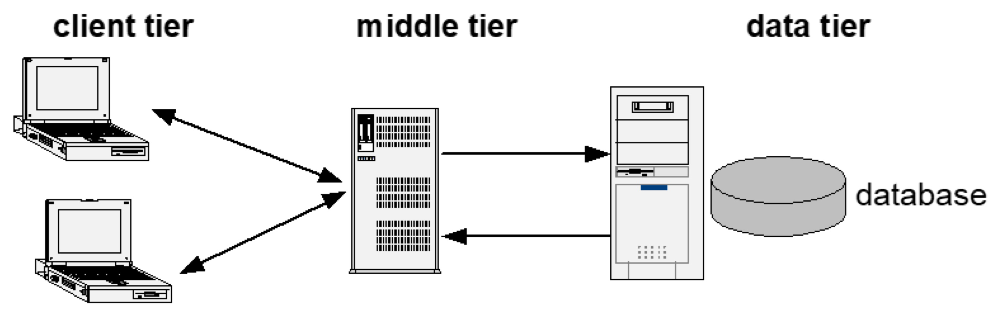
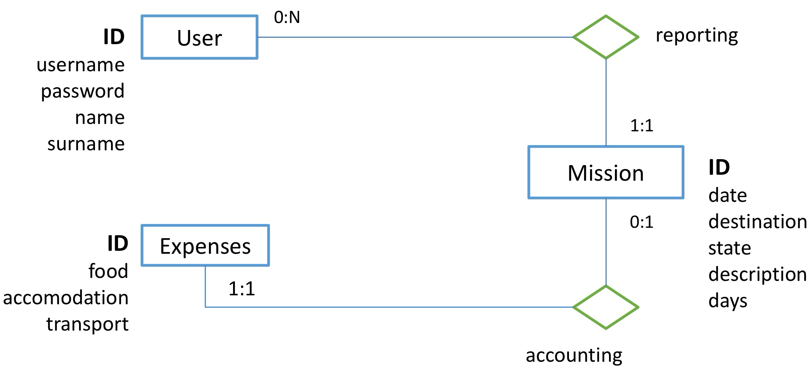

# Application Architectures For Data Integration

## Client Server

* Specialized Hardware
	* The **server** is dedicated to **data management**. It hosts the database and processes data queries, ensuring that it manages the data’s storage, retrieval, and manipulation.
	* The **client** is responsible for the **presentation layout**. This means that it handles the user interface (UI), allowing users to interact with the application, while relying on the server for data.
* Topology: LAN with 1 or more servers and N clients
* Software structure: functional partitioning
	* **Client Software**: The client sends requests to the server (usually through **SQL queries**) to retrieve or manipulate data. The client also handles business logic and presentation logic, which means it can pre-process data, cache responses, or handle part of the business rules on the client-side.
		* The client’s role includes managing **pre-fetching** (retrieving data in advance to improve performance), **caching** (storing data temporarily to avoid redundant requests), and **client-side processing** (processing that happens locally, like calculations or input validation).
	* **Server Software**: The server software processes the client’s query (SQL request) and sends the result (SQL response) back to the client. The server’s responsibilities focus on managing the **data** itself, ensuring that it adheres to **integrity constraints** (rules that keep the data valid) and implementing **stored procedures** (predefined database functions).
		* The server is responsible for all data logic, such as verifying data integrity or running stored procedures (which are pre-written SQL code that performs tasks on the database).

## Three-tiers Architectures

* New element: Middle tier:
	* In addition to the **client tier** and **data (server) tier**, a **middle tier** is introduced. This middle layer sits between the client and the server to help with processing and management tasks.
	* The middle tier typically handles business logic, data validation, and communication between the user-facing client and the data layer.

* Advantages of adding the middle tier:
	* **Centralizes connections to the data server**:
		* Instead of each client directly connecting to the database server, the middle tier manages all the connections. This reduces the load on the database server and can optimize performance.
	* **Masks the data model to the clients**:
		* The middle tier abstracts the complexity of the database structure from the client. Clients don’t need to know how the database is organized, as they communicate with the middle tier, which then interacts with the database. This allows for greater flexibility in managing and updating the database.
	* **Can be replicated to scale up**:
		* The middle tier can be replicated across multiple servers, allowing for horizontal scaling to handle more users or higher data loads. This is essential in larger applications with a large number of clients.

* Variants of Three-tier Architecture:

	* **RPC (Remote Procedure Call)**: The middle tier provides remote procedures that clients can invoke to interact with the server.

	* **Object-Oriented**: The middle tier manages communication using objects and encapsulates business logic.

	* **Message-Oriented**: The middle tier uses message-based communication between components (e.g., using queues and message brokers).

	* **Web**: In web-based applications, the middle tier typically handles HTTP requests from web browsers and sends data back and forth between the client and the database.

## Web "Pure HTML" 3-tiers Architectures

* **Client Tier (Thin Client):**
	* The **client** is a standard web browser (like Chrome, Firefox, or Safari), and its responsibility is primarily to handle the **presentation layer**. This means it only displays the information and user interface (UI) to the end user.
	* The client doesn’t perform any heavy data processing or business logic; it simply sends **HTTP requests** to the middle tier and waits for a response to display the results.
	* Since the client only deals with the presentation layout and not any complex processing, it is called a **“thin client.”**

* **Middle Tier:**

	* The middle tier includes a **web server** that acts as an intermediary between the client and the database (data tier). The web server handles the **HTTP requests** coming from the client.

	* **Hosts the business logic**: The middle tier processes the business logic. For example, it may fetch raw data from the database, apply the necessary transformations, calculations, or rules, and then generate content dynamically before sending it back to the client.

	* **Handles presentation layout**: In some cases, the middle tier also helps with the **presentation markup** by assembling the interface (HTML) that is delivered to the client browser. This allows the middle tier to control how data is presented to the user.
	* The middle tier can also act as a controller, deciding what data to show, depending on the client’s requests, and ensuring security or access control.

* **Data Tier (Server):**
	* The **data tier** or **database server** stores all the application’s data. This server handles **SQL requests** from the middle tier and returns the data needed.
	* The middle tier does not expose the raw data directly to the client. Instead, it processes the data into something meaningful, only sending the results to the client.

## Rich Internet Applications

* **Fusion of web and desktop applications:**
	* **RIAs** combine the **convenience** of web applications (accessible via a browser, no need for installation) with the **interactivity** and rich features of desktop applications (e.g., enhanced user interface, offline capabilities).

* **Enabling Technology: Client-side scripting (with JavaScript):**
	* The **key technology** behind RIAs is **client-side scripting**, often using **JavaScript**. This allows the application to run complex processes on the client-side (in the browser) without needing constant communication with the server.

* **Fat Client:**
	* In this architecture, the **client** (the browser) is responsible for much of the **processing** and functionality, making it a **“fat client.”**
	* This is different from a thin client where most of the work is done on the server. The fat client is similar to the client-server model but uses **standard protocols** (HTTP, WebSocket) and **standard languages** like **ECMAScript** (JavaScript) to communicate with the server.

​	•	APIs like **DOM (Document Object Model)** and **HTML5** are used to manipulate the structure and content of web pages, allowing for dynamic, interactive interfaces.

* **Features of RIAs:**
	* **New Interface Event Types**: RIAs can handle complex UI interactions, including those specific to touch-based devices (e.g., swipe, pinch) and mobile apps.
	* **Asynchronous Interaction (AJAX)**: AJAX allows for **asynchronous data loading**, meaning that parts of the page can be updated without reloading the entire page. This is essential for improving the user experience by making web apps feel faster and more responsive.
	* **Client-side Persistent Data**: RIAs often store data on the client side, which can improve performance and user experience. For example, they might use browser-based storage (localStorage, sessionStorage) to keep data available without requiring constant server requests.
	* **Disconnected / Offline Applications**: RIAs can often operate in **offline mode**, allowing users to interact with the app even without an internet connection. HTML5 introduced the **AppCache** and **Service Workers**, which enable this feature by caching resources locally.
	* **Native Multimedia and 3D Support**: HTML5 and associated technologies like **WebGL** support rich media experiences, including video, audio, and **3D graphics**, natively in the browser without the need for third-party plugins like Flash or Silverlight.

## Three-tier Web Applications with Java EE (Enterprise Edition)

**JEE** is a **platform** that facilitates the development, release, and maintenance of **three-tier web applications**. It’s especially aimed at building enterprise-level applications that need scalability, security, and reliability.

* **API and Technology Specifications**: Java EE defines a set of APIs and technologies (e.g., Servlets, JSP, EJB, JPA) that help developers create robust applications. These are standard, so applications built using these APIs can run across different environments that support Java EE.
* **Development and Release Platforms**: Java EE provides **platforms** for building and releasing applications. These include development tools, libraries, and servers (such as GlassFish, WildFly, and WebLogic) designed to run Java EE applications.
* **Reference Software Implementations**: Java EE includes reference implementations that serve as **blueprints** for how applications should be built using the platform. These can serve as starting points or examples for developers to follow.
* **Compatibility Test Suite**: Java EE applications can be tested for compatibility with the platform using the **Compatibility Test Suite**. This ensures that any Java EE application follows the defined standards and behaves consistently across different environments.

### Why JEE

* **Component-Based Development:** This approach involves building applications by assembling **components**, which are small, self-contained, and loosely coupled software modules. Each component serves a specific functionality or part of the application. Components are modular, meaning they can be developed independently and reused across different applications.

* **Container Services:** Containers in the context of software development provide an **execution environment** where components run. These containers offer a range of services that enhance the application’s behavior and provide various essential functionalities.
	* **Security**: Ensuring the application is secure and manages permissions properly.
	* **Transactional support**: Managing transactions to ensure data consistency.
	* **Scalability**: Enabling the application to scale to handle more users or requests.
	* **Failure recovery**: Providing mechanisms for the system to recover in case of failures.
	* **Interoperability**: Allowing the application to interact with other systems or services.

* **Declarative Development:** Instead of writing procedural code to specify how a task should be performed, **declarative development** allows developers to simply state **what** should be done, and the system takes care of the implementation.
	* **Declarative security**: Specifying security requirements like access permissions without writing custom code to enforce them.
	* **Declarative transactions**: Defining transaction boundaries without manually writing code to manage the transaction lifecycle.
	* **Object-to-relation mapping**: Declaring how objects in a program map to relational database tables (typically done using frameworks like Hibernate or JPA in Java EE).

## Java DataBase Connectivity (JDBC)

* **JDBC API**: The JDBC API was the first industry standard that allowed for database-independent connectivity between Java applications and various databases. This means that Java developers can interact with different databases using a consistent interface, making it easier to switch databases without extensive code changes.
* The JDBC API enables three main functionalities:
	* **Establish a Connection**: It allows a Java application to connect to a database, which is the first step in executing any SQL commands.
	* **Send SQL Statements**: Once connected, JDBC provides methods to send SQL queries (like SELECT, INSERT, UPDATE, DELETE) to the database. This enables the application to interact with the data stored in the database.
	* **Process the Results**: After executing SQL statements, JDBC allows the application to process the results returned by the database, such as reading data from a ResultSet (a data structure that holds the results of a query).
* While JDBC remains a critical part of Java applications that need to interact with databases, it has been somewhat **superseded by JTA (Java Transaction API) and JPA (Java Persistence API)**. These newer APIs provide more features, such as simplified transaction management and object-relational mapping (ORM), which makes it easier to work with databases in an object-oriented manner.

## Servlet

* **Servlets** are Java classes that handle requests and responses in web applications. They are primarily used in the **presentation tier** of a three-tier architecture, interacting with users through web browsers.

	* **Component-Based and Platform-Independent**: Servlets provide a **component-based** architecture, allowing developers to build modular web applications. They can be deployed on any server that supports Java, making them platform-independent.

	* **Access to Other Java APIs**: Servlets have the ability to interact with various other Java APIs, including the **JDBC API**, which allows them to connect to databases and perform data operations. This capability is essential for building dynamic applications that require data retrieval and manipulation.
	* **Execution in a Servlet Container**: Servlets are executed within a **servlet container** (also known as a servlet engine). This container manages the servlet’s lifecycle, including loading, instantiating, and initializing the servlet, as well as handling request and response management.
		* **Concurrency Management**: Handling multiple requests simultaneously, allowing for concurrent processing of requests.
		* **Lifecycle Management**: Managing the servlet’s lifecycle events, such as initialization, request handling, and destruction.

## Enterprise Java Beans

* **Overview of Enterprise JavaBeans (EJB):**
	* **EJB Technology**: EJB is part of the Java EE architecture, designed to create robust and scalable server-side components for enterprise applications.
	* **Business Tier Focus**: EJB is specifically aimed at the **Business Tier** of an application, where the core business logic resides. This is crucial for applications that require complex transaction handling, data processing, and business rules enforcement.

* **Key Features of EJB:**
	* **Distributed, Transactional, and Secure Applications**: EJB allows for the development of applications that can be distributed across multiple servers and support complex transactions while maintaining security.
	* **EJB Components**: These components run within an **EJB container**, which manages the execution of the beans and provides various services to them.

* **EJB Container Services:**
	* **Lifecycle Management**: The EJB container manages the lifecycle of EJB components, including creation, pooling, and destruction.
	* **Transaction Management**: EJB supports complex transaction management, allowing developers to define how transactions are handled in a distributed environment.
	* **Replication and Scaling**: The container offers features for replicating beans and scaling applications, ensuring that they can handle increased load and redundancy.

* **Advanced Language Features:**
	* **Annotations**: Used for simplifying the configuration and deployment of EJB components. Annotations allow developers to specify configuration settings directly in the code.
	* **Dependency Injection**: This is a design pattern used in EJB to manage dependencies between components. It allows the EJB container to provide references to other resources (like databases, other EJBs) at runtime, simplifying the code and enhancing modularity.

* **Integration with Web Front End:**
	* EJB components can be accessed by web applications, allowing the front end to interact with business logic and data access services. This integration facilitates a clear separation between the user interface and business logic, promoting better application design.

## Java Persistence API (JPA)

* **JPA Definition**: JPA is a specification for an interface that facilitates the mapping of relational data (data stored in databases) to object-oriented data in Java. It allows developers to work with database data as Java objects, which is more aligned with Java’s object-oriented nature.
* **Integration**: JPA is integrated into both **Java Standard Edition (Java SE)** and **Java Enterprise Edition (Java EE)**, making it versatile for various types of applications, whether simple desktop applications or large-scale enterprise systems.

* **Components of JPA:**
	* **API Implementation Package**: The core package of JPA is `javax.persistence`, which contains the interfaces and classes that form the JPA specification. Developers use this package to interact with persistence contexts and entity management.
	* **Java Persistence Query Language (JPQL)**: JPA includes a powerful query language called **JPQL**, which allows developers to write database queries using a syntax that is similar to SQL but is designed for working with Java objects rather than directly with database tables. JPQL queries are object-oriented and provide a higher level of abstraction.
	* **Specification of Metadata for Object Relational Mappings (ORMs)**: JPA provides a way to define metadata that describes how Java objects relate to database tables. This metadata can be defined using annotations in the Java code or in XML configuration files. This mapping facilitates the automatic handling of CRUD (Create, Read, Update, Delete) operations by the persistence provider.

* **Supersedes JDBC:** JPA is designed to be a more advanced and simplified approach to data persistence compared to **JDBC (Java Database Connectivity)**. While JDBC is a low-level API that requires more boilerplate code for data handling, JPA abstracts much of this complexity, allowing for easier development and maintenance of data-driven applications.

## Java Transaction API (JTA)

* **JTA Definition**: JTA is an **API** specifically designed for managing transactions in Java. It allows developers to create, commit, and roll back transactions in a way that is independent of the specific resources being used (such as databases or messaging services)
* **Resource-Agnostic**: JTA enables the management of transactions across multiple resources without the developer needing to worry about the specifics of each resource. This means that a single transaction can involve multiple databases or messaging systems seamlessly
* **Managing Multiple Resources**: With JTA, Java components can manage multiple resources within a single transaction. For instance, an application could perform operations on a database while also interacting with a messaging service, ensuring that all actions are part of the same transaction context
* **Transactional Properties**: 
	* **Declaratively**: Using the `@Transactional` annotation, developers can specify transaction boundaries at the method level. This simplifies transaction management by removing the need for explicit transaction demarcation code, making the code cleaner and more maintainable. 
	* **Programmatically**: Through the `UserTransaction` interface, developers can manage transactions in a more fine-grained manner. This allows for starting, committing, and rolling back transactions explicitly in code, offering flexibility for complex transaction management scenarios

## How to Connect an Application to the Database (3-tier, Web)

* **Client Tier**:
	* **Description**: This is the topmost layer where the user interacts with the application. It handles user events (like clicks and inputs).
	* **Components**:
		* **Event Handlers**: These respond to user actions and send requests to the web tier.
		* **Views**: This part displays the GUI (Graphical User Interface) state to the user and updates it based on interactions or responses from the web tier.

* **Web Tier**:
	* **Description**: This middle layer acts as an intermediary between the client and the business/data tier. It processes user requests and coordinates the flow of data.
	* **Components**:
		* **Controllers**: They receive requests from the client, handle the business logic, and determine how to respond. They may redirect or forward requests to appropriate views or models.
		* **View/Data Templates**: These are used to format the data received from the business tier for display to the user.

* **Business and Data Tier**:
	* **Description**: This is the bottom layer that manages the application’s business logic and database interactions.
	* **Components**:
		* **Model Objects**: These represent the data structure of the application and can include various business logic methods.
		* **Data Access Objects (DAOs)**: These handle the interaction with the database. They perform operations like executing queries to fetch or update data.
		* **Database**: The actual data storage where all application data resides.

## Case Study: Expense Report

A Web application supports the management of travel expenses. After logging in, the user accesses a HOME page where there is a list of travel missions; a mission belongs to a user and has a date, a place, a description, a number of days of duration, and a status (“open”, “reported”, “closed”). The list shows the date and place of the missions, which are sorted by date descending. On the HOME page, there is a form, with which the user can create a new mission, by entering all the data, which are mandatory. A new mission is always in the “open” state. After creating a mission, the user is returned to the HOME page.

When the user selects a mission in the list, a MISSION DETAIL page appears, showing all the mission data. If the mission is in the “open” state, a form appears for entering the expenses incurred during the mission; the form contains three fields: food costs, accommodation costs, transport costs. Sending the form data causes the mission status to change from “open” to “reported”, and the return to the MISSION DETAIL page. Total expense should be less than 100€; otherwise, the report is rejected with an error. If the mission is in the “reported” status, a CLOSE button appears, and the user can click on it to declare that he has received the reimbursement; this causes the mission status to change from “reported” to “closed” and the redisplay of the MISSION DETAIL page. If the mission is in the “closed” status, the MISSION DETAIL page shows the mission data completed with the value of the three types of expenditure.

### Database Design

# Java Persistence API Object Relational Mapping

* * * 
