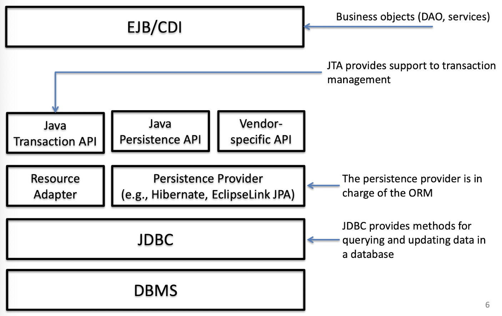
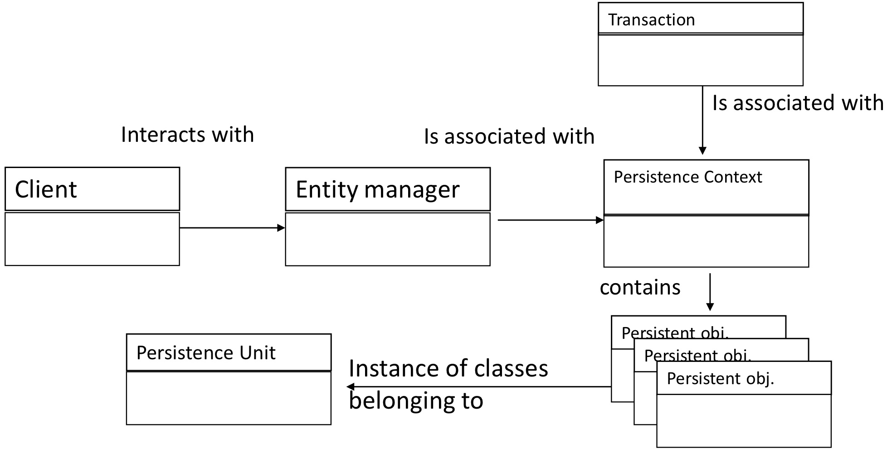
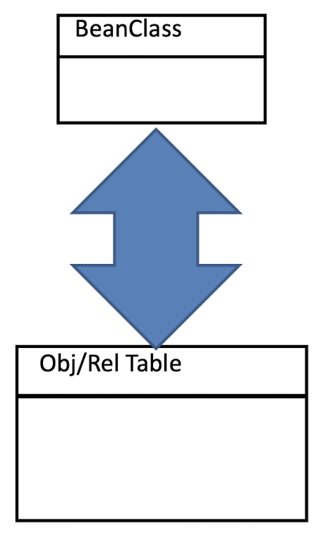
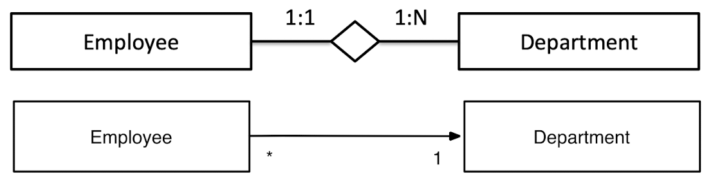
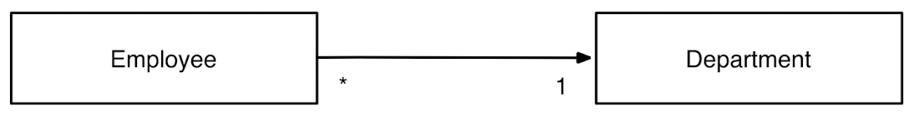
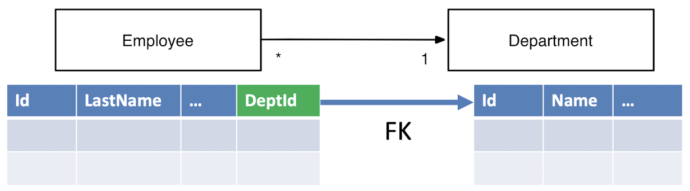
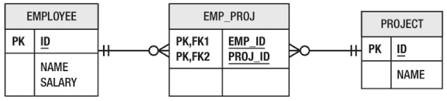

# Object Model v.s. Relational Model

* **Object-Relational Mapping (ORM)**: ORM is a programming technique that allows developers to interact with a relational database using an object-oriented approach. It helps translate data between incompatible type systems in object-oriented programming languages and relational databases.

* **Mapping Concepts**: ORM techniques are designed to map the concepts from the object model (how data is represented in programming languages as objects) onto the relational model (how data is structured in relational databases as tables, rows, and columns). This mapping helps to streamline the interaction between the application and the database.

* **Impedance Mismatch**: This term refers to the difficulties that arise when trying to convert between the object model and the relational model. Since these models are fundamentally different in structure and behavior, certain concepts in one model may not have direct equivalents in the other. For example, an object in programming might have methods (functions) and state (attributes), while a database table primarily contains data in rows and columns without methods.

* **Need for a Mediator**: A mediator is necessary to manage the transformation of data between these two models. The mediator handles the complexities involved in converting objects to a format that the database can understand and vice versa. This allows developers to work with high-level abstractions in their code without needing to manage low-level database interactions directly.


## Differences between OM & RM

| Object Oriented Model (Java)       | Relational Model                                   |
| ---------------------------------- | -------------------------------------------------- |
| Objects, Classes                   | Tables, Rows                                       |
| Attributes, Properties             | Columns                                            |
| Identity (physical memory address) | Primary key                                        |
| Reference to other entity          | Foreign key                                        |
| Inheritance / Polymorphism         | Not supported                                      |
| Methods                            | Stored procedures, Triggers                        |
| Code is portable                   | Not necessarily portable (depending on the vendor) |


# Java Persistence API

* **JPA as a Bridge**:
	* The **Java Persistence API** (JPA) bridges the gap between **object-oriented domain models** (the way data is represented in object-oriented languages like Java) and **relational databases** (which store data in tables with rows and columns). JPA allows Java developers to interact with relational databases using an object-oriented approach, simplifying data handling.

* **POJO (Plain Old Java Object) Model**:
	* JPA works with **POJOs** (Plain Old Java Objects) for object-relational mapping. A POJO is a simple Java object without any special behavior (no business logic or framework dependencies). JPA uses annotations or XML configuration to define how these POJOs should be mapped to relational database tables, allowing automatic persistence of the Java objects to the database.

* **Relation to Previous Proposals**:
	* **JDO (Java Data Objects)**: JPA builds on or complements previous Java technologies like JDO, which also aims to simplify the mapping between Java objects and databases.
	* **JDBC (Java Database Connectivity)**: JPA offers an abstraction layer over **JDBC**, the standard API for interacting with relational databases in Java. While JDBC provides low-level database operations, JPA handles higher-level abstractions for managing entities and their relationships, making it easier to work with databases.

* **Developed as part of JSR-317**:
	* JPA was developed as part of **JSR-317** (Java Specification Request 317), a formal specification for creating a standard persistence framework for Java.
	* **EJB (Enterprise JavaBeans)**: While JPA is commonly used in the context of EJB for enterprise applications, it can also be used in a standalone **Java SE** (Standard Edition) environment without the need for a full Java EE container.
	* This means that JPA is versatile and can be employed both within large enterprise applications (using an EJB container) or in simpler Java desktop or server applications (without a container).


## JPA Architecture




## JPA in a nutshell

**Main feature of JPA**:

* **POJO Persistence**:

	* **POJO** stands for **Plain Old Java Object**, which means that the objects being persisted (saved to the database) do not need to have any special annotations or behavior beyond being a regular Java object. As long as the object is **non-final** and has a **default constructor**, it can be persisted.
	* **No Special Requirements**: JPA does not impose any specific rules on the class being persisted. It allows developers to work with regular Java objects, avoiding the need for custom base classes or special interfaces.

* **Non-intrusiveness**:

	* JPA is **non-intrusive** in the sense that it does not require changes to the structure of the domain objects (i.e., the objects that are mapped to the database). The persistent objects are **unaware** of the persistence layer.
	* This separation allows developers to work with their business logic objects without worrying about the persistence mechanism. In other words, the domain objects are not “polluted” with persistence-specific details, keeping them clean and easy to maintain.

* **Object Queries**:

	* JPA provides a **powerful query framework** that allows you to query entities and their relationships without needing to deal with low-level database concepts such as foreign keys or explicit column names.

	* **JPQL (Java Persistence Query Language)** is used to write queries in an object-oriented way, allowing developers to query the object model rather than directly interacting with the relational database’s SQL syntax.

	* This makes querying more intuitive since developers can query entities (objects) and their relationships as they are represented in Java, without needing to manually manage foreign keys or database-specific SQL syntax.


## JPA Main Concepts

* **Entity**: This refers to a Java class that represents a table in a relational database. Each instance of this class represents a row in that table. Entities are typically JavaBeans (standardized classes) that are used to store data.

* **Persistence Unit**: A persistence unit defines the set of classes (entities) that are managed together and mapped to a single database. Think of it like a “database schema” that groups related classes together for persistence.

* **Persistence Context**: This is a collection of all “managed objects” (entities) that the application currently holds and manages. It’s similar to a “database instance” in that it tracks which objects are currently active and will save their state when needed.

* **Managed Entity**: A managed entity is an instance of an entity class that is currently being tracked by the persistence context. This means any changes to the object’s state (data) are monitored and saved to the database as needed.

* **Entity Manager**: This is an interface provided by JPA to interact with the persistence context. You use the entity manager to create, read, update, and delete (CRUD) entities in the database.

* **Client**: This is any component or part of your application that interacts with the persistence context via the entity manager. For example, an EJB (Enterprise JavaBean) component can be a client that makes use of the entity manager to interact with the database.


# How to work with Entities




# Entity Manager Interface 

The Entity Manager exposes all the operations needed to synchronize the managed entities in the persistence context to the database

| Method Signature                                             | Description                                                  |
| :----------------------------------------------------------- | ------------------------------------------------------------ |
| `public void persist(Object entity);`                        | This method saves the provided entity to the database. It effectively “persists” the entity, meaning it adds it to the persistence context and then inserts it as a new row in the corresponding database table. |
| `public <T> T find(Class<T> entityClass, Object primaryKey)` | This method retrieves an entity from the database based on its primary key. It returns an instance of the entity class specified. If the entity with the given primary key exists in the database, it will be returned; otherwise, it will return null. |
| `public void remove(Object entity);`                         | This method deletes an entity from the database. When you call remove with an entity, the entity manager will mark it for deletion, and the database row corresponding to this entity will be deleted. |
| `public void refresh(Object entity);`                        | This method reloads the entity’s state from the database, essentially discarding any changes that were made to the entity in the persistence context but not yet committed to the database. It resets the entity to the latest state in the database. |
| `public void flush();`                                       | This method forces the entity manager to immediately write any changes made in the persistence context to the database. Normally, changes are saved automatically at the end of a transaction, but `flush()` can be used to synchronize the state of the persistence context with the database at any point. |


# Entity

* **Entity as a Java Bean (POJO)**: An entity is a Plain Old Java Object (POJO) or JavaBean that represents a table in the database.

	* **Class to Table Mapping**: The entity class itself represents the table in the database.

	* **Object to Tuple Mapping**: Each instance (object) of the entity class represents a row (or tuple) in that table.

* **Persistent Counterpart**: The entity’s persistent counterpart (the data stored in the database) can outlive the lifecycle of the application. This means that the data remains in the database even if the application is restarted or closed, as it is stored permanently.

* **Mapping Requirement**: An entity class must be explicitly mapped to a database table. This mapping links the Java object structure to the relational database structure, allowing JPA to understand how to store and retrieve the data.

* **Managed State**:

	* An entity can enter a **managed state** when it is being tracked by the JPA persistence context. In this state, any changes made to the object’s data are monitored and automatically synchronized to the database.

	* This managed state simplifies data persistence, as JPA takes care of updating the database without requiring explicit save or update calls for each change.


## Propertities



* **Identification (Primary Key)**: Each entity must have a primary key that uniquely identifies each instance (row) in the database table. This primary key is essential for retrieval, updates, and deletion of records.

* **Nesting**: Entities can have nested or embedded objects within them. For example, an address object might be embedded within a customer entity. This allows complex structures within an entity, mapping them as part of the same database table or related tables.

* **Relationship**: Entities often have relationships with other entities, such as one-to-one, one-to-many, or many-to-many associations. These relationships map to foreign keys in the database, enabling complex data structures and dependencies.

* **Referential Integrity (Foreign Key)**: Referential integrity ensures that relationships between entities are maintained. For example, if an entity has a foreign key reference to another entity, that reference must exist in the other table. This helps maintain data consistency across related tables.

* **Inheritance**: Entities can inherit properties from other entities. This is useful for creating hierarchies or abstract entities where a base class provides common fields, and subclasses represent specific types. JPA provides strategies (such as joined tables or single-table inheritance) to handle these inheritance relationships in the database.


## Example

```java
// This annotation marks the Employee class as a JPA entity, meaning it represents a table in the database. The @Entity annotation tells JPA to treat this class as a table and its instances as rows in that table
@Entity
public class Employee {
  	// The @Id annotation marks the id field as the primary key of the entity. This field uniquely identifies each instance of Employee in the database. In this example, id is an integer that serves as the primary key.
    @Id private int id;
    private String name;
    private long salary;
    
    public Employee() {}
    public Employee(int id) { this.id = id; }
    public int getId() { return id; }
    public void setId(int id) { this.id = id; }
    public String getName() { return name; }
    public void setName(String name) { this.name = name; }
    public long getSalary() { return salary; }
    public void setSalary(long salary) { this.salary = salary; }
}
```


## Constraints

* **No-Argument Constructor**: The entity class must have a `public` or `protected` no-argument (default) constructor. This is required so that the JPA framework can instantiate the entity class without needing specific parameters.

* **Class Should Not Be Final**: The entity class itself must not be declared `final`. If it were `final`, it would prevent the JPA provider from using techniques like proxies to manage the entity’s lifecycle and behavior dynamically.

* **No Final Methods or Persistent Variables**: None of the methods or instance variables that represent persistent data should be marked as `final`. This restriction ensures that JPA can extend or override methods and manage variables for various persistence operations.

* **Serializable Interface for Detached Instances**: If an entity instance is to be detached and passed by value (for example, across network boundaries in a distributed system), it should implement the `Serializable` interface. This allows the entity to be serialized and deserialized, maintaining its state when transferred.

* **Persistent State and JavaBean Properties**: The entity’s persistent state (its instance variables) should correspond to JavaBean proper ties, meaning the class should have getter and setter methods. This convention allows JPA to access and modify the entity’s fields following standard JavaBean patterns.


## Identification

**Primary Key (Identity)**: In a database, each record (or row) is identified by a **primary key**, which uniquely identifies it within the table. An entity in JPA assumes the identity of the persistent data (database row) it represents. This means that the entity’s primary key uniquely identifies it within the persistence context and database.

* **Simple Primary Key**: A simple primary key is a single field in the entity that represents its unique identity in the database. This is the most straightforward way to define a primary key, using a single persistent field like id.
* **Composite Primary Key**: A composite primary key consists of multiple fields that together uniquely identify an entity. This approach is used when a single field is insufficient to uniquely identify each instance. The combination of these fields forms the unique identity of the entity.

**Remark**: With respect to the POJOs, the persistent identity is a new concept. **POJOs do not have a durable identity**.


### Syntax

* **Simple Primary Key (@Id)**:
	* The `@Id` annotation is used to mark a field as the primary key for the entity. In this example, the id field in the Mission class is annotated with `@Id`, making it the primary key of the entity.
	* A simple primary key is a single field that uniquely identifies each instance of the entity in the database.

* **Composite Primary Key**:
	* **@EmbeddedId**: This annotation is used when a separate embeddable class is created to hold the composite key fields. This class is then referenced in the main entity class as the primary key.
	* **@IdClass**: This annotation is used to specify a separate class that contains the composite key fields and is referenced as a type for the primary key in the main entity class.


## Identifier Generation

* **Automatic Identifier Generation**:
	* In many applications, it’s convenient not to manually manage the uniqueness of primary keys for each entity instance. Instead, JPA can automatically generate unique identifiers when a new entity is saved.
	* This automatic identifier generation is managed by the persistence provider (such as Hibernate).

* **@GeneratedValue Annotation**:
	* The `@GeneratedValue` annotation is used to specify that the primary key should be generated automatically by the persistence provider.
	* When this annotation is applied to a primary key field, JPA takes responsibility for creating unique values for each new instance of the entity, ensuring that each entity has a distinct identifier without developer intervention.


### Options

Applications can choose one of four different ID generation strategy

| Id Generation Strategy | Description                                                  |
| ---------------------- | ------------------------------------------------------------ |
| `AUTO`                 | The provider generates identifiers by using whatever strategy it wants |
| `TABLE`                | Identifiers are generated according to a generator table     |
| `SEQUENCE`             | If the underlying DB supports sequences, the provider will use this feature for generating IDs |
| `IDENTITY`             | If the underlying DB supports primary key identity columns, the provider will use this feature for generating IDs |


### Annotation

```java
@Id
// The strategy parameter allows you to define the generation strategy
// In this case, GenerationType.IDENTITY tells the database to handle unique ID generation, usually through an auto-increment feature.
@GeneratedValue(strategy = GenerationType.IDENTITY)
private int id;
```


* When possible, it’s best to let the database manage unique ID generation. This is efficient and ensures that primary keys are generated consistently according to database rules.


## Attribute Specifications

* **Mapping Basic and Special Types**: Attributes in entities can be mapped to basic and special data types, including:
	* **Large Objects (LOBs)**: These are attributes that store large data, such as binary files or images. They are mapped with the `@Lob` annotation.
	* **Enumerated Types**: Java enumerations can be mapped either as Java enums or as strings in the database. This is helpful for attributes with a fixed set of possible values.
	* **Temporal Types**: Date and time types (temporal types) can be stored using `@Temporal` with types like `TemporalType.DATE` to specify how the date is stored in the database.

* **Specifying Fetch Policy**:
	* **FetchType.LAZY**: The `LAZY` policy delays loading the attribute’s data until it’s explicitly accessed. This is useful for large data (like LOBs) to avoid loading them immediately, which saves memory and processing time.
	* **FetchType.EAGER**: The `EAGER` policy (default) loads the attribute data immediately when the entity is loaded. This is suitable for smaller attributes that are accessed frequently.

```java
@Entity
public class Mission implements Serializable {
  @Id
  @GeneratedValue(strategy=GenerationType.IDENTITY)
  private int id;
  
  // Specifies that the date attribute is stored as a date in the database, ignoring time components
  @Temporal(TemporalType.DATE)
  private Data date;
  
  // status represents an enumerated type (MissionStatus) which could be mapped as an enum or string in the database
  private MissionStatus status;
  
  // Specifies lazy fetching for the photo attribute, meaning it won’t load immediately with the rest of the entity
  @Basic(fetch=FetchType.LAZY)
  // Specifies that photo is a large object (e.g., a binary or large text file), ideal for images, documents, etc
  @LOB
  private byte[] photo;
}
```


## Object to Table Mapping

```java
@Entity
@Table(name="T_BOOKS")
public class Book {

    @Column(name="BOOK_TITLE", nullable=false)
    private String title;
    private CoverType coverType;
    private Date publicationDate;

    @Transient
    private BigDecimal discount;
}
```

* **Default Mapping**:
	* By default, an entity’s class name is used as the table name, and its fields are mapped to columns with the same names. However, JPA allows you to override these defaults.
* **Overriding Defaults**:
	* The `@Table` annotation can be used to specify a custom table name for the entity. 
		* In the example, `@Table(name="T_BOOKS")` specifies that the Book entity should map to a table named `T_BOOKS` instead of the default `Book`.
	* The `@Column` annotation can be used to rename a column and set additional attributes. 
		* For instance, `@Column(name="BOOK_TITLE", nullable=false)` maps the title field to a column named `BOOK_TITLE` and specifies that this column cannot be null.

* **Additional Column Attributes**:
	* The `@Column` annotation can include various attributes that affect the database schema. 
		* In this case, the `nullable=false` attribute ensures that the `BOOK_TITLE` column will not accept `NULL` values.

* **Transient Fields**:
	* The `@Transient` annotation is used to mark a field as non-persistent, meaning it will not be stored in the database. 
		* In the example, the discount field is marked as `@Transient`, so it will not be mapped to any column in `T_BOOKS`.


# Entities & Relationships

* **Entities**: In ORM, entities represent objects or data models that are mapped to database tables.

* **Relationships**: Entities often need relationships with other entities to accurately model real-world data. The relationships define how entities are connected and interact with each other.

* **Ambiguity in Relationships**: The term “relationship” can be ambiguous. It can have different meanings in the Entity-Relationship (ER) model and in the Object Model. The slide suggests using the term “relationship” according to the Object Model moving forward.

* **Types of Relationships**: The diagram provides examples of possible relationships:

	* **1:1 Relationship**: One Employee is associated with one Department.
	* **1:N Relationship**: One Department can have multiple Employees.
	* *** to 1 Relationship**: Multiple Employees can be associated with a single Department.

	


## Relationship Concepts

* **Directionality**: Each of the two entities may have an attribute that enables access to the other. This means that relationships can be unidirectional or bidirectional, determining how entities reference each other.

* **Role**: Each entity in the relationship has a role concerning the direction of access. This role defines the purpose or function of each entity within the relationship.

* **Cardinality**: Cardinality specifies the number of entity instances that exist on each side of the relationship. It includes options like one-to-one, one-to-many, and many-to-many relationships.

* **Ownership**: One of the two entities in the relationship is considered to “own” the relationship. Ownership usually determines which entity is responsible for managing the relationship, often used in ORM to dictate cascade operations and lifecycle management.


### Directionality

* **References Between Entities**:
	* **Bidirectional Relationship**: When each entity in the relationship refers to the other, it is considered bidirectional. This means both entities can access each other.
	* **Unidirectional Relationship**: If only one entity has a reference to the other, the relationship is unidirectional. This means only one entity can access the other, not vice versa.

* **Reference Types**:
	* The reference between entities can either be **single-valued** (one-to-one) or **set-valued** (a collection, like one-to-many or many-to-many).

* **JPA Relationships**:
	* In JPA, all relationships are **unidirectional** by default.
	* **Bidirectional Relationships in JPA**: To create a bidirectional relationship, you need to define two unidirectional mappings (one in each entity). These mappings should be “matched” to represent a bidirectional connection.
	* mappedBy **Attribute**: The mappedBy attribute is used in JPA to declare which entity owns the relationship and ensures consistency in bidirectional relationships. This attribute specifies the field in the other entity that maps back to the current entity.


### Role

* **Roles Based on Directionality**: In a relationship, directionality determines that one entity plays the role of the **source** and the other as the **target**.

* **Example of Roles**: In a relationship from **Employee** to **Department**:

	* **Employee** is the **source entity**.
	* **Department** is the **target entity**.

	


### Cardinality

* Each role in the relationship has its own cardinality
	* **Many-to-One**: Many source entities relate to one target entity.
	* **One-to-Many**: One source entity relates to many target entities.
	* **One-to-One**: One source entity relates to one target entity.
	* **Many-to-Many**: Many source entities relate to many target entities.
* **Bidirectional Relationships**: In the Entity-Relationship (ER) model, bidirectional relationships are essentially pairs of matched unidirectional relationships, with swapped source and target roles for each entity.
* **To-One and To-Many**:
	* **To-One** relationships imply that the source entity has a single reference to the target entity.
	* **To-Many** relationships imply that the source entity has multiple references (a collection) to the target entity.


### Ownership

* **Foreign Key and Join Column**:

	* In relational databases, relationships are implemented through a **foreign key (FK)** column that references the primary key of the related table.

	* In JPA, this foreign key column is referred to as a **join column**.

	* **Example of a Many-to-One Relationship**:

		* Consider a **many-to-one** unidirectional relationship between Employee and Department.
		* The Employee table includes a foreign key column (e.g., `DeptId`) that references the primary key in the Department table.

		

* **Owner and Owning Side**:

	* In **1:N** (one-to-many) and **1:1** (one-to-one) relationships, one entity will have the foreign key column in its table. This entity is the **owner** of the relationship, and its side is called the **owning side**.
	* Example: If Employee has a reference to Department, Employee is considered the owner of the relationship.

* **Importance of Ownership**:

	* Ownership is critical because the **annotations** that define the relationship’s mapping (e.g., the foreign key column) are placed on the **owning side**. This allows JPA to manage the relationship accurately in the database.


## Possible Relationship Mappings

* **1:N (One-to-Many)**:
	* Can be **Bidirectional** or **Unidirectional**.
	* Unidirectional mapping can represent either a one-to-many or many-to-one relationship.

* **1:1 (One-to-One)**:
	* Can be **Bidirectional** or **Unidirectional**.

* **N:M (Many-to-Many)**:

	* Can also be **Bidirectional** or **Unidirectional**.

* **Choosing Unidirectional or Bidirectional**:

	* The choice depends on the application requirements.

	* If the relationship needs to be accessed from both entities, **bidirectional** mapping is preferred.
	* If access is only required from one side, **unidirectional** mapping is usually sufficient.

* **Notes**:
	* **Bidirectionality** can sometimes be achieved by combining unidirectional mappings with set-valued queries.
	* **Performance Considerations**: In some cases, performance needs may justify defining bidirectional mappings even if only one direction is commonly used.


### 1:N Bidirectional

* **Annotations Used**:

	* The relationship is defined using `@ManyToOne`, `@OneToMany`, and mappedBy annotations.
	* `@ManyToOne` is applied to the entity with multiple instances related to one instance of the other entity.

* **Ownership**:

	* The entity with the `@ManyToOne` annotation is the **owner** of the relationship, meaning its table stores the **foreign key (FK)** that references the related table.

* **Using @JoinColumn**:

	* The `@JoinColumn` annotation can specify the foreign key column name in the table. If not specified, it defaults to the name of the field or property.

		```java
		@Entity
		public class Employee {
		    @Id private int id;
		
		    @ManyToOne
		  	// it defines a custom name for the FK column in the Employee table, which references the Department table
		    @JoinColumn(name="dept_fk")
		    private Department dept;
		  
		    // other fields and methods...
		}
		```


* **Achieving Bidirectionality**:

	* To make the relationship bidirectional, both sides of the mapping must be specified.
	* This involves adding a `@OneToMany` annotation to the entity that participates with only one instance (the target of the many-to-one relationship).

* **Using @OneToMany**:

	* The `@OneToMany` annotation is applied to a **collection** data member (e.g., a Collection or List) in the entity that holds a reference to multiple instances of the other entity.

	* The mappedBy attribute is used to indicate the property in the other entity (the owning side) that refers back to this entity.

		```java
		@Entity
		public class Department {
		    @Id private int id;
		
		    // The Department entity has a @OneToMany relationship with Employee, referencing the dept field in Employee
		  	// The attribute on the target entity that implements the inverse of the relationship
		    @OneToMany(mappedBy="dept")
		    private Collection<Employee> employees; // Collection data member
		    
		  // other fields and methods...
		}
		```

* **Ownership**:

	* In a one-to-many mapping, the owner of the relationship is still the entity that has the `@ManyToOne` annotation, as it holds the foreign key in its table.


#### @joincolumn v.s. mappedBy

* **@JoinColumn**:
	* Specifies the foreign key (FK) column in the database that implements the relationship.
	* Typically placed on the **owning side** of the relationship, meaning the entity that actually contains the FK column.
	* Drives the SQL generation to retrieve associated entities by specifying the column that links the two tables.

* **mappedBy**:
	* Indicates that this side of the relationship is the **inverse** of the relationship, with the **ownership residing in the other entity**.
	* Commonly used in **bidirectional relationships** to specify which attribute in the other entity owns the relationship.
	* By using mappedBy, JPA understands that this entity does not own the relationship, preventing it from creating a duplicate join column.


##### Why specifying MappedBy

* **Default JPA Mapping without** mappedBy:
	* If the mappedBy parameter is not specified, JPA’s default behavior creates a **bridge table** when generating the database schema.
	* This is similar to the setup for **N:M (many-to-many) relationships**, where a bridge table is used to link the two entities.

* **Purpose of** mappedBy:
	* The mappedBy parameter instructs JPA **not to create a bridge table** because the relationship is already mapped by a foreign key in the opposite entity.
	* mappedBy indicates that the other entity owns the relationship, thus avoiding the need for a redundant table.


### Uni-directional 1:N

#### Many-to-one

* **Unidirectional Access**:

	* In some applications, access to a relationship is only required in one direction, making a bidirectional mapping unnecessary.
	* This simplifies the relationship, as it only involves mapping in one direction.

* **Trivial Many-to-One Mapping**:

	* In a unidirectional many-to-one relationship, only the entity with the many side (e.g., Employee) needs to reference the one side (e.g., Department).
	* The inverse mapping on the Department side is omitted.

* **Annotations**:

	* The same annotations used in the bidirectional case can be applied here, but without the inverse side (`@OneToMany` and mappedBy are omitted).

	* `@ManyToOne` and `@JoinColumn` specify the relationship and foreign key column in the owning entity.

		```java
		@Entity
		public class Employee {
		    @Id private int id;
		
		    @ManyToOne
		    @JoinColumn(name="dept_fk")
		    private Department department;
		    
		  	// other fields and methods...
		}
		```

		

#### One-to-many

* **One-to-Many Direction**: 

	* Implementing unidirectional one-to-many relationships is less straightforward than many-to-one because it usually involves additional considerations for performance and retrieval of data.

* **Two Viable Alternatives**:

	* **Alternative 1**: Map the relationship as in the bidirectional case and use only the one-to-many direction.

		* This means defining the `@OneToMany` relationship in the entity that has a single instance related to multiple instances of the other entity.

	* **Alternative 2**: Do not map the collection attribute in the entity that participates with one instance. Instead, use a **query** to retrieve the correlated instances based on the inverse (many-to-one) mapping.

		* This approach avoids maintaining a collection attribute for the one-to-many side and relies on querying when needed.

			```java
			// This query retrieves all Employee entities that are associated with a specified department by matching the dept.id
			List<Employee> emps = entityManager.createQuery(
			    "SELECT e " +
			    "FROM Employee e " +
			    "WHERE e.dept.id = :deptId", Employee.class)
			    .setParameter("deptId", "DEIB")
			    .getResultList();
			```


### One-to-one Mapping

* **Owner of the Relationship**:
	* In a one-to-one mapping, one of the entities is considered the **owner** of the relationship. The owner is the entity with the foreign key (FK) column in the database, which points to the associated entity’s primary key.
	* Either entity can be the owner, depending on the database design and application requirements.

* **Defining the One-to-One Mapping**:

	* The `@OneToOne` annotation is used on the owner entity to establish the one-to-one relationship.

		```java
		@Entity
		public class Employee {
		    @Id private int id;
		
		  	// Specifies that each Employee is associated with one ParkingSpace
		  	// Employee is the owner of the relationship with ParkingSpace
		    @OneToOne
		    private ParkingSpace parkingSpace;
		    
		  	// other fields and methods...
		}
		```


* **Bidirectional One-to-One Mapping**:

	* If the one-to-one mapping is bidirectional, the inverse side of the relationship must also be specified.
	* In the non-owning entity, the @OneToOne annotation is used with the mappedBy attribute to indicate that this side is the inverse.

* **Using mappedBy**:

	* The mappedBy attribute tells JPA that the foreign key is managed by the other entity.

	* This prevents JPA from creating an additional column or table for the foreign key in the inverse entity.

		```java
		@Entity
		public class ParkingSpace {
		    @Id private int id;
		
		    // Indicates that the Employee entity owns the relationship, and the foreign key is in the Employee table
		  	// ParkingSpace is the non-owner (inverse) side of the relationship with Employee.
		    @OneToOne(mappedBy="parkingSpace")
		    private Employee employee;
		    
		  	// other fields and methods...
		}
		```

		

### Many-to-many Mappings

* **No Foreign Key Column**:
	* In a many-to-many relationship, there is no direct foreign key column in either entity’s table.
	* Instead, this type of mapping is implemented using a **join table** (also known as a **bridge table**), which holds the foreign keys from both entities.

* **Ownership in Many-to-Many**:

	* Since a join table is used, either entity can be designated as the owner of the relationship.

	* This choice of owner is arbitrary and can be based on the application’s requirements.

		```java
		@Entity
		public class Employee {
		    @Id private int id;
		
		  	// Establishes the many-to-many relationship with Project.
		    @ManyToMany
		    private Collection<Project> projects;
		    
		  	// other fields and methods...
		}
		```


* **Bidirectional Many-to-Many Mapping**:

	* If a many-to-many relationship is bidirectional, both sides of the relationship need to be specified.
	* This involves defining the inverse side of the relationship in the other entity.

* **Using mappedBy in the Inverse Entity**:

	* In the non-owning entity, the `@ManyToMany` annotation should include the mappedBy attribute.

	* The mappedBy attribute specifies that the other entity owns the relationship and defines the field in that entity which holds the relationship.

		```java
		@Entity
		public class Project {
		    @Id private int id;
		
		  	// Employee is the owner of the many-to-many relationship
		  	// The mappedBy="projects" attribute in Project refers to the projects field in Employee, creating the bidirectional link
		    @ManyToMany(mappedBy="projects")
		    private Collection<Employee> employees;
		    
		  	// other fields and methods...
		}
		```
		
		

#### Join Table

* **Bridge Table Requirement**:
	* In a many-to-many relationship, a **bridge table** (also known as a join table) is required in the database schema.
	* This join table holds the foreign keys from both entities involved in the relationship.

* **Specifying the Join Table with @JoinTable**:

	* The `@JoinTable` annotation is used to customize the name of the join table and the columns representing the relationship.

	* name specifies the join table’s name.

	* `joinColumns` defines the foreign key column from the owning entity.

	* `inverseJoinColumns` defines the foreign key column from the other (inverse) entity.

		```java
		@Entity
		public class Employee {
		    @Id private long id;
		    private String name;
		
		    @ManyToMany
		    @JoinTable(name="EMP_PROJ",
		               joinColumns=@JoinColumn(name="EMP_ID"),
		               inverseJoinColumns=@JoinColumn(name="PROJ_ID"))
		    private Collection<Project> projects;
		    
		  // other fields and methods...
		}
		```

		

* **Default Naming Convention**:
	* If `@JoinTable` is not specified, JPA will create a default join table using the format `<Owner>_<Inverse>`, where `<Owner>` and `<Inverse>` are the names of the owning and non-owning entities, respectively. For example, the default name would be `Employee_Project`.


## Relationship Fetch Mode

```java
@Entity
public class Employee {
    @Id private int id;

    // the parkingSpace relationship in Employee is loaded only when accessed, optimizing performance by deferring the data retrieval until it is needed
    @OneToOne(fetch=FetchType.LAZY)
    private ParkingSpace parkingSpace;
    
  	// other fields and methods...
}
```

* **Loading Related Entities**:

	* When an entity is loaded, it may not be necessary to load related entities immediately.
	* **Lazy Loading** defers fetching related entities until they are actually needed, which can improve performance by reducing the initial data load.

* **Lazy vs. Eager Loading**:

	* **Lazy Loading**: Only fetches the related data when accessed. This pattern optimizes performance by minimizing the SQL executed and loading data only when required.
	* **Eager Loading**: Fetches related entities immediately along with the main entity, which may be useful if related data is always needed.

* **Loading Policy**:

	* The loading policy can be specified for relationships in JPA using the fetch attribute in annotations, allowing control over when related data is loaded.

* **Performance Optimization**:

	* **Lazy Loading** is often more efficient for relationships that are infrequently accessed, as it reduces the volume of SQL executed and the amount of data fetched at once.
	* At the relationship level, lazy loading can significantly enhance performance, especially in applications where correlated entities are seldom accessed.

* **Default Fetch Modes**:

	* If the fetch mode is not explicitly specified:
		* **Single-valued relationships** (e.g., `@OneToOne`) are fetched **eagerly** by default.
		* **Collection-valued relationships** (e.g., `@OneToMany` or `@ManyToMany`) are fetched **lazily** by default.

* **Fetch Mode in Bidirectional Relationships**:

	* In bidirectional relationships, the fetch mode can be configured differently on each side. For example, one side can be set to **lazy** and the other to **eager** depending on how the relationship is accessed.

* **Recommendation for Lazy Loading**:

	* Lazy loading is often recommended for most relationships. If an entity has multiple single-valued relationships that are rarely accessed by the application, eager loading can lead to performance issues by fetching unnecessary data.

* **Lazy Loading as a Hint**:

	* The directive to load an attribute lazily serves as a **hint** to the persistence provider (e.g., Hibernate).
	* The provider is not obligated to strictly adhere to the lazy loading request if it determines that eager loading is more appropriate or efficient.

	* The persistence provider may choose to load the attribute eagerly if it does not compromise the entity’s behavior. This flexibility helps optimize performance based on the provider’s internal logic.

* **Importance of Eager Loading**:

	* Specifying **eager loading** is more enforceable and may be critical for applications, especially when accessing an entity after it has been detached (i.e., no longer managed by the persistence context).
	* For detached entities, eager loading ensures that required data is available without needing to access the database again.


# Cascading Operations

* **Default Behavior**:
	* By default, an **EntityManager** operation (e.g., persist, merge, remove) applies **only to the entity provided as an argument**.
	* This means that the operation will **not cascade** to related entities connected to the supplied entity.

* **Non-Cascading Behavior**:

	* This non-cascading behavior is often the desired default, especially for operations like **`remove()`**. For instance, deleting an entity without affecting its related entities might be the preferred behavior in many cases.

* **Operations That Require Cascading**:

	* Some operations, like `persist()`, often benefit from cascading, especially when there is a parent-child (or dependent) relationship.
	* When a parent entity (e.g., an Employee) has a relationship with a child entity (e.g., an Address), the child should be persisted along with the parent.

* **Example Scenario**:

	* In a **many-to-one unidirectional mapping** between Employee and Address, each employee has a related address.

	* If cascading is not configured, both the Employee and Address would need to be explicitly persisted.

		```java
		Employee emp = new Employee();
		Address addr = new Address();
		emp.setAddress(addr);
		
		// Here, persist(addr) and persist(emp) are both required, which is not ideal if we want to avoid explicit persistence of the Address.
		em.persist(addr);  // Explicitly persisting Address
		em.persist(emp);   // Explicitly persisting Employee
		```

* **Cascade Attribute**:

	* The cascade attribute is used to specify when operations (e.g., persist) should automatically cascade to related entities.

	* This allows the **EntityManager** to manage not only the primary entity but also its related entities.

* **Cascade Example with `persist()`**:

	* When the Employee entity is added to the persistence context, the cascade setting on the address relationship ensures that any new Address entity linked to Employee is also persisted.

	* This eliminates the need to manually persist the Address entity.

		```java
		@Entity
		public class Employee {
		  	// meaning that when Employee is persisted, Address will be persisted automatically if it’s a new entity
		    @ManyToOne(cascade=CascadeType.PERSIST)
		    private Address address;
		}
		```

* **Setting the Relationship Before Persistence**:

	* The Address instance must be set on the Employee instance before calling `persist()` on Employee.

	* If Employee references an Address that hasn’t been persisted or isn’t managed by the persistence context, an error will occur unless cascading is enabled.

* **CascadeType Options**: The cascade attribute in JPA accepts several values from the CascadeType enumeration, which determine the specific operations that should cascade to related entities:

	* **`PERSIST`**: Cascade the persist operation to the related entity.
	* **`REFRESH`**: Cascade the refresh operation to the related entity.
	* **`REMOVE`**: Cascade the remove operation to the related entity.
	* **`MERGE`**: Cascade the merge operation to the related entity.
	* **`DETACH`**: Cascade the detach operation to the related entity.

	* **`ALL`**: A shorthand for cascading all five operations (PERSIST, REFRESH, REMOVE, MERGE, and DETACH) to the related entity.

* **Unidirectional Cascade Settings**:

	* Cascade settings in JPA are **unidirectional**. They only affect the relationship on the side where they are explicitly set.
	* If cascading behavior is required on both sides of a relationship, it must be explicitly specified on both entities.

* **Default Behavior**:

	* There is **no default cascade type** in JPA. By default, **no operations** are cascaded, meaning each entity must be managed independently unless cascade options are configured.


# Orphan Removal

* **Orphan Removal**:

	* JPA provides **orphan removal** as a cascading option to handle child entities that are no longer associated with a parent.

	* It is appropriate for **privately owned** parent-child relationships where each child entity has only one parent entity.

* **Behavior**: When **orphan removal** is enabled (`orphanRemoval=true`), JPA will automatically delete the child entity from the database if:

	* The parent-child relationship is broken by setting the child reference to null.
	* The child entity is removed from a collection in the parent entity (in a one-to-many relationship).

* **Difference Between `CascadeType.REMOVE` and `orphanRemoval=true`**:

	* With **orphan removal**: If `setEmployees(null)` is called on a Department entity (no employees associated with that department anymore), any Employee entities previously associated with that Department will be removed from the database automatically.

	* With `CascadeType.REMOVE` alone: Calling `setEmployees(null)` on Department will disassociate Employee entities but will **NOT remove them from the database**.