# Sorting v.s. Ranking

* **Sorting**

	* **Definition:** Sorting is organizing data based on a specific attribute or criteria, usually in a logical sequence (e.g., alphabetical order, chronological order).

	* **Example:** In the case of publications:

		* **Purpose:** If someone wants to list publications on a personal homepage for easy browsing.

		* **Method:** Sorting by date in descending order (most recent publications first) is appropriate and sufficient.

* **Ranking**

	* **Definition:** Ranking is evaluating and ordering data based on its quality, relevance, or importance, often involving subjective or weighted criteria.

	* **Example:** When evaluating a candidate for a professor position:

		* **Purpose:** The focus shifts to the **quality** of publications rather than their recency.

		* **Method:** Publications need to be ranked based on their impact or the prestige of the journals/conferences where they were published. For this, a quality ranking system (e.g., Scimago Journal Rank [SJR] or CORE) is used.

		* **Challenge:** Different organizations use varying methods to assess quality, and achieving a **consensus** on quality can be complex.


# Multi-objective Optimization

* **Trade-offs Between Attributes**:

	* When ranking objects by quality attributes, improving one attribute (e.g., reliability) may worsen another (e.g., cost). This is the trade-off challenge.

	* The goal is to find the best balance among competing attributes.

* **Multi-Criteria Optimization**:

	* It involves simultaneously optimizing different criteria, which often conflict with one another.

	* Example: A system that seeks high performance (e.g., speed) while minimizing cost and maintaining reliability.

* **Problem Formulation**:

	* You have **N objects**, each described by **d attributes** (features or criteria).

	* There is a notion of “goodness” that helps to evaluate how well each object meets the criteria.

	* The task is to select the **best k objects** (top-ranked items) according to this evaluation.

		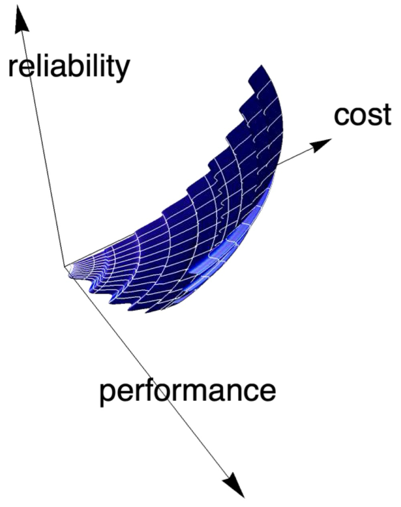

	

# Problem Definitions

**Task:** Given a set of objects, determine the “best” ones based on specific criteria. This involves different methods depending on the context.

* ==**Rank Aggregation**==:

	* **Purpose:** Combine multiple ranked lists into a single, robust consensus ranking.

	* **Use Case:** When you have rankings from various sources (e.g., different ranking systems for journals or universities), and you want to merge them into a unified ranking.

	* **Challenge:** Aggregating rankings must account for potential conflicts or differences in criteria across lists.

* ==**Ranking (aka Top-k Queries)**==:

	* **Purpose:** Extract the top-k objects from the list based on a single scoring function or quality criterion.

	* **Use Case:** Use this method when you have a clear ranking metric (e.g., top-performing students based on GPA or top research papers based on citation counts).

	* **Advantage:** Provides a focused subset of the most relevant objects.

* ==**Skyline Queries**==:

	* **Purpose:** Identify objects that are not dominated by others with respect to multiple criteria.

	* **Example:** An object is part of the skyline if no other object is better in all criteria (e.g., selecting smartphones that balance price, performance, and battery life).

	* **Use Case:** Useful when dealing with multi-criteria decision-making where trade-offs need to be considered.


# Rank Aggregation

* **Problem Setup:**

	* **Scenario**:

		* You have **n candidates** (A, B, C, D, E).

		* You have **m voters** (5 voters in this case).

		* Each voter provides a ranking of the candidates based on their preference.

			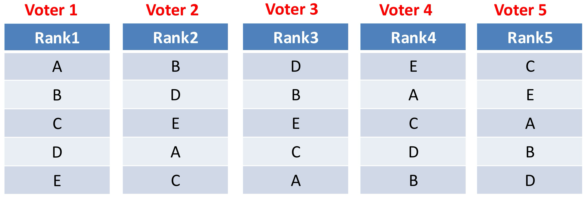

	* **Objective**: Combine the individual rankings into one overall ranking to identify the “best” candidate.

* **Key Questions:**

	* What is the overall ranking according to all the voters?
		* No visible score assigned to candidates, only ranking
	* Who is the best candidate?


## Borda's & Condorcet's Proposals

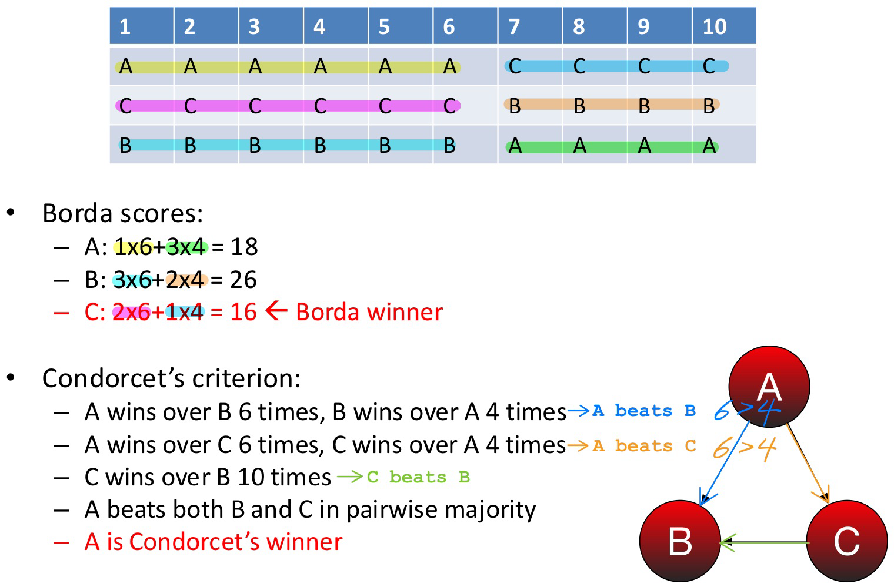

* **==Borda’s Proposal==:**

	* **Concept**:
		* Candidates are ranked by voters, and points are assigned based on their position in the rankings.

	* **Point Assignment**:

		* First place → 1 point

		* Second place → 2 points

		* Third place → 3 points

		* And so on, with the **n-th place** receiving **n points**.

		A **penalty** system is used where the total number of points a candidate receives represents their penalty.

	* **Winner Selection**:
		* The **Borda winner** is the candidate with the **lowest total penalty** (sum of points across all rankings). This means they were ranked higher overall by the majority of voters.

	* **Advantages**:

		* Aggregates preferences across all voters.

		* Ensures that a candidate who is consistently ranked high (even if not first) is more likely to win.

	* **Limitations**:

		* It does not consider direct pairwise comparisons between candidates.

		* A candidate could win despite losing head-to-head against others.

* **==Condorcet’s Proposal==:**

	* **Concept**:

		* The focus is on **pairwise comparisons** between candidates.

		* A **Condorcet winner** is a candidate who defeats every other candidate in **head-to-head majority-rule comparisons**.

	* **Winner Selection**:

		* For each pair of candidates, determine which candidate is preferred by the majority of voters.

		* If one candidate is preferred over all others in such pairwise comparisons, they are the **Condorcet winner**.

	* **Advantages**:

		* Reflects the majority preference in direct comparisons.

		* Ensures that the winner is the most preferred choice in all pairwise scenarios.

	* **Limitations**:

		* A **Condorcet winner** may not always exist, especially in cases of cyclic preferences (e.g., A beats B, B beats C, and C beats A). This is known as the **Condorcet paradox**.

			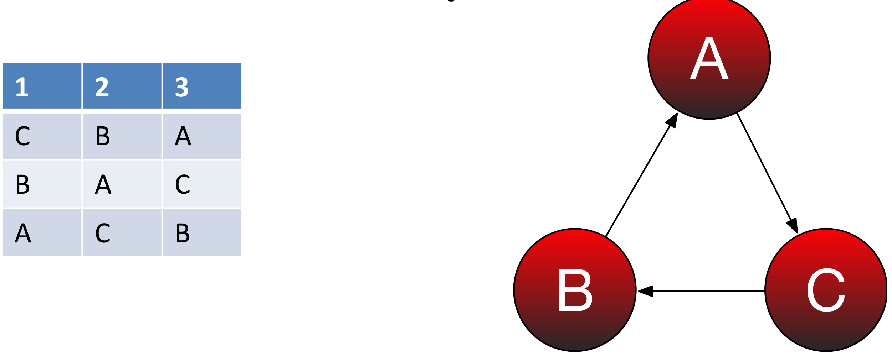


# Approaches to Rank Aggregation

## Axiomatic Approach

* **Axiomatic Approach:**

	* **Definition**: This approach defines rank aggregation as adhering to a set of desirable rules or **axioms** that represent fairness or rationality in the aggregation process.

	* **Goal**: To design a rank-order electoral system that satisfies specific fairness criteria.

* **Arrow’s Result:**

	* **Key Finding**: It is impossible to design a non-trivial rank aggregation function that simultaneously satisfies all the “natural requirements” or fairness criteria (axioms) in every scenario.

	* This result is known as **Arrow’s impossibility theorem**.

* **==Arrow’s Paradox==:**

	No rank-order electoral system can be designed to always satisfy these **three fairness axioms**:

	1. **No Dictatorship**:

		* No single voter should dictate the group’s overall preference.

		* A fair system requires collective decisions, not individual control.

	2. **Pareto Efficiency (Unanimity)**:
		* If every voter prefers candidate $X$ over candidate $Y$, the group ranking should also prefer $X$ over $Y$.

	3. **Independence of Irrelevant Alternatives (IIA)**:

		* The relative ranking between two candidates ($X$ and $Y$) should depend only on voters’ preferences for $X$ and $Y$, and not on preferences for other candidates.

		* Adding or removing other candidates should not affect the relative ranking of $X$ and $Y$.


## Metric Approach

* **Goal**:

	* Create a new ranking $R$ that ==**minimizes**== the **total distance** to the initial rankings $R_1, R_2, \dots, R_n$ .
	* This ensures the aggregated ranking is as close as possible to the input rankings, preserving their preferences.

* **Defining Distance Between Rankings:**

	Two common metrics to measure the distance between rankings are:

	* **==Kendall Tau Distance== (** $K(R_1, R_2)$ **)**:

		* Measures the **number of exchanges** in a bubble sort to convert one ranking ( $R_1$ ) into another ( $R_2$ ).

		* **Computational Difficulty**: Finding an exact solution for Kendall Tau distance is **NP-complete** (computationally hard).

	* **==Spearman’s Footrule Distance== (** $F(R_1, R_2)$ **)**:

		* Calculates the **absolute difference** in the ranks of each item across two rankings and sums these differences.

		* **Computational Difficulty**: Tractable and solvable in **polynomial time (PTIME)**.

* **Relationship Between Distances:**

	The two distances are related:

	* $\bold{K(R_1, R_2) \leq F(R_1, R_2) \leq 2K(R_1, R_2)} $

	* This inequality shows that Spearman’s Footrule provides a bound for Kendall Tau distance, making it useful for approximations.


## MedRank

* **Purpose**:

	* Addresses the rank aggregation problem for selecting the **best K objects** from multiple ranked lists.

* **Characteristics**:

	* **Uses only positions**: MedRank relies solely on the **ranks** (positions) of elements in the **ranked lists**, with ==**no associated scores**== or weights for the items.

	* **Median-Based Ranking**: For an element $x$ appearing in the ranked lists with ranks $r_1, r_2, \dots, r_h$ , MedRank computes the ==**median**== of these ranks to determine the element’s output rank.
		* Median ensures the ranking minimizes discrepancies across lists and is robust to outliers.

	* Provides an **approximation** of **Footrule-optimal aggregation** (i.e., aggregation that minimizes the sum of absolute rank differences).

* **Algorithm Overview:**

	* **Input:**

		* An integer $k$ , representing the number of top elements to return.

		* Ranked lists $R_1, R_2, \dots, R_m$ containing $N$ elements.

	* **Output:**

		* The **top K elements** based on their median ranks.

	* **Steps:**

		1. Perform ==**sorted accesses**== to the ranked lists:
			* Access one element at a time from each list sequentially, starting from the top.

		2. Stop when there are **k elements** that appear in **more than** $m/2$ **lists** (i.e., a majority of the lists).
		3. Output these **top K elements** as the final result.


### Example

* **Three** rankings

	* By price, by rating, and by distance
	* Looking for the **top 3 hotels** by "median rank"
	* **NB**: values of price, rating and distance are unknown, only the position matters

* Strategy:

	* Make one sorted access at a time in each ranking

	* Look for hotels that appear in at least $ \lceil m/2 \rceil = \lceil 3/2 \rceil = 2$ rankings

		

		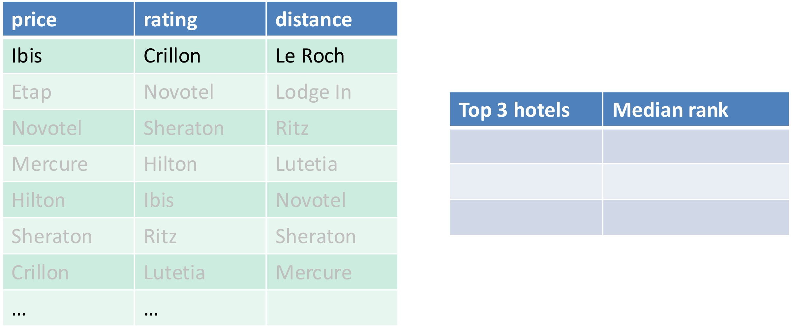

		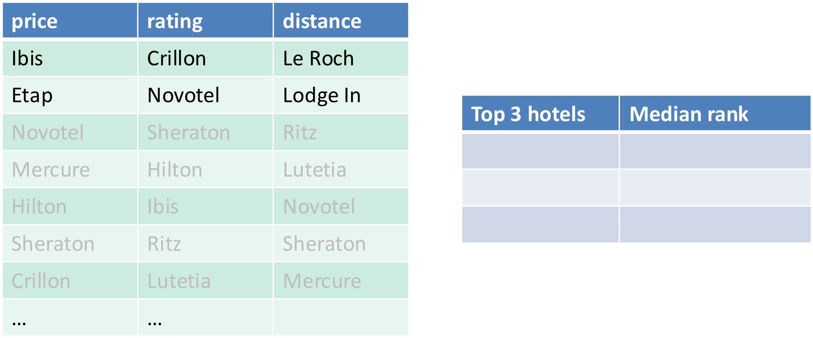

		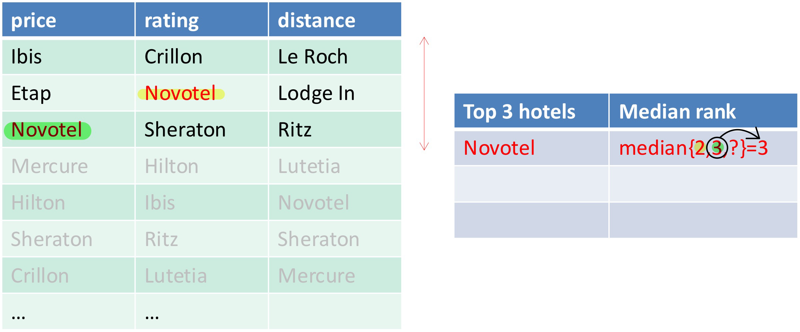

		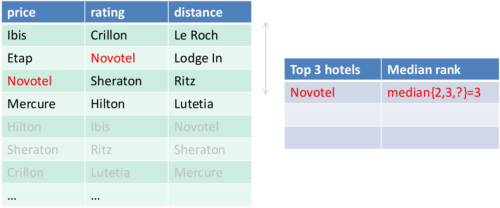

		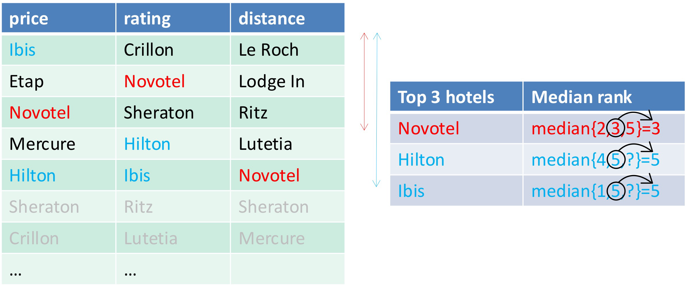

		* The (maximum) number of sorted accesses made on each list is also called the ==**depth**== reached by the algorithm; Here, the depth is 5
		* When the median ranks are all distinct (unlike here), we have the Footrule-optimal aggregation


# Top-k Queries

**Goal**: Retrieve the k highest-ranked tuples (or items) from a **very large result set**, based on a **scoring function**


## Naïve Approach

* ==**Scoring Function**==:

	* A function $S(t)$ assigns a numerical score to each tuple $t$ in the dataset $R$ .

	* Example: $S(t) = t.\text{Points} + t.\text{Rebounds}$ , where each tuple represents a basketball player’s statistics.

		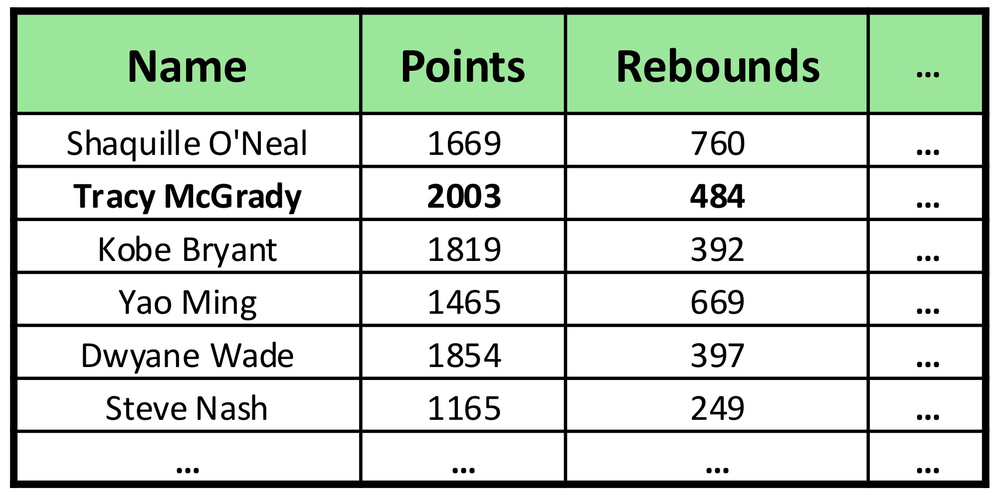

* **Steps**:

	* **Step 1**: Compute the score $S(t)$ for each tuple in the dataset.

	* **Step 2**: Sort the tuples in descending order of their scores.

	* **Step 3**: Select the first $k$ tuples (those with the highest scores) as the result.

* **Key Challenges**:

	* **Expensive for Large Datasets**:
		* The naïve approach requires ==**sorting**== the entire dataset after computing scores for all tuples, which becomes computationally expensive as the dataset size increases.

	* **Even More Costly with Joins**:

		* If the scoring function $S(t)$ involves attributes from multiple relations (e.g., combining **Points** and **Rebounds** from different tables), all tuples must first be joined:

			* **1-to-1 Join**: In simpler cases, where each tuple in one relation matches exactly one tuple in another relation, the computation is still manageable but adds overhead.

				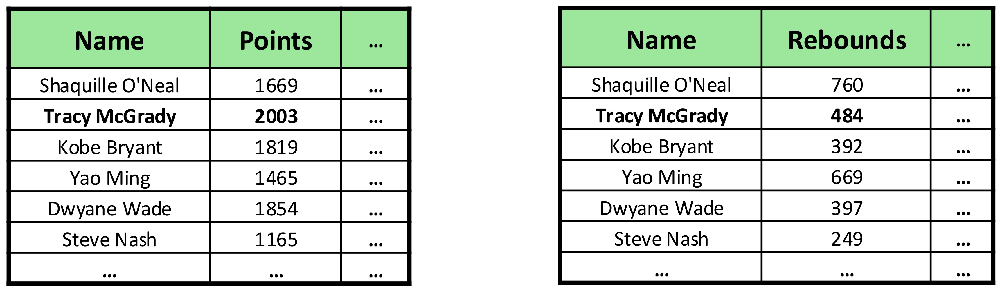

			* **M-to-N Join**: In general cases, where tuples from one relation can join with multiple tuples in another, the complexity increases dramatically due to the combinatorial nature of joins.


## In SQL

* **Key Abilities Required**:

	* **Ordering**:

		* Tuples must be sorted based on a specified scoring function or criteria.

		* SQL uses the `ORDER BY` clause to handle ordering.

	* **Limiting**:

		* The output needs to be restricted to the top $k$ tuples after ordering.

		* While SQL has always supported ordering, **limiting output** was not standardized until **SQL:2008**.

* **Standardized Syntax (SQL:2008):**

	* The `FETCH FIRST k ROWS ONLY` clause was introduced in SQL:2008 to limit the result set to the top $k$ tuples.

	* Supported by major database systems, such as: IBM DB2, PostgreSQL, Oracle, Microsoft SQL Server, ...

* **Non-Standard Syntax:**

	Before SQL:2008, different database systems implemented their own syntax for limiting query results:

	* **Oracle**:

		```sql
		SELECT * FROM table_name WHERE ROWNUM <= k;
		```

	* **PostgreSQL and MySQL**:

		```sql
		SELECT * FROM table_name LIMIT k;
		```

	* **Microsoft SQL Server**:

		```sql
		SELECT TOP k * FROM table_name;
		```

	

### Shortcomings of `ORDER BY`

* **Query A**:

	```sql
	SELECT * 
	FROM UsedCarsTable 
	WHERE Vehicle = 'Audi/A4' AND Price <= 21000 
	ORDER BY 0.8*Price + 0.2*Miles
	```

	* **Potential ==Near-Miss==**:

		* By applying a hard filter (`Price <= 21000`), the query may **exclude some relevant options** that are only slightly outside the price range but still desirable.

		* Example: A car priced at **$21,500** with very low mileage may not appear in the results, even though it could be a great match.

* **Query B**:

	```sql
	SELECT * 
	FROM UsedCarsTable 
	WHERE Vehicle = 'Audi/A4' 
	ORDER BY 0.8*Price + 0.2*Miles
	```

	* ==**Information Overload**==:

		* By not applying a filter, this query returns all vehicles of type Audi/A4, ranked by the scoring function.

		* The result may include too many options, many of which are irrelevant (e.g., vehicles that are too expensive or have high mileage).


### Semantics

* **Top-k Results**:

	* A top-k query retrieves only the **first** k **tuples** from a dataset, as determined by the ORDER BY directive.

	* For example:

		```sql
		SELECT * 
		FROM R 
		ORDER BY Price 
		FETCH FIRST 3 ROWS ONLY;
		```

		* This retrieves the 3 tuples with the **lowest Price**.

* **Non-Deterministic Semantics**:

	* If **ties** exist in the sorting attribute(s) (e.g., two or more tuples have the same Price), there are **multiple valid sets** of $k$ results that satisfy the query.

	* Any of these sets is a valid answer, as SQL does not specify a deterministic way to break ties unless additional criteria are provided.

		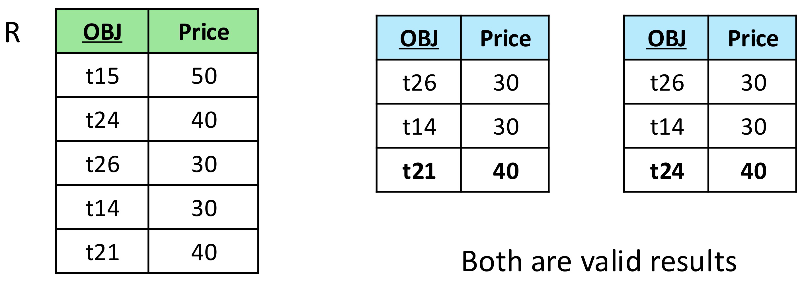


### Example

* **The Best NBA Player (by Points and Rebounds)**:

	```sql
	SELECT * 
	FROM NBA 
	ORDER BY Points + Rebounds DESC 
	FETCH FIRST 1 ROW ONLY;
	```

	* The `FETCH FIRST 1 ROW ONLY` clause limits the result to the top player.

* **The 2 Cheapest Chinese Restaurants**:

	```sql
	SELECT * 
	FROM RESTAURANTS 
	WHERE Cuisine = 'Chinese' 
	ORDER BY Price 
	FETCH FIRST 2 ROWS ONLY;
	```

	* The `FETCH FIRST 2 ROWS ONLY` clause ensures only the **2 cheapest restaurants** are returned.

* **The Top-5 Audi/A4 Cars (by Price and Mileage)**:

	```sql
	SELECT * 
	FROM USEDCARS 
	WHERE Vehicle = 'Audi/A4' 
	ORDER BY 0.8*Price + 0.2*Miles 
	FETCH FIRST 5 ROWS ONLY;
	```

	* The `FETCH FIRST 5 ROWS ONLY` clause limits the result to the **top 5 vehicles**.


### Evaluation

* **Two Key Aspects to Consider**:

	* **Query Type**:
		* **1 Relation**: Queries accessing a single table (simpler to evaluate).
		* **Many Relations**: Queries involving joins across multiple tables (more complex).
		* **Aggregate Results**: Queries requiring additional computations like averages, sums, or custom scoring functions.

	* **Access Paths**:
		* **No Index**: Full table scans may be required, leading to higher computational costs.
		* **Indexes**: If indexes exist on some or all ranking attributes, the query can leverage these for faster access.

* **Simplest Case: Top-k Query with 1 Relation:**

	Consider a scenario where the query involves only one table.

	* **Input Already Sorted:**

		* If the data is **pre-sorted** according to the scoring function $S$ :

			* The query can simply read the **first** $k$ **tuples** without scanning the entire dataset.

			* This is highly efficient since no additional sorting is required.

	* **Input Not Sorted:**

		* If the tuples are **not sorted**, sorting is required:

			* For small values of $k$ (the typical case), an **in-memory sort** using a **min-heap** data structure is effective.

			* A min-heap keeps the smallest $k$ elements at any given point, efficiently discarding irrelevant tuples as the dataset is processed.

		* **Cost**:

			* The entire dataset must be scanned, and sorting requires $O(N \log k)$ , where:
				* $N$ = Total number of tuples in the dataset.
				* $k$ = Number of top results desired.

			* This approach avoids the costlier $O(N \log N)$ full sorting when $k$ is much smaller than $N$ .


## A Geometric View

Consider the 2-dimensional attribute space (Price, Mileage)

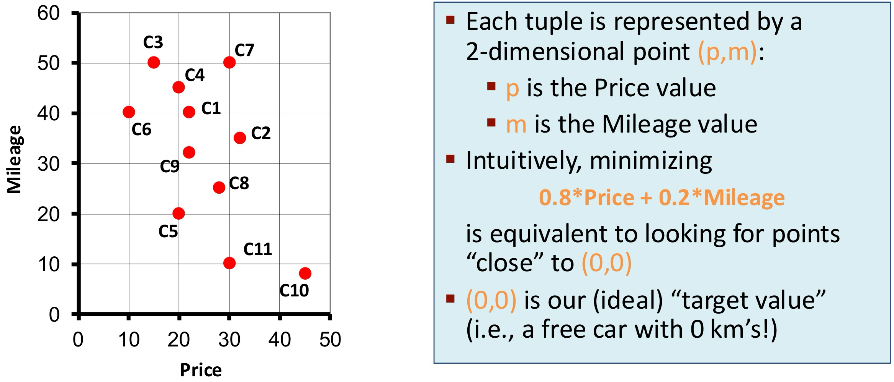


### The Role of Weights (Preferences)

* Our preferences (e.g., 0.8 and 0.2) are essential to determine the result

	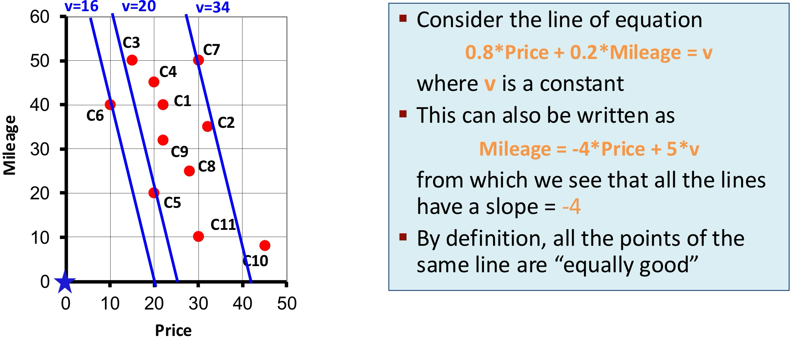

* With preferences $(0.8,0.2)$ the best car is C6, then C5, etc

* In general, preferences are a way to determine, given points $(p_1, m_1)$ and $(p_2, m_2)$ , which of them is "closer" to the target point $(0,0)$


### Changing the Weights

* Changing the weight values will likely lead to a different result

	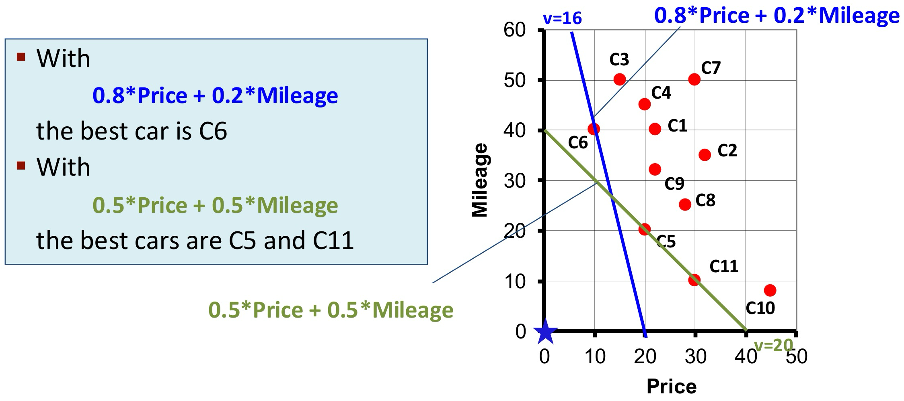

* On the other hand, if weights do not change too much, the results of two top-k queries will likely have a high degree of overlap


### Changing the Target

* The target of a query is not necessarily $(0,0)$ , rather it can be any point $q=(q_1, q_2)$ ($q_i$ = query value for the $i$-th attribute)

* Example: assume you are looking for a house with a $1000 \ m^2$ garden and $3$ bedrooms; then $(1000, 3)$ is the target for your query

	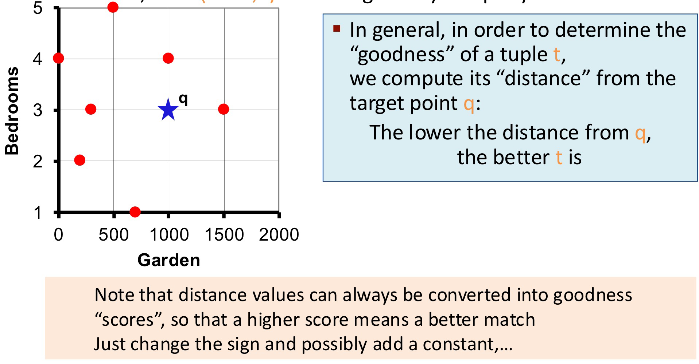


## Top-k Tuples = k-Nearest Neighbours

* **Top-k Query and Distance-Based Ranking**:

	* Many top-k query approaches focus on minimizing the ==**distance**== of tuples from a target query point rather than maximizing a “goodness score.”

	* This approach is natural and intuitive, as shorter distances indicate better matches.

* **Modeling Top-k Queries:**

	* **m-Dimensional Space (**$A$**)**:

		The space is defined by $m$ ranking attributes: ($A_1, A_2, \dots, A_m$).

		* Example: Price, Mileage, Bedrooms, etc.

	* **Relation (**$R$**)**:

		A dataset or table $R$ contains tuples described by attributes:

		* Ranking attributes: $A_1, A_2, \dots, A_m$

		* Non-ranking attributes: $B_1, B_2, \dots$ (e.g., descriptive data like names).

	* **Target Point (**$q$**)**:

		A query specifies the desired target values for the ranking attributes: $q = (q_1, q_2, \dots, q_m)$.

		* Example: A house with a $1000$ m² garden and $3$ bedrooms ($(1000, 3)$).

	* **Distance Function (**$d$**)**:

		A function $d: A \times A \to \mathbb{R}$ measures the distance between points in the attribute space.

		* $d(t, q)$: Distance between tuple $t$ and target $q$.
		* Common choices: Euclidean distance, Manhattan distance, or weighted distance.

* **k-NN (k-Nearest Neighbours) Query Definition**:

	* Given a target point $q$, a dataset $R$, and a distance function $d$:

	* **Goal**: Find the $k$ tuples in $R$ that are closest to $q$ according to $d$.


### Some Common Distance Functions

The most commonly used distance functions are Lp-norms (Minkowski distance):

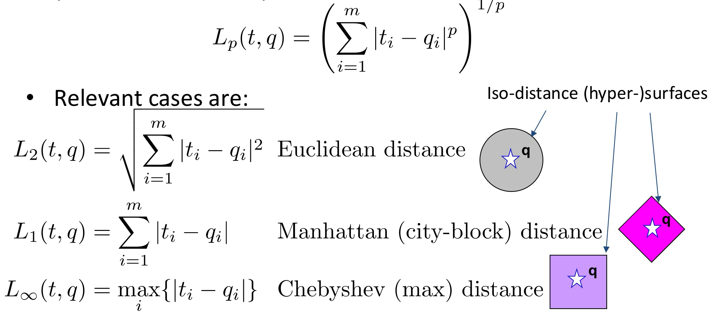

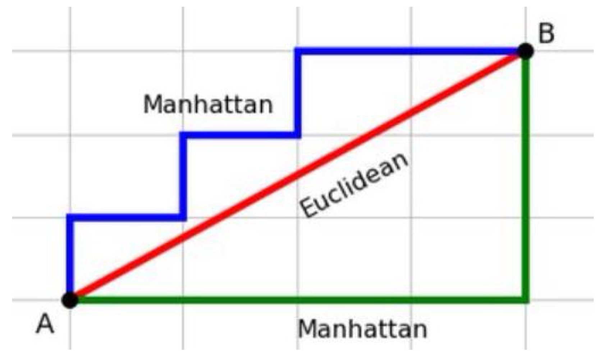


#### Shaping the Attribute Space

Changing teh distance changes the shape of the attribute space

* Each "stripe" corresponds to points with distance values between $v$ and $v+1$ , which $v$ is integer

	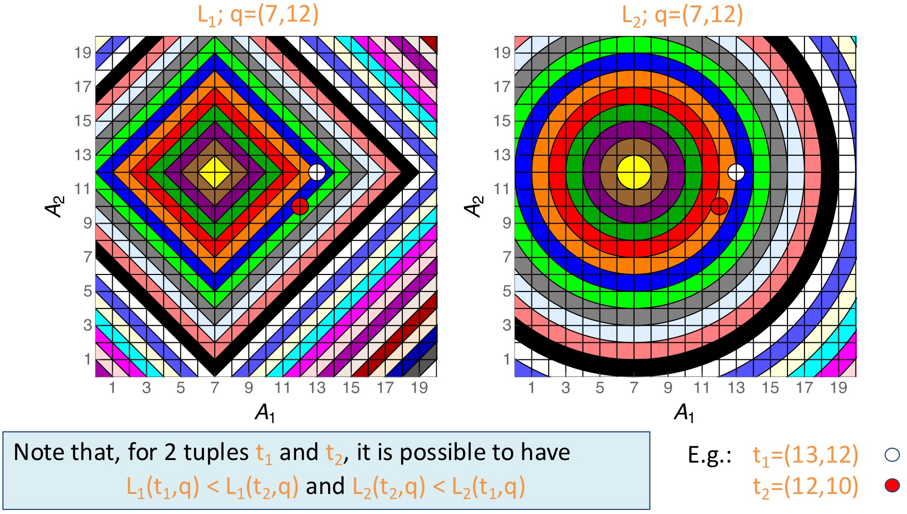


### Distance Functions with Weights

The use of weights $W = (w_1, .., w_m)$ entails "stretching" some of the coordinates:

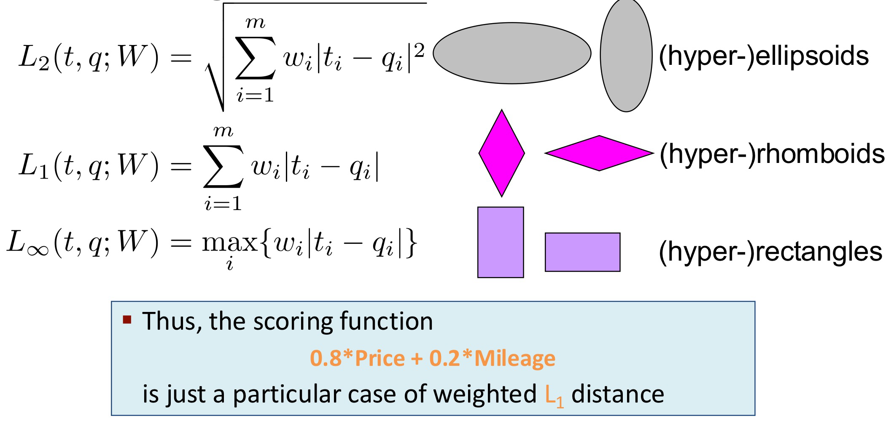


#### Weights the Attribute Space

* The figure show the effects of using $L_1$ with different weights

	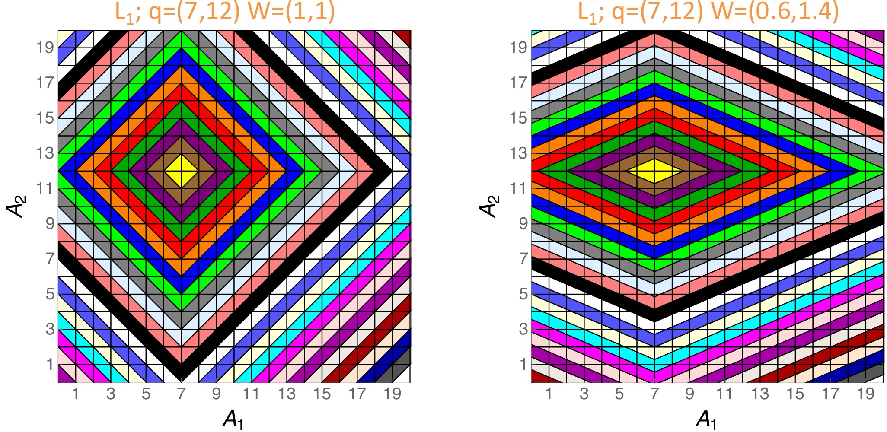

	* **Elongation Along** $A_1$:

		* When $w_2 > w_1$, differences in $A_1$ are less significant compared to $A_2$.

		* This results in **elongation along** $A_1$, as seen in the right panel.

	* **Symmetry vs. Distortion**:

		* Equal weights preserve symmetry in the attribute space.

		* Unequal weights distort the attribute space to prioritize specific dimensions.


## Top-k 1-1 Join Queries

Deal with joining datasets based on a common key attribute while identifying the top-k results according to a scoring or preference function

* **Characteristics of 1-1 Join Queries**:

	* **All Joins are on Common Key Attributes**:
		* The query joins datasets where tuples share a **common key** (e.g., IDs, names).
		* This is the simplest case and forms the **basis** for more complex join scenarios.
		* It is highly **practical**, as many real-world applications involve such key-based relationships (e.g., linking customer profiles with purchase histories).

* **Two Scenarios for Top-k 1-1 Joins**:

	* **Indexed Scenario**:
		* There is an **index** available for each preference factor (e.g., price, rating).
		* Tuples can be **retrieved in an ordered fashion** based on each attribute of interest.
		* Example: Using a B-tree or hash index to quickly sort or access relevant tuples.

	* **Distributed/Middleware Scenario**:
		* The **relation is distributed across multiple sites**, and each site has limited access to the data.
		* Access to features of the objects (e.g., attributes like price or rating) may be restricted or only partially available.
		* Known as the **“middleware scenario”**, where the middleware aggregates or retrieves data from distributed sources to process the query.


### The Middleware Scenario

* **Middleware Scenario Description**:

	* **Data Sources**:
		* There are ==**multiple data sources**== (e.g., servers, databases, or APIs) that provide relevant information.

	* **Query Execution**:
		* Queries are sent to **several data sources** at the same time.
		* Results from these sources are **combined** to produce the final output.

	* **Middleware Role**:

		* Middleware acts as a **mediator** between:
			* The **user/client** issuing the query.
			* The **data sources/servers** providing the required information.
		* It retrieves data from various sources, processes it, and presents a unified result to the user.

		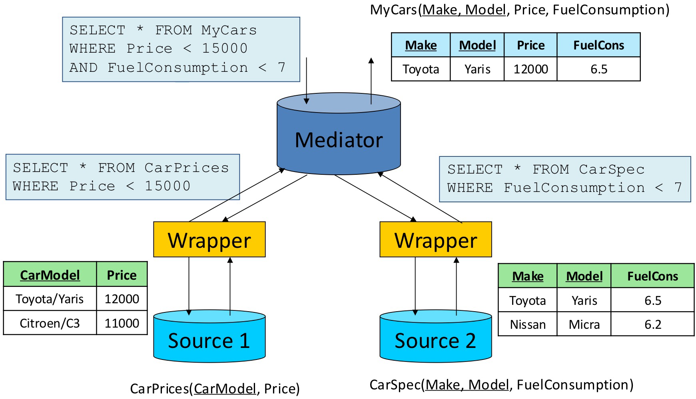

* **Middleware Queries**:
	* These are the types of queries handled by middleware systems.
	* Middleware queries handle distributed and heterogeneous data sources, making it possible to retrieve, process, and rank data from multiple locations seamlessly.


#### Limited Access Patterns

In middleware scenarios where a mediator does not own the data sources but acts as an intermediary, access can be subject to restrictions

* **Middleware Access Types**:

	* ==**Sorted Access**==:

		* The mediator retrieves the ==**next best object**== in a ranked order.
		* The response includes:
			* The object’s **ID**.
			* A **partial score** ($p_j$) and possibly other attributes.

		* **Example**: Querying for cars ordered by ascending price.

	* ==**Random Access**==:

		* The mediator retrieves specific information about an object ==**based on its ID**==.

		* This requires an **index on the primary key** in the respective data source.

		* **Example**: Querying for the fuel consumption of a specific car (e.g., with a license plate FG205SH).

* **Key Assumptions**:

	* The **ID** of an object remains consistent across all data sources (even if reconciliation is needed to achieve this consistency).
	* Each input relation (data source) is assumed to contain the **same set of objects**, though this assumption can be relaxed in practice.


## A Model for Scoring Functions

* **Core Concepts**:

	* **Individual Data Source Rankings**:
		* Each data source ($L_j$) ranks objects ($o$) based on its criteria (e.g., price, mileage, consumption).
		* Each object $o$ is assigned a **local/partial score** $p_j(o)$ by $L_j$.

	* **Normalization**:

		* Scores are ==normalized to a range of $[0, 1]$== for consistency across data sources.

			* Higher scores indicate better performance.

			* Requires knowledge of the **best** and **worst** possible values for $p_j$.

	* **Score Space**:

		* The **hypercube** $[0,1]^m$ represents the ==**score space**==, where $m$ is the number of criteria or data sources.

		* An object $o$ is mapped to a point $p(o) = (p_1(o), p_2(o), \dots, p_m(o))$ in this space.

* **Global Scoring:**

	* A ==**global score**== $S(o)$ is computed to represent the overall ranking of an object.

	* The global score is calculated using a ==**scoring function**== $S$ that combines all local scores: 

		$\boxed{S : [0,1]^m \to \mathbb{R}}$ 

		$\boxed{S(o) = S(p_1(o), p_2(o), \dots, p_m(o))}$


### The Score Space

* **Attribute Space** $A$:

	* Consists of two attributes: **Price** and **Mileage**.
	* Each object $o$ is initially represented in this space with raw attribute values.

* **Score Normalization**:

	* Scores $p_1(o)$ and $p_2(o)$ are calculated using the formulas: $p_1(o) = 1 - \frac{o.\text{Price}}{\text{MaxP}}, \quad p_2(o) = 1 - \frac{o.\text{Mileage}}{\text{MaxM}}$
		* **MaxP** = 50,000 (maximum Price).
		* **MaxM** = 80,000 (maximum Mileage).
		* These formulas ensure that:
			* Higher scores are better.
			* Each score is scaled to the range $[0, 1]$.

* **Mapping into the Score Space**:

	* Objects in the attribute space ($A$) are transformed into points in the **score space** $[0, 1]^2$.

		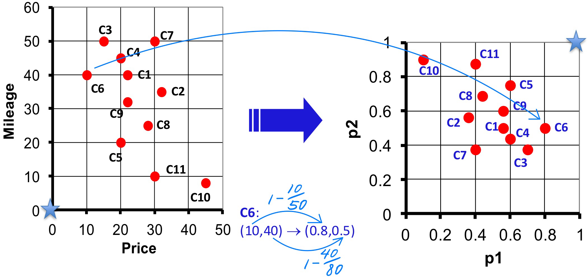


### Common Scoring Functions

* **SUM (or AVG)**:

	* **Purpose**: Treats all attributes equally by summing up their scores.

	* **Formula**: $\text{SUM}(o) = p_1(o) + p_2(o) + \ldots + p_m(o)$
	* **Use case**: Suitable when all attributes are equally important and contribute proportionally to the overall ranking.

* **WSUM (Weighted Sum):**

	* **Purpose**: Allows for weighting attributes differently based on their importance.

	* **Formula**: $\text{WSUM}(o) = w_1 \cdot p_1(o) + w_2 \cdot p_2(o) + \ldots + w_m \cdot p_m(o)$
		* $w_1, w_2, \ldots, w_m$ are weights that sum to 1 ($\sum w_i = 1$).
	* **Use case**: Useful when some attributes are more critical than others (e.g., price might weigh more than mileage for car ranking).

* **MIN (Minimum):**

	* **Purpose**: Focuses on the **worst score** among all attributes.

	* **Formula**: $\text{MIN}(o) = \min \{ p_1(o), p_2(o), \ldots, p_m(o) \}$
	* **Use case**: Ensures that the lowest score dominates the ranking, which is helpful in scenarios like reliability (e.g., the lowest rating across platforms).

* **MAX (Maximum):**

	* **Purpose**: Focuses on the **best score** among all attributes.

	* **Formula**: $\text{MAX}(o) = \max \{ p_1(o), p_2(o), \ldots, p_m(o) \}$

	* **Use case**: Highlights the strongest attribute, useful in scenarios like top performance metrics.


### Equally Scored Objects

* **Iso-score curves**:

	* These are curves (or boundaries) in the score space where every point (object) on the curve has the same global score $S(o)$.

	* Similar to **iso-distance curves** in geometry, which represent points equidistant from a reference.

	* Iso-score curves help visualize and compare objects with equal global scores based on specific scoring functions.

		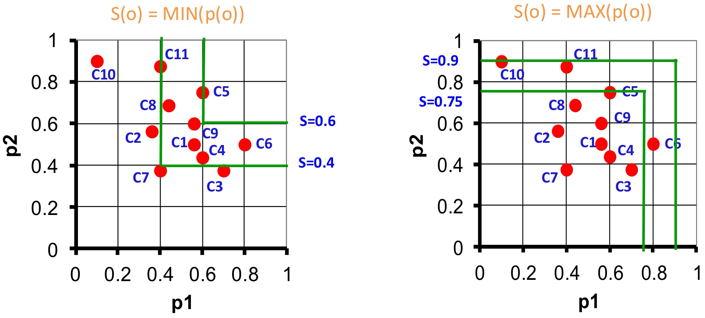


## The $B_0$ Algorithm

* **Inputs:**

	* $k$ : The number of top objects to retrieve (where $k \geq 1$ ).

	* Ranked lists $R_1, R_2, \dots, R_m$ : These lists contain objects sorted by their partial scores in each source.

* **Steps:**

	* **Perform** $k$ **sorted accesses**:

		* From each ranked list $R_1, R_2, \dots, R_m$ , retrieve the top $k$ objects (along with their partial scores).

		* Store these objects and their scores in a **buffer** $B$ .

	* **Compute the MAX score**:
		* For each object in the buffer $B$ , calculate the **maximum** of its available partial scores across all lists.

	* **Return the top-** $k$ **objects**:
		* Select and return the $k$ objects with the highest **MAX** scores.

* **Key Features:**

	* **No need to fetch missing partial scores**:
		* Since the MAX function relies only on the highest partial score, there’s no need to query additional sources for missing data.

	* **No random accesses required**:
		* The algorithm only performs **sequential (sorted) accesses** to retrieve data, making it efficient and straightforward.

	* **No indexing needed**:
		* This avoids the overhead of building or maintaining indexes.


### Example

* $k=2$

	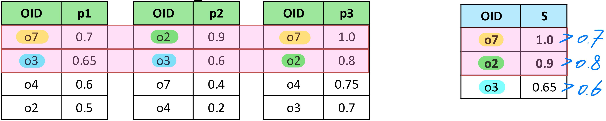

* $k = 3$

	


#### Why $B_0$ works

* **Threshold Establishment**:

	* After 3 sorted accesses, the algorithm guarantees that there are at least 3 objects with $S(o) \geq 8.3$ ($S$ is MAX).
	* Any other object $o'$ , which hasn’t been accessed, will have $S(o') < 8.3$ because its maximum possible partial score is less than this threshold.

* **Explored vs. Unexplored Regions**:

	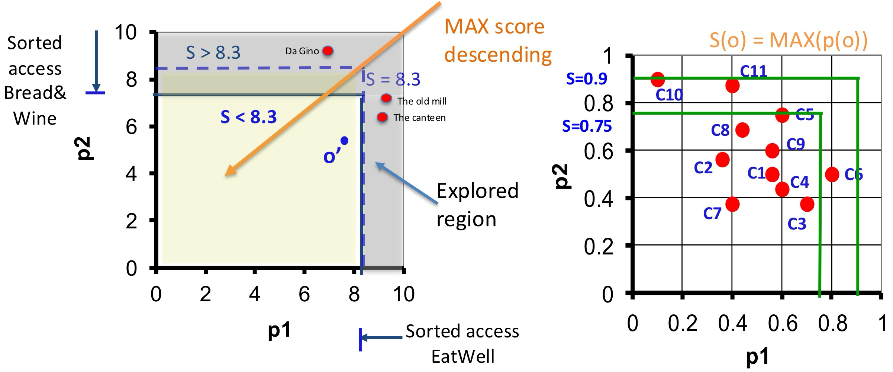

	* The **explored region** shows objects that have been retrieved through sorted access.

	* The **unexplored region** represents objects that cannot surpass the current threshold (e.g., $o'$ ).

		


### $B_0$ doesn't work when $S \neq MAX$

Let $S = MIN$ and $k = 1$

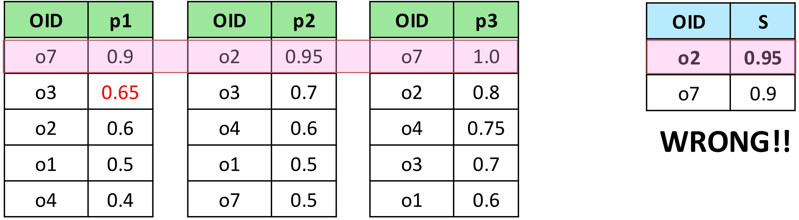


#### Why $B_0$ doesn't work

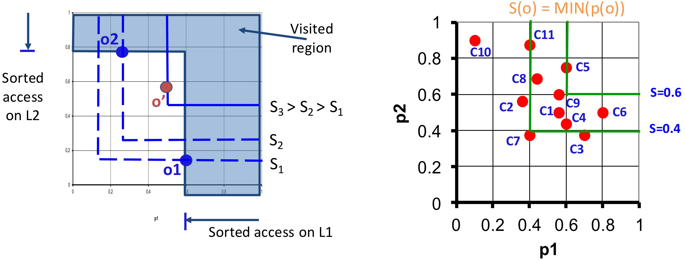

* **Visited Region:**
  * The dashed blue lines represent the region explored through **sorted access**.
  * Objects $o_1$ and $o_2$ have been retrieved in this region. Their scores $p_1$ and $p_2$ are known, but their global scores $S(o)$ may not accurately reflect $S = MIN$, as not all partial scores are considered.

* **Non-Retrieved Object** $o^{\prime}$ **:**
  * $o^{\prime}$ lies outside the visited region, meaning it has not been retrieved yet.
  * Since $o^{\prime}$ was not retrieved by any sorted access, its global score is unknown.

  * It could turn out that $o^{\prime}$ has the **highest minimum score** (i.e., $S(o^{\prime}) > S(o_1), S(o_2)$ ), making it the true top-1 object.


## Fagin's Algorithm (FA)

* **Input**:

	* $k$ : The number of top objects you want to retrieve.
	* A **==monotone== scoring function** $S$ : This function combines partial scores from multiple lists $R_1, \ldots, R_m$ to compute an overall score for each object.

* **Steps**:

	1. ==**Sorted Access**==:

		* Extract objects by **sorted accesses** (i.e., sequentially read items from the top of each ranked list $R_1, \ldots, R_m$ ).

		* Stop when there are **at least** $k$ **objects in common** across all the $m$ lists.

	2. ==**Random Access**==:

		* For each of the $k$ objects that have been seen in the lists:
			* Perform **random accesses** to obtain any missing scores (i.e., scores from lists where the object was not encountered yet).

		* Compute the overall score $S(o)$ for these objects using the scoring function.

* **Output**:

	* The top $k$ objects with the best scores.


### Characteristics

* **Complexity:**

	* The complexity is ==**sub-linear**== in the total number of objects $N$ , meaning FA is faster than naively computing scores for all $N$ objects.

	* When combining two lists ( $m = 2$ ):
		* Complexity is proportional to $O(\sqrt{N} k)$ .

	* For $m > 2$ :
		* Complexity is $O\left(N^{m-1/m} k^{1/m}\right)$ , where $m$ is the number of lists.

* **Stopping Criterion:**
	* The algorithm stops when $k$ objects are guaranteed to be among the top $k$ (based on sorted and random access).

* **Applicability:**
	* It works for any **monotone scoring function**, not just $S = MAX$ or $S = MIN$ .

* **Limitations:**
	* The algorithm is **not instance-optimal**, meaning it doesn’t minimize the number of accesses for every specific dataset.


### Example

* **Query**:
	* Hotels with best price and rating
	* Scoring function: $S(o) = 0.5 \times \text{cheapness} + 0.5 \times \text{rating}$

* **Example**:

	* Compute the two best options (Top-2)

* **Strategy**:

	* **Sorted Access**:

		* Retrieve hotels one by one from the sorted lists (cheapness and rating lists).
		* Stop once there are at least 2 hotels (equal to $k$ ) that appear in **both lists** (cheapness and rating).

	* **Random Access**:

		* For these 2 hotels, perform **random access** to get their scores in both cheapness and rating lists.
		* Compute their overall scores using $S(o)$ .

		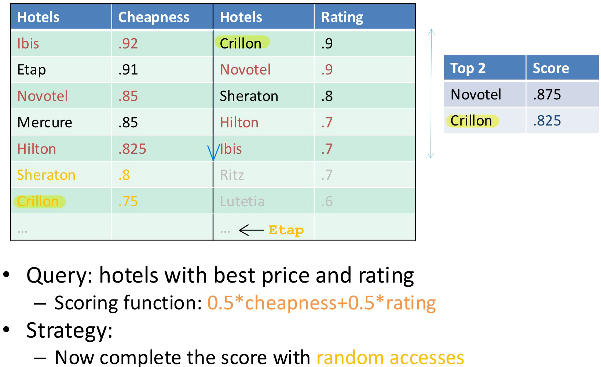


### Why FA works

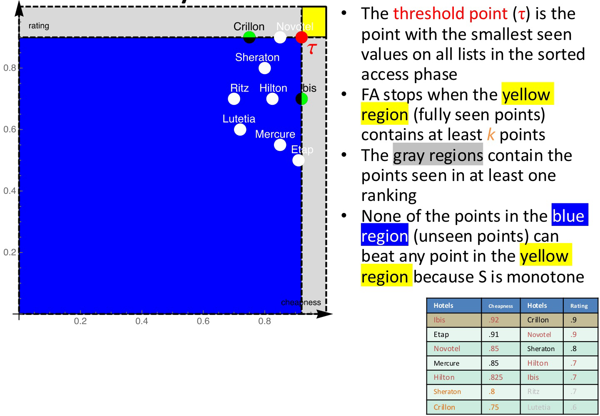

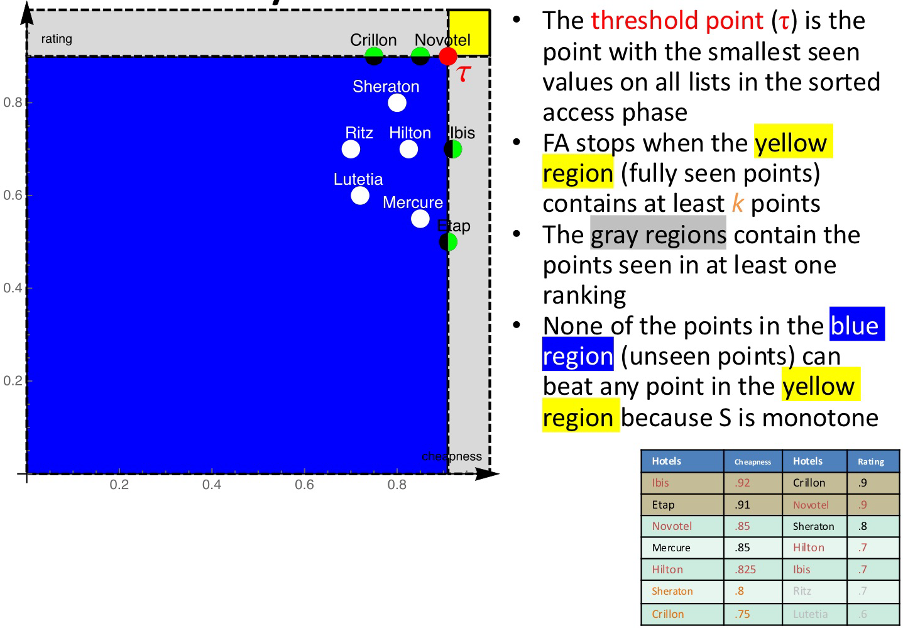

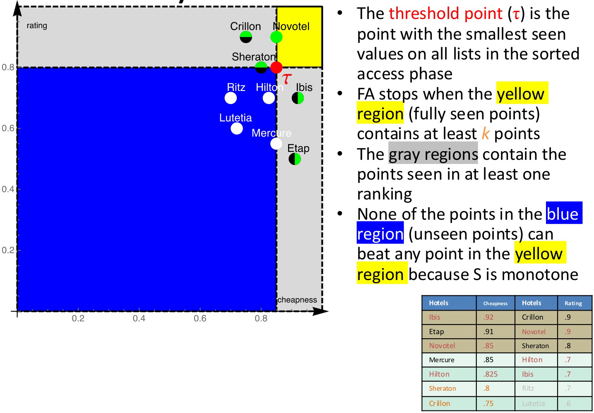

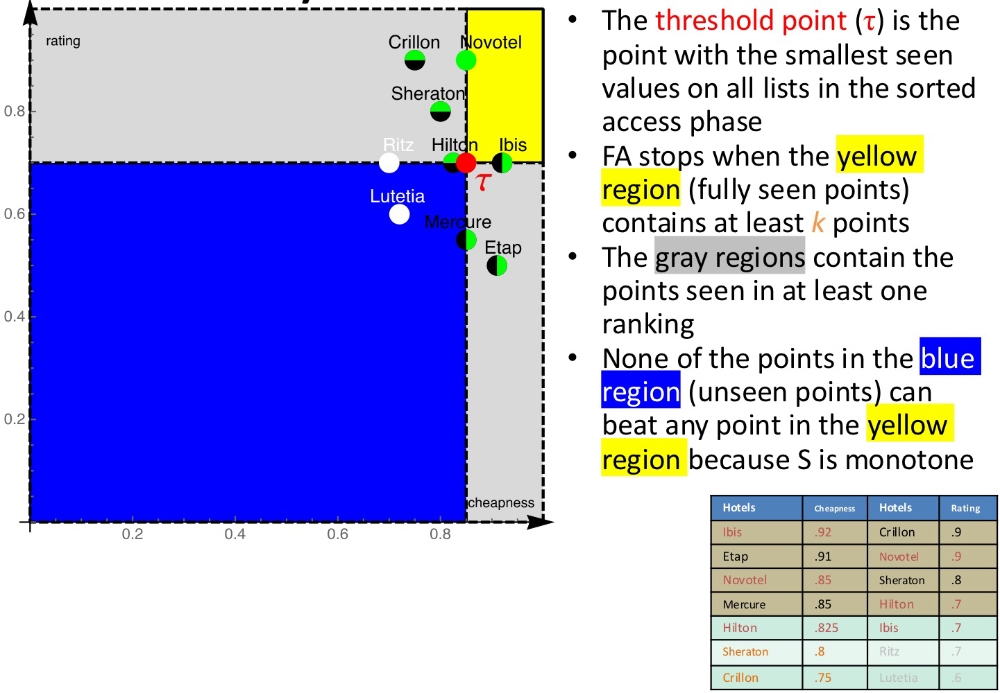

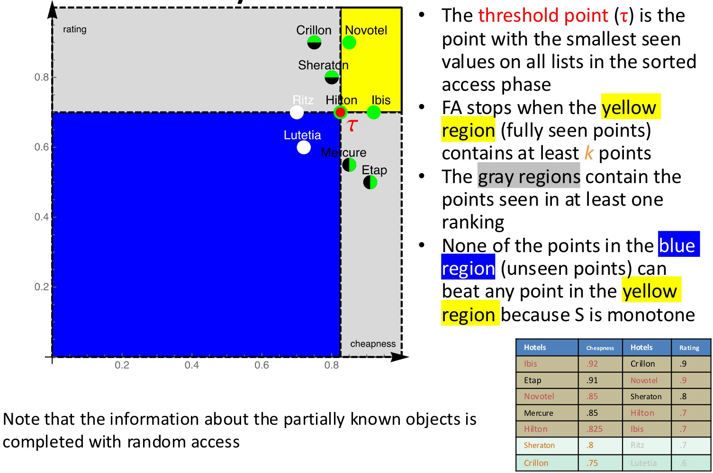


### Limits of FA

* **Drawbacks of FA**:
	* **Independence from the Scoring Function**:
	
		* FA does not take advantage of the specific properties of the scoring function S (e.g., monotonicity or other characteristics).
	
		* The cost of **sorted** and **random accesses** is the same regardless of the scoring function used.
	
	* **High Memory Requirements**:
		* During the sorted access phase, FA buffers **all retrieved objects**. If the number of accessed objects is large, memory consumption can become prohibitive.
	
* **Potential Improvements**:

	* **Small Adjustments**:
		* **Interleaving random access and score computation**:
			* Instead of performing random access after all sorted accesses, interleave these operations to dynamically determine scores and reduce redundant random accesses.

	* **Changing the Stopping Condition**:
		* Significant improvements could be achieved by altering the stopping condition. For example:
			* Dynamically compute bounds based on the scoring function.
			* Stop as soon as enough confidence is established about the top k results, without processing unnecessary candidates.


## Threshold Algorithm (TA)

* **Input**:

	* $k$ : The number of top objects you want to retrieve.
	* A **==monotone== scoring function** $S$ : This function combines partial scores from multiple lists $R_1, \ldots, R_m$ to compute an overall score for each object.

* **Steps**:

	1. **Perform Parallel ==Sorted Accesses==**:
		* Simultaneously access the top-ranked items from all lists $R_i$ .

	2. **Execute ==Random Accesses== for Missing Scores**:
		* For an object o encountered during sorted access, retrieve missing scores $s_j$ from the lists it hasn’t yet been accessed from.

	3. **Compute the Overall Score**:
		* Use the scoring function $S(s_1, s_2, \dots, s_m)$ to calculate $o$ ’s total score.

	4. **Update the Threshold**:
		* Define the threshold $T$ based on the smallest scores encountered during the latest round of sorted accesses.

	5. **Stopping Condition**:
		* If the $k$ -th best object’s score is higher than the current threshold $T$ , terminate the algorithm and return the top $k$ results.

* **Output**:
	* The top $k$ objects with the best scores.


### Advantages

* ==**Instance-Optimal**==:
	* Among all algorithms that use sorted and random accesses, TA minimizes the total number of accesses needed to retrieve the top k results.
	* This makes it superior to FA in terms of efficiency and adaptiveness.

* **Adaptable Stopping Criterion**:
	* TA’s stopping condition ==depends== on the scoring function, allowing it to adjust based on the specific problem.


### Example

* **Query**:

	* Hotels with best price and rating

	* Scoring function: $S(o) = 0.5 \times \text{cheapness} + 0.5 \times \text{rating}$

* **Strategy**:

	* Alternate sorted access and random access

	* Maintain a threshold $T$

	* Stop when $k$ objects are no worse than $T$

		

		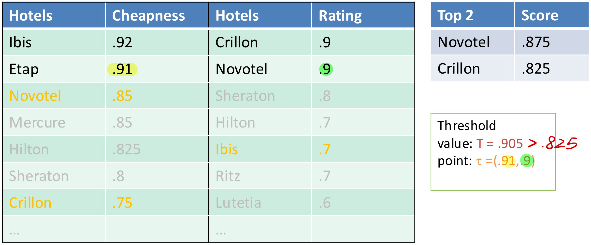

		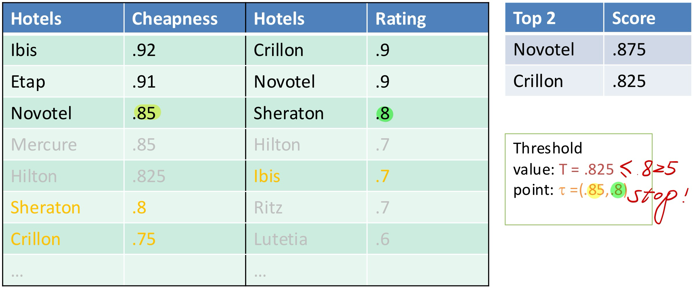

		

### Why TA works

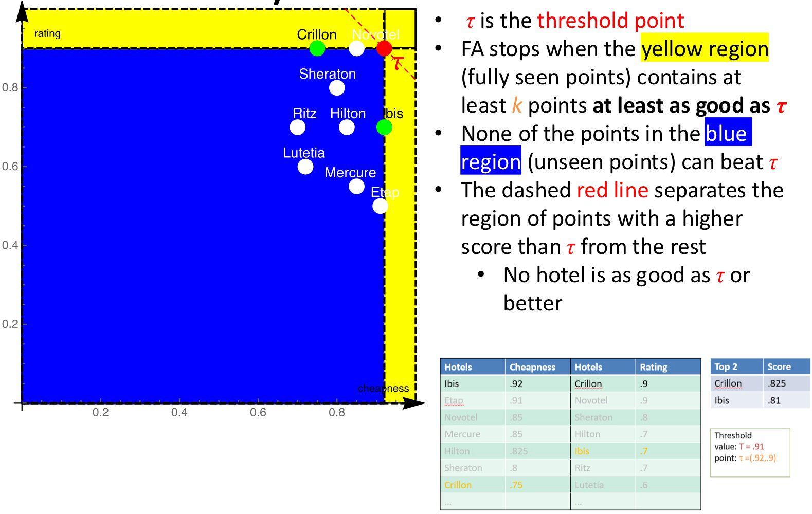


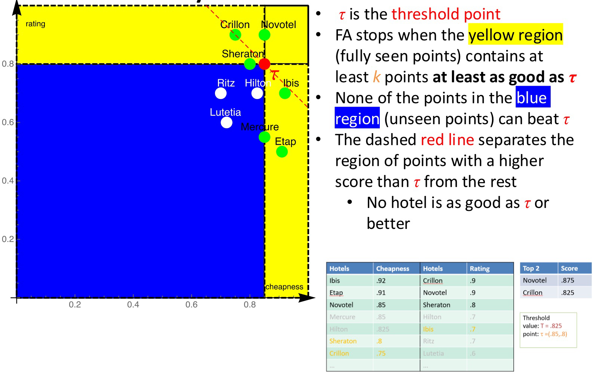


### Performance

* **Cost Model Formula**:

	$\text{Cost} = SA \cdot c_{SA} + RA \cdot c_{RA}$

	* $SA$ **:** Total number of **sorted accesses**.

	* $RA$ **:** Total number of **random accesses**.

	* $c_{SA}$ **:** Unit cost of a sorted access.

	* $c_{RA}$ **:** Unit cost of a random access.

* **Simplified Case**:

	In the **basic setting**, it assumes: $c_{SA} = c_{RA} = 1$

	* This means that the cost of both types of access is treated equally for simplicity.

* **Real-World Scenarios**:

  In more practical scenarios, the costs of $c_{SA}$ and $c_{RA}$ may differ:

  * **Web Sources:**
  	* Random accesses are often **more expensive** than sorted accesses ( $c_{RA} > c_{SA}$ ).
  	* In extreme cases, random access might even be **impossible** ( $c_{RA} = \infty$ ).

  * **Unavailable Sorted Access:**
  	* If some data sources don’t support sorted access, $c_{SA} = \infty$ , and TA will rely solely on random accesses.


## NRA Algorithm

* **Input**:

	* $k$ : Number of top-ranked objects to retrieve.
	* $R_1, R_2, \dots, R_m$ : $m$ ranked lists where objects are sorted by their partial scores.
	* $S$ : A monotone scoring function $S(o)$ , such that $S(o) = f(p_1(o), p_2(o), \dots, p_m(o))$ , where $p_j(o)$ is the partial score of object $o$ in $R_j$ .

* **Steps**:

	* **Initialization**

		* Begin with an empty buffer $B$ to store objects retrieved via **sorted access**.

		* For each object $o$ seen during sorted access:
			* Compute and maintain:
				* **Lower bound score:** $S^-(o)$ : Partial score from the lists where $o$ has been seen.
				* **Upper bound score:** $S^+(o)$ : Best possible score assuming maximum values for the lists where $o$ has not been seen.

	* **Iterative Process**

		* Perform **sorted accesses** simultaneously across all m ranked lists $R_1, R_2, \dots, R_m$ .

		* For each retrieved object $o$ :

			* If $o$ is already in $B$ , update $S^-(o)$ with its partial score from the new list.

			* If $o$ is new, add it to $B$ and initialize $S^-(o)$ and $S^+(o)$ .

	* **Maintaining Bounds**

		* Update $S^-(o)$ for objects in $B$ : $S^-(o) = f(p_{j_1}(o), p_{j_2}(o), \dots, p_{j_t}(o))$
			* $p_{j_i}(o)$ are the partial scores of $o$ seen so far.

		* Update $S^+(o)$ for objects in $B$ : $S^+(o) = f(p_{j_1}(o), \text{max}{R{j_{t+1}}}, \dots, \text{max}{R_m})$
			* $\text{max}{R_j}$ is the maximum score in the unseen lists.

	* **Define Threshold Point** $\tau$ 

		* $\tau$ represents the smallest seen scores across all ranked lists: $\tau = (p_{j_1}^{\text{max}}, p_{j_2}^{\text{max}}, \dots, p_{j_m}^{\text{max}})$
			* $p_{j_i}^{\text{max}}$ is the largest score seen in list $R_{j_i}$ so far.

		* Compute the threshold score $S(\tau)$ as: $S(\tau) = f(p_{j_1}^{\text{max}}, p_{j_2}^{\text{max}}, \dots, p_{j_m}^{\text{max}})$

	* **Termination Condition**

		* Let $S^-(B[k])$ be the minimum lower bound score of the $k$ -th best object in $\text{Res}$ .

		* Let $\text{max}_{B \setminus \text{Res}} S^+(o)$ be the maximum upper bound score of all objects not in $\text{Res}$ .

		* Halt the algorithm when: $S^-(B[k]) \geq \max \left( \max_{o \in B \setminus \text{Res}} S^+(o), S(\tau) \right)$
			* This condition ensures that no unseen or partially seen object can potentially outperform the top- $k$ objects already in $\text{Res}$ .

* **Output**:

	* A set $\text{Res}$ containing the top- $k$ objects and their scores, $S(o)$ , computed based on $S$ .


### Example

* First round

​	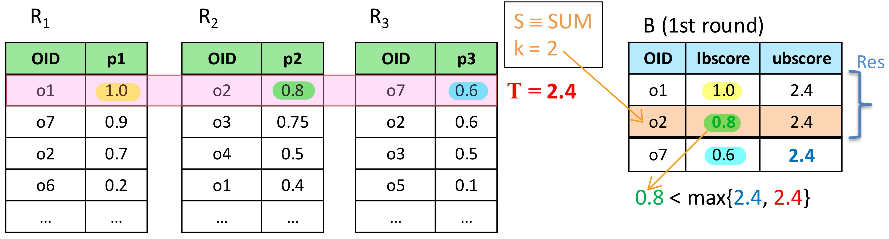

* Second round

​	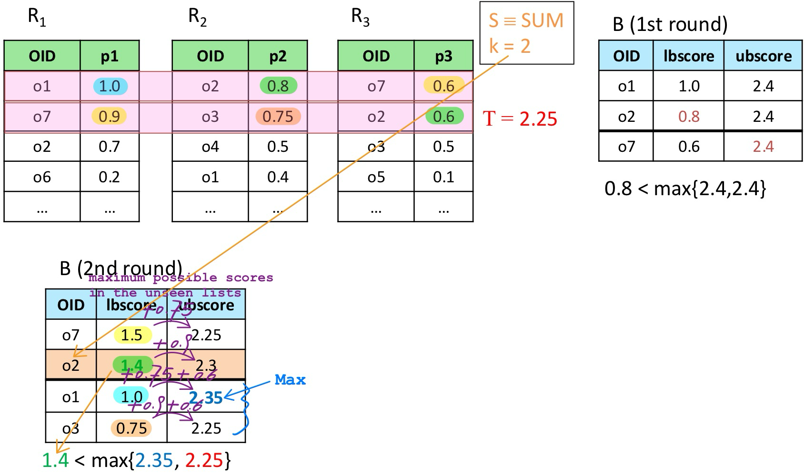

* Third round

​	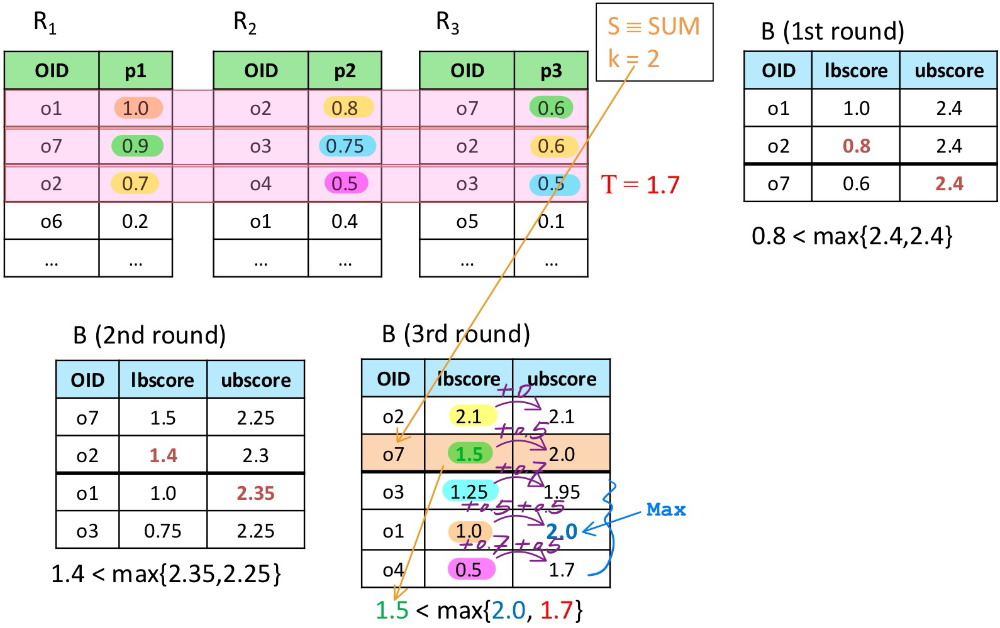

* Forth round

​	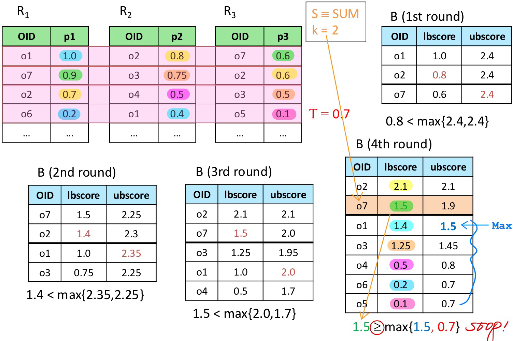


### Characteristic

* **Non-Monotonic Cost with** $k$**:**
	* The cost of finding the top-$k$ objects does **not always increase** with $k$.
	* It might sometimes be more expensive to find the top-$(k-1)$ objects than the top-$k$ objects. This happens because finding the next-best object might help reduce uncertainty for all other candidates earlier.
* **==Instance-Optimal==:** 
	* Among algorithms that do not make random accesses, NRA achieves the best possible performance (with an optimality ratio of $m$, the number of ranked lists).


## Summary

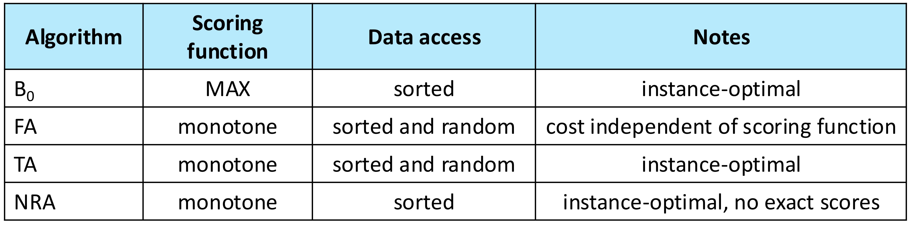


# Skylines

## Background

* **Purpose**

	* Skyline queries aim to find the “best” objects when evaluated across multiple attributes $A_1, A_2, \dots, A_m$ .
	* Unlike top-$k$ queries, skyline queries do not require a specific scoring function or weights to prioritize attributes.

* **No Need for Weights**

	* Instead of combining attributes into a single score, skyline queries use a ==**dominance**== relation to identify the best objects.
	* This eliminates the complexity of weight specification, making skyline queries simpler in scenarios where relative importance among attributes is unknown or not predefined.

* **Dominance Relation**

	* A tuple $t$ ==**dominates**== another tuple $s$ (denoted as $t \prec s$ ) if:
		* $t$ is **no worse** than $s$ in all attributes ( $\forall i, t[A_i] \leq s[A_i]$ ).
		* $t$ is **better** than $s$ in at least one attribute ( $\exists j, t[A_j] < s[A_j]$ ).

	* This means $t$ is strictly preferred over $s$ considering the attribute values.

* **Typical Convention**

	* **Lower values are better** for all attributes:
		* E.g., lower prices, shorter travel times, or smaller distances are considered favorable.

	* Note: ==This is the **opposite** of the convention in top- k queries, where higher scores often indicate better performance==.
	* However, this convention can be adjusted based on the specific query context.


## Definition

* **Definition**:

	* The skyline of a relation consists of **non-dominated tuples**.
	* A tuple is considered **non-dominated** if no other tuple performs **better or equally well** in all dimensions (attributes) and **strictly better** in at least one dimension.

* **Graphical Illustration**:

	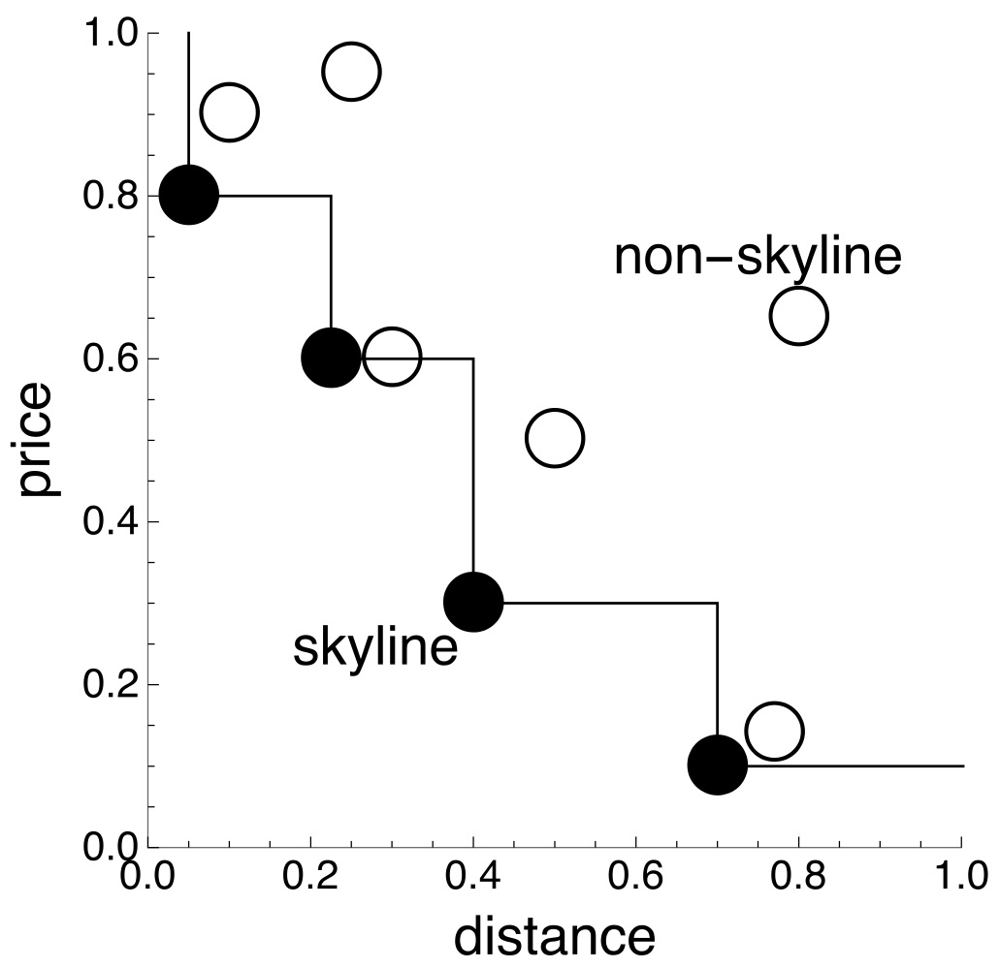

	* **Skyline Points**:

		* Marked as **black circles**.
		* These points represent tuples that are not dominated by any other points in the dataset.

		* They form a “step-like” structure, as moving along the skyline involves improving one attribute while potentially sacrificing the other.

	* **Non-Skyline Points**:

		* Marked as **white circles**.
		* These points are dominated by one or more skyline points.


## Properties

* **Skyline as Top-1 with Respect to Some Monotone Scoring Function**:

	* A tuple t is in the skyline **if and only if** it can be the **top-1 result** for at least one monotone scoring function.

	* This means that skyline tuples are ==**potentially optimal**== under certain weightings or preferences, making them versatile for various scenarios.

* **Skyline ≠ Top-k Query**:

	* **Difference**:

		* A **top-k query** ranks tuples based on a single, predefined scoring function and retrieves the top k tuples from that ranking.

		* A **skyline query**, however, identifies all tuples that are not dominated by others, independent of any specific scoring function.

	* **Implication**:
		* There is no universal scoring function that can rank all skyline points in the top k positions across all instances.
		* Skylines are determined using the concept of ==**dominance**==, not by sorting or ranking using a scoring function.


## Queries in SQL

* **Proposed Syntax**:

	This is not a standard SQL feature but a suggested extension to SQL for implementing skyline queries.

	```sql
	SELECT ... 
	FROM ...
	WHERE ...
	GROUP BY ... HAVING ...
	SKYLINE OF [DISTINCT] d1 [MIN | MAX | DIFF], ..., dm [MIN | MAX | DIFF]
	ORDER BY ...
	```

	* Attributes (dimensions) `d1`, `d2`, …, `dm` are listed in the `SKYLINE OF` clause.
	* Each attribute can have one of the following criteria:
		* **`MIN`**: Lower values are preferred (e.g., price).
		* **`MAX`**: Higher values are preferred (e.g., rating).
		* **`DIFF`**: The goal is to minimize the absolute difference between values.

* **Example**:

	Query: Find hotels in Paris that are not dominated in terms of both price and distance.

	```sql
	SELECT * 
	FROM Hotels 
	WHERE city = 'Paris' 
	SKYLINE OF price MIN, distance MIN
	```

	* This query retrieves hotels in Paris such that: No other hotel is both cheaper (**price MIN**) and closer (**distance MIN**) at the same time.

	* The result is a **skyline set** of hotels based on the specified dimensions.

	* It can be translated into Naive Nested SQL (performance is very slow):

		```sql
		SELECT * 
		FROM Hotels h
		WHERE h.city = 'Paris' 
		  AND NOT EXISTS (
		    SELECT * 
		    FROM Hotels h1
		    WHERE h1.city = h.city 
		      AND h1.distance <= h.distance 
		      AND h1.price <= h.price 
		      AND (h1.distance < h.distance OR h1.price < h.price)
		  )
		```


## Block Nested Loop (BNL)

* **Input**:

	* A dataset $D$ of multi-dimensional points (tuples).

* **Steps**:

	1. Initialize an empty set $W$ , which represents the current skyline.

	2. Iterate over every point $p$ in $D$ .

	3. Check if $p$ is dominated by any point in $W$ :
		* If **not dominated**, do the following:
				1. Remove from $W$ all points that are dominated by $p$ .
				1. Add $p$ to $W$ .

	4. Return $W$ as the skyline.

* **Output**:

	* The **skyline** of $D$ , which is the set of non-dominated points.

* **Time Complexity**:

	* The dominance check involves comparing p against every point in W , making the process quadratic in the worst case: $O(n^2), \text{ where } n = |D|$
	* The quadratic complexity makes this algorithm impractical for large datasets.

	

## Sort-Filter-Skyline (SFS)

* **Input:**
	* $D$ : A dataset of $n$ multi-dimensional points (tuples).
	* A monotone function $f$ of the attributes of $D$ , used for sorting.

* **Steps:**

	1. **Pre-Sorting**:
		* Sort $D$ into a list $S$ based on a **monotone function** $f$ of its attributes.
			* A monotone function ensures that tuples appearing earlier in $S$ are more likely to dominate tuples appearing later.

	2. **Initialization**:
		* Create an empty set $W = \emptyset$ , which will hold the skyline points.

	3. **Skyline Computation**:
		* For each tuple $p$ in $S$ , do the following:
			1. **Check Dominance**:
				* Compare $p$ against all tuples currently in $W$ :
					* If $p$ is dominated by any tuple in $W$ , **skip** $p$ and proceed to the next tuple.
					* If $p$ is not dominated, proceed to the next step.
			2. **Update Skyline**:
				* Add $p$ to $W$ .

	4. **Termination**:
		* After processing all tuples in $S$ , $W$ contains the skyline points.

* **Output:**

	* $W$ : The set of non-dominated tuples in $D$ (i.e., the **skyline**).

* **Key Properties of SFS**

	* **Pre-Sorting Benefits**:
		* Sorting ensures that tuples likely to dominate others are processed earlier.
		* If $p_1$ appears earlier than $p_2$ in $S$ , $p_2$ cannot dominate $p_1$ .

	* **Reduction in Comparisons**:
		* Once a tuple $p$ is determined to belong to the skyline, any tuple appearing later in $S$ cannot dominate $p$ .

	* **Current Skyline Maintenance**:
		* As tuples are processed, $W$ always contains the skyline of the processed subset of $S$ .

	* **Immediate Output**:
		* A tuple $p$ that is not dominated can immediately be included in the skyline.

* **Time Complexity:**

	* **Sorting**:
		* Sorting $D$ by the monotone function $f$ takes $O(n \log n)$ .

	* **Dominance Check**:
		* For each tuple, compare against tuples in $W$ , which can result in $O(n^2)$ in the worst case.
		* Thus, total time complexity is $O(n^2)$ in the worst case, dominated by the dominance checks.


### Example

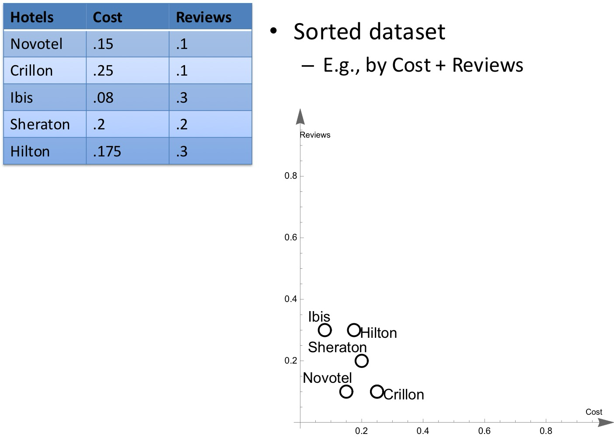


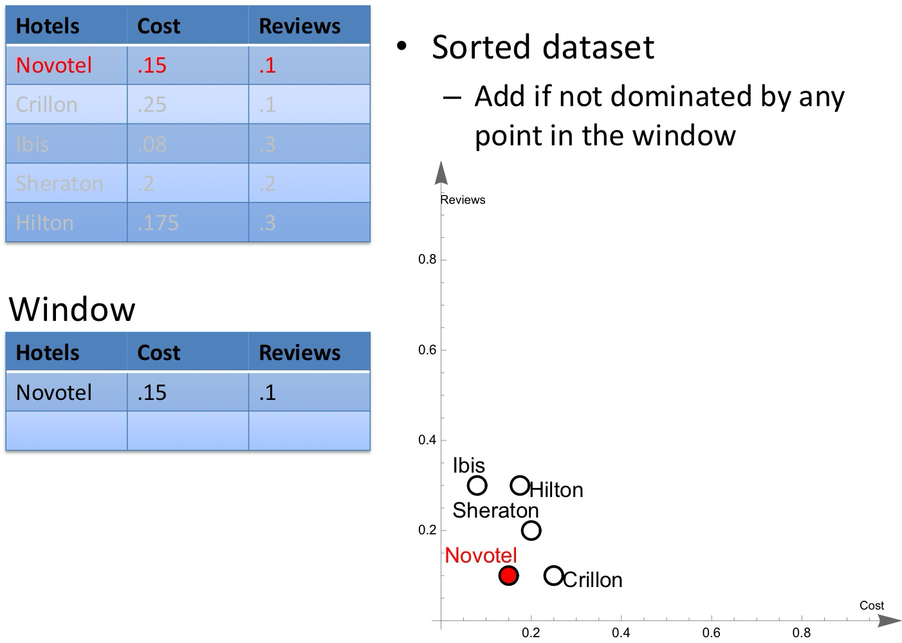


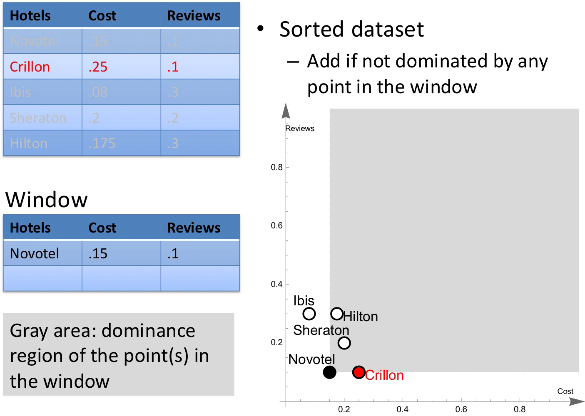


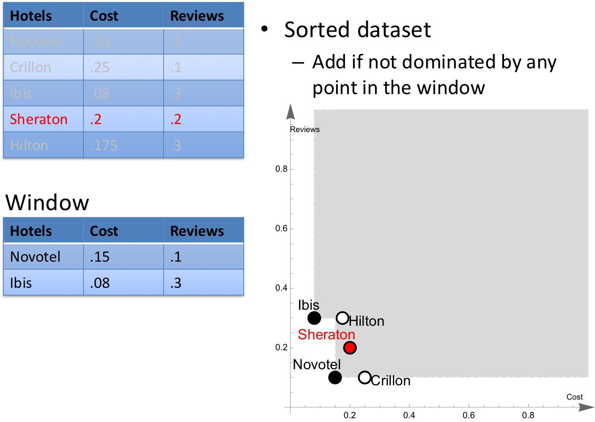


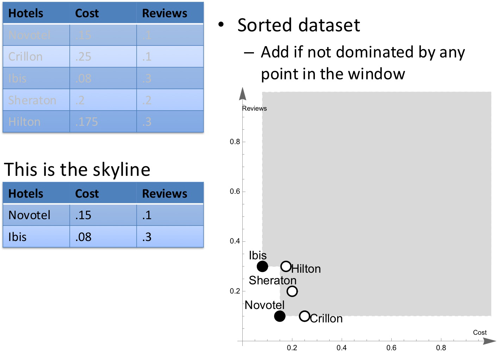


## k-Skyband

* **Definition**:
	* A $k$**-Skyband** includes all tuples that are dominated by fewer than $k$ other tuples.
	* **Skyline** queries are a special case of $k$-Skyband, where $k = 1$ (i.e., the skyline includes tuples dominated by zero other tuples).

* **Advantages of** $k$**-Skyband**:
	* Reduces the size of the result set in cases where too many tuples qualify as non-dominated.
	* $k$-Skybands provide a more **graded hierarchy** of results, allowing users to balance between dominance and cardinality.

* **Relationship with Top-**$k$ :
	* Every **Top-**$k$ result set is contained within the $k$**-Skyband**, making it a flexible mechanism for filtering.


### Example

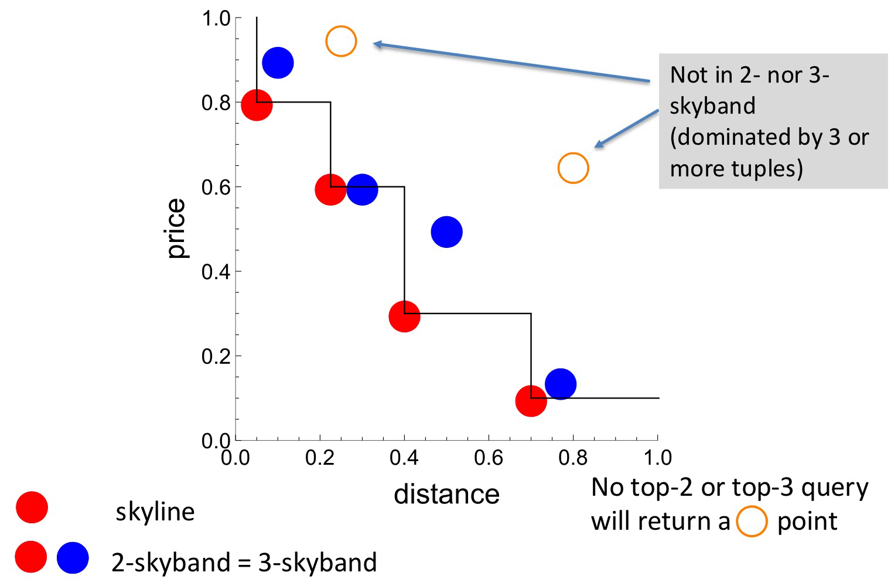
