# Reliability Definition & DBMS Architecture 

* **Definition of Reliability**:

	* Reliability is defined as the ability of a system or item to perform a required function under stated conditions for a specific period of time.

* **Reliability in Databases**:

	* In databases, reliability is crucial to ensure that transactions are processed correctly and the system behaves predictably.

	* **Reliability control** in databases ensures two fundamental properties of transactions:
		* **Atomicity**: Transactions are “all or nothing.” This means that a transaction either completes fully or does not happen at all.
		* **Durability**: Once a transaction is completed, its effects are permanent and survive system failures.

* **DBMS Architecture for Reliability**:

	* A **Database Management System (DBMS)** is designed with specific mechanisms to support reliability.
	* It ensures that transactions adhere to atomicity and durability requirements.

* **Keys to Database Reliability**:
	* Two critical factors for ensuring database reliability are:
		* **Stable Memory**: Reliable hardware or memory components that persist data even after power loss or crashes.
		* **Log Management**: Maintaining logs of database operations to help recover data and maintain consistency in case of failures.


## The Reliability Manager

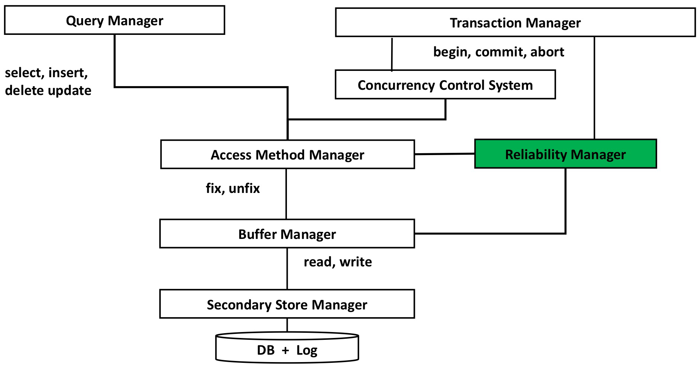

* **Role of the Reliability Manager**:
	* **Transactional Commands**: It ensures the realization of transactional commands like commit (to finalize a transaction) and abort (to undo changes made by a transaction).
	* **Read/Write Coordination**: It orchestrates access to data pages and log pages, ensuring consistency between the database’s state and its log.
	* **Failure Recovery**: It plays a critical role in recovering the system after failures by utilizing transaction logs and stable storage.


# Persistence of Memory & Backup

* **Durability**:

	* Durability refers to the idea that once a transaction is committed, its effects are permanent, even in the face of failures.
	* This requires memory systems that can reliably store data for long periods.
	* However, durability is often an **abstraction**, as no physical memory can guarantee eternal reliability. Instead, it is achieved through layered processes and technologies.

* **Types of Memory**:

	* **Main Memory**:
		* Not persistent.
		* Data is lost when power is removed (e.g., RAM).

	* **Mass Memory**:
		* Persistent but prone to physical damage or corruption.
		* Includes hard drives, SSDs, and other long-term storage systems.

	* **Stable Memory**:
		* Conceptually designed to be immune to damage, but this is an **abstraction** (idealized system).
		* Practically, stable memory has a very low probability of failure, achieved through redundancy and robust protocols.

* **Stability in Practice**:

	* Stability is maintained through:
		* **Replication**: Storing multiple copies of data across different locations or devices to avoid single points of failure.
		* **Write Protocols**: Ensuring data is written and verified correctly to prevent corruption.

* **Failure and Disaster Recovery**:

	* Despite precautions, failures in stable memory can still occur.
	* Addressing such failures is part of **disaster recovery**, a specialized discipline that focuses on restoring data and systems after catastrophic events.


## How to Guarantee Stable Memory

* **On-line replication**: mirroring of two disks

	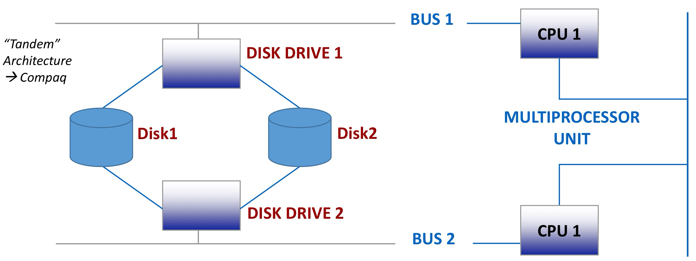

	* **Disk Drive 1 and Disk Drive 2**: Representing mirrored disks, where data is duplicated for redundancy.

	* **CPU 1** and a **Multiprocessor Unit**: Illustrating a system that may also use redundant processors to handle failures.

	* **Bus 1 and Bus 2**: These provide communication pathways between components, and redundancy ensures continued operation even if one bus fails.

* **Off-line replication**: "tape" units (backup units)

	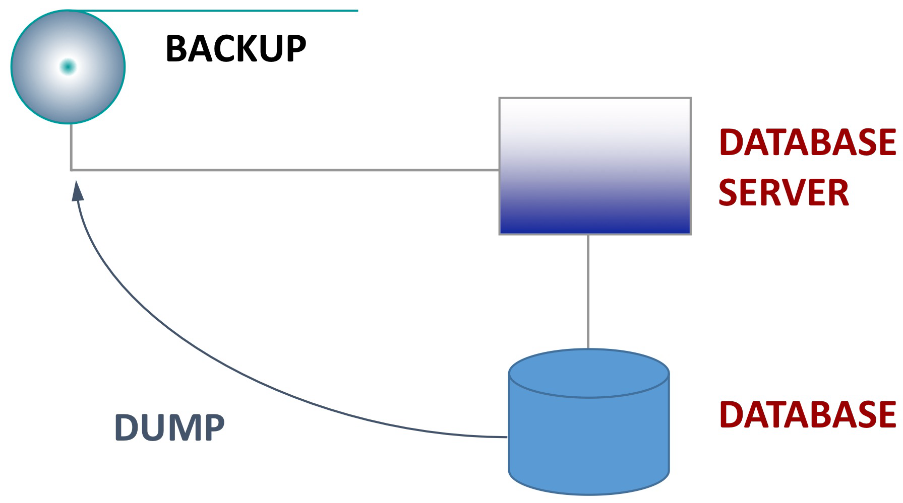

	* **Database Server**: Represents the main operational system managing the database.
	* **Database**: The actual data storage being managed by the server.
	* **Backup**: An independent storage system where periodic dumps of the database are saved.
	* The arrow labeled “DUMP” illustrates the flow of data from the database to the backup unit.


# Buffer Management 

* **Rationale**:
	* **Reducing Data Access Time**: Buffers are used to temporarily store data in faster main memory to reduce access times compared to secondary storage.
	* **Deferred Writing**: Data modifications are often deferred, meaning they are written to slower secondary storage (disks) at a later time to improve performance.

* **Organization of Memory Management**:

	* **Buffer Content**: Data is organized in buffers, accessed in chunks called **pages**.
	* **Page Details**:
		* **Transaction Counter**: Keeps track of how many transactions are currently using the page.
		* **Dirty Flag**: Indicates if the page has been modified. If true, the page must eventually be written back to secondary storage to maintain data consistency.

* **Resource Allocation**:

	* On dedicated **Database Management System (DBMS)** servers, up to **80% of physical memory** is typically allocated for buffers. This highlights the importance of memory for performance optimization in DBMS.

		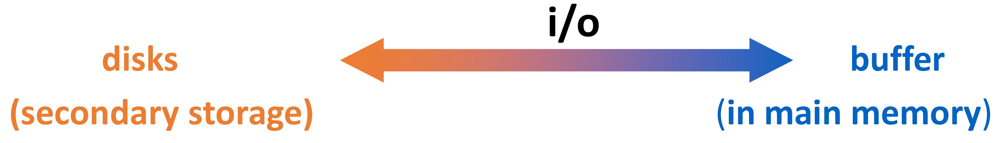


## Use of Main Memory (Buffer)

**Buffer Management Primitives**: These are the fundamental operations used to manage pages in the buffer pool:

* **Fix**:

	* Loads a page from disk into the buffer pool.

	* Increments the **usage count** of the page to track how many transactions are using it.
	* Returns a reference to the page for further operations.

* **Unfix**:

	* Decrements the usage count of a page when a transaction no longer needs it.
	* If the usage count reaches **zero**, the page becomes eligible for eviction or flushing.

* **Force**:

	* Synchronously writes a page from the buffer to disk.
	* Ensures that all updates to the page are immediately persisted on disk.

* **SetDirty**:

	* Marks a page as “dirty,” indicating that it has been modified and needs to be written to disk eventually.

* **Flush**:

	* Writes dirty pages from the buffer to disk **asynchronously**.
	* Triggered when a page is no longer needed (usage count = 0) or during buffer pool management (e.g., eviction).

	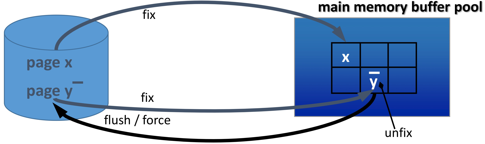


### Execution of a Fix Primitive

* **Searching for the Target Page**:

	The system first checks if the requested page is already present in the buffer:

	* If found, the **usage counter** for that page is incremented to indicate that another transaction is using it.
	* A reference to the page is returned for further use.

* **Finding a Free Page**:

	If the page is not in the buffer, the system searches for a free page slot:

	* A page with a **usage counter = 0** is considered free.
	* **Replacement policies** like **FIFO (First-In-First-Out)** or **LRU (Least Recently Used)** are used to identify which page to replace.
	* If the selected page has its **dirty flag** set (indicating it has been modified), the page is flushed (written back to disk) before it is evicted.

* **No Free Page Available**:

	If no free page is found, the system must select a page to evict based on its buffer management policy:

	* **==STEAL== Policy**:
		* A victim page is selected even if it belongs to an active transaction.
		* If the victim page is dirty, it is flushed to disk before eviction.
		* The new page is then loaded into the buffer, its usage counter incremented, and a reference is returned.

	* **==NO STEAL== Policy**:
		* No page belonging to an active transaction is evicted.
		* The transaction requesting the page is put on a **wait list**, and the system waits until a free page becomes available.


## Buffer Management Policies

* **Write Policies**:

	* Write policies determine how and when pages in the buffer pool are written to disk:

		* **FORCE**:
			* Pages are written to disk immediately at the time of a transaction commit.
			* Guarantees durability but can negatively affect performance due to synchronous disk writes.

		* **NO FORCE**:
			* Pages are not immediately written to disk. The buffer manager delays writing until it becomes necessary (e.g., buffer eviction).
			* Improves performance by allowing asynchronous writes.

	* **Default Configuration**:
		* Most database systems, including MySQL InnoDB, use a combination of **NO STEAL** (no eviction of active transaction pages) and **NO FORCE** for better performance.

* **PRE-FETCHING** (Read-Ahead in MySQL InnoDB):

	* Anticipates the pages that are likely to be read soon and loads them into the buffer proactively.
	* Particularly effective for **sequential reads**, where access patterns are predictable.
	* Reduces wait times for subsequent read operations.

* **PRE-FLUSHING**:

	* Anticipates the need to write modified (dirty) pages to disk and performs the writes proactively.
	* Helps speed up operations that require free pages by reducing the time spent flushing pages during eviction.

* **MySQL InnoDB LRU Buffer Management**:

	* Uses **Least Recently Used (LRU)** as a replacement policy for evicting pages from the buffer pool.
	* Maintains a balance between recently accessed pages and pages that need to remain for ongoing operations.


# Reliable Transaction Management

**Definition of a Transaction**: A transaction is an **atomic transformation** that moves the database from an initial state to a final state. This means it either completes fully (commit) or does not affect the database at all (rollback).


## Failure handling

* **Possible Outcomes in the Presence/Absence of Failures**:

	* **Commit (Success)**:
		* Indicates the transaction was completed successfully, and its changes are permanent.

	* **Rollback or Fault ==Before== Commit**:
		* If a failure occurs before the transaction is committed, it must be **undone**.
		* This ensures the database returns to its original state.

	* **Fault ==After== Commit**:
		* If a failure occurs after the commit but before changes are flushed to secondary storage, a **redo** (replay of transaction changes) is required to ensure durability.

* **Implications for Recovery After Failure**:

	* **Failure Between Commit and Flush**:

		If the system fails after a transaction is committed but before all changes are written to disk:

		* The **Reliability Manager** must perform a **redo** to ensure that the committed changes are applied during recovery.

	* **Failure Before Commit**:

		If the system fails before the transaction is committed:

		* The **Reliability Manager** must perform an **undo** (rollback) of all partial changes to maintain atomicity and prevent inconsistent database states.


### Transations & Recovery

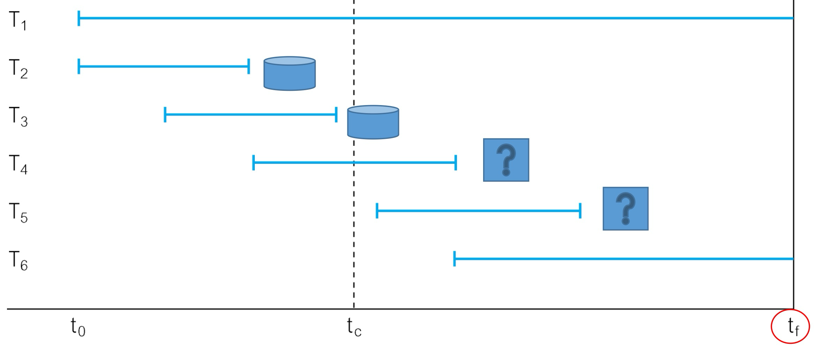

* **Timeline**:
	* **Start at** $t_0$ : The DBMS starts working and handles transactions.
	* **Time** $t_c$ : Some transactions commit successfully.
	* **Time** $t_f$ : A failure happens, interrupting the DBMS operations.
* **Transaction States**:
	* **T1:**
		* Started but did **not commit** before the failure.
		* Must be **undone** (rolled back) to remove any partial or incomplete changes.
	* **T2 and T3:**
		* Both transactions **committed before the failure**.
		* Data for these transactions is already written to disk, so no further action is needed. They are safe.
	* **T4 and T5:**
		* Both transactions **committed**, but it’s **unclear** if their changes were completely written to disk before the failure.
		* To ensure durability, the DBMS must **redo (replay)** these transactions so their changes are properly written to disk.
	* **T6:**
		* Started after $t_c$ , but it **did not commit** before the failure.
		* Must be **undone** to remove any partial changes.


# Log Management 

## Transaction Log

* **Definition**:

	* A transaction log is a **sequential file** that records every action performed by a transaction.
	* It contains a detailed record of all operations, including updates, transaction start, commit, and rollback.

* **Structure**:

	* Each transaction generates a sequence of entries (records) in the log.
	* The log is written **sequentially**, meaning each operation is recorded one after the other in order.

	* The “top” represents the **current instant**—the latest operation recorded in the log.

		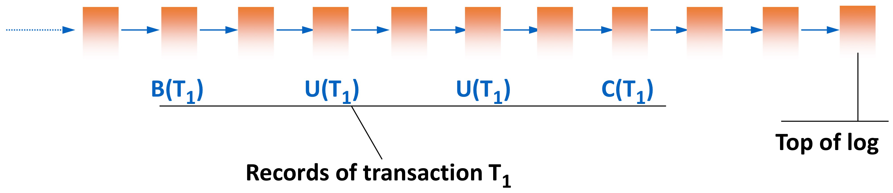

		* **B(T1)**: Marks the **beginning of transaction T1**.
		* **U(T1)**: Represents **updates** made by T1 (e.g., changes to database pages).
		* **C(T1)**: Indicates that **transaction T1 has committed**, ensuring all its changes are durable.


## Function of Log

* **Records State Transitions**:
	* The transaction log records actions performed by transactions in **stable memory**.
	* These actions are logged in terms of **state transitions** for database objects.

* **Example: Update Operation**:

	* Suppose an UPDATE operation changes an object $O$ from value $O_1$ to value $O_2$ :
		* The log records:
			* **BEFORE-STATE**: $O_1$ (the original value before the update).
			* **AFTER-STATE**: $O_2$ (the new value after the update).

	* This ensures that the database can:
		* Undo the change (using the **BEFORE-STATE**) if needed.
		* Redo the change (using the **AFTER-STATE**) in case of recovery.

* **Handling Different Operations**:

	* **INSERT**:
		* The log records only the **AFTER-STATE** since there is no previous state for a newly inserted object.

	* **DELETE**:
		* The log records only the **BEFORE-STATE** since the object is removed and has no new state.


## Using the Log

* **UNDO**: For a failure that occurs **before** a transaction is committed, or if the transaction is explicitly rolled back, reverts the database object to its state before the transaction began.

	* $T1$ modifies object $O$ from $O_1$ to $O_2$ .

	* If $T1$ is undone, the database reverts $O$ to $O_1$ (the **BEFORE-STATE**).

* **REDO**: For a failure that occurs **after** a transaction is committed but before its changes are fully saved to disk, reapplies the transaction’s changes to ensure they are saved.

	* $T1$ modifies object $O$ from $O_1$ to $O_2$ .
	* If $T1$ is redone, the database ensures $O$ is set to $O_2$ (the **AFTER-STATE**).

* **Idempotency of UNDO and REDO**:

	**Idempotency** ensures that applying the same operation multiple times produces the same result, which is critical for reliability.

	* **UNDO is Idempotent**:
		* `UNDO(T) = UNDO(UNDO(T))` : If UNDO is applied more than once, the object still remains in its **BEFORE-STATE**.

	* **REDO is Idempotent**:
		* `REDO(T) = REDO(REDO(T))` : If REDO is applied more than once, the object still remains in its **AFTER-STATE**.
	* The **Reliability Manager** may need to perform UNDO or REDO operations multiple times, especially if:
		* There is uncertainty about whether a write was successfully flushed to disk.
		* A failure occurs during the recovery process itself.
	* **Idempotency guarantees** that the database remains consistent regardless of how many times an operation is applied.


## Types of Log Records

* **Transactional Commands**

	These records capture key transaction events:

	* **B(T)**: Beginning of a transaction T.
	* **C(T)**: Commit of a transaction T.
	* **A(T)**: Abort or rollback of a transaction T.

* **Operations on Database Objects**

	These records track changes made by specific operations:

	* **U(T, O, BS, AS)**: Update operation:
		* T : Transaction identifier.
		* O : Object identifier.
		* BS : Before state of the object.
		* AS : After state of the object.

	* **I(T, O, AS)**: Insert operation:
		* T : Transaction identifier.
		* O : Object identifier.
		* AS : New state of the inserted object.
	* **D(T, O, BS)**: Delete operation:
		* T : Transaction identifier.
		* O : Object identifier.
		* BS : State of the object before deletion.

* **Recovery Actions**

	These records are created for system recovery purposes:

	* **DUMP**: Captures a snapshot of the current database state.
	* **CKPT(T1, T2, …, Tn)**: Represents a checkpoint, listing active transactions at the time.


## Transactional Rules

These rules ensure that all database write operations are reliable and recoverable, guaranteeing the ACID properties (Atomicity, Consistency, Isolation, Durability) of transactions.

* ==**Write-Ahead Log (WAL) Rule**==

	* **Definition**:
		* Before any changes are made to the actual database, the **BEFORE-STATE** of the data must be written to the log.

	* **Purpose**:
		* Ensures that changes can always be **undone** if necessary (e.g., during rollback or failure recovery).

	* **Mechanism**:
		* Write the **BEFORE-STATE** to the log file.
		* Only then proceed with applying the corresponding changes to the database.

* ==**Commit Rule**==

	* **Definition**:
		* Before a transaction is considered committed, the **AFTER-STATE** of the data must be recorded in the log.

	* **Purpose**:
		* Ensures that changes can always be **redone** during recovery if the system crashes after a transaction is committed but before the changes are saved to disk.

	* **Mechanism**:
		* Write the **AFTER-STATE** of all changes made by the transaction to the log.
		* Once the log is updated, mark the transaction as committed.
		* The **commit log record** (indicating that a transaction is committed) must be written to disk synchronously.
		* This is a **force operation**, ensuring durability by making the commit record persistent immediately.

* **Key Notes**

	* **Database Writes Are Asynchronous**:
		* Database changes are typically written to disk asynchronously to improve performance.
		* This makes proper logging even more critical for recovery.

	* **Impact on Recovery**:

		Following the WAL and Commit Rules ensures:

		* **UNDO operations** can always restore the database to a consistent state.
		* **REDO operations** can reapply committed changes that were not saved due to failure.


## Writing onto Log & Database

* Writing onto the database before commit

	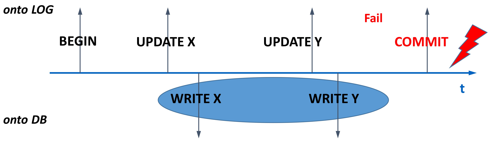

	* **What Happens**:
		* If a failure occurs **before the COMMIT**, the transaction is incomplete.
		* The changes (e.g., WRITE X, WRITE Y) in the database are not considered permanent.
	* **Why REDO is Not Necessary**:
		* The database state matches the state recorded in the log at the point of failure.
		* Since the COMMIT was not logged, the system knows that this transaction was incomplete and can **UNDO** any partial changes using the log.

* Writing onto the database after commit

	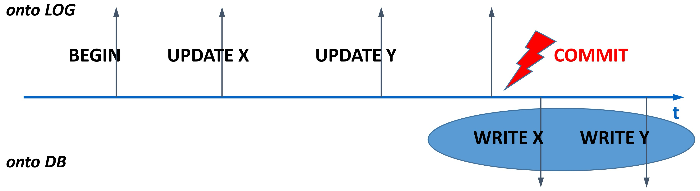

	* **What Happens**:
		* If a failure occurs **after the COMMIT**, the transaction is already considered complete and valid.
		* The database state can be recovered using the transaction log.
	* **Why UNDO is Not Necessary**:
		* Since the transaction is committed, there is no need to reverse any changes.
		* Any incomplete database writes can be completed using the log (via a **REDO** operation).

* Writing onto the database in arbitrary points in time

	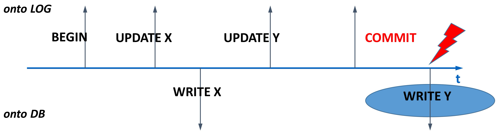

	* **Before Commit**:
		* WRITE X is applied to the database.
		* If a failure occurs here, the transaction is incomplete, and the system must **UNDO** WRITE X to restore the database to a consistent state.
	* **After Commit**:
		* WRITE Y is applied after the commit.
		* If a failure occurs here, the transaction is committed, and the system must **REDO** WRITE Y to ensure durability.


# Recovery after Failures

## Types of Failure

* **Soft Failure**

	* **Description**:
		* Loss of part or all contents of the **main memory** (e.g., RAM), typically due to a system crash or power outage.

	* **Recovery Method**:

		* Requires a ==**warm restart**==:
			* Restarting the system without loss of data on stable storage (e.g., hard disks).

		* The **transaction log** is used to:
			* **Redo committed transactions**: Reapply changes from the log that were not saved to the database before the failure.
			* Ensure consistency by using the log to reconstruct the state of the database.

* **Hard Failure**

	* **Description**:
		* Failure or loss of part or all contents of **secondary memory devices** (e.g., hard drives, SSDs).
		* This type of failure can result in permanent data loss if backups are not available.

	* **Recovery Method**:

		* Requires a ==**cold restart**==:
			* Rebuilding the database from a **dump** (a backup copy of the database).
			* Replay the **transaction log** to recover changes made since the last dump.

		* **Steps**:
			1. Load the latest database dump.
			2. Apply all subsequent log entries to restore the database to its most recent state.

* **Disaster**

	* **Description**:
		* Loss of **stable memory**, including both the log and the database dump.
		* Represents catastrophic data loss.


## Checkpoint

A **checkpoint** is a mechanism used in database systems to create a **consistent snapshot** of the system state at a specific point in time. It is performed periodically by the **Reliability Manager** to streamline recovery processes and improve system performance.

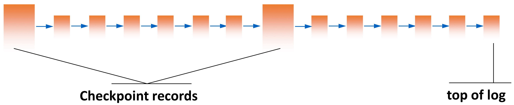

* **What Happens During a Checkpoint**:
	* **Flush Committed Transactions**:
		* All transactions that are committed at the time of the checkpoint write their changes to the database (making them persistent on disk).
	* **Record Active Transactions**:
		* Active (not yet committed) transactions are recorded in the log.
		* This information is used during recovery to determine which transactions need to be undone.
	* **Create a Checkpoint Record**:
		* The checkpoint record includes:
			* List of active transactions.
			* Information on which operations are complete and flushed to disk.
		* Ensures that the log is up to date.

* **Checkpoint Execution Process**:

	* **Suspend New Operations**:

		* Temporarily halt the acceptance of new **commit** and **abort** requests to ensure consistency during the checkpoint process.

	* **Flush Dirty Buffer Pages**:

		All **dirty pages** (in-memory pages modified by committed transactions) are written to mass storage (disk).

		* **Step 1**: Ensure the corresponding **log entries** for these operations are forced to disk (if not already done).
		* **Step 2**: Flush the page itself to disk, making it persistent.

	* **Record Active Transactions**:

		* The identifiers of all transactions **still in progress** (not yet committed) are recorded in the checkpoint (CKPT) log record.
		* This ensures that during recovery, the system knows which transactions need to be undone.
		* No new transactions are allowed to start while this process is ongoing.

	* **Resume Operations**:

		* Once the checkpoint is complete, the system resumes accepting new operations (commits, aborts, and transaction starts).

* **Guarantees of a Checkpoint**:

	* **For Committed Transactions**:
		* All data for committed transactions is safely stored on disk.
		* These transactions are no longer dependent on logs for recovery.
	* **For In-Progress Transactions**:
		* Transactions that are “halfway through” are captured in the checkpoint log record.
		* Their state is saved, allowing recovery mechanisms to decide whether to undo or redo their changes during a crash.


## Dump

A **dump** refers to a **complete backup copy** of the database taken at a specific point in time. This backup is created to ensure that the database can be restored to a consistent state if a major failure occurs.


* **Full Backup**:
	* Captures the entire database as a snapshot.
	* Typically includes both user data and metadata.

* **Scheduled Execution**:
	* Dumps are usually performed at **low-activity times** (e.g., during the night or weekends) to minimize disruption to database operations.

* **Log Integration**:
	* The availability and timestamp of the dump are recorded in the transaction **log**.
	* This ensures that the dump can be located and referenced during recovery.

* **Storage**:
	* The dump is stored in **stable memory** (e.g., on external or reliable storage devices).
	* Stable memory ensures durability and accessibility of the backup.


## Warm Restart

A **warm restart** occurs when the database system loses its **main memory buffer pages** (e.g., due to a crash or power failure) but the persistent data on disk remains intact. The primary goal of a warm restart is to restore the system’s state by replaying logged transactions and resolving incomplete operations.

* **Characteristics**:

	* **Loss of Volatile Data**:
		* The content of **main memory buffers** is lost (e.g., temporary caches or unflushed pages).
		* However, the actual **table data on disk** is unaffected and remains consistent.

	* **Replaying Transactions**:
		* The system uses the **transaction log** to replay operations and recover the lost state.
		* This ensures consistency by handling both completed and incomplete transactions.

* **Steps in a Warm Restart**:

	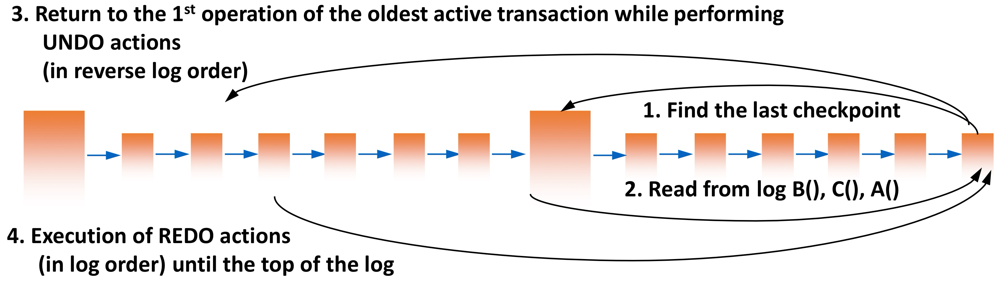

	1. **Start from the Last Checkpoint**:
		* Log records are read starting from the **last checkpoint**.
		* A checkpoint is a stable point where all changes from committed transactions were written to disk.

	2. **Identify Active Transactions**:

		* The **checkpoint record** lists all **active (in-progress)** transactions at the time of the crash.

		* These transactions are divided into two categories:

			* **==UNDO== Set**: Transactions that need to be undone (not yet committed at the time of the crash).

				```sql
				UNDO = active transactions@CKPT;
				```

				* Includes transactions that were active (in-progress) at the checkpoint and remain incomplete.

			* **==REDO== Set**: Transactions that need to be redone (committed, but their changes may not have been flushed to disk).

				```sql
				REDO = empty;
				```

				* Initially empty but populated with committed transactions encountered after the checkpoint.

		* **Steps to Build UNDO and REDO Sets**:

			* **For log records from CKPT(checkpoint) to TOP (latest log entry)**:

				```sql
				IF B(Ti) then UNDO += Ti # started, may be undone
				IF C(Tj) then UNDO -= Tj; REDO += Tj # ended, to redo
				```

	3. **Execute ==Undo and Redo== Actions**

		* **Undo Actions**:

			* **Log Records Processed in Reverse Order**: Start from the most recent log entry (TOP) and move backward to the **first action** of the oldest transaction in UNDO.

				```sql
				undo(Ti) where Ti is in UNDO
				```

		* **Redo Actions**: 

			* **Log Records Processed in Forward Order**: Start from the **first action** of the oldest transaction in REDO and move forward to the TOP.

				```sql
				redo(Ti) where Ti is in REDO
				```


### Example of Warm Restart

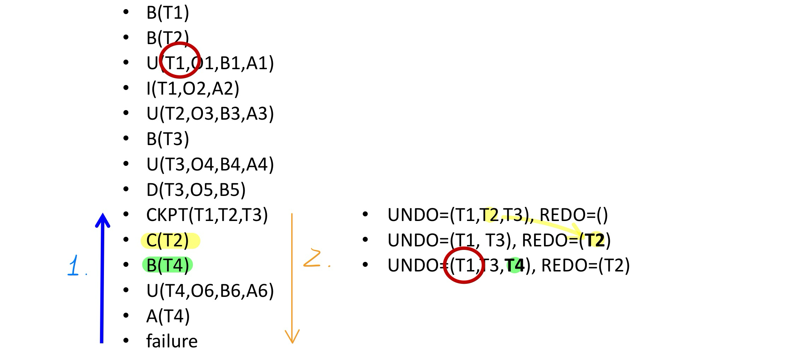

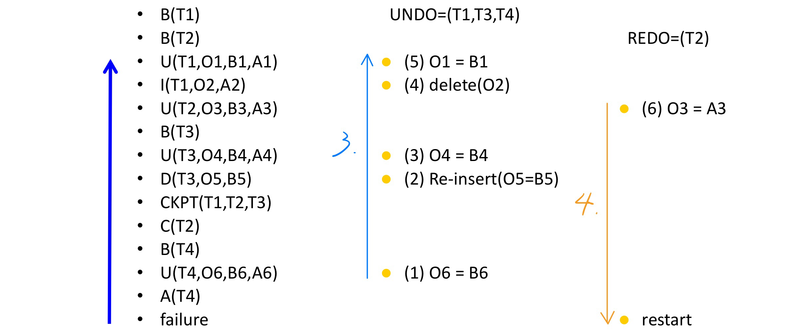


## Cold Restart

A **cold restart** occurs when the database system experiences a **hard failure**, such as the loss or failure of part of the **secondary memory devices** (e.g., disk failure or corruption).

* **Steps in Cold Restart**

	1. **Restore Data from Dump**:
		* A **dump** is a complete backup copy of the database stored at a known, stable point in time.

	2. **Replay Log Records**:
		* Operations recorded in the log are replayed **in log order** (from the point of the dump to the failure point).

	3. **Execute Warm Restart**:

		A **warm restart** is executed to handle any uncertain transactions:

		* **Undo uncertain/incomplete transactions** that were in progress at the time of failure.
		* **Redo committed transactions** to ensure durability.
