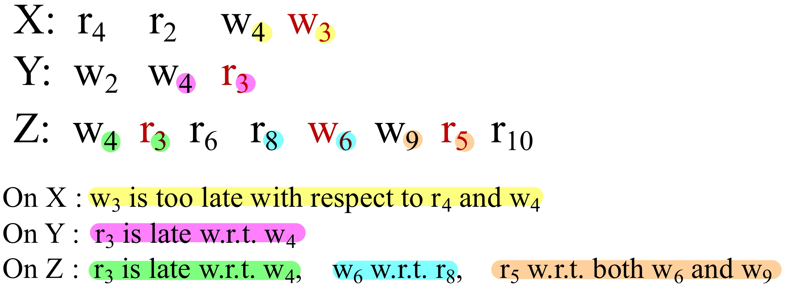
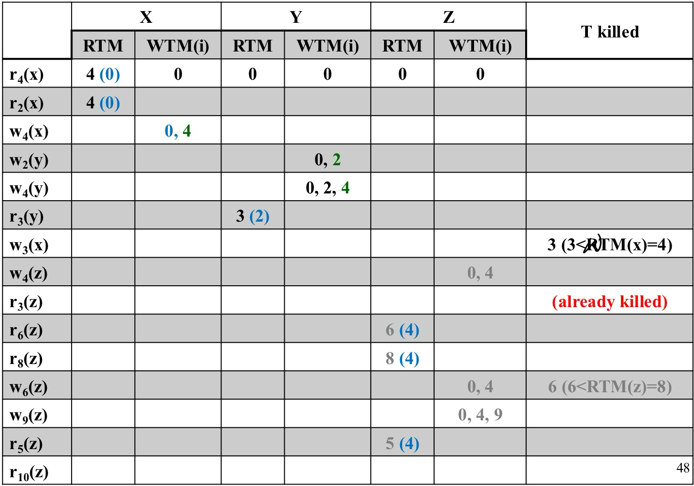
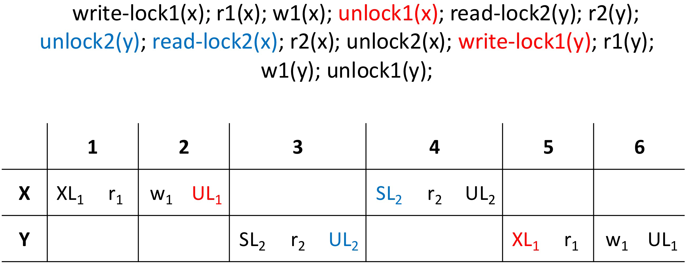
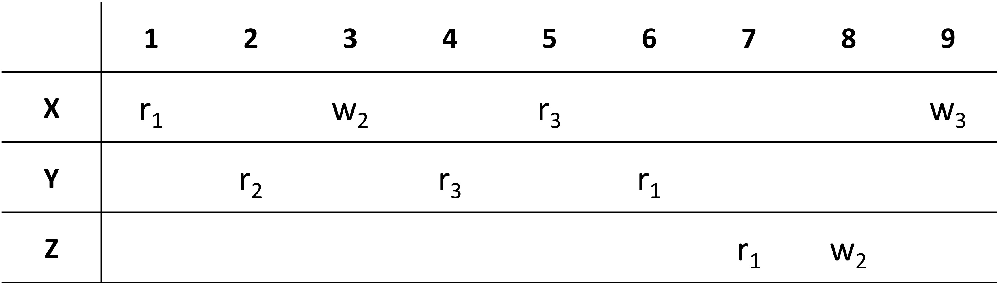
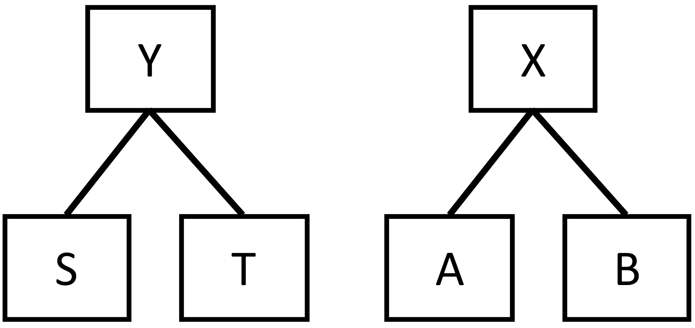
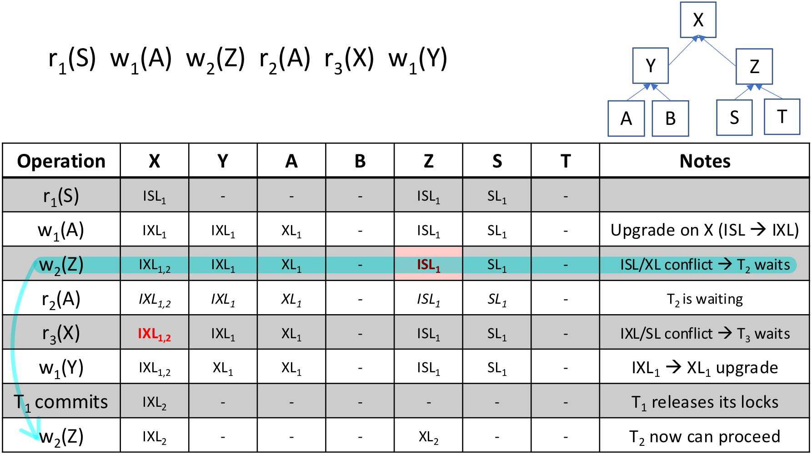

# CSR & VSR

S : r1(x) r2(y) w3(y) r5(x) w5(u) w3(s) w2(u) w3(x) w1(u) r4(y) w5(z) r5(z)

----

Only depict read-write, write-write, write-read pairs, ==**NO read-read pair!**==

==**No cycles in the graph**: the schedule is CSR (and then also VSR)==

S : r2(u) w2(s) r1(x) r2(y) w3(y) r5(x) w5(u) w3(s) w2(u) w3(x) w1(u) r4(y) w5(z) r5(z)

----

==**The graph is cyclic**: the schedule is NOT CSR.== Is it VSR?

S : r1(x)  r2(y)  w3(y)  r5(x)  w5(u)  w3(s)  w2(u) w3(x)  w1(u)  r4(y)  w5(z)  r5(z)  r2(u)  w2(s)

----

* **Consider the cycle 2-3**

	

* **Alternative reasoning: cycle 1-2**

	

## Inactive/Dead Write

* **Definition**: a write $w_i$(X) is said to be **inactive (or dead)** if it is not the last action of resource X and the following action on X is a write $w_j$(X).
* **Property**: each schedule S $\in$ VSR and S $\notin$ CSR has, in its conflict graph, cycles of arcs due to pairs of writes of which one is inactive. These can be swapped without modifying the reads-from and final write relationships.
* Once the graph is acyclic it is possible to find a serial schedule view-equivalent to the initial one.

S : r4(x)  r2(x)  w4(x)  w2(y)  w4(y)  r3(y)  w3(x) w4(z)  r3(z)  r6(z)  r8(z)  w6(z)  w9(z)  r5(z)  r10(z)

----

* No cycles. The schedule is CSR and then also in VSR

* How to find a view-equivalent serial schedule?

	

	* In our case, the schedule 2, 4, 3, 8, 6, 9, 5, 10 is view equivalent

S : r5(x)  r3(y)  w3(y)  r6(t)  r5(t)  w5(z)  w4(x)  r3(z)  w1(y)  r6(y) w6(t)  w4(z)  w1(t)  w3(x)  w1(x)  r1(z)  w2(t)  w2(z)

----

We therefore conclude that the schedule is **not even in VSR**

# 2PL & Strict-2PL

* ==**2PL**: A transaction cannot acquire any other lock after releasing a lock==
* ==**Strict 2PL**: Locks held by a transaction can be released only after commit/rollback==

S : r1(x) r2(y) w3(y) r5(x) w5(u) w3(s) w2(u) w3(x) w1(u) r4(y) w5(z) r5(z) r2(u) w2(s)

It was CSR. Is it 2PL? Is it 2PL Strict?

----

* The schedule cannot be 2PL strict (e.g., T1 must release X before 8)
* It is also not in 2PL: an assignment is not possible for T2 (which must release Y before locking U)

# TS-mono

- The scheduler has two counters: $RTM(x)$ and $WTM(x)$ for each object
- The scheduler receives read/write requests tagged with the timestamp of the requesting transaction:

	- $r_{ts}(x)$:
		- If $\textcolor{red}{ts < WTM(x)}$, the request is **rejected** and the transaction is killed
		- Else, access is **granted** and $RTM(x)$ is set to $max(RTM(x), ts)$

	- $w_{ts}(x)$:
		- If $\textcolor{red}{ts < RTM(x)}$ or $\textcolor{red}{ts < WTM(x)}$, the request is **rejected** and the transaction is killed
		- Else, access is **granted** and $WTM(x)$ is set to $ts$

Instead of simulating the whole process, as shown in the previous slide, we may identify pairs of operations that cause killings:

# TS-multi

* The scheduler receives read/write requests tagged with the timestamp of the requesting transaction:

	* $r_{ts}(x)$ is always accepted. A copy $x_k$ is selected for reading such that:
		- If $ts > WTM_N(x)$, then $k = N$
		- Else take $k$ such that $WTM_k(x) \leq ts < WTM_{k+1}(x)$

	==For read operations, the value reported in the $RTM(x)$ column is $max(RTM(x), ts)$==

	- $w_{ts}(x)$:
		- If $\textcolor{red}{ts < RTM(x)}$ or $\textcolor{red}{ts < WTM(x)}$, the request is **rejected**
		- Else a new version is **created** ($N$ is incremented) with $WTM_N(x) = ts$

# Complete Classification

## Ex1

Classify the following schedule:

S : r1(x)  r2(y)  w3(x)  r5(z)  w6(z)  w2(x)  w3(y)  r7(z)  w4(x)

w.r.t. VSR, CSR, 2PL, 2PL-strict, TS, TS-multi under Snapshot Isolation

----

The graph is **cyclic**: the schedule is not in CSR (and therefore also not in 2PL or TS), is it in VSR?

Is the schedule in **TS-multi** under Snapshot Isolation?

## Ex2

Consider the following schedule S, where the execution of transaction T2 is nested within the execution of transaction T1. All the operations/requests performed by T1 end with 1, those performed by T2 end with 2:

S : write-lock1(x); r1(x); w1(x); unlock1(x); read-lock2(y); r2(y); unlock2(y); read-lock2(x); r2(x); unlock2(x); write-lock1(y); r1(y); w1(y); unlock1(y);

* Is S in **strict-2PL**? If not, change it to adhere to strict-2PL. Motivate your answer.

	----

	

	**Not strict-2PL**: because T1 releases a lock on X(UL1) before it commits; the same is true for T2 on Y(UL2)

* Is S in **2PL**? If not, change it to adhere to 2PL. Motivate your answer.

	---

	

	**Not 2PL**: because T1 releases a lock on X and then acquires a new lock on Y; the same happens for T2

## Ex3

Classify the following schedule

r1(X)  r2(Y)  w2(X)  r3(Y)  r3(X)  r1(Y)  r1(Z)  w2(Z)  w3(X)

w.r.t. CSR, VSR, 2PL, 2PL-strict, TS-mono and TS-multi under Snapshot Isolation:

---

* There are no cycles, so **it is CSR and VSR**

	

* The growing phase of T2 would need to start again after the beginning of T2 shrinking phase, so it is **not 2PL and not 2PL-strict**

	

* The schedule is clearly **in TS-mono** (==all timestamps are in order, but for those of the operations on Y, but these operations are all reads==), **and therefore also in TS-multi** under Snapshot Isolation

	

## Ex4

Classify the following schedule

r1(A)  r2(A)  w1(B)  w3(C)  w2(A)  r1(C)  w2(B)  w2(C)

w.r.t. VSR, CSR, 2PL, 2PL-strict, TS-mono, TS-multi under Snapshot Isolation, giving terse but precise justifications:

----

# Hierarchical Locking

## Ex1

Given the resource hierarchy above, describe the behavior of the following arrival sequence of requests managed by a scheduler that applies hierarchical locking:
$$
r1(A) \quad w1(S) \quad w2(T) \quad r2(A) \quad w1(A) \notag
$$

----

## Ex2

Given the resource hierarchy:
$$
X(Y(A, B), Z(S, T)) \notag
$$
describe the behavior of the following arrival sequence of requests managed by a scheduler that applies **hierarchical locking**.

Suppose that **locks are released after the commit** of each transaction, which occurs immediately after the last operation of each transaction.
$$
r1(S) \quad w1(A) \quad w2(Z) \quad r2(A) \quad r3(X) \quad w1(Y) \notag
$$

# Obermarck Algorithm

## Ex1

Consider the following waiting conditions:

$$
\text{Node A: } E_D \rightarrow t_1, \quad t_1 \rightarrow t_2, \quad t_2 \rightarrow E_B \\  
\text{Node B: } E_A \rightarrow t_2, \quad t_2 \rightarrow t_4, \quad t_4 \rightarrow E_C \\  
\text{Node C: } E_B \rightarrow t_4, \quad t_4 \rightarrow t_3, \quad t_3 \rightarrow E_D \\  
\text{Node D: } E_C \rightarrow t_3, \quad t_3 \rightarrow t_1, \quad t_1 \rightarrow E_A \\
\notag
$$
Simulate the Obermarck algorithm and indicate whether there is a distributed deadlock.

----

We simulate the execution - asynchronous and distributed - of the algorithm. Each node decides to send detected waiting conditions (from remote to remote)
$$
\textcolor{red}{E_h \rightarrow t_i} \rightarrow t_m \rightarrow t_n \rightarrow \dots \rightarrow t_p \rightarrow \textcolor{red}{t_j \rightarrow E_k}
\notag
$$
is translated into the message
$$
\textcolor{red}{E_h \rightarrow t_i \rightarrow t_j \rightarrow E_k} \notag
$$
**To be sent to node k if and only if i > j**

* $t_m \rightarrow t_n$ indicates a local waiting ($t_m$ waits that $t_n$ releases a resource)

* $t_m \rightarrow E_n$ indicates that $t_m$ waits the execution of a transaction on node n
* $E_m \rightarrow t_n$ indicates that $t_n$ was invoked by a transaction on node m

There is a cycle: **deadlock!!!**

## Ex2

Apply the distributed deadlock detection algorithm to the following wait-for conditions:
$$
\begin{align}
& \text{Node A:} \quad E_B \rightarrow t_1, \quad t_1 \rightarrow t_2, \quad t_2 \rightarrow E_C, \quad E_D \rightarrow t_3, \quad t_3 \rightarrow t_1 \notag \\

& \text{Node B:} \quad E_C \rightarrow t_4, \quad t_4 \rightarrow t_5, \quad t_5 \rightarrow t_1, \quad t_1 \rightarrow E_A, \quad t_6 \rightarrow E_C \notag \\

& \text{Node C:} \quad E_B \rightarrow t_6, \quad t_6 \rightarrow t_7, \quad t_7 \rightarrow E_D, \quad E_A \rightarrow t_2, \quad t_2 \rightarrow t_7, \quad t_4 \rightarrow E_B \notag \\

& \text{Node D:} \quad E_C \rightarrow t_7, \quad t_7 \rightarrow t_3, \quad t_3 \rightarrow E_A \notag \\
\end{align}
$$

## Ex3

Consider the following waiting conditions:

$$
\begin{align}
& \text{Node 1:} \quad E_2 \rightarrow t_1, \quad t_1 \rightarrow t_2, \quad E_3 \rightarrow t_2, \quad t_2 \rightarrow t_3, \quad t_3 \rightarrow E_2, \quad E_2 \rightarrow t_4, \quad t_4 \rightarrow t_3 \notag \\

& \text{Node 2:} \quad E_1 \rightarrow t_3, \quad t_3 \rightarrow t_5, \quad t_5 \rightarrow t_6, \quad t_6 \rightarrow E_3, \quad E_3 \rightarrow t_7, \notag \\

& \quad \quad \quad \quad \ \ t_7 \rightarrow t_6, \quad t_9 \rightarrow t_4, \quad t_4 \rightarrow E_1, \quad t_1 \rightarrow E_1 \notag \\

& \text{Node 3:} \quad E_2 \rightarrow t_6, \quad t_6 \rightarrow t_8, \quad t_8 \rightarrow t_2, \quad t_2 \rightarrow E_1, \quad t_7 \rightarrow E_2 \notag \\
\end{align}
$$
Simulate the Obermarck algorithm and indicate whether there is a distributed deadlock 

* $t_m \rightarrow t_n$ indicates a local waiting ($t_m$ waits that $t_n$ releases a resource)
* $t_m → E_n$ indicates that $t_m$ waits the execution of a transaction on node n
* $E_m → t_n$ indicates that $t_n$ was invoked by a transaction on node m  

