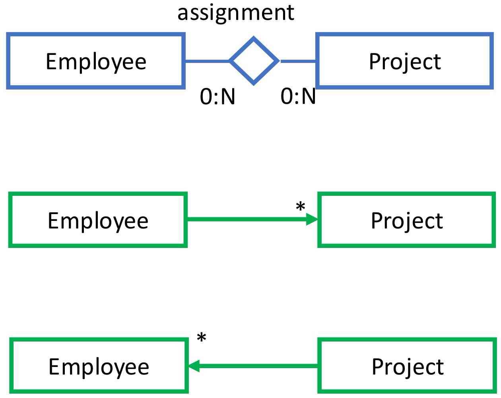

# Ex1: Building & Sensors

A smart meter data collection service manages the data generated by water smart meters installed in buildings. The collected data adhere to the following conceptual model.


The operator can choose one building, select one meter associated with that building, and see the meter readings produced by the meter (in a certain interval or all readings); the buildings in the system are in the order of hundreds. Each building has typically a few meters (e.g., one per floor or per apartment). The readings produced by a smart meter can be in the order of thousands per year. A building has an address and an ID, a meter has an id and a date of installation, and each reading has a date-time stamp and an integer positive value. A meter can be replaced. In this case, it is removed from the database, and all the corresponding readings are deleted too.

Show the JPA entities (*with all their attributes*) that map the domain objects of the conceptual model, taking into account the above-mentioned access paths of the application and data cardinalities. When designing the annotations for the relationships, specify the *owner side of the relationship*, the *mapped-by attribute*, the *fetch policy*, and the *cascading policies* you consider more appropriate to support the access required by the web application. **Comment on the design choices you have made.**


## Relationships

### contains/containedBy


* Building $\rightarrow$ Meter : `@OnetoMany` is necessary to navigate the list of meters of a building 
	* **FetchType** can be **`EAGER`**
		* Each building has typically a few meters (small amounts)
* Meter $\rightarrow$ Building : `@ManyToOne` non necessary, can be mapped for consistency
	* **Owner** = Meter
		* The entity that contains the `@ManyToOne` annotation is the owner of the relationship because its underlying table stores the FK to the referenced table


### produces/producedBy


* Meter $\rightarrow$ Reading : `@OneToMany` is necessary to get the list of readings of a meter
	* **FetchType** must be `LAZY`
		* The readings produced by a smart meter can be the order of thousands per year (large amounts)
* Reading $\rightarrow$ Meter : `@ManyToOne` non necessary, can be mapped for consistency
	* **Owner** = Reading
		* The entity that contains the `@ManyToOne` annotation is the owner of the relationship because its underlying table stores the FK to the referenced table


## Entities

### Building

```java
@Entity
public class Building {
  @Id @GeneratedValue(strategy=GenerationType.AUTO)
  private int buildingId;

  private String address;

  // Meters are few, can be loaded eagerly
  // mappedBy to denote that this side is NOT the OWNER
  // Removing the building removes the meters too
  @OneToMany(mappedBy="building", fetch = FetchType.EAGER)
  private List<Meter> meters; // The @OneToMany annotation is placed on a collection data member

  // getters and setters...
}
```


### Meter

```java
@Entity
public class Meter {
  @Id @GeneratedValue(strategy=GenerationType.AUTO)
  private int meterId;

  @Temporal(TemporalType.DATE) // only the date part (no time) will be stored in the database
  private Date installDate;

  @ManyToOne
  @JoinColumn(name="buildFK") // column name different from default
  private Building building; // owner of the relation

  // if a meter is removed all the readings are removed
  @OneToMany(mappedBy="meter", fetch = FetchType.LAZY)
  private List<Reading> readings;

  // getters and setters...
}
```


### Reading

```java
@Entity
public class Reading {
  @Id @GeneratedValue(strategy=GenerationType.AUTO)
  private int readingId;

  @Temporal(TemporalType.TIMESTAMP) // date+time
  private Date timestamp;

  private int value;

  @ManyToOne
  @JoinColumn(name="meterFK") // non default column name
  private Meter meter; // owner of the relation

  // getters and setters...
}
```


# Ex2: Project Reporting

An application lets employees manage the projects they are responsible for. A project has a name, a start and end date and a budget. Employees have a first and last name, a code and the usual login credentials. Employees also have one or more skills (described by a string, e.g., software engineering, database administration, development operations, etc). An employee can create projects and assign other employees to projects. After logging in, the employee accesses an interface that displays:

1. the list of the projects **he/she has created**, ordered by end date descending and with the list of employees **allocated to** each one
2. the list of other employees, with the first/last name and the list of **skills possessed**
3. a form for creating a project
4. a form for choosing a project and assigning it to **another** employee. After creating a project or an assignment, the HOME PAGE is displayed again, with the information updated

Given the specifications

* Design the Entity-Relationship diagram of the data model
* Design the logical schema corresponding to the ER diagram
* Write the entity classes of the ORM mapping, including annotations for the attributes and for the relationships, fetch type of attributes and of relationships, and operation cascading policies for relationships (when not by default). **Motivate the design choices**


## Entity Relationship


## Relational Model


* In a many-to-many mapping there is no FK column
	* Such a mapping is implemented by means of a **join table** (aka **bridge table**)


## Relationship

### responsibility


* Employee $\rightarrow$ Project : `@OneToMany` is necessary to get the projects managed by the user

	* **Owner** = project
	* **Fetch type can be `EAGER`** (employees manage only a few projects) to display the projects immediately after loading the employee data
	* Deletion of responsible employees **not cascaded** (project is probably reassigned)

* Project $\rightarrow$ Employee : `@ManyToOne` is not requested by the specifications (responsible always known after login), but mapped for simplicity

	* **Fetch type `EAGER`** by default is ok
	* **No cascading**

	

### assignment



* Project $\rightarrow$ Employee : `@ManyToMany` is necessary to show the employees assigned to each project of the logged in user
	* **Owner** = either employee or project
	* **FetchType can be `EAGER`** (only few employees per project and avoids the use of a JPQL query)
	* **No cascading** of deletion
* Employee $\rightarrow$ Project : `@ManyToMany` is not requested, but mapped for simplicity
	* **FetchType can be `EAGER`** (employees work only on a few projects) 


### abilities


* Employee $\rightarrow$ Skill : `@ManyToMany` is necessary to show the skills of an employee in the Home page
	* **Owner** = either employee or skill
	* **No cascading** of deletion
	* **Fetch type can be `EAGER`** (employees possess only a few skills) to display skills immediately after loading the employee data

* Skill $\rightarrow$ Employee : `@ManyToMany` not requested, but mapped for simplicity
	* **No cascading** of deletion
	* **Fetch type `LAZY`** (default)


## Entities

### Employee

```java
@Entity
public class Employee implements Serializable {
  // Primary Key
  @Id
  @GeneratedValue(strategy = GenerationType.IDENTITY)
  private int code;

  // Basic attributes
  private String firstname;
  private String lastname;
  private String password;
  private String username;

  // Relationships
  // employees manage only a few projects, can be loaded eagerly
  @OneToMany(mappedBy = "manager", fetch = FetchType.EAGER)
  @OrderBy("end DESC") // this sorts the collection of projects by end date in descending order
  private List<Project> managedProjects;
  
  // employees work only on a few projects, can be loaded eagerly
  @ManyToMany(mappedBy = "employees", fetch = FetchType.EAGER)
  private List<Project> assignedProjects;

  @ManyToMany(mappedBy = "employees", fetch = FetchType.EAGER)
  private List<Skill> skills; // owner is Skill entity
}
```


### Project

 ```java
 @Entity
 public class Project implements Serializable {
   // Primary Key
   @Id
   @GeneratedValue(strategy = GenerationType.IDENTITY)
   private int id;
 
   // Basic attributes
   private String name;
   private int budget;
 
   @Temporal(TemporalType.DATE)
   private Date start;
 
   @Temporal(TemporalType.DATE)
   private Date end;
 
   // Relationships
   @ManyToOne
   @JoinColumn(name = "responsible")
   private Employee manager; // owner of the relation
   
   // only few employees per project, can be loaded eagerly
   @ManyToMany(fetch = FetchType.EAGER) // owner class contains the ORM information
   // In a many-to-many mapping there is no FK column, such a mapping is implemented by means of a join table
   @JoinTable(
     name = "emp_prj",
     joinColumns = {@JoinColumn(name = "projid")},
     inverseJoinColumns = {@JoinColumn(name = "empid")}
   )
   private List<Employee> employees;
 }
 ```


### Skill

```java
@Entity
public class Skill implements Serializable {
  private static final long serialVersionUID = 1L;

  // Primary Key
  @Id
  @GeneratedValue(strategy = GenerationType.IDENTITY)
  private int id;

  // Basic attribute
  private String label;

  // Relationships
  @ManyToMany // owner class contains the ORM information
  @JoinTable(
    name = "skill_emp",
    joinColumns = {@JoinColumn(name = "skillid")},
    inverseJoinColumns = {@JoinColumn(name = "empid")}
  )
  private List<Employee> employees;
}
```


# Ex3: Productions & Orders

An application manages the shipment of orders to customers from an inventory. The data are organized according to the following conceptual model.


The application permits the operator to select a customer, open his/her list of orders, select an order, and see the list of its products with the **ordered quantity associated with each product in the order**. Customers are in the order of millions, orders per customer are in the order of thousands, and products per order are in the order of tens.

Show the JPA entities (with all their attributes) that map the domain objects of the conceptual model, taking into account the above-mentioned access paths of the application and data cardinalities.

When designing the annotations for the relationships, specify:

* The owner side of the relationship

* The mapped-by attribute

* The fetch policy

* The cascading policies you consider more appropriate to support the access required by the web application.

Comment on the design choices you have made.


## Relationship

### orders/orderedBy


* Customer $\rightarrow$ Order : `@OneToMany` is necessary to show the list of all orders of a customer
	* **Owner** = Order
	* **Fetch type is `LAZY`** (orders per customer are in the order of thousands)
* Order $\rightarrow$ Customer : `@ManyToOne` not necessary, can be mapped for consistency
	* **Fetch type is default `EAGER`** (each order is associated with only one customer)
	* **No cascading** of deletion


### contains/containedIn


* Order $\rightarrow$ Product : needed to show all the products of an order
	* **Owner** = see explanation
	* **FetchType is `EAGER`** (only a few products per order)
	* It must support the **retrieval of the quantity of each product**

* Product $\rightarrow$ Order : `@ManyToMany` not necessary, can be mapped or reconstructed via JPQL query (better)


## Entities

### Customer

```java
@Entity
public class Customer implements Serializable {
  @Id
  @GeneratedValue(strategy = GenerationType.AUTO)
  private int customerId;

  private String firstName;
  private String lastName;
  private String address;

  @OneToMany(mappedBy = "customer", fetch = FetchType.LAZY) // owner is order
  private List<Order> orders;

  // getters, setters, and constructors
  // ...
}
```


### Order

```java
@Entity
public class Order implements Serializable {
  @Id 
  @GeneratedValue(strategy = GenerationType.AUTO)
  private int orderId;

  private int shippingFee;
  private int totalCost;

  @ManyToOne
  @JoinColumn(name = "customer") // owner of the relation
  private Customer customer;

  @ElementCollection(fetch = FetchType.EAGER)
  @CollectionTable(
    name = "product_order",
    joinColumns = @JoinColumn(name = "orderId")
  )
  @MapKeyJoinColumn(name = "productId") // this is the map key, no inverseJoinColumn
  @Column(name = "quantity")
  private Map<Product, Integer> products;

  // getters, setters, and constructors
  // ...
}
```

**Note**: `@ElementCollection` with a **Map**: This setup is used to store an N:M association with an attribute (quantity) between Order and Product. It allows each product in the order to have a specific quantity, stored in the `product_order` join table. This design is efficient for representing the quantity of each product in an order and uses a map structure, where Product serves as the key and quantity as the value.


### Product

```java
@Entity
public class Product implements Serializable {
  @Id 
  @GeneratedValue(strategy = GenerationType.AUTO)
  private int productId;

  private int unitPrice;

  @ManyToMany // this is optional, can use JPQL query instead
  @JoinTable(
    name = "product_order",
    joinColumns = @JoinColumn(name = "productId"),
    inverseJoinColumns = @JoinColumn(name = "orderId")
  )
  private List<Order> orders; // owner of the relation

  // getters, setters, and constructors
  // ...
}
```

**Note**:

* **Mapping Choice**:

	* This mapping is **not standard** because Order uses a `Map<Product, Integer>` (for storing quantities) rather than a collection.

	* The **mappedBy attribute is omitted**, as the Order entity uses a non-standard Java implementation of the association.

* **Alternative Option**:
	* Instead of mapping orders directly, the application could retrieve orders for a product through a JPQL query, bypassing the ORM mapping of the orders attribute in Product.


## Alternative Solution

* Mapping N:M relationship with attribute without using `@ElementCollection`

* We can map using regular relationship annotations by objectifying the N:M relationship with attribute

* The following schema can be mapped

	

	* The OrderLine is given a **composite key** due to the external identification by the two 1:1 relationships (weak entity or **dependent** entity in JPA terminology)


### Alternative Entities

#### Order

```java
@Entity
public class Order implements Serializable {
  @Id 
  @GeneratedValue(strategy = GenerationType.AUTO)
  private int orderId;

  private int shippingFee;
  private int totalCost;

  @OneToMany(mappedBy = "order") // orderLines is the owner
  private List<OrderLine> orderLines;

  // getters, setters, and constructors
  // ...
}
```


#### OrderLineId: composite key

The Class `OrderLineId` specifies the derived identifier (i.e., the composite key) of order lines

```java
@Embeddable // means it can be used as a composite key in another entity (such as OrderLine)
public class OrderLineId implements Serializable {
  private static final long serialVersionUID = 1L;

  // members of the composite key
  private Long orderId;
  private Long productId;

  public OrderLineId() {
  }

  public OrderLineId(Long orderId, Long productId) {
    super();
    this.orderId = orderId;
    this.productId = productId;
  }

  // setters, getters, hashcode, equals
}
```


#### OrderLine

```java
@Entity
class OrderLine implements Serializable {

  @EmbeddedId
  private OrderLineId id; // this is called a derived id in JPA

  @ManyToOne
  @MapsId("orderId") // reference to the foreign key attribute
  private Order order;

  @ManyToOne
  @MapsId("productId") // reference to the foreign key attribute
  private Product product;

  private int quantity;

  // getters, setters, ...
}
```

**Note**: `@MapsId` Specifies which part of the composite key (OrderLineId) should be matched to the foreign key attributes (orderId and productId) in Order and Product. This annotation ensures that the OrderLine entity can uniquely identify a specific product in a specific order.


#### Product

```java
@Entity
public class Product implements Serializable {
  @Id 
  @GeneratedValue(strategy = GenerationType.AUTO)
  private int productId;

  private int unitPrice;

  @OneToMany(mappedBy = "product") // orderLine is the owner
  private List<OrderLine> orderLines;

  // getters, setters, and constructors
  // ...
}
```

