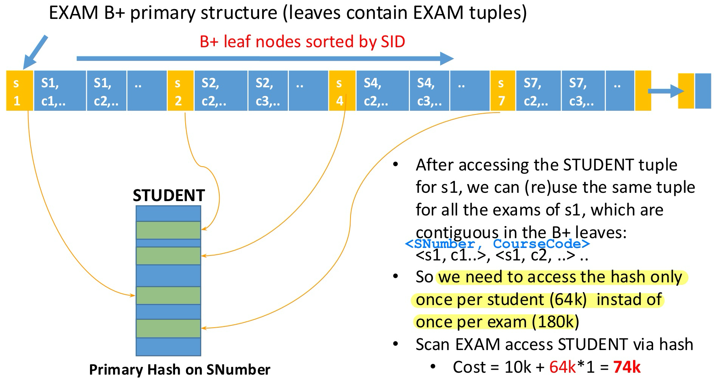

# Publication

A table

```sql
Publications(PubCode, ISBN, Title, Date, …)
```

has ISBN as **candidate key** (also unique and not null)


# Student-Exam

* A table: STUDENT(<u>SNumber</u>, Name, Surname, Address, Birthdate, ...)
	* contains 64K students over 15K blocks, with a **primary hash structure on the SerialNumber** and filling factor below 50%.

* A table: EXAM(<u>SNumber</u>, <u>CourseCode</u>, Date, Grade)
	* has 180K tuples in a **primary B+ tree structure** (a tree structure where tuples are entirely contained in the leaf nodes) with the **SNumber as the access key**, an average fan-out of 22, and such that the leaf nodes have overall a size of 10K blocks.

1. Calculate as accurately as possible the cost of joining the two tables according to the most convenient join method given the access structures.
2. Then, also calculate the join cost in case `EXAM` were instead structured according to the same hash as `STUDENT`.


## Statistics of the B+ Tree


* Suppose the B+ has

	* 4 levels
	* 5 pointers per node (degree/fanout)

* Compute the maximum number of contained keys - MAX

* Reversing the count you can determine the levels necessary to store at least MAX keys

	

	* If you have 425 tuples, how many levels?
		* 3? $\rightarrow$ not enough (only max 100 key values) $\rightarrow$ <font color=red>**4**</font> can store up to 500 key values


## Depth of the B+ Tree

Maximum number of keys of a B+ tree with degree (fanout) = $b$ and depth (number of levels) = $h$
$$
\textcolor{red}{h \approx \log_b(\text{Max keys})}
\notag
$$


## Operations and Costs

```sql
SELECT * FROM STUDENT S JOIN EXAM E
ON S.SNumber = E.SNumber
```


* **Strategy 1: Indexed Nested Loop with `EXAM` as external**

	* Scan `EXAM` access `STUDENT` via hash

		* Scan `EXAM` : **3** (intermediate nodes) + **10k** (#blocks) = <font color=red>**10k**</font>
		* Access Hash table: **180k** (#exams) $\times$ cost of `STUDENT` hash access **1** (low filling rate $\rightarrow$ no overflow cost) = <font color=red>**180k**</font>
		* Cost = 10k + 180k = <font color=red>**190k**</font>

	* Optimization:

		

* **Strategy 2: Indexed Nested Loop with `STUDENT` as external**

	* Scan `STUDENT` lookup B+ on `EXAM`
		* Scan `STUDENT` : <font color=red>**15k**</font> (#blocks)
		* Lookup `EXAM` : **64k** (#students) $\times$ **4** (3 intermediate + 1 leaf node, which is sufficient for an average of 3 exams per student) = <font color=red>**256k**</font>
		* Cost = 15k + 256k = <font color=red>**271k**</font>


## Alternative Structure

```sql
SELECT * FROM STUDENT S JOIN EXAM E
ON S.SNumber = E.SNumber
```


<font color=red>**Hash join**</font> between <font color=red>primary</font> structures: #blocks `STUDENT` + #blocks `EXAM` = 15k + 15k = <font color=red>**30k**</font>


# Book Reviews

* A table: USER(Email, Password, LastName, FirstName)
	* contains 128K users and is stored on 25K blocks, with a **primary hash organization on the primary key**.
* A table: REVIEW(<u>Email</u>, <u>ISBN</u>, <u>Date</u>, Rating, ReviewText)
	* has instead 4M tuples and is organized with a **primary B+ tree** (i.e., the tuples are entirely contained in the leaves of the tree) with the **email as a key**; the average fan-out is equal to 35 and leaf nodes occupy 1M blocks.

Estimate the cost of implementing the join between the two tables using the most efficient technique.


## Operations & Cost

```sql
SELECT * FROM USER U JOIN REVIEW R
ON U.email = R.email
```


* Indexed nested loop with `USER` as External:
	* Scan `USER` and join `REVIEW` using the B+
		* Scan `USER` : 25k
		* Lookup `REVIEW` : 128k $\times$ (#intermediate nodes + #leaf nodes) = 128k $\times$ (4 + 9)
		* Cost = 25k + 128k $\times$ (4 + 9) = <font color=red>**1.7M**</font>
* Indexed nested loop with `REVIEW` as External:
	* Scan `REVIEW` and join `USER` using the hash
		* Scan `REVIEW` : #intermiediate nodes + #leaf nodes = 4 + 1M
		* Join `USER` : 1 (cost of hash) $\times$ #hash lookups on `USER`
			* #hash lookups on `USER` : 
				* In theory one per review: <font color=red>**4M!**</font> 
				* ==But since B+ access to reviews is sorted by email, so one user access per email is sufficient==: <font color=red>**128k**</font>
		* Cost = 4 + 1M + 128k = <font color=red>**1.13M**</font>


# Tickets

* A table: TICKET(<u>TkId</u>, From, To, PassId, DepDate, DepTime, ArrTime)
	* stores 390K tuples in 40K blocks in an **entry-sequenced primary storage**.

* A table: PASSENGER(<u>PassId</u>, Name, Email, Birthdate)
	* stores 30K tuples in a **primary B+ tree built on PassId** with 3 levels and 2K leaf nodes.
	* val(To) = 130 and val(Birthdate) = 5K.
	
* Query 1:
	
	```sql
	SELECT PassId AS WentToRomeOnTheirBirthday  
	FROM TICKET NATURAL JOIN PASSENGER  
	WHERE To = 'Rome' AND day(DepDate) = day(Birthdate) AND month(DepDate) = month(Birthdate)
	```
	
* Query 2:
	
	```sql
	SELECT PassId, COUNT(*) FROM TICKET  
	WHERE PassId IN  
		(SELECT PassId 
	     FROM PASSENGER
	     WHERE Birthdate = '1/4/2000')  
	GROUP BY PassId
	```

Describe a reasonably efficient query plan and estimate its cost in the following scenarios:

a) There are no secondary access structures

b) Both tables have secondary hash indexes, Ticket built on PassId (3K blocks), Passenger on Birthdate (600 blocks)


## Statistics Scenario (a)


### Query 1


### Query 2

```sql
SELECT PassId, COUNT(*) FROM TICKET
WHERE PassId IN  
	(SELECT PassId 
     FROM PASSENGER
     WHERE Birthdate = '1/4/2000')  
GROUP BY PassId

-- which is equivalent to
SELECT t.PassId, COUNT(*) 
FROM TICKET AS t JOIN PASSENGER as p 
ON t.PassId = p.PassId 
WHERE p.Birthdate = '1/4/2000' 
GROUP BY t.PassId;
```


## Statistics Scenario (b)


### Query 1


### Query 2


# Motorbike Club

* A table: MotorBike(<u>PlateNo</u>, Model, Year, OwnerId, Description)
	* Stores 240K tuples on 12K blocks in a **primary entry-sequenced storage**.

* A table: Member(<u>Id</u>, Name, City, Country, Address)
	* Stores 160K tuples stored on 16K blocks in a **primary hash built on the primary key**, with an average access cost of 1.25 I/O operations per lookup.
	* We know that:
		* val(City) = 8K 
		* Only 1% of the registered bikes were built in 1947

Describe a query plan for the query and estimate its execution cost in the following scenarios:

```sql
SELECT M.*
FROM MEMBER M JOIN MOTORBIKE B
ON M.Id = B.OwnerId
WHERE M.City = "Milan" AND B.Year = 1947
```

1. There are no secondary indexes
2. There are also a B+(City) index for Member (F=55, 3 levels, 3K leaf nodes) and a B+(OwnerId) index for MotorBike (F=65, 3 levels, 4K leaf nodes)


## Operations & Cost in Scenario (a)


## Operations & Cost in Scenario (b)


# Car Fines

* A table: Car(<u>PlateNo</u>, OwnerId, PurchaseDate)
	* 1M tuples **primarily stored in a hash on PlateNo**, with 20K buckets, occupying 32K blocks overall (average cost per lookup: 1.6 I/O operations).

* A table: Fine(<u>Id</u>, Date, PlateNo, MeasuredSpeed, PhotoRef)
	* 72K fines given by a single speed camera in over 10 years, **primarily stored sequentially ordered by Date** on 4K blocks.

Describe query plans and their costs for the query below in the following three scenarios:

1. There are no auxiliary structures;
2. Indexes: Fine: B+(Date), 3 lev, 2K leaves. Car: B+(PurchaseDate), 3 lev, 10K leaves;
3. Also a hash index for Fine on PlateNo (same hash as Car, negligible overflow chains).

```sql
-- People fined for speeding over 70km/h on the day of purchase
SELECT OwnerId
FROM CAR C, FINE F
WHERE C.PurchaseDate = F.Date 
  AND C.PlateNo = F.PlateNo 
  AND F.MeasuredSpeed > 70.0
```

* Further data:
	* val(PurchaseDate) = 5K 
	* val(Date) = 3.6K 
	* 75% of the fines are for a speed over 70 km/h
	* 0.1% of the fines are given to cars on their purchase date


## Operations & Cost in Scenario (a)


* Strategy 1: Indexed filtered nested loop with `FINE` as External
	* Scan `FINE` and lookup `PlateNo` primary hash on `CAR`
		* Scan `FINE` : 4k
		* Lookup `CAR` for every fine > 70km/h: 54k $\times$ 1.6 = 86.4k
		* Cost = 4k + 86.4k = <font color=red>**90.4k**</font>
* Strategy 2: Plain nested loop with `CAR` as External
	* Cost = 32k $\times$ 4k = <font color=red>**128M**</font>

* Strategy 3: Nested loop with `CAR` as External but `FINE` cached (4k) : ==Only if the text specifies that you can cache, e.g., 4k $\times$ [block size in bytes]==
	* Cost = 32k + 4k = <font color=red>**36k**</font>


## Operations & Cost in Scenario (b)


* Replacing the hash access on `PlateNo` with B+ access on `pDate` in Strategy 1 does not pay: ==B+ access costs more than hash access==
* Strategy 4: Indexed nested loop with `CAR` as External ==but no car filtering==
	* Scan `CAR` : **32k**
	* For all 1M tuples access `FINE` using date B+ index: 1M $\times$ (2 intermediate nodes + 1 leaf node + 20 pointers to tuples) = **23 M**
	* Cost = <font color=red>**23M**</font>

* Strategy 4 optimized with `FINE` B+
	* Scan `CAR` : **32k**
	* For all 1M tuples access `FINE` using date B+ index: 1M $\times$ (2 intermediate nodes + 1 leaf node + <font color=blue>**2**</font> `FINE` data blocks) = **5M**
		* Note that both the `FINE` primary and secondary access structures are sorted by date, so ==one can use the B+ tree to access the **first** `FINE` tuple and then scan the <font color=blue>**2 blocks**</font> containing on average the next tuples (<font color=blue>**2 nodes per date**</font>)==
	* Cost = 32k + 5M = <font color=red>**5M**</font>
* Strategy 5: `CAR` and `FINE` both accessible orderly by date $\rightarrow$ (indexed) merge-scan join using `CAR` B+ and `FINE` primary structure is applicable
	* Scan `FINE` by date: 4k and in parallel
	* Scan the leaves of `CAR` B+ by `PurchaseDate` : approximately 10k
	* How many cars should be fetched to compare the `PlateNo` and extract the `OwnerId`?
		* Cost = 3.6k dates $\times$ 15 high speed fines $\times$ 200 cars = <font color=red>**10800000**</font>
			* There are 3.6k dates
			* For every date there are 20 fines on average of which 15 are high speed (75%)
			* For every date there are 200 purchased cars
			* In practice it's more than scanning the `CAR` table and pay 1M
			* Assuming that you need only 75% of the car tuples (750k instead of 1M) is also a bit far fetched: uniform distribution of high speed on fines does not imply uniform distribution on cars


## Operations & Cost in Scenario (c)


* Two hash accesses (one primary and one secondary) with the same hash function
* Strategy 6: Hash join on `CAR` and `PLATE` can be applied
	* Scan of `CAR` **primary** hash: **32k**
	* Scan of `FINE` **secondary** hash: **20k**
	* Cost of accessing the `FINE` tuples following the pointers in the secondary hash buckets?
		* We know only the matched car plate
		* There is no way to skip some access to check equality of dates and high speed
		* All `FINE` tuples are accessed in turn: **72k** (the same block may be accessed multiple times but we assume no caching otherwise we fall back to strategy 3)
	* Cost = 32k + 20k + 72k = <font color=red>**124k**</font>

==**In summary: strategy 1 (the simplest one) wins!**==


# Streaming Movies

* A table: Movie(<u>MovieId</u>, Title, Director, Year, Duration, …)

	* with 90K tuples, is stored over 6K blocks in a **primary hash structure**, built on the **primary key** with negligible overflow.

* A table: Session(<u>UserId</u>, <u>TimeStamp</u>, MovieId, Duration)

	* records 540K views (started by the users of a streaming system) and is stored over 12K blocks in an **entry-sequenced structure**.
	* val(UserId) = 5.4K

* Consider the following query:

	```sql
	-- Extract movies seen by user with id:10431
	SELECT *
	FROM Movie
	WHERE MovieId IN (
	    SELECT MovieId 
	    FROM Session
	    WHERE UserId = 10431)
	```

* Describe briefly (but precisely) a reasonably efficient query plan and estimate its execution cost in the following scenarios:

	A. There are no secondary access methods;

	B. Table Session has a hash index built on the same h() as that of Movie, with negligible overflow;

	C. Table Session also has a B+ index built on UserId as search key, with F=82 and 6.6K leaf nodes.


## Query Cost Scenario A 


## Query Cost Scenario B


## Query Cost Scenario C


# Points of Interest (POIs)

* A table: POI(PID, Name, City, Description)
	* stores 30K tuples on 1.2K blocks in a **primary entry-sequenced storage**

* A table: CONNECTION(From, To, Distance)
	* stores 1.5M tuples stored on 12K blocks in a **primary hash built on the primary key** with negligible overflow chains

* We know that:

	* val(City) = 300
	* Only 25% of the connections have a distance below 1,000 meters

* Consider the query that finds pairs of “close” points of interest in Milan

	```sql
	SELECT P1.PID, P2.PID 
	FROM (POI P1 JOIN CONNECTION ON P1.PID = From) JOIN POI P2 ON P2.PID = To
	WHERE P1.City = "Milan" AND P2.City = "Milan" AND Distance < 1000;
	```

* Describe briefly (but precisely) a reasonable query plan and estimate its execution cost in the following scenarios:

	A. There are no secondary indexes.

	B. There is also a B+ (City) index for POI (F=35, 3 levels, 600 leaf nodes).


## Operations & Cost in Scenario A


## Operations & Cost in Scenario B


# Actors

* A table: Actor(<u>AId</u>, Name, Surname, BirthDate)
	* 60K tuples in a primary hash, h(AId) with 15K buckets and no overflow. Also a **secondary B+(Surname, Name)**, a composite key, (3 levels, 1.6K leaf nodes)
* A table: Movie(<u>MId</u>, Title, Year)
	* 48K tuples in **entry-sequence** on 8K blocks, and a **B+(MId)**, 3 levels, 1.4K leaves
* A table: Role(<u>MovId</u>, <u>ActId</u>, Role)
	* Stores 600K tuples in a **sequentially-ordered by MovId** on 30K blocks, also **hash-based secondary h(ActId)** with the same hash as Actor, on 22K blocks and an average access cost of 1.7 reads per lookup

* Describe a reasonable query plan for the queries below and estimate their execution cost, knowing that 5% of the actors are born after 16/09/1996, and that only 250 actors have the same full name of another actor.

	```sql
	SELECT *
	FROM (Actor JOIN Role ON AId = ActId) JOIN Movie ON MovId = MId
	WHERE BirthDate > 16/09/1996
	```

	```sql
	-- Movie with the most roles
	SELECT MovId FROM Role
	GROUP BY MovId
	HAVING COUNT(*) >= ALL (
	    SELECT COUNT(*)
	    FROM Role
	    GROUP BY MovId)
	```

	```sql
	SELECT A1.*
	FROM Actor A1 JOIN Actor A2
	ON (A1.Name, A1.Surname) = (A2.Name, A2.Surname)
	WHERE A1.AId <> A2.AId
	```


## Query 1

```sql
SELECT *
FROM (Actor JOIN Role ON AId = ActId) JOIN Movie ON MovId = MId
WHERE BirthDate > 16/09/1996
```


## Query 2


## Query 3


