# MedRank

## Algorithm Overview

* **Input:**
	* An integer $k$ , representing the number of top elements to return.

	* Ranked lists $R_1, R_2, \dots, R_m$ containing $N$ elements.

* **Output:**

	* The **top K elements** based on their median ranks.

* **Steps:**

	1. Perform ==**sorted accesses**== to the ranked lists:
		* Access one element at a time from each list sequentially, starting from the top.

	2. Stop when there are **k elements** that appear in **more than** $m/2$ **lists** (i.e., a majority of the lists).
	3. Output these **top K elements** as the final result.

## Example

* **Three** rankings

	* By price, by rating, and by distance
	* Looking for the **top 3 hotels** by "median rank"
	* **NB**: values of price, rating and distance are unknown, only the position matters

* Strategy:

	* Make one sorted access at a time in each ranking

	* Look for hotels that appear in at least $ \lceil m/2 \rceil = \lceil 3/2 \rceil = 2$ rankings

	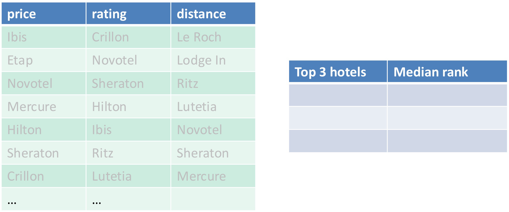

	

	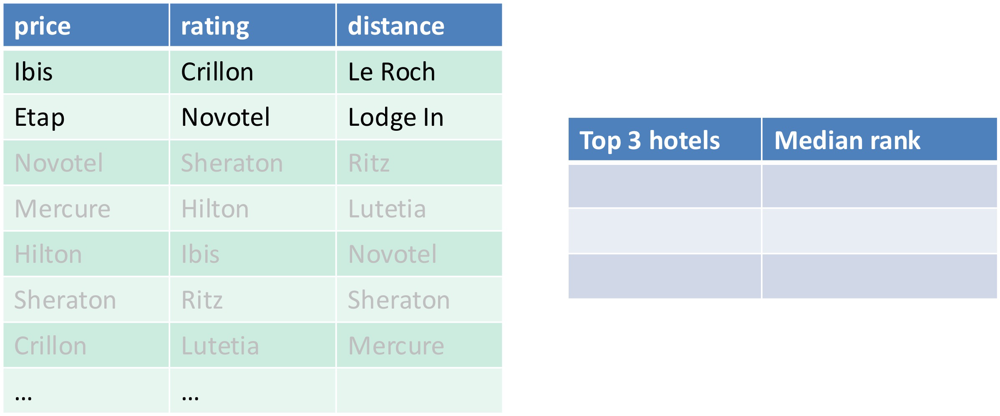

	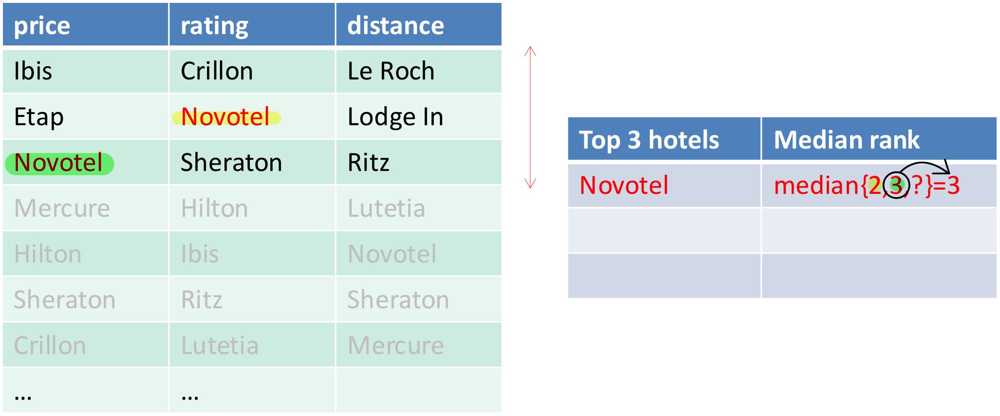

	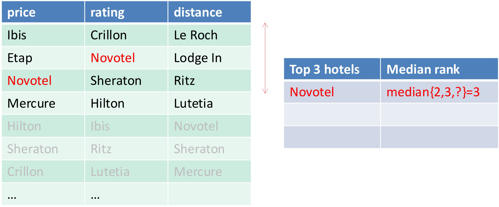

	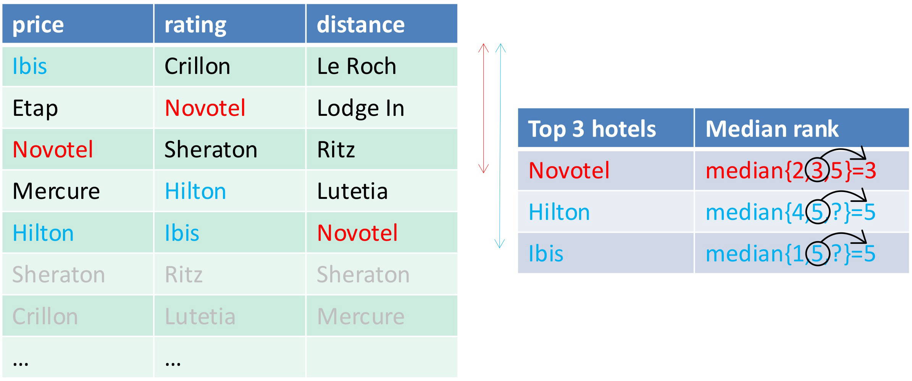

## Ex1

Consider a distributed setting with three data sources, ranking basketball players according to their offensive rating (off), defensive rating (def) and rebounds (reb). An associated score in [0,1] is indicated (higher = better). **Sorted access** is available

Determine the top-3 players according to their median rank using **MedRank**

----

        Seen in 3/2 lists:

        Seen in 3/2 lists:

        Seen in 3/2 lists: **4** (median rank = ==3==)

* Seen in > 3/2 lists:
	* 4: {1, 3, ...} (median rank = 3)
	* 2: {3, 4, ...} (median rank = 4)
	* 7: {3, 4, ...} (median rank = 4)
	* 9: {1, 4, ...} (median rank = 4)

* Three players are tied at the second place

# B0

## Algorithm Overview

* **Inputs:**
	* $k$ : The number of top objects to retrieve (where $k \geq 1$ ).

	* Ranked lists $R_1, R_2, \dots, R_m$ : These lists contain objects sorted by their partial scores in each source.

* **Steps:**

	* **Perform** $k$ **sorted accesses**:

		* From each ranked list $R_1, R_2, \dots, R_m$ , retrieve the top $k$ objects (along with their partial scores).

		* Store these objects and their scores in a **buffer** $B$ .

	* **Compute the MAX score**:
		* For each object in the buffer $B$ , calculate the **maximum** of its available partial scores across all lists.

	* **Return the top-**$k$ **objects**:
		* Select and return the $k$ objects with the highest **MAX** scores.
* ==**$B_0$ doesn't work when $S \neq MAX$**==

## Example

* $k=2$

	

* $k = 3$

	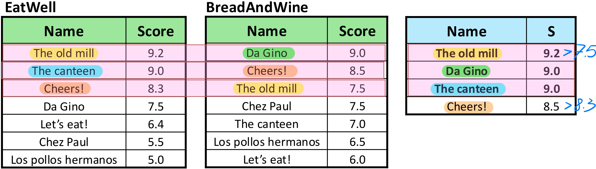

## Ex1

Remove the first data source and consider the scoring function MAX(o) = MAX{ def(o), red(o) }, determine the **top-2** players according to **MAX** using the algorithms B0

----

# FA

## Algorithm Overview

* **Input**:

	* $k$ : The number of top objects you want to retrieve.
	* A **==monotone== scoring function** $S$ : This function combines partial scores from multiple lists $R_1, \ldots, R_m$ to compute an overall score for each object.

* **Steps**:

	1. ==**Sorted Access**==:

		* Extract objects by **sorted accesses** (i.e., sequentially read items from the top of each ranked list $R_1, \ldots, R_m$ ).

		* Stop when there are **at least** $k$ **objects in common** across all the $m$ lists.

	2. ==**Random Access**==:

		* For each of the $k$ objects that have been seen in the lists:
			* Perform **random accesses** to obtain any missing scores (i.e., scores from lists where the object was not encountered yet).

		* Compute the overall score $S(o)$ for these objects using the scoring function.

* **Output**:

	* The top $k$ objects with the best scores.

## Example

* **Query**:

	* Hotels with best price and rating
	* Scoring function: $S(o) = 0.5 \times \text{cheapness} + 0.5 \times \text{rating}$

	* Compute the two best options (Top-2)

* **Strategy**:

	* **Sorted Access**:

		* Retrieve hotels one by one from the sorted lists (cheapness and rating lists).
		* Stop once there are at least 2 hotels (equal to $k$ ) that appear in **both lists** (cheapness and rating).

	* **Random Access**:

		* For these 2 hotels, perform **random access** to get their scores in both cheapness and rating lists.
		* Compute their overall scores using $S(o)$ .

		

## Ex1

Assume now that **random access** is also available. Determine the top-2 players according to **MAX** with the algorithms FA

        Common to 2 lists:

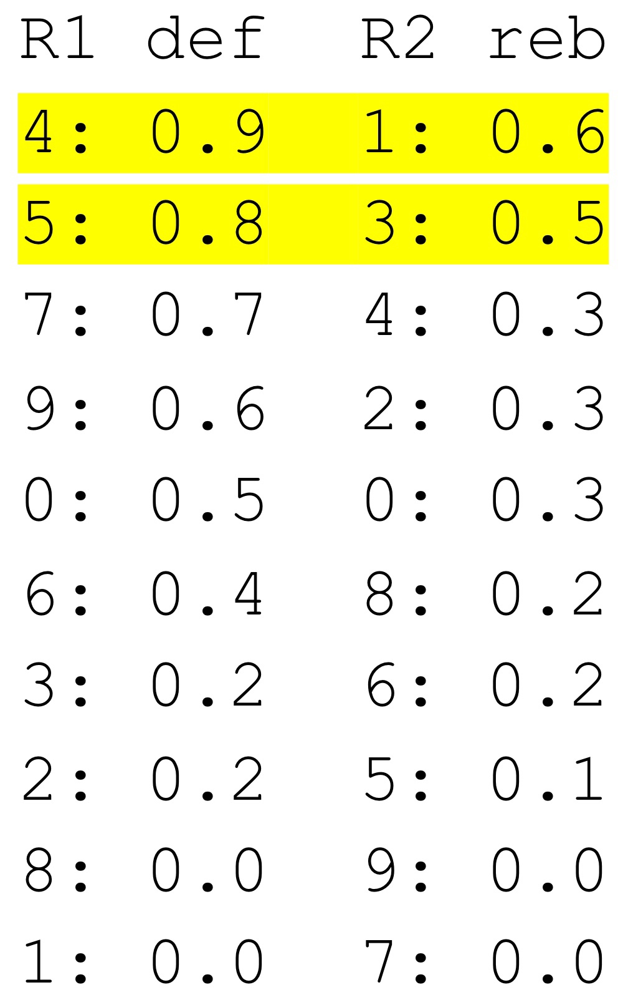        Common to 2 lists:

        Common to 2 lists: **4**

        Common to 2 lists: **4**

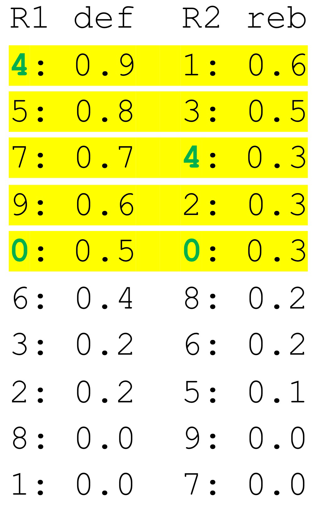        Common to 2 lists: **4, 0**

# TA

## Algorithm Overview

* **Input**:
	* $k$ : The number of top objects you want to retrieve.
	* A **==monotone== scoring function** $S$ : This function combines partial scores from multiple lists $R_1, \ldots, R_m$ to compute an overall score for each object.

* **Steps**:

	1. **Perform Parallel ==Sorted Accesses==**:
		* Simultaneously access the top-ranked items from all lists $R_i$ .

	2. **Execute ==Random Accesses== for Missing Scores**:
		* For an object o encountered during sorted access, retrieve missing scores $s_j$ from the lists it hasn’t yet been accessed from.

	3. **Compute the Overall Score**:
		* Use the scoring function $S(s_1, s_2, \dots, s_m)$ to calculate $o$ ’s total score.

	4. **Update the Threshold**:
		* Define the threshold $T$ based on the smallest scores encountered during the latest round of sorted accesses.

	5. **Stopping Condition**:
		* If the $k$ -th best object’s score is higher than the current threshold $T$ , terminate the algorithm and return the top $k$ results.

* **Output**:
	* The top $k$ objects with the best scores.

## Example

* **Query**:

	* Hotels with best price and rating

	* Scoring function: $S(o) = 0.5 \times \text{cheapness} + 0.5 \times \text{rating}$

* **Strategy**:

	* Alternate sorted access and random access

	* Maintain a threshold $T$

	* Stop when $k$ objects are no worse than $T$

		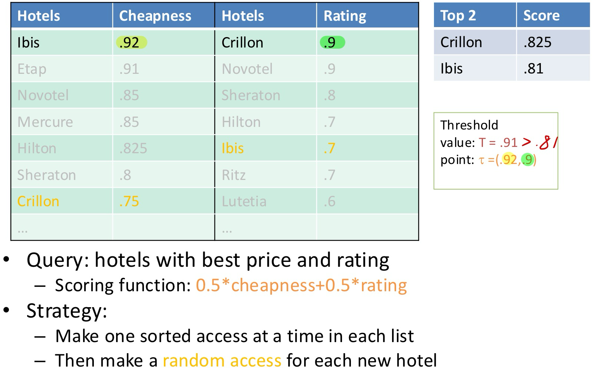

		

		

## Ex1

Assume now that **random access** is also available. Determine the top-2 players according to **MAX** with the algorithms TA

-----

## Ex2

Consider now the scoring function: SUM(o) = def(o) + reb(o)

* What are the top-2 players according to SUM?
* Indicate the essential steps with the TA algorithm

----

# NRA

## Algorithm Overview

* **Input**:

	* $k$ : Number of top-ranked objects to retrieve.
	* $R_1, R_2, \dots, R_m$ : $m$ ranked lists where objects are sorted by their partial scores.
	* $S$ : A monotone scoring function $S(o)$ , such that $S(o) = f(p_1(o), p_2(o), \dots, p_m(o))$ , where $p_j(o)$ is the partial score of object $o$ in $R_j$ .

* **Steps**:

	* **Initialization**

		* Begin with an empty buffer $B$ to store objects retrieved via **sorted access**.

		* For each object $o$ seen during sorted access:
			* Compute and maintain:
				* **Lower bound score:** $S^-(o)$ : Partial score from the lists where $o$ has been seen.
				* **Upper bound score:** $S^+(o)$ : Best possible score assuming maximum values for the lists where $o$ has not been seen.

	* **Iterative Process**

		* Perform **sorted accesses** simultaneously across all m ranked lists $R_1, R_2, \dots, R_m$ .

		* For each retrieved object $o$ :

			* If $o$ is already in $B$ , update $S^-(o)$ with its partial score from the new list.

			* If $o$ is new, add it to $B$ and initialize $S^-(o)$ and $S^+(o)$ .

	* **Maintaining Bounds**

		* Update $S^-(o)$ for objects in $B$ : $S^-(o) = f(p_{j_1}(o), p_{j_2}(o), \dots, p_{j_t}(o))$
			* $p_{j_i}(o)$ are the partial scores of $o$ seen so far.

		* Update $S^+(o)$ for objects in $B$ : $S^+(o) = f(p_{j_1}(o), \text{max}{R{j_{t+1}}}, \dots, \text{max}{R_m})$
			* $\text{max}{R_j}$ is the maximum score in the unseen lists.

	* **Define Threshold Point** $\tau$ 

		* $\tau$ represents the smallest seen scores across all ranked lists: $\tau = (p_{j_1}^{\text{max}}, p_{j_2}^{\text{max}}, \dots, p_{j_m}^{\text{max}})$
			* $p_{j_i}^{\text{max}}$ is the largest score seen in list $R_{j_i}$ so far.

		* Compute the threshold score $S(\tau)$ as: $S(\tau) = f(p_{j_1}^{\text{max}}, p_{j_2}^{\text{max}}, \dots, p_{j_m}^{\text{max}})$

	* **Termination Condition**

		* Let $S^-(B[k])$ be the minimum lower bound score of the $k$ -th best object in $\text{Res}$ .

		* Let $\text{max}_{B \setminus \text{Res}} S^+(o)$ be the maximum upper bound score of all objects not in $\text{Res}$ .

		* Halt the algorithm when: $S^-(B[k]) \geq \max \left( \max_{o \in B \setminus \text{Res}} S^+(o), S(\tau) \right)$
			* This condition ensures that no unseen or partially seen object can potentially outperform the top- $k$ objects already in $\text{Res}$ .

* **Output**:

	* A set $\text{Res}$ containing the top- $k$ objects and their scores, $S(o)$ , computed based on $S$ .

## Example

* First round

​	

* Second round

​	

* Third round

​	

* Forth round

​	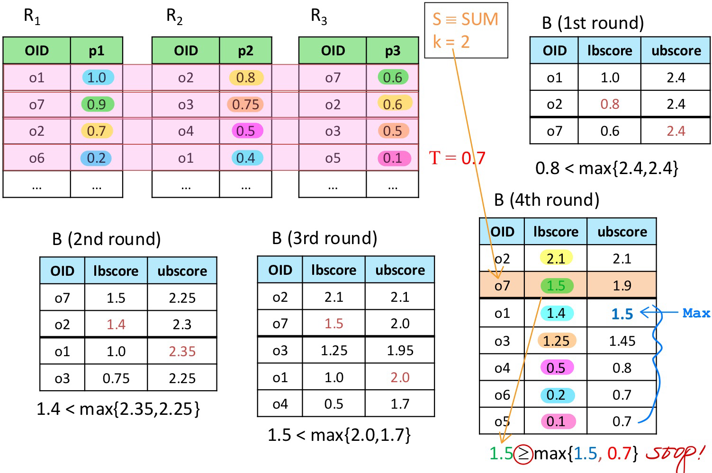

## Ex1

Remove the first data source and consider the scoring function MAX(o) = MAX{ def(o), red(o) }, determine the **top-2** players according to **MAX** using the algorithms NRA

----

# Skyline (SFS)

## Algorithm Overview

* **Input:**
	* $D$ : A dataset of $n$ multi-dimensional points (tuples).
	* A monotone function $f$ of the attributes of $D$ , used for sorting.

* **Steps:**

	1. **Pre-Sorting**:
		* Sort $D$ into a list $S$ based on a **monotone function** $f$ of its attributes.
			* A monotone function ensures that tuples appearing earlier in $S$ are more likely to dominate tuples appearing later.

	2. **Initialization**:
		* Create an empty set $W = \emptyset$ , which will hold the skyline points.

	3. **Skyline Computation**:
		* For each tuple $p$ in $S$ , do the following:
			1. **Check Dominance**:
				* Compare $p$ against all tuples currently in $W$ :
					* If $p$ is dominated by any tuple in $W$ , **skip** $p$ and proceed to the next tuple.
					* If $p$ is not dominated, proceed to the next step.
			2. **Update Skyline**:
				* Add $p$ to $W$ .

	4. **Termination**:
		* After processing all tuples in $S$ , $W$ contains the skyline points.

* **Output:**

	* $W$ : The set of non-dominated tuples in $D$ (i.e., the **skyline**).

## Example

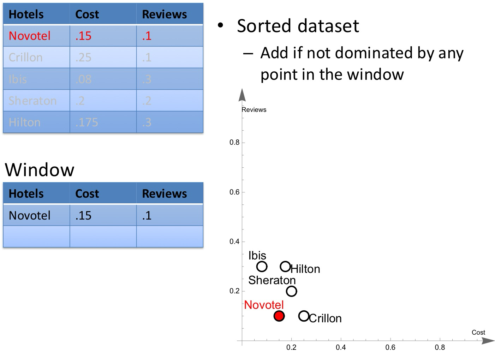

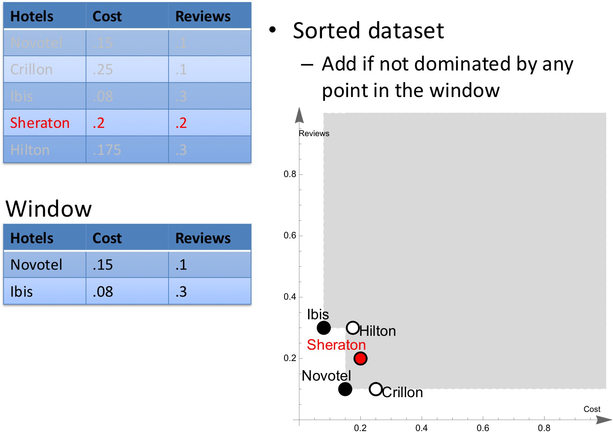

## Ex1

Assume now that all the data regarding the players are centralized in a single datasource, in which the players are available **sorted according to SUM**

* Use **SFS** to determine the skyline of the players (**higher is better**)

	----

	

	

	

	

	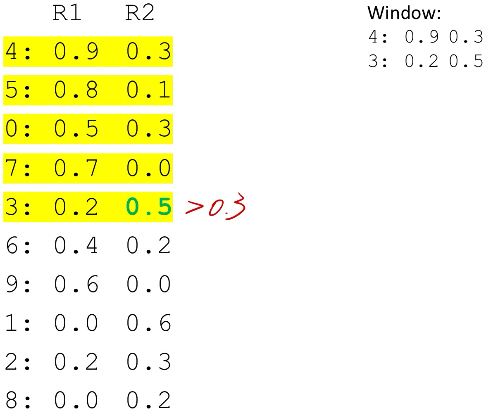

	

	

	

	

	

* Is there any player in common between the skyline and the top-2 players according to MAX? Does this necessarily occur?

	----

	* Yes! Player 4 is in common

	* ==Yes! Player 4 was the top 1 according to MAX and the skyline is the set of all top 1 objects according to some monotone scoring function (MAX is monotone)==

	            

* Same as previous point, but with the top-2 players according to SUM

	----

	Yes! Player 4 again. Same reason as before

# k-Skyband

* **Definition**:
	* A $k$**-Skyband** includes all tuples that are dominated by fewer than $k$ other tuples.
	* **Skyline** queries are a special case of $k$-Skyband, where $k = 1$ (i.e., the skyline includes tuples dominated by zero other tuples).

* **Advantages of** $k$**-Skyband**:
	* Reduces the size of the result set in cases where too many tuples qualify as non-dominated.
	* $k$-Skybands provide a more **graded hierarchy** of results, allowing users to balance between dominance and cardinality.

* **Relationship with Top-**$k$ :
	* Every **Top-**$k$ result set is contained within the $k$**-Skyband**, making it a flexible mechanism for filtering.

## Example

## Ex1

* Can you identify the players in the 2-skyband?

	----

	

* Is there any player in common between the 2-skyband and the top-2 players according to MAX or SUM?

	----

	

	* The 2-skyband is the set of all players that are top-2 according to some **monotone** function
	* Players 4 and 5, which were the top-2 players for SUM and for MAX, are in the 2-skyband

* What about those in the 3-skyband?

	---

	

	* The 3-skyband contains all the players dominated by less than 3 players. So, it includes the 2-skyband, plus possibly others

	* Here:

		* player 6 dominated by 0 and 4
		* player 7 dominated by 5 and 4
		* all the other players are dominated by at least 3 players

	* Wait!! Player 2 is not part of the 3-skyband

		* If we take the scoring function s(o) = reb(o), player 2 ranks third!

		* The 3-skyband is the set of all players that are top-3, **with no ties**, according to some **monotone** scoring function

		* With that proviso, we are safe, since player 2 can only get in the top-3 **with ties**

			

# Exercise 1

