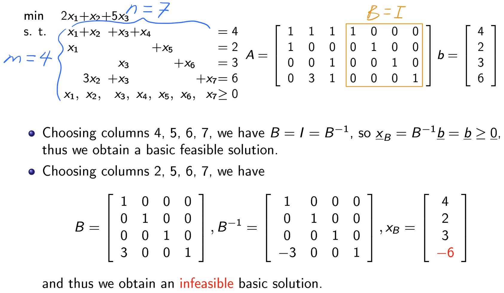
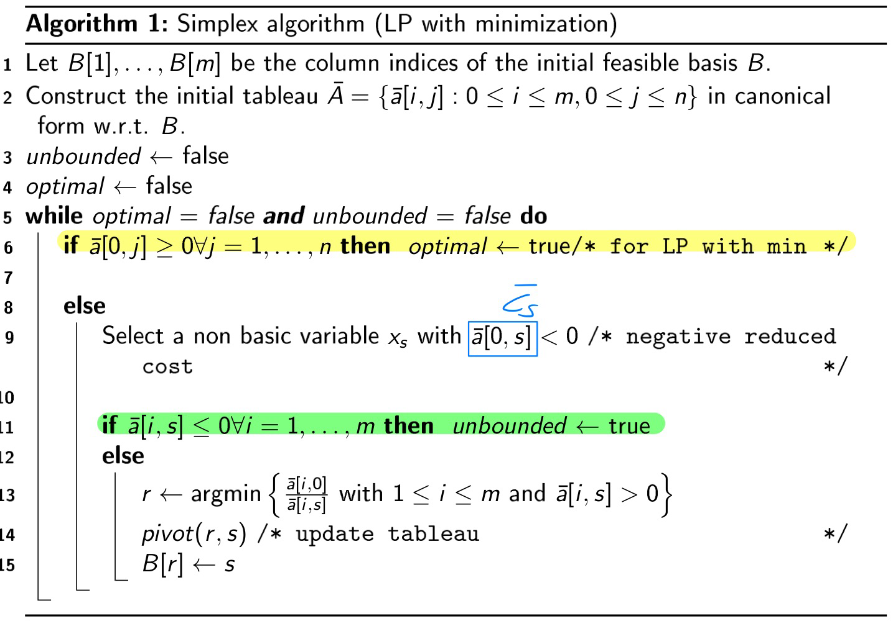

# Introduction

* **Definition 1**: A ==**Linear Programming**== (LP) problem is an optimization problem:
  $$
  \min & f(x) \\
  s.t. & \underline{x} \in X \subseteq \mathbb{R}^n
  $$

  * the ==**objective function**== $f: \ X \rightarrow \mathbb{R}$ is linear
  * the ==**feasible region**== $X = \{\underline{x} \in \mathbb{R}^n  : g_i(\underline{x}) \ r_i \ 0, \ i \in \{i,...,m\}, \ r_i \in \{=,\geq, \leq\} \}$ with $g_i : \mathbb{R}^n \rightarrow \mathbb{R}$ linear, for $i = 1,...,m$

* **Definition 2**: $\underline{x}^* \in \mathbb{R}^n$ is an ==**optimal solution**== of (1) if $f(\underline{x}^*) \leq f(\underline{x})$, $\forall \underline{x} \in X$

* **General Form**:
	$$
	\begin{aligned}
	    \text{min } & \quad z = c_1x_1 + \cdots + c_nx_n \\
	    \text{s.t. } & \quad a_{11}x_1 + \cdots + a_{1n}x_n \ (\geq, =, \leq) \ b_1 \\
	                 & \quad \vdots \\
	                 & \quad a_{m1}x_1 + \cdots + a_{mn}x_n \ (\geq, =, \leq) \ b_m \\
	                 & \quad x_1, \ldots, x_n \geq 0
	\end{aligned} \notag
	$$

* **Matrix Notion**:
	$$
	\begin{aligned}
	    \text{min } & \quad z = \underline{c}^T \underline{x} \\
	    \text{s.t. } & \quad A \underline{x} \geq \underline{b}, \\
	                 & \quad \underline{x} \geq 0
	\end{aligned} \notag
	\quad \quad \quad \quad
	\begin{aligned}
	    \text{min } & \quad z = [c_1 \ \cdots \ c_n]
	    \begin{bmatrix}
	        x_1 \\
	        \vdots \\
	        x_n
	    \end{bmatrix} \\
	    \text{s.t. } & \quad
	    \begin{bmatrix}
	        a_{11} & \cdots & a_{1n} \\
	        \vdots & \ddots & \vdots \\
	        a_{m1} & \cdots & a_{mn}
	    \end{bmatrix}
	    \begin{bmatrix}
	        x_1 \\
	        \vdots \\
	        x_n
	    \end{bmatrix}
	    \geq
	    \begin{bmatrix}
	        b_1 \\
	        \vdots \\
	        b_m
	    \end{bmatrix} \\
	    & \quad
	    \begin{bmatrix}
	        x_1 \\
	        \vdots \\
	        x_n
	    \end{bmatrix}
	    \geq \underline{0}
	\end{aligned} \notag
	$$
	

## Example 1: Diet Problem

* **Given**

	* $n$ aliments $j = 1, \ldots, n$ 
	* $m$ nutrients (basic substances) $i = 1, \ldots, m$ 
	* $a_{ij}$ amount of $i$-th nutrient contained in one unit of the $j$-th aliment
	* $b_i$ daily requirement of the $i$-th nutrient
	* $c_j$ cost of a unit of $j$-th aliment

	Determine a ==**diet**== that minimizes the total cost while satisfying all daily requirements

* **Model**: Decision variables: $x_j$ = amount of $j$-th aliment in the diet, with $j = 1, \dots, n$
	$$
	\begin{aligned}
	    \text{min } & \quad z = \sum_{j=1}^n c_j x_j \\
	    \text{s.t. } & \quad \sum_{j=1}^n a_{ij} x_j \geq b_i, \quad i = 1, \ldots, m \\
	                 & \quad x_j \geq 0, \quad j = 1, \ldots, n
	\end{aligned} \notag
	$$

## Example 2: Transportation Problem (Single Product)

* **Given**
	
	* $m$ production plants $i = 1, \dots , m$
	* $n$ clients $j = 1, \dots , n$
	* $c_{ij}$ unit transportation cost from plant $i$ to client $j$
	* $p_i$ maximum supply (production capacity) of plant $i$
	* $d_j$ demand of client $j$
	* $q_{ij}$ maximum amount transportable from plant $i$ to client $j$
	
	Determine a ==**transportation plan**== that minimizes the total costs while respecting plant capacities and client demands
	
* **Assumption**: $\displaystyle \sum_{i = 1}^m p_i \geq \sum_{j = 1}^n d_j$

* **Model**: Decision variables: $x_{ij}$ = amount of product transported form $i$ to $j$, with $1 \leq i \leq m$ and $1 \leq j \leq n$
  $$
  \begin{aligned}
      \text{min } & \quad z = \sum_{i=1}^m \sum_{j=1}^n c_{ij} x_{ij} \\
      \text{s.t. } & \quad \sum_{j=1}^n x_{ij} \leq p_i, \quad i = 1, \ldots, m \quad \text{(plant capacity)} \\
                   & \quad \sum_{i=1}^m x_{ij} \geq d_j, \quad j = 1, \ldots, n \quad \text{(client demand)} \\
                   & \quad 0 \leq x_{ij} \leq q_{ij}, \quad i = 1, \ldots, m, \quad j = 1, \ldots, n \quad \text{(transport capacity)}.
  \end{aligned} \notag
  $$

## Example 3: Production Planning Problem

* **Given**

	* $m$ resources $i = 1, \dots , m$
	* $n$ products $j = 1, \dots , n$ which complete for resources
	* $c_j$ profit (selling price-cost) per unit of $j$-th product
	* $a_{ij}$ amount of $i$-th resource needed to produce one unit of $j$-th product
	* $b_i$ maximum available amount of $i$-th resource

	Determine a ==**production plan**== that maximizes the total profit given the available resources

* **Model**: Decision variables: $x_j$ = amount of $j$-th product, with $j = 1, \dots , n$
	$$
	\begin{aligned}
	    \text{max } & \quad z = \sum_{j=1}^n c_j x_j \\
	    \text{s.t. } & \quad \sum_{j=1}^n a_{ij} x_j \leq b_i, \quad i = 1, \ldots, m \\
	                 & \quad x_j \geq 0, \quad j = 1, \ldots, n
	\end{aligned} \notag
	$$

## Assumption of LP Models

* ==**Linearity**== of the objective function and constraints
	* Proportionality: Contribution of each variable = constant $\times$ variable 
		* Drawback: does not account for economies of scale
	* Additivity: Contribution of all variables = sum of single contributions
		* Drawback: Competing products ⇒ profits are not independent
* ==**Divisibility**==: The variables can take fractional (rational) values
* ==**Parameters**== are considered as constants which can be estimated with a sufficient degree of accuracy
  * More complex mathematical programs are needed to account for uncertainty

# Equivalent Forms

* **General form**:
	$$
	\begin{aligned}
	    \text{min(max) } & \quad z = \underline{c}^T \underline{x} \\
	    \text{s.t. } & \quad A_1 \underline{x} \geq \underline{b_1} \quad \text{\textcolor{red}{(inequality constraints)}} \\
	                 & \quad A_2 \underline{x} \leq \underline{b_2} \quad \text{\textcolor{red}{(inequality constraints)}} \\
	                 & \quad A_3 \underline{x} = \underline{b_3} \quad \text{\textcolor{red}{(equality constraints)}} \\
	                 & \quad x_j \geq 0, \quad \text{for } j \in J \subseteq \{1, \ldots, n\} \\
	                 & \quad x_j \text{ free, } \quad \text{for } j \in \{1, \ldots, n\} \setminus J
	\end{aligned} \notag
	$$

* **Definition (Standard Form)**:
	$$
	\begin{aligned}
	    \text{min } & \quad z = c^T x \\
	    \text{s.t. } & \quad Ax = b \quad \text{\textcolor{red}{(only equality constraints)}} \\
	                 & \quad x \geq 0 \quad \ \ \ \text{\textcolor{red}{(all nonnegative variables)}}
	\end{aligned} \notag
	$$

	* The two forms are equivalent
	* Simple transformation rules allow to pass from one form to the other form
		* **Warning**: The transformation may involve adding/deleting variables and/or constraints

* **Transformation Rules**:

	

* **Example**:

	

* **Other Straightforward Transformations**:
	* $a^T x \leq b \Leftrightarrow -a^Tx \geq -b$
	* $a^Tx \geq b \Leftrightarrow -a^T x \leq -b$
	* $a^T x = b \Leftrightarrow \begin{cases} a^T x \geq b \\ a^T x \leq b \end{cases} \Leftrightarrow \begin{cases} a^Tx \geq b \\ -a^Tx \geq -b \end{cases}$

# Geometry of Linear Programming

* **Example**: Capotal budgeting

	* Capital of 10000€ and two possible investments A and B with respectively 4% and 6% expected return
	* Determine a ==**portfolio**== that maximizes the total expected return, while respecting the diversification constraints:
		* at most 75% of the capital is invested in A
		* at most 50% of the capital is invested in B

* **Model**:

	* $x_A$ = amount invested in A

	* $x_B$ = amount invested in B
		$$
		\begin{aligned}
		    \text{max } & \quad z = 0.04x_A + 0.06x_B \\
		    \text{s.t. } & \quad \quad \quad \quad \ \ x_A + x_B \leq 10000 \\
		                 & \quad \quad \quad \quad \ \ x_A \quad \quad \ \ \leq 0.75 \cdot 10000 \\
		                 & \quad \quad \quad \quad \ \ \quad \quad \ \  x_B \leq 0.50 \cdot 10000 \\
		                 & \quad \quad \quad \quad \ \ x_A, \quad x_B \geq 0
		\end{aligned} \notag
		$$
		

## Graphical Solution

* **Definition**: A ==**level curve of value $z$**== of a function $f$ is the set of points in $\mathbb{R}^n$ where $f$ is constant and takes value $z$
	* The level curves of a LP are lines: $0.04x_A + 0.06x_B = z$ (where $z$ is a constant)

## Vertices of the Feasible Region

Consider a LP with inequality constraints (easier to visualise)

* **Definition 1**:

	* $H = \{\underline{x} \in \mathbb{R}^n : \underline{a}^T \underline{x} = b\}$ is a ==**hyperplane**==

	* $H^- = \{\underline{x} \in \mathbb{R}^n : \underline{a}^T \underline{x} \leq b\}$ is an ==**affine half-space**== (half-plane in $\mathbb{R}^2$)

		* Each inequality constraint ($\underline{a}^T \underline{x} \leq b$) defines an affine half-space in the variable space

			$H = \{\underline{x} \in \mathbb{R}^n : \underline{a}^T \underline{x} \leq b\}, \quad a \neq 0$	

* **Definition 2**: The feasible region $X$ of any LP is a ==**polyhedron $P$**== (Intersection of a finite number of half-spaces) 

	

* **Definition 3**: A subset $S \subseteq \mathbb{R}^n$ is a ==**convex**== if for each pair $\underline{y}^1, \underline{y}^2 \in S$, $S$ contains the whole segment connecting $\underline{y}^1$ and $\underline{y}^2$

	

*  **Definition 4**: The segment defined by $\underline{y}^1, \underline{y}^2 \in S$, defined by all the ==**convex combinations**== of $\underline{y}^1$ and $\underline{y}^2$, is

	$[\underline{y}^1, \underline{y}^2] = \{\underline{x} \in \mathbb{R}^n : \underline{x} = \alpha \underline{y}^1 + (1 - \alpha) \underline{y}^2 \land \alpha \in [0,1]\} \\
	(\text{this means all points on the line segment between } \underline{y}^1 \text{ and } \underline{y}^1)$	

	

> **Property**: A polyhedron $P$ is a convex set of $\mathbb{R}^n$ 
>
> * any half-space is convex
> * the intersection of a finite number of convex sets is also a convex set

* **Definition 5**: A ==**vertex**== of $P$ is a point of $P$ which cannot be expressed as a convex combination of two other distinct points of $P$

	* Algebraically, $\underline{x}$ is a ==**vertex**== of $P$ if and only if
		$$
		\underline{x} = \alpha \underline{y}^1 + (1 + \alpha) \underline{y}^2, \quad \alpha \in [0,1], \quad \underline{y}^1, \underline{y}^1 \in P \Rightarrow \underline{x} = \underline{y}^1 \lor \underline{x} = \underline{y}^2 \\ 
		(\text{this means that } x \text{ can only be the two points } \underline{y}^1 \text{ or } \underline{y}^2 , \text{ not a new point between them} \\
		\text{therefore, the vertex cannot be expressed as a mixture of other points}) \notag
		$$
		

> **Property**: A non-empty polyhedron $P = \{\underline{x} \in \mathbb{R}^n : A \underline{x} = \underline{b}, \ \underline{x} \geq \underline{0}\}$ (in standard form) or $P = \{\underline{x} \in \mathbb{R}^n : A \underline{x} = \underline{b}, \ \underline{x} \geq \underline{0}\}$ (in canonical form) has a finite number ($\geq 1$) of vertices

* **Definition 6**: Given a polydedron $P$, a vector ==$\underline{d} \in \mathbb{R}^n$== with ==$\underline{d} \neq 0$== is an ==**unbounded feasible direction of $P$**== if, for every point $\underline{x_0} \in P$, the "ray" $\{\underline{x} \in \mathbb{R}^n : \underline{x} = \underline{x_0} + \lambda \underline{d}, \ \lambda \geq 0\}$ is contained in $P$

	

> **Theorem**: Every point $\underline{x}$ of a polyhedron $P$ can be expressed as a ==**convex combination**== of its ==**vertices**== $\underline{x}^1 , \dots , \underline{x}^k$ plus (if needed) an ==**unbounded feasible direction**== $\underline{d}$ of $P$:
> $$
> \underline{x} = \alpha_1 \underline{x}^1 + \cdots + \alpha_k \underline{x}^k + \underline{d} \notag
> $$
> where the multipliers $\alpha_i \geq 0$ satisfy $\alpha_1 + \cdots + \alpha_k = 1$
>
> 

* **Definition 7**: A polytope is a bounded polyhedron, that is, it has the only unbounded feasible direction $\underline{d} = \underline{0}$ (no direction extends infinitely)

	* **Consequence**: Every point $\underline{x}$ of a polytope $P$ can be expressed as a convex combination of its vertices

		

		Then, $\underline{x} = \alpha_1 \underline{x}^1 + \alpha_2 \underline{x}^2 + \alpha_3 \underline{x}^3$, with $\alpha_i \geq 0$ and $\alpha_1 + \alpha_2 + \alpha_3 = 1$ ($\underline{d} = \underline{0}$)

> **Theorem (Foundamental Theorem of Linear Programming)**: Consider a LP $\min \{\underline{c}^T \underline{x} : \underline{x} \in P\}$, where $P \subseteq \mathbb{R}^n$ is a non-empty polyhedron (in standard or canonical form). Then either there exists (at least) one ==**optimal vertex**== or the value of the objective function is ==**unbounded below**== on $P$

* **Geometrically**:

	

## Four Types of Linear Programs

* **Notes**: Since $\min \underline{c}^T \underline{x}$, better solutions are found by moving along $-\underline{c}$

	

# Basic Feasible Solutions & Vertices of Polyhedra

Which are the vertices of $P = \{\underline{x} \in \mathbb{R}^n : A \underline{x} \leq \underline{b}, \ \underline{x} \geq 0\}$ with only inequalities?

* **Example**:

	$\begin{aligned}
	    \text{min} \quad & -x_1 - 3x_2 \\
	    \text{s.t.} \quad  & x_1 + x_2 \leq 6 \quad \text{(I)} \\
	                      & 2x_1 + x_2 \leq 8 \quad \text{(II)} \\
	                      & x_1, x_2 \geq 0
	\end{aligned}$	

	* A vertex corresponds to the intersection of the hyperplanes associated to $n$ inequalities

	* Vertex ==$\underline{\bar{x}}$== is the intersection of the hyperplanes of (I) and (II), i.e., the solution of the system:
		$$
		\begin{cases} x_1 + x_2 = 6 
		\\ 2x_1 + x_2 = 8 \end{cases} \notag
		$$

* **Next**:

	* What about the vertices of polyhedra expressed in standard form?
		$$
		P = \{\underline{x} \in \mathbb{R}^n : A \underline{x} = \underline{b}, \ \underline{x} \geq \underline{0}\} \notag
		$$

	* We want to solve LPs in standard form. However, there are easier to describe if we start from
		$$
		P = \{\underline{x} \in \mathbb{R}^n : A \underline{x} \leq \underline{b}, \ \underline{x} \geq \underline{0}\} \notag
		$$

	* transform it into standard form
		$$
		P' = \{\underline{x} \in \mathbb{R}^n : A \underline{x} + \underline{s} = \underline{b}, \ \underline{x},  \underline{s} \geq \underline{0}\} \notag
		$$

	* and rename: $A := [A \ | \ I]$ and $\underline{x} := (\underline{x}^T  \ | \ \underline{s}^T)$, where $A$ has $m$ rows
		* $I$ : Identify matrix $I$ for the slack variables
		* $\underline{x}^T$ : Original variables
		* $\underline{s}^T$ : Slack variables

* **Example 1**: 

	$\begin{aligned}
	    (\mathbf{P}) 
	    \quad 
	    \begin{aligned}
	        x_1 + x_2 &\leq 6 \\
	        2x_1 + x_2 &\leq 8 \\
	        x_1, x_2 &\geq 0
	    \end{aligned}
	    \implies
	    (\mathbf{P}')
	    \quad
	    \begin{aligned}
	        x_1 + x_2 + \textcolor{red}{s_1} &= 6 \\
	        2x_1 + x_2 + \textcolor{red}{s_2} &= 8 \\
	        x_1, x_2, \textcolor{red}{s_1, s_2} &\geq 0
	    \end{aligned}
	\end{aligned}$    

	* Taking the intersection of the lines associated to (I) and (II) in $P$, amounts in $P'$ to let $s_1 = s_2 = 0$

	* **Notes**:
		* Every constraints in $P$ corresponds to a slack variable in $P'$. When $s_i = 0$ the constraint is satisfied with `=` 
			* e.g., $s_1 = 0 \rightarrow x_1 + x_2 = 6$
			* Any vertex of $P$ is the intersection of the hyperplanes associated to $n$ inequalities. Equivalent to setting the corresponding variables in $P'$ to 0

	Compute all the intersections:

	$\begin{aligned}
	    \text{(1)} \quad & x_1 = 0, \, x_2 = 0 \implies s_1 = 6, \, s_2 = 8 \\[5pt]
	    \text{(2)} \quad & x_1 = 0, \, s_1 = 0 \implies x_2 = 6, \, s_2 = 2 \\[5pt]
	    \text{(3)} \quad & x_1 = 0, \, s_2 = 0 \implies x_2 = 8, \, \textcolor{red}{s_1 = -2 < 0} \\[5pt]
	    \text{(4)} \quad & x_2 = 0, \, s_1 = 0 \implies x_1 = 6, \, \textcolor{red}{s_2 = -4 < 0} \\[5pt]
	    \text{(5)} \quad & x_2 = 0, \, s_2 = 0 \implies x_1 = 4, \, s_1 = 2 \\[5pt]
	    \text{(6)} \quad & s_1 = 0, \, s_2 = 0 \implies x_1 = 2, \, x_2 = 4
	\end{aligned}$    

	* The intersections where some $x_j$ or $s_i$ are $<0$ yield ==**infeasible solutions**==

* **Example 2**:

	

> **Property**: For any polyhedron $P = \{\underline{x} \in \mathbb{R}^n : A \underline{x} = \underline{b}, \ \underline{x} \geq \underline{0}\}$
>
> * the facets (edges in $\mathbb{R}^2$) are obtained by setting one variable to 0
> * the vertices are obtained by setting n-m variables to 0
> * In the above example: $3-1=2$ variables set to 0 for vertices
> 	* Set $x_1 = 0$ and $x_2 = 0$, then $x_3 = 1$, vertex: $(0,0,1)$
> 	* Set $x_1 = 0$ and $x_3 = 0$, then $x_2 = 1$, vertex: $(0,1,0)$
> 	* Set $x_2 = 0$ and $x_3 = 0$, then $x_1 = 1$, vertex: $(1,0,0)$

## Algebraic Characterization of the Vertices

Consider any $P = \{\underline{x} \in \mathbb{R}^n : A \underline{x} = \underline{b}, \ \underline{x} \geq \underline{0}\}$ in standard form

* **Assumption**: $A \in \mathbb{R}^{m \times n}$ is such that ==$m \leq n$== of rank ==$m$== ($A$ is of full rank). Equivalent to assume that there are no "redundant" constraints

	* A matrix $A$ of rank $m$ ensures that the constraints are linearly independent
	* Redundant constraints are constrians that do not change the feasible region, which could be removed without affecting the solution

* **Example**:
	$$
	\begin{aligned}
	    & 2x_1 + x_2 + x_3 = 2 \quad \text{(I)} \\
	    & \ \ x_1 + x_2 \quad \quad \ = 1 \quad \text{(II)} \\
	    & \ \ x_1 \quad \quad \ + x_3 = 1 \quad \text{(III)} \\
	    & \ \ x_1, \ \ \ x_2, \ \ \ x_3 \geq 0 \\
	\end{aligned}
	\quad \text{Since (I) } \equiv \text{(II) + (III), then (I) can be dropped.} \notag
	$$

	* If $m = n$, there is a ==**unique solution**== of $A\underline{x} = \underline{b}$ ($\underline{x} = A^{-1} \underline{b}$)

	* If $m < n$, there are ==**$\infin$ solution**== of $A\underline{x} = \underline{b}$. The system has $n-m$ degrees of freedom, $n-m$ variables can be fixed arbitrarily. By fixing them to 0, we get a vertex
		$$
		P = \{\underline{x} \in \mathbb{R}^n : A \underline{x} = \underline{b}, \ \underline{x} \geq \underline{0}\} \notag
		$$

		* with $n$ variables, $m$ constriants, and $A \in \mathbb{R}^{m \times n}$

* **Definition 1**: A ==**basic**== of such a matrix $A$ is a subset of $m$ columns of $A$ that are linearly independent and form an ==**$m \times m$**== non singular matrix $B$
	$$
	A = [
	{\textcolor{red}{\overbrace{B}^{m}}} \ | \ \overbrace{\textcolor{black}{N}}^{n-m}
	]
	\\ \text{First permute the columns of } A \text{, then partition } A \text{ into } [B|N] \notag
	$$

	* The matrix $B$ (formed by a subset of $m$ columns from $A$) is non-singular, meaning it has full rank and is invertible. This ensures that the system $B\underline{x}_{B} = b$ has a unique solution, which is essential for defining vertices in linear programming

Let $x = [ \overbrace{\underline{x}_B^T}^{m \text{ components}} \ | \ \overbrace{\underline{x}_N^T}^{n-m \text{ components}} ] ^T$, then any system $A \underline{x} = \underline{b}$ can be written as $\begin{bmatrix} B \ | \ N \end{bmatrix} \begin{bmatrix} \underline{x}_B \\ \underline{x}_N \end{bmatrix} = B \underline{x}_B + N \underline{x}_N = \underline{b}$ and for any set of values for $\underline{x}_N$, if ==**$B$ is non singular**==, we have
$$
\underline{x}_B = B^{-1} b - B^{-1} N \underline{x}_N \notag
$$

* **Definition 2**:
	* A ==**basic solution**== is a solution obtained by setting $\underline{x}_N = \underline{0}$ and, consequently, letting $\underline{x}_B = B^{-1} \underline{b}$
	* A basic solution with $\underline{x}_B \geq 0$ is a ==**basic feasible solution**==
	* The variables in $\underline{x}_B$ are the ==**basic variables**==, those in $\underline{x}_N$ are the ==**non basic variables**==
	* **Note**: By construction $(\underline{x}_B^T, \underline{x}_N^T)$ together satisfy $A \underline{x} = \underline{b}$

> **Theorem**: $x \in \mathbb{R}^n$ is a ==**basic feasible solution**== if and only if $\underline{x}$ is a ==**vertex**== of $P = \{\underline{x} \in \mathbb{R}^n : A \underline{x} = \underline{b}, \ \underline{x} \geq \underline{0}\}$

* **Example**:

	

* **Number of Basic Feasible Solutions**: At most one basic feasible solution for each choice of the $n - m$ non basic variables (to be set to zero) out of the $n$ variables:
	$$
	\# \text{ basic feasible solutions} \leq \begin{pmatrix} n \\ n-m\end{pmatrix} = \frac{n!}{(n-m)!(n-(n-m))!} = \begin{pmatrix} n \\ m\end{pmatrix} \notag
	$$

# Simplex Method

Given any LP in standard form:
$$
\begin{aligned}
    \text{min } & \quad z = c^T x \\
    \text{s.t. } & \quad Ax = b \\
                 & \quad x \geq 0
\end{aligned} \notag
$$
Examine a ==**sequence of basic feasible solutions**== with non-increasing objective function values until an optimal solution is reached or the LP is founded to be unbounded

At each iteration, move from a basic feasible solution to a ==**"neighboring"**== basic feasible solution (another vertex)

Generate a path (i.e., a sequence of adjacent vertices) ==**along the edges**== of the polyhedron of the feasible solutions until an ==**optimal vertex**== is reached 

Given the correspondence between the basic feasible solutions and the vertices, we need to describe how to:

* ==**Find an initial vertex**== or establish that the LP is infeasible
* ==**Determine**== whether the current vertex is ==**optimal**==
* ==**Move**== from a current vertex to a ==**better adjacent vertex**== (in terms of objective function value) or ==**establish**== that the LP is ==**unbounded**==

## Optimality Test

Given a LP $\min\{\underline{c}^T \underline{x} : A \underline{x} = \underline{b}, \ \underline{x} \geq \underline{0}\}$ and a feasible basis $B$ of $A$, $A \underline{x} = \underline{b}$ can be written as
$$
B \underline{x}_B + N \underline{x}_N = b 
\implies 
\underline{x}_B = B^{-1} b - B^{-1} N \underline{x}_N
\notag
$$
with $B^{-1} b \geq 0$

Then, a ==**basic feasible solution**== is such that $\underline{x}_B = B^{-1} b \geq 0$, $\underline{x}_N = \underline{0}$

By substitution we express the objective function in terms of only the non basic variables $\underline{x}_N$ (for the current basis $B$):

* **Definition**:

	

	* The reduced costs are defined also for basic variables, but $\underline{\bar{c}}_B = 0$
		* This makes sense since these variables are already in the basis, so adding them would not change the solution
	* $\bar{c}_j$ represents the change in the objective function value if non basic $x_j$ would be increased from 0 to 1 while keeping all other non basic variables to 0
		* In other words, $\bar{c}_j$ shows whether introducing $x_j$ into the basis (allowing it to become non-zero) will decrease the objective function, making it a potential candidate for improving the solution
	* The solution value changes by $\Delta z = \bar{c}_j \Delta x_j$
		* If $\bar{c}_j < 0$, introducing $x_j$ will decrease the objective (for minimization), meaning it might improve the current solution

Consider a LP $\min\{\underline{c}^T \underline{x} : A \underline{x} = \underline{b}, \ \underline{x} \geq \underline{0}\}$ and a feasible basis $B$

> **Proposition**: If $\underline{\bar{c}}_N \geq \underline{0}$ then the basic feasible solution $(\underline{x}_B^T, \underline{x}_N^T)$, where $\underline{x}_B = B^{-1} \underline{b} \geq \underline{0}$ and $\underline{x}_N = \underline{0}$ , of cost $\underline{c}_B^T B^{-1} \underline{b}$ is a ==**global optimum**==
>
> * $z = \underline{c}^T \underline{x} = \underline{c}_B^T B^{-1} \underline{b} + \underline{\bar{c}}_N^T \underline{x}_N$ : The requirement $\underline{\bar{c}}_N \geq \underline{0}$ indicates that introducing any non-basic variable would not decrease the objective function. Therefore, no adjacent solution would improve the objective for a minimization problem
> * **Notes**:
> 	* For maximization problems we check whether $\underline{\bar{c}}_N \leq \underline{0}$
> 	* This optimality condition is sufficient but in general not necessary

* **Example**:

	

## Move to an Adjacent Vertex (Basic Feasible Solution)

* **Example**:

	

	

	

* **"Pivoting" Operation**:

	

* **Moving to an Adjacent Basic Feasible Solution (Vertex)**:

	* **Goals**:

		* ==**Improve**== the objective function value
		* Preserve ==**feasibility**==

	* Which non basic variable ==**enters the basis**==? (choice of pivot column $s$)

		* Any one with reduced cost $\bar{c_j} < 0$
		* One that yields the maximum $\Delta z$ w.r.t. $z = c_B^T B^{-1} b$ (the actual decrement $\Delta z$ also depends on $\theta^*$)
		* ==**Bland's rule**==: $s = \min\{j : \bar{c_j} < 0\}$ ($\bar{c_j} > 0$ for maximization problems)

	* Which basic variable ==**leaves the basis**==?

		**Min ratio test**: index $i$ with smallest $\frac{\bar{b}_i}{\bar{a}_{is}} = \theta^*$ (thightest upper bound on increase of $x_s$) among those with $\bar{a}_{is} > 0$ (otherwise no limit!)

		* ==**Bland's rule**==: $r = \min\{i : \frac{\bar{b}_i}{\bar{a}_{is}} = \theta^*, \ \bar{a}_{is} > 0\}$
		* randomly...

	* **Unboundedness**: If $\exist \bar{c}_j < 0$ with $\bar{a}_{ij} \leq 0 \ \forall i$, no element of the $j$-th column can play the role of a pivot $\Rightarrow$ The minimization problem is unbounded!

## "Tableau" Representation

* **Example**:

	

	

	

## Two-phase Simplex Method

==**Phase I**==: Determine an initial basic feasible solution

* **Example**:
	$$
	\
	\begin{aligned}
	    \text{min} \quad & x_1 \quad \quad \quad \ + x_3 \\
	    \text{s.t.} \quad & x_1 + 2x_2 \quad \quad \ \ \  \leq 5, \\
	                       & \quad \quad \ \ \ x_2 + 2x_3 = 6, \\
	                       & x_1, \quad \ x_2, \quad \ x_3 \geq 0.
	\end{aligned}
	\implies
	\begin{aligned}
	    \text{min} \quad & x_1 + \quad \quad \quad \ x_3 \\
	    \text{s.t.} \quad & x_1 + 2x_2 + \quad \quad \quad \textcolor{red}{x_4} = 5, \\
	                       & \quad \quad \ \ \ x_2 + 2x_3 \quad \quad \ \ = 6, \\
	                       & x_1, \quad \ x_2, \quad \ x_3, \quad \ \textcolor{red}{x_4} \geq 0.
	\end{aligned}
	\ \\
	\textcolor{red}{\text{There is no sub-matrix } I_{2 \times 2} \text{ of } A!}
	\textcolor{red}{\begin{pmatrix}
	1 & 0 \\
	0 & 1
	\end{pmatrix}}
	\notag
	$$
	Given a problem $(P):$ $\begin{aligned}
	    \text{min } & \quad z = c^T x \\
	    \text{s.t. } & \quad Ax = b \\
	                 & \quad x \geq 0
	\end{aligned}$ with $\underline{b} \geq \underline{0}$, the auxiliary LP with artificial variables $y_i$, $i = 1, \dots , m$, is:
	$$
	(P_A)
	\begin{aligned}
	    \quad & \text{min} \quad v = \textcolor{red}{\sum_{i=1}^m y_i} \\
	    & \text{s.t.} \quad A \underline{x} \textcolor{red}{+ I \underline{y}} = \underline{b}
	    \\
	    & \quad \quad \ \ \underline{x} \geq \underline{0}, \ \textcolor{red}{\underline{y} \geq \underline{0}}.
	\end{aligned}
	\notag
	$$
	==**Obvious**== initial basic feasible solution: $\textcolor{red}{\underline{y} = \underline{b}} \geq \underline{0}$ and $\textcolor{red}{\underline{x} = \underline{0}}$

	The goal of Phase I is to minimize $v$ (the sum of artificial variables)

	* If $v^* > 0$, then (P) is infeasible
	* If $v^* = 0$, clearly $\underline{y}^* = 0$ and $\underline{x}^*$ is a basic feasible solution of (P)
		* If $y_i$ is non basic $\forall i$, with $1 \leq i \leq m$, delete the corresponding columns and obtain a tableau in canonical form w.r.t. a basis; the row of $z$ must be determined by substitution
		* If there is a basic $y_i$ (the BFS is degenerate), we perform a "pivot" operation w.r.t. a coefficient $\neq 0$ of the row of $y_i$ so as to "exchange" $y_i$ with any non basic variable $x_j$

​	

​	

# Linear Programming Duality

To any minimization (maximization) LP we can associate a closely related maximization (minimization) LP based on the same parameters

Different spaces and objective functions but in general the ==**optimal**== objective function ==**values coincide**==

Such that the value of a maximum feasible flow is equal to the capacity of a cut (separating the source $s$ from the sink $t$) of minimum capacity

* **Definition**: The problem (D) is the ==**dual problem**==, while the original problem is the ==**primal problem**==

	

* **Dual Problems**:
	$$
	(P)
	\begin{aligned}
	    & & \textcolor{red}\max \quad & z = \underline{c}^T \underline{x} \\
	    & & \text{s.t.} \quad & A \underline{x} \textcolor{blue}{\leq} {\underline{b}} \\
	    & & & \underline{x} \textcolor{green}{\geq} 0
	\end{aligned}
	\quad \quad
	(D)
	\begin{aligned}
	    & & \textcolor{red}\min \quad & w = \underline{b}^T \underline{y} \\
	    & & \text{s.t.} \quad & A^T \underline{y} \textcolor{blue}{\geq} {\underline{c}} \\
	    & & & \underline{y} \textcolor{green}{\geq} 0
	\end{aligned}
	\notag
	$$
	In standard form:
	$$
	(P)
	\begin{aligned}
	    & & \textcolor{red}\min \quad & z = \underline{c}^T \underline{x} \\
	    & & \text{s.t.} \quad & A \underline{x} \textcolor{blue}{=} {\underline{b}} \\
	    & & & \underline{x} \textcolor{green}{\geq} 0
	\end{aligned}
	\quad \quad
	(D)
	\begin{aligned}
	    & & \textcolor{red}\max \quad & w = \underline{b}^T \underline{y} \\
	    & & \text{s.t.} \quad & A^T \underline{y} \textcolor{blue}{\leq} {\underline{c}} \\
	    & & & \underline{y} \textcolor{green}{\in \mathbb{R}}
	\end{aligned}
	\notag
	$$

> **Property**: The dual of the dual problem coincides with the primal problem

* **Note**: It doesn't matter which one is a maximum or minimum problem

* **General Transformation Rule**:

	| Primal/Dual (minimization)          | Dual/Primal (maximization)     |
	| ------------------------------------------------------------ | ------------------------------------------------------- |
	| $m$ constraints                     | $m$ variables                  |
	| $n$ variables                                                | $n$ constraints                                         |
	| coefficients obj. fct.              | right handside                 |
	| right handside                                               | coefficients obj. fct.                                  |
	| $A$                                                          | $A^T$                                                   |
	| equility constraints                | unrestriced variables          |
	| unrestriced variables                                        | equality constraints                                    |
	| inequality constraints $\geq$ ($\leq$) | variables $\geq 0$  ($\leq 0$) |
	| variables $\geq 0$ ($\leq 0$)                                | inequality constraints $\leq$ ($\geq$)                  |

* **Example**:

	

>**Theorem (Weak Duality Theorem)**:
>
>Given
>$$
>(P)
>\begin{aligned}
>    & & \textcolor{red}\min \quad & z = \underline{c}^T \underline{x} \\
>    & & \text{s.t.} \quad & A \underline{x} \textcolor{blue}{\geq} {\underline{b}} \\
>    & & & \underline{x} \textcolor{green}{\geq} 0
>\end{aligned}
>\quad \quad
>(D)
>\begin{aligned}
>    & & \textcolor{red}\max \quad & w = \underline{b}^T \underline{y} \\
>    & & \text{s.t.} \quad & A^T \underline{y} \textcolor{blue}{\leq} {\underline{c}} \\
>    & & & \underline{y} \textcolor{green}{\geq} 0
>\end{aligned}
>\notag
>$$
>with $X = \{\underline{x} \in \mathbb{R}^n : A \underline{x} \geq \underline{b}, \ \underline{x} \geq \underline{0}\} = \empty$ and $Y = \{\underline{y} \in \mathbb{R}^m : A^T \underline{y} \leq \underline{c}, \ \underline{y} \geq \underline{0}\} = \empty$
>
>For every feasible solution $\underline{x} \in X$ of (P) and every feasible solution $\underline{y} \in Y$ of (D) we have
>$$
>\underline{b}^T \underline{y} \leq \underline{c}^T \underline{x}
>\notag
>$$

* **Consequence**:

	If $\underline{x}$ is a feasible solution of (P) ($\underline{x} \in X$), $\underline{y}$ is a feasible solution of (D) ($\underline{y} \in Y$), and $\underline{c}^T \underline{x} = \underline{b}^T \underline{y}$, then
	$$
	\underline{x} \text{ is optimal for } (P) \text{ and } \underline{y} \text{ is optimal for } (D)
	\notag
	$$
	Optimal solutions are denoted by $\underline{x}^*$ and $\underline{y}^*$

> **Theorem (Strong Duality Theorem)**: If $X = \{\underline{x} \in \mathbb{R}^n : A \underline{x} \geq \underline{b}, \ \underline{x} \geq \underline{0}\} = \empty$ and $\min \{\underline{c}^T \underline{x} : \underline{x} \in X\}$ is finite, there exist $\underline{x}^* \in X$ and $\underline{y}^* \in $Y such that ==$\underline{c}^T \underline{x}^* = \underline{b}^T \underline{y}^*$==
>
> 

* **Economic Interpretation**: The primal and dual problems correspond to two complementary point of views on the same "market" (Diet problem)

	* $n$ aliments $j = 1, \ldots, n$ 

	* $m$ nutrients $i = 1, \ldots, m$ (vitamines, ...)

	* $a_{ij}$ quantity of $i$-th nutrient contained in one unit of the $j$-th aliment

	* $b_i$ requirement of the $i$-th nutrient

	* $c_j$ cost of a unit of $j$-th aliment
		$$
		(P)
		\begin{aligned}
		    & & \text{min} \quad & \sum_{j=1}^n c_j x_j \\
		    &                    & \text{s.t.} \quad & \sum_{j=1}^n a_{ij} x_j \geq b_i, \quad i = 1, \dots, m \\
		    &                    &                  & x_j \geq 0, \quad j = 1, \dots, n
		\end{aligned}
		\quad
		(D)
		\begin{aligned}
		    & & \text{max} \quad & \sum_{i=1}^m b_i y_i \\
		    &                    & \text{s.t.} \quad & \sum_{i=1}^m a_{ij} y_i \leq c_j, \quad j = 1, \dots, n \\
		    &                    &                  & y_i \geq 0, \quad i = 1, \dots, m
		\end{aligned}
		\notag
		$$

		* $\displaystyle \min \sum_{j=1}^n c_j x_j$ : Minimize the cost of producting a diet that satisfies the nutrient requirements
		* $\displaystyle \max \sum_{i=1}^m b_i y_i$ : Maximize the value of the resource (nutrients) while ensuring that the price of each food item does not exceed its cost
		* The prime seeks to determine the optimal quantities $x_j$ of each food item to minimize cost while meeting the nutrient requirements $b_i$
		* The dual determines the "price" $y_i$ for each nutrient, ensuring that the total price does not exceed the cost $c_j$ of any food item

* **Interpretation of the Dual Problem**:

	A company that produces pills of the $m$ nutrients needs to decide the nutrient unit prices $y_i$ so as to maximize income

	* If the customer buys nutrient pills, he will buy $b_i$ units for each $i$, $i = 1 \dots m$

	* The price of the nutrient pills must be competitive
		$$
		\sum_{i=1}^m a_{ij} y_i \leq c_j, \quad j = 1, \dots, n \notag
		$$

		* The price of the nutrient pills must be such that the cost of nutrients derived from pills does not exceed the cost of equivalent nutrients in food items
		* Customer will not pay more for nutrients in pill form than they would by purchasing the food item

	* If both (P) and (D) admit a feasible solution, the strong duality theorem implies that $z^* = w^*$

		* An "equilibrium" exists (two alternatives with the same cost)

## Optimality Conditions

> **Theorem (Complementary Slackness Conditions)**:
>
> Given
> $$
> (P)
> \begin{aligned}
>     & & \textcolor{red}\min \quad & z = \underline{c}^T \underline{x} \\
>     & & \text{s.t.} \quad & A \underline{x} \textcolor{blue}{\geq} {\underline{b}} \\
>     & & & \underline{x} \textcolor{green}{\geq} 0
> \end{aligned}
> \quad \quad
> (D)
> \begin{aligned}
>     & & \textcolor{red}\max \quad & w = \underline{b}^T \underline{y} \\
>     & & \text{s.t.} \quad & A^T \underline{y} \textcolor{blue}{\leq} {\underline{c}} \\
>     & & & \underline{y} \textcolor{green}{\geq} 0
> \end{aligned}
> \notag
> $$
> Two feasible solutions $\underline{x}^* \in X$ and $\underline{y}^* \in Y$, with $X = \{\underline{x} \in \mathbb{R}^n : A \underline{x} \geq \underline{b}, \ \underline{x} \geq \underline{0}\}$ and $Y = \{\underline{y} \in \mathbb{R}^m : A^T \underline{y} \leq \underline{c}, \ \underline{y} \geq \underline{0}\}$, are optimal if and only if
> $$
> y_i^* \boldsymbol{\overbrace{(\underline{a}_i^T \underline{x}^* - b_i)}^{s_i = \text{primal slack}}} = 0, \quad i = 1, \dots , m
> \\
> \boldsymbol{\underbrace{(c_j^T - \underline{y}^{*^T} A_j)}_{s_j' = \text{dual slack}}} x_j^* = 0, \quad j = 1, \dots , n
> \notag
> $$
> where $\underline{a}_i$ denotes the $i$-th row of $A$, $A_j$ the $j$-th column of $A$, $A_j$ the $j$-th column of $A$, $s_i$ the slack of the $i$-th constraint of (P), and $s_j'$ the slack of the $j$-th constraint of (D)
>
> * **Primal Constraints**:
> 	* If $y_i^* > 0$ (the $i$-th dual variable is active), then the $i$-th primal constraint is tight ($s_i = 0$)
> 	* if $y_i^* = 0$, the $i$-th primal constraint can have slack ($s_i > 0$)
> * **Dual Constraints**:
> 	* If $x_j^* > 0$ (the $j$-th dual variable is active), then the $j$-th primal constraint is tight ($s_j' = 0$)
> 	* if $x_j^* = 0$, the $j$-th primal constraint can have slack ($s_j' > 0$)

* **Example**:

	

