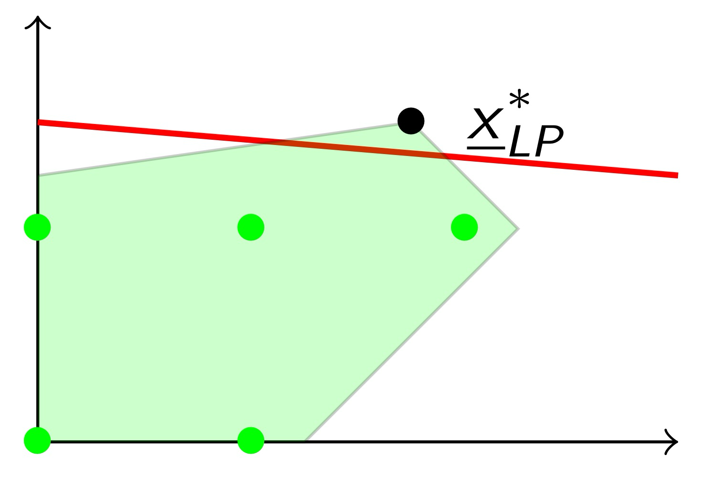

# Introduction

* **Definition**: An ==**Integer Linear Programming problem**== is an optimization problem of the form
  $$
  (ILP)
  \begin{aligned} \quad
      \text{min} \quad & \underline{c}^T \underline{x} \\
      \text{s.t.} \quad & A \underline{x} \geq \underline{b} \\
      & \underline{x} \geq 0 \ \text{with} \ \underline{x} \in \textcolor{red}{\mathbb{Z}^n}.
  \end{aligned}
  \notag
  $$

  * If $x_j \in \{0, 1\}$ for all $j$, ==**binary LP**==
  * If not all $x_j$ are integer, ==**mixed integer LP**==

* **Assumption**: The parameters $A$, $b$ are integer (without loss of generality)

* **Note**: The integrality condition $x_j \in \mathbb{Z}$ is ==**non linear**== since it can be expressed as $\sin(\pi x_j) = 0$

* **Example**:

	

	

* **Definition**:

	Let
	$$
	(ILP) \quad
	\begin{aligned}
	    z_{\text{ILP}} := & \max \quad \underline{c}^T \underline{x} \\
	    & \ \text{s.t.} \quad \ \  \underline{A} \underline{x} \leq \underline{b} \\
	    & \quad \quad \quad \ \underline{x} \geq 0, \ \underline{x} \in \mathbb{Z}^n
	\end{aligned}
	\notag
	$$
	The problem
	$$
	(LP) \quad
	\begin{aligned}
	    z_{\text{LP}} := & \max \quad \underline{c}^T \underline{x} \\
	    & \ \text{s.t.} \quad \ \  \underline{A} \underline{x} \leq \underline{b} \\
	    & \quad \quad \quad \ \underline{x} \geq 0
	\end{aligned}
	\notag
	$$
	is the ==**linear (continuous) relaxation**== of (ILP)

> **Property**: 
>
> * For any ILP with max, we have ==$z_{ILP} \leq z_{LP}$==, i.e., $z_{LP}$ is an ==**upper bound**== on the optimal value of (ILP)
> * For any ILP with min, we have ==$z_{ILP} \geq z_{LP}$==, i.e., $z_{LP}$ is an ==**lower bound**== on the optimal value of (ILP)

* **First idea**: Relax the integrality constraints of (ILP) and round up/down the optimal solution of the linear relaxation (LP)

	* If an ==**optimal solution**== of (==**LP**==) is ==**integer**==, then it is also an ==**optimal solution**== of (==**ILP**==)

	* But often the rounded optimal solutions of (LP) are:

		* infeasible for (ILP)

			

		* useless : very different from an optimal solution of (ILP)

			* When the integer variables take small values at optimality, e.g., binary assignment variables  or activation variables (plants), ...

	* Useful rounded solutions: When variables take large values at optimality, e.g., number of pieces to produce, ...

	* **Note**: It also depends on the unit costs (objective function coefficients)

## Example 1: (Knapsack Problem)

* Given

	* $n$ objects $j = 1, \dots , n$
	* $p_j$ profit (value) of object $j$
	* $w_j$ weight of object $j$
	* $b$ maximum knapsack capacity

	determine a ==**subset of objects**== that maximizes the total profit, while respecting the knapsack capacity

* **Variables**: $x_j = \begin{cases} 1 & \text{if } j \text{-th object is selected} \\ 0 & \text{otherwise} \end{cases}$
	$$
	\begin{aligned}
	\max \quad & \sum_{j=1}^n p_j x_j \\
	\text{s.t.} \quad & \sum_{j=1}^n w_j x_j \leq b \\
	& x_j \in \{0, 1\}, \quad j = 1, \dots, n
	\end{aligned}
	\notag
	$$

## Example 2: (Assignment Problem)

* Given

	* $m$ machines, $i = 1, \dots , m$
	* $n$ jobs, $j = 1, \dots , n$ (Assuming that $n > m$)
	* $c_{ij}$ cost of assigning job $j$ to machine $i$

	determine an ==**assignment**== of jobs to the machines so as to minimize the total cost, while assigning at least one job per machine and at most one machine for each job

* **Variables**: $x_j = \begin{cases} 1 & \text{if machine } i \text{ executes job } j \\ 0 & \text{otherwise} \end{cases}$
	$$
	\begin{aligned}
	\min \quad & \sum_{i=1}^m \sum_{j=1}^n c_{ij} x_{ij} \\
	\text{s.t.} \quad & \sum_{i=1}^m x_{ij} \leq 1, \quad j = 1, \dots, n \quad \textcolor{red}{\text{(at most one machine for each job)}} \\
	& \sum_{j=1}^n x_{ij} \geq 1, \quad i = 1, \dots, m \quad \textcolor{red}{\text{(at least one job for each machine)}} \\
	& x_{ij} \in \{0, 1\}, \quad i = 1, \dots, m, \; j = 1, \dots, n.
	\end{aligned}
	\notag
	$$

## Example 3: (Transportation Problem)

* Given

	* $m$ production plants, $i = 1, \dots , m$
	* $n$ clients, $j = 1, \dots , n$ (==**assumption: $n > m$**==)
	* $c_{ij}$ transportation cost of one unit of product from plant $i$ to client $j$
	* $p_i$ production capacity of plant $i$
	* $d_j$ demand of client $j$
	* $q_{ij}$ maximum amount to be transported from plant $i$ to client $j$

	determine a ==**transportation plan**== that minimizes total costs while satisfying plant capacity and client demands

* **Assumption**: $\displaystyle \sum_{i = 1}^m p_i = \sum_{j = 1}^n d_j$

* **Variables**: $x_{ij}$ = amount transported from plant $i$ to client $j$
	$$
	\begin{aligned}
	\min \quad & \sum_{i=1}^m \sum_{j=1}^n c_{ij} x_{ij} \\
	\text{s.t.} \quad & \sum_{j=1}^n x_{ij} \leq p_i, \quad i = 1, \dots, m \quad \text{(plant capacity)} \\
	& \sum_{i=1}^m x_{ij} \geq d_j, \quad j = 1, \dots, n \quad \text{(client demand)} \\
	& 0 \leq x_{ij} \leq q_{ij}, \quad i = 1, \dots, m, \; j = 1, \dots, n \quad \text{(transportation capacity)}.
	\end{aligned}
	\notag
	$$

* **Property of ==Transportation== & ==Assignment== Problem**: Optimal solution of the linear relaxation $\equiv$ optimal solution of the ILP

> **Theorem**: If in a transportation problem $q_i$, $d_{ij}$, $q_{ij}$ are integer, all the basic feasible solutions (vertices) of its linear relaxation are integer

## Example 4: (Scheduling Problem)

* Given

	* $m$ machines, $k = 1, \dots , m$
	* $n$ jobs, $j = 1, \dots, n$
	* $d_j$ dealing for job $j$, $j = 1, \dots , n$
	* $p_{jk}$ processing time of job $j$ on machine $k$ (maybe = 0)

	determine an ==**optimal sequence**== in which to process the jobs so as to minimize the total completion time while satisfying the deadlines

* **Assumption**: Each job must be processed once on each machine following the order of the machine indices $1, 2, \dots, m$

* **Variables**: 

	* $t_{jk} = $ time at which the processing of job $j$ starts on machine $k$

	* $t$ = upper bound on the completion time of all jobs

	* $y_{ijk} = \begin{cases} 1 & \text{if job } i \text{ precede job } j \text{ on machine } k \\ 0 & \text{otherwise} \end{cases}$
		$$
		\begin{aligned}
		\min \quad & t \\
		\text{s.t.} \quad & t_{jm} + p_{jm} \leq t, \quad j = 1, \dots, n \quad \textcolor{red}{\text{(t is upper bound on overall completion time)}} \\
		& t_{jm} + p_{jm} \leq d_j, \quad j = 1, \dots, n \quad \textcolor{red}{\text{(satisfy deadlines)}} \\
		& t_{jk} + p_{jk} \leq t_{j, k+1}, \quad j, k = 1, \dots, m-1 \\
		& t_{ik} + p_{ik} \leq t_{jk} + M(1 - y_{ijk}), \quad \forall i, j, k \quad i < j \quad \text{(1)} \\
		& t_{jk} + p_{jk} \leq t_{ik} + M y_{ijk}, \quad \forall i, j, k \quad i < j \quad \text{(2)} \\
		& t \geq 0, \quad t_{jk} \geq 0, \quad j, k = 1, \dots, m \\
		& y_{ijk} \in \{0, 1\}, \quad i, j, k = 1, \dots, m \\
		& \text{where} \quad M := \max_j d_j \\
		& \quad \textcolor{red}{\text{(Mixed ILP!)}}
		\end{aligned}
		\notag
		$$

		* (1) and (2) make sure that 2 jobs are not simultaneously processed on the same machine
		* (1) active when $y_{ijk} = 1$ ($i$ proceeds $j$ on machine $k$) and ensures that $i$ is completed before $j$ starts (on $k$)
		* (2) active when $y_{ijk} = 0$ ($j$ preceeds $i$ on machine $k$) and ensures that $j$ is completed before $i$ starts (on $k$)

# Branch-and-bound Method

Consider a generic optimization problem
$$
z = \min \{c(\underline{x}) : \underline{x} \in X\}
\notag
$$

* **Idea**: Reduce the solution of a difficult problem to that of a sequence of simpler ==**subproblems**== by (recursive) ==**partition**== of the feasible region $X$

	* Two main components: ==**branching**== and ==**bounding**==
	* Applicable to discrete and continuous optimization problems

* **Branching**:

	* Partition $X$ into $k$ subsets
		$$
		X = X_1 \cup \dots \cup X_k \quad (\text{with } X_i \cap X_j = \emptyset \text{ for each pair } i \neq j)
		\notag
		$$
		and let
		$$
		z_i = \min \{ c(\underline{x}) : \underline{x} \in X_i \}, \quad \text{for } i = 1, \dots, k
		\notag
		$$

	* Clearly $z = \min \{ c(\underline{x}) : \underline{x} \in X\} = \min\{z_1, \dots, z_k\}$

	* Illustration:

		

		

* **Bounding**:

	* For each subproblem $z_i = \min \{ c(\underline{x}) : \underline{x} \in X_i \}$:

		* Determine an optimal solution of $\min \{ c(\underline{x}) : \underline{x} \in X_i \}$ (explicit), or
		* Prove that $X_i = \empty$ (explicit), or
		* Prove that $z_i \geq z'=$ objective function value of the best feasible solution found so far (implicit)

	* If the ==**subproblem**== is not "==**solved**==" we generate ==**new subproblems**== by further partitioning

		

		

## Branch-and-bound for ILP

Given an ILP $\min \{\underline{c}^T \underline{x} : A \underline{x} = \underline{b}, \ \underline{x} \geq \underline{0} \text{ integer}\}$

* **Branching**:

	* ==**Partition**== $X$ ==**into subregions**== (subdivision in exhaustive and exclusive subregions)

	* Let $\underline{\bar{x}}$ denote an optimal solution for the ==**linear relaxation**== of the ILP
		$$
		\min \{\underline{c}^T \underline{x} : A \underline{x} = \underline{b}, \ \underline{x} \geq \underline{0}\}
		\notag
		$$
		and $z_{LP} = \underline{c}^T \underline{\bar{x}}$ denote the corresponding optimal value

	* If $\underline{\bar{x}}$ is integer, $\underline{\bar{x}}$ is also optimal for ILP. Otherwise, $\exist \bar{x}_h$ fractional and we consider two subproblems:

		* $ILP_1$ : $\min \{ \underline{c}^T \underline{x} : A\underline{x} = \underline{b}, \, \textcolor{red}{x_h \leq \lfloor \bar{x}_h \rfloor}, \, \underline{x} \geq \underline{0}, \, x \text{ integer} \}$
		* $ILP_2$ : $\min \{ \underline{c}^T \underline{x} : A\underline{x} = \underline{b}, \, \textcolor{red}{x_h \geq \lfloor \bar{x}_h \rfloor} + 1, \, \underline{x} \geq \underline{0}, \, x \text{ integer} \}$

* **Bounding**: Determine a lower "bound" (if minimization ILP) on the optimal value $z_i$ of a subproblem of ILP by solving its ==**linear relaxation**==

* **Example**:

	

	Since ==$\bar{x}_1$== and ==$\bar{x}_2$== are ==**fractional**==, select one of them for branching. For instance, $x_1$

	The feasible region $X$ is partitioned into $X_1$ and $X_2$ by imposing: $\textcolor{red}{x_1 \leq \lfloor \bar{x}_1 \rfloor = 3}$ or $\textcolor{red}{x_1 \geq \lfloor \bar{x}_1 \rfloor + 1 = 4}$  (exhaustive and exclusive constraints)

	

	After considering $X_1$, the ==**best feasible**== (integer) ==**solution**== found so fa is:
	$$
	\underline{x}' = \begin{bmatrix} 3 \\ 3 \end{bmatrix} \quad \text{with } z' = 39
	\notag
	$$
	Since $z_{LP_2} = 41 > 39$ and $\underline{x}_{LP_2} = \begin{bmatrix} 4 \\ 9/5 \end{bmatrix}$, $X_2$ may contain a better feasible solution of ILP

	

	Since $z_{LP_3} = 365 / 9 > 39$ and $\underline{\bar{x}}_{LP_3} = (40/9, \ 1)$, $X_3$ may contain a better feasible solution of ILP $\Rightarrow$ Partition $X_3$ into $X_5$ and $X_6$ by imposing: $\textcolor{red}{x_1 \geq \lfloor \bar{x}_1 \rfloor + 1 = 5}$

	

	Branch-and-bound is an exact method (it guarantees an optimal solution)

* **Branching Tree**:

	

	* The branching tree may not contain all possible nodes ($2^d$ leaves)
	* ==**Bounding criterion**==: A node of the tree has no child if
		* initial constraints + those on the arcs from the root are infeasible (e.g., $S_4$)
		* optimal solution of the linear relaxation is integer (e.g., $S_1$)
		* the value $\underline{c}^T \underline{\bar{x}}_{LP}$ of the optimal solution $\underline{\bar{x}}_{LP}$ of the linear relaxation is worse than that of the best feasible solution of ILP found so far
			* the feasible subregion of the subproblem associated to that node cannot contain an integer feasible solution that is better than the best feasible solution of ILP found so far)
			* bounding criterion often allows to **=="discard"==** a large ==**number of nodes**== (subproblems)

* **Choice of the node (subproblem) to examine**:

	* ==**Deeper nodes**== first (depth-first search strategy)
		* Simple recursive procedure, it is easy to reoptimize but it may be costly in case of wrong choice
	* First ==**more promising nodes**==: with the best linear relaxation value (best-bound first strategy)
		* Typically generates a smaller number of nodes but subproblems are less constrained $\Rightarrow$ takes longer to find a first feasible solution and improve it

* **Choice of the (fractional) variable for branching**:
	* It may not be the best choice to select the variable $x_h$ ==**whose fractional value is closer to 0.5**== (hoping to obtain two subproblems that are more stringent and balanced)
	* ==**Strong branching**==: Try to branch on some of candidate variables (fractional basic ones), evaluating the corresponding objective function values and actually branch on the variable that yields ==**the best improvement**== in objective function

# Cutting Plane Methods & Gomory Fractional Cuts

Consider a generic ILP problem:
$$
(ILP) \quad
\begin{aligned}
\min \quad & \underline{c}^T \underline{x} \\
\text{s.t.} \quad & A\underline{x} \geq \underline{b} \\ 
& \underline{x} \geq \underline{0} \ \text{ integer}
\end{aligned}
\quad \quad
\begin{aligned}
& \text{Feasible region: } \\
& X = \{ \underline{x} \in \mathbb{Z}^n : A \underline{x} \geq \underline{b}, \ \underline{x} \geq \underline{0} \}
\end{aligned}
\notag
$$

* **Assumption**: $a_{ij}$, $c_j$, and $b_i$ integer

* **Note**: The feasible region of an ILP can be described by different sets of constraints that may be weaker/tighter

	

* **Equivalent and Ideal Formulations**:

	

	All formulations (with integrality constraints) are equivalent but the optimal solutions of the linear relaxations ($\underline{x}_{LP}^*$) can differ substantially

* **Definition**: The ==**ideal formulation**== is that describing the ==**convex hull of $X$**==, ==$conv(X)$==, where $conv(X)$ is the smallest convex subset containing $X$

	* Since all vertices have all integer coordinates, for any $\underline{c}$ we have $z_{LP}^* = z_{ILP}^*$ and the LP optimum is also the ILP optimum!

		

> **Theorem**: For ==**any feasible region**== $X$ of an ILP (bounded or unbounded), there exists an ==**ideal formulation**== (a description of $conv(X)$ involving a finite number of linear constraints) but the number of constraints can be very large (exponential) with respect to the size of the original formulation
>
> * In theory, the solution of any ILP can be reduced to that of a single LP!
> * However, the ==**ideal formulation**== is often either ==**very large**== or ==**very difficult**== to determine

## Cutting Plane Methods

A full description of $conv(X)$ is not required, we just need a good description in the neighborhood of the optimal solution

* **Defintion**: A ==**cutting plane**== is an inequality $\underline{a}^T \underline{x} \leq b$ that is not satisfied by $\underline{x}^*_{LP}$ but is satisfied by all the feasible solutions of the ILP

	

* **Idea**: Given an initial formulation, ==**iteratively add cutting planes**== as long as the linear relaxation does not provide an optimal integer solution

	

## Gomory Fractional Cuts

Let $\underline{x}^*_{LP}$ be an optimal solution of the linear relaxation of the current formulation $\min \{\underline{c}^T \underline{x} : A \underline{x} = \underline{b}, \ \underline{x} \geq \underline{0}\}$ and $x_{B[r]}^*$ be a fractional basic variable

The corresponding row of the optimal tableau is:
$$
x_{B[r]} + \underbrace{\sum_{j \in N} \bar{a}_{rj} x_j}_{x_j \text{ non basic}} = \underbrace{\bar{b}_r}_{\text{fractional}}
\notag
$$

* **Definition**: The ==**Gomory cut**==
	
	* Integer form:
	  $$
	  x_{B[r]} + \sum_{j \in N} \lfloor \bar{a}_{rj} \rfloor x_j \leq \lfloor \bar{b}_r \rfloor
	  \notag
	  $$
	
	* Fractional form:
	
	
	$$
	\sum_{j \in N} (\bar{a}_{rj} - \lfloor \bar{a}_{rj} \rfloor) x_j \geq (\bar{b}_r - \lfloor \bar{b}_r \rfloor)
	\notag
	$$
	
* **Example**: 

  

  

  

  

## Cutting Plane Method with Fractional Gomory Cuts

> **Theorem**: If the ILP has a finite optimal solution, the cutting plane method finds one after adding a ==**finite number**== of Gomory cuts (But often very large)

* **Example**:

	

	

	

	

	

	

	