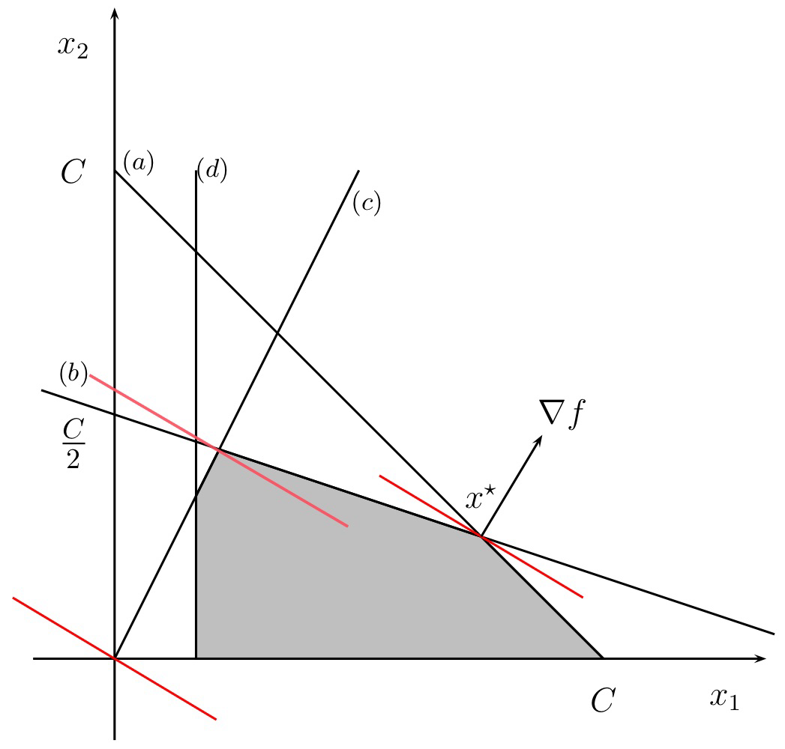
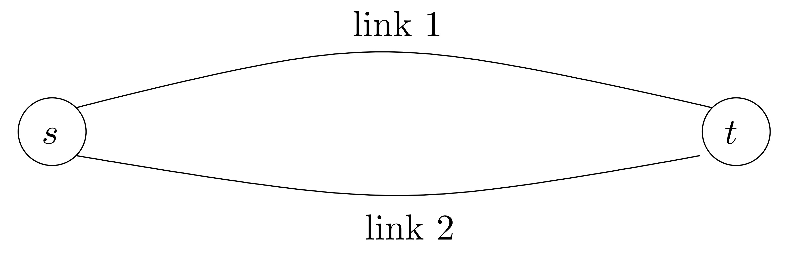
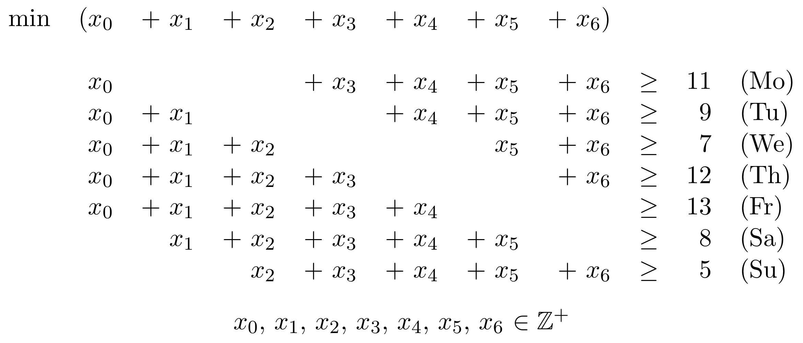

# Portfolio Optimization

A bank has a capital of C billions of Euro and two available stocks:

1. with an annual revenue of 15% and a risk factor of $\frac{1}{3}$ ,
2. with an annual revenue of 25% and a risk factor of $1$.

The risk factor represents the maximum fraction of the stock value that can be lost. A risk factor of 0.25 implies that, if stocks are bought for 100 Euro up to 25 Euro can be lost. It is required that at least half of C is risk-free. The amount of money used to buy stocks of (2) must not be larger than two times that used to buy stocks of (1). At least $\frac{1}{6}$ of C must be invested into (1).

Give a Linear Programming formulation for the problem of determining an optimal portfolio for which the profit is maximized. Solve the problem graphically.

* **Parameters**:
	* $C$ : available capital

* **Decision variables**: 

	* $x_1$ : amount of money invested in stock of type 1
	* $x_2$ : amount of money invested in stock of type 2

* **Model**:
	
	$\begin{aligned}
		\max \quad & \textcolor{red}{0.15 x_1 + 0.25 x_2} \\
		\text{s.t.} \quad & \textcolor{blue}{x_1 + x_2 \leq C} \\
	    & \textcolor{green}{\frac{1}{3}x_1 + x_2 \leq \frac{1}{2}C} \\
	    & \textcolor{purple}{x_2 \leq 2x_1} \\
	    & \textcolor{orange}{x_1 \geq \frac{1}{6}C} \\
	    & x_1, x_2 \geq 0
	\end{aligned}$        

# Gasoline Mixture

A refinery produces two types of gasoline, mixing three basic oils according to the following gasoline mixture rules:

|            | Oil 1                            | Oil 2                            | Oil 3 | Revenue                      |
| ---------- | -------------------------------- | -------------------------------- | ----- | ---------------------------- |
| Gasoline A | ≤ 30% | ≥ 40% | -     | 5.5 |
| Gasoline B | ≤ 50% | ≥ 10% | -     | 4.5 |

The last column of the previous table indicates the profit (Euro/barrel). The availability of each type of oil (in barrel) and the cost (Euro/barrel) are as follows:

| Oil  | Availability                   | Cost                       |
| ---- | ------------------------------ | -------------------------- |
| 1    | 3000 | 3 |
| 2    | 2000 | 6 |
| 3    | 4000 | 4 |

Give a Linear Programming formulation for the problem of determining a mixture that maximizes the profit (difference between revenues and costs)

* **Decision variables**:

	* $x_{ij}$ : amount of the $i$-th oil used to produce the $j$-th gasoline, for $i \in \{1, 2, 3\}$ and $j \in \{A, B\}$
	* $y_j$ : amount of gasoline of type $j$-th that is produced, for $j \in \{A, B\}$

	The total revenue is $5.5y_A + 4.5y_B$ , the total cost, due to the amount of oil 1, 2, and 3 that is used is, respectively, $\displaystyle 3 \sum_{j \in \{A, B\}} x_{1j}, \, 6 \sum_{j \in \{A, B\}} x_{2j}, \, \text{and} \, 4 \sum_{j \in \{A, B\}} x_{3j}$

* **Model**:
	$$
	\begin{aligned}
		\max \quad & \textcolor{red}{5.5 y_A + 4.5 y_B - 3(x_{1A} + x_{1B}) - 6(x_{2A} + x_{2B}) - 4(x_{3A} + x_{3B})} \\
		\text{s.t.} \quad & \textcolor{blue}{x_{1A} + x_{1B} \leq 3000} \\
		& \textcolor{blue}{x_{2A} + x_{2B} \leq 2000} \\
		& \textcolor{blue}{x_{3A} + x_{3B} \leq 4000} \\
		& y_A = x_{1A} + x_{2A} + x_{3A} \\
		& y_B = x_{1B} + x_{2B} + x_{3B} \\
	    & \textcolor{green}{x_{1A} \leq 0.3 y_A} \\
	    & \textcolor{green}{x_{1B} \leq 0.5 y_B} \\
	    & \textcolor{green}{x_{2A} \geq 0.4 y_A} \\
	    & \textcolor{green}{x_{2A} \geq 0.1 y_B} \\
	    & x_{1A}, x_{2A}, x_{3A}, x_{1B}, x_{2B}, x_{3B}, y_A, y_B \geq 0
	\end{aligned}
	\notag
	$$

To obtain a general formulation of the gasoline mixture problem, it suffices to define the variables and parameters of the problem as vectors and matrices, with indices belonging to well-defined sets

* **Sets**:
	* $I$ : types of oil
	* $J$ : types of gasoline
* **Parameters**:
	* $c_i$ : cost per barrel of the $i$-th type of oil, for $i \in I$ 
	* $b_i$ : maximum availability of the $i$-th type of oil, for $i \in I$ 
	* $r_j$ : revenue per barrel of the $j$-th type of gasoline, for $j \in J$ 
	* $q_{ij}^{\text{max}}$ : maximum quantity (as fraction of the unit) of the $i$-th type of oil in the $j$-th type of gasoline, for $i \in I$ and $j \in J$ 
	* $q_{ij}^{\text{min}}$ : minimum quantity (as fraction of the unit) of the $i$-th type of oil in the $j$-th type of gasoline, for $i \in I$ and $j \in J$

* **Decisions variables**:

	* $x_{ij}$ : quantity of the $i$-th type of oil in the $j$-th type of gasoline, for $i \in I$ and $j \in J$ 
	* $y_j$ : quantity of the $j$-th type of gasoline produced, for $j \in J$

* **Model**:
	$$
	\begin{aligned}
		\max \quad & \textcolor{red}{\sum_{j \in J} r_j y_j - \sum_{i \in I, j \in J} c_i x_{ij}} \\
		\text{s.t.} \quad & \textcolor{blue}{\sum_{j \in J} x_{ij} \leq b_i, \quad i \in I} \\
		& y_i = \sum_{i \in I} x_{ij}, \quad j \in J \\
	    & \textcolor{green}{x_{ij} \leq q_{ij}^{max} y_j, \quad i \in I, j \in J} \\
	    & \textcolor{green}{x_{ij} \geq q_{ij}^{min} y_j, \quad i \in I, j \in J} \\
	    & x_{ij}, y_{ij} \geq 0, \quad i \in I, j \in J
	\end{aligned}
	\notag
	$$

# Packet Routing

$n$ packets of data must be routed from node s to node t , along one of two available links, with capacity (bandwidth) $k_1 = 1$ Mbps and $k_2 = 2$ Mbps

The cost per unit of capacity of link 2 is 30% larger than that of link 1. The following table indicates the quantity of capacity consumed by each packet $i$ , $i \in \{1, 2, \dots, n\}$ , and the cost to route it on link 1

| Packet | Consumed Capacity | Cost on Link 1               |
| ------ | ----------------- | ---------------------------- |
| 1      | 0.3               | 200 |
| 2      | 0.2               | 200 |
| 3      | 0.4               | 250 |
| 4      | 0.1               | 150 |
| 5      | 0.2               | 200 |
| 6      | 0.2               | 200 |
| 7      | 0.5               | 700 |
| 8      | 0.1               | 150 |
| 9      | 0.1               | 150 |
| 10     | 0.6               | 900 |

Give an integer linear programming formulation for the problem of minimizing the total cost of routing all the packets. Give also an integer linear programming formulation for the more general case where m links are available

* **Sets**:
	* $I = \{1 \dots n\}$ : set of packets
* **Parameters**:
	* $a_i$ : capacity consumed by packet $i$, for $i \in I$
	* $c_{i1}$, $c_{i2}$ : routing cost for packet $i$ on link 1 and 2, for $i \in I$ 
	* $k_1$, $k_2$ : capacity for link 1 and 2
* **Variables**: 
	* $x_i$ : 1 if packet $i$ is routed on link 1, 0 if routed on link 2, for $i \in I$ 

* **Model**: 
	$$
	\begin{aligned}
		\min \quad & \textcolor{red}{\sum_{i \in I} c_{i1} x_i + c_{i2} (1 - x_i)} \\
		\text{s.t.} \quad & \textcolor{blue}{\sum_{i \in I} a_i x_i \leq k_1} \\
	    & \textcolor{green}{\sum_{i \in I} a_i (1-x_i) \leq k_2} \\
	    & \boxed{x_i \in \{0,1\}, \quad i \in I}
	\end{aligned}
	\notag
	$$

* 

The $m$-link formulation requires a new set of binary variables, one for each packet and link. The packet-to-link assignment is also to be explicitly introduced

* **Sets**:
	* $I = \{1 \dots n\}$ : set of packets
	* $J = \{1 \dots m\}$ : set of links
* **Parameters**:
	* $a_i$ : capacity consumed by packet $i$, for $i \in I$
	* $c_{ij}$ : routing cost for packet $i$ on link $j$, for $i \in I$, $j \in I$ 
	* $k_j$ : capacity for link $j$, for $j \in J$

* **Variables**:
	* $x_{ij}$ : 1 if packet $i$ is routed on link $j$, 0 otherwise, for $i \in I$, $j \in J$

*  **Model**:
	$$
	\begin{aligned}
		\min \quad & \textcolor{red}{\sum_{i \in I, j \in J} c_{ij} x_{ij}} \\
		\text{s.t.} \quad & \textcolor{violet}{\sum_{j \in J} x_{ij} = 1, \quad i \in I \quad (\text{assignment})} \\
	    & \textcolor{blue}{\sum_{i \in I} a_i x_{ij} \leq k_j, \quad j \in J} \\
	    & \boxed{x_i \in \{0,1\}, \quad i \in I, j \in J}
	\end{aligned}
	\notag
	$$
	

# Multi-period Production Planning (Uncapacitated Lot Sizing)

A company $A$, which produces one type of high-precision measuring instrument, has to plan the production for the next 3 months. Each month, $A$ can produce at most 110 units, at a unit cost of 300 Euro. Moreover, each month, up to 60 additional units produced by another company $B$ can be bought at a unit cost of 330 Euro. Unsold units can be stored. The inventory cost is of 10 Euro per unit of product, per month. Sales forecasts indicate a demand of 100, 130, and 150 units of product for the next 3 months.

1. Give a linear programming formulation for the problem of determining a production plan (direct or indirect) which minimizes the total costs, while satisfying the monthly demands.

	* **Set**: 

		* $T = \{1, 3\}$ : set of months

	* **Parameters**:

		* $b$: production capacity of A
		* $b'$: production capacity of B
		* $c$: unit production cost for A
		* $c'$: unit production cost for B
		* $m$: inventory cost per unit and month
		* $d_t$: sales forecasts for month $t$, for $t \in T$

	* **Variables**:

		* $x_t$: units produced by A in month $t$, for $t \in T$
		* $x'_t$: units bought from B in month $t$, for $t \in T$
		* $z_t$: units in inventory at the end of month $t$, for $t \in T \cup \{0\}$

	* **Model**:
		$$
		\begin{aligned}
			\min \quad & \textcolor{red}{\sum_{t \in T} (c x_t + c'x_t' + mz_t)} & (\text{cost})\\
			\text{s.t.} \quad & \textcolor{blue}{x_t \leq b, \quad t \in T} & (\text{capacity of } A) \\
			& \textcolor{blue}{x_t' \leq b', \quad t \in T} & (\text{capacity of } B) \\
			& \textcolor{green}{z_{t-1} + x_t + x_t' \geq d_t , \quad t \in T} & (\text{demand}) \\
			& \textcolor{orange}{z_{t-1} + x_t + x_t' - d_t = z_t, \quad t \in T} & (\text{inventory balance}) \\
			& \textcolor{orange}{z_0 = 0} & (\text{starting condition}) \\
		    & x_t, x_t', z_t \geq 0, \quad t \in T & (\text{nonnegative variables})
		\end{aligned}
		\notag
		$$
		

2. Give a mixed integer linear programming formulation for the variant of the problem where production lots have a minimum size. In particular, if any strictly positive quantity is produced in a given month, this quantity cannot be smaller than 15 units.

	* To take into account the minimum lot size, we add the binary variables

		* $y_t$ : 1 if production is active at month $t$, 0 otherwise, for $t \in T$

	* and the constraints
		$$
		\begin{aligned}
			& x_t \geq l y_t, \quad t \in T & (\text{minimum lot size}) \\
			& x_t \leq M y_t, \quad t \in T & (\text{activation})
		\end{aligned}
		\notag
		$$
		where $l = 15$ is the minimum lot size, and $M$ is a large enough value, such that constraint $x_t \leq M y_t$ is redundant when $y_t = 1$. For instance, we can choose $M = 110$, i.e., equal to the monthly productive capacity.

# Computer Rental Planning

A company must rent computers in order to face the requirements during the next four months:

| Month        | January                     | February                    | March                       | April                       |
| ------------ | --------------------------- | --------------------------- | --------------------------- | --------------------------- |
| Requirements | 9 | 5 | 7 | 9 |

The rental cost depends on the length of the rental as follows:

| Length      | 1 month                      | 2 months                     | 3 months                     |
| ----------- | ---------------------------- | ---------------------------- | ---------------------------- |
| Cost (Euro) | 200 | 350 | 450 |

Give an integer linear programming formulation for the problem of finding a rental plan of minimum total cost.

* **Variables**:

	- $g_1, g_2, g_3$: number of computers rented in January for 1, 2, and 3 months  

	- $f_1, f_2, f_3$: number of computers rented in February for 1, 2, and 3 months  

	- $m_1, m_2$: number of computers rented in March for 1 and 2 months  

	- $a_1$: number of computers rented in April for 1 month  

* **Model**:
	$$
	\begin{aligned}
		\min \quad & \textcolor{red}{200(g_1 + f_1 + m_1 + a_1) + 350(g_2 + f_2 + m_2) + 450(g_3 + f_3)} \\
		\text{s.t.} \quad & \textcolor{blue}{g_1 + g_2 + g_3 \geq 9 \quad \quad (\text{January})} \\
		& \textcolor{blue}{f_1 + f_2 + f_3 + g_2 + g_3 \geq 5 \quad \quad (\text{Feburary})}\\
		& \textcolor{blue}{m_1 + m_2 + f_2 + f_3 + g_3 \geq 7 \quad \quad (\text{March})} \\
		& \textcolor{blue}{a_1 + m_2 + f_3 \geq 9 \quad \quad (\text{April})} \\
		& g_1, g_2, g_3, f_1, f_2, f_3, m_1, m_2, a_1 \in \mathbb{Z}^+ \quad \quad (\text{integer nonnegative variables})
	\end{aligned}
	\notag
	$$

* 

By introducing the following index sets, parameters and variables:

* **Sets**:

	- $I = \{1, \ldots, m\}$: months  

	- $J = \{1, \ldots, l\}$: rental durations (in months)  

* **Parameters**:

	- $d_i$: demand for month $i$, $i \in I$  

	- $c_j$: cost for rental of duration $j$, $j \in J$  

* **Variables**:

	- $x_{ij}$: number of computers rented in month $i$ for $j$ months, $i \in I, j \in J$

* **Model**:
	$$
	\begin{aligned}
		\min \quad & \sum_{i \in I, j \in J} c_j x_{ij} \quad & \text{(cost)} \\
		\text{s.t.} \quad & \sum_{\textcolor{violet}{k=\max\{1, i-l+1\}}}^i \quad \sum_{\textcolor{violet}{j=i-k+1}}^l x_{kj} \geq d_i, \quad i \in I \quad & \text{(demand)} \\
		& x_{ij} \in \mathbb{Z}^+, \quad i \in I, j \in J \quad & \text{(nonnegative integer variables)}
	\end{aligned}
	\notag
	$$

# Workforce Planning

An ICT services company has estimated the following demand for maintenance and consultancy for the next 5 months:

| Month          | 1                              | 2                              | 3                              | 4                              | 5                               |
| -------------- | ------------------------------ | ------------------------------ | ------------------------------ | ------------------------------ | ------------------------------- |
| Demand (hours) | 6000 | 7000 | 8000 | 9500 | 11000 |

At the beginning of the planning period, 50 technicians are available. Each technician works at most 160 hours per month. To satisfy the demand, new technicians must be hired and trained. During the training period, which lasts one month, an expert technician must coach the newly hired one for 50 hours.

Expert technicians are paid 2000 Euro per month, while the newly hired ones are paid 1000 Euro during the training month. We suppose that, at the end of each month, 5% of the expert technicians leave the company to join competitors.

Give a mathematical programming formulation for the problem of minimizing the total costs.

* **Sets**:
	- $I = \{1, \ldots, 5\}$: months  

* **Parameters**:
	- $d_i$: demand for month $i$, $i \in I$  

* **Variables**:

	- $x_i$: number of expert technicians available in month $i$, $i \in I$  

	- $y_i$: number of technicians training during month $i$, $i \in I$ 

* **Model**:
	$$
	\begin{aligned}
		\min \quad & \textcolor{red}{2000(x_1 + x_2 + x_3 + x_4 + x_5) + 1000(y_1 + y_2 + y_3 + y_4 + y_5)} \\
		\text{s.t.} \quad & \textcolor{blue}{160x_i - 50y_i \geq d_i, \quad i \in I \quad \quad \text{(demand)}} \\
		& \textcolor{green}{\lfloor 0.95x_i \rfloor + y_i = x_{i+1}, \quad i \in I \quad \quad \text{(number)}} \\
		& \textcolor{orange}{x_1 = 50} \\
		& x_i, y_i \in \mathbb{Z}^+, \quad i \in I \quad \quad \text{(nonnegative integer variables)}
	\end{aligned}
	\notag
	$$

# Facility Location & Transportation

A distribution company has to supply a single type of good to $n$ clients. Let $d_j$ denote the demand of client $j$, where $j \in J = \{1, \ldots, n\}$. The goods must be stocked in warehouses before being delivered to the clients. The warehouses can be located in $m$ candidate sites. 

- Let $f_i$ denote the cost for opening a warehouse at the candidate site $i \in I = \{1, \ldots, m\}$, and $b_i$ denote its maximum capacity.
- Let $c_{ij}$ be the unit transportation cost from warehouse $i$ to client $j$, and $q_{ij}$ be the maximum quantity to be transported from warehouse $i$ to client $j$.

Give an integer linear programming formulation to decide where to locate the warehouses and how to satisfy the client demands so as to minimize the total costs, i.e., the total opening costs plus the total transportation costs.

* **Variables**:

	- $x_{ij}$: amount of good to be transported from the warehouse in candidate site $i \in I$ to client $j \in J$  

	- $y_i$: 1 if the warehouse in candidate site $i \in I$ is opened, and 0 otherwise

* **Model**:
	$$
	\begin{aligned}
		\min \quad & \textcolor{red}{\sum_{i \in I, j \in J} c_{ij} x_{ij} + \sum_{i \in I} f_i y_i \quad \quad \text{(total cost)}}\\
		\text{s.t.} \quad
	    & \textcolor{blue}{\sum_{j \in J} x_{ij} \leq b_i, \quad i \in I \quad \quad \text{(availability)}} \\
	    & \textcolor{green}{\sum_{i \in I} x_{ij} \geq d_j, \quad j \in J \quad \quad \text{(demand)}} \\
	    & \textcolor{orange}{0 \leq x_{ij} \leq q_{ij} y_i, \quad i \in I, j \in J \quad \quad \text{(bounds)}} \\
	    & \textcolor{violet}{y_i \in \{0, 1\}, \quad i \in I \quad \quad \text{(binary variables)}}
	\end{aligned}
	\notag
	$$

# Modem Production

A company A, producing a single type of modem, is planning the production for the next 4 months.  
- The production capacity is **2500 units per month**, at a cost of **7 Euro per unit**.
- A second company B can be paid to produce extra units, at a cost of **9 Euro per unit**, for a maximum of **700 units per month**.

Inventory can be used, at a cost of **1 Euro per month per unit**. 

- **70 units** are stored at the beginning of the planning period.
- **300 units** must be stored at the end of the period. 

For technical reasons, the units must be produced in lots of at least **80 units**. Sales forecasts for the next 4 months are as follows:

| Month  | 1                              | 2                              | 3                              | 4                              |
| ------ | ------------------------------ | ------------------------------ | ------------------------------ | ------------------------------ |
| Demand | 2600 | 3000 | 2350 | 2700 |

1. Give an Integer Linear Programming (ILP) formulation for the problem of determining a production plan of minimum total cost.

	* **Sets**:

		- $J$: production months  

	* **Parameters**:

		- $d_j$: demand for month $j$  

		- $c_A$: unit production cost for company A  

		- $c_B$: unit production cost for company B  

		- $m$: unit inventory cost per month  

		- $l$: minimum lot size  

		- $u_A$: maximum number of units in production per month for company A  

		- $u_B$: maximum number of units in production per month for company B  
	
	* **Variables**:
		- $x_{Aj}$: units of product produced in month $j \in J$ by company A  
		
		- $x_{Bj}$: units of product produced in month $j \in J$ by company B  
		
		- $y_{Aj}$: 1 if company A produces in month $j \in J$, 0 otherwise  
		
		- $y_{Bj}$: 1 if company B produces in month $j \in J$, 0 otherwise  
		
		- $z_j$: units in inventory at the end of month $j \in J$ 
		
	
	* **Model**:
		$$
		\begin{aligned}
			\min \quad & \textcolor{red}{c_A \sum_{j=1}^4 x_{Aj} + c_B \sum_{j=1}^4 x_{Bj} + m \sum_{j=0}^4 z_j} \\
			\text{s.t.} \quad & \textcolor{blue}{x_{Aj} + x_{Bj} + z_{j-1} \geq d_j, \quad j \in J \quad \quad \text{(demand)}} \\
			& \textcolor{green}{z_j = z_{j-1} + x_{Aj} + x_{Bj} - d_j, \quad j \in J \quad \text{(inventory balance)}} \\
			& \textcolor{green}{z_0 = 70} \\
			& \textcolor{green}{z_4 = 300} \\
			& \textcolor{orange}{l y_{Aj} \leq x_{Aj} \leq u_A y_{Aj}, \quad j \in J \quad \text{(min lot size for A)}} \\
			& \textcolor{orange}{l y_{Bj} \leq x_{Bj} \leq u_B y_{Bj}, \quad j \in J \quad \text{(min lot size for B)}} \\
			& x_{Aj}, x_{Bj}, z_j \in \mathbb{N}, \quad j \in J \\
			& y_{Aj}, y_{Bj} \in \{0, 1\}, \quad j \in J
		\end{aligned}
		\notag
		$$

2. Suppose that fixed charges $f_A$ and $f_B$ must be paid each month that production takes place in factory A and, respectively, B. How can we extend the ILP formulation to account for fixed charges?

	* For the variant with fixed costs, we introduce into the objective function the additional term
		$$
		f_A \sum_{j=1}^4 y_{Aj} + f_B \sum_{j=1}^4 y_{Bj}
		\notag
		$$

# Hospital Shifts

We have to plan the shifts for a hospital department, so that the total number of nurses is minimized.  
- Each nurse works for **5 consecutive days** and stays home for the next **2 days**.  
- The estimated demand, in terms of the number of nurses, is as follows:

| Day    | Mo   | Tu   | We   | Th   | Fr   | Sa   | Su   |
| ------ | ---- | ---- | ---- | ---- | ---- | ---- | ---- |
| Demand | 11   | 9    | 7    | 12   | 13   | 8    | 5    |

Give an **integer linear programming (ILP)** formulation for the problem to minimize the total number of nurses.

* Let the variables $x_0, x_1, x_2, x_3, x_4, x_5,$ and $x_6$ denote the number of nurses whose shift begins (start working), respectively, on Monday, Tuesday, Wednesday, Thursday, Friday, Saturday, and Sunday. We have the following integer linear programming model:

	

