# Minimum-cost Spanning Tree

Find the minimum-cost spanning tree in the graph given in the figure by using Prim's algorithm, starting from the node 3.

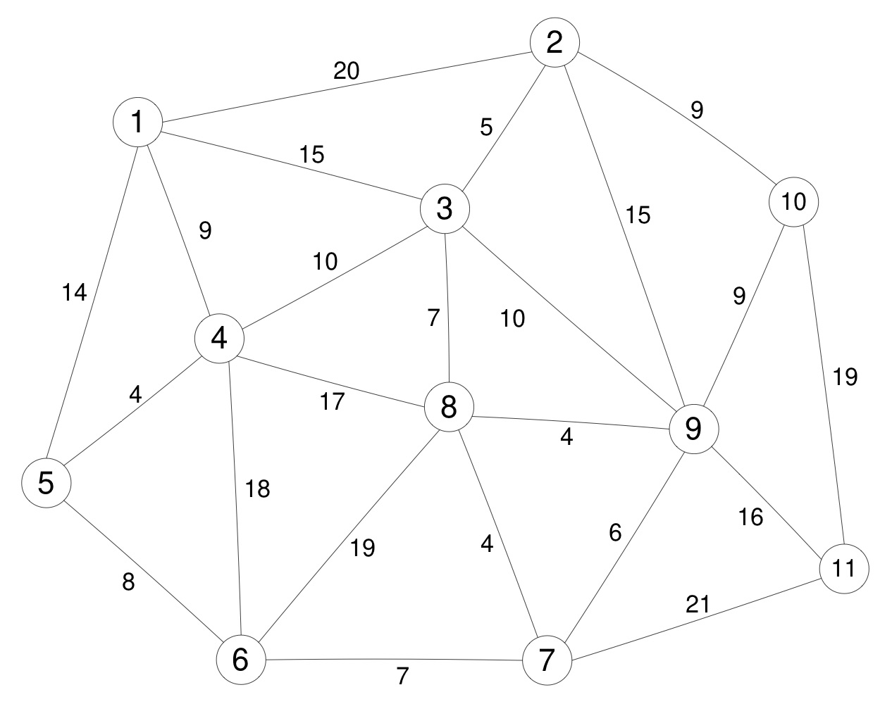

------

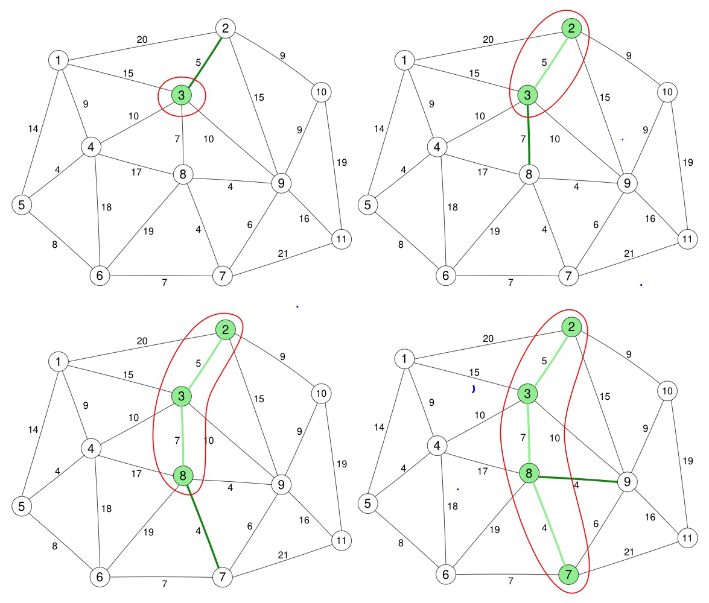

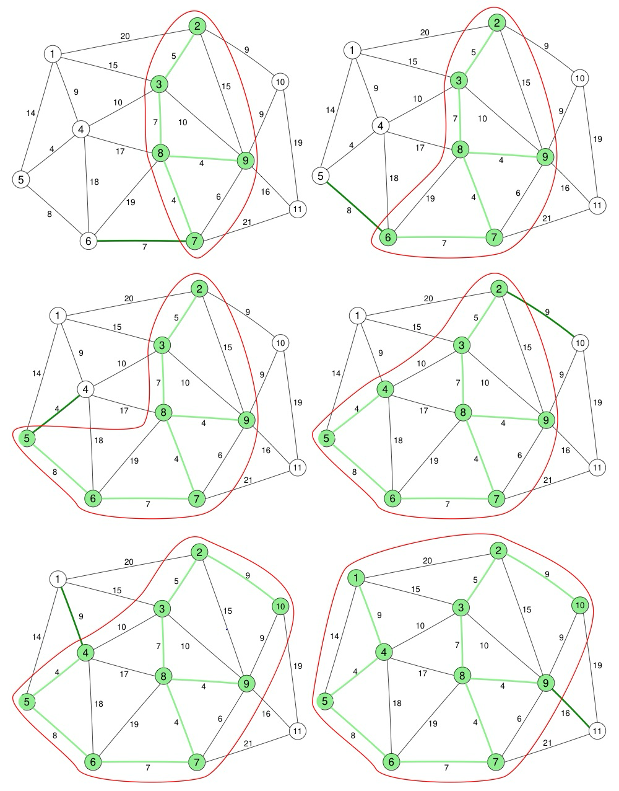

| Reached Nodes                 | Edge    | Cost | Iteration         |
| ----------------------------- | ------- | ---- | ----------------- |
| 3                             |         |      |                   |
| 2, 3                          | {2, 3}  | 5    | 1                 |
| 2, 3, 8                       | {3, 8}  | 7    | 2                 |
| 2, 3, 7, 8                    | {7, 8}  | 4    | 3                 |
| 2, 3, 7, 8, 9                 | {8, 9}  | 4    | 4                 |
| 2, 3, 6, 7, 8, 9              | {6, 7}  | 7    | 5                 |
| 2, 3, 5, 6, 7, 8, 9           | {5, 6}  | 8    | 6                 |
| 2, 3, 5, 6, 7, 8, 9, 4        | {4, 5}  | 4    | 7                 |
| 2, 3, 4, 5, 6, 7, 8, 9, 10    | {2, 10} | 9    | 8                 |
| 1, 2, 3, 4, 5, 6, 7, 8, 9, 10 | {1, 4}  | 9    | 9                 |
| 1, 2, 3, 4, 5, 6, 7, 8, 9, 10 | {9, 11} | 16   | 10 = n - 1 → HALT |

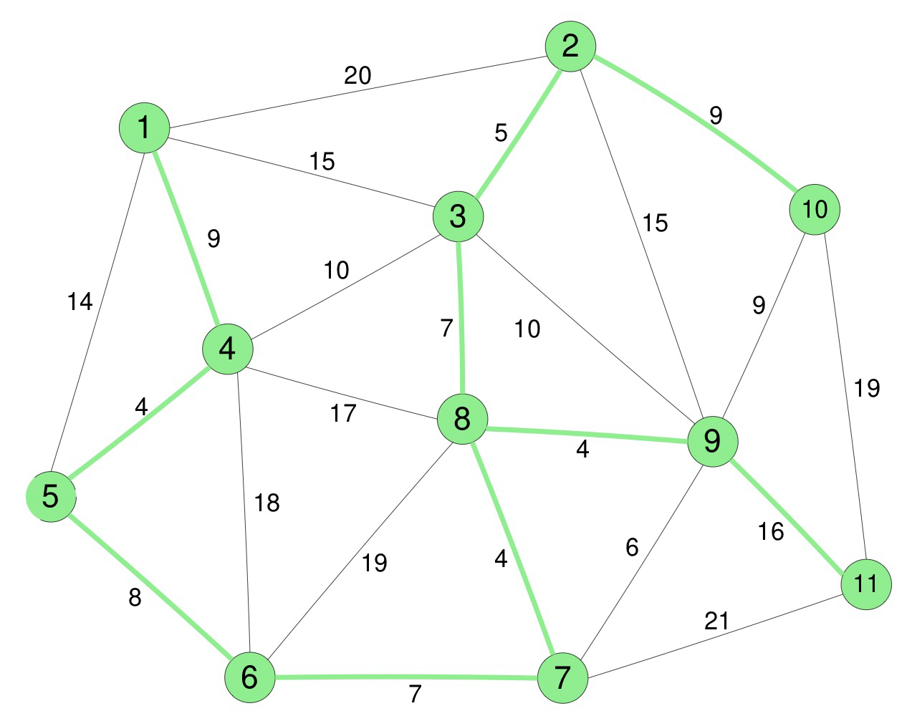

# Kruskal's Algorithm

# Optimality Check

Without applying any one of Prim's and Kruskal's algorithms, verify whether the following spanning tree is of minimum cost.

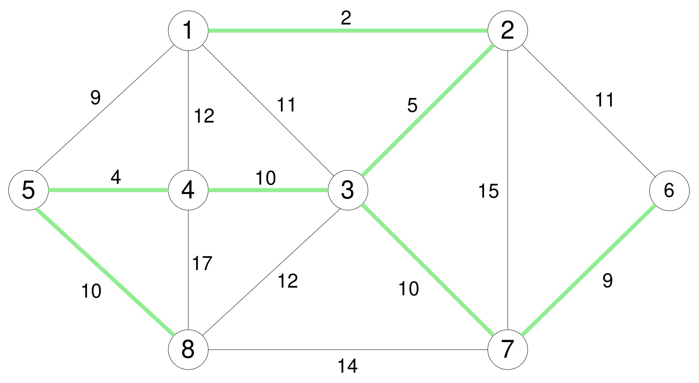

------

It suffices to verify that there exists a cost-decreasing edge. ==By inspection, we observe that, by adding edge {1,5} to the tree, the cycle ⟨1, 5, 4, 3, 2, 1⟩ is introduced. In such a cycle, edge {4,3} has a strictly larger cost than {1,5}==

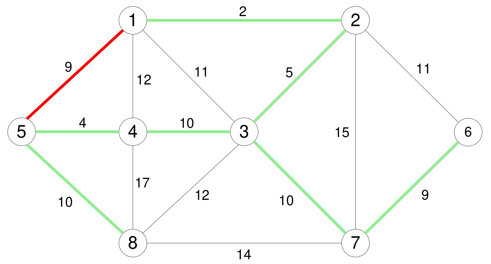

Therefore, by removing edge {4,3} and adding edge {1,5}, a spanning tree of strictly smaller total cost is obtained. It is shown in the following figure.

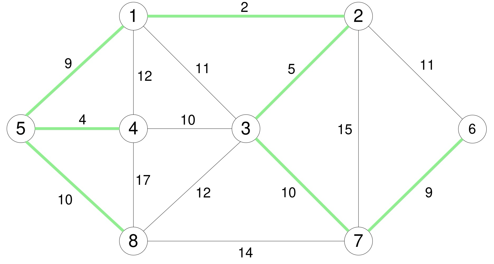

# Compact Storage of Similar Sequences

Consider the problem of storing a large set of strings, i.e., sequences of characters from a finite alphabet. We assume that the strings have many similar entries (they differ only in a small number of positions) and we wish to store them in a compact way. This problem arises in several contexts such as when storing DNA sequences, where the characters correspond to the four DNA bases. In this exercise, we consider the simplified version of the problem with only two characters.

Given a set of $k$ sequences of $M$ bits, we compute for each pair $i, j$, with $1 \leq i, j \leq k$, the Hamming distance between the sequences $i$ and $j$, i.e., the number of bits that need to be flipped in sequence $i$ to obtain sequence $j$. This function clearly satisfies the three usual properties of a distance: nonnegativity, symmetry, and triangle inequality.

Consider the following set of 6 sequences and the corresponding matrix $D = \{d_{ij}\}$ of Hamming distances.

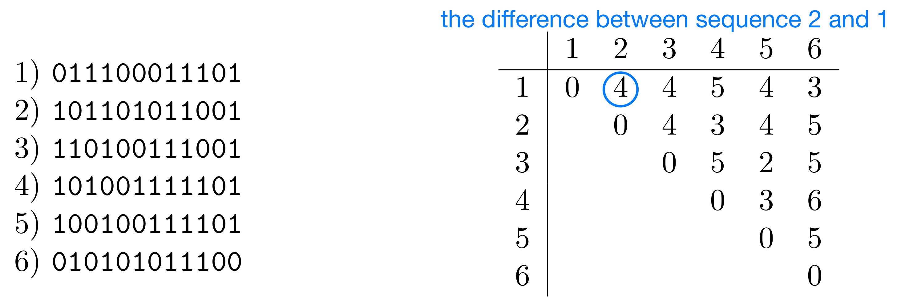

* where, due to symmetry, only the upper triangle of the matrix is shown

In order to exploit redundancies between sequences and to save memory, we can store: 
1. One of the sequences, called the reference sequence, completely, and 
2. For every other sequence, only the set of bit flips that allow us to retrieve it either directly from the reference sequence or from another sequence.

Show how the problem of deciding which differences to memorize, so as to minimize the total number of bits used for storage, can be reduced to the problem of finding a minimum-cost spanning tree in an appropriate graph. Solve the problem for the given instance.

**Hint:** Given any two sequences (the $i$-th one and $j$-th one), how many bits are needed to store the positions in which they differ?

------

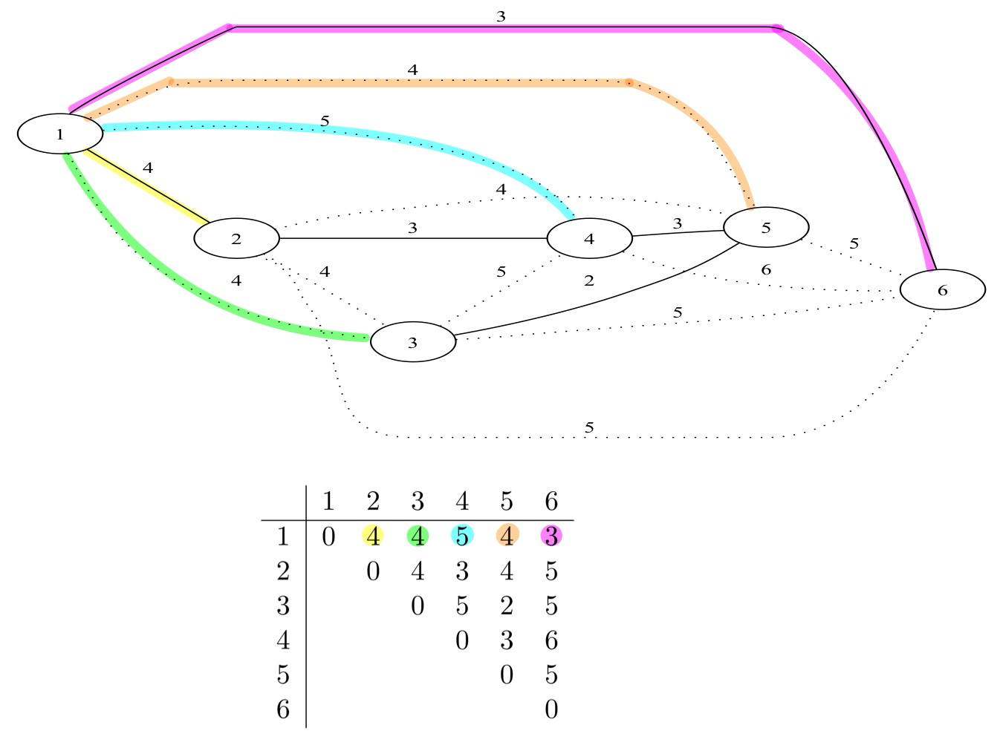

# Shortest Paths with Nonnegative Costs

Given the following directed graph, find a set of shortest paths from node 0 to all the other nodes, using Dijkstra’s algorithm. Can we solve the problem with Dynamic Programming? If yes, do so.

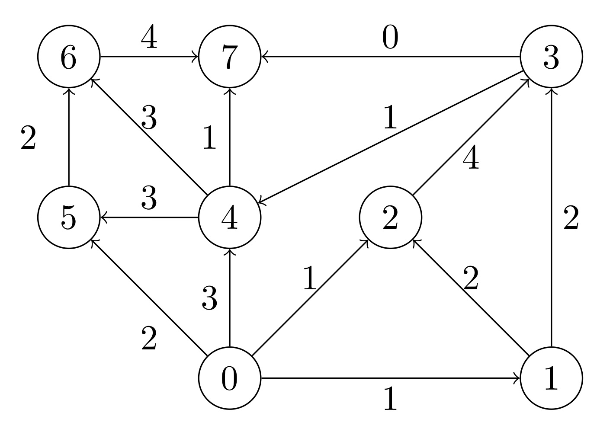

------

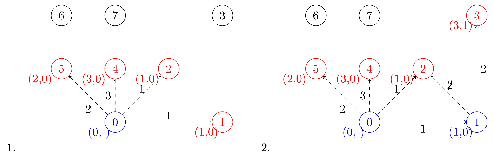

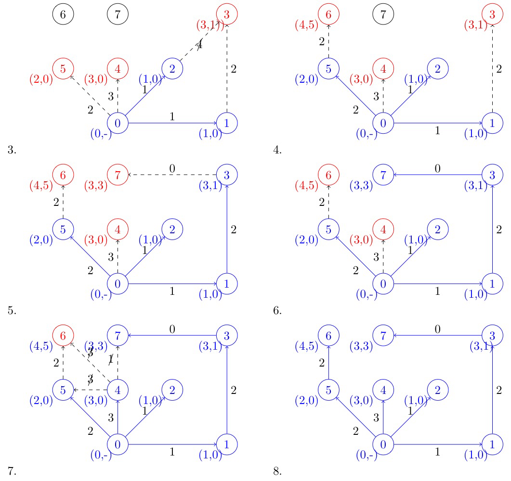

==**Dynamic Programming? Graph must be asyclic topological order**==

- $L(0) = 0, \, p(0) = 0$;
- $L(1) = L(0) + c_{01} = 1, \, p(1) = 0$;
- $L(2) = \min\{L(0) + c_{02}, L(1) + c_{12}\} = \min\{0 + 1, 1 + 2\} = 1, \, p(2) = 0$;
- $L(3) = \min\{L(1) + c_{13}, L(2) + c_{23}\} = \min\{1 + 2, 1 + 4\} = 3, \, p(3) = 1$;
- $L(4) = \min\{L(0) + c_{04}, L(3) + c_{34}\} = \min\{0 + 3, 3 + 1\} = 3, \, p(4) = 0$;
- $L(5) = \min\{L(0) + c_{05}, L(4) + c_{45}\} = \min\{0 + 2, 3 + 3\} = 2, \, p(5) = 0$.

- $L(6) = \min\{L(4) + c_{46}, L(5) + c_{56}\} = \min\{3 + 3, 2 + 2\} = 4, \, p(6) = 5$;
- $L(7) = \min\{L(3) + c_{37}, L(4) + c_{47}, L(6) + c_{67}\} = \min\{3 + 0, 3 + 1, 4 + 4\} = 3, \, p(7) = 3$.

# Shortest Paths with Negative Costs & Ill-posedness

Given the following directed graph, find the shortest paths between all pairs of nodes, or show that the problem is ill-posed by exhibiting a circuit of total negative cost.

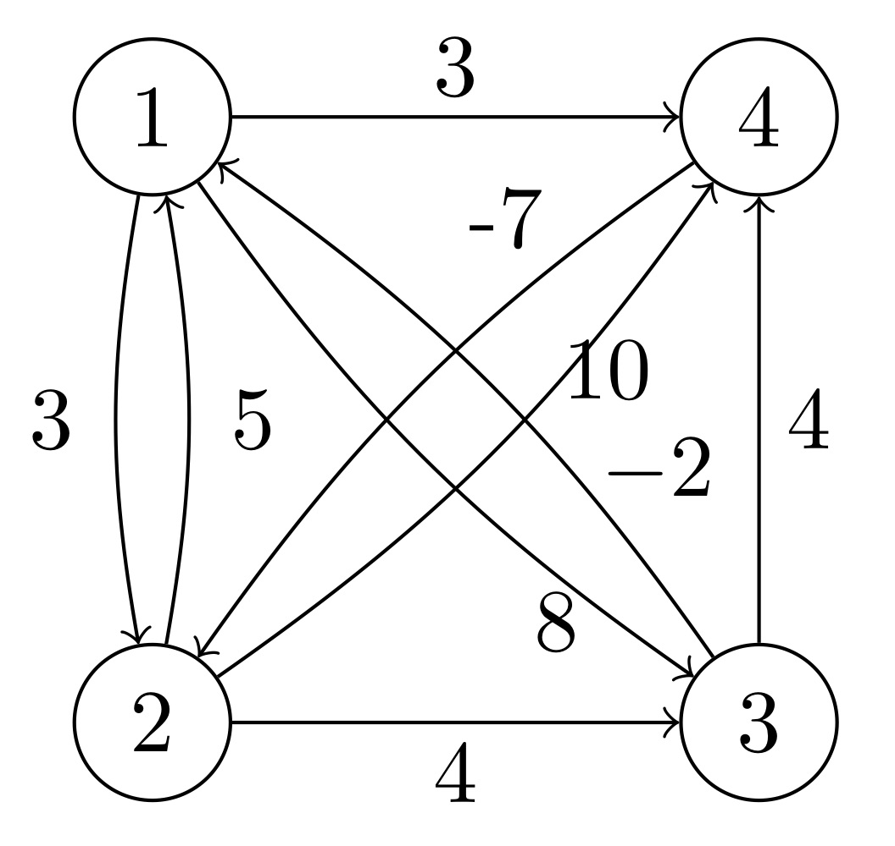

-------

==Since the graph contains negative arc costs, we use **Floyd-Warshall's algorithm** that finds a shortest path between each pair of nodes, or establishes that the problem is ill-posed by exhibiting a circuit of negative cost.== The graph can contain cycles, but such cycles must be of nonnegative cost. It has complexity $O(n^3)$, where $n$ is the number of nodes in the graph.

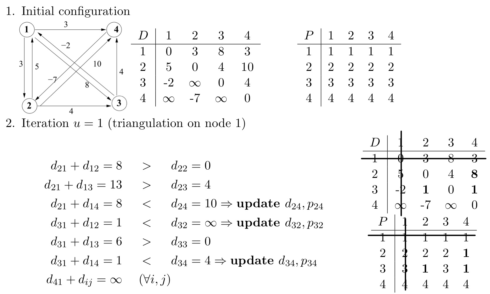

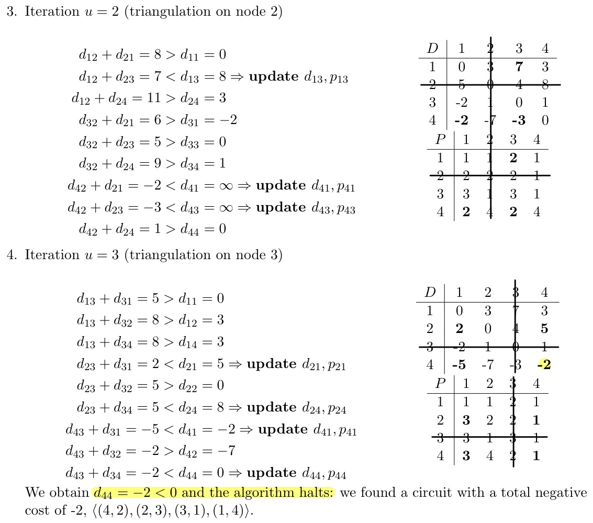

# An Application of Dynamic Programming to Machine Renewal

A company must buy a new machine and then determine a renewal (maintenance-replacement) plan for the next 5 years, making sure that, at any point in time, the available machine works properly. At the beginning of each year of the planning horizon, the company must decide whether to keep the old machine or to substitute it with a new machine.

The maintenance costs and the expected revenue (when the machine is sold) clearly depend on how old the machine is, and they are indicated in the following table:

| Years | Maintenance (kEuro) | Revenue When Sold (kEuro) |
| ----- | ------------------- | ------------------------- |
| 0     | 2                   | -                         |
| 1     | 4                   | 7                         |
| 2     | 5                   | 6                         |
| 3     | 9                   | 2                         |
| 4     | 12                  | 1                         |

To avoid high maintenance costs of an old machine, the machine can be sold at the beginning of the second, third, fourth, and fifth year, and a new one can be bought. For the sake of simplicity, we suppose that a **new machine always costs 12K Euro**.

Show that the problem of determining a machine renewal plan of minimum total net cost (total cost for buying/rebuying the machine + maintenance costs - total revenue) can be solved via Dynamic Programming by finding a shortest path in an ad hoc directed acyclic graph. Find an optimal renewal plan. Is it unique?

------

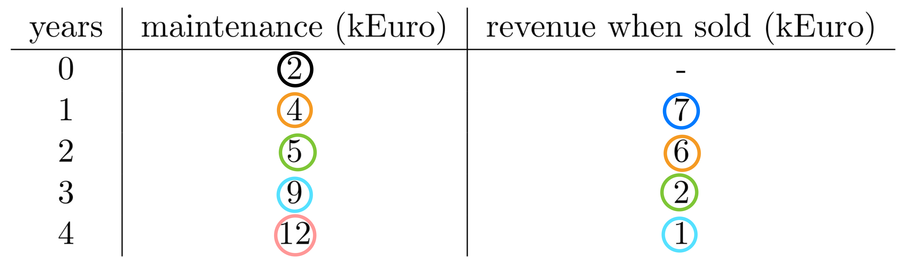

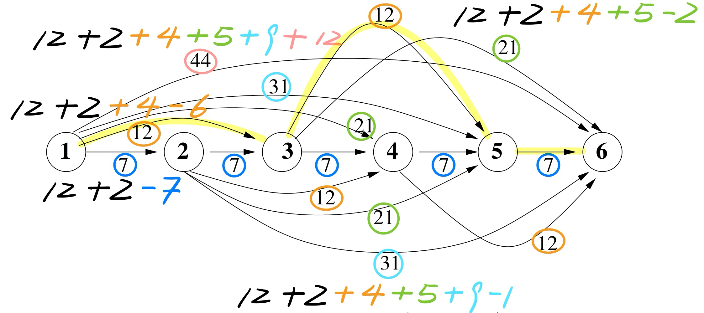

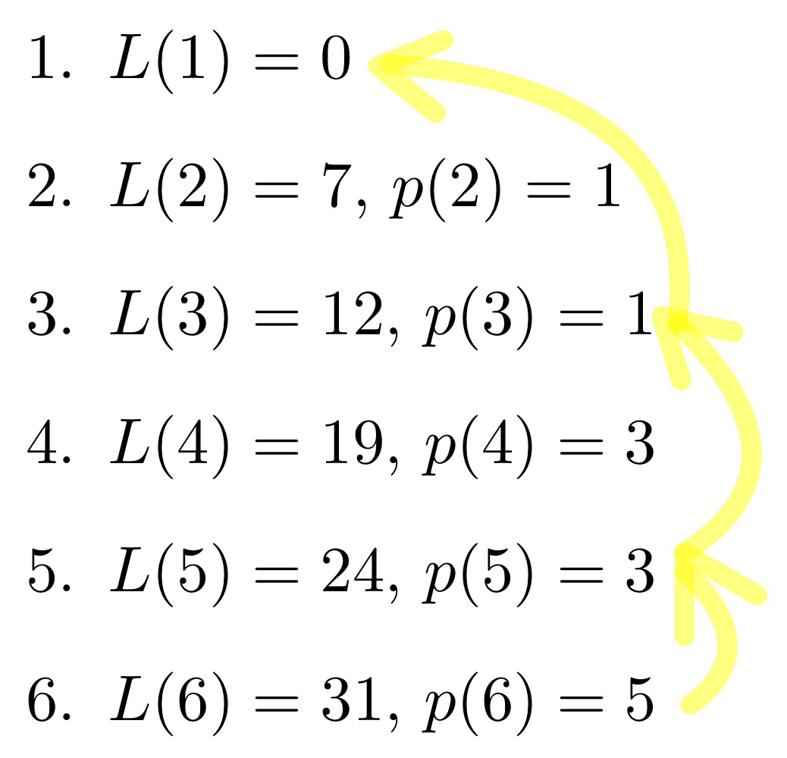

==A shortest path (of cost 31) is $⟨(1,3), (3,5), (5,6)⟩$==. It amounts to buying a new machine every 2 years. Note that there are two other optimal solutions: path $⟨(1,2), (2,4), (4,6)⟩$ and path $⟨(1,3), (3,4), (4,6)⟩$.

# Project Planning

The preparation of the apple pie has long been a tradition at Rossi’s family. First the weight of the ingredients has to be determined: flour, sugar, butter, eggs, apples, cream. The butter must then be melted down, and added to a mixture of flour, sugar, and eggs. Apples must be added to this new mixture, once they have been peeled and cut into thin slices. The mixture can then be cooked, in the already heated oven. It is advisable to whip the cream only after the apple slices have been added to the mixture. Once the cake is cooked, the cream is used to garnish it.

The following table reports the time needed for each activity.

| Activity | Description                              | Time (minutes) |
| -------- | ---------------------------------------- | -------------- |
| A        | Weigh the ingredients                    | 5              |
| B        | Melt the butter                          | 3              |
| C        | Mix flour, eggs and sugar                | 5              |
| D        | Peel the apples and cut them into slices | 10             |
| E        | Heat the oven                            | 20             |
| F        | Add butter to the mixture                | 8              |
| G        | Add apples to the mixture                | 4              |
| H        | Cook the mixture in the oven             | 40             |
| I        | Whip the cream                           | 10             |
| L        | Garnish                                  | 5              |

Draw the graph (with activities associated to arcs) which represents the project precedence relations. Determine the minimum total completion time of the project as well as the earliest times and latest times associated to each node. Identify the critical activities and draw Gantt’s chart at earliest.

------

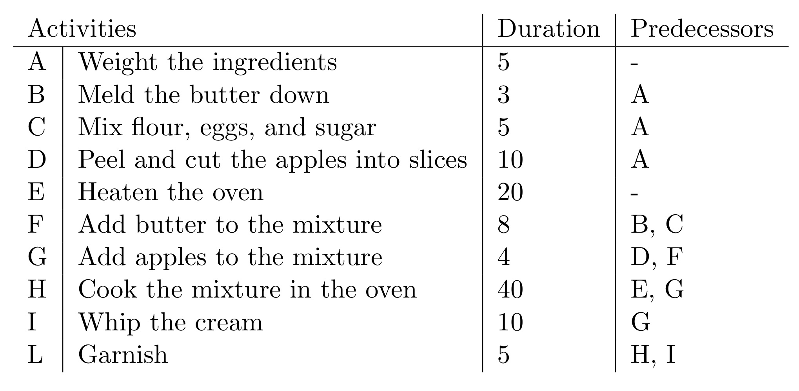

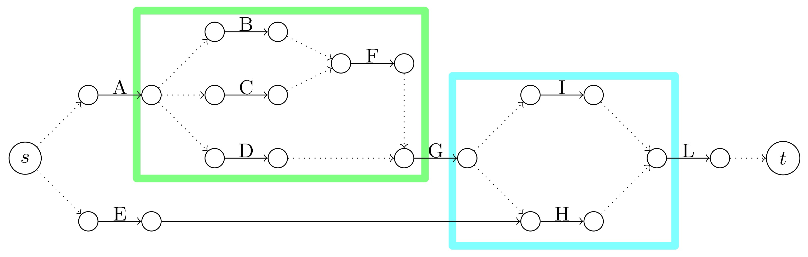

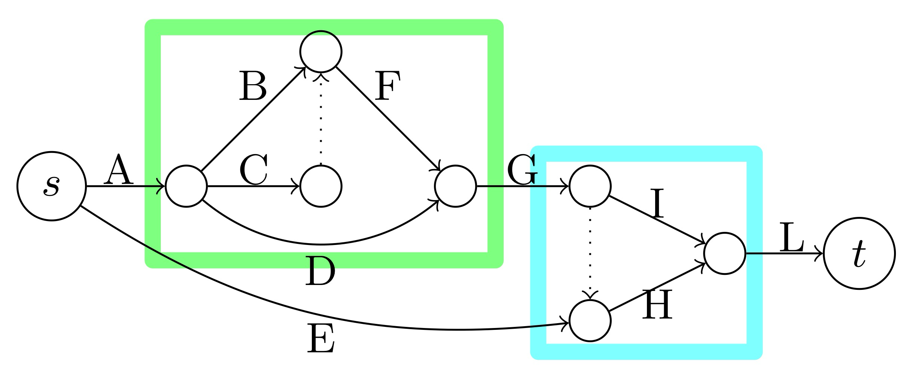

After ordering topologically the nodes, we obtain the following earliest times and latest times:

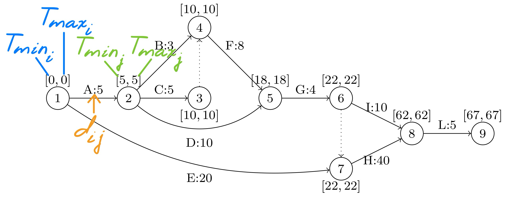

which are summarised in the following table:

| Activity (i,j) | $T_{\text{min}_i}$ | $T_{\text{max}_j}$ | Slack |
| -------------- | ------------------ | ------------------ | ----- |
| A              | 0                  | 5                  | 0     |
| B              | 5                  | 10                 | 2     |
| C              | 5                  | 10                 | 0     |
| D              | 5                  | 18                 | 3     |
| E              | 0                  | 22                 | 2     |
| F              | 10                 | 18                 | 0     |
| G              | 18                 | 22                 | 0     |
| H              | 22                 | 62                 | 0     |
| I              | 22                 | 62                 | 30    |
| L              | 62                 | 67                 | 0     |

**Note**: $T_{min_i} = T_{max_i}$ and $T_{min_j} = T_{max_j}$ do not suffice to have $\sigma_{ij} = T_{max_j} - T_{min_i} - d_{ij} = 0$ !

The **slacks** for the activities are:

* $\sigma(A) = T_{\text{max}_2} - T_{\text{min}_1} - d_{12} = 5 - 0 - 5 = 0$

* $\sigma(B) = T_{\text{max}_4} - T_{\text{min}_2} - d_{24} = 10 - 5 - 3 = 2$

* $\sigma(C) = T_{\text{max}_3} - T_{\text{min}_2} - d_{23} = 10 - 5 - 5 = 0$

* $\sigma(D) = T_{\text{max}_5} - T_{\text{min}_2} - d_{25} = 18 - 5 - 10 = 3$

* $\sigma(E) = T_{\text{max}_6} - T_{\text{min}_1} - d_{16} = 22 - 0 - 20 = 2$

* $\sigma(F) = T_{\text{max}_5} - T_{\text{min}_4} - d_{45} = 18 - 10 - 8 = 0$

* $\sigma(G) = T_{\text{max}_6} - T_{\text{min}_5} - d_{56} = 22 - 18 - 4 = 0$

* $\sigma(H) = T_{\text{max}_8} - T_{\text{min}_7} - d_{78} = 62 - 22 - 40 = 0$

* $\sigma(I) = T_{\text{max}_8} - T_{\text{min}_6} - d_{68} = 62 - 22 - 10 = 30$

* $\sigma(L) = T_{\text{max}_9} - T_{\text{min}_8} - d_{89} = 67 - 62 - 5 = 0$

The critical activities are $A$, $C$, $F$, $G$, $H$, $L$

The Gantt chart at earliest (where each activity $(i, j)$ starts at the earliest time $T_{\text{min}_i}$):

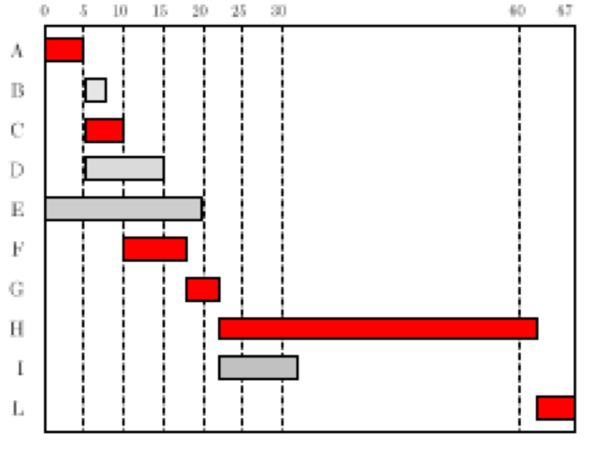

# Shortest Paths with Negative Costs

Given the following directed graph, find the shortest paths between all pairs of nodes, or show that the problem is ill-posed, by exhibiting a circuit of total negative cost.

------

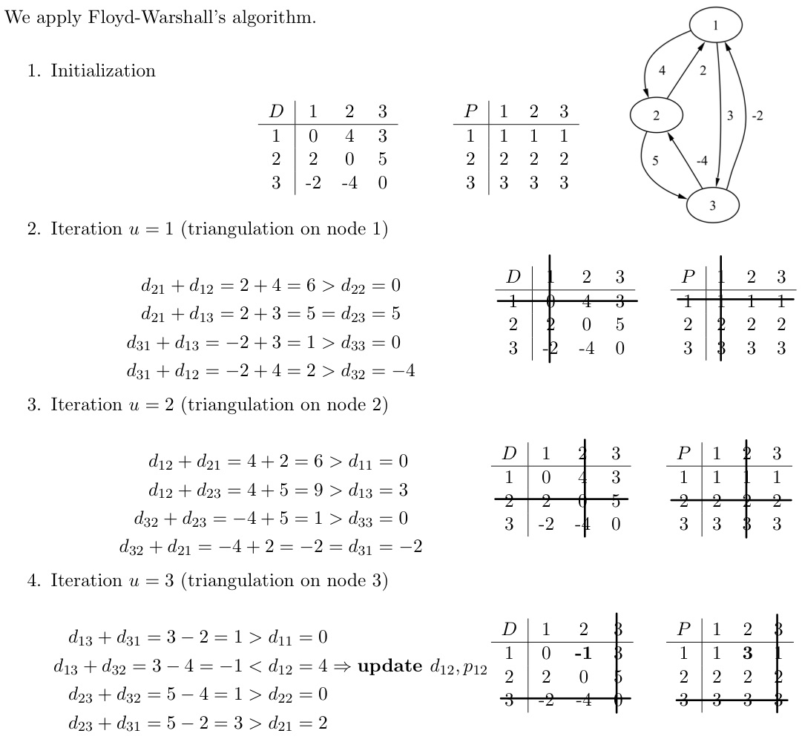

# Maximum Flow with a Strictly Positive Initial Feasible Flow

Given the following network with capacities on the arcs

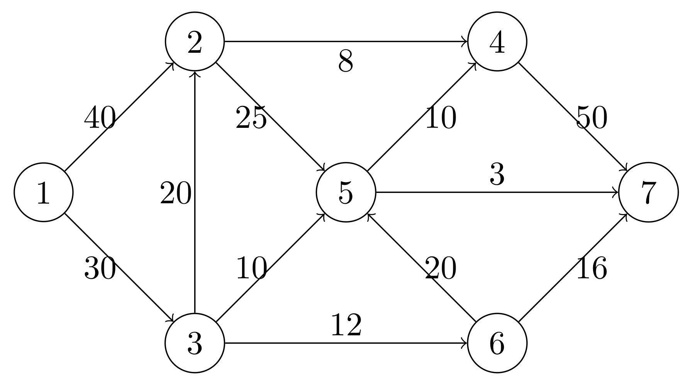

Find a maximum flow from node 1 to node 7, starting from the feasible flow of value 21 in which $x_{12} = 11$, $x_{13} = x_{36} = x_{65} = 10$, $x_{24} = 8$, $x_{25} = x_{57} = 3$, $x_{47} = 18$, and $x_{ij} = 0$ for the remaining arcs. Determine a corresponding minimum cut.

-------

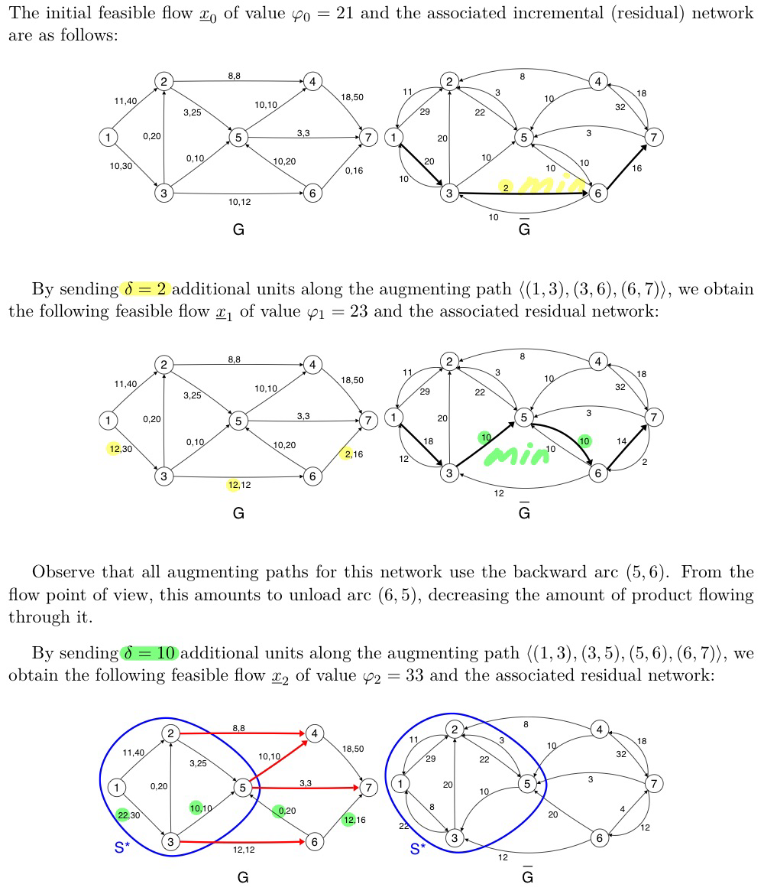

No other augmenting path exists. The set $S^* = \{1, 2, 3, 5\}$, highlighted in blue, contains all the nodes that can be reached in $\overline{G}$ from the source 1. $S^*$ induces in the network $G$ the cut $\delta_G(S^*)$ of minimum total capacity $k(S^*) = 33$ which is highlighted in red. Note that, according to strong duality, the value $\varphi_2 = 33$ of the feasible flow $x_2$ is equal to the total capacity $k(S^*)$ of the cut $\delta_G(S^*) = \{(2,4), (3,6), (5,4), (5,7)\}$ induced by $S^*$.

# Maximum Flow & Minimum Cut

Given the following network with capacities on the arcs

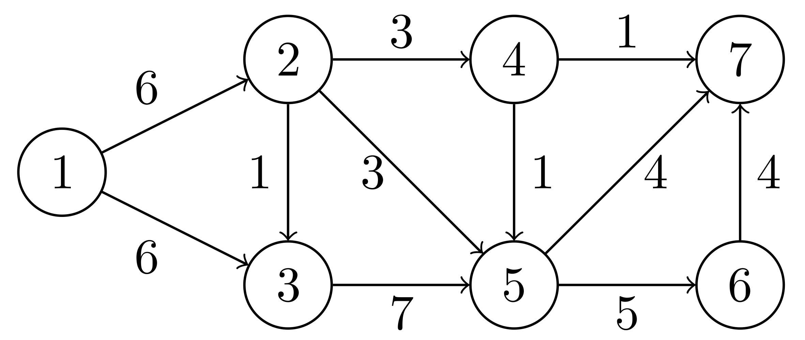

find a maximum (feasible) flow from node 1 to node 7, and determine a corresponding minimum (capacity) cut.

------

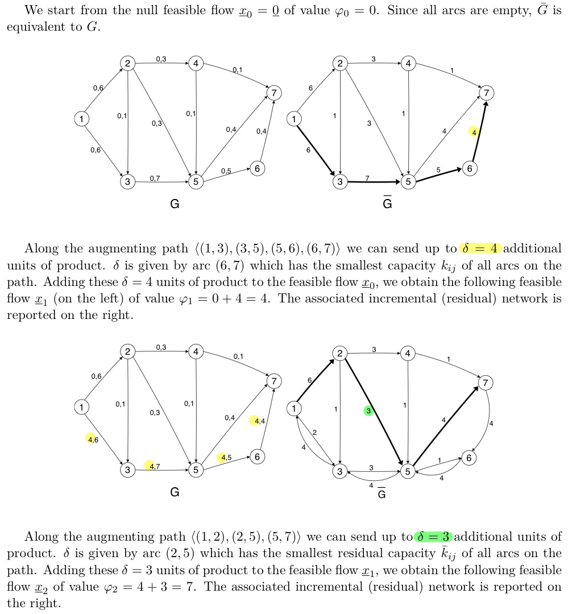

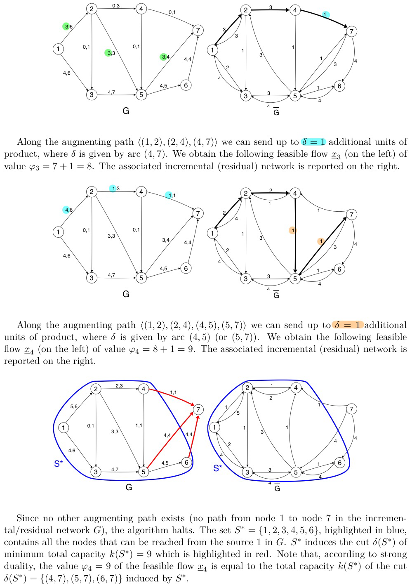

# Maximum Flow with Node Capacities

In maximum flow problems, how can we deal with capacities on both nodes and arcs? Find a maximum flow from node 1 to node 7 in the network of the previous exercise, with a node capacity of 2 on node 6.

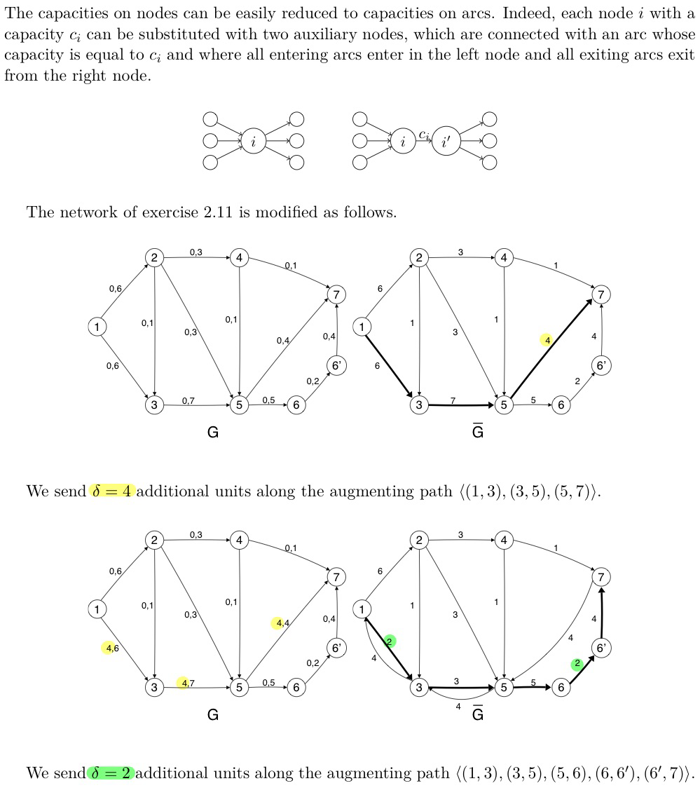

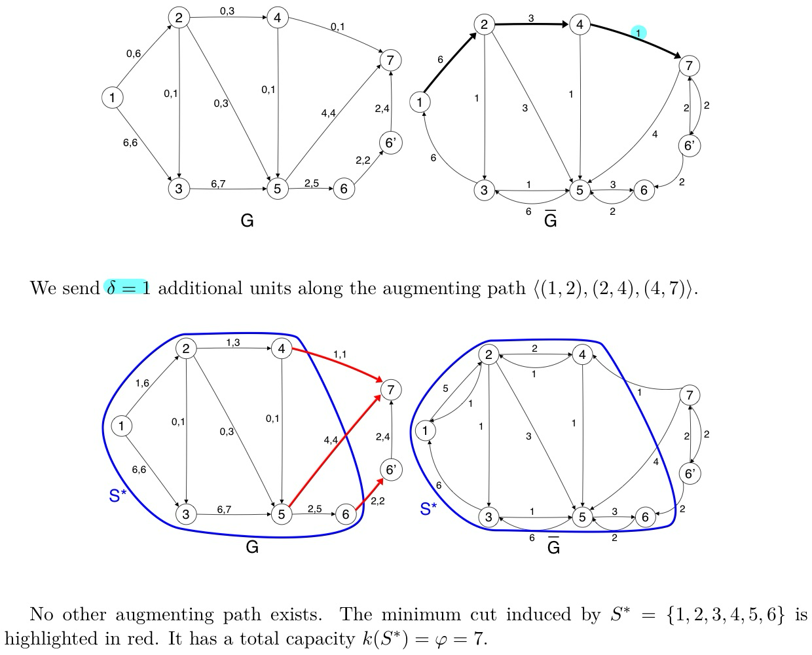

# Indirect Application of Maximum Flows

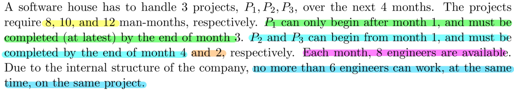

Determine whether it is possible to complete the three projects within the time constraints and, if it is possible, find a feasible workforce plan. Describe how this problem can be reduced to the problem of finding a maximum flow in an appropriate network.

*[Hint: Look for a feasible flow of value 30.]*

------

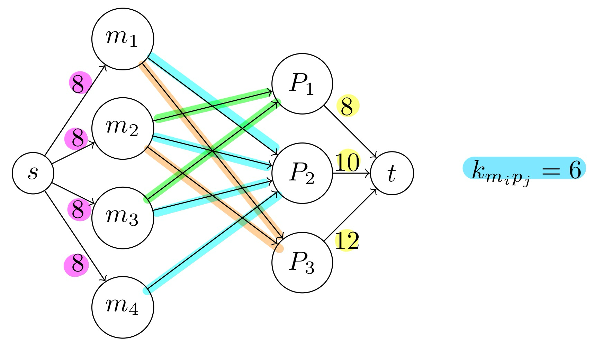

A feasible flow of maximum value 30 can be found by applying the Ford-Fulkerson algorithm. We can start from the feasible flow $\underline{x}_0 = 0$ of value $\varphi_0 = 0$ and use the following augmenting paths:

- $\langle (s, m_3), (m_3, P_1), (P_1, t) \rangle$ with $\delta = 6$, yielding a feasible flow of value $\varphi_1 = 6$,
- $\langle (s, m_2), (m_2, P_1), (P_1, t) \rangle$ with $\delta = 2$, yielding a feasible flow of value $\varphi_2 = 8$,
- $\langle (s, m_1), (m_1, P_3), (P_3, t) \rangle$ with $\delta = 6$, yielding a feasible flow of value $\varphi_3 = 14$,
- $\langle (s, m_2), (m_2, P_3), (P_3, t) \rangle$ with $\delta = 6$, yielding a feasible flow of value $\varphi_4 = 20$,
- $\langle (s, m_4), (m_4, P_2), (P_2, t) \rangle$ with $\delta = 6$, yielding a feasible flow of value $\varphi_5 = 26$.
- $\langle (s, m_3), (m_1, P_2), (P_2, t) \rangle$ with $\delta = 2$, yielding a feasible flow of value $\varphi_6 = 28$,
- $\langle (s, m_3), (m_3, P_2), (P_2, t) \rangle$ with $\delta = 2$, yielding a feasible flow of value $\varphi_7 = 30$.

The resulting feasible flow $\underline{x}_7$ of value $\varphi_7 = 30$ is as follows:

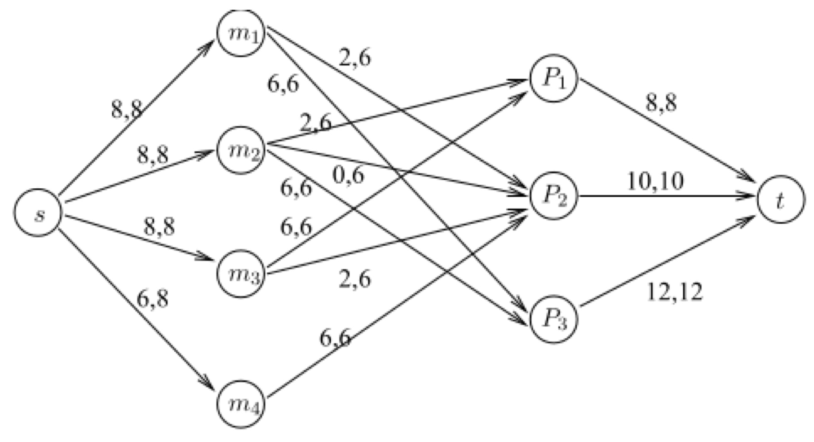

and the associated residual network $\overline{G}_7$ is

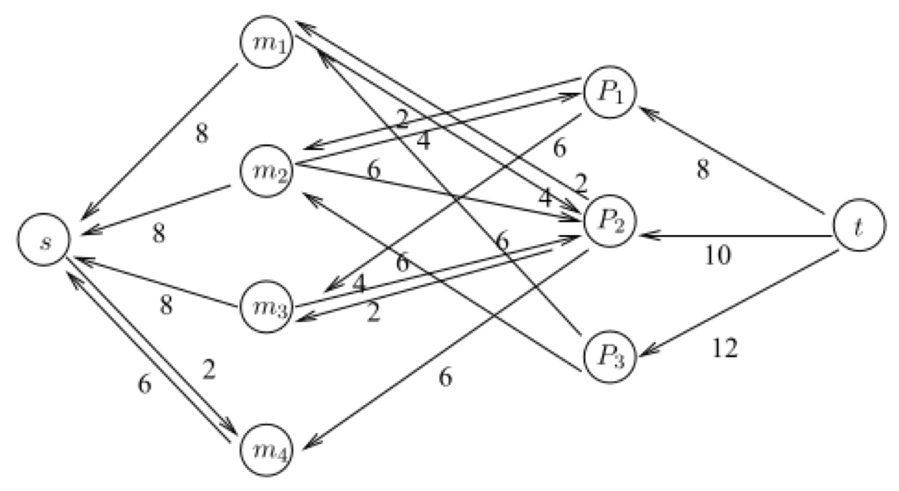
