Consider the problem

$$
\begin{aligned}
\min & \quad \underline{c}^T \underline{x} \\
\text{s.t.} & \quad A\underline{x} \geq \underline{b} \\
& \quad \underline{x} \geq \underline{0}
\end{aligned}
\notag
$$

where

$$
\underline{x} = \begin{pmatrix} x_1 \\ x_2 \end{pmatrix}, \quad
\underline{c} = \begin{pmatrix} 16 \\ 25 \end{pmatrix}, \quad
\underline{b} = \begin{pmatrix} 4 \\ 5 \\ 9 \end{pmatrix}, \quad
A = \begin{pmatrix} 
1 & 7 \\ 
1 & 5 \\ 
2 & 3 
\end{pmatrix}
\notag
$$

1. Solve the problem graphically and determine the basic and nonbasic variables of the optimal solution.

------

  The equations associated with the system $Ax \geq b$ are

$$
  x_1 + 7x_2 = 4
  \tag{4}
$$

$$
  x_1 + 5x_2 = 5
  \tag{5}
$$

$$
  2x_1 + 3x_2 = 9
  \tag{6}
$$

  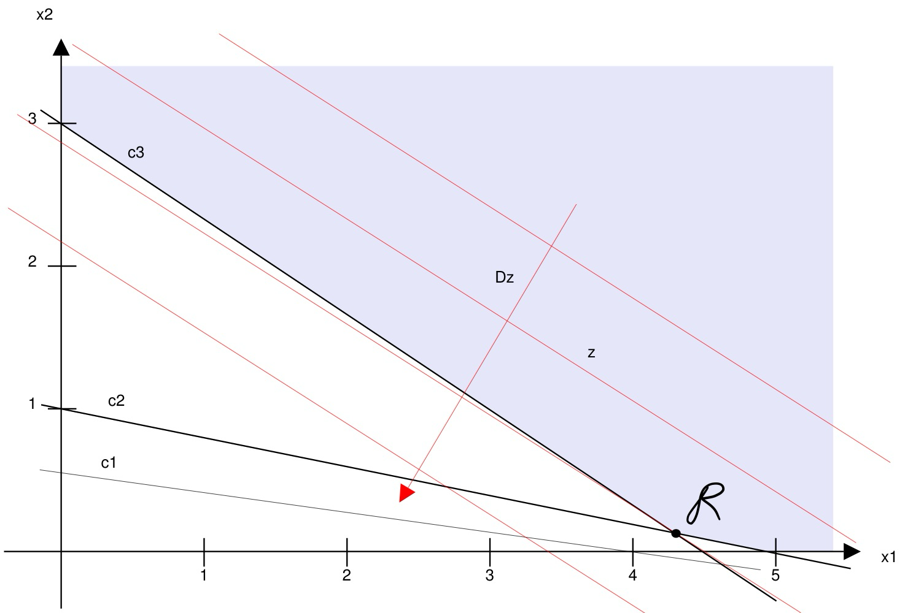

  We observe that vertex $R$ is the unique optimal solution. Since vertex $R$ is the intersection of equations (5) and (6), we determine it by solving:

$$
  x_1 + 5x_2 = 5 \\
  2x_1 + 3x_2 = 9
  \notag
$$

  obtaining $x_1 = \frac{30}{7}, x_2 = \frac{1}{7}$.

------

2. Put the problem in standard form with respect to the optimal basis (identify $B$, $N$, and the corresponding partition of the cost vector).

	------

	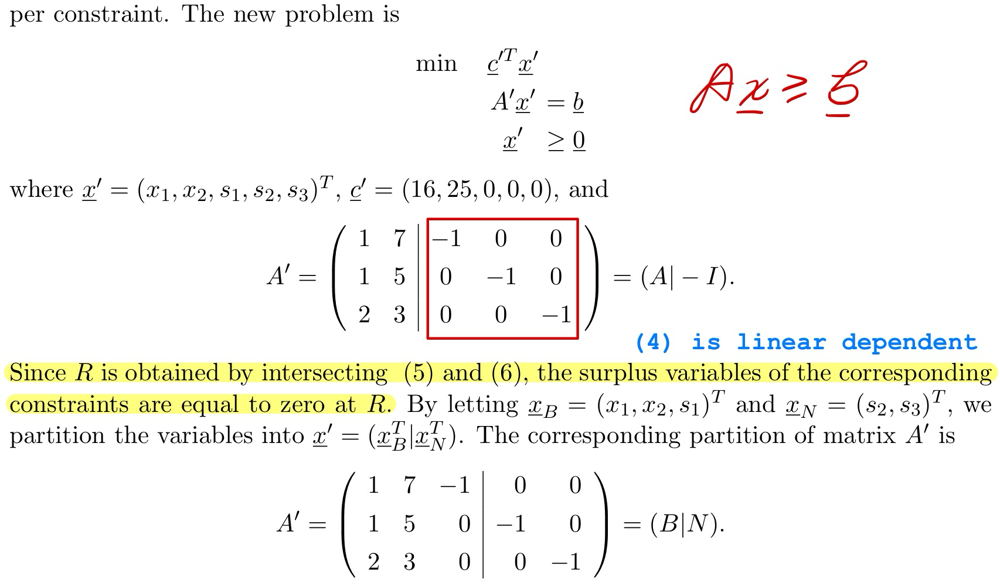

	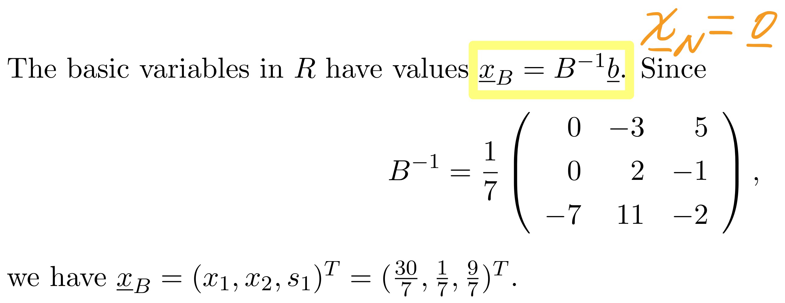

# Geometry of Linear Programming 

Consider the linear program:

$$
\begin{aligned}
	\text{max} \quad & 3x_1 + 2x_2 \\
	\text{s.t. } \quad
    & 2x_1 + x_2 \leq 4 & (1)\\
    & -2x_1 + x_2 \leq 2 & (2) \\
    & x_1 - x_2 \leq 1 & (3) \\
    & x_1, x_2 \geq 0 
\end{aligned}
\notag
$$

1. Solve it graphically and indicate the optimal solution and the corresponding objective function value.

  ------

  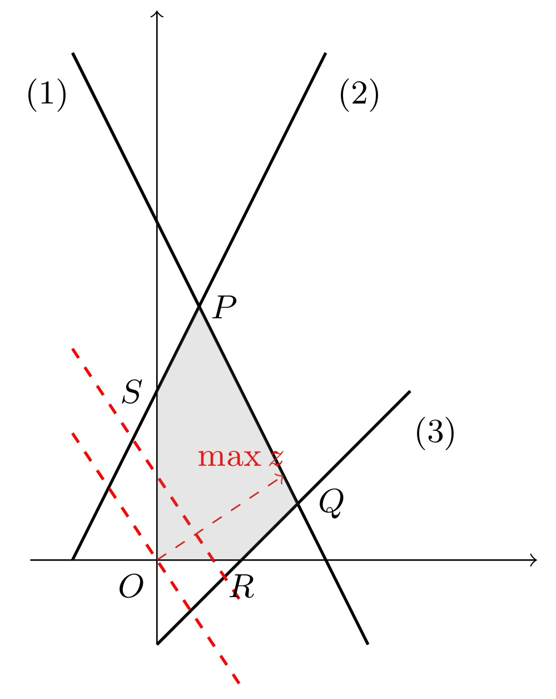

  The unique optimal solution is achieved at vertex $P = (\frac{1}{2}, 3)$, where $z^* = \frac{15}{2}$

  ------

2. Determine the basic feasible solutions (specifying the basic and nonbasic variables) corresponding to all vertices of the feasible region (polyhedron).

  ------

  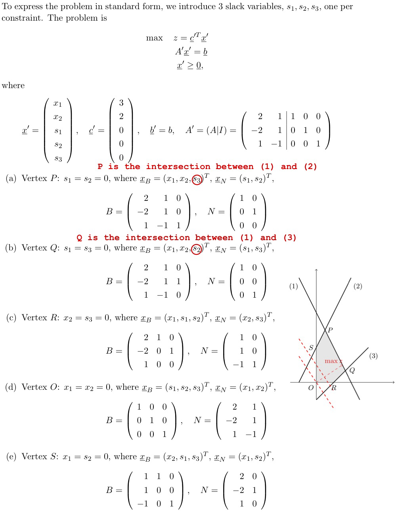

  ------

3. Indicate the sequence of basic feasible solutions that are visited by the simplex algorithm (let $x_1$ be the first variable to enter the basis) when starting from the initial basic feasible solution in which all slack variables are basic variables.

  ------

  Consider as initial basic feasible solution the one where the slack variables are basic variables, i.e., $x_B = (s_1, s_2, s_3)^T$. The non-basic variables are $x_N = (x_1, x_2)^T$. This basic feasible solution corresponds to vertex $O$ (the origin). 

  Assuming that $x_1$ becomes basic, we are increasing the value of $x_1$, i.e., we are moving on segment $O - R$. Variables $s_1$ and $s_3$ decrease as $x_1$ increases. The first one to become $0$ is $s_3$. We reach vertex $R$, where $x_B = (x_1, s_1, s_2)^T$. 

  The next variable to become basic is $x_2$. We are moving on segment $R - Q$, and obtain the next solution in $Q$, where $x_B = (x_1, x_2, s_2)^T$. Then $s_3$ becomes basic and $s_2$ becomes non-basic, i.e., we move on segment $Q - P$, reaching the unique optimal vertex $P$, where $x_B = (x_1, x_2, s_3)^T$.

  ------

4. Determine the reduced costs for the basic feasible solutions associated with the vertices that result from the intersection of the equalities (eq. 1) and (eq. 2), or from the intersection of (eq. 1) and (eq. 3), where (eq. $i$) is obtained from $(i)$ by substituting $\leq$ with $=$.

  ------

  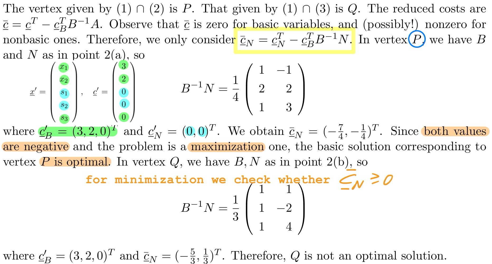

  ------

5. Show, geometrically, that the gradient of the objective function is a conic combination (i.e., a linear combination with nonnegative coefficients) of the gradients of the constraints which are active at an optimal vertex. Indicate the value taken by the objective function in that vertex.

  **Note**: All the constraints must be in $\leq$ form, since the problem is a maximization one (e.g., $x_1 \geq 0$ must be rewritten as $-x_1 \leq 0$).

  ------

  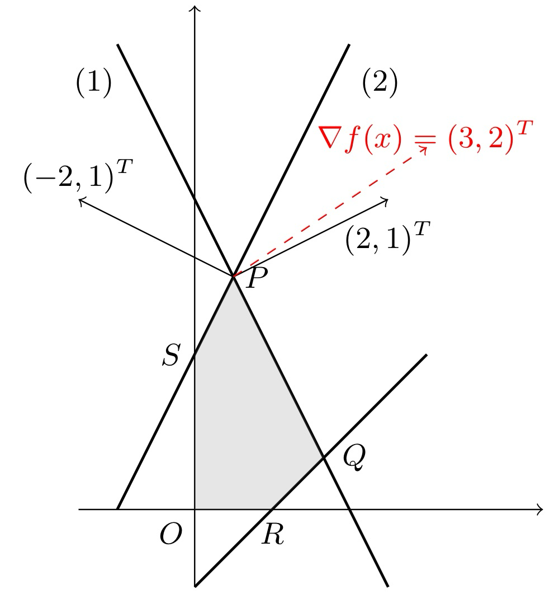

  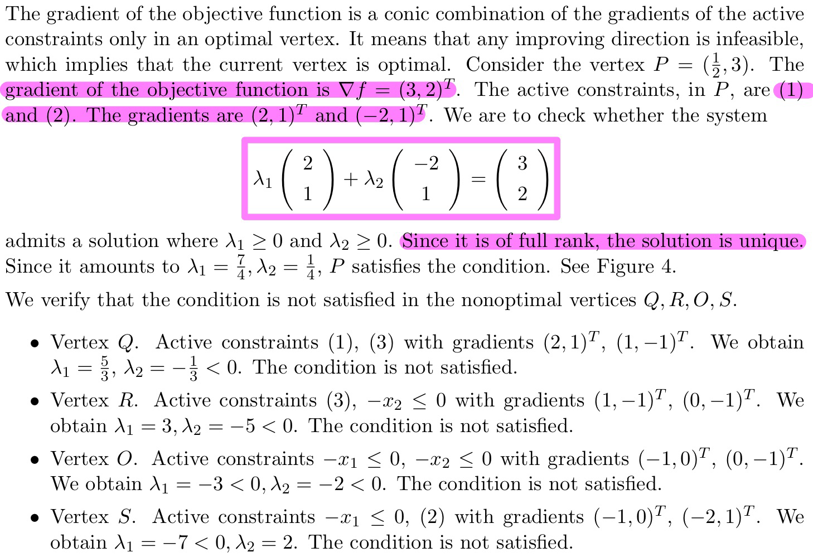

  ------

6. Determine the range of values for the right-hand side $b_1$ of constraint (1) for which the optimality of the basis solution is preserved.

7. Indicate for which values of the objective function coefficients the point resulting from the intersection of $x_1 = 0$ and (eq. 2) is an optimal vertex.

8. Determine the range of values for the right-hand side $b_2$ of constraint (2) for which the feasible region:
   * is empty;

   * contains a single point.

9. Indicate the range of values for $c_1$ for which there are multiple optimal solutions.

	------

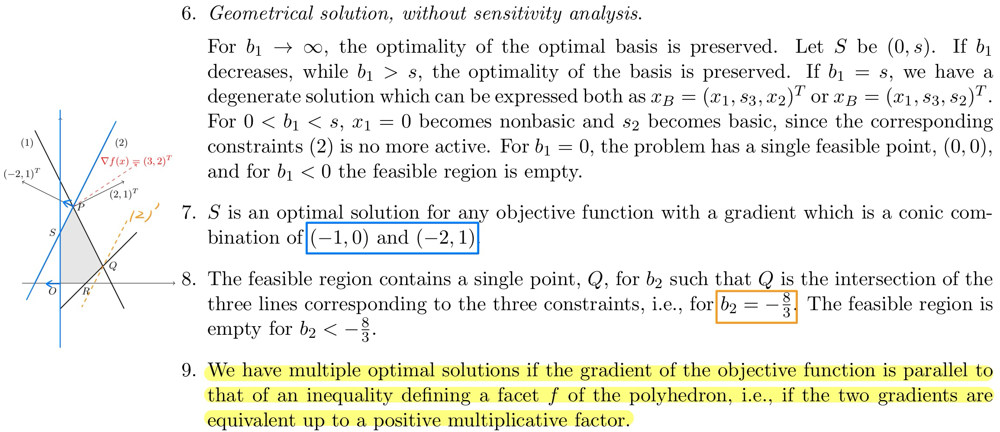

# Simplex Algorithm with Bland's Rule

Determine using the Simplex algorithm with Bland's rule the optimal solution to the following linear programming problem:

$$
\begin{aligned}
\text{max} \quad & x_1 + 3x_2 + 5x_3 + 2x_4 \\
\text{s.t. } \quad
& x_1 + 2x_2 + 3x_3 + x_4 \leq 3, \\
& 2x_1 + x_2 + x_3 + 2x_4 \leq 4, \\
& x_1, x_2, x_3, x_4 \geq 0.
\end{aligned}
\notag
$$

------

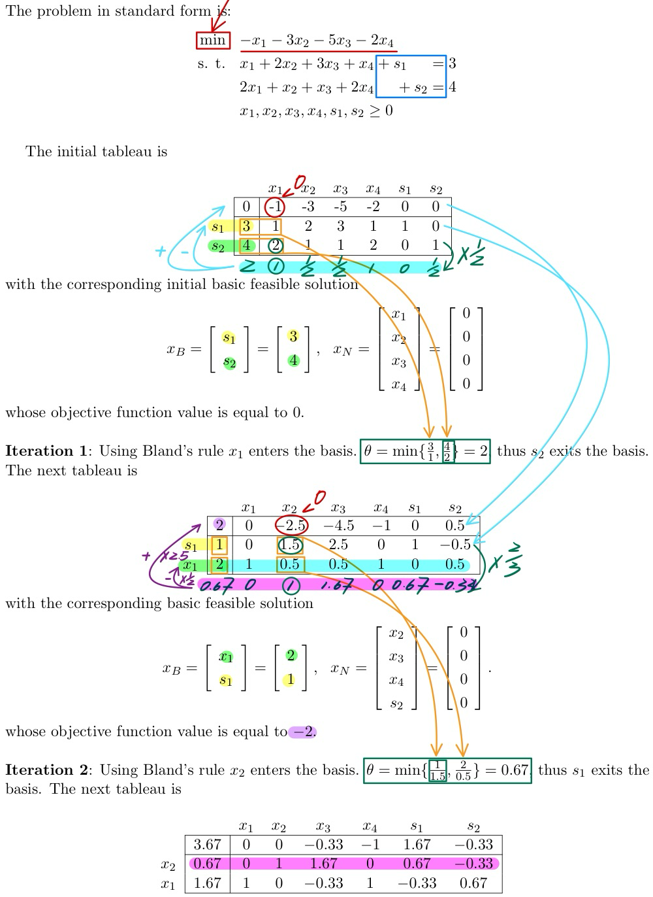

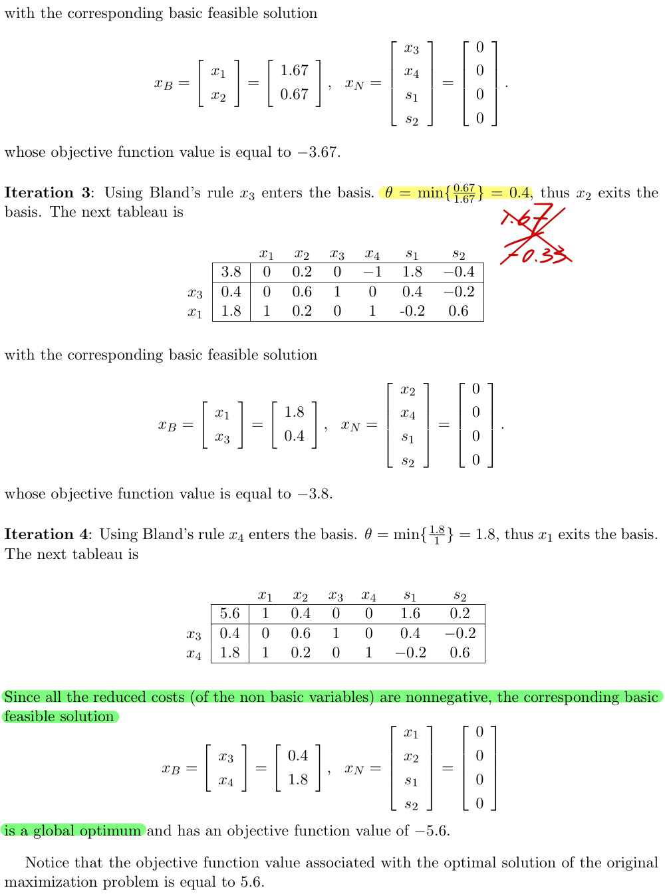

# Two-phase Simplex Algorithm with Bland's Rule

Solve the following linear program:

$$
\begin{aligned}
\text{min} \quad & x_1 - 2x_2 \\
\text{s.t.} \quad
& x_1 + 3x_3 \textcolor{red}{=} 1, \\
& 3x_1 + 2x_2 - x_3 \textcolor{red}{=} 5, \\
& x_1, x_2, x_3 \geq 0.
\end{aligned}
\notag
$$

by applying the two-phase Simplex algorithm with Bland's rule.

------

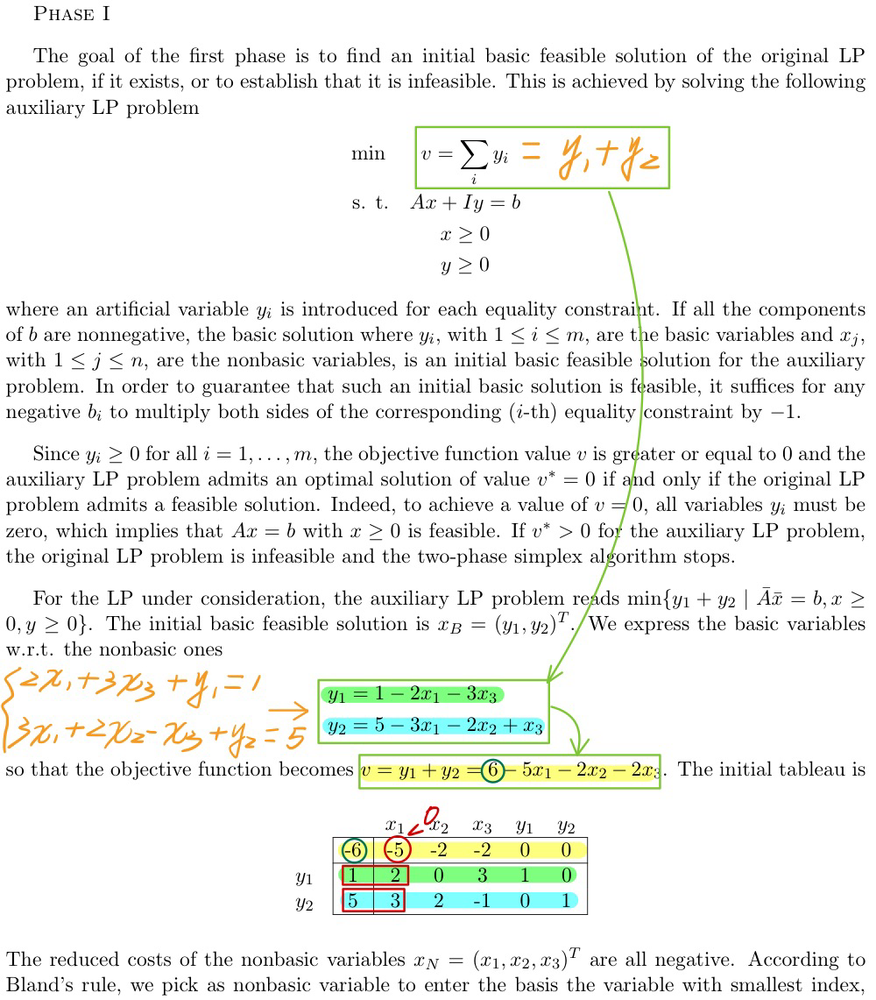

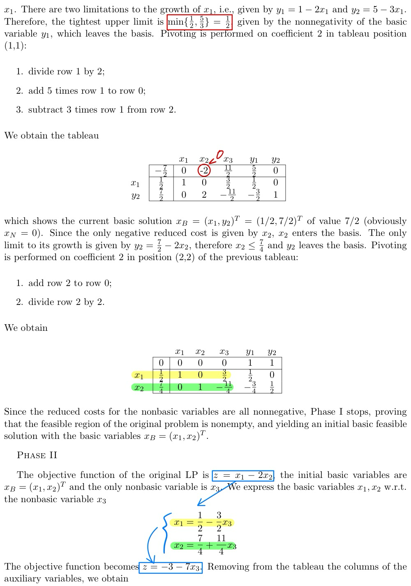

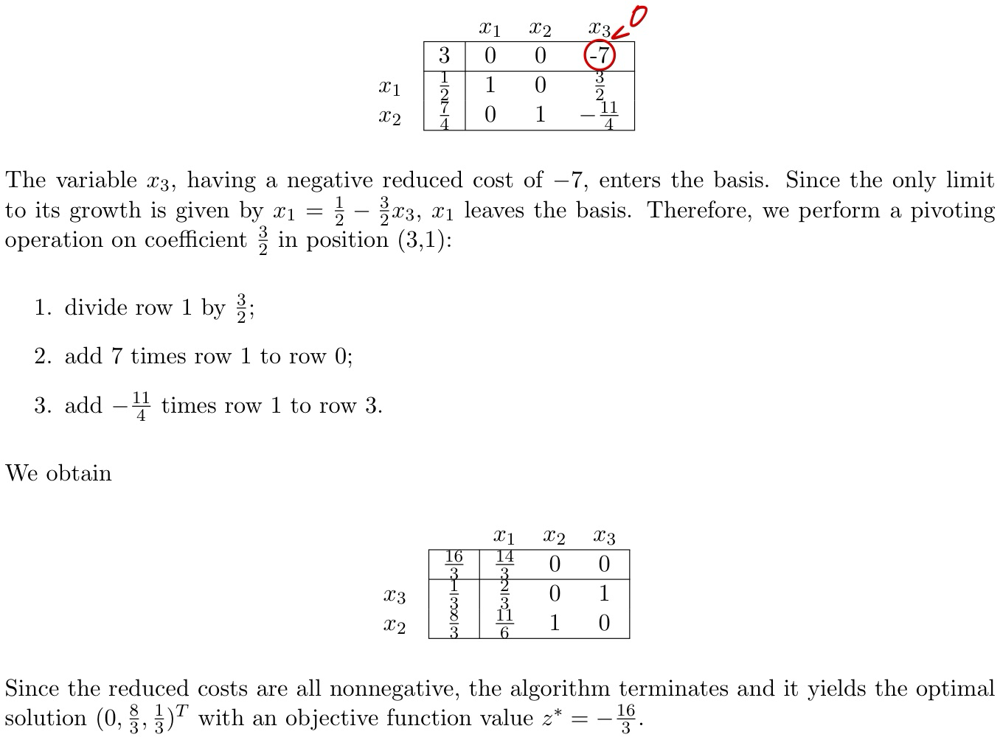

# Linear Programming Dual

Write the dual of the following linear program:

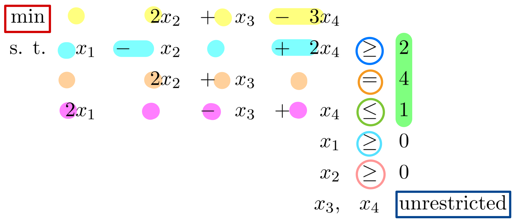

------

The dual of the given linear program is

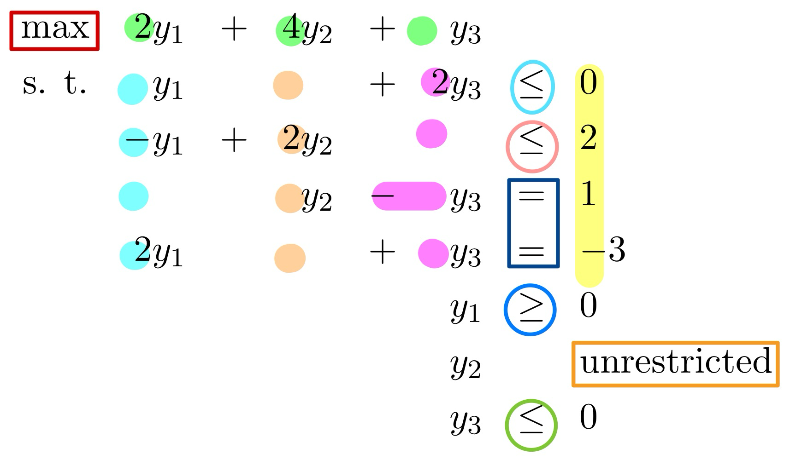

# Dual of the Transportation Problem and its Economic Interpretation

A company produces a single type of good in $m$ factories and stores it in $n$ warehouses. Suppose that the factory $i$ has a production capacity of $b_i$ units, and the warehouse $j$ requires $d_j$ units, with $i \in \{1, \dots, m\}, j \in \{1, \dots, n\}$. Let $c_{ij}$ be the unit transportation cost from factory $i$ to warehouse $j$.

Consider the problem of determining a transportation plan that minimizes the (transportation) costs, while satisfying the factory capacities and the warehouse demands.

If $x_{ij}$ denotes the amount of product transported from factory $i$ to warehouse $j$, we have the following Linear Programming formulation:

$$
\begin{aligned}
\text{min} \quad & \sum_{i=1}^m \sum_{j=1}^n c_{ij}x_{ij} \\
\text{s.t.} \quad
& -\sum_{j=1}^n x_{ij} \geq -b_i, \quad i \in \{1, \dots, m\} \\
& \sum_{i=1}^m x_{ij} \geq d_j, \quad j \in \{1, \dots, n\} \\
& x_{ij} \geq 0, \quad i \in \{1, \dots, m\}, \, j \in \{1, \dots, n\}
\end{aligned}
\notag
$$

Without loss of generality, we assume that the total production capacity satisfies $\displaystyle \sum_{i=1}^m b_i = \sum_{j=1}^n d_j$

Indeed, if $\displaystyle \sum_{i=1}^m b_i > \sum_{j=1}^n d_j$, we can introduce a dummy $(n+1)$-th warehouse with demand $\displaystyle \sum_{i=1}^m b_i - \sum_{j=1}^n d_j$ and zero transportation costs.

Determine the dual of the above Linear Programming formulation and provide an economic interpretation of the dual.

------

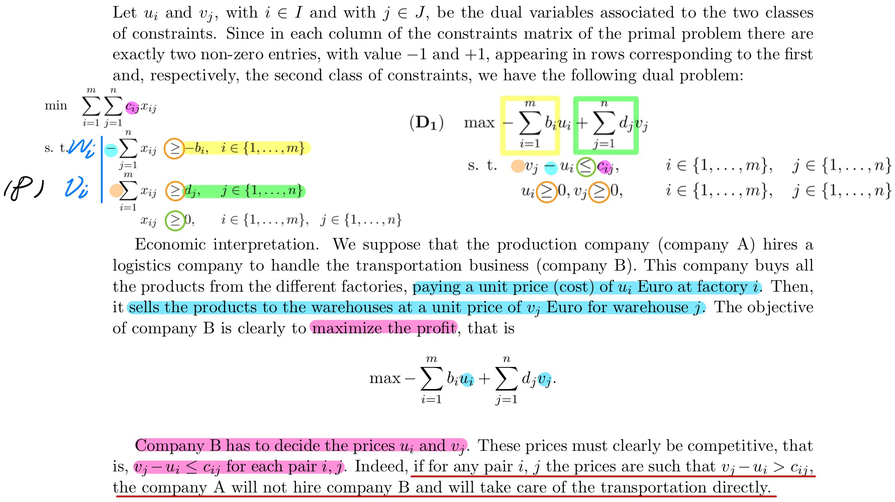

# Complementary Slackness Conditions

Given the linear program:

$$
\begin{aligned}
\text{max} \quad & 2x_1 + \ \ x_2 \\
\text{s.t.} \quad
& \ \ x_1 + 2x_2 \leq 14 \\
& 2x_1 - \ \ x_2 \leq 10 \\
& \ \ x_1 - \ \ x_2 \leq 3 \\
& \ \ x_1, \quad \ x_2 \geq 0
\end{aligned}
\notag
$$

1. Write its dual.

	------

	$$
	\begin{aligned}
	\text{max} \quad & 14y_1 + 10y_2 + 3y_3 \\
	\text{s.t.} \quad 
	& \quad y_1 + \ \ 2y_2 - \ \ y_3 \geq 2 \\
	& \ \ 2y_1 - \quad y_2 - \ \ y_3 \geq 1 \\
	& \quad y_1, \quad \ \ \ y_2, \quad \ y_3 \geq 0.
	\end{aligned}
	\notag
	$$

	------

2. Check that $\bar{x} = \left(\frac{20}{3}, \frac{11}{3}\right)$ is a feasible solution of $(P)$.

3. Show that $\bar{x}$ is also an optimal solution of $(P)$ by applying the complementary slackness conditions.

4. Derive an optimal solution of the dual.

	------

	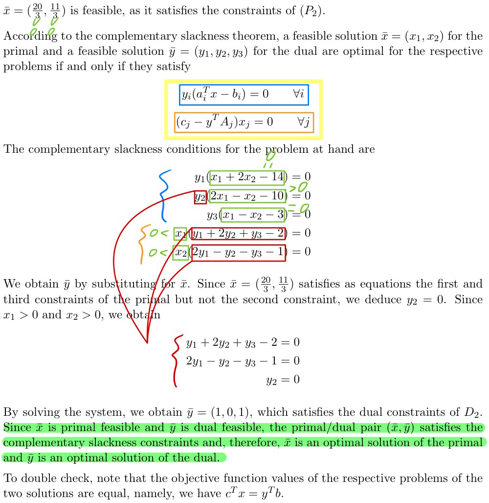
