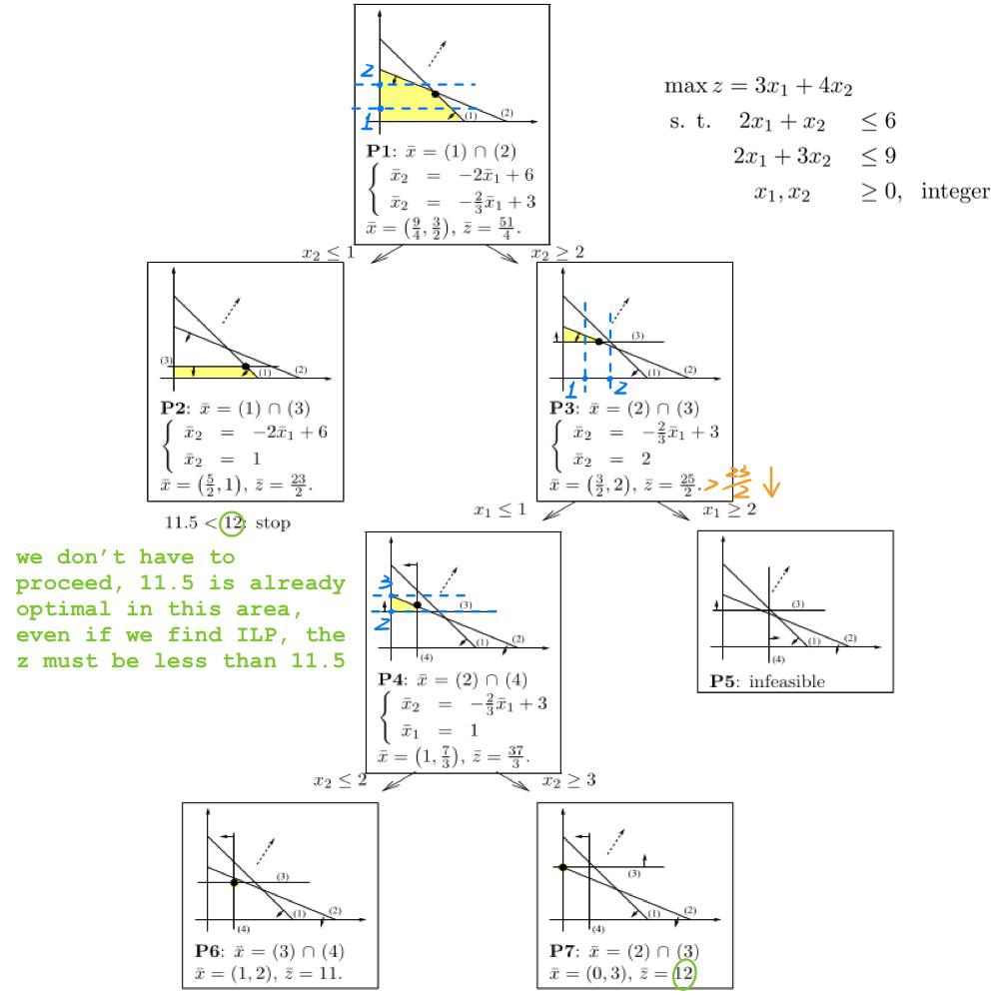
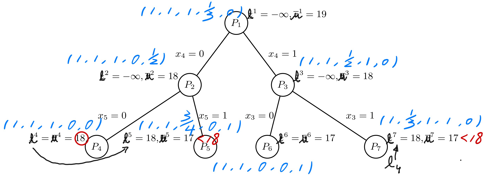
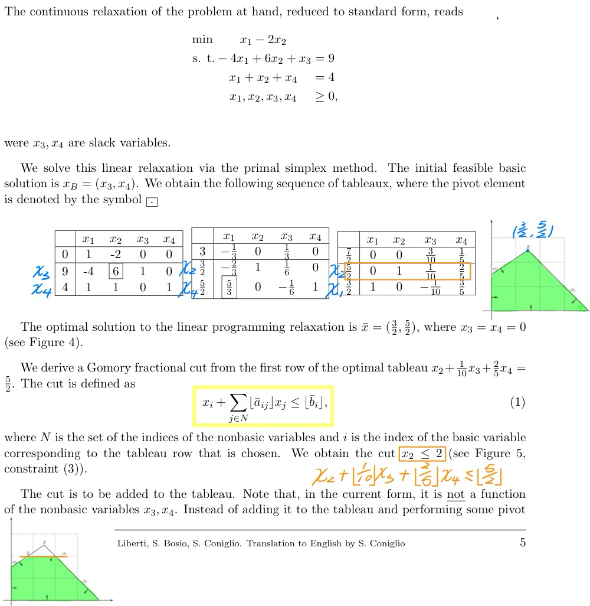
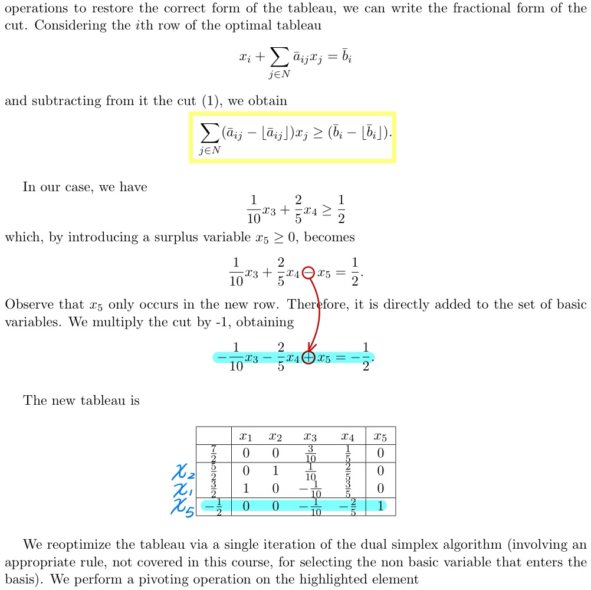
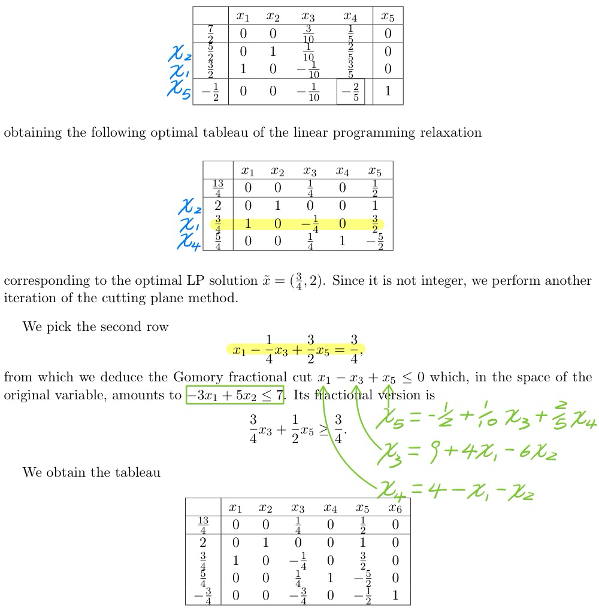
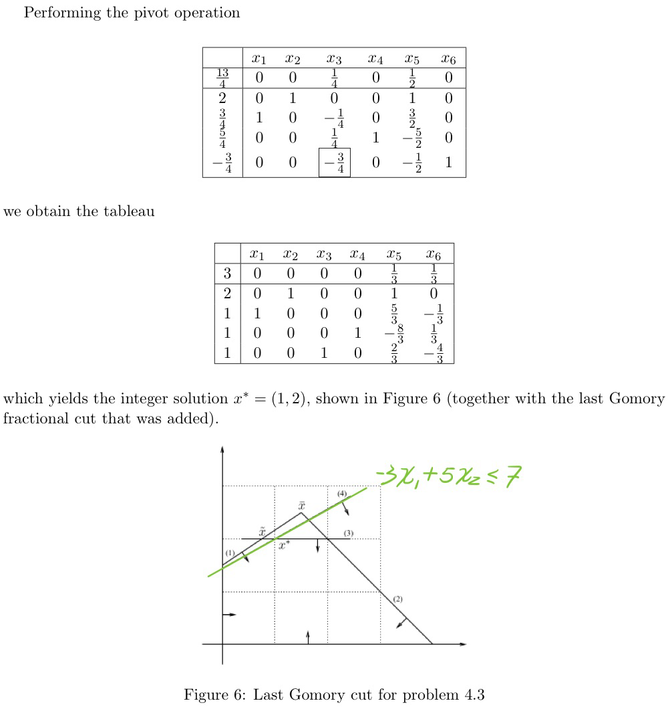

# Branch-and-bound

Given the integer linear program

$$
\begin{aligned}
\max \quad & z = 3x_1 + 4x_2 \\
\text{s.t.} \quad
&2x_1 + x_2 \leq 6 \\
&2x_1 + 3x_2 \leq 9 \\
&x_1, x_2 \geq 0, \text{ integer}
\end{aligned}
\notag
$$

Solve it via the Branch-and-Bound method (solving graphically the continuous relaxation of each subproblem encountered in the enumeration tree). Branch on the fractional variable with fractional value closest to $\frac{1}{2}$. Among the set of active nodes, pick that with the most promising bound.

-----

# Branch-and-bound for 0-1 knapsack with lower bound

A bank has 12 million Euro, which can be invested into stocks of five companies (1, 2, 3, 4, and 5). The table below reports, for each company, the net revenue and the amount of money that must be invested into it.

| Company | Revenue | Money |
| ------- | ------- | ----- |
| 1       | 8       | 4     |
| 2       | 5       | 3     |
| 3       | 5       | 3     |
| 4       | 3       | 4     |
| 5       | 1       | 2     |

Give an Integer Linear Programming formulation for the problem of choosing a set of companies so as to maximize the total revenue. Note that no partial investment can be done, i.e., for each company we can either invest into it or not.

------

$$
z_{BK} = & \max & 8x_1 + 5x_2 + 5x_3 + 3x_4 + x_5 \\
& \text{s.t.} & 4x_1 + 3x_2 + 4x_3 + 3x_4 + 2x_5 \leq 12 \\
& & x_1, x_2, x_3, x_4, x_5 \in \{0, 1\}
\notag
$$

------

1. Show that the linear programming relaxation of the binary knapsack problem and the resulting subproblems can be solved to optimality with a simple greedy algorithm. 
	*Hint: Consider the ratios between the revenue and the cost for each investment.*

	------

	To find an optimal solution to the linear programming relaxation of the binary knapsack problem, there is no need to use the Simplex method. We can use the following simple greedy algorithm. First, sort the variables by nonincreasing revenue and cost ratio. In our case:

	$$
	(8/4, 5/3, 5/4, 3/3, 1/2) = (2, 1.67, 1.25, 1, 0.5)
	\notag
	$$
	and the variables are already ordered appropriately. Then, consider the variables in that order and assign the largest possible value to the variable under consideration $x_{i'}$ as long as $\sum_{i<i'} c_i \leq B$ and $x_{i'} = \frac{B - \sum_{i<i'} c_i}{c_{i'}}$ if $\sum_{i<i'} c_i + c_{i'} > B$, and all the other variables to zero (in this case, the first step is $(1, 1, 1, \frac{1}{3}, 0)$). By truncating the objective function value $z_{LP}$ of the above optimal (fractional) feasible solution $x_{LP}$ (i.e., by setting it equal to the largest integer smaller than or equal to $z_{LP}$), we obtain an upper bound on the objective function value $z_{BK}$ of an optimal solution of the binary knapsack problem under consideration.

	------

2. Solve the above binary knapsack problem with a Branch-and-Bound algorithm.

	------

	We now solve the original binary knapsack problem by using the above greedy algorithm for finding the optimal solution for the linear programming relaxations of the subproblems. In this case, the lower bound (LB) is not computed at each node. Instead, it is updated whenever a subproblem yields a feasible solution. The upper and lower bounds on the objective function values of the optimal solutions of the subproblems are obtained by appropriately truncating the objective function values of the optimal solutions of the associated linear programming relaxations.

	

# Cutting Plane Algorithm

Given the integer linear program

$$
\begin{aligned}
	\min \quad & x_1 - 2x_2 \\
	\text{s.t.} \quad
	& -4x_1 + 6x_2 \leq 9 \\
	& x_1 + x_2 \leq 4 \\
	& x_1, x_2 \geq 0, \text{ integer}
\end{aligned}
\notag
$$
solve it via the cutting plane method with Gomory’s fractional cutting planes.

------

