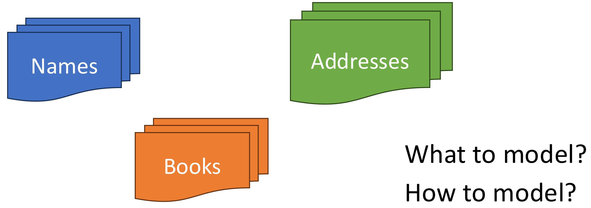
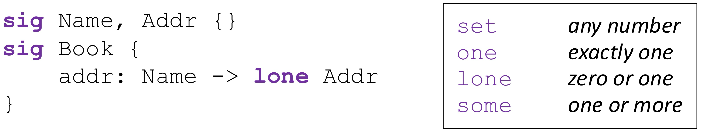
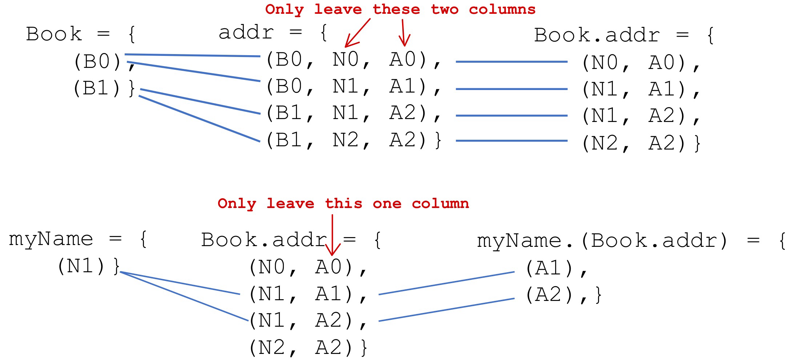
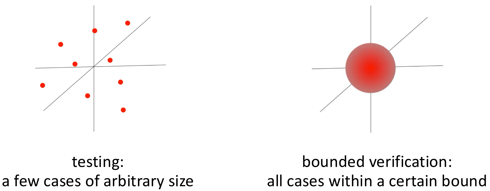

# The AddressBook Example

* Suppose we are asked to model very simple address books

* Books contain a bunch of addresses linked to the corresponding names

	


## AddressBook in Alloy



* **Signatures (`sig`)**:
	* `Name` , `Addr` : These are two types of entities (basic types).
	* `Book` : Another entity (a collection of names and their corresponding addresses).
* **Relation**:
	* `addr` : A ternary relation (b -> n -> a), which links:
		* A `Book` → a `Name` → to at most one `Addr` (address).
	* The keyword `lone` means that each Name can map to **zero or one** `Addr`.
* **Explanation**:
	* Each `Name` can correspond to **at most one** `Addr`, enforced by the keyword `lone`.
	* This captures the idea that an address book maps names to unique addresses (or no address).


### Logic: Relations of Atoms

* **Atoms**:
	* Atoms are **Alloy’s primitive entities**.
		* **Indivisible**: Cannot be broken into smaller parts.
		* **Immutable**: Their values cannot change.
		* **Uninterpreted**: Atoms do not have inherent meaning; they are abstract and serve as placeholders.
	* `Name`, `Addr`, and `Book` are signatures that create sets of **atoms**.
* **Relations**:
	* **Relations** are used to **associate atoms** with one another.
	* A relation is represented as a **set of tuples**, where:
		* **Tuples** are ordered sequences of atoms.
		* For example, a relation `addr` could link atoms in the form of (`Book`, `Name`, `Addr`).
	* `addr: Name -> lone Addr` is a relation that forms tuples like: (`Book1`, `Name1`, `Addr1`).


### Logic: Everything is a Relation

* Sets are unary (1 column) relations

	```
	Name = {(N0), (N1), (N2)}
	Addr = {(A0), (A1), (A2)}
	Book = {(B0), (B1)}
	```

* Scalars are singleton sets

	```
	myName = {(N1)}
	yourName = {(N2)}
	myBook = {(B0)}
	```

* Ternary relation

	```
	addr = {(B0, N0, A0), (B0, N1, A1), (B1, N1, A2), (B1, N2, A2)}
	```


#### `myName.(Book.addr)`




## Static Analysis

* **Empty Predicate** `show`:

	* A **predicate** (`pred`) is a keyword in Alloy used to define a logical condition or scenario.

	* Here, an **empty predicate** is defined:

		```
		pred show {}
		```

* **Running the Predicate**:

	* The run command instructs Alloy to analyze and visualize the predicate show under specific constraints:

		```
		run show for 3 but 1 Book
		```

		* `for 3` : Limits the state exploration to a maximum of **3 instances** for all entities (e.g., Name, Addr, etc.).
		* `but 1 Book` : Overrides the general constraint for Book, limiting it to exactly **1 instance**.

* **Adding Constraints on the Number of Relations**:

	* A **constraint** is added to limit or specify the number of relations between Name and Address within a given Book.

		```
		pred show [b: Book] {
				#b.addr > 1
		}
		```

		* `b: Book` : b is a specific instance of Book.
		* `#b.addr` : The number of (Name, Address) relations within the book.
		* `#b.addr > 1` : There must be **more than one** such relation.
		* It ensures that a Book has more than one associated address

* **Constraining Different Addresses**:

	* Further refinement ensures that the number of **different addresses** appearing in the book is also greater than 1:

		```
		pred show [b: Book] {
		    #b.addr > 1
		    #Name.(b.addr) > 1
		}
		```

		* `Name.(b.addr)` : Projects the relation to **names** that are mapped to addresses in b.
		* `#Name.(b.addr) > 1` : More than one distinct address must be linked to names.

* **Checking a Specific Constraint**:

	* The third example introduces an additional constraint:

		```
		pred show [b: Book] {
		    #b.addr > 1
		    some n: Name | #(n.(b.addr)) > 1
		}
		```

		* `some n: Name` : There exists at least one Name (n) such that:
		* `#(n.(b.addr)) > 1` : The number of addresses associated with this Name is greater than 1.


## Dynamic Analysis

* **Defining the `add` Predicate**:

	```
	pred add [b, bpost: Book, n: Name, a: Addr] {
	    bpost.addr = b.addr + n -> a
	}
	```

	* `b` : The **“before”** state of the book.
	* `bpost` : The **“after”** state of the book.
	* `n: Name` : The **name** to be added.
	* `a: Addr` : The **address** to be added
	* `bpost.addr = b.addr + n -> a` :
		* This models the addition of the pair (n, a) to the book’s addr relation.
		* **==Cartesian Product==** (`n -> a`): Creates a pair between n (Name) and a (Address).

* **Predicate `showAdd` to Invoke the Operation**:

	```
	pred showAdd [b, bpost: Book, n: Name, a: Addr] {
	    add[b, bpost, n, a]
	    #Name.(bpost.addr) > 1
	}
	```

	* `add[b, bpost, n, a]` :
		* Invokes the add predicate, ensuring the state transition happens.
	* `#Name.(bpost.addr) > 1` :
		* Ensures that the **number of distinct addresses** in the updated bpost book is **greater than 1**.
		* `Name.(bpost.addr)` projects the relation to the set of addresses associated with names in the book.

* **Running the Operation**:

	```
	run showAdd
	```

	* `run` : Executes the `showAdd` predicate to explore scenarios.
	* Alloy generates examples (instances) of the Book before and after the operation, showing how the addr relation changes

* **Defining the `del` Predicate**:

	```
	pred del [b, bpost: Book, n: Name] {
	    bpost.addr = b.addr - n -> Addr
	}
	```

	* `bpost.addr = b.addr - n -> Addr` : `bpost.addr` will contain all the (Name, Addr) pairs from `b.addr` , **except** those that involve `n`.


## Assertions & Counterexamples

* **Assertion Definition**:

	```
	assert delUndoesAdd {
	    all b, bpost, bppost: Book, n: Name, a: Addr |
	        add[b, bpost, n, a] and del[bpost, bppost, n]
	        implies b.addr = bppost.addr
	}
	```

	* `assert delUndoesAdd` :
		* This defines an **assertion** named delUndoesAdd. 
		* Assertions allow you to **verify properties** of your Alloy model.
	* `all b, bpost, bppost: Book, n: Name, a: Addr |` :
		* **Quantifier** `all` : This assertion applies to **all possible instances** of:
			* `b` , `bpost` , `bppost` : Books (states of the book).
			* `n: Name` : A name.
			* `a: Addr` : An address.
	* `add[b, bpost, n, a] and del[bpost, bppost, n]` :
		* `add[b, bpost, n, a]` : Represents the state after adding the (n, a) pair to b, resulting in bpost.
		* `del[bpost, bppost, n]` : Represents the state after deleting n from bpost, resulting in bppost.
	* `implies b.addr = bppost.addr` :
		* `implies` : A logical condition stating:
			* “If we add (n, a) to b (giving bpost), and then delete n from bpost (giving bppost), then the address relation b.addr should equal bppost.addr.”
		* Essentially, this checks if the **delete undoes the add operation** and restores the **initial state**.

* **Running the Assertion Check**:

	```
	check delUndoesAdd for 3
	```

	* `check` : This runs the assertion delUndoesAdd to look for **counterexamples**.
	* `for 3` : Limits the search space to:
		* At most **3 instances** for each entity (e.g., Book, Name, Addr).

* **Counterexample Explanation:**

	* A **counterexample** is a specific scenario where:
		* `b.addr ≠ bppost.addr` even after performing `add` and `del`.
	* Why might this happen?
		* When `add` tries to add a name that already exists and `delete` will delete the name and the corresponding address

* **Solution: Adding a Precondition**:

	```
	assert delUndoesAdd {
	    all b, bpost, bppost: Book, n: Name, a: Addr |
	        no n.(b.addr) and
	        add[b, bpost, n, a] and del[bpost, bppost, n]
	        implies b.addr = bppost.addr
	}
	```

	* `no n.(b.addr)` : Ensures that the Name n does not already exist in the address book b before performing the add operation.


### Counterexamples in Alloy

* **Bounded Verification**:

	* Alloy performs **bounded verification**, meaning:
		* The analysis checks a **finite scope** of possible instances.
		* This scope is defined (e.g., “for 3” checks up to 3 instances of each entity).

	* While Alloy can efficiently explore this finite scope, it does **not** analyze all possible states or infinite domains.

* **No Guarantee Outside the Scope**:

	* There is NO guarantee that the assertions always hold if no counterexample is found in a certain scope.

		* If Alloy does **not find a counterexample** in the given scope, the assertion might still fail in a **larger scope** or with more complex scenarios.

		* Alloy’s results are **valid only within the defined bounds**.

			


## Function


