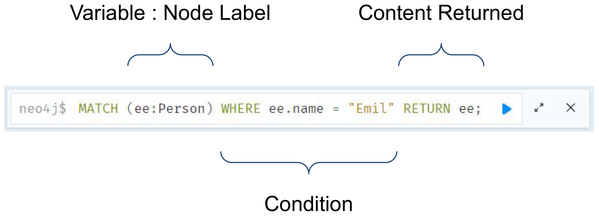
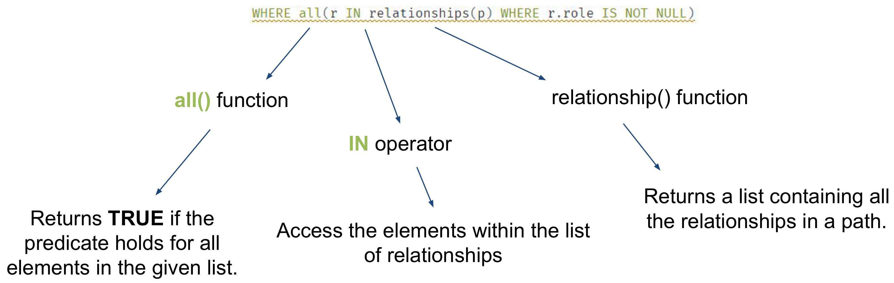

# Some Concepts

## Introduction to Cypher


* **Cypher** is used to query a Neo4j graph, as well as update it
* The syntax is easy to understand and makes queries self-explanatory
* It focuses on the clarity of expressing what to retrieve from a graph, not on how to retrieve it


## CREATE Node

* The `CREATE` clause allows the creation of nodes and relationships

	

* It is possible to `CREATE` multiple nodes and/or relationships at once

	

* It is possible to `CREATE` simpler and even more complex nodes

	

* The `RETURN` clauses return nodes and/or the properties of a node after its creation

	


## MATCH

* The `MATCH` clause returns all the nodes that match the conditions in query

	The `WHERE` clause identify all the conditions the nodes should match

	The `RETURN` clause indntify what the query should return to the user

	

	* This query will return all the information associated with the node labeled `Person` whose name is "Emil"
	* if there is more than one person named "Emil", it would return all matching nodes


## CREATE Relationship

* `CREATE` two Person(s) named Mark and Mike

	

* `CREATE` the relationship `KNOWS` between Mark and Mike

	

* It is possible to `CREATE` multiple relationships between the same entities

	Relationships can also be created with properties

	

	* **N.B.** The two `KNOWS` relationships we created are different even though they have the same name

		


## DELETE Node

* The `DELETE` clause allows the removal of nodes and relationships

* `DETACH` removes all the relationships before removing the nodes

	* `DETACH` is important when you need to remove nodes that have relationships

	* Without it, the `DELETE` operation would fail if any of the matched nodes still had relationships!!

		

		* It will delete all nodes in the graph and their relationships, resulting in an empty graph

		

		* Unlike the previous example, this query does **not** use `DETACH`, meaning that it will only delete the node if it has no relationships
		* If the node has any relationships, the query will fail because Neo4j prevents the deletion of nodes with existing relationships unless they are explicitly detached using the `DETACH DELETE` clause


## DELETE Relationship

* The `DELETE` clause allows the removal of nodes and relationships

	

	* This query only deletes the relationships and leaves the nodes (both Ben and the node connected by `KNOWS`) intact


## DISTINCT

* Let's find all of Emil's friends

	

* Let's find a new friend that can teach surf to Johan

	

	* The query looks for Johan's friends of friends who have a hobby of surfing
	* It finds a two-step relationship (Johan -> friend -> friend) and filters to make sure that the second friend (friend of friend) has the hobby of surfing
	* The query then returns those distinct surfers as potential new friends who can teach Johan how to surf


## COUNT

* Let's use the `COUNT` clause to get the amount of nodes returned by the query

	


## PROFILE

* `PROFILE` provides the complete set of operations provided to perform the query

	* It shows each operation that Neo4j performs (e.g., node or relationship scans) and how many rows are processed at each stage

		

		


## Movies & Actors (Exercise)


### Node Query

* Find the actor named "Tom Hanks"

	

* Find the movie with title "Cloud Atlas"

	

* Find 10 People

	

* Find movies released in the 1990s

	

* Find the number of people born before 1970

	


### Pattern Query

* List all "Tom Hanks" movies

	

* Who directed "Cloud Atlas"?

	

* Find Tom Hank's co-actors

	

* Find how people are related to "Cloud Atlas"

	

	


## Node Distance

* Movies and actors up to 4 "hops" away from "Kevin Bacon"

	


## Built in Functions (shortestPath)

* Find the shortest path of any relationships from "Kevin Bacon" to "Meg Ryan"

	


* Find the shortest path of `ACTED_IN` relationships from "Kevin Bacon" to "AI Pacino"

	


## Predicate Functions (ALL, IN)

* Let's take a look at the previous `WHERE` condition

	


## WITH

* Using `WITH` , you can manipulate the output before it is passed on to the following query parts. It is usually combined with other clauses, like

	* `ORDER BY` : Sort the result of the query
	* `LIMIT` : Limit the amount of results provided by the query

	It can also be used to

	* Introduce aggregates which can then be used in predicates in `WHERE`
	* Alias expressions that are introduced into the results using the aliases `AS` the binding name
	* Separate reading from updating of the graph

* **FILTER** : Filter w.r.t an aggregate function

	

	* **N.B.** The query will **only** be able to read the variables stated within the `WITH` clause. If the person variable wouldn't have been included within the clause, I wouldn't have been able to `RETURN` it

* **ORDER BY & LIMIT** : Filter w.r.t. an aggregate function

	


# Graph Exercise


# Coding Exercise

## Data Model


## Return all the different types of nodes (one at time) to inspect their attributes, limiting the number of returned nodes to 10

```sql
MATCH (u:User) RETURN u LIMIT 10
MATCH (re:Review) RETURN r LIMIT 10
MATCH (l:Listing) RETURN l LIMIT 10
MATCH (h:Host) RETURN h LIMIT 10
MATCH (a:Amenity) RETURN a LIMIT 10
MATCH (n:Neighborhood) RETURN n LIMIT 10
MATCH (c:City) RETURN c LIMIT 10
MATCH (s:State) RETURN s LIMIT 10
MATCH (c:Country) RETURN c LIMIT 10
```


## Return all the different relationships (one at a time) to inspect their attributes, limiting the number of returned nodes to 10

```sql
MATCH (u:User) - [r:WROTE] -> (re:Review) RETURN u, r, re LIMIT 10
MATCH (re:Review) - [r:REVIEWS] -> (l:Listing) RETURN re, r, l LIMIT 10
MATCH (h:Host) - [r:HOSTS] -> (l:Listing) RETURN h, r, l LIMIT 10
MATCH (a:Amenity) <- [r:HAS] - (l:Listing) RETURN a, r, l LIMIT 10
MATCH (l:Listing) - [r:IN_NEIGHBORHOOD] -> (n:Neighborhood) RETURN l, r, n LIMIT 10
MATCH (n:Neighborhood) - [r:LOCATED_IN] -> (c:City) RETURN n, r, c LIMIT 10
MATCH (c:City) - [r:IN_STATE] -> (s:State) RETURN c, r, s LIMIT 10
MATCH (s:State) - [r:IN_COUNTRY] -> (c:Country) RETURN s, r, c LIMIT 10 
```


## Return the list of listings with accomodates less or equal than 3

```sql
MATCH (l:Listing)
WHERE l.accommodates <= 3
RETURN l, l.accommodates
```


## For each user who wrote a review, count the number of reviews they wrote

```sql
MATCH (u:User) - [r:WROTE] -> (re:Review)
RETURN u, COUNT(re)
```


## Return the list of listings whose amenities include "First Aid Kit" and "Wireless Internet"

```sql
MATCH (l:Listing) - [r1:HAS] -> (a1:Amenity), (l) - [r2:HAS] -> (a2:Amenity)
WHERE a1.name = "First Aid Kit" AND a2.name = "Wireless Internet"
RETURN l, a1, a2
```


## Return the collection of all the listings' names in the same neighborhood

```sql
MATCH (l:Listing) - [r:IN_NEIGHBORHOOD] -> (n:Neighborhood)
RETURN n.name, collect(l.name)
```


## Return the name of the states with at least 10 neighborhoods

```sql
MATCH (s:State) <- [] - (c:City) <- [] - (n:Neighborhood)
WITH s, COUNT(n) AS 'neighborhood_count'
WHERE neighborhood_count >= 10
RETURN s.code, neighborhood_count
```


## For each host, return the total number of reviews assigned to their listings with "First Aid Kit" amenity, the total number of listings they own, and their name

```sql
MATCH (h:Host) - [:HOSTS] -> (l:Listing) <- [:REVIEWS] - (r:Review), (l) - [:HAS] -> (a:Amenity)
WHERE a.name = "First Aid Kit"
WITH h, COUNT(r) AS 'reviews_count'
MATCH (h) - [:HOSTS] -> (li:Listing)
WITH h, reviews_counts, COUNT(li) AS 'all_listings_count'
RETURN h.name, reviews_count, all_listings_count
```


