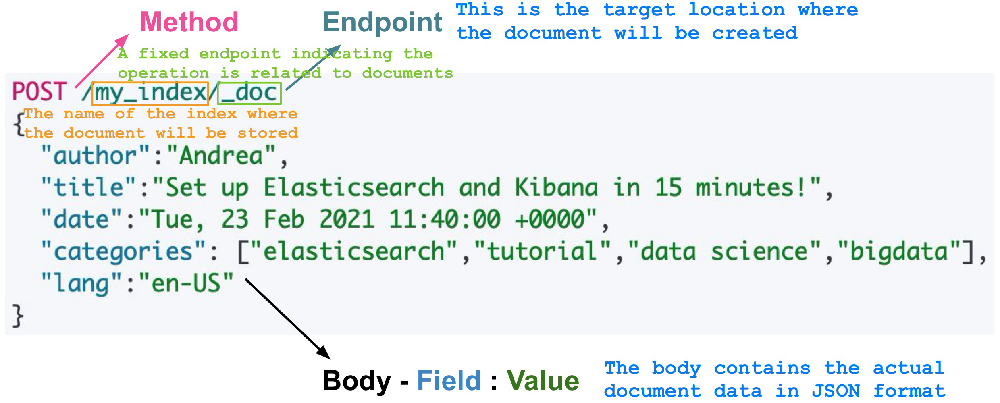
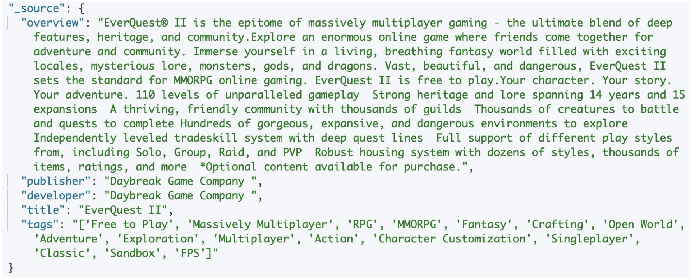

# Indices

* **Index in Elasticsearch**

	An **index** in Elasticsearch is a fundamental data structure that organizes and stores data. It’s comparable to a database in relational database systems.

	* **Data Organization Mechanism**:
		* An index is used to efficiently organize and retrieve data stored in Elasticsearch. Each index contains a collection of documents that share similar characteristics.

	* **Define the Structure of Documents via Mappings**:
		* Elasticsearch uses **mappings** to define the schema or structure of the documents within an index. This includes defining fields, their data types, and any special rules for how they are indexed or searched.

	* **Partitioned in Shards**:
		* To handle large volumes of data and improve scalability, Elasticsearch partitions each index into smaller units called **shards**. Shards allow the index to be distributed across multiple nodes in a cluster, enhancing performance and fault tolerance.

	* **Automatic Indexing of New Data**:
		* When new data is added to Elasticsearch, it is automatically indexed, meaning it is prepared for efficient searching and retrieval. Elasticsearch updates its internal structures (e.g., the inverted index) to ensure fast query responses.

* **Inverted Index**

	* Elasticsearch’s indexing process is based on the concept of an **inverted index**.

	* An **inverted index** is a data structure commonly used in search engines. It maps terms (words or tokens) to the documents in which they appear, enabling quick full-text search. For example, if you search for a keyword, the inverted index quickly identifies all the documents containing that keyword.

		


# Shards & Replicas


* **Shards:**

	* **Definition**: A shard is a subset of an Elasticsearch index, and it represents a portion of the index’s data. By dividing an index into multiple shards, Elasticsearch can distribute data across different nodes in a cluster.

	* **Purpose**:

		* **Increase resistance to faults and hardware failures**: If one shard becomes unavailable, Elasticsearch can use replicas to maintain functionality.

		* **Improve performance**: Sharding allows parallel processing of search and indexing operations, leading to faster responses.

		* **Increase capacity to serve read requests**: Multiple shards (including replicas) enable load balancing by distributing read operations across the cluster.

* **Types of Shards:**

	* **Primary Shards**:

		* These hold the original data for an index.

		* Each document in the index is assigned to exactly one primary shard.

	* **Replica Shards**:

		* These are exact copies of the primary shards.

		* They are stored on different nodes to provide redundancy and ensure fault tolerance.

		* Replica shards can also handle read requests, improving query performance and reducing load on primary shards.

* **Write and Read Operations:**

	* **Write Operations**:

		* Writes (e.g., indexing new data) are first performed on the **Primary Shard**.

		* Once the operation is completed on the primary shard, the changes are replicated to the **Replica Shards** to ensure data consistency and fault tolerance.

	* **Read Operations**:
		* Reads (e.g., searches or queries) can be performed on either a **Primary Shard** or a **Replica Shard**.
		* This distribution of read operations improves query performance by balancing the load across the cluster.

* **Shards’ Impact on Performance:**

	The **number** and **size** of shards play a critical role in Elasticsearch’s performance:

	* **Number of Shards**:

		* **More Shards = More Management Overheads**:
			* Having too many shards leads to higher resource consumption for management, such as memory and CPU usage, even if the shards are small.

		* **Fewer Shards = Fewer Overheads**:
			* A smaller number of larger shards can simplify management and resource utilization.

	* **Size of Shards**:

		* **Large Shards**:
			* Moving large shards (e.g., during rebalancing or recovery) takes more time and network bandwidth.

		* **Small Shards**:

			* Querying small shards can be faster per shard, but querying many shards introduces overhead.

			* It might be more efficient to query fewer, larger shards than many small ones.

	* **Trade-offs**:

		* While smaller shards improve search parallelism, they can increase coordination and management costs for the cluster.

		* Elasticsearch administrators must balance shard size and count to optimize for the cluster’s specific workload and resource limits.


# Mapping

* **Document**:
	* In Elasticsearch, data is stored as **documents**.
	* A document is essentially a JSON object made up of fields, where each field has a specific value.
* **Mapping**:
	* A **mapping** defines the structure of a document, including the data type of each field (e.g., string, integer, date) and how those fields should be indexed or stored.
	* Mapping helps Elasticsearch understand how to process and search for data efficiently.

* **Types of Mapping:**

	* **Dynamic Mapping**:

		* **Automatic**: Elasticsearch automatically detects and adds new fields when a document is indexed.

		* **Example**:
			* If a new document with an unknown field is indexed, Elasticsearch assigns a default data type to that field (e.g., a number field will be mapped as long).

	* **Explicit Mapping**:

		* **Manual Definition**: You explicitly define the mapping for all fields before indexing any data.

		* **Example**:
			* You define a field price as a float and specify that it should not be analyzed (e.g., no tokenization).

* **Immutable Mapping**:

	* Once an index has been created and documents have been added, you **cannot modify the mapping** of existing fields in that index.
	* Any changes require creating a new index with the desired mapping and re-indexing the data.


## Dynamic Mapping Drawbacks

* **Automatic Field Addition**:

	* ==**Whenever**== a new document is indexed, Elasticsearch automatically adds fields that are not already defined in the mapping.

	* **Problem**:
		* If your dataset contains a wide variety of **heterogeneous documents**, Elasticsearch might end up creating a large number of fields.
		* This can result in a **“mapping explosion”**, which negatively affects index performance and manageability.

* **Schema-Less Nature**:

	* Elasticsearch operates in a **schema-less** mode when no explicit mapping is defined.

	* **What Happens**:

		* Elasticsearch tries to guess the structure and data types of fields in the document.

	* **Risk**:

		* Misinterpretation of field types can occur. For instance:

			* A numerical field might be misclassified as long instead of float.

			* Fields with similar names but different formats across documents can lead to indexing errors or inefficiencies.


# Interaction

* **How Interaction Works:**

	* Elasticsearch is a RESTful system, which means it provides an HTTP API to interact with indices, documents, mappings, and more.
	* These interactions involve sending requests to **REST endpoints** using standard HTTP methods (verbs).

* **HTTP Methods in Elasticsearch:**

	* `GET` : Used to **retrieve data** such as documents, index metadata, or mappings.

	* `POST` and `PUT` : Both are used to **create or update** data in Elasticsearch.

		* `POST` : Used when Elasticsearch should automatically generate the document ID.

			```http
			POST /index_name/_doc
			```

		* `PUT` : Used when specifying the document ID explicitly.

			```http
			PUT /index_name/_doc/document_id
			```

		

	* `DELETE` : Used to **remove data** such as documents or entire indices.

* **How to Send Requests:**

	* **Command Line**:

		* Using tools like curl to send HTTP requests.

		* Example:

			```bash
			curl -X GET "localhost:9200/index_name/_doc/document_id"
			```

	* **Software Packages**:

		* Tools like **Postman** allow you to test and interact with Elasticsearch endpoints visually.

	* **Developer Tools (e.g., Kibana)**:

		* Kibana includes a **Dev Tools** console for easily interacting with the Elasticsearch API.


# Creating an Index

* To create a new index, it is enough to use the `PUT` operator

	```http
	PUT /my_index
	```

* As an output, Elasticsearch will provide some metadata describing whether the index was successfully created

	* `"acknowledged" : true` : Indicates that the request was received and processed successfully by the cluster
	* `"shards_acknowledged" : true` : Confirm that the primary and replica shards for the index were successfully allocated across the cluster
	* `"index" : "my_index"` : Confirms the name of the index that was created

* When defining an index, it is also possible to setup some parameters, namely one or more aliases, number of shards, number of replicas, and many more

	```http
	PUT /my_index
	{
	  "settings": {
	    "number_of_replicas": 3,
	    "number_of_shards": 3
	  }
	}
	```

	

## Explict Mapping

* When creating an index, it is possible to define the **mapping** straight away

	```http
	PUT /my_index
	{
	  "mappings": {
	    "properties": {
	      "age": {
	        "type": "integer"
	      },
	      "email": {
	        "type": "keyword"
	      },
	      "name": {
	        "type": "text"
	      }
	    }
	  }
	}
	```

	* `mappings` : Defines the schema for the fields in the documents that will be stored in the index.
	* `properties` : Specifies the fields and their types.

* Otherwise, it can still be defined after the index has been created


## Add a Field to a Mapping

* Given the rate at which the shape and complexity of the data evolves, sometimes it may be necessary to **add new fields** to an index

	```http
	PUT /my_index/_mapping
	{
	  "properties": {
	    "surname": {
	      "type": "text",
	      "index": false
	    }
	  }
	}
	```

	* `"index": false` :
		* This disables indexing for the surname field, meaning it will **not be searchable** or included in queries.
		* The field is stored in the document but only retrievable when fetching the entire document.


## Updating a Mapping

* **Mapping Updates and Indexed Data**:

	* Once a field is indexed, its mapping properties (like type or indexing behavior) **cannot be changed**.
	* Example: Changing a field from text to integer is not allowed because it could invalidate previously indexed data.

* **Creating a New Index**:

	* To update a field’s mapping, the following steps are necessary:
		1. **==Create== a new index** with the updated mapping.
		2. **==Reindex== the data** from the old index into the new one using the `_reindex` API.
		3. Optionally, **delete the old index** or use an alias to redirect queries to the new index.

* **Renaming a Field**:

	* Elasticsearch does not support direct field renaming. Instead, you can:
		* Add a **new field** in the mapping with the desired name.
		* Use an alias to map the old field name to the new one (for query purposes).

* **Updating Certain Field Properties**:

	* Some mapping properties, like index (whether a field is indexed or not), can be updated without creating a new index.

	* Example: You can disable indexing for a field by updating its mapping:

		```http
		PUT /my_index/_mapping
		{
		  "properties": {
		    "my_field": {
		      "index": false
		    }
		  }
		}
		```

		

## Visualising a Mapping

* When Dynamic Mapping is applied, it is useful to **visualise the mapping** assigned by Elasticsearch to look for some flaws

	```http
	GET /my_index/_mapping
	```

	* Retrieves the entire mapping for the specified index (`my_index`)

* Sometimes, it is not even necessary to have a look at the whole mapping; Instead, it could be interesting to take a look at the mapping of a single field

	```http
	GET /my_index/_mapping/field/my_field
	```

	* Retrieves the mapping for a specific field (`my_field`) in the specified index


## Field Types


## Analyzers


* If you are not sure about which analyzer is best suited for a specific case, they can be tested on sample **texts** to observe their behaviour

* Moreover, if none of the pre-built analyzers is suited, **custom analyzers** can be built

	```http
	POST _analyze
	{
	  "analyzer": "standard",
	  "text": "I really like sunsets."
	}
	```


# Retrieving a Document

* From now on, all the queries will be performed on a small, sample dataset which contains data about video games on Stream (https://drive.google.com/file/d/1Jw2ob7-syFKM3SvKAtVbTjD7pDX6lLl9/view)

* Retrieving a single document can be done using its unique identifier

	```http
	GET /steam_overviews/_doc/0f5ERIIB_2yY7-gczBye
	```

	* `steam_overviews` : The index name
	* `_doc` : The document endpoint
	* `0f5ERIIB_2yY7-gczBye` : The unique document ID.

* Elasticsearch returns a set of metadata (e.g., whether the document has been found, the name of the index, etc.) and a **source** field

	* Such a field contains all the data about the document that has been retrieved 

		


## Queries

Elasticsearch supports two different categories of query clauses

* **Leaf Query Clauses**:
	* These queries are used to look for a specific value in a specific field
	* They are **independent queries** and can function on their own
		* This category includes `match` , `term` , and `range` queries
* **Compound Query Clauses**:
	* These queries **combine multiple leaf or compound queries** into logical constructs
	* Useful for building more complex queries
		* This category includes `bool` queries and many more


### Queries & Filtering Context

* By default, Elasticsearch sorts matching search results by **Relevance Score**, which measures ==how well each document matches a query==
* Each query type can calculate relevance scores differently. Score calculation also depends on whether the query clause is run in a **Query** or **Filter Context**
	* **Query Context** $\rightarrow$ "==**How well**== does this document match this query clause?"
		* Decides whether the document matches the query or not
		* The relevance score ==**IS**== computed
		* Applied with the **query** parameter
	* **Filter Context** $\rightarrow$ "==**Does**== this document match this query clause?"
		* Decides whether the document matches the query or not
		* The relevance score ==**IS NOT**== computed
		* Applied with the **filter** or **must_not** parameter


### Match Queries

* **Match Queries** return documents that match a provided text, number, date or boolean value

  * Matches are based on terms after analysis, rather than the raw text

  * Whenever a text field is provided, it is analyzed before matching

    ```http
    GET /steam_overviews/_search
    {
      "query": {
        "match": {
          "publisher": {
            "query": "Daybreak Game Company"
          }
        }
      }
    }
    ```

    * Searches the `"publisher"` field for documents containing the term “Daybreak Game Company”

  * It can be performed using a compact style

    ```http
    GET /steam_overviews/_search
    {
      "query": {
        "match": {
          "publisher": "Daybreak Game Company"
        }
      }
    }
    ```

    * `"query"` : The root key under which all search-related conditions are specified
    * `"match"` : Specifies the type of query
    * `"publisher"` : The field in the documents being searched
    * `"Daybreak Game Company"` : The value you want to search for in the `"publisher"` field

* **Match Queries** are of type boolean, meaning that the provided text is analyzed, and a boolean query is constructed based on the analysis results.

* Depending on the value of the **operator** parameter, the boolean query is either built using the **`OR`** operator or the **`AND`** operator

  * **`OR`** : Matches the documents that contain at least 1 word among the ones returned by the analyzer

  * **`AND`** : Matches the documents that contain all the words returned by the analyzer

  	```http
  	GET /steam_overviews/_search
  	{
  	  "query": {
  	    "match": {
  	      "overview": {
  	        "query": "free-to-play",
  	        "operator": "or"
  	      }
  	    }
  	  }
  	}
  	```

  	* The query is targeting the `"overview"` field with the value "free-to-play".
  	* `OR` : Matches documents that contain **at least one** of the terms: free, to, or play.

  	

  	* The `“total”` field under `“hits”` indicates the number of matching documents.
  	* The relevance scoring remains consistent for the top document, but the number of returned documents differs depending on the query logic.


### Term Queries

* **Term Queries** return documents that contain an ==**exact term**== in a provided field

	* No analysis is performed on the query input or the field values

	* Directly matches the raw value of the field.

* ==**DO NOT**== use term queries for **text fields**

  * Remember that text fields are analyzed, such an approach make it difficult to find exact matches

  	```http
  	GET /steam_overviews/_search
  	{
  	  "query": {
  	    "term": {
  	      "publisher": {
  	        "value": "Ubisoft "
  	      }
  	    }
  	  }
  	}
  	```

  	* `"value"` : contains the term to look for in the document

* **Term Queries** support the following parameters

  * `boost` : 
  	* **Type**: Float number.
  	* **Purpose**: Adjusts the relevance score of the query. A higher value increases the priority of the query in the search results, and a lower value decreases it.
  	* **Default Value**: 1.0.
  	* **Use Case**: When running multiple queries, you can boost certain terms to make them more significant in the result ranking.
  * `case_insensitive` : 
  	* **Type**: Boolean (true or false).
  	* **Purpose**: Enables or disables case-insensitive matching.
  	* **Default Value**: true.
  	* **Use Case**: Allows matching regardless of case (e.g., “Ubisoft” matches “ubisoft” if case_insensitive is true).

  These parameters must be added within the field, together with the `"value"` parameter


### Range Queries

* **Range Queries** return documents that contain terms within a provided range

	* They are usually employed with numerical fields or dates

* **Range Queries** support the following operators

	* `"gt"` : greater than

	* `"gte"` : greater or equal than

	* `"lt"` : less than

	* `"lte"` : less or equal than

		```http
		GET /steam_overviews/_search
		{
		  "query": {
		    "range": {
		      "publish_date": {
		        "gte": "now-10d/d",
		        "lte": "now",
		        "boost": 2.0
		      }
		    }
		  }
		}
		```

		* The query targets the `"publish_date"` field.
		* Matches documents published within the last 10 days (from now, down to the beginning of each day).
		* **Boost**: Increases the relevance score of this query by a factor of 2.0.


#### Date Math

* **Anchor Date**:

	* The starting point for calculations.
	* Examples:
		* now (the current date and time).
		* A specific date, e.g., `2022.07.28`.

* **Math Expression**:

	* Used to calculate the desired range by adding or subtracting a value from the anchor date.

	* Consists of:
		* A **math operator** (`+` or `-`).
		* A **number**.
		* A **time unit**:
			* `d` for days.
			* `M` for months.
			* `Y` for years.
			* `h` for hours, etc.

	* **Optional Rounding Operator**:
		* Rounds the date to the closest specified unit.
		* Examples:
			* `/d` rounds to the **start** of the day.
			* `/M` rounds to the **start** of the month.

* **Examples**:

	* `now +1d /M` :
	* Starts from the current time (now).
		* Adds 1 day.
		* Rounds the resulting date to the start of the month
		* e.g., 2025-01-17T14:30:00 $\overset{+1d}{\rightarrow}$ 2025-01-18T14:30:00 $\overset{/M}{\rightarrow}$ 2025-01-01T00:00:00

	* `now -1Y /Y` :
		* Starts from the current time (now).
		
		* Subtracts 1 year.
		
		* Rounds to the start of the year.
		
	* `2022.07.28||+2M /M` :
	
		* Uses `2022.07.28` as the anchor date.
		* Adds 2 months.
		* Rounds to the start of the resulting month.


### Boolean Queries

* **Boolean Queries** match documents matching boolean combinations of other queries

  * It is built using one or more boolean clauses, each clause with a typed occurrence

  * The table below highlights the available boolean clauses

  	

* Each of the **clauses** describes may contain multiple conditions

	```http
	GET /steam_overviews/_search
	{
	  "query": {
	    "bool": {
	      "must": [
	        { "match": { "tags": "Multiplayer" } },
	        { "match": { "tags": "Action" } }
	      ]
	    }
	  }
	}
	```

	* Look for documents where the `"tags"` field includes both "Multiplayer" and "Action"
	* Only documents that satisfy both conditions will be returned

* You can write Boolean Queries that include all or just a few of the **clauses** described

	```http
	GET /steam_overviews/_search
	{
	  "query": {
	    "bool": {
	      "must": [
	        { "match": { "tags": "Multiplayer" } }
	      ],
	      "filter": [
	        { "term": { "publisher": "Ubisoft" } }
	      ],
	      "should": [
	        { "match": { "tags": "Action" } }
	      ]
	    }
	  }
	}
	```

	* `"must"` : Documents without "Multiplayer" in the tags field will be excluded.
	* `"filter"` : Documents must have the exact term "Ubisoft" in the publisher field, but this does not affect their relevance score.
	* `"should"` : Documents with "Action" in the tags field will have a higher relevance score, making them more likely to appear higher in the results.


# Aggregations

* Elasticsearch supports three different types of aggregations, namely

	* **Metric Aggregations**:
		* Used to calculate metrics like sum, average, minimum, maximum, etc., based on the values in document fields.
		* Example Use: Calculating the total sales or average age from a dataset.

	* **Bucket Aggregations**:
		* Group documents into buckets based on specific criteria, such as field values, ranges, or terms.
		* Each bucket contains documents that match its criteria.
		* Example Use: Categorizing products by price ranges or grouping users by age groups.

	* **Pipeline Aggregations**:
		* Operate on the results of other aggregations rather than directly on documents or fields.
		* Used for advanced metrics such as derivatives, moving averages, or cumulative sums.
		* Example Use: Calculating trends or percentage changes over time.

* Aggregations operate on the **set of documents** matching a query and can perform complex data analysis.

	* The **`size`** parameter controls how many documents are returned along with the aggregation results. If set to 0, only aggregation results are returned.

* Aggregations can be run as part of a search by specifying the **`aggs`** parameter

	* **Query**:

		```http
		GET /steam_overviews/_search
		{
		  "size": 0,
		  "aggs": {
		    "games_per_publisher": {
		      "terms": {
		        "field": "publisher"
		      }
		    }
		  }
		}
		```

		* `"size": 0` : Setting the size to 0 means that no document hits will be returned, only the aggregation results.
		* `"aggs"` : This is the keyword used to define the aggregations.
		* `"games_per_publisher"` : This is the name of the aggregation. You can name it anything meaningful to your use case.
		* `"terms"` : Specifies that this is a bucket aggregation based on **terms** (unique values).
		* `"field": "publisher"` : The field being analyzed for aggregation is the publisher field. Documents will be grouped by unique publishers.

	* **Response**:

		```json
		"aggregations": {
		  "games_per_publisher": {
		    "doc_count_error_upper_bound": 0,
		    "sum_other_doc_count": 44,
		    "buckets": [
		      {
		        "key": "Daybreak Game Company",
		        "doc_count": 3
		      },
		      {
		        "key": "Ubisoft",
		        "doc_count": 5
		      }
		      // More publisher buckets here...
		    ]
		  }
		}
		```

		* `"aggregations"` : The aggregation results are returned in this section.
		* `"games_per_publisher"` : Matches the name of the aggregation defined in the query.
		* `"sum_other_doc_count": 44` : The count of documents that didn’t fit in the top buckets (if there are too many buckets to display).
		* `"buckets"` : Contains the list of unique publishers, each represented as a bucket.
			* `"key"` : "Daybreak Game Company ": This is one unique publisher.
			* `"doc_count": 3` : Indicates that there are three documents (games) published by this company.

* Aggregations can be combined with normal queries to filter the data and then perform the aggregation

  ```http
  GET /steam_overviews/_search
  {
    "size": 0,
    "query": {
      "term": {
        "publisher": {
          "value": "Ubisoft "
        }
      }
    },
    "aggs": {
      "games_per_publisher": {
        "terms": {
          "field": "publisher"
        }
      }
    }
  }
  ```

  * The query is executed first: Elasticsearch filters the dataset to include only documents where the publisher field equals "Ubisoft ".
  * The aggregation is applied to the filtered data: Within the filtered documents, the aggregation groups by the publisher field and counts the number of documents in each group.
  * The response will include: Aggregated results, such as the total number of games published by each unique publisher (based on the publisher field). In this example, the buckets in the games_per_publisher aggregation will only contain the "Ubisoft" key, assuming the term query successfully filters documents where publisher is exactly "Ubisoft"

* Within the same ages operator, it is possible to perform **multiple** aggregations on different fields

	* **Query**:

		```http
		GET /steam_overviews/_search
		{
		  "size": 0,
		  "aggs": {
		    "games_per_publisher": {
		      "terms": {
		        "field": "publisher"
		      }
		    },
		    "games_per_developer": {
		      "terms": {
		        "field": "developer"
		      }
		    }
		  }
		}
		```

		* `"aggs"` :
			* `"games_per_publisher"` : This aggregation groups documents based on the publisher field.
			* `"games_per_developer"` : This aggregation groups documents based on the developer field.

	* **Response**:

		```json
		"hits": {
			"total": {
		    "value": 64,
		    "relation": "eq"
		  },
		  "max_score": null,
		  "hits": []
		},
		"aggregations": {
		  "games_per_publisher": {...},
		  "games_per_developer": {...}
		}
		```

		* A `"hits"` section (showing the total document count but no document details because size: 0).
		* An aggregations section containing results for **both** `"games_per_publisher"` and `"games_per_developer"` as separate sub-objects.

* Elasticsearch supports **Sub-Aggregations** which are computed for each aggregation by considering the documents in each one of them

	* **Query**:

		```http
		GET /steam_overviews/_search
		{
		  "size": 0,
		  "aggs": {
		    "games_per_publisher": {
		      "terms": {
		        "field": "publisher"
		      },
		      "aggs": {
		        "average_games_per_publisher": {
		          "avg": {
		            "field": "price"
		          }
		        }
		      }
		    }
		  }
		}
		```

		* **Outer Aggregation (**`"games_per_publisher"`**)**:
			* A terms aggregation groups documents by the publisher field, creating a bucket for each unique publisher.
		* **Sub-Aggregation (**`"average_games_per_publisher"`**)**:
			* For each publisher bucket, an additional avg aggregation computes the average value of the price field for documents within that bucket.

	* **Response**:

		```json
		{
		  "key": "Daybreak Game Company ",
		  "doc_count": 3,
		  "average_games_per_publisher": {
		    "value": null
		  }
		},
		```

		* `"key"` : The value of the publisher for the current bucket.
		* `"doc_count"` : The number of documents for that publisher.
		* `"average_games_per_publisher"` : The computed average for the price field within that publisher bucket.
			* Price does not exists in the mapping, so it is set to null.

	

# Exercises

Define the ==**full mapping**== describing a Person with 10 shards and 3 replicas

```http
PUT /people
{
	"settings": {
		"number_of_shards": 10,
		"number_of_replicas": 3
	},
	"mappings": {
		"properties": {
			"personal_id": {
				"type": "keyword"
			},
			"name": {
				"type": "text"
			},
			"surname": {
				"type": "text"
			},
			"birth_date": {
				"type": "date",
				"format": "yyyy-MM-dd"
			},
			"address": {
				"type": "text"
			},
			"eye_color": {
				"type": "keyword"
			},
			"height": {
				"type": "integer"
			}
		}
	}
}
```


Extract all the games which publisher **is** "Ubisoft"

```http
GET /stream_overviews/_search
{
	"query": {
		"term": {
			"publisher": "Ubisoft"
		}
	}
}
```


Extract all games which tags field **contains** the "Free-to-Play" tag

```http
GET /stream_overviews/_search
{
	"query": {
		"match": {
			"tags": "Free-to-Play"
		}
	}
}
```


Extract all games which tags field contains the "Free-to-Play" tag, prioritizing those whose developer is "Daybreak Game Company"

```http
GET /stream_overviews/_search
{
	"query": {
		"bool": {
			"must": [
				{"match": {"tags": "Free-to-Play"}}
			],
			"should": [
				{"term": {"developer": {"value": "Daybreak Game Company"}}}
			]
		}
	}
}
```


Extract all games which publisher is exactly "Lag Studios" **without** computing the relevance score

```http
GET /stream_overviews/_search
{
	"query": {
		"bool": {
			"filter": [
				{"term": {"publisher": "Lag Studios"}}
			]
		}
	}
}
```


For each developer, extract the count of the games which tags field contains the "Free-to-Play" tag

```http
GET /stream_overviews/_search
{
	"size": 0,
	"query": {
		"bool": {
			"must": [
				{"match": {"tags": "Free-to-Play"}}
			]
		}
	},
	"aggs": {
		"f2p_per_devs": {
			"terms": {
				"field": "developer"
			}
		}
	}
}
```


----

The dataset is a collection of employees with the following attributes and types.

- **Address** - Text
- **Age** - Integer
- **DateOfJoining** - Date
- **Designation** - Text
- **FirstName** - Text
- **Gender** - Text
- **Interests** - Text
- **LastName** - Text
- **MaritalStatus** - Text
- **Salary** - Integer


Write a query to collect all the employees whose first name is "Bob"

```http
GET /employees50k/_search/
{
	"query": {
		"term": {
			"FirstName": "Bob"
		}
	}
}
```


Write a query to collect all the employees whose salary is greater than 80000 and less than 95000

```http
GET /employees50k/_search/
{
	"query": {
		"range": {
			"Salary": {
				"gt": 80000,
				"lt": 95000
			}
		}
	}
}
```


Write a query to collect all the employees whose age is 31

```http
GET /employees50k/_search/
{
	"query": {
		"term": {
			"Age": 31
		}
	}
}
```

* **Disclaimer**: This solution is not optimal (although it works). The best one would be a range query with gte and lte 31


Write a query to collect all the employees who joined later than 03/09/2015

```http
GET /employees50k/_search/
{
	"query": {
		"range": {
			"DateOfJoining": {"gt": "03/09/2015"}
		}
	}
}
```


Write a query to collect all the employees whose gender is exactly "Male"

```http
GET /employees50k/_search/
{
	"query": {
		"term": {
			"Gender": "Male"
		}
	}
}
```


Write a query to collect all the employees whose first name is "Moses" and whose last name is "Daschofsky"

```http
GET /employees50k/_search/
{
	"query": {
		"bool": {
			"must": [
				{"match": {"FirstName": "Moses"}},
				{"match": {"LastName": "Daschofsky"}}
			]
		}
	}
}
```


Write a query to collect all the employees whose interests contains ==**one or more words**== among "Paragliding", "Kayaking", and "Playing". The more words are found, the higher the final score

```http
GET /employees50k/_search/
{
	"query": {
		"match": {
			"Interest": "Paragliding, Kayaking, Playing",
			"Operator": "OR"
		}
	}
}
```


Write a query to collect all the employees whose name is "Elden", assigning a higher score those whose designation is "Delivery Manager"

```http
GET /employees50k/_search/
{
	"query": {
		"bool": {
			"must": [{"match": {"FirstName": "Elden"}}],
            "should": [{"match": {"Designation": "Delivery Manager"}}]
		}
	}
}
```


Write a query to collect all the employees whose last name is "Weatherly" and whose salary is greater than 50000. The name should not affect the final score

```http
GET /employees50k/_search/
{
	"query": {
		"bool": {
			"must": [{"range": {"Salary": {"gt": 50000}}}]
			"filter": [{"match": {"LastName": "Weatherly"}}]
		}
	}
}
```


Write a query to collect all the employees whose designation is "Manager", assigning a higher score to those whose gender is "Female" and those who are "Married"

```http
GET /employees50k/_search/
{
	"query": {
		"bool": {
			"must": [{"match": {"Designation": "Manager"}}]
			"should": [
				{"term": {"Gender": "Male"}}, 
				{"term": {"MaritalStatus": "Married"}}
            ]
		}
	}
}
```


Write a query to collect all the employees whose designation is "Manager" or "Delivery Manager" and whose salary is not higher than 150000. Assign a higher score to those whose interests includes "Blogging"

```http
GET /employees50k/_search/
{
	"query": {
		"bool": {
			"must": [
				{"match": {"Designation": "Delivery Manager", "operator": "OR"}},
				{"range": {"Salary": {"lte": 150000}}}
			]
			"should": [{"match": {"Interest": "Blogging"}}]
		}
	}	
}
```


Write a query to count the number of employees based on their gender and designation ==**separately**==

```http
GET /employees50k/_search/
{
	"query": {
		"size": 0,
		"aggs": {
			"employees_per_gender": {"terms": {"field": "Gender"}},
			"employees_per_designation": {"terms": {"field": "Designation"}}
		}
	}
}
```


Write a query to count the number of employees based on their gender. Then, compute the number of people based on their age for each gender

```http
GET /employees50k/_search/
{
	"query": {
		"size": 0,
		"aggs": {
			"employees_per_gender": {
				"term": {"field": "Gender"}
				"aggs": {
					"employees_per_gender_per_age": {
						"term": {"field": "Age"}
					}
				}
			}
		}
	}
}
```

