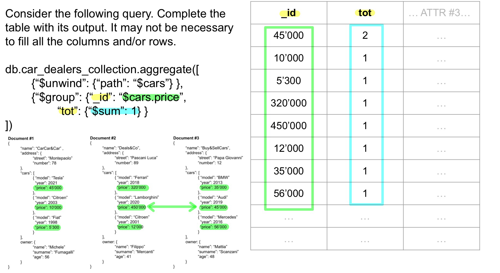
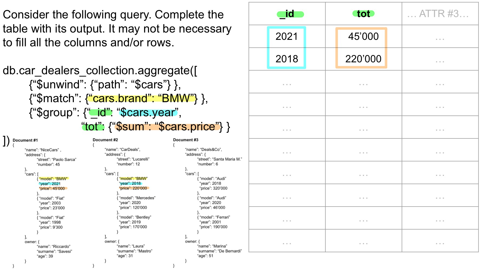

MongoDB is a document-oriented database that stores data within **Collections** as **Documents**

* **Documents** consist of key-value pairs which are the basic unit of data in MongoDB
* **Collections** contain set of documents
* **Databases** are made by one or more collections

# Document Structure

## The ObjectId Type

* **ObjectId** is the type associated with the predefined field created by MongoDB to **uniquely** identify the documents within a collection, like a **Primary Key** in a relational database
* Such field is always named **`_id`**

# Create Documents

* **A document** can be added to a collection using the **`InsertOne(...)`** method

* **Multiple documents** can be added using the **`InsertMany(...)`** method

	

# Create Indexes

* **Indexes** are data structures that **store** a small portion of the collection's data set in an easy to traverse form, ordered by the value of the field

	* **Indexes** support the efficient execution of some types of queries

* Indexes are created with the **`createIndex(...)`** operator which accepts a list of the fields with respect to which create the index and their corresponding ordering, i.e., **ascending (1)** or **descending (-1)**

	

# Nested Documents & Structures

* Documents can contain complex structures, like **sub-documents** or even **collections** of documents

	* In both cases, access to these structures is achieved through the **dot notation**, i.e., `documentName.subDocumentName.fieldName`

	* When accessing a sub-document, the chosen attribute is accessed directly

	* Instead, when accessing collections, the chosen attribute is accessed for each of the documents included in the collection

		

# Collect Documents & Filtering

* A document can be collected using the **`findOne(...)`** method

	* It collects the **first** document that satisfies one or more conditions defined in a **filter**

* Multiple documents can be collected using the **`find(...)`** method

	* It behaves exactly like its individual counterpart, although it collects **all** the documents rather than the first one

		

* Whenever it is necessary to return the **number** of documents collected instead of the documents themselves, the **`countDocuments()`** method can be applied

	​	

# Update Documents

* A document can be updated using the **`updateOne(...)`** method

	* It collects the documents that satisfy one or more conditions defined in a **filter** and updates the **first** one found according to a list of comma-separated fields' updates

		

* Multiple documents can be updated using the **`updateMany(...)`** method. It behaves exactly like its individual counterpart, although it updates **all** the collected documents rather than just the first one

# Delete Documents

* A document can be deleted using the **`deleteOne(...)`** method

	* It collects the documents that satisfy one or more conditions defined in a **filter** and deletes the **first** one found

		

* Multiple documents can be deleted using the **`deleteMany(...)`** method

	* It behaves exactly like its counterpart, although it deletes **all** the collected documents

# Projections

* When collecting documents, it is possible to restrict, explicit, or expand the fields to be returned through **projections**

	* **Projections** are lists of key-value pairs made by the field name and a boolean value representing whether the field will be **returned (1)** or **not (0)**

		

		* The projection specifies that the `birth_date` and `mobile_phone_numbers` fields should be included (with **1**), and it also creates a new field called `year` by extracting the year from the `birth_date` field using the `$year` operator

* Whenever a list specifies a subset of fields **to be** returned, the other ones won't be returned; Conversely, whenever a list specifies a subset of fields **not to be** returned, the other ones will be returned by default
* When performing any **`find(...)`** operation, it is important to notice it can only perform filters and projections in that exact order. Hence, **it won't be possible to project and then filter**.

# Sort & Limit

* When collecting documents, it is possible to sort and limit the results, these operations can be performed through the **`$sort`** and **`$limit`** stages or using the **`sort()`** and **`limit()`** methods

	* The **`sort()`** method (and its equivalent stage) accepts a list of fields and their ordering, i.e., **descending (-1)** and **ascending (1)**

	* The **`limit()`** method (and its equivalent stage) accepts a number representing the number of elements to collect

		

# Query Operators

When collecting documents, these are filtered based on conditions evaluated on the value of their fields, several types of operators can be employed in filtering stages, in particular:

## Logical Query Operators

Operators that return documents based on expressions evaluated as true or false

* **`$and`**: returns documents that match all the conditions of multiple query expressions

* **`$not`**: returns documents that do not match the conditions of a query expressions

* **`$nor`**: returns documents that do not match at least one condition of multiple query expressions

* **`$or`**: returns documents that match at least one condition of multiple query expressions

	

	* The query searches for documents in the `people_collection` where either the name is "Mark Jonhson" or the age is 37
	* If any of these conditions are met, the document will be returned

## Comparison Query Operators

Operators that return documents based on value comparisons

* **`$eq`**: matches values equal to a specified value

* **`$gt($gte)`**: matches values greater (greater or equal) than a specified value

* **`$lt($lte)`**: matches values smaller (smaller or equal) than a specified value

* **`$in`**: matches any of the values specified in an array

* **`$ne`**: matches values not equal to a specified value

* **`$nin`**: matches values not contained in a specified array

	

	* The query returns documents from the `people_collection` that meet at least one of the following criteria
		* The document's age is greater than 19 and less than 31
		* The document's age is not one of the values 40, 41, 42 or 44

## Element Query Operators

Operators that return documents based on field existence or type

* **`$exists`**: matches documents with a specified field

* **`$type`**: matches documents whose chosen field is of a specified type

	

## Evaluation Query Operators

Operators that return documents based on evaluations of individual fields or documents

* **`$text`**: matches documents based on text search on indexed fields

* **`$regex`**: matches documents based on a specified regular expression

* **`$where`**: matches documents based on a JavaScript expression

	

# Querying Nested Documents

* Filtering operations may behave differently based on the type of complex field a query is accessing (e.g., subdocuments, arrays, etc.)

	* Queries evaluating one or more conditions on the fields of a **subdocument** field are not subject to any particular behaviour change

* On the other hand, queries evaluating a **single** condition on the fields of the documents of an **array** will return the **main document** if ==**at least one**== of the documents in the array satisfies the condition

	

	* The query look for documents in the `people_collection` where at least one of the entries in the `mobile_phone_numbers` array has a `service_provider` equal to "Wind"
	* If such an entry exists, the entire document is returned, regardless of how many entries exist in the `mobile_phone_numbers` array

* Whenever **multiple** conditions are evaluated on the documents in an **array** field, they will be accessed individually on the array's documents, hence returning the main document if, for each condition, there exists ==**at least one**== document that satisfies it. <u>It doesn't matter whether there's ==**only one**== document satisfying all conditions or ==**multiple**== documents satisfying one each</u>

	

* Whenever a query is targeted at evaluating **multiple** conditions on the fields of the ==**same**== document of an array, it is necessary to apply the **`$elemMatch`** stage. In particular, <u>it matches documents containing an array field with ==**at least one**== document that satisfies **all** the specified query criteria</u>

	

	* This is crucial when you want to ensure that the conditions apply to the same document within that array rather than across different documents

# unwind

* When a collection is made of documents containing arrays, retrieving the array's content may be useful. Applying the **`$unwind`** stage can achieve such an outcome

	* It shapes the collection so that **each** document is replaced with a set of new ones, i.e., ==**one for each element in the document's array**== on which the unwind stage is applied. These new documents contain all the fields from the main one and a field with the name of the array field that contains one of its documents

	* When applying **`$unwind`** or **`$group`** stages, it is <u>necessary to apply the **`aggregate(...)`** method</u>, i.e., a method to compute aggregate values for the documents in a collection

		

		* The query unwinds the `mobile_phone_numbers` array, resulting in individual documents for each phone number associated with a person
		* i.e., if a person has 10 phone numbers, it will generate 10 individual documents, each document associated with 1 phone number

# Aggregation

* Aggregate operations, i.e., operations aimed at grouping with respect to one or more fields, are achieved by applying the <u>**`$group`** stage within the **`aggregate(...)`** method</u>. Such a stage requires defining the list of fields to perform the aggregation and the aggregation functions to be applied

* Whenever a <u>`$group` stage is applied, only the fields used to perform the aggregation or created by it will be available in the next stages</u>

	* MongoDB supports many aggregate functions, e.g., **`$sum`, `$avg`, `$min`, `$max`**, etc

		

		* The `$wind` stage expands the `mobile_phone_numbers` array so that each phone number is treated as a separate document
		* The `$group` stage then groups these documents by `service_provider`, and counts the total number of phone numbers per provider using `$sum`

* Whenever a grouping operation is to be performed on the whole dataset, it is possible to apply a **dummy `_id`** in the **`$group`** stage

	* It's enough to set the `_id` to **true** or a ==**fixed value**==

		

		* The `$wind` stage expands the `mobile_phone_numbers` array
		* The `$group` stage groups all documents together (since `_id` is set to true) and counts the total number of phone numbers across all documents using `$sum`

	* This is why the ==$== in the grouping stage is important

		

		* Here, `mobile_phone_numbers.service_provider` is treated as a literal string rather than a reference to the actual field in the unwound documents
		* As a result, all grouped documents will have the same `_id` value (i.e., the string `mobile_phone_numbers.service_provider`)

* Whenever an aggregation pipeline is to be employed, it is necessary to explicitly specify all the different pipeline stages (e.g., filtering, projections, etc)

	* In particular, besides the previously explained **`$group`, `$unwind`, `$sort`**, and **`$limit`** stages, **`$match`** defines filters while `$project` defines projections, these stages can be applied interchangeably in the aggregation pipeline

		

# Exercises

