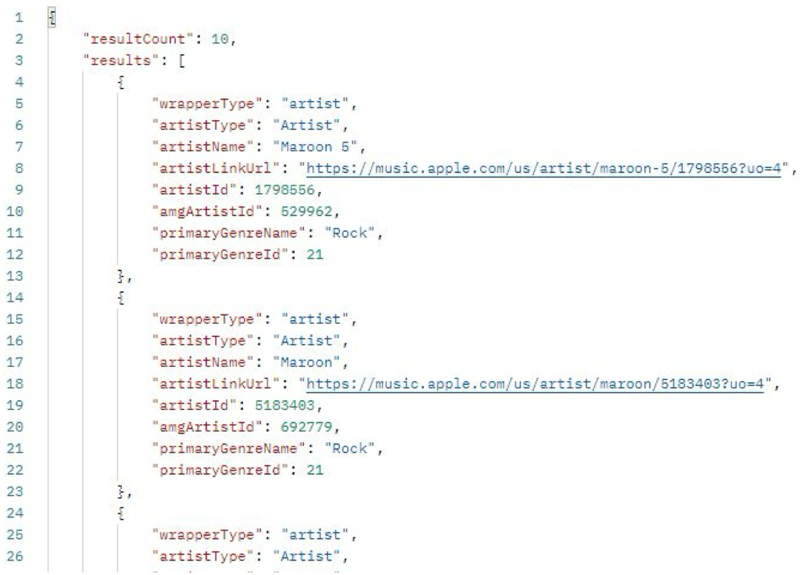
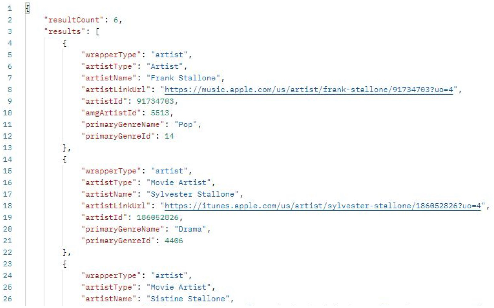

# Example: iTunes Store API

* Retrieve the first 10 artists whose name contains "maroon"

	```http
	https://itunes.apple.com/search?term=maroon&entity=allArtist&attribute=allArtistTerm&limit=10
	```

	* **term=maroon**: Specifies the search keyword “maroon.”
	* **entity=allArtist**: Specifies that only artist entities should be retrieved.
	* **attribute=allArtistTerm**: Specifies that the search should consider the term within all artist-related data.
	* **limit=10**: Limits the response to 10 results.

	

	* **resultCount**: Indicates the number of results (10 in this case).

	* **results**: This array contains individual artist objects, each representing an artist that matches the search criteria.

		Within each artist object:

	* **wrapperType**: Indicates the type of item, in this case, “artist.”

	* **artistName**: Shows the artist’s name (e.g., “Maroon 5”).

	* **artistLinkUrl**: Provides a link to the artist’s page on Apple Music.

	* **primaryGenreName**: Shows the primary genre of the artist (e.g., “Rock”).

	* **amgArtistId** and **artistId**: Unique IDs associated with the artist in the Apple Music database.


* Retrieve all the artist whose surname is "Stallone"

	```http
	https://itunes.apple.com/search?term=Stallone&entity=movieArtist
	```

	* **term=Stallone**: The search term is “Stallone.”
	* **entity=movieArtist**: Specifies that only movie artists (actors or movie-related individuals) should be retrieved.

	


* Retrieve all the "Star Wars" movies

	```http
	https://itunes.apple.com/search?term=StarWars&entity=movie&attribute=movieTerm
	```

	* **term=StarWars**: The search term is “Star Wars.”
	* **entity=movie**: Specifies that the search should only return movie entities.
	* **attribute=movieTerm**: Limits the search to movie-related attributes, ensuring only movie-related results are returned.