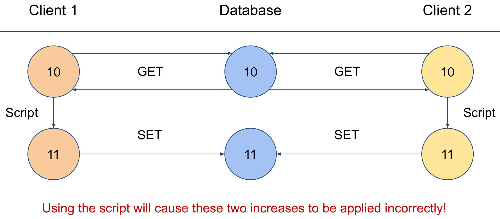
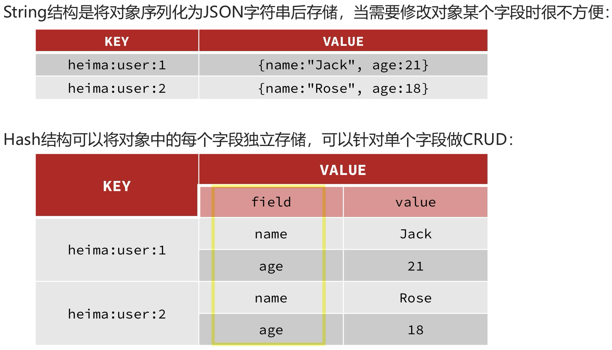

# Introduction

Redis is a **Key-Value** database whose values can be accessed through the name of the key. The stored values can be simple types (e.g., numbers) or complex structures (e.g., lists)


# Storing & Collecting Data (`SET`, `GET`, `EXIST`)

* Storing a single data instance on redis is very easy and can be achieved using the **`SET`** operator

	```sql
	> SET key_name key_value
	```

* Collecting a value is as easy as storing it. It's enough to use the **`GET`** operator. The only requirements is that we need to know the `key_name`

	```sql
	> GET key_name
	```

	Sometimes, before collecting data it's necessary to check the existence of the `key_name` to be sure that the **`GET`** operator is correctly executed

* The **`EXISTS`** operator checks whether a key-value pair with a given `key_name` exists. It returns a value of **1** if the field exists, **0** otherwise

	```sql
	> EXISTS key_name
	```


# Deleting Data (`DEL`)

* Redis also supports the deletion of key-value pairs and through the **`DEL`** operator. The only requirements is that we need to know the `key_name`

	```sql
	> DEL key_name
	```


# Updating Data (`INCR`, `DECR`, `INCRBY`, `DECRBY`)

Numerical key-value pairs can be updated using a series of operators

* **`INCR`** : Increases the value by 1

	```sql
	> INCR key_name
	```

* **`DECR`** : Decreases the value by 1

* **`INCRBY`** : Increases the value by the amount set

	```sql
	> INCRBY key_name value
	```

* **`DECRBY`** : Decreases the value by the amount set


# Atomic Operations

```sql
> x = GET key_name
  x = x + 1
  SET key_name x
```

* The proposed script is a general way of executing the increasing or decreasing operations. Then, why do we need them? The reason is that these operations are ==**Atomic Operations**==

* ==**Atomic Operations**== are not affected by problems in case of **concurrent access**. Let's see what could happen if two different clients try to update the same variable without using the script

	


# Temporary Values (`EXPIRE`, `TTL`)

Redis supports the creation of **temporary key-value pairs**. This can be achieved using the following operators

* **`EXPIRE`** : Set the lifespan of a variable (in seconds)

	```sql
	> SET key_name key_value
	> EXPIRE time_to_live
	```

* **`TTL`** : Returns the remaining lifespan of a variable (in seconds)

	```sql
	> TTL key_name
	```

	The **`TTL`** operator returns the following values

	* **`remaining_lifespan`** : The remaining time the key will be maintained
	* **-1**: The key **will never** expire
	* **-2**: The key **has already** expired

	Furthermore, not only it is possible to set the **`TTL`** when creating the key, but whenever the key is **`SET`**, the **`TTL`** is reset

	```sql
	> SET key_name key_value EX time_to_live
	```

* **`PEXPIRE`** and **`PTTL`** achieved the same operations **in milliseconds**


# Permanently Storing Temporary Variables (`PERSIST`)

* The **`PERSIST`** operator can be used to solve such a problem. It permanently stores a temporary variable on the database

	```sql
	> PERSIST key_name
	```


# Complex Data Structures

## Lists

Redis allows to store and manage complex data structures, like **Lists**

* Creating a list is very simple, it's enough to use the following operators

	* **`RPUSH`** : Puts one or more new elements at the end of the list
	* **`LPUSH`** : Puts one or more new elements at the beginning of the list

* **N.B.** If the key does not exist, it will be created. A key with an **empty** list will be automatically **deleted**

	```sql
	> LPUSH key_name key_value
	```

* The **`LRANGE`** operator can be used to retrieve a subset of values from a list

	```sql
	> LRANGE key_name first_index last_index
	```

	* The values of `first_index` are positive numbers (e.g., 0, 1, etc)
	* The values of `last_index` can be positive or negative numbers (e.g., -1, etc)
		* Negative numbers (e.g., **-N**) means that the operator will return all values besides the last **N-1** values (e.g., -2 means that we are collecting all the elements, besides the last one)

* The **`LPOP`** and **`RPOP`** operators are used to remove items from lists

	```sql
	> LPOP key_name
	```

	* **`LPOP`** : Removes the first item of the list and returns it
	* **`RPOP`** : Removes the last item of the list and returns it

* It is also possible to obtain the length of the list using the **`LLEN`** operator

	```sql
	> LLEN key_name
	```


## Sets

**Sets** are similar to lists but they don't have to specific value order and each value can only appear once per set. **Sets** are useful as it is very quickly to test the existence of a value, which is not as easy when it comes to lists

* **Sets** can be managed using the following operators

	```sql
	> SADD key_name key_value_1 key_value_2 ...
	```

	* **`SADD`** : Adds one or more values to a list. Returns 1 if the element is correctly added, 0 otherwise

	* **`SREM`** : Removes one or more values from a list. Returns 1 if the element is correctly removed, 0 otherwise

* Other very useful set operations are

	* **`SISMEMBER`** : Returns 1 if the value is part of the set, 0 otherwise

		```sql
		> SISMEMBER key_name key_value
		```

	* **`SMEMBER`** : Returns all the members in the set

		```sql
		> SMEMBER key_name
		```

	* **`SUNION`** : Combines two or more sets into one set

		```sql
		> SUNION key_name_1 key_name_2
		```


## Sorted Sets

Since sets are not ordered, Redis introduced the concept of **Ordered Set**. In an **Ordered Set**, each element of the set is assigned to a score that is used to define the order in the set

* An ordered set is created using the **`ZADD`** operator and its elements are retrieved using the **`ZRANGE`** operator

	```sql
	> ZADD key_name key_score key_value_1 ...
	```

	```sql
	> ZRANGE key_name first_index last_index
	```


## Hashes

**Hashes** are the best way to store objects. They are **mappings** between string fields and string values



* **Hashes** are managed using the following operators

	```sql
	HSET key_name field_1 value_1 field_2 value_2 ...
	```

	* **`HSET`** : Creates a hash and assigns one or more string fields with their values to the hash. Numbers are managed in the same way
	* **`HGETALL`** : Returns a hash with its fields
	* **`HGET`** : Returns a single field from a hash