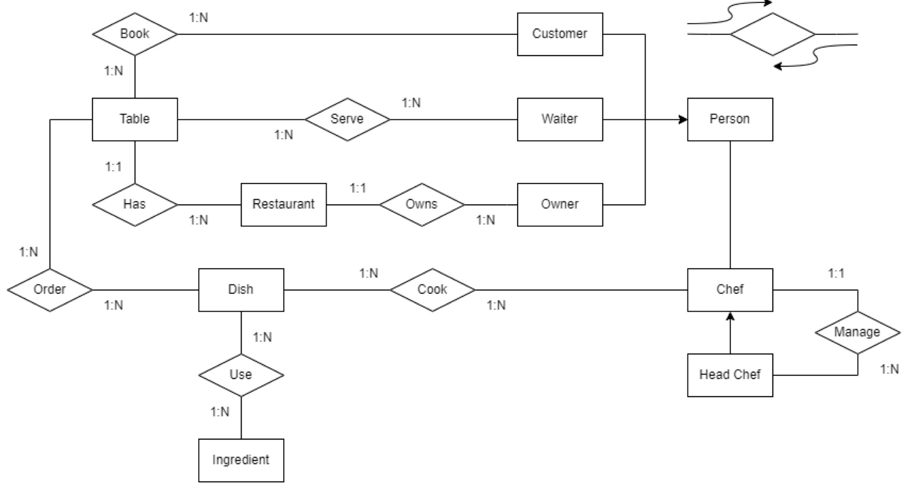

# Simulation


* **Assumptions**:

	* **Seller** is described by a name, a unique seller identifier, and an IBAN code number.
	- The **own relationship** (marked in red) can be removed since it is possible to get the trucks owned by a storehouse by exploring the other relationships (assuming each courier works for a single storehouse, otherwise, it is necessary to keep it).
	- **Delivery Address** is a weak entity whose primary key is made of the combination of the primary key of the account and the address attribute (the same is true for the payment method).
	- **Customer** and **Courier** are both people. Hence, it is possible to create an ISA relationship between those entities and a new entity named **“Person”**.
	- The **include relationship** has a **“quantity”** attribute.
	- The **use relationship** has **“starting datetime”** and **“ending datetime”** properties.

	


## Ex1: Unstructured data models

==Which DB technology would be the best to store the different groups of entities in your ER diagram? For each DB technology, provide the list of entities that would be stored and the motivations (e.g., "Documental DB" - "Entity 1, Entity 2, etc." - "Motivation").==

| Entities/Rel.                                            | DB Type       | Motivation                                                   |
| -------------------------------------------------------- | ------------- | ------------------------------------------------------------ |
| Seller, Product, Order, Storehouse, Courier, Truck, ...  | MongoDB       | Given the large number of entities that would be created in this part of the diagram, I choose MongoDB as the main technology for these entities, given its **scalability** |
| Customer, Account, Delivery Address, Payment Method, ... | Elasticsearch | These entities mainly involve textual fields on which Amazon would like to perform **efficient indexing and search**, and Elasticsearch is the best DB technology to perform these operations efficiently |


## Ex2: Neo4j

Provide an example of a simple graph describing the aforementioned nodes and their properties. Be coherent with your ER Diagram.


Write a query to extract each customer’s total amount of money spent on Amazon.

```sql
MATCH (c:Customer) - [r1:Create] -> (a:Account) - [r2:Perform] -> (o:Order) - [r3:Include] -> (p:Product)
WITH c, SUM(p.price * r3.quantity) AS 'tot_price'
RETURN c, tot_price
```


==Write a query to extract the list of all products ordered by a customer between 10/12/2022 and 24/12/2022 whose associated order costs more than 100€.==

```sql
-- Match the orders that costs more than 100
MATCH (o:Order) - [r:Include] -> (p:Product)
WITH o, SUM(p.price * r.quantity) AS 'tot_price'
WHERE tot_price > 100 AND o.date > 10/12/2022 AND o.date < 24/12/2022
-- Return the customer and the list of orders (the solution is still a single query)
MATCH (c:Customer) - [r1:Create] -> (a:Account) - [r2:Perform] -> (o:Order) - [r3:Include] -> (p:Product)
RETURN c, collect(DISTINCT p) -- return collections
```


## Ex3: MongoDB

Describe the proper structure of their documentsand the structure you would apply to model their relationships. Be coherent with your ER Diagram. Providing an improper structure in this part of the exercise may penalise the following ones (3.2, 3.3, and 3.4). *Do remember to not include loops in the representation (if warehouse contains orders, then the orders do not contain the warehouse. In the solution, the order containing the courier and vice-versa is redundant.*

```sql
Warehouse {
	-- attributes
	assigned_orders: Collection<Order>,
	stored_products: Collection<Product>,
	assigned_couriers: Collection<Courier>
}

Order {
	-- attributes
	products: Collection<Product>,
	assigned_couriers: Collection<Courier>
}

Product {
	-- attributes
}

Courier {
	-- attributes
}
```


Write a query to extract all the couriers whosebirth year is earlier than 2000 (use the `year()` function to extract the year from the birth date) and who are assigned to a warehouse in Milan.

```sql
db.warehouses_collection.aggregate([
	{"$match": {"location": "Milan"}},
    {"$unwind": {"path": "$couriers"}},
    {"$match": {"couriers.birthdate.year()": {"$gt": 2000}}}
])
```


Write a query to extract the top 5 warehouses per number of orders delivered after 23/12/2022

```sql
db.warehouses_collection.aggregate{[
    {"$unwind": {"path": "assigned_orders"}},
    {"$match": {"assigned_orders.delivery_date": {"$gt": "23/12/2022"}}},
    {"$group": {
    	"_id": {"city": "$city", "address": "$address", "country": "$country"},
    	"count": {"$sum": 1}
    }}
]}
.sort({"count": 1}).limit(5)
```


Write a query to extract the number of orders for which **at least one** of the ordered products costs more than 100 euros **and** is sold by a seller named "Mondadori"

```sql
db.orders_collection.count({
	"products": {
    	"$elemMatch": {
        	"price": {"$gt": 100},
            "seller.name": "Mondadori"
    	}                       
	}                           
})
```


## Ex4: Elasticsearch

Describe the **full mapping** to define the documents of the entities involved (independently). Be coherent with your ER diagram

```http
PUT /product_index/_mapping
{
	"properties": {
		// list of product attributes
	}
}
```

```http
PUT /order_index/_mapping
{
	"properties": {
		// list of order attributes
	}
}
```


Write a query to extract all the products whose description **contains** the words "waterproof" and "leather", **prioritising** the products whose name contains the word "backpack"

```http
GET /product_index/_search
{
	"query": {
		"bool": {
			"must": [
				{"match": {"description": "waterproof"}},
				{"match": {"description": "lether"}}
			]
			"should": [{"match": {"name": "backpack"}}]
		}
	}
}
```


Write a query to extract the number of orders per order status

```http
GET /product_index/_search
{
	"query": {
		"size": 0,
		"aggs": {
			"order_per_status": {
				"term": {"field": "order_status"}
			}
		}
	}
}
```


## Ex5: Cassandra

Write a query to create a table for the aforementioned entity. Be coherent with your ER Diagram

```sql
CREATE TABLE Customer {
	-- list of customer attributes
	PRIMARY KEY (personal_id, name, surname)
}
```


Write a query to extract the customers whose name is "Riccardo"

```sql
-- Index creation since there is no primary key on name!!
CREATE INDEX name_index ON Customer(name)

-- Query
SELECT *
FROM Customer
WHERE name = "Riccardo"
```


# Exam20240624


The following attributes describe the entities. The primary keys are underlined

- **Company Section**: <u>ID</u>, Name, Description, Number of Employees
  
- **Digital Content**: <u>Title</u>, Release Date, Duration, Production Cost, Minimum Age
  - **Series**: Number of Episodes, ...
  - **Movie**: Sequence Number, Nominated for Award (Yes/No), ...
    - **Animated Movie**: ...
  
- **Character**: <u>Name</u>, Nickname, Age
  
- **Actor**: Personal ID, Name, Surname, Age, Birth Date, Career Description
  - **Voice Actor**: Voice Tone, Voice Strength (from -5 to 5)
  
- **Script**: <u>ID</u>, Length, Duration, Title
  
- **Location**: <u>ID</u>, Name, Description, Furniture (Text), Indoor (Yes/No)
  
- **Line**: <u>ID</u>, Sequence Number, Text

The following attributes describe the relationships

- **Perform**: Recording Date
  
- **Produce**: Starting Date, End Date


## Ex1: Unstructured data models


## Ex2: Neo4j

Consider the entities Character, Actor, Voice Actor, and Line from the ER model. Suppose you want to store the respective data instances in a graph database.

Sketch a graph model/example describing the nodes, main attributes, and edges. Either show an example graph or a graph with types.


Write a Cypher query to collect the total number of lines that were performed by actors named “Mark” who performed at least 100 lines with at least three characters

```sql
MATCH (a:Actor) - [r1:Perform] -> (l:Line)
WITH a, COUNT(l) AS 'tot_lines'
WHERE a.name = "Mark" AND tot_lines >= 100
MATCH (a) - [r2: Play] -> (c:Character)
WITH COUNT(DISTINCT c) AS 'tot_characters'
WHERE tot_characters >= 3
MATCH (a) - [r1] -> (l)
WITH COUNT(l) AS 'TOT_lines'
RETURN TOT_lines
```


Write a Cypher query to return the collection of voice actors who played at least 15 characters nicknamed "Jack" and who acted at least once as "Morpheus", performing at least 1000 lines in the latter role

```sql
MATCH (va:Voice_actor) - [In] -> (Actor) -> [Play] -> (c1:Character)
WITH va, COUNT(c1) AS 'tot_Jack'
WHERE c1.nickname = "Jack" AND tot_Jack >= 15
MATCH (va) - [In] -> (Actor) -> [Play] -> (c2:Character)
WITH va, COUNT(c2) AS 'tot_Morpheus'
WHERE c2.name = "Morpheus" AND tot_Morpheus >= 1
MATCH (va) - [In] -> (Actor) -> [Play] -> (c2), (va) - [In] -> (Actor) -> [Perform] -> (l:Line)
WITH va, COUNT(l) AS 'tot_lines'
WHERE tot_lines >= 1000
RETURN collect(va)
```


## Ex3: MongoDB

Consider the entities Company Section, Digital Content, Series, Movie, Animated Movie, and Script (and all its child entities). How many collections would you define within a documental database? How would you implement the relations between the concepts? Provide a simple documental representation.

```sql
CompanySection {
	digital_contents: Collection<DigitalContent>
}

DigitalContent {
	series: Collection<Series>,
	movies: Collection<Movie>
}

Series {
	scripts: Collection<Script>
}

Movie {
	animated_movies: Collection<AnimatedMovie>
}

AnimatedMovie {
	scripts: Collection<Script>
}

Script {

}
```


==Write a query to return the number of digital content generated by each company section,== keeping only the ones who produced at least 20 of them.

```sql
db.company_section_collection.aggregate([
    {"$project": {
    	"_id": 1,
    	"digital_contents_count": {"$size": "$digital_contents"}
    }},
    {"$match": {"digital_contents_count": {"$gte": 20}}}
])
```


Write a query to count the number of series produced by a company section named "Digital Artist & Co" with ID "908686" and for which at least one script includes the word "Pier" in its title

```sql
db.company_section_collection.aggregate([
    {"$elemMatch": {
    	"name": "Digital Artist & Co",
    	"ID": "908686"
    }},
    {"$unwind": {"path": "$digital_contents.series"}},
    {"$match": {"title": "Pier"}},
    {"$group": {
    	"_id": 
    }}
])
```


## Ex4: Elasticsearch

Provide the complete mapping of the index (i.e., field name, field type, the structure of the mapping, etc)

```http
PUT location_index/_mapping 
{
	"properties": {
		"ID": {
			"type": "keyword"
		},
        "Name": {
        	"type": "text"
        }, 
        "Description": {
        	"type": "text"
        }, 
        "Furniture": {
        	"type": "text"
        }, 
        "Indoor": {
        	"type": "boolean"
        }
	}
}
```


Write a query to return the list of Locations whose description includes the words "Stadium" and "Basketball", assignning a higher score to those including the words "Planet" in their furniture and "Space" in their description

```http
GET location_index/_search
{
	"query": {
		"bool": {
			"must": [
				"match": {"Description": "Stadium"},
				"match": {"Description": "Basketball"}
			],
			"should": [
				"match": {"Furniture": "Planet"},
				"match": {"Description": "Space"}
			]
		}
	}
}
```


Write a query to return the count of indoor and outdoor locations

```http
GET location_index/_search
{
	"query": {
		"size": 0,
		"aggs": {
			"count_of_indoor_and_outdoor": {"term": {"field": "Indoor"}}
		}
	}
}
```


## Ex5: Redis

Consider the Line table

Write the Redis code to create a new list of lines involving the lines "Hey you", "Watch out", and "Hello there"

```sql
# Add items to the list
LPUSH myList "Hey you"
LPUSH myList "Watch out"
LPUSH myList "Hello there"

# To confirm the items were added to the list, you can use the LRANGE command
LRANGE myList 0 -1
```


Write the Redis operation to collect the first three lines in the list

```sql
LRANGE myList 0 2
```


Write the Redis operations to create a new key-value pair named "Line #0001" with the value "A long time ago in a galaxy far, far away" and check its lifespan

```sql
SET "Line #0001" "A long time ago in a galaxy far, far away"
TTL "Line #0001"
```


# Exam20240216


The following attributes describe the entities. The primary keys are underlined.

* **Company** - <u>Code</u>, Name, Founding Date
* **Game** - Number of Players, Minimum Age, Publication Date
	* **Card Game** - <u>Name</u>, <u>Set Number</u>, (…)
	* **Board Game** - <u>Name</u>, Duration (in Minutes), Description, (…)
	* **Expansion** - <u>Name</u>, Expansion Number, Description, (…)

* **Card** - <u>Card Number</u>, Name, Type, Description
* **Game Piece** - <u>Piece Number</u>, Color, Description
* **Rule Book** - <u>Rulebook Code</u>, Title, Introduction
* **Rule** - <u>ID</u>, Rule Number, Description


## Ex1: Neo4j

Consider the Board Game, Expansion, Game Piece, Rule Book, and Rule entities


Write a Cypher query to collect the number of board games with a duration greater than 10 minutes for which at least three expansions were released

```sql
MATCH (bg:BoardGame) - [r:EXPANDS] -> (e:Expansion)
WITH bg, COUNT(e) AS 'tot_expansions'
WHERE bg.duration > 10 AND tot_expansions >= 3
MATCH (bg)
RETURN COUNT(bg)
```


Write a Cypher query to collect the rule books assigned to board games with at least 10 game pieces, including at least two whose description is "Player Marker". Among those, consider only board games for which at least one and at most three expansions were created

```sql
MATCH (bg:BoardGame) - [:EXPANDS] -> (e:Expansion)
WITH bg, COUNT(e) AS 'tot_expansions'
WHERE tot_expansions >= 1 AND tot_expansions <= 3

MATCH (bg) - [:CONTAINS] -> (gp:GamePiece)
WITH bg, COUNT(gp) AS 'tot_game_pieces'
WHERE tot_game_pieces >= 10


MATCH (bg)-[:CONTAINS]->(gp)
WHERE gp.description = "Player Marker"
WITH bg, COUNT(gp) AS 'marker_count'
WHERE marker_count >= 2

MATCH (bg)-[:CONTAINS]->(rb:RuleBook)
RETURN bg, collect(rb)
```


## Ex2: MongoDB

Consider the Card Game, Card, Expansion, and Rule entities

```sql
CardGame {
	cards: Collection<Card>
	expansions: Collection<Expansion>
	rules: Collection<Rule>
}

Card {

}

Expansion {

}

Rule {

}
```


Write a query to collect all the card games whose set number is greater than 10 and for which at least one card has its type equal to "sorcery". Perform the query starting from the `Card_Game_Collection`

```sql
db.card_game_collection.aggregate([
    {"$match": {"set_number": {"$gt": 10}}},
    {"$match": {"cards.type": "sorcery"}}
])
```


Write a query to count the number of cards for each card type, finally returning only the types whose count is greater than 100 or less than 10. Perform the query starting from the `Card_Game_Collection`

```sql
db.card_game_collection.aggregate([
    {"$unwind": {"path": "cards"}},
    {"$group": {
    	"_id": "$cards.type",
    	"number_of_cards": {"$sum": 1}
    }},
    {"$match": {
    	"$or": [
            {"number_of_cards": {"$gt": 100}},
            {"number_of_cards": {"$lt": 10}}
        ]
    }}
])
```


Write a query to count the number of card games with at least three expansions, one of which should be named "Ice Age", and at least one card named "Mystic Remora", whose type is "Enchantment". Perform the query starting from the `Card_Game_Collection`

```sql
db.db.card_game_collection.aggregate([
    {"$match": {
    	"cards": {
    		"$elemMatch": {
    			"name": "Mystic Remora",
    			"type": "Enchantment"
    		}
    	}
    }},
    
    {"$match": {
    	"expansions": { 
        	"$elemMatch": {"name": "Ice Age" }, -- At least one expansion named "Ice Age"
            "$size": {"$gte": 3 }               -- At least three expansions
        }
    }},
    
    -- count
    {"$group": {
    	"_id": true,
    	"count": {"$sum": 1}
    }}
])
```


## Ex3: Elasticsearch

Consider the Board Game entity

```http
PUT board_game_index/_mapping 
{
	"properties": {
		"Name": {
			"type": "keyword"
		},
		"Duration": {
			"type": "text"
		}, 
		"Description": {
			"type": "text"
		}
	}
}
```


Write a query to collect all the board games whose description **includes** the word "hero" and **does not include** the word "adventure". The word "hero" should not increase the final score. Finally, assign a higher score to board games whose minimum age is greater than 18

```http
GET board_game_index/_search
{
	"query": {
		"bool": {
			"filter": [{"match": {"description": "hero"}}],
			"must_not": [{"match": {"description": "adventure"}}]
			"should": [{"range": {"age": {"gt": 18}}}]
		}
	}
}
```


Write a query to count the number of board games for each duration. Only consider those that were published over the last 10 years

```http
GET board_game_index/_search
{
	"query": {
		"range": {
			"publish_date": {
				"gte": "now-10y/y",
				"lte": "now"
			}
		},
		"size": 0,
		"aggs": {
			"board_games_per_each_duration": {
				"term": {
					"field": "duration"
				}
			}
		}
	}
}
```


## Ex4: Redis

Consider the Card entity and perform the following operations

Create a new key-value pair name whose value is "Magic, The Gathering"

```sql
Set name "Magic, The Gathering"
```


Check whether a key-value pair with key "Magic" exists

```sql
EXISTS Magic
```


Create a list and add two elements, one with the value "Human" and the other with the value "Vampire"

```sql
LPUSH myList "Human" "Vampire"
```


Return all the elements of the list and the number of elements it contains

```sql
LRANGE myList 0 -1
LLEN myList
```


# Exam20240109


The following attributes describe the entities. The primary keys are underlined.

* **Supermarket** - Name, Location (Address, City, State), <u>Supermarket_ID</u>
* **Employee** - Name, Surname, BirthDate, <u>Employee_ID</u>, HiringDate
	* **Manager** - (…)
	* **Department Manager** - (…)

* **Department** - Name, <u>Department_ID</u>, Description
* **Product** - Name, <u>Product_ID</u>, Price, Description, Sale (%)
	* **Household Product** - (…), Dangerous (Yes/No)
	* **Food** - (…), ExpiryDate
	* **Beauty** - (…)

* **Customer** - Name, Surname, Email, <u>Personal_ID</u>, BirthDate
* **Fidelity Card** - <u>FC_Number</u>, IssuingDate

The following attributes describe the relationships.

* **Order** - Quantity
* **Buy** - Quantity

**N.B.** Managers do not manage other Managers. Managers only manage Employees and Department Managers. A manager manages all the employees in a supermarket. There’s only one manager per supermarket.


## Ex2: Neo4j

Consider the entities Employee, Manager, Department Manager, and Department from the ER model and suppose you want to store the respective data instances in a graph database.

Sketch a graph model/example describing the nodes, main attributes, and edges. Either show an example graph or a graph with types.


Write a Cypher query to collect the number of department managers managed by a manager who manages at least 30 employees for each manager <font color=red>(remember that department managers are Employees)</font>

```sql
MATCH (m:Manager) - [:MANAGES] -> (e:Employee)
WITH m, COUNT(e) AS 'employees_count'
MATCH (m) - [:MANAGES] -> (dm:DepartmentManager)
WITH m, employees_count + COUNT(dm) AS tot_manages_count
WHERE tot_manages_count >= 30

RETURN COUNT(dm)
```


Write a Cypher query to return the collection of departments managed by a department manager hired later than its manager and who works in a supermarket with at least 5 department managers

```sql
MATCH (s:Supermarket) <- [:WORKS] - (dm:DepartmentManager)
WITH s, COUNT(dm) as 'department_managers_count'
WHERE department_managers_count >= 5

MATCH (m:Manager) - [:MANAGES] -> (dm) - [:MANAGES] -> (d:Department)
WHERE m.HiringDate < dm.HiringDate
RETURN collect(d)
```


## Ex3: MongoDB

Consider the Fidelity Card, Customer, Product (with all its child entities). How many collections would you define? How would you implement the relations between the concepts? Provide a simple documental representation

```sql
Customer {
	fidelityCards: Collection<FedelityCard>,
	products: Collection<Product>
}

FidelityCard {
	
}

Product {

}
```


Write a query to count the number of products bought by customers named "Fernando" and whose fidelity card was issued later than 02/01/2020. Perform the query starting from `Customer_Collection`

```sql
db.Customer_Collection.aggregate([
    {"$match": {"name": "Fernando"}},
    {"$match": {"fidelityCards.issuing_date": {"$gt": "02/01/2020"}}},
    {"$unwind": {"path": "products"}},
    {"$group": {
    	"_id": true,
    	"products_count": {"$sum": 1}
    }}
])
```


Write a query to collect the list of all the products whose price is greater than 10 euro and whose sale is equal to 10%. Return only its Product_ID. Perform the query starting from `Product_Collection`

```sql
db.Product_Collection.aggregate([
    {"$match": {"price": {"$gt": 10}}},
    {"$match": {"sale": {"$gt": 10}}},
    {"$project": {
    	"project_id": 1
    }}
])
```


Write a query to count the number of products each customer bought on sale. Perform the query starting from `Customer_Collection`

**N.B.** Only customers with a Fidelity Card can access sales

```sql
db.Customer_Collection.aggregate([
    {"$match": {"fidelityCards": {"$ne": []}}} -- Ensure customers have a fidelity card
    {"$unwind": {"path": "$products"}},
    {"$match": {"products.sale": {"$gt": 0}}},
    {"$group": {
    	"_id": "$_id",
    	"product_on_sale_count": {"$sum": 1}
    }}
])
```


## Ex4: Elasticsearch

Consider the Household Product entity

Provide the complete mapping of the index (i.e., field name , field type, the structure of the mapping, etc.)

```http
PUT household_product_index/_mapping
{
	"properties": {
		...
		
		"Dangerous": {
			"type": "boolean"
		}
	}
}
```


Write a query to return the list of all the products whose description includes the words "Cleaning" and "Mirror", prioritising the dangerous ones

```http
GET household_product_index/_search
{
	"query": {
		"bool": {
			"must": [
				{"match": {"description": "Cleaning"}},
				{"match": {"description": "Mirror"}}
			],
			"should": [
				{"term": {"dangerous": true}}
			]
		}
	}
}
```


Write a query to return the list of all the products whose prices exceed 10.00 euro, whose sale is more than 10%, and whose descriptions do not include the word "Floor". The condition on the sale attributes must not affect the final score

```http
GET household_product_index/_search
{
	"query": {
		"bool": {
			"must": [{
				"range": {
					"price": {"$gt": 10}
				}
			}],
			"filter": [{
				"range": {
					"sale": {"$lt": 10}
				}
			}],
			"must_not": [{
				"match": {
					"description": "Floor"
				}	
			}]
		}
	}
}
```


## Ex5: Cassandra

Consider the Customer table. Write a Cassandra script to perform the operations listed below

Create the Customer table, with `Personal_ID` as the partition key and email as the clustering key, ordering the table based on the email

```CQL
CREATE TABLE Customer (
    Personal_ID uuid,
    Name text,
    Surname text,
    email text,
    Birth_date text
	PRIMARY KEY (Personal_ID))
WITH CLUSTERING ORDER BY(email ASC);
```


Write a CQL query to collect the customer whose e-mail is "gastani.frinzi@gmail.com". If any further operation is required, write its CQL code

```CQL
SELECT * FROM Customer WHERE email = "gastani.frinzi@gmail.com"
ALLOW FILTERING;
```


Create a Custom data type named "full name" that contains both the name and the surname of the customer

```CQL
CREATE TYPE Full_name (
	name text,
	surname text);
```


# Exam20240906



The following attributes describe the entities. The primary keys are underlined.

* **Person** - <u>Personal_ID</u>, Name, Surname, Birth Date, Phone Number
	* **Owner** - (…), Owner Since, E-mail
	* **Customer** - (…), E-mail
	* **Waiter** - (…), Hiring Date
	* **Chef** - (…), Hiring Date
		* **Head Chef** - (…), Head Chef Since
* **Restaurant** - <u>Restaurant_ID</u>, Name, Maximum Number of Guests, Address, Phone Number
* **Table** - <u>Table_ID</u>, Table Number, Max Seats
* **Dish** - <u>Dish_ID</u>, Name, Price, Recipe, Description
* **Ingredient** - <u>Ingredient_ID</u>, Name, Allergies (Yes/No)

The following attributes describe the relationships:

* **Book** - Number of People, Booking Date

**N.B.** 

There is only **one Head Chef per Restaurant**.

Tables are served by more Waiters overall, but only **one at a time**.

Dishes are cooked by more Chefs overall, but only **one at a time**.


## Ex1: Unstructed Data Models


## Ex2: Neo4j

Consider the entities Customer, Table, Waiter, and Dish from the ER model and suppose you want to store the respective data instances in a graph database.

Sketch a graph model/example describing the nodes, main attributes, and edges. Either show an example graph or a graph with types.


Write a Cypher query to collect the total number of different dishes that were served at each table, considering only tables whose max seats is greater than 10 and served by at least one waiter whose name is ‘Federico’

```sql
MATCH (w:Waiter) - [:SERVES] -> (t:Table) - [:ORDERS] -> (d:Dish)
WHERE t.max_seats >= 10 AND w.name = "Federico"
RETURN COUNT(DISTINCT d)
```


Write a Cypher query to collect the total number of customers served by each waiter, considering only customers who booked a table before 18/08/2024 and who ordered at least 5 dishes during one of their reservations.

```sql
MATCH (c:Customer) - [r:BOOKS] -> (t:Table) - [:ORDERS] -> (d:Dish)
WHERE r.booking_date < "18/08/2024"
WITH c, t, COUNT(d) AS 'dishes_count'
WHERE dishes_count >= 5
MATCH (c) - [r] -> (t) <- [:SERVES] - (w:Waiter)
WITH w, COUNT(DISTINCT c)
```


## Ex3: MongoDB

Consider the Head Chef, Chef, Dish, and Ingredient. How many collections would you define? How would you implement the relations between the concepts? Provide a simple documental representation. **N.B.** A Head Chef is a Chef

```sql
Chef {
	is_head_chef: Boolean
	become_head_chef_date: String
	dishes: Collection<Dish>
	managed_chefs: Collection<Chef>
}

Dish {
	ingredients: Collection<Ingredient>
}

Ingredient {

}
```


Write a query to count the number of chefs managed by a chef named ‘Antonio’ who became a head chef after 02/01/2023. Perform the query starting from the `Chef_Collection` or `Sub_Collection`

```sql
db.Chef_Collection.aggregate([
    {"$match": {"name": "Antonio"}},
    {"$match": {"is_head_chef": true}},
    {"$match": {"become_head_chef": {"$gt": "02/01/2023"}}},
    {"$unwind": {"path": "$managed_chefs"}},
    {"$group": {
    	"_id": "$_id",
    	"managed_chefs_count": {"$sum": 1}
    }}
])
```


Write a query to collect the total amount of each ingredient that each chef named ‘Matteo’ used to cook. Return only its Product_ID. Perform the query starting from the `Chef_Collection` or `Sub_Collection`

```sql
db.Chef_Collection.aggregate([
    {"$match": {"name": "Matteo"}},
    {"$unwind": "$dishes"},
    {"$unwind": "$dishes.ingredients"},
    {"$group": {
    	"_id": "$dishes.ingredients.product_id",
    	"ingredients_count": {"$sum": 1}
    }}
])
```


Write a query to count the number of chefs who cooked at least one dish named ‘Octopus with Potatoes’, which cost 25.00€. Perform the query starting from the `Chef_Collection` or `Sub_Collection`

```sql
db.Chef_Collection.aggregate([
    {"$match": {
    	"dishes": {
    		"$elemMatch": {
    			"name": "Octopus with Potatoes",
    			"cost": 25
    		}
    	}
    }},
    {"$group": {
    	"_id": true,
    	"count": {"$sum": 1}
    }}
])
```


## Ex4: Elasticsearch

Consider the Dish entity

Provide the complete mapping of the index (i.e., field name, field type, the structure of the mapping, etc.)

```http
PUT /dish_index/_mapping
{
	"properties": {
		"Dish_ID": {
			"type": "keyword"
		},
		"Name": {
			"type": "text"
		}, 
		"Price": {
			"type": "float"
		}, 
		"Recipe": {
			"type": "text"
		}, 
		"Description": {
			"type": "text"
		}
	}
}
```


Write a query to return the list of all the dishes whose description and name include the word "salmon", prioritising the one whose recipe includes the words "stir" or "boil"

```http
GET /dish_index/_search
{
	"query": {
		"bool": {
			"must": [
				{"match": {"description": "salmon"}},
				{"match": {"name": "salmon"}}
			],
			"should": [
				{"match": {"recipe": "stir"}},
				{"match": {"recipe": "boil"}}
			]
		}
	}
}
```


Write a query to return the list of all the dishes whose price exceeds 10.00€, whose name is “focaccia ligure”, and whose descriptions do not include the word “butter”. The condition on the description attribute must not affect the final score

```http
GET /dish_index/_search
{
	"query": {
		"bool": {
			"must": [
				{"range": {
					"price": {
						"gt": 10
					}
				}},
				{"term": {"name": "focaccia"}}
			],
			"must_not": [
				{"match": {"description": "butter"}}
			]
		}
	}
}
```


## Ex5: Cassandra

Consider the Chef table. Write a Cassandra script to perform the operations listed below

Create the Chef table, with Personal_ID as the partition key and Phone Number as the clustering key, ordering the table based on the Phone Number

```CQL
CREATE TABLE Chef (
	Personal_ID uuid,
    name text, 
    surname text,
    birth_date date, 
    phone_number text,
	hiring_date date,
    PRIMARY KEY (personal_id))
WITH CLUSTERING ORDER BY (phone_number ASC);
```


Write a CQL query to collect the chef whose name is “Riccardo”. If any further operation is required, write its CQL code

```CQL
SELECT * FROM Chef WHERE name = "Riccardo"
ALLOW FILTERING;
```


Create a Custom data type named “contact” that contains the name, surname, and phone number of the chef

```CQL
CREATE TYPE Contact (
	name text,
    surname text, 
    phone_number text
);
```

