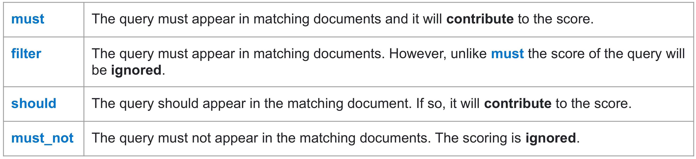

# MongoDB

* Count the total number:

	```sql
	"$group": {
	    "_id": true,
	    "count": {"$sum": "1"}
	}
	```

* At least three expansions, one of which should be named "Ice Age"

	```sql
	{"$match": {
	    "expansions": { 
	    	-- At least one expansion named "Ice Age"
	        "$elemMatch": {"name": "Ice Age" },
	        -- At least three expansions
	        "$size": {"$gte": 3 }
	    }
	}}
	```

* Ensure customers have a fidelity card

	```sql
	{"$match": {"fidelityCards": {"$ne": []}}} -- fidelityCards is a Collection
	```


# Elasticsearch

* Provide the complete mapping of the location index:

	```http
	PUT location_index/_mapping 
	{
		"properties": {
			"ID": {
				"type": "keyword" // primary key
			},
	        "Name": {
	        	"type": "text"
	        }, 
	        "Description": {
	        	"type": "text"
	        }, 
	        "Furniture": {
	        	"type": "text"
	        }, 
	        "Indoor": {
	        	"type": "boolean"
	        }
		}
	}
	```

* Define the full mapping describing a Person with **10 shards and 3 replicas**

	```http
	PUT person_index
	{
		"settings": {
			"number_of_shards": 10,
			"number_of_replicas": 3
		},
		"mappings": {
			"properties": {
				"personal_id": {
					"type": "keyword"
				},
				"name": {
					"type": "text"
				},
				"surname": {
					"type": "text"
				},
				"birth_date": {
					"type": "date",
					"format": "yyyy-MM-dd"
				},
				"height": {
					"type": "integer"
				}
			}
		}
	}
	```

* Boolean Queries:

	

	```http
	GET /steam_overviews/_search
	{
	  "query": {
	    "bool": {
	      "must": [
	        { "match": { "tags": "Multiplayer" } }
	      ],
	      "filter": [
	        { "term": { "publisher": "Ubisoft" } }
	      ],
	      "should": [
	        { "match": { "tags": "Action" } }
	      ]
	    }
	  }
	}
	```

* Range Queries:

	```http
	GET /steam_overviews/_search
	{
	  "query": {
	    "range": {
	      "publish_date": {
	      	// Matches documents published within the last 10 days (from now, down to the beginning of each day)
	        "gte": "now-10d/d",
	        "lte": "now"
	      }
	    }
	  }
	}
	```


* Or

	```http
	GET /steam_overviews/_search
	{
	  "query": {
	    "match": {
	      "overview": {
	        "query": "free-to-play",
	        "operator": "or"
	      }
	    }
	  }
	}
	```

* Aggregation: 

	```http
	GET /steam_overviews/_search
	{
	  "size": 0,
	  "aggs": {
	    "games_per_publisher": {
	      "terms": {
	        "field": "publisher"
	      }
	    }
	  }
	}
	```


# Cassandra

* Create a keyspace named `car_dealer`

	```CQL
	cqlsh> CREATE KEYSPACE car_dealer
		   WITH replication = {'class': 'SimpleStrategy', 
		   					   'replication_factor': 3};
	```


* Check the existence of the keyspace

	```CQL
	cqlsh> DESCRIBE keyspaces;
	```

	```CQL
	cqlsh> DESCRIBE car_dealer;
	```


* Create a table named `car` within the keyspace with the following attributes **`car_id` (uuid, primary key)**, `brand` (textual), `max_speed` (integer), `price` (float), **`consumption_lt_per_km` (float) and sorted by `max_speed` in `ascending` order**

	```CQL
	cqlsh:car_dealer> CREATE TABLE Car (
					      car_id uuid,
	    				  brand text,
	    				  max_speed varint, // integer
	    				  price float,
	    				  consumption_lt_per_km float,
	    				  PRIMARY KEY (car_id))
					  WITH CLUSTERING ORDER BY (max_speed ASC);
	```

	

* Add a new column to the table, named `features` that contains the set/list of features of the cars (e.g., air conditioning, etc.). Each `feature` is made of name and description

	```CQL
	cqlsh:car_dealer> CREATE TYPE feature (
					  	  name text,
	    				  description text);
	```

	```CQL
	cqlsh:car_dealer> ALTER TABLE car
					  ADD features list<frozen<feature>>;
	```

	* When using a user-defined data type, it is necessary to use the ==**frozen**== keywords. A frozen data type can only be overwritten, it can't edited anymore


* As we do not want to deal with complex fields, let's remove the `features` field

	```CQL
	cqlsh:car_dealer> ALTER TABLE car
					  DROP features;
	```

	

* Insert a new value in the table (use the function `uuid()` to get a unique identifier)

	```CQL
	cqlsh:car_dealer> INSERT INTO car(car_id, brand, max_speed, price, consumption_lt_per_km)
					  VALUES (uuid(), 'Ferrari', 320, 200000.00, 30.00);
	```

	

* Run the data creation operations from the `car_data.txt` file

	```CQL
	cqlsh:car_dealer> SOURCE '<path_to_your_folder>/car_date.txt';
	```


* Check that all the data have been properly uploaded

	```CQL
	cqlsh:car_dealer> SELECT * FROM car;
	```

	

* Extract all the cars that cost more than 100000

	```CQL
	cqlsh:car_dealer> SELECT * FROM car WHERE price > 100000 
					  ALLOW FILTERING; 
	```

	

* Extract all the cars that cost exactly 35000 (without using `ALLOW FILTERING`)

	```CQL
	-- we have to create index first if without using ALLOW FILTERING and without index on car price
	cqlsh:car_dealer> CREATE INDEX car_price ON car(price);
	cqlsh:car_dealer> SELECT * FROM car WHERE price = 35000;
	```

	

* Extract the sum of all the prices of the cars in the DB

	```CQL
	cqlsh:car_dealer> SELECT SUM(price) FROM car;
	```

	

* Count the number of Ferrari cars in the DB and store it in a file named `ferrari_count.txt`

	```CQL
	cqlsh:car_dealer> CAPTURE <path_to_folder>/ferrari_count.txt;
	cqlsh:car_dealer> CREATE INDEX car_brand ON car(brand);
	cqlsh:car_dealer> SELECT COUNT(*) FROM car WHERE brand = 'Ferrari';
	cqlsh:car_dealer> CAPTURE off;
	```

	


