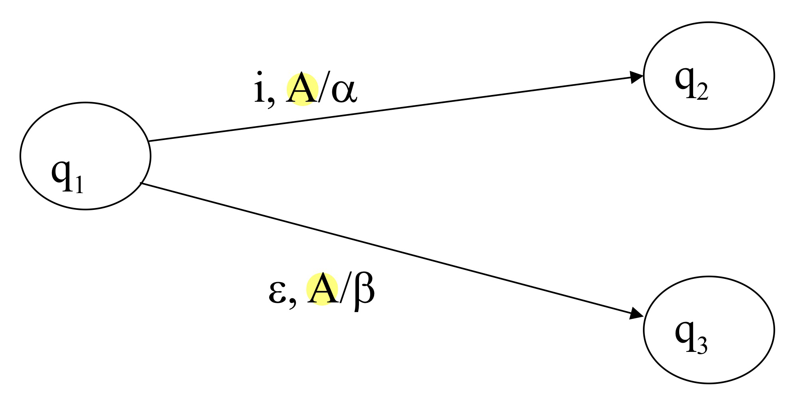
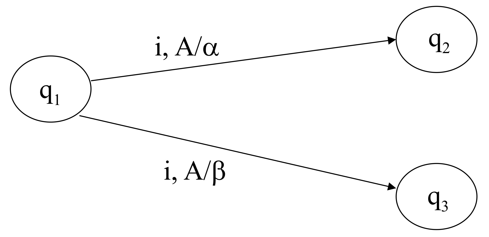
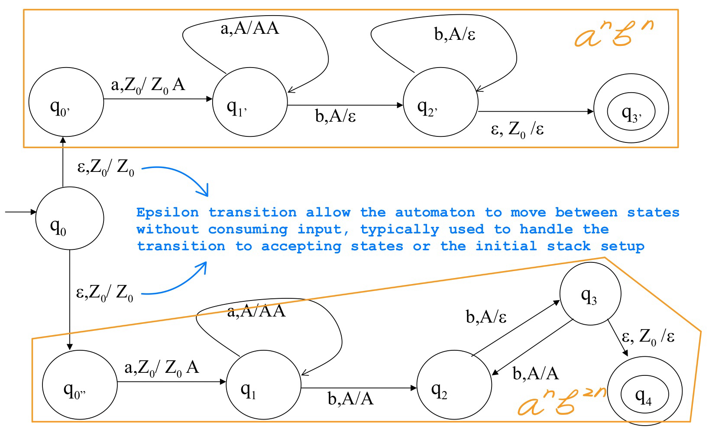
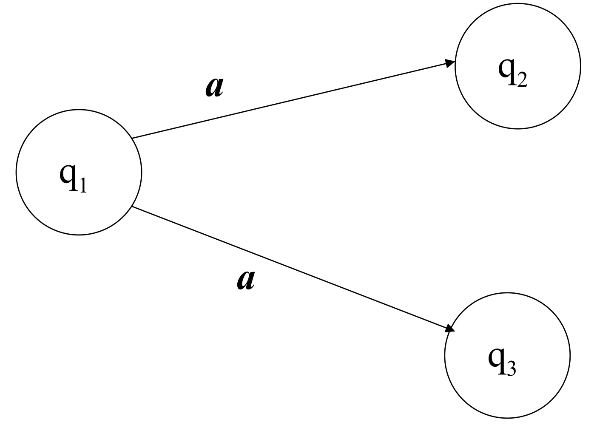
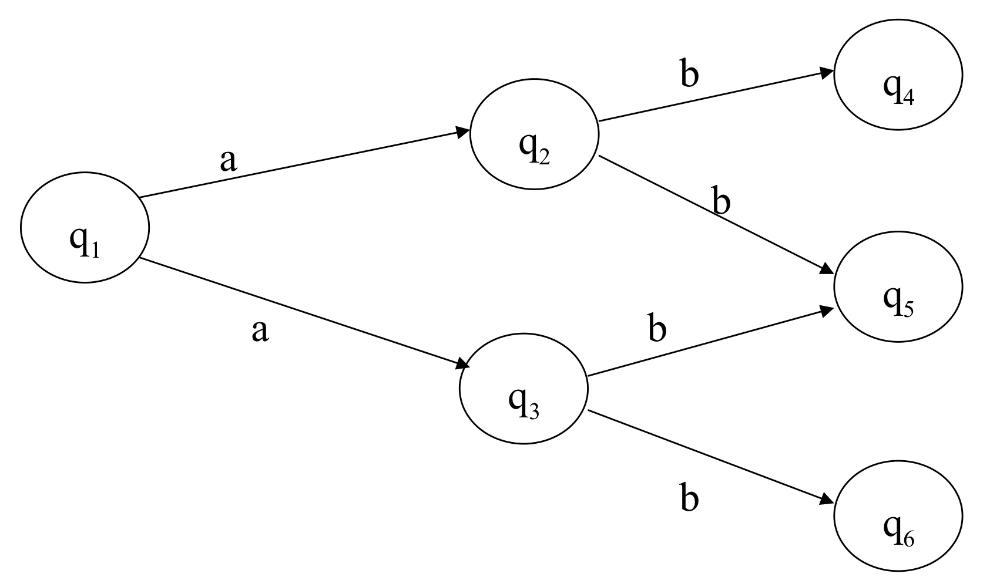
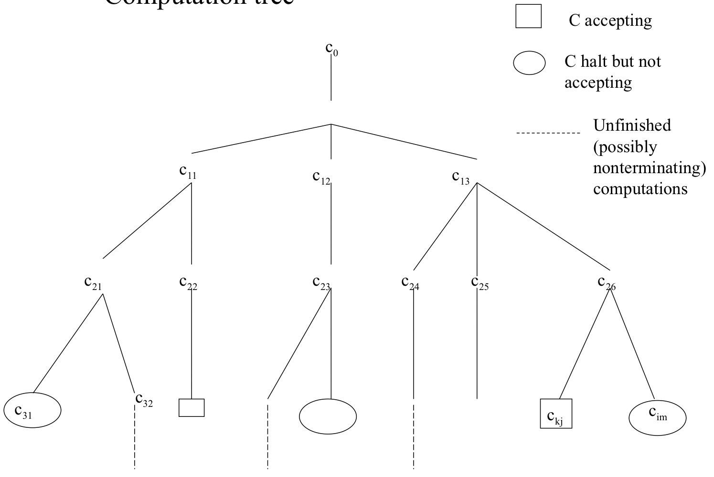

# Non-deterministic (Operational) Models

* Usually one thinks of an algorithm as a **uniquely determined** sequence of operations: in a certain configuration there is no doubt on what the next "step" will be

* Let us compare

	```
	if 
		x > y then max := x
	else
		max := y
	// The outcome is deterministic because the condition clearly determines which branch of the code is executed
	```

	with

	```
	if 
		x >= y then max := x
		y >= x then max := y
	fi
	// This is nondeterministic because if x = y, both condition (x >= y and y >= x) are true
	```

	

## Nondeterministic PDA (NPDA)

* In fact PDA are "natural born" ND:

	

	* It can read an input symbol $i$, pop $A$ from the stack, and push $\alpha$ onto the stack, transitioning to $q_2$
	* Alternatively, it can transition to $q_3$ **without reading any input** (epsilon transition), and modify the stack by replacing $A$ with $\beta$

* We might as well remove the deterministic constaint and generalize: 

	

	$\delta : Q \times (I \cup \{\varepsilon\}) \times \Gamma \to \mathcal{P}_F(Q \times \Gamma^*)$

	* $Q$ : The set of states in the automaton

	* $I$ : The input alphabet
	* $\varepsilon$ : The empty string, allowing epsilon (non-input consuming) transitions
	* $\Gamma$ : The stack alphabet, i.e., the set of symbols that can be pushed onto or popped from the stack.

	* $ \mathcal{P}_F(Q \times \Gamma^*)$ : The **finite power set** *of* $Q \times \Gamma$. This represents all possible pairs of next states and stack configurations that the automaton can move to. The power set indicates nondeterminism because there could be multiple possible state/stack transitions for a given input

* The NPDA accepts an input string $x$ if there exists a sequence of transitions that leads to an accepting state $q \in F$

* In a deterministic PDA, the transition function is **functional**, meaning that for any given state, input, and stack, there is exactly one possible next move. However, in a nondeterministic PDA, there can be **many possible next moves** for the same state, input, and stack configuration, making the relation non-unique


### Example: Accepting $\{a^{n}b^{n} \space | \space n > 0 \} \cup \{a^{n}b^{2n} \space | \space n > 0\}$



* The NPDA can accept languages that **deterministic PDAs cannot**

* NPDAs are **closed under union**, meaning that if two languages $L_1$ and $L_2$ are recognized by NPDAs, then the union of these two languages, $L_1 \cup L_2$ , can also be recognized by an NPDA. This property is not shared by DPDAs, which are **not closed under union**

* the NPDA is **not closed under intersection**, such that $\{a^{n}b^{n}c^{n}\} = \{a^{n}b^{n}c^{*}\} \cap \{a^{*}b^{n}c^{n}\}$. This language cannot be accepted by a PDA, not even by an NPDA, because it requires the automaton to check for three different counts of symbols (matching a ’s, b ’s, and c ’s), which is beyond the power of pushdown automata (whether deterministic or nondeterministic)

* If a language family is closed under union but **not** under intersection, it **cannot** be closed under complement. As a result, the class of languages recognized by NPDAs is **not closed under complement**. This is important because it highlights a limitation of nondeterministic machines. If a language is recognized by an NPDA, its complement (i.e., all strings not in the language) cannot necessarily be recognized by another NPDA

* **Lack of closure under complement** reflects a fundamental difference between deterministic and nondeterministic machines

	* In a deterministic machine, solving the **complement** of a problem (i.e., recognizing all strings not in the language) is relatively simple: once the machine finishes, we just reverse the result (e.g., if the machine accepts, reject, and vice versa). This is why deterministic machines tend to be closed under complement.
	* In nondeterministic machines, however, things are more complex. The machine could explore many paths, and not all of them might finish with a clear decision (accept or reject). This makes it harder to cleanly define what it means to recognize the complement of a language.

* For an NPDA, like a deterministic PDA, it is always possible to ensure that computations finish. However, because the NPDA is **nondeterministic**, multiple computation paths are possible for a given input, such as

	* $c_0 \vdash^* <q_1, \varepsilon, \gamma_1>$, $q_1 \in F$
	* $c_0 \vdash^* <q_2, \varepsilon, \gamma_2>$, $q_2 \notin F$
	*  $q_1 \in F$ means that the automaton reached an accepting state in Computation 1, so the **string x is accepted**, even though $q_2 \notin F$ (in Computation 2, the automaton did not end in an accepting state).

* If the set $F$ of accepting states is changed to $Q - F$ (where $Q$ is the set of all states, and $Q - F$ represents the non-accepting states), the input string x is **still accepted** by the NPDA. This is because there exists **at least one computation path** that accepts the string. The string acceptance is not dependent on **all possible computation paths** reaching an accepting state.

	This underscores the limitation of nondeterminism when trying to change a **yes** (acceptance) into a **no** (rejection). Since only one path needs to succeed for acceptance, simply changing the set of accepting states won’t necessarily change the outcome for an input.


## Non-deterministic Finite State Automata (NFA)



* Formally: $\delta(q_1,a)=\{q_2,q_3\}$

* $\delta: Q \times I \rightarrow \mathcal{P}(Q)$
	* $\mathcal{P}(Q)$ is the power set of Q which contains all possible subsets of Q, reflecting the nondeterministic nature of the automaton




* Transition Function $\delta$ :

	* $\delta(q_1, a) = \{q_2, q_3\}$
	* $\delta(q_2, b) = \{q_4, q_5\}$
	* $\delta(q_3, b) = \{q_5, q_6\}$

* Extended Transition Function $\delta^*$ :

	* $ \delta^*(q_1, ab) = \{q_4, q_5, q_6\} $

* Special case of $\delta ^*$ :

	* $\delta^*(q, \varepsilon) = \{q\}$

		This shows that if the automaton reads an empty string $\varepsilon$, it stays in the current state

	* $\displaystyle \delta^*(q, \space y.i) = \bigcup_{q' \in \delta^(q, y)} \delta(q', \space i) $ 

		This is a recursive definition for handling strings. It says that if the automaton reads a string $y.i$ (where $y$ is a sequence of input symbols and $i$ is a single symbol), we first apply $\delta^*$ to $y$ , then for each resulting state, we apply $\delta$ to $i$ . We take the union of all possible resulting states

* The NFA is described as being in a “set of states” during its computation because, at any point, it may be in multiple states simultaneously. When reading “ab” from $q_1$ , the automaton can be in any of the states $q_4$, $q_5$, $q_6$ simultaneously

* While NFA and DFA have different internal mechanisms, **NFAs are not more powerful than DFAs**. Any language accepted by an NFA can also be accepted by a DFA. The important point here is that **for every NFA**, an equivalent DFA can be constructed, and this can be done **automatically**. This is unlike the case of PDAs, where nondeterministic PDAs are strictly more powerful than deterministic ones

* Let $A_{ND}=<Q_N, I, \delta_N, q_{0N}, F_N>$ the NFA which we build a FA

	Let $A_D = <Q_D, I, \delta_D, q_{0D}, F_D>$ the FA we intend to build

	* $Q_D = \mathcal{P}(Q_N)$ :  $Q_D$ is the set of states in the DFA, which is the **power set** of the states in the NFA $Q_N$ . This means each DFA state represents a subset of NFA states.
	* $\displaystyle \delta_D(q_D, i) = \bigcup_{q_N \in q_D} \delta_N(q_N, i)$ : This defines the transition function $\delta_D$ for the DFA. When reading input $i$ in a DFA state $q_D$ (which is a set of NFA states), the DFA checks all transitions from those NFA states and moves to the union of all possible resulting states
	* $ q_{0D} = \{ q_{0N} \} $ : The start state of the DFA is the set containing the start state of the NFA
	* $F_D = \{ Q \subseteq Q_N \mid Q \cap F_N \neq \emptyset \}$ : This means that any DFA state (which is a set of NFA states) is accepting if it contains at least one NFA state that is an accepting state in the original NFA

* Even though NFAs are not more powerful than DFAs (in terms of the languages they can recognize), they are often **easier to design**. Constructing an NFA is sometimes simpler and more intuitive than directly constructing the equivalent DFA, especially for more complex languages. This is because NFAs allow for **nondeterministic choices**, which can simplify the design process

	However, when an NFA is converted into a DFA, the resulting DFA may have **many more states** — For instance, an NFA with just $5$ states can result in a DFA with up to $2^5 = 32$ states


### How does a ND FA accpet

* **Existential nondeterminism**: The automaton accepts the input string if **at least one run** ends in an accepting state (this is the standard interpretation for NDFAs)

	$x \in L \leftrightarrow  \delta^*(q_0, x) \cap F \neq \emptyset $

* **Universal nondeterminism**: The automaton accepts the input string if **all possible runs** end in an accepting state (this is a stricter alternative interpretation)

	$\delta^*(q_0, x) \subseteq F$


## Non-deterministic TM (NTM)

* $\langle \delta, [\eta] \rangle : Q \times I \times \Gamma^k \to \mathcal{P}(Q \times \Gamma^k \times \{R, L, S\}^{k+1} \times [O \times \{R, S\}])$

	* $Q$ : Set of states

	* $I$ : Input alphabet

	* $\Gamma^k$ : The set of symbols on the tape (for a k-tape Turing machine)

	* $\{R, L, S\}$ : Directions for the tape heads to move (right, left, or stay)

	* The powerset $\mathcal{P}$ indicates that the machine can choose from multiple possible transitions at each step (this is the nondeterministic element)

* **For every nondeterministic Turing machine**, there exists an equivalent **deterministic Turing machine** that can simulate it, hence nondeterminism does **not** increase the power of the TM. While nondeterminism might make the machine’s computation more efficient in some cases (by “guessing” the correct path), it does not fundamentally change the class of languages that the machine can recognize


### Computation tree



* The NDTM accepts an input $x$ **if there exists at least one computation path** in the computation tree that reaches an accepting state. This is known as **existential nondeterminism** because it requires only one successful computation path to accept the input

* If the computation tree is **finite**, visiting the entire tree is straightforward. However, some paths may be **infinite**, representing non-terminating computations. This creates a potential problem for the DTM, as it could “get stuck” exploring an infinite path and never discover that another path leads to an accepting state.

	For example, using a **depth-first search (DFS)** traversal (which explores as far as possible along a branch before backtracking) might get trapped in an infinite path and fail to explore other branches. In contrast, a **breadth-first search (BFS)** traversal, which explores level by level, would avoid this issue and ensure that all possible paths are eventually explored

