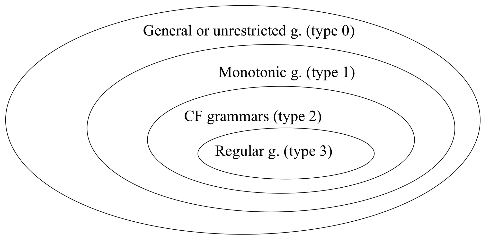
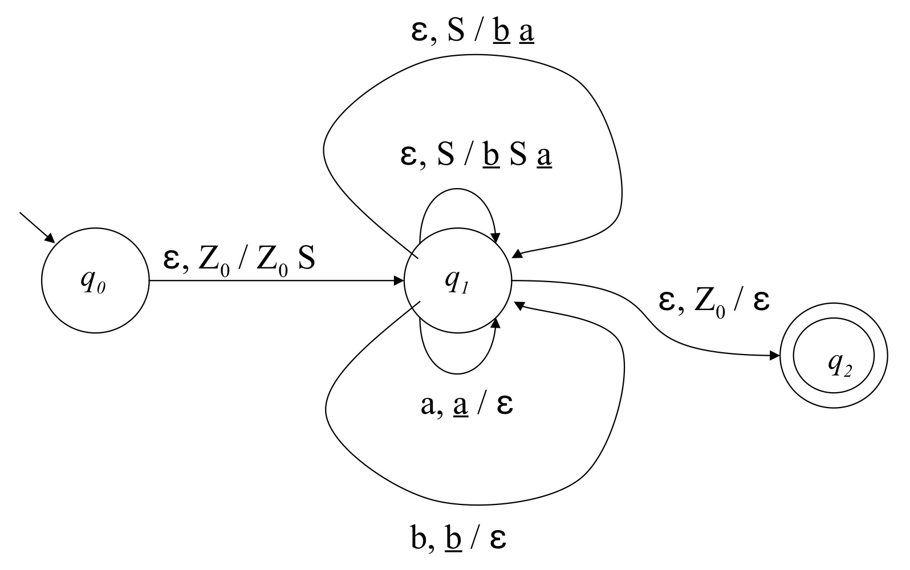
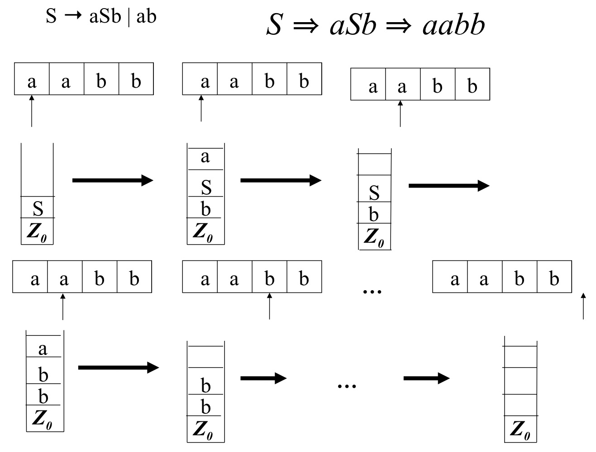

# Formal Definition of a Grammar

$G = \langle V_N, V_T, P, S \rangle$

* $V_N$ : Represents the set of **nonterminal symbols**. These symbols are placeholders that can be replaced by other symbols (both terminal and nonterminal) according to the grammar rules
	* $V_N = \{S, A, B, C, D\}$
* $V_T$ : Represents the set of **terminal symbols**. These symbols are the actual characters or tokens that appear in the strings of the language being generated. Terminals cannot be replaced further
	* $V_T = \{a, b, c\}$
* $V = V_N \cup V_T$ : This is the complete set of symbols, which includes both the terminal and nonterminal symbols ($V_N$ and $V_T$)
* $S \in V_N$ : Represents a specific nonterminal symbol called the **start symbol** or **axiom**. This is the initial symbol from which the generation or derivation of strings begins
* $P \subseteq V_N^+ \times V^*$ : Represents the set of **rewriting rules** or **productions**. Each rule specifies how a nonterminal (from $V_N$) can be replaced by a sequence of symbols (which could be terminals or nonterminals from $V$)
	* $P = \{ \langle \alpha, \beta \rangle \ |\ \alpha \in V_N^+ \ \text{and} \ \beta \in V^* \}$
		* $\alpha$ : a sequence of one or more nonterminal symbols ($\alpha \in V_N^+$).
		* $\beta$ : a sequence of symbols (either terminals, nonterminals, or both, denoted as $\beta \in V^*$)
		* The production rule $\langle \alpha, \beta \rangle$ can be written as $\alpha \rightarrow \beta$ , where $\alpha$ is rewritten as $\beta$ . This emphasizes the idea of **rewriting** in the grammar
		* $P = \{S \rightarrow AB, BA \rightarrow cCD, CBS \rightarrow ab, A \rightarrow \varepsilon\}$
			* $S \rightarrow AB$ : This rule means that the nonterminal $S$ can be replaced with the nonterminal sequence $AB$
			* $BA \rightarrow cCD$ : This rule states that the nonterminal sequence $BA$ can be replaced by the sequence $cCD$. This involves both terminal ($c$) and nonterminal symbols ($C$ and $D$)
			* $CBS \rightarrow ab$ : This rule states that the nonterminal sequence $CBS$ can be replaced with the terminal string $ab$
			* $A \rightarrow \varepsilon$ : This rule specifies that the nonterminal $A$ can be replaced by the empty string (denoted by $\varepsilon$). This is known as an **epsilon production** and means that $A$ can “disappear” during the rewriting process

# Relation of Immediate Derivation "$\Rightarrow$"

* $\alpha \Rightarrow \beta \quad \alpha \in V^+, \, \beta \in V^*$ if and only if $\alpha = \alpha_1 \alpha_2 \alpha_3 \space \and \space \beta = \alpha_1 \beta_2 \alpha_3$

	* This means that a string $\alpha$ is immediately derivable to $\beta$ if and only if

	* $\alpha_1$ , $\alpha_3$ are sequences of symbols that remain unchanged in the derivation

	* $\alpha_2$ is a sequence of symbols that gets rewritten as $\beta_2$ by applying a production rule from $P$ (the set of production rules)

* **Reflexive and transitive closure** is denoted by $\Rightarrow^*$ and means “zero or more rewriting steps.” In simpler terms, this is the relation that allows for **multiple steps of derivation**, including zero steps (which means the string can remain unchanged)

## Language generated by a Grammar

* $L(G) = \{ x \in V_T^* \mid S \Rightarrow^* x \}$

	* Consist only of **terminal symbols** ($x \in V_T^*$)

	* Can be derived from the **start symbol** $S$ , possibly in several steps (denoted by \($\Rightarrow ^*$), which means “zero or more derivation steps”)

	* In simple terms, L(G) is the set of all strings that can be generated by applying the grammar rules repeatedly, starting from the start symbol S , until you reach a string that only contains terminal symbols

* Some derivations may “**get stuck**,” meaning the string has nonterminal symbols, but there are no applicable rules left to rewrite them. This results in a situation where the derivation can’t continue to produce a terminal string

* Some derivations may **never terminate**, which happens if you keep applying rules without ever reaching a terminal string. This could happen if the grammar allows for infinite recursion or loops within the rules

## First Example

* The grammar $G_1$ is defined as: 
	* $G_1 = \langle \{S, A, B\}, \{a, b, 0\}, P, S \rangle$

* The production rules $P$ can be used: 
	* $P = \{ S \rightarrow aA, A \rightarrow aS, S \rightarrow bB, B \rightarrow bS, S \rightarrow 0 \}$

* Several examples of derivations using these rules:
	* $S \Rightarrow 0$
	* $S \Rightarrow aA \Rightarrow aaS \Rightarrow aa0$
	* $ S \Rightarrow bB \Rightarrow bbS \Rightarrow bb0 $
	* $ S \Rightarrow aA \Rightarrow aaS \Rightarrow aabB \Rightarrow aabbS \Rightarrow aabb0 $
* The language generated by the grammar $G_1$ as: 
	* $L(G_1) = \{ aa, bb \}^* \cdot 0$

## Second Example

* The grammar $G_2$ is defined as:
	* $G_2 = \langle \{S\}, \{a, b\}, \{S \rightarrow aSb \,|\, ab\}, S \rangle$
* The production rules $P$ can be used:
	* $P = \{ S \rightarrow aSb \,|\, ab \}$
* Several examples of derivations using these rules:
	* $ S \Rightarrow ab $
	* $ S \Rightarrow aSb \Rightarrow aabb $
	* $ S \Rightarrow aSb \Rightarrow aaSbb \Rightarrow aaabbb $
* The language generated by the grammar $G_2$ as:
	* $L(G_2) = \{a^n b^n \mid n > 0\}$

* If we change the rule $S \rightarrow ab$ to $S \rightarrow \varepsilon$ (where $\varepsilon$ represents the empty string), the language generated by the grammar changes slightly:
	* $L(G_2) = \{a^n b^n \mid n \geq 0\}$

## Third Example

* The grammar $G_3$ is defined with the following production rules:
	* $P = \{ S \rightarrow aACD, A \rightarrow aAC, A \rightarrow \varepsilon, B \rightarrow b, CD \rightarrow BDc, CB \rightarrow BC, D \rightarrow \varepsilon \}$
* Several derivations from the grammar’s production rules:
	*  $S \Rightarrow aACD \overset{A \rightarrow \varepsilon}{\Rightarrow} aCD \overset{CD \rightarrow BDc}{\Rightarrow} aBDc \overset{B \rightarrow b, \space D \rightarrow \varepsilon}{\Rightarrow} abc$
	* $ S \Rightarrow aACD \overset{A \rightarrow aAC}{\Rightarrow} aaACCD \overset{A \rightarrow \varepsilon}\Rightarrow aaCCD \overset{CD \rightarrow BDc}\Rightarrow aaCBDc \overset{CB \rightarrow BC}\Rightarrow aaBCDc \\ \overset{B \rightarrow b}\Rightarrow aabCDc \overset{CD \rightarrow BDc}\Rightarrow aabBDcc \overset{B \rightarrow b, \space D \rightarrow \varepsilon}\Rightarrow aabbcc $
	* $ S \Rightarrow aaaACCCD \overset{A \rightarrow \varepsilon}\Rightarrow aaaCCCD \overset{CD \rightarrow BDc}\Rightarrow aaaCCBDc \overset{B \rightarrow b}\Rightarrow aaaCCbDc \overset{D \rightarrow \varepsilon}\Rightarrow aaaCCbc $
* The language generated by the grammar $G_3$ as:
	1. The rules $S \rightarrow aACD$ , $A \rightarrow aAC$ , and $A \rightarrow \varepsilon$ generate strings with the pattern $a^n C^n D$
	2. Since the final strings are composed of only terminal symbols, all nonterminal symbols must disappear at the end of the derivation
	3. The $C$ ’s “disappear” when they interact with $D$ , which generates $B$ and $c$ ($CD \rightarrow BDc$)
	4. The switching between $C$ and $B$ ensures that all the $C$ ’s move towards the $D$ and get replaced by $B$ and $c$. ($CB \rightarrow BC$, $CD \rightarrow BDc$)
	5. As the grammar proceeds through recursive applications of the rules, the pattern $C^n D$ transforms into $b^n c^n$
	6. $L(G_3) = \{ a^n b^n c^n \mid n > 0 \}$

# Class of Grammars

## Context-free (CF) Grammars

$(\alpha \rightarrow \beta) \in P, \quad |\alpha| = 1$

* A grammar is **context-free** if every production rule $(\alpha \rightarrow \beta) \in P$ has the form $|\alpha| = 1$ , meaning that the left-hand side of the rule is always a single nonterminal symbol $A \in V_N$ . In other words, the left side of the production rule can only consist of a single nonterminal symbol
* The reason it is called “context-free” is that the rewriting of the nonterminal $\alpha$ (for example, $A \in V_N$ ) does **not depend on the context** in which $\alpha$ appears. This means that the surrounding string (the parts of the string that come before or after $\alpha$ ) does not affect how $\alpha$ is replaced. Only the nonterminal $A$ is rewritten, independently of the string around it
* To generate the **empty string** $\varepsilon$ , a special production rule $S \rightarrow \varepsilon$ is needed. This allows the grammar to derive an empty string when necessary
* The grammars $G_1$ and $G_2$ from the previous examples are context-free. However, $G_3$ is **not** context-free, because it violates the fundamental CFG requirement that each production rule has a single nonterminal on the left-hand side. Instead, $G_3$ has rules like $CD \rightarrow BDc$ and $CB \rightarrow BC$ , where **two nonterminals interact**, which CFGs cannot handle. There are **complex dependencies** between nonterminals, such as interactions between $C$, $B$, and $D$, that go beyond the scope of CFGs, which only allow the rewriting of a single nonterminal at a time without considering its context.

## Regular Grammars

$(\alpha \rightarrow \beta) \in P, \quad |\alpha| = 1, \quad \beta \in (V_T \cdot V_N) \cup V_T \cup \{\varepsilon\}$

* A grammar is **regular** if it meets the following conditions for each production rule $(\alpha \rightarrow \beta) \in P$ :
	* The left-hand side $|\alpha| = 1$ , meaning that the left side of every production must be a single nonterminal symbol $A \in V_N$ , just like in a context-free grammar.
	* The right-hand side $\beta$ can be:
		* A terminal symbol followed optionally by a single nonterminal symbol (i.e., $\beta \in (V_T \cdot V_N)$ ).
		* A single terminal symbol (i.e., $\beta \in V_T$ ).
		* The empty string $\varepsilon$ .
* **Regular grammars** are a **subset** of context-free grammars: Every regular grammar is context-free. However, **not every context-free grammar** is regular. Regular grammars are more restrictive in how they can generate strings.
* The grammar $G_1$ is regular. However, the grammar $G_2$ is not regular because in the production rule $S \rightarrow aSb$ , the nonterminal $S$ is in the middle, surrounded by terminal symbols $a$ and $b$. This violates the constraints of regular grammars because in a regular grammar, a nonterminal can only appear at the **end** of the right-hand side, not in the middle.
* Like in context-free grammars, to generate the **empty string**, a special production rule $S \rightarrow \varepsilon$ is required. This allows the grammar to produce the empty string when necessary.

## Monotonic Grammars

$\alpha \rightarrow \beta, \quad |\alpha| \leq |\beta|$

* In a **monotonic grammar**, every production rule must have the form $\alpha \rightarrow \beta$ such that $|\alpha| \leq |\beta|$
	* This means that the length of the string on the left-hand side ( $\alpha$ ) must be **less than or equal to** the length of the string on the right-hand side ( $\beta$ ).
	* **String length does not decrease** during any production. The derivation process either maintains or increases the string length.
* As usual, the empty string $\varepsilon$ can only be generated through a special rule like $S \rightarrow \varepsilon$ for the **start symbol** $S$ . However, $S$ cannot appear in the right-hand side of any other rule because that would allow shrinking the string length, which would violate the monotonicity requirement.
* **Regular grammars** are **monotonic** because their production rules always either:
	* Replace a nonterminal with a terminal (keeping the length the same).
	* Replace a nonterminal with a terminal followed by another nonterminal (increasing the string length).
	* Replace a nonterminal with the empty string $\varepsilon$ (only allowed for the start symbol).
* **Context-free grammars (CFGs)** are **generally not monotonic** because they may include rules like $A \rightarrow \varepsilon$ , which reduce the string length by removing the nonterminal. However, it is possible to **remove non-monotonic rules** (like $A \rightarrow \varepsilon$ ) and replace them with equivalent rules to maintain monotonicity.
	* e.g.: $ B \rightarrow abaAcDA $ , this can be replaced by a set of monotonic rules: $B \rightarrow abaAcDA \, | \, abacDA \, | \, abaAcD \, | \, abacD$
* **Languages** generated by monotonic grammars are called **contextual** because the production of nonterminals depends on the surrounding context. These languages are recognized by **Linear Automata**, which are similar to Turing Machines but with the restriction that the **tape length is bounded**.

## Relations Among Grammars & Languages

# Relations between Grammars & Automata

## Equivalence between RG & FA

**Equivalence** here means that the **finite automaton (FA)** accepts the **same language** that the **regular grammar (RG)** generates. This concept is important in formal language theory, as it shows that **regular languages** can be defined either by grammars or by automata.

* **From FA to RG :** 
	* Let the **nonterminals** $V_N$ be the **states** of the automaton ( $V_N = Q$ )
	* Let the **terminals** $V_T$ be the input alphabet ( $V_T = I$ )
	* The **start symbol** $S$ corresponds to the start state $q_0$ 
	* For each transition $\delta(q, i) = q'$ (moving from state $q$ to state $q'$ on input symbol $i$ ):
		* Add a production rule: $q \rightarrow i q'$ 
	* If $q'$ is an accepting state ( $q' \in F$ ), then add a production rule: $q \rightarrow i$ (where the automaton accepts the string).
	* Additionally, if $q' \in F$ , add a rule: $q \rightarrow \varepsilon$ , which allows the grammar to generate the empty string if it reaches an accepting state.
* **From RG to FA :**
	* Let $Q$ (the set of states of the FA) be the set of **nonterminals** from the grammar ( $V_N$ ) plus an additional state $q_F$ , which represents the final accepting state.
	* The input alphabet $I$ is the set of **terminal** symbols from the grammar ( $V_T$ ).
	* Let the **start state** $q_0$ correspond to the **start symbol** $S$ of the grammar.
	* For each production $A \rightarrow bC$ in the grammar (where $A$ and $C$ are nonterminals and $b$ is a terminal):
		* Add a transition in the automaton: $\delta(A, b) = C$ .
	* For each production $A \rightarrow b$ (where $b$ is a terminal and $A$ is a nonterminal):
		* Add a transition: $\delta(A, b) = q_F$ , where $q_F$ is the accepting state.
	* For any production of the form $A \rightarrow \varepsilon$ (allowing the generation of the empty string):
		* Add $A \in F$ (i.e., make $A$ an accepting state in the automaton).
	* The resulting finite automaton will be **nondeterministic**. This is because:
		* There may be multiple ways to transition from one state to another based on the same input symbol (which is the definition of a nondeterministic automaton).
		* Nondeterministic automata are easier to construct from regular grammars because they allow multiple possible transitions for the same input symbol.

## Equivalence between CFG & ND-PDA

**Equivalence** between **context-free grammars (CFGs)** and **pushdown automata (PDAs)**, specifically **nondeterministic PDAs (ND-PDAs)**. This equivalence means that for every **context-free language**:

* You can either define it by a **CFG** (a set of rules to generate the strings of the language)
* Or you can define it by an **ND-PDA** (an automaton with a stack that recognizes the language by processing input symbols)

## Equivalence between General Grammars & ND-TM

* General Grammars and Turing Machines (TMs):

	* **General grammars** can generate any **recursively enumerable language**. These are the most general languages that can be generated by grammars.
	* **Turing machines** (especially **nondeterministic** ones) are computational models that can recognize these recursively enumerable languages.
* Construction of an ND-TM from a Grammar G:

	1. **Input string on the input tape**: The Turing machine M starts with the input string $x$ on the input tape. The task of M is to determine whether $x$ can be derived from the grammar G
	2. **Loop (Main Process)**:
		* The **memory tape** contains the current string $\alpha$ (which is a sequence of symbols from the grammar’s variables and terminals, $V^*$ )
		* The Turing machine will **search the tape** for any substring $\beta$ that corresponds to the **right-hand side** of a production rule $\alpha \rightarrow \beta$ from the grammar G
	3. **Nondeterministic Choice**:
		* When M finds a match for a production rule, it **nondeterministically** chooses to substitute the right-hand side $\beta$ with the corresponding left-hand side $\alpha$ (following the production rule $\alpha \rightarrow \beta$ )
		* If there are multiple possible matches, the Turing machine makes a nondeterministic choice, exploring all possible derivations
