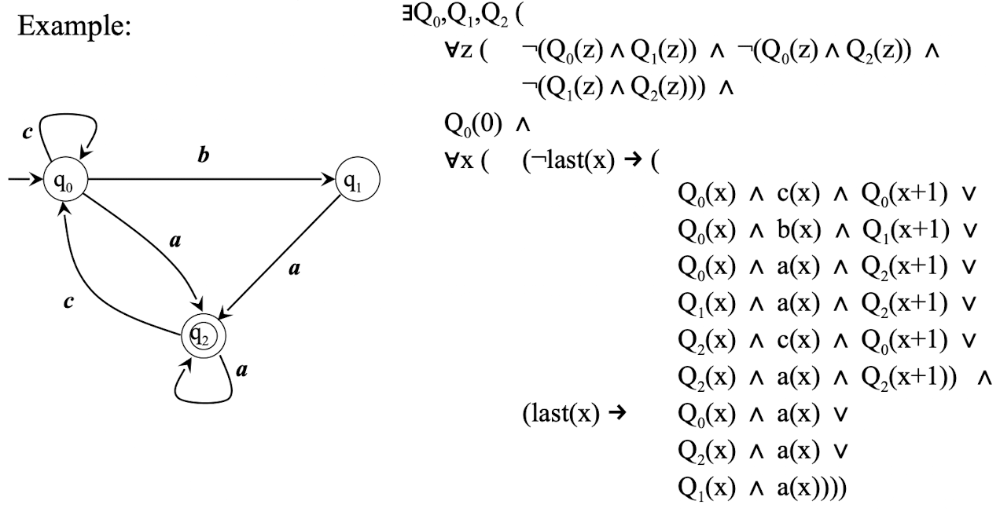

# Monadic First-order Logic (MFO)

* **Objective**: The aim is to use a form of first-order logic (specifically Monadic First-Order Logic) to define languages over an alphabet $I$ 
	* **Monadic**: This refers to predicates that take only one argument, hence the term “monadic.”

* **Basic Syntax**: $\varphi ::= a(x) \ | \ x < y \ | \ \neg \varphi \ | \ \varphi \lor \varphi \ | \ \exists x(\varphi)$
	* $a(x)$ : A predicate for every symbol $a$ in the alphabet $I$ . This indicates that $a$ applies to the position $x$ in the word
	* $x < y$ : A binary relation, “less than,” between two positions $x$ and $y$ 
	* $\neg \varphi$ : Negation of a formula $\varphi$ 
	* $\varphi \lor \varphi$ : Disjunction (logical OR) of two formulas
	* $\exists x(\varphi)$ : Existential quantifier, stating that there exists a position $x$ such that $\varphi$ holds

* **Interpretation**:
	* **Binary Relation** $<$ : The usual “less-than” relation is used to compare positions within the word
	* **Domain of Variables**: Variables represent positions in a word, ranging over a finite set of natural numbers $[0 \ldots n-1]$ , where each number corresponds to a position in the word

# Standard Abbreviations

* **Logical Connectives**:
	* **Conjunction** $\varphi_1 \land \varphi_2$ : Defined as $\neg(\neg \varphi_1 \lor \neg \varphi_2)$ , representing the logical AND of $\varphi_1$ and $\varphi_2$ 
	* **Implication** $\varphi_1 \rightarrow \varphi_2$ : Defined as $\neg \varphi_1 \lor \varphi_2$ , representing the logical implication
* **Quantifiers**:
	* **Universal Quantifier** $\forall x (\varphi)$ : Defined as $\neg \exists x (\neg \varphi)$ , which states that $\varphi$ holds for all $x$ 
* **Relational Operations**:
	* **Equality** $x = y$ : Defined as $\neg (x < y) \land \neg (y < x)$ , meaning $x$ and $y$ are considered equal if neither $x < y$ nor $y < x$ holds
	* **Less-than-or-equal** $x \leq y$ : Defined as $\neg (y < x)$ , meaning $x$ is less than or equal to $y$ if $y < x$ is not true
* **Constants and Successor Function**:
	* **Constant 0**: $x = 0$ is defined as $\neg \exists y (y < x)$ , meaning $x$ is $0$ if there is no $y$ less than $x$ 
	* **Successor** $\text{succ}(x, y)$ : Defined as $x < y \land \neg \exists z (x < z \land z < y)$ , meaning $y$ is the successor of $x$ if $x < y$ and there is no $z$ between $x$ and $y$ 
	* **Constants 1, 2, 3, …**: These are defined as successors of 0, 1, 2, and so on, respectively

# Interpreation as a Word on $I$

* **Interpretation of** $a(x)$ :
	* Given a word $w \in I^*$ (a string over the alphabet $I$ ), and a symbol $a \in I$ , the formula $a(x)$ holds if and only if the symbol at the $x$ -th position of $w$ is $a$
	* Notably, the first symbol of $w$ is at position $0$
* **Example Formula (Starting with $a$ )**:
	* The formula $\exists x (x = 0 \land a(x))$ is satisfied if and only if the word starts with the symbol $a$ 
	* This means that there exists a position $x$ (specifically, $x = 0$ ) where the symbol is $a$ 
* **Next Formula (Every** a **is Followed by** b **)**:
	* The formula $\forall x (a(x) \rightarrow \exists y (\text{succ}(x, y) \land b(y)))$ requires that every occurrence of $a$ in the word is immediately followed by $b$ 
	* For every position $x$ where $a(x)$ holds, there exists a position $y$ that is the successor of $x$ (denoted by $\text{succ}(x, y)$ ) such that $b(y)$ holds
	* This implies that whenever there is an $a$ in the word, it is immediately followed by a $b$ 

# Other Useful Abbreviations

* **Positional Abbreviations**:

	* $y = x + 1$ : Represents the successor function $\text{succ}(x, y)$ , meaning $y$ is the immediate successor of $x$ 
	* $y = x + k$ : For a constant $k > 1$ , this represents a position $y$ that is $k$ positions after $x$ . Defined as: $\exists z_1 \ldots z_{k-1} (y = z_{k-1} + 1 \land z_{k-1} = z_{k-2} + 1 \land \ldots \land z_1 = x + 1)$

	This defines a chain of successors leading from $x$ to $y$

	* $y = x - 1$ : Represents $\text{succ}(y, x)$ , meaning $x$ is the immediate successor of $y$ (equivalently, $y$ is immediately before $x$ )
	* $y = x - k$ : Defines a position $y$ that is $k$ positions before $x$
	* $\text{last}(x)$ : Indicates that $x$ is the last position in the word, defined as $\neg \exists y (x < y)$ — i.e., there is no position $y$ after $x$

* **Example Expressions**:

	* **Words where the last symbol is** $a$ : This can be expressed as: $\exists x (\text{last}(x) \land a(x))$
		* This formula states that there exists a position $x$ that is the last in the word and contains the symbol $a$

	* **Words of length at least 3 where the third-last symbol is** $a$ :
		* This condition can be formulated as: $\exists x (a(x) \land \exists y (y = x + 2 \land \text{last}(y)))$
		* This states that there exists a position $x$ with the symbol $a$ , and there is another position $y$ , which is two positions after $x$ and is the last position in the word
		* **Abbreviated form**: $\exists x (a(x) \land \text{last}(x+2))$ , where $\text{last}(x+2)$ directly indicates the third-last position relative to $x$ 

# MFO Semantics

* The symbol $\models$ , called the **satisfaction relation** or **semantic entailment**, is used in logic to indicate that a certain formula (or statement) is true in a given interpretation
	* When we write something like $w, v_1 \models \varphi$ , it means that the formula $\varphi$ is **true** or **satisfied** in the word $w$ under the assignment $v_1$
	* $\models$ essentially acts as a **truth indicator** for whether $\varphi$ holds (is true) under the given conditions (word and assignment)
	* If we have $w, v_1 \models a(x)$ , it means that, according to the assignment $v_1$ , the symbol at the position $v_1(x)$ in the word $w$ is $a$

* Let $w \in I^*$ be a word (a sequence of symbols from the alphabet $I$ ); $V_1$ be the set of all variables; An assignment $v_1: V_1 \rightarrow [0..|w|-1]$ maps each variable to an integer in the range of valid positions within $w$

	* **Atomic formula** a(x) : 
		* $w, v_1 \models a(x)$ if and only if $w = u a v$ and $|u| = v_1(x)$ , meaning that the symbol at position $v_1(x)$ in $w$ is $a$ 
	* **Ordering** $x < y$ : 
		* $w, v_1 \models x < y$ if and only if $v_1(x) < v_1(y)$ , indicating that the position assigned to $x$ is less than the position assigned to $y$
	* **Negation** $\neg \varphi$ : 
		* $w, v_1 \models \neg \varphi$ if and only if it is not the case that $w, v_1 \models \varphi$
	* **Disjunction** $\varphi_1 \lor \varphi_2$ :
		* $w, v_1 \models \varphi_1 \lor \varphi_2$ if and only if $w, v_1 \models \varphi_1$ or $w, v_1 \models \varphi_2$
	* **Existential quantification** $\exists x (\varphi)$ :
		* $w, v_1 \models \exists x (\varphi)$ if and only if $|w| > 0$ and there exists an index $i \in [0..|w|-1]$ such that $w, v_1[i/x] \models \varphi$
		* Here, $v_1[i/x]$ denotes an assignment similar to $v_1$ , but with $x$ assigned the value $i$

* **Language of a Formula**:

	* The language $L(\varphi)$ associated with a closed formula $\varphi$ is defined as: $L(\varphi) = \{ w \in I^* \ | \ w \models \varphi \}$

	* This means that $L(\varphi)$ is the set of all words $w$ (from the alphabet $I$ ) that satisfy the formula $\varphi$

* **Note on the Empty String**:

	* The empty string (a string of length 0) cannot satisfy any existential quantifications because there are no positions to assign values to variables
	* Consequently, the empty string can only satisfy formulas that have universal quantifications (since universal quantifications are trivially true when there are no positions to contradict them)

# Properties of MFO

## **Closure Properties**

* **Closure Under Union, Intersection, and Complement**: All languages definable by MFO are closed under **union**, **intersection**, and **complement**

* **Composing Formulas with Logical Operators**: Since MFO is closed under these operations, we can compose formulas by using logical **and** ( $\land$ ), **or** ( $\lor$ ), and **not** ( $\neg$ ) to form new formulas that define unions, intersections, and complements of languages

* **Examples of Composed Formulas**: 

	* **Example 1**: $\exists x (\text{last}(x) \land a(x)) \land \exists x (a(x) \land \text{last}(x+2))$

		This formula defines a language where two conditions must hold:

		* There exists a position $x$ such that $x$ is the last position and contains the symbol $a$

		* There exists a position $x$ such that $x$ contains $a$ and the position two after $x$ (i.e., $x+2$ ) is the last position

	* **Example 2**: $\exists x (\text{last}(x) \land a(x)) \lor \exists x (a(x) \land \text{last}(x+2))$

		This formula defines a language where **at least one** of the two conditions holds:

		* There exists a position $x$ such that $x$ is the last position and contains $a$ 
		* There exists a position $x$ such that $x$ contains $a$ and the position two after $x$ is the last position

	* **Example 3**: $\neg \exists x (\text{last}(x) \land a(x))$

		This formula defines the **complement** of the condition $\exists x (\text{last}(x) \land a(x))$

		* It is true if there is **no position** $x$ such that $x$ is the last position and contains $a$
		* This effectively means that any word satisfying this formula does **not** end with the symbol $a$

## Non-Closure under Kleene Star (*)

* **MFO languages are not closed under the Kleene star operation**
	* This means that if a language $L$ can be defined by MFO, it does not imply that $L^*$ (the language consisting of any number of concatenations of strings from $L$ ) can also be defined by MFO
	* For example, if $L$ is an MFO-definable language, the language of all strings formed by repeating words in $L$ any number of times (including zero) may not be MFO-definable
* **Property**: For a language over a one-letter alphabet $I = \{a\}$ , it is definable in MFO **if and only if** it is either **finite** or **co-finite**
	* **Finite language**: Contains only a limited number of words
		* For instance, if our alphabet is $\{a\}$ , then a finite language could be $L = \{\epsilon, a, aa\}$ , where $\epsilon$ denotes the empty string (no letters). This language has only three words and no more, making it finite.
	* **Co-finite language**: Contains all words except for a finite number of exceptions
		* In the context of our one-letter alphabet $\{a\}$ , an example of a co-finite language might be the set of all words except those with length 1 or 2 (i.e., except “a” and “aa”). So, $L^c = \{\epsilon, aaa, aaaa, aaaaa, \ldots \}$
	* This property shows that MFO has limitations in expressiveness, especially for languages with one-letter alphabets.
* **Example of an MFO-Definable Language:** $L_{p_2} = \{aa\}$
	* The formula $a(0) \land a(1) \land \text{last}(1)$ defines the language $L_{p_2} = \{aa\}$
		* $a(0)$ : The first position contains $a$
		* $a(1)$ : The second position also contains $a$
		* $\text{last}(1)$ : The second position is also the last position in the word
	* If we attempt to define $L_p = L_{p_2}^*$ , which is the language of all strings consisting of repeated occurrences of “aa” (e.g., “aa”, “aaaa”, “aaaaaa”, etc.), this language is **neither finite nor co-finite**. Consequently, it cannot be expressed by MFO, as MFO cannot handle the Kleene star operation
* **Regular Star-Free Languages**
	* **Definition**: MFO can define **regular star-free languages**, which are languages that can be formed by applying **union**, **intersection**, **complement**, and **concatenation** to **finite languages**
		* **Star-free**: These languages do not require the Kleene star operation, meaning they can be constructed without needing to repeat elements an arbitrary number of times

## **MFO Defines a Subset of Regular Languages**

* **Regular Languages**: These are languages that can be recognized by finite automata and are closed under operations like union, intersection, complement, and Kleene star
	
	* MFO, however, does not define all regular languages; it defines only a subset of them, specifically the **star-free regular languages**
	* This subset consists of languages that can be constructed using union, intersection, and complement but without using the Kleene star (unbounded repetition)
	
* **Star-Free Languages**: These are languages that do not use the Kleene star in their definitions but still capture patterns by combining finite elements with logical operators

  * The language $L = (ab)^*$ (all strings made of repeated occurrences of “ab”, such as “ab”, “abab”, “ababab”, etc.) is actually star-free, even though it is usually defined with the Kleene star
  * This means that even though $L$ looks like it requires the star operation, it can still be expressed in MFO without needing actual unbounded repetition in its logical formula

* **Notation with Complements and Concatenations**: 

  * The notation $\{a, b\}^* = \neg \emptyset$ indicates that $\{a, b\}^*$ (all strings made from “a” and “b” in any order and length) is the complement of the empty set, which means it includes all possible words over $\{a, b\}$
  * The expression $(ab)^* = \neg (\ldots)$ in the slide appears to be attempting to express the language of repeated “ab” patterns without directly using the star operation. The details are abstract, but the idea is to decompose the pattern $(ab)^*$ using logical expressions without needing an actual Kleene star

* **Defining** $(ab)^*$ **in MFO**: The formula provided in MFO attempts to define the language $(ab)^*$ through logical constraints:

  * $a(0) \land \exists x (\text{last}(x) \land b(x)) \land \forall x (a(x) \rightarrow b(x+1)) \lor \forall x (\neg a(x) \land \neg b(x))$

    * $a(0)$ : The word starts with “a”
    * $\exists x (\text{last}(x) \land b(x))$ : There exists a position $x$ which is the last position and contains “b”
    * $\forall x (a(x) \rightarrow b(x+1))$ : Every “a” is immediately followed by a “b”
    * $\forall x (\neg a(x) \land \neg b(x))$ : Ensures no positions in the word contain any other characters (used to rule out the possibility of words that don’t match the pattern). In other words, this condition is true if the word is empty (contains neither “a” nor “b”)

    This formula captures the idea of alternating “a” and “b” throughout the word, beginning with “a” and ending with “b”

# Monadic Second-order Logic (MSO)

* **Quantification on Positions**: 

	* In **first-order logic**, quantification is limited to individual positions within a structure (e.g., characters in a string or nodes in a graph). This is useful but limited in expressiveness when it comes to capturing patterns in regular languages.

* **Second-order Quantification**:

	* **Second-order logic** allows quantification over **sets of positions** rather than individual positions.

	* These sets of positions are defined using **monadic predicates**. A **monadic predicate** is a function that takes a single argument (a position in this case) and returns true or false. For instance, if $P(x)$ is a monadic predicate, it holds (is true) if $x$ belongs to the set defined by $P$ . So, $P(x)$ can indicate, for example, whether $x$ is a vowel in a string.

* **Formulae with Second-order Quantification**:

	* With second-order logic, you can have formulae like $\exists P(\varphi)$ , where $P$ is a set (a monadic predicate) and $\varphi$ is a formula that depends on this set $P$ .

	* This additional layer of quantification (over sets rather than positions) allows MSO to express more complex properties of languages, which are essential for fully characterizing **regular languages**.

* **Conventions**:
	* **capital letters** (e.g., $P$ ) will represent variables that denote **monadic predicates** (sets of positions), while **lower-case letters** will represent variables over individual **positions**.

# MSO Semantics

* **Assignment for Second-order Variables**:

	* Second-order variables (denoted by the set $V_2$ ) are assigned using a function $v_2$ .

	* The function $v_2: V_2 \rightarrow \wp([0..|w|-1])$ maps each second-order variable (like a monadic predicate $X$ ) to a subset of positions in the domain $[0..|w|-1]$ , where $|w|$ represents the length of the string $w$ .

* **Semantics of MSO Expressions**: Two new rules are added to the semantics of **Monadic First-order Logic (MFO)** (the simpler logic only quantifying over individual positions) to handle second-order quantification over sets:

	* **First Rule**: $w$, $v_1$, $v_2 \models X(x)$ 

		* This expression means that $X(x)$ is true in the interpretation where:
			* $w$ is the structure (usually a string or sequence).
			* $v_1$ assigns values to first-order variables (individual positions).
			* $v_2$ assigns values to second-order variables (sets of positions).

		* **Interpretation**: $X(x)$ holds if $v_1(x) \in v_2(X)$ ; in other words, the position assigned to $x$ by $v_1$ is included in the set assigned to $X$ by $v_2$ .

	* **Second Rule**: $w$, $v_1$, $v_2 \models \exists X(\varphi)$

		* This expression means that there exists a set $S \subseteq [0..|w|-1]$ such that the formula $\varphi$ is true when $X$ is assigned the set $S$ .

		* **Interpretation**: There exists a subset $S$ of positions in $w$ such that when $v_2$ is modified to assign $S$ to $X$ (notated $v_2[S/X]$ ), the formula $\varphi$ holds.
			* $v_2[S/X]$ denotes a modified assignment function where $X$ is mapped to the set $S$ while all other second-order variables are mapped as before. This allows us to interpret expressions that use existential quantification over sets.

* **Monadic Second-order Logic (MSO) formula** that defines the language $L_p = \{ aa \}^*$ : $\exists P (\forall x (\neg P(0) \land (\neg P(x) \leftrightarrow P(x+1)) \land a(x) \land (\text{last}(x) \rightarrow P(x))))$

	* **Existential Quantification** ( $\exists P$ ):

		* The formula starts with $\exists P$ , indicating that there exists a monadic predicate $P$ , which we will use to identify certain positions in the string.

	* **Conditions Within the Formula**:

		* $\forall x (\neg P(0) \land (\neg P(x) \leftrightarrow P(x+1)) \land a(x) \land (\text{last}(x) \rightarrow P(x)))$ :
			* This is a statement that applies to every position x in the string.

		* $\neg P(0)$ :

			* This means that $P$ does not hold at position $0$, which is the starting position in the string.

			* Since the note specifies that $P$ is used to identify odd positions (starting from $0$), this initialization ensures that $P$ correctly identifies positions based on a specific pattern.

		* $\neg P(x) \leftrightarrow P(x+1)$ :

			* This establishes an alternating pattern for $P$ , where $P(x)$ is true for odd positions and false for even positions, or vice versa.

			* This alternation is important for capturing the pattern required for the language $\{ aa \}^*$ , where “$a$” occurs in pairs.

		* $a(x)$ :

			* This condition states that each position $x$ must contain the character “$a$”.

			* This ensures that the string is made up entirely of “$a$” characters.

		* $\text{last}(x) \rightarrow P(x)$ :

			* This implies that if $x$ is the last position in the string, then $P(x)$ must hold.

			* This condition helps in ensuring that the string length is even, as the last position (in an alternating sequence starting with $\neg P$ ) must satisfy $P$ .

# From FSA to MSO

* **Second-order Quantification**:

	* The formula begins with $\exists Q_0, Q_1, Q_2$ , indicating there are second-order predicates $Q_0$ , $Q_1$ , and $Q_2$ . Each of these predicates represents a state in the FSA (states $q_0$ , $q_1$ , and $q_2$ , respectively).

	* By defining these predicates, we can specify which positions in a string correspond to each state.

* **Constraints on State Assignments**:

	* $\forall z (\neg(Q_0(z) \land Q_1(z)) \land \neg(Q_0(z) \land Q_2(z)) \land \neg(Q_1(z) \land Q_2(z)))$ : This part of the formula ensures that each position $z$ is assigned to exactly one state. No position can belong to more than one state at a time.

	* $Q_0(0)$ : This specifies that the initial position (position $0$) is in the state $q_0$ , which corresponds to the start state of the automaton.

* **State Transition Conditions**: 

	* The formula then uses a universal quantifier $\forall x$ to express the state transitions for each position $x$ (except the last position, handled separately).

	* $\neg \text{last}(x) \rightarrow (\ldots)$ : This condition applies to all positions except the last one, ensuring that the transitions align with the FSA’s structure. The transitions are defined as follows:

		* $Q_0(x) \land c(x) \land Q_0(x+1)$ : If the automaton is in state $q_0$ and reads $c$ , it stays in $q_0$

		* $Q_0(x) \land b(x) \land Q_1(x+1)$ : If in $q_0$ and reads $b$ , it moves to $q_1$

		* $Q_0(x) \land a(x) \land Q_2(x+1)$ : If in $q_0$ and reads $a$ , it moves to $q_2$

		* $Q_1(x) \land a(x) \land Q_2(x+1)$ : If in $q_1$ and reads $a$ , it moves to $q_2$

		* $Q_2(x) \land c(x) \land Q_0(x+1)$ : If in $q_2$ and reads $c$ , it returns to $q_0$

		* $Q_2(x) \land a(x) \land Q_2(x+1)$ : If in $q_2$ and reads $a$ , it stays in $q_2$

	* These conditions specify the state-to-state transitions according to the automaton’s structure.

# From MSO to FSA

* **From MSO to FSA**:

	* For any given MSO formula $\varphi$ , it is possible to construct an FSA that recognizes the language $L(\varphi)$ defined by that formula.

	* This connection is established by the **Büchi-Elgot-Trakhtenbrot Theorem**. This theorem proves that the expressive power of MSO over finite strings is equivalent to the class of languages recognized by FSAs, which are the regular languages.

* **MSO and Regular Languages**:

	* The theorem implies that **MSO defines exactly the class of regular languages**. This means that any language that can be described by an MSO formula can also be recognized by an FSA, and vice versa.

	* This equivalence is fundamental in theoretical computer science as it links formal logic (MSO) with automata theory (FSA) and provides a logical framework to understand regular languages.

​	