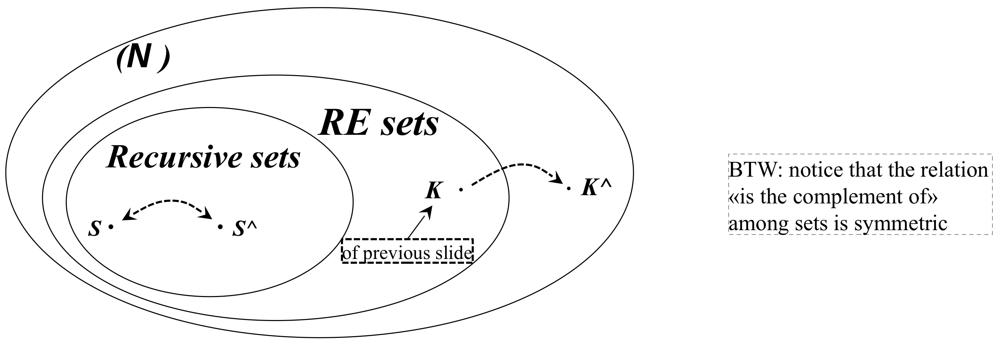

# Church Thesis

* **Main Claim of the Church Thesis**:
	* The thesis states that there is no computational device or formalism that is more powerful than a Turing Machine (TM). In other words, the Turing Machine represents the upper limit of computational power. If a problem can be solved algorithmically, it can be solved by a Turing Machine, and any other model of computation that claims to solve more would still be equivalent to a Turing Machine in power.

* **Not a Theorem, But a Hypothesis**:
	* The Church-Turing Thesis is not a proven theorem; it is a hypothesis based on observation. This means that while it’s widely accepted, it could theoretically be disproven if someone developed a new model of computation that goes beyond the capabilities of a Turing Machine. So, each time a new model is proposed, its power should be compared to the Turing Machine to verify this thesis.

* **Implication for Algorithms**:
	* No algorithm, regardless of the computing tools or devices used, can solve a problem that a Turing Machine cannot solve. Thus, the Turing Machine is regarded as the most powerful model of computation. This concept suggests that any problem unsolvable by a Turing Machine is inherently unsolvable by any algorithmic means.
* **Answering the Question of Algorithmic Solvability**:
	* Given this thesis, the question “Which problems can be solved algorithmically or automatically?” can be answered by identifying the problems that can be solved by a Turing Machine. Therefore, the set of all algorithmically solvable problems is equivalent to the set of problems that a Turing Machine can solve, even though the Turing Machine itself is a relatively simple abstract model.


# Then let us focus on the TM

A few simplifications, **without loss of generality**:

* **Single Tape Turing Machine with a Fixed Alphabet** :

	* For simplicity, the discussion is limited to a single-tape Turing Machine (as opposed to multi-tape machines), and a fixed alphabet ( $A = \{0, 1, \_\}$ \)*, where* $\_$ represents the blank symbol. This simplification doesn’t reduce the computational power of the machine and is often used in theoretical analysis.

* **Notation** $f_y(x) = \perp$ **if** $M_y$ **Does Not Halt on Input** $x$ :

	* Here, $M_y$ represents a specific Turing Machine identified by an index $y$ .

	* $f_y(x)$ represents the output of $M_y$ when it processes input $x$ .

	* If $M_y$ does not halt on input $x$ (meaning it runs indefinitely without reaching a final state), $f_y(x)$ is defined as $\perp$ (a common notation for “undefined” or “does not produce a result”).

* **Stipulations for** $f_y(x) = \perp$ :

	* The stipulation is that if $f_y(x) = \perp$ , it implies that the Turing Machine $M_y$ does not halt on input $x$ .

	* Additionally, if $M_y$ reaches a non-final state on input x and continues indefinitely (e.g., by moving its head to the right without producing meaningful output), it is considered to have not halted. This is treated as equivalent to $f_y(x) = \perp$ , regardless of whether it’s actually performing actions.


## First Relevant Fact

* **Algorithmic Enumeration of Turing Machines**

	* It states that Turing Machines can be **algorithmically enumerated**, meaning we can list each possible Turing Machine in a systematic order. Each Turing Machine corresponds to a unique index, which allows us to reference them individually. This is significant because it allows us to analyze TMs as discrete entities.

* **Enumeration of a Set** $S$ 

	* Here, $E: S \leftrightarrow \mathbb{N}$ represents a mapping from set $S$ (in this case, possibly the set of all TMs or strings) to the natural numbers $\mathbb{N}$ . This mapping defines an ordering of elements in $S$ by assigning each element a unique natural number.

* **Algorithmic Enumeration and the Church-Turing Thesis**

	* The Church-Turing Thesis implies that if we can enumerate a set algorithmically, this enumeration can be carried out by a Turing Machine. Therefore, any set that can be enumerated algorithmically can, in principle, be enumerated by a TM.

* **Enumeration of the Set** $\{a, b\}^ *$ 

	

	* It gives an example of algorithmically enumerating the set $\{a, b\}^*$ , which is the set of all strings that can be formed using the symbols $a$ and $b$ , including the empty string $\epsilon$ .

		* This set includes all possible strings of $a$ ’s and $b$ ’s in lexicographical (dictionary-like) order: $\{\epsilon, a, b, aa, ab, ba, bb, aaa, aab, \ldots \}$ 

		* Each string can be assigned a unique number starting from $0$, producing an ordered list: $\{0, 1, 2, 3, \ldots\}$ . This is called **lexicographical ordering**, where strings are ordered first by length and then alphabetically

* **Transition Function**

	* Each Turing Machine is defined by its transition function $\delta$ , which specifies the behavior of the machine based on its current state and the symbol it reads on the tape.

	* The function $\delta : Q \times A \rightarrow Q \times A \times \{L, R, S\} \cup \{\perp\}$ maps:
		* $Q$ : The set of states.
		* $A$ : The alphabet, including the symbols that can appear on the tape.
		* $\{L, R, S\}$ : Instructions for moving the tape head (left, right, or staying in the same position).
		* $\perp$ : Represents non-halting or undefined transitions.

* **Ordering Turing Machines**

	* Turing Machines can be ordered based on the number of states they have. For machines with the same number of states, we can assign an arbitrary order to the tuples (state, symbol, action) that define each machine’s transition function.

* **Counting Functions of Type** $f: D \rightarrow R$ 

	* To determine the number of possible transition functions, we calculate how many mappings there are from domain $D$ (all possible inputs) to range $R$ (all possible outputs).

	* If $D$ has a certain number of elements and each element in $D$ has $|R|$ choices for mapping, there are $|R|^{|D|}$ possible functions.

* **One-State Machines Example** $|Q| = 1$

	* In the example, $|Q| = 1$ (one state), and $|A| = 3$ (an alphabet with three symbols, likely $0$, $1$, and blank).

	* The calculation $(1 \cdot 3 \cdot 3 + 1)^{1 \cdot 3} = 1000$ gives the number of possible one-state TMs.
		* First $1$ : The next state (which, in this case, can only be the single state itself)
		* First $3$ : The symbol to write on the tape (3 choices: $0$, $1$, or $\_$)
		* Second $3$ : The direction to move the tape head (3 choices: $L$, $R$, or $S$)
		* Second $1$ : Adding the Option of “No Transition” (i.e., the machine halts when it reads that symbol in that state)
		* $1 \cdot 3$ : Since there are 3 possible symbols in the alphabet, there are $1 \times 3 = 3$ state-symbol pairs to consider in total.

	* These machines are labeled $\{M_0, M_1, \ldots, M_{999}\}$ , representing all configurations of one-state TMs.

		

		* Each cell in the transition table shows what happens when the machine reads a specific symbol in state $q_0$ . Possible actions include:

			* Moving left or right (e.g., $(q_0, 0, L)$ means write $0$ and move left while staying in $q_0$ ),

			* Writing a symbol and staying in place, or

			* Having no action (represented by $\perp$ ), meaning that the machine halts when it reads that symbol.

* **Two-State Machines Example** $|Q = 2|$

	* For TMs with two states, we use a similar approach. The formula $(2 \cdot 3 \cdot 3 + 1)^{2 \cdot 3} = 47045881$ gives the number of possible two-state TMs.

	* This approach continues for machines with additional states.

		

		* These machines are labeled starting from $MT_{1000}$ and continue in ascending order


* **Enumeration of Turing Machines**

	* $E: \{ \text{TM} \} \leftrightarrow \mathbb{N}$ represents a mapping between each Turing Machine and a unique natural number.

	* This means we can systematically list all TMs by associating each with an index, effectively “numbering” them.

* **Algorithmic (Effective) Enumeration**

	* $E$ is an **algorithmic** or **effective** enumeration, meaning there exists a computable way to perform this mapping.
	* Given a number $n$ , a computer program (such as a C program or a Turing Machine itself) could generate the $n$-th TM by producing a table describing its transition function $\delta$ .
	* Conversely, if you have a description of a TM $M$ , you can compute its position $E(M)$ in the enumeration.

* **Gödel Number**

	* E(M) is called the **Gödel number** of M , and this enumeration process is known as **Goedelization**.

	* This idea of assigning a unique identifier to each machine or mathematical object was inspired by Kurt Gödel’s work in mathematical logic, where unique numbers were assigned to mathematical expressions.

* **Convention: Using Numbers for Computability**

	* For the purpose of studying computability, we adopt the convention of using these numbers to refer to TMs. This allows us to work with TMs as numeric values, simplifying the analysis of their properties.

* **Solving a Problem = Computing a Function**

	* In this context, solving a problem can be viewed as computing a function $f: \mathbb{N} \rightarrow \mathbb{N}$ .

	* Each TM in the enumeration computes a specific function $f_y$ , where $f_y$ represents the function computed by the $y$-th TM.


## Second Relevant Fact

* **Universal Turing Machine (UTM)**:

	* A UTM is a special type of Turing Machine that can simulate any other Turing Machine.

	* It computes the function: $g(y, x) = f_y(x)$

		* $y$ : Encodes the “program” or “Turing Machine” $M_y$ .

		* $x$ : Input to $M_y$ .

		* $f_y(x)$ : The output of the $y$-th Turing Machine $M_y$ on input $x$ .

	* This makes the UTM a “meta-machine” capable of interpreting both y (the machine to simulate) and x (the input to that machine).

* **Difference in Function Type**:

	* Regular Turing Machines in the family $\{M_y\}$ compute functions of **one variable** ( $f_y(x)$ ).

	* The UTM computes $g(y, x)$ , which is a function of **two variables**.

* **Encoding Two Variables as One**:

	* To represent $g(y, x)$ as a function of one variable (to align with the single-variable framework of TMs), we encode pairs $(y, x)$ into a single natural number.

	* This is possible because natural numbers can be used to uniquely encode integer pairs: $d(x, y) = \frac{(x + y)(x + y + 1)}{2} + x$

		

		* This formula is called the **Cantor pairing function**, which maps $\mathbb{N} \times \mathbb{N} \to \mathbb{N}$ bijectively.
		* The grid shows how pairs $(x, y)$ are enumerated diagonally, starting from $(0, 0)$ , $(0, 1)$ , $(1, 0)$ , $(0, 2)$ , $(1, 1)$ , and so on.
		* This systematic traversal ensures that every pair $(x, y)$ has a unique position in $\mathbb{N}$ .

* **Encoding the Function** $g(y, x)$ :

	* The function $g(y, x)$ (the result of running the $y$-th Turing Machine $M_y$ on input $x$) is encoded as $g^\wedge(n)$, where: $n = d(y, x)$

		* $d(y, x)$ : A pairing function (e.g., Cantor pairing function) that maps the pair $(y, x)$ to a single natural number $n$.

		* $d^{-1}(n)$: The inverse function that decodes $n$ back into the pair $(y, x)$.

		* Both $d$ and $d^{-1}$ are **computable**, so this encoding/decoding process can be effectively managed by the UTM.

* **Operation of the UTM:**

	* **Input:** The UTM takes the encoded value $n$.

	* **Step 1:** It computes $d^{-1}(n)$ to decode $n$ into $(y, x)$.

	* **Step 2:** It retrieves the transition function of $M_y$ (the $y$-th Turing Machine) by using the inverse enumeration function $E^{-1}(y)$, which provides the full description of $M_y$’s transition rules.

	* **Step 3:** It builds and stores the transition table of $M_y$ on a portion of the tape.

* **Storage on the Tape:**

	* The UTM uses distinct portions of its tape to:

		* **Transition function storage:** Encodes the transition table of $M_y$ (e.g., $q, a, q', a', S$, where $q$ is the current state, $a$ is the current symbol, $q'$ is the next state, $a'$ is the symbol to write, and $S$ is the direction to move).

			

		* **Configuration storage:** Stores the current configuration of $M_y$ during its simulation (e.g., tape contents, current state, head position).

			

	* **Special Symbols and Encoding:**

		* Special symbols (e.g., #, $) are used to delimit sections of the tape.

		* These and other elements are encoded as binary strings for simplicity and universality in the UTM’s operation.

	* **Output of the UTM:**

		* The UTM halts and leaves $f_y(x)$ (the result of $M_y$ on input $x$) on its tape **if and only if** $M_y$ **terminates on** $x$.

		* If $M_y$ does not halt on $x$, the UTM will also fail to halt, reflecting the undecidability of certain computations.


## TM v.s. UTM

* **Turing Machine (TM):**

	* A Turing Machine is a **simple and abstract model of a computer**.

	* It represents a **computer with a single, fixed program**:

		* The transition function of the TM defines its “program.”

		* This program is “built-in,” meaning the machine always runs the same algorithm.

	* Consequently, a standard TM computes **only one function** (always producing the same mapping from inputs to outputs, as defined by its fixed program).

* **Universal Turing Machine (UTM):**

	* The UTM is analogous to a **modern computer** because:

		* It can run **multiple programs** by reading their descriptions from its input tape.

		* The UTM’s memory stores both:

			* $y$ : The “program” to be executed (encoded as the description of a TM, $M_y$ ).

			* $x$ : The “input” to the program $M_y$ .

	* The UTM behaves like a “general-purpose computer” that can simulate any TM by interpreting y and running the corresponding program on $x$ .


# Which problems can be solved algorithmically

* **<u>The Problem of Termination</u>**:

	* **Practical Scenario**:

		* A programmer writes a program.

		* The program is provided input data.
		* The program may run indefinitely without halting (e.g., it could “run into a loop”).

	* The question: Can one **determine in advance** whether the program will terminate for a given input?
		* This determination must occur without actually executing the program.
	* **Relevance**:
		* The problem has practical implications for software verification, debugging, and ensuring program reliability.

* **Theoretical Formulation**:

	* Expressed in terms of Turing Machines:

		* A predicate function $g(y, x)$ is defined such that:

			* $g(y, x) = 1$ if $f_y(x) \neq \perp$ (i.e., $M_y$ halts on $x$ ).

			* $g(y, x) = 0$ if $f_y(x) = \perp$ (i.e., $M_y$ does not halt on $x$ ).

		* The question: **Is** $g$ **computable?**
			* In other words, can a Turing Machine exist that determines if another Turing Machine $M_y$ halts on input $x$ ? **NO!!!**
			* A computer **cannot determine in advance** whether a program will run into an infinite loop for a given input. This is due to the Halting Problem, which is **undecidable**.
			* However, computers can easily detect simpler, syntactical issues (e.g., a missing closing brace }), which are **solvable problems**.

* **Examples of Decidable and Undecidable Problems**:

	* **Decidable Problem**:
		* Determining if an arithmetic expression is well-parenthesized is **solvable** (e.g., verifying if parentheses in $((2 + 3) * 5)$ are balanced and correct).
		* Problems that can be solved with an algorithm, such as syntax checking or simple logical validation.

	* **Undecidable Problem**:
		* Determining if a given program will run indefinitely (or terminate) for a specific input is **unsolvable**. This problem cannot be algorithmically decided.
		* Fundamental computational problems that cannot be resolved by any algorithm. The Halting Problem is a primary example.


## Proof

* **Diagonalization Technique**:

	* The proof relies on a method called **diagonalization**, similar to the one used in Cantor’s theorem to prove that the set of real numbers is uncountable.

	* This method constructs a function that cannot belong to the list of all functions computable by Turing Machines, thus leading to a contradiction.

* **Assumption by Contradiction**:
	* Assume that the function $g(y, x)$ , defined as:  $g(y, x) = \begin{cases}
		1 & \text{if } f_y(x) \neq \perp, \\
		0 & \text{if } f_y(x) = \perp,
		\end{cases}$ is computable.
		* $g(y, x)$ decides whether the $y$-th Turing Machine $M_y$ halts on input $x$ ( $f_y(x) \neq \perp$ ) or does not halt ( $f_y(x) = \perp$ ).

* **Construction of the Partial Function** $h(x)$ :

	* Using $g$ , construct a new function $h(x)$ such that: $h(x) = \begin{cases} 1 & \text{if } g(x, x) = 0 \ (\text{i.e., if } f_x(x) = \perp), \\ \perp & \text{if } g(x, x) = 1 \ (\text{i.e., if } f_x(x) \neq \perp).\end{cases}$

	* $h(x)$ behaves differently along the diagonal ( $y = x$ ):

		* If $g(x, x) = 0$ , $h(x) = 1$ .

		* If $g(x, x) = 1$ , $h(x) = \perp$ .

* **Key Observation**:

	* $h(x)$ modifies the behavior of g along the diagonal, flipping “no” answers ( $g(x, x) = 0$ ) into “yes” answers ( $h(x) = 1$ ) and turning “yes” answers ( $g(x, x) = 1$ ) into non-termination ( $h(x) = \perp$ ).

	* This diagonal construction ensures that $h(x)$ cannot match any $f_x$ from the list of functions computed by Turing Machines.

* **Contradiction**:

	* If $h(x)$ is computable, it must be equal to some $f_{x'}(x)$ for some $x'$ . However:
		* When $x = x'$ , the definition of $h(x)$ ensures it behaves differently than $f_x(x)$ , leading to a contradiction.

	* Therefore, $g(y, x)$ cannot be computable.


* **Corollary:**

	* The function $h(x)$ , defined as: $h(x) = 1 \ \text{if} \ f_x(x) \neq \perp, \quad h(x) = 0 \ \text{if} \ f_x(x) = \perp,$ is **not computable**. This was established as part of the proof that the Halting Problem is undecidable.

* **Relationship Between** $h(x)$ **and** $g(y, x)$ **:**

	* $h(x)$ is a **special case** of the function $g(y, x)$ : $g(y, x) = 1 \ \text{if} \ f_y(x) \neq \perp, \quad g(y, x) = 0 \ \text{if} \ f_y(x) = \perp.$

	* Specifically, $h(x) = g(x, x)$ , meaning $h(x)$ evaluates g along the diagonal ( $y = x$ ).

	* Since $g(y, x)$ was proven to be uncomputable, it follows that $h(x)$ , being a specific case of $g$ , is also uncomputable.

* **Independence of Uncomputability:**

	* The uncomputability of $h(x)$ is not necessarily a **direct consequence** of $g(y, x)$ ’s uncomputability.

	* In general:

		* If a problem is unsolvable, a **special case of it might be solvable**.

		* Conversely, a **generalization of a solvable problem might be unsolvable**.

	* For example:
		* Certain properties of regular languages are solvable even if they are undecidable for more general language classes.

* **Important Distinctions:**

	* **Generalization vs. Specialization**:

		* If a generalized problem is unsolvable, a specialized version may still be solvable in restricted cases.

		* If a specific problem is solvable, any special case of it is also solvable, but generalizations of it may become unsolvable.


# Another Important Unsolvable Problem

* **Defining the Problem:**

	* The function $k(y)$ is defined as: $k(y) = \begin{cases}
		1 & \text{if } f_y(x) \neq \perp \ \forall x \in \mathbb{N}, \ (\text{i.e., } f_y \text{ is total}), \\
		0 & \text{otherwise}.
		\end{cases}$

		* $f_y$ : The function computed by the $y$-th Turing Machine $M_y$ .

		* Totality ( $f_y \text{ is total}$ ):
			* $f_y$ is considered total if it produces an output ( $f_y(x) \neq \perp$ ) for **all inputs** $x \in \mathbb{N}$ .
			* If there exists even a single $x$ where $f_y(x) = \perp$ , the function is not total.

	* **Key Result**: The function k(y) is **not computable**. That is, there is no algorithm (or Turing Machine) that can decide whether a given Turing Machine $M_y$ computes a total function.

* **Practical Relevance Compared to the Halting Problem:**

	* **Halting Problem**:
		* Asks whether a program $M_y$ will terminate for a **specific input** $x$ .

	* **Totality Problem (related to** $k(y)$ **)**:
		* Asks whether a program $M_y$ will terminate for **all inputs** $x$ .

	From a practical standpoint:

	* The totality problem is even more significant because:

		* It asks whether a program (e.g., a service or process) will work correctly for **all possible inputs** rather than just a specific input.

		* For example, we may want to verify whether a program behaves predictably and terminates for any input in a production environment.

* **Relation to Rice’s Theorem:**

	* **Rice’s Theorem**:

		* States that **any non-trivial property of the language recognized by a Turing Machine is undecidable**.

		* Non-trivial property: A property that is true for some, but not all, computable functions.

	* $k(y)$ :

		* The property $f_y \text{ is total}$ is an example of such a non-trivial property:

		* Some Turing Machines compute total functions.

		* Others do not (e.g., they fail to halt for some inputs).

	Thus, by Rice’s Theorem, $k(y)$ is undecidable.

* **The Problem: Totality of** $f_y$ 

	* $f_y$ is considered **total** if $f_y(x) \neq \perp (i.e., M_y \ halts)$ for **every input** $x \in \mathbb{N}$ .

	* The question: Can we determine if $f_y$ is total using **testing** (i.e., checking $f_y(x)$ for multiple inputs)?

* **Why Testing is Useless**:

	* Testing $f_y$ on individual inputs $x$ can show that $f_y(x) \neq \perp$ for some $x$ . However:

		* **Finding evidence that** $f_y$ **is not total**:
			* If we find even one $x$ such that $f_y(x) = \perp$ , we can conclusively say that $f_y$ is not total.

		* **Failing to find such an** $x$ :
			* If we do not find an $x$ where $f_y(x) = \perp$ , we cannot conclude that $f_y$ is total because there may still exist some $x$ for which $f_y(x) = \perp$ (we may not have tested enough inputs).

	* Totality requires testing **all possible inputs**, which is impossible for infinite domains like $\mathbb{N}$ .

* **The Asymmetry of Evidence**:

	* It is easier to prove that $f_y$ is **not total** than to prove that $f_y$ is **total**:

		* Finding one $x$ with $f_y(x) = \perp$ is sufficient to show $f_y$ is not total.

		* Showing that $f_y(x) \neq \perp$ for all $x$ is impossible via testing because there are infinitely many $x$ to check.

* **Practical Insight**:

	* Testing is helpful for specific inputs but insufficient for general properties like totality.

	* Totality is a **global property** of the function and requires knowledge of $f_y(x)$ for all $x$ , which cannot be achieved through testing alone.

* **Clarification on Individual Cases**:
	* If we somehow establish that $f_y$ is total, there would be no doubt about its behavior on any specific $x$ . However, this determination itself is impossible for arbitrary $f_y$ .


## Proof

* **Setting the Stage:**

	* Hypothesis: Assume $k(y)$ is computable.
		* $k(y) = 1$ if $f_y$ is total (i.e., $f_y(x) \neq \perp$ for all $x \in \mathbb{N}$ ).
		* $k(y) = 0$ otherwise.

	* Define $g(x)$ as:

		* $g(x) = w$ , where $w$ is the Gödel number (or index) of the $x$-th Turing Machine $M_w$ that computes a total function.

		* The function $g(x)$ identifies the index of the next Turing Machine that computes a total function.

* **Properties of** $g(x)$ **:**

	* If $k(y)$ is computable, $g(x)$ can also be constructed algorithmically:

		* Start with $k(0), k(1), \dots$ and find the smallest $w_0$ such that $k(w_0) = 1$ . Set $g(0) = w_0$ .

		* Next, find the second smallest $w_1$ such that $k(w_1) = 1$ . Set $g(1) = w_1$ , and so on.

	* This process ensures $g(x)$ is total and strictly monotonic ( $w_{x+1} > w_x$ ).

* **Constructing** $h(x)$ **:**

	* Define $h(x) = f_{g(x)}(x) + 1$ :

		* $f_{g(x)}(x)$ is the function computed by the $g(x)$-th Turing Machine when given $x$ .

		* Adding $1$ ensures $h(x)$ behaves differently from $f_{g(x)}(x)$ , which leads to a contradiction.

	* **Key Observations:**

		* $h(x)$ is total and computable (if $g(x)$ is computable).

		* However, by definition, $h(x)$ must differ from $f_w(x)$ for any $w$ , leading to a logical inconsistency.

* **Contradiction:**

	* Assume $h(x) = f_{w_0}(x)$ for some $w_0$ . Then:

		1. Let $g^{-1}(w_0) = x_0$ , meaning $w_0 = g(x_0)$ .

		2. Evaluate $h(x_0)$ :

			* From $h(x) = f_{g(x)}(x) + 1 : h(x_0) = f_{g(x_0)}(x_0) + 1 = f_{w_0}(x_0) + 1$ .

			* From $h(x) = f_{w_0}(x) : h(x_0) = f_{w_0}(x_0)$ .

		3. This implies $f_{w_0}(x_0) = f_{w_0}(x_0) + 1$ , which is a contradiction.

* **Conclusion:**

	* The contradiction shows that $h(x)$ cannot exist if $k(y)$ is computable.
	* Therefore, $k(y)$ is **not computable**, proving that it is impossible to decide whether a Turing Machine computes a total function.


# Knowing that a problem is Solvable does NOT mean being able to solve it

* **Non-Constructive Proofs in Mathematics:**

	* In mathematics, it is common to encounter **non-constructive proofs**, where one proves the existence of a mathematical object without explicitly constructing it.

	* For example:
		* A proof might show that “a solution exists” without providing a way to find or exhibit that solution.

* **Solvable Problems in Computability:**

	* A problem is considered **solvable** if there exists a Turing Machine (TM) that can solve it.

	* However:

		* Even if we know a TM exists, we may not be able to construct or identify it.

		* The set of all possible TMs might include the “correct one,” but we might not know which it is.

* **Illustrative Example - Closed Questions:**

	* A **trivial case** involves answering a yes/no question where the answer does not depend on input data (a “closed question”):

	* Examples:

		* “Is the number of atoms in the universe $10^{10^{10^{10}}}$ ?”

		* “Will the ‘perfect chess game’ always end in a draw?”

	* While these questions may have definitive answers, finding those answers may be impractical or beyond our computational capabilities.

* **Yes/No Answers Are Known a Priori:**

	* For certain types of problems, we know **a priori** that the answer must be either **Yes** (True, 1) or **No** (False, 0).

	* However, we may not know which of these two answers applies until the solution is discovered (if ever).

* **Mapping Problems to Functions:**

	* In computability theory, problems can be understood as equivalent to computing functions:
		* Solving a problem = Computing the corresponding function.

	* **Encoding Yes/No Problems:**

		* Using TRUE = 1 and FALSE = 0 , any yes/no problem can be reduced to a **constant function**:

			* $f_1(x) = 1$ (always True for all $x$ ).

			* $f_0(x) = 0$ (always False for all $x$ ).

		* Both $f_1$ and $f_0$ are trivially computable since they are constant functions.

	* **Key Observation:**
		* Regardless of what the actual answer is, the **problem is computable** because we are guaranteed that the solution is either $f_1(x)$ or $f_0(x)$ .

* **The Halting Problem as an Example:**

	* Consider the function $g(y, x)$ , where:

		* $g(y, x) = 1$ if $f_y(x) \neq \perp$ (i.e., if TM $M_y$ halts on input $x$ ).

		* $g(y, x) = 0$ if $f_y(x) = \perp$ (i.e., if TM $M_y$ does not halt on input $x$ ).

	* Specific examples of $g$ :

		* $g(10, 20)$ : Does TM $M_{10}$ halt on input $20$ ?

		* $g(100, 200)$ : Does TM $M_{100}$ halt on input $200$ ?

		* Each of these represents a specific solvable problem (i.e., the question has a definite answer: Yes or No).

	* **Important Caveat:**
		* While each specific $g(y, x)$ (for fixed $y$, $x$ ) corresponds to a solvable problem, we may not actually know the solution (i.e., whether $g(10, 20) = 1$ or $g(10, 20) = 0$ ).


# Decidability & Semidecidability

* **Framing Problems as Binary Questions**:

	* Any problem can be phrased as a **yes/no question**: $\text{“Given a set } S \subseteq \mathbb{N} \text{ and an input } x \in \mathbb{N}, \text{ is } x \in S? \text{"}$

	* This formulation allows all problems to be viewed in terms of membership in a set, making them equivalent to language recognition problems.

* **Characteristic Function (Predicate):**

	* The **characteristic function** $c_S(x)$ for a set $S$ is defined as: $c_S(x) = \begin{cases} 1 & \text{if } x \in S, \\ 0 & \text{if } x \notin S. \end{cases}$

		* $c_S(x)$ determines membership in $S$ .

		* By definition, $c_S(x)$ is **total** (it produces a result for any input $x$ ).

* **Decidability and Recursive Sets:**

	* A set $S$ is called **recursive** (or **decidable**) if its characteristic function $c_S(x)$ is computable.

		* The term **decidable** is commonly used in computability theory to describe problems that can be solved by an algorithm.
		* Similarly, a set $S$ being recursive is just another way of saying its membership problem is decidable.

		* This means there exists a Turing Machine that can compute $c_S(x)$ for any $x$ , determining membership in $S$ in a finite amount of time.

	* **Equivalence**:

		* Saying $S$ is recursive is equivalent to saying the problem of deciding membership in $S$ is solvable.

	* For instance, consider the Halting Problem:

		* The set $S = \{ (y, x) \mid \text{TM } M_y \text{ halts on input } x \}$ represents the halting problem.

		* Determining membership in $S$ is equivalent to solving the Halting Problem.

		* Since the Halting Problem is undecidable, $S$ is not recursive.

* **Definition of Recursively Enumerable (RE) Sets:**

  * A set $S \subseteq \mathbb{N}$ is recursively enumerable (RE) if and only if:

  	* $S$ is the empty set ( $S = \emptyset$ ), or


  	* $S$ is the **image** of a total, computable function $g_S$ , called the **generating function** of $S$ : $S = \{x \mid x = g_S(y), y \in \mathbb{N}\}$ 

  * This means that:

  	* $g_S$ enumerates the elements of $S$ , generating $S$ as: $S = \{g_S(0), g_S(1), g_S(2), g_S(3), \dots \}$.

  	* The term “recursively enumerable” reflects the fact that S can be **algorithmically enumerated** by $g_S$ .

* **Semidecidability:**

	* The term “semidecidable” reflects the behavior of Turing Machines for RE sets:

		* **Membership in** $S$ **:**
			* If $x \in S$ , then $g_S$ will eventually produce $x$ during enumeration. Hence, we can **confirm membership** with a “yes.”

	
		* **Non-membership in** $S$ **:**
			* If $x \notin S$ , the enumeration procedure does not terminate, meaning we cannot definitively say $x \notin S$ . The procedure may continue indefinitely.
	

	* Thus, $S$ is semidecidable because:

		* A Turing Machine can confirm membership for $x \in S$ .
	
	
		* But for $x \notin S$ , it cannot provide a definitive “no.”
	
	* The concept of RE sets applies to many undecidable problems:
	
		* The Halting Problem is a classic example of an RE set:
	
			* The set $S = \{(y, x) \mid \text{TM } M_y \text{ halts on input } x \}$ is RE.
	
			* If a TM halts, you can confirm it.
	
			* If a TM does not halt, you cannot confirm non-membership.


# Theorem

* **A) If** $S$ **is recursive (decidable), it is also RE (semidecidable).**

	* Recursive (decidable) sets are more than semidecidable; they allow us to decide both membership ( $x \in S$ ) and non-membership ( $x \notin S$ ) in finite time.

	* A recursive set $S$ has a characteristic function $c_S(x)$ that is computable, meaning:

		* $c_S(x) = 1$ if $x \in S$ ,

		* $c_S(x) = 0$ if $x \notin S$ .

	* Since RE only requires confirming membership ( $x \in S$ ) by enumeration, all recursive sets are trivially RE.

* **B)** $S$ **is recursive if and only if both** $S$ **and its complement** $S^c = \mathbb{N} - S$ **are RE.**

	* For a set to be recursive, it must be possible to:
		1. Confirm membership ( $x \in S$ ).
		2. Confirm non-membership ( $x \notin S$ ).

	* If both $S$ and $S^c$ are RE:

		* Membership ( $x \in S$ ) can be confirmed by enumerating $S$ .

		* Non-membership ( $x \notin S$ ) can be confirmed by enumerating $S^c$ .
		* This dual confirmation means $S$ is recursive.

* **Corollary:**

	* The class of recursive (decidable) sets is **closed under complement**:
		* If $S$ is recursive, then $S^c$ is also recursive.
		* Decidability guarantees that both membership and non-membership are algorithmically determinable.


## Proof A

* **Base Case:** $S = \emptyset$ **:**

	* If $S$ is the empty set, it is trivially RE.

		* A generating function $g_S$ does not enumerate any elements, as there are none to enumerate.

		* Thus, $S = \emptyset$ satisfies the conditions of an RE set.

* **Non-Empty Case:** $S \neq \emptyset$ **:**

	* Assume $S \neq \emptyset$ .

	* Let $c_S$ denote the **characteristic predicate** of $S$ :

		* $c_S(x) = 1$ if $x \in S$ ,

		* $c_S(x) = 0$ if $x \notin S$ .

		* Since $S$ is recursive, $c_S$ is computable.

	* Since $S \neq \emptyset$ , there exists some $k \in S$ such that $c_S(k) = 1$ .

* **Defining the Generating Function** $g_S$ **:**

	* Define $g_S(x)$ as follows: $g_S(x) = \begin{cases} x & \text{if } c_S(x) = 1 \ (\text{if } x \in S), \\ k & \text{otherwise}, \end{cases}$
		* where $k$ is an element of $S$ (from the assumption that $S \neq \emptyset$ ).

* **Properties of** $g_S$ **:**

	* $g_S$ is:

		* **Total**: Defined for all $x \in \mathbb{N}$ .

		* **Computable**: Since $c_S(x)$ is computable, $g_S(x)$ is computable.

	* The image of $g_S$ is $S$ :
		* $g_S$ enumerates all elements of $S$ and only elements of $S$ .

* **Conclusion:**

	* $g_S$ meets the definition of a generating function for recursively enumerable sets.

	* Hence, $S$ is RE.

* **Notes:**

	* **Non-constructive Nature of the Proof:**

		* The proof assumes the existence of at least one $k \in S$ without providing a way to construct $k$ .

		* If $S \neq \emptyset$ , such a $k$ must exist. This is sufficient for proving the result without needing to explicitly find $k$ .


## Proof B

* **B.1) If** $S$ **is recursive, then** $S$ **and** $S^c$ **are RE:**

	* $S$ **is recursive implies** $S$ **is RE:**
		* This was already proven in part **A** of the theorem. Since $S$ is recursive, its characteristic function $c_S(x)$ is computable, allowing enumeration of $S$ .

	* $S$ **is recursive implies** $S^c$ **is RE:**

		* The complement $S^c$ has the characteristic function: $c_{S^c}(x) = \begin{cases} 1 & \text{if } x \notin S, \\ 0 & \text{if } x \in S. \end{cases}$

		* Since $S$ is recursive, $c_S(x)$ is computable, and $c_{S^c}(x) = 1 - c_S(x)$ is also computable.

		* Using $c_{S^c}(x)$ , we can construct an enumeration for $S^c$ , making $S^c$ RE.

* **B.2) If** $S$ **and** $S^c$ **are RE, then** $S$ **is recursive:**

	* **Enumerations for** $S$ **and** $S^c$ **:**
		* Since $S$ and $S^c$ are RE, we can construct generating functions $g_S$ and $g_{S^c}$ such that: $S = \{g_S(0), g_S(1), g_S(2), \dots\}, \quad S^c = \{g_{S^c}(0), g_{S^c}(1), g_{S^c}(2), \dots\}$.

	* **Relationship Between** S **and** S^c **:**

		* By definition, $S \cup S^c = \mathbb{N}$ (every element belongs to $S$ or $S^c$ ), and $S \cap S^c = \emptyset$ (no element belongs to both).

		* This ensures that each $x \in \mathbb{N}$ belongs to exactly one of $S$ or $S^c$ .

	* **Interleaving Enumerations:**

		* Create a combined enumeration that alternates between $g_S$ and $g_{S^c}$ : $g_{\text{combined}}(x) = \begin{cases} g_S(n) & \text{if } x = 2n, \\ g_{S^c}(n) & \text{if } x = 2n + 1. \end{cases}$

		* This combined enumeration allows us to determine $x \in S$ or $x \in S^c$ based on the enumeration’s structure:

			* $x \in S$ if it appears in an **even position**.

			* $x \in S^c$ if it appears in an **odd position**.

	* **Decidability of** $S$ **:**

		* Given $x \in \mathbb{N}$ , we can compute whether $x$ belongs to $S$ or $S^c$ by analyzing the combined enumeration.

		* Since membership and non-membership can both be confirmed, $S$ is recursive.


# Other Important Results

* **Characterization of RE Sets:**

	* **RE Sets via Partial Computable Functions**:
		* A set $S$ is recursively enumerable (RE) if and only if: $S = D_h = \{x \mid h(x) \neq \perp\}$
			* $h$ is a partial computable function (i.e., $h$ may not be defined for all $x$ ).
	* **RE Sets via Images of Computable Functions**:
		* $A$ set $S$ is RE if and only if: $S = I_g = \{x \mid \exists y \in \mathbb{N} : x = g(y)\}$
			* $g$ is a total, computable function. Here, $g$ generates or enumerates $S$ .

	These two characterizations highlight different perspectives on RE sets:

	* $D_h$ : Membership is determined by whether $h(x)$ halts.

	* $I_g$ : Membership is determined by whether $x$ can be enumerated by $g(y)$ .

* **Languages Recognized/Accepted by Turing Machines:**

	* RE sets characterize the languages that are **recognized** or **accepted** by Turing Machines:
		* A Turing Machine recognizes/accepts a language if it halts on all inputs in the language ( $x \in S$ ) but may loop indefinitely for inputs not in the language ( $x \notin S$ ).

	* **Difference Between Recognize/Accept and Decide:**

		* **Decide**: The Turing Machine halts for all inputs, providing a definitive “yes” or “no.”

		* **Recognize/Accept**: The Turing Machine halts only for inputs in the language ( $x \in S$ ) and may loop indefinitely otherwise.

* **Semidecidable Sets That Are Not Decidable:**

	* Some sets are semidecidable but not decidable. For example:

		* Define $K = \{x \mid f_x(x) \neq \perp\}$ , where $f_x(x)$ is a partial computable function.

		* $K$ is semidecidable because:

			* A Turing Machine can confirm membership ( $x \in K$ ) by determining whether $f_x(x)$ halts.

			* This aligns with the characterization $K = D_h$ , where $h(x) = f_x(x)$ .

	* **Why** $K$ **is Not Decidable**:

		* The characteristic function $c_K(x)$ : $c_K(x) = \begin{cases} 1 & \text{if } f_x(x) \neq \perp, \\ 0 & \text{if } f_x(x) = \perp, \end{cases}$

			is not computable, as it would require solving the Halting Problem (undecidable).




* **Set Hierarchies**:

	* **Recursive Sets**:
		* These are the decidable sets where membership ( $x \in S$ ) and non-membership ( $x \notin S$ ) can both be determined in finite time.

	* **RE Sets**:
		* These are the semidecidable sets where membership ( $x \in S$ ) can be confirmed, but non-membership ( $x \notin S$ ) may not always be verifiable.

	* $\mathbb{N}$ :
		* Represents the universal set of natural numbers, which contains all recursive and RE sets.

* **Inclusions are Strict**:

	* Every recursive set is also RE, but not every RE set is recursive.
		* **Why?** RE sets allow for indefinite loops for non-membership, whereas recursive sets require a decision for every input.

* **Complements of Sets:**

	* **Recursive Complements**:
		* If $S$ is recursive, its complement $S^c$ is also recursive.
			* Recursive sets are **closed under complement**.

	* **RE Complements**:

		* If $S$ is RE, its complement $S^c$ may or may not be RE.

			* The Halting Problem ( $S$ ) is RE (we can confirm halting).

			* Its complement ( $S^c$ , where TMs do not halt) is **not RE**, as we cannot confirm non-halting in general.

* **Corollary:**

	* **The Class of RE Sets is Not Closed Under Complement**:
		* If RE sets were closed under complement, then every RE set $S$ and its complement $S^c$ would both be RE.
		* This would imply $S$ is recursive (since decidable sets require membership and non-membership to be verifiable).
		* However, not all RE sets are recursive, proving that RE sets are **not closed under complement**.


# Undecidability of the Halting Problem as a Key to R $\neq$ RE

* **Importance of the Halting Problem:**

	* The undecidability of the Halting Problem is not a “bizarre anomaly”; it is a **fundamental fact** of computation.

	* It serves as the basis for differentiating recursive sets (R) from recursively enumerable (RE) sets.

* **Theorem: If Halting Were Decidable, Then R = RE:**

	* **Statement:** 

		* If the Halting Problem were decidable, the distinction between recursive and recursively enumerable sets would collapse, i.e., R = RE .

	* **Proof:**

		* **Assume** $S$ **is semidecidable (RE):**

			* There exists a Turing Machine $M_S$ that semidecides $S$ :

				* $M_S$ halts and accepts $x$ if $x \in S$ .

				* $M_S$ does not halt if $x \notin S$ .

		* **Assume Halting is Decidable:**

			* If the Halting Problem were decidable, we could determine in advance whether $M_S$ halts on input $x$ without running $M_S$ .

		* **Using the Decidability of Halting:**

			* For any $x$ :

				* If $M_S$ halts on $x$ , conclude $x \in S$ (accept $x$ ).

				* If $M_S$ does not halt on $x$ , conclude $x \notin S$ (reject $x$ ).

		* **Implication:**

			* If Halting were decidable, $M_S$ would effectively decide $S$ , making $S$ recursive.

			* Hence, every RE set would also be recursive, collapsing the distinction between R and RE .


# The Mighty Rice Theorem

* **Statement of Rice’s Theorem:**

	* Let $F$ be a set of computable functions.

	* Define $S$ as the set of indices of Turing Machines that compute functions in $F$ : $S = \{x \mid f_x \in F\}$,
		* $f_x$ is the function computed by the Turing Machine with index $x$ .

	* **Rice’s Theorem** states:

		* $S$ is decidable **if and only if**:
			1. $F = \emptyset$ (i.e., $S$ is empty), or
			2. $F$ is the set of all computable functions.

		* For **all other cases** (where $F$ is neither empty nor includes all computable functions), $S$ is **not decidable**.

* **Implications of Rice’s Theorem:**

	* **Non-Trivial Cases are Undecidable**:

		* If there exist some functions $f \in F$ and others $f \notin F$ , then $S$ is not decidable.

		* This includes almost all interesting properties of functions, making them undecidable.

	* **Examples of Undecidable Problems**:

		* **Program Correctness**:

			* Given a problem $P$ and a program $M_p$ , determine if $M_p$ solves $P$ .

			* This corresponds to checking if $f_{M_p} \in F$ , where $F$ is the set of correct solutions for $P$ .

		* **Program Equivalence**:
			* Given two programs $M_x$ and $M_y$ , determine if they compute the same function.
			* This corresponds to checking if $f_x = f_y$ , which is undecidable.

		* **Specific Properties of Programs**:

			* Does a program produce a function with only even values?

			* Does a program have a limited range (e.g., outputs only a finite set of values)?

			* These questions correspond to specific subsets $F$ of functions and are undecidable by Rice’s theorem.

* **Why is this Important?:**

	* Rice’s theorem highlights the fundamental limitations of computability:

		* It shows that we cannot, in general, decide whether a program has a specific property, unless that property is trivial (applies to all or no programs).

		* This applies to any non-trivial semantic property of the function computed by a Turing Machine.

* **Practical Consequences:**

	* Many interesting questions in software engineering and program analysis are undecidable due to Rice’s theorem:

		* Can we verify that a program is free of bugs?

		* Can we determine whether two programs are equivalent in behavior?

		* Can we guarantee that a program adheres to a given specification?

	* These problems often require approximations or heuristics because exact solutions are impossible.


# How can we, in practice, determine that a problem/set is (semi)decidable or not

* **Decidability and Semidecidability:**

	* **Decidable**:
		* If you can find an **algorithm that always terminates** (whether the answer is yes or no), the problem is decidable.

	* **Semidecidable**:
		* If you can find an **algorithm that may not terminate**, but it **always terminates when the answer is positive (yes)**, the problem is semidecidable.

* **Proving Undecidability or Non-Semidecidability:**

	* When you suspect a problem is **not decidable** or **not semidecidable**, proving this can be challenging.

	* The naive approach of creating a new diagonal proof for each problem is inefficient.

* **Easier Methods:**

	* **Rice’s Theorem**:

		* A powerful and general tool for proving undecidability.

		* Applicable to a wide range of problems related to the properties of computable functions (e.g., software features or program behavior).

		* It simplifies the process by showing that any non-trivial semantic property of a program is undecidable.

	* **Other General Technique**:

		* **Reductions**:

			* Reducing a known undecidable problem (e.g., the Halting Problem) to the problem in question.

			* This proves that solving the new problem would also solve the undecidable problem, establishing undecidability.


## Problem Reduction

* **Definition of Problem Reduction:**

	* Problem $P'$ is **reducible** to problem $P$ if solving $P$ allows us to solve $P'$ .

	* This is achieved through an **algorithmic transformation**:

		* Given an instance of $P'$ , we algorithmically produce an instance of $P$ .

		* The solution of $P$ is then used to derive the solution of $P'$ .

* **Trivial Example:**

	* **Multiplication Reduced to Basic Arithmetic**:

		* The product $a \times b$ can be computed using only:

			* Addition, subtraction, squaring, and division by 2.

			* Using the formula: $a \times b = \frac{(a + b)^2 - a^2 - b^2}{2}$,

			multiplication is reduced to operations in the set $\{ \text{sum, difference, square, divide by 2} \}$ .

* **General Description:**

	* **Reduction Process**:

		* Start with an instance of problem $P'$ .

		* Transform it into an instance of $P$ using a **computable function** $t(x)$ .

		* Solve the transformed problem using an algorithm for $P$ .

		* Use the solution of $P$ to derive the solution for $P'$ .

	* **Set Inclusion Formulation**:

		* Suppose we want to determine whether $x \in S'$ , but solving $S'$ is difficult or unknown.

		* If we can transform $x$ into $t(x)$ , such that: $x \in S' \iff t(x) \in S$, and $S$ is already solvable, then $P'$ has been reduced to $P$ .

		* This establishes that solving $P$ implies we can solve $P'$ .

	* **Decidability Transfer**:
		* If $P$ is decidable, and $P'$ reduces to $P$ , then $P'$ is also decidable.
			* Denoted as: $\text{Dec}(S) \to \text{Dec}(S')$.

* **Reduction in Reverse: Proving Undecidability**

	* Reduction can also be used to show that a problem $S$ is **not decidable**:

		* Start with a problem $S'$ that is known to be undecidable ( $\neg \text{Dec}(S')$ ).

		* Show that solving $S$ would allow us to solve $S'$ ($\text{Dec}(S) \rightarrow \text{Dec}(S')$) :
			* Define a **computable total function** $t$ such that: $y \in S' \iff t(y) \in S$.

		* If $S$ were decidable, then $S'$ would also be decidable (contradicting $\neg \text{Dec}(S')$ ).

		* Therefore, $S$ is also undecidable ( $\text{Dec}(S) \rightarrow \text{Dec}(S')$ hence $\neg \text{Dec}(S') \rightarrow \neg \text{Dec}(S)$ ).

* **Example: Undecidability of Program Termination**

	* Using the Halting Problem as a known undecidable problem, we can infer the undecidability of termination for other systems:

		* Consider a Turing Machine $M_y$ and an integer $x$ .

		* Build a C program $P$ that simulates $M_y$ and stores $x$ in an input file $f$ .

		* The program $P$ terminates its computation on $f$ if and only if $f_y(x) \neq \perp$ (i.e., $M_y$ halts on $x$ ).

	* **Reduction**:

		* If we could decide whether $P$ terminates on $f$ , we could also solve the Halting Problem for $M_y$ on $x$ .

		* Since the Halting Problem is undecidable, it follows that determining whether $P$ terminates is also undecidable.


### Reduction is a general, powerful technique

Is the problem “**Does a generic program** $P$ **access an uninitialized variable?**” decidable?

* **Assumption**:

	* Assume that the problem of diagnosing uninitialized variable access is **decidable**.

* **Reduction from the Halting Problem**:

	* The Halting Problem is known to be undecidable. If we can reduce the Halting Problem to the uninitialized variable problem, then the uninitialized variable problem must also be undecidable.

	* Consider a program $P$ that represents an instance of the Halting Problem.

* **Transforming the Halting Problem into the Uninitialized Variable Problem**:

	* Construct a new program $P^\wedge$ based on $P$ :

		```c
		begin var x, y: ...
		P;  // Execute program P
		y := x;  // Access an uninitialized variable
		end
		```

		* Variables `x` and `y` are newly introduced and are not used in $P$ .

		* After $P$ finishes, the statement `y := x` attempts to assign the uninitialized value of `x` to `y` .
		* The assignment `y := x` in $P^\wedge$ results in accessing an uninitialized variable `x` **if and only if** `P` terminates.
		* Thus, solving the uninitialized variable problem for $P^\wedge$ would solve the Halting Problem for $P$ .

* **Contradiction**:

	* If the uninitialized variable problem were decidable, the Halting Problem would also be decidable.

	* Since the Halting Problem is undecidable, the uninitialized variable problem must also be undecidable.


**Reduction techniques** can show that determining certain runtime properties of programs is undecidable, similar to the way undecidability of the Halting Problem is proven.

* **Array Indices Out of Bounds**:

	* Deciding whether a program will ever attempt to access an array index outside its declared bounds.

	* For example, trying to access `array[10]` when the array is declared with a size of 5.

* **Division by 0**:

	* Deciding whether a program will ever attempt to divide a number by zero during execution.

* **Dynamic Type Compatibility**:

	* Determining whether runtime type mismatches will occur in programs that perform dynamic type checking (e.g., attempting to treat an integer as a string).

* **General Runtime Errors**:

	* Catching various runtime exceptions like invalid memory access, stack overflows, or uninitialized variable usage.


* **Semidecidability of Related Sets:**

	* **Halting Problem**:

		* If the Turing Machine $M$ halts on a given input, you will eventually detect it when it halts.

		* If it does not halt, you will never know for sure.

	* **Division by Zero or Similar Runtime Errors**:

		* If there exists any input $x$ such that a program $P$ , executed on $x$ , performs a division by zero, you will eventually find this input by observing the program’s execution.

		* However, if no such input exists, you will never know for certain.

		* **How can we ensure that division by zero is detected, if it exists, across all possible inputs?**
			* If program $P$ , executed on $x$ , does not halt, how can we determine if $P$ , executed on some other input $y \neq x$ , will execute a division by zero?


* **Theorem Statement:**

	* The set of values $x$ (indexes of Turing Machines) for which there exists a $z$ such that $f_x(z) \neq \perp$ (the computation does not diverge) is **semidecidable**.

	* In this case:

		* $x$ represents the Turing Machine.

		* $z$ is an input for the function $f_x$ .

	* **Semidecidability** means:
		* If such a $z$ exists for a given $x$ , you can eventually find it.
		* If no such $z$ exists, you can never definitively conclude that it does not exist.

* **Sketch of the Proof:**

	* **Basic Idea**:

		* If $f_x(0) \neq \perp $, you can immediately answer “yes” to the question of whether there exists such a $z$ .

		* However, if $f_x(0)$ diverges (does not halt), you need a systematic way to search through inputs $z$ for which $f_x(z) \neq \perp$ 

	* **The Dovetailing Technique**:

		* A systematic method to interleave the computation of multiple inputs $z$ in parallel.

		* Steps:

			1. Simulate **1 step** of $f_x(0)$ .
			2. Simulate **1 step** of $f_x(1)$ .
			3. Simulate **2 steps** of $f_x(0)$ .
			4. Simulate **2 steps** of $f_x(1)$ , followed by **1 step** of $f_x(2)$ .
			5. Continue this process as shown in the diagram.

			

		* This ensures that if any $f_x(z) \neq \perp$ , it will eventually be discovered, no matter how long it takes for the computation to halt.


## Conclusion

* **Semidecidable Problems:**

	* A significant number of computational problems are **not decidable** but are **semidecidable**.

	* For semidecidable problems:

		* **Presence**: You can confirm the presence of a solution (e.g., finding an error or detecting halting).

		* **Absence**: You cannot confirm the absence of a solution (e.g., proving the absence of errors or guaranteeing halting).

* **Detecting Presence vs. Absence:**

	* The semidecidable set is the set of programs that **exhibit errors** (e.g., erroneous programs).

	* The set of programs that are **error-free** (absence of errors) is **not semidecidable**, because:

		* The complement of a semidecidable set is not guaranteed to be semidecidable unless the original set is decidable.

		* Hence, proving correctness (absence of errors) is a much harder problem than detecting errors.

* **Correctness and Complement Sets:**

	* **Correctness (error-free programs)**:
		* Not only is it undecidable, but it is also **not semidecidable**.
		* This follows from the fact that if both a set and its complement were semidecidable, the set would be decidable (which contradicts undecidability).

* **Practical Implications on Testing:**

	* Famous quote by **Edsger Dijkstra**:

		* “**Testing can prove the presence of errors, not their absence.**

			* A single test case that reveals an error confirms the program is incorrect.

			* However, no amount of testing can guarantee that a program is error-free (since it would require exhaustive verification, which is undecidable).

* **Systematic Technique:**

	* To prove that a problem is **not RE** (recursively enumerable):

		* Demonstrate that its complement is RE.

		* This provides a systematic approach to understanding unsolvable problems in computation.
