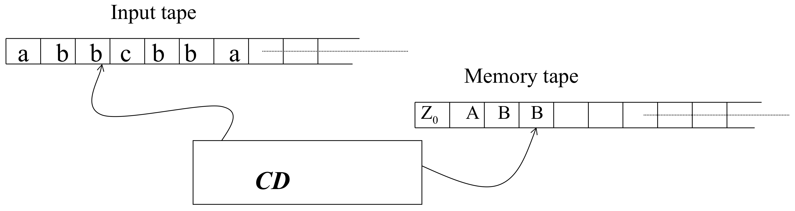
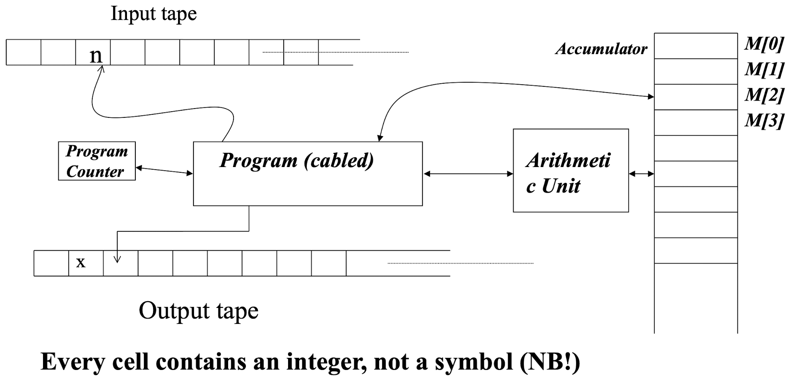
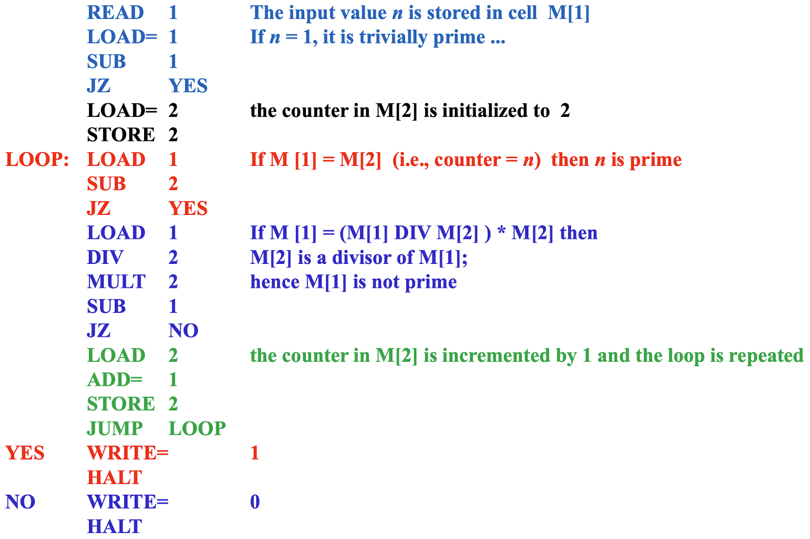
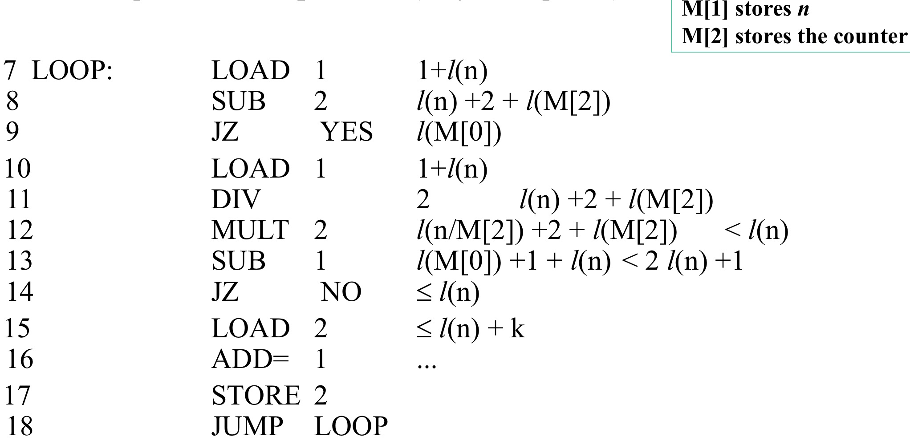

# Deterministic TM

* **Time Complexity (**$T_M(x)$**)**:

	* A computation on a deterministic TM is represented as a sequence of configurations: $c_0 \vdash c_1 \vdash c_2 \vdash \cdots \vdash c_r$
	* If the computation halts at configuration $c_r$, then $T_M(x) = r$ (the number of steps taken).
	* If it doesn’t halt, $T_M(x) = \infty$.

* **Space Complexity (**$S_M(x)$**)**:

	* Space usage is measured by the **maximum occupation** of the TM’s tapes during computation: $S_M(x) = \sum_{j=1}^k \max\{|w_{ij}| + 1 \mid i = 1, \ldots, r\}$
		* $k$ = number of tapes.
		* $|w_{ij}|$ = number of symbols written on tape $j$ at step $i$.
		* The $+1$ accounts for the position of the tape head, ensuring that the space complexity also considers the location of the computation at each step.
		* The **sum of the maximum occupations** across all $k$ tapes over all steps is taken.

* **Important Relationship**:

	* The relationship between space and time complexity: $\forall x, \quad \frac{S_M(x)}{k} \leq T_M(x)$
		* $S_M(x)$ Dividing by k provides the **average space usage per tape**.
	
		* This holds because $T_M(x)$ bounds the **maximum distance** the TM’s head can travel, which also limits tape space usage.
	


## Example: Accepting $\{wcw^R\}, \ w \in \{a,b\}^*$



* **Time Complexity (**$T_M(x)$**):**

	* $T_M(x) = |x| + 1$ if $x \in L$ (where $L = \{wcw^R\}$).
		* $T_M(x)$ includes reading $w$, $c$, and $w^R$, plus one step to halt.

	* $T_M(x) = |w| + 1$ when $x$ is not in the language, as the TM halts upon encountering a mismatch.

* **Space Complexity (**$S_M(x)$**):**

	* $S_M(x) = |x|$ if $x \in \{a, b\}^*$, meaning it processes the entire input without $c$.

	* $S_M(x) = \lfloor |x|/2 \rfloor$ if $x \in L$, because only half the tape is required to store $w$ for comparison.


# Approaches to defining $T_M(n)$  and $S_M(n)$ for inputs of size $n$

* **Transition from** $f(x)$ **to** $f(n)$ **:**

	* $f(x)$ : Complexity is based on the specific input $x$ .
	* $f(n)$ : Complexity is based on the **size** of $x$ , denoted as $n$ , which could be:
		* Length of the input string.
		* Number of rows/columns in a matrix.
		* Number of records in a file.

	* The goal is to generalize complexity analysis to depend on $n$ , the size of the input, rather than the specific structure of $x$ .

* **Ambiguity in Input Size:**

	* Two inputs, $x_1$ and $x_2$ , can have the same size ( $|x_1| = |x_2|$ ) but different complexities:

		* $T_M(x_1) \neq T_M(x_2)$ (time complexity differs).

		* $S_M(x_1) \neq S_M(x_2)$ (space complexity differs).

	* Example: A Turing Machine may take different times for strings of the same length due to content differences.

* **The Problem of Representation:**

	* If $|x_1| = |x_2|$ but $T_M(x_1) \neq T_M(x_2)$ , which complexity should be chosen as the representative for size $n$ ?

	* This highlights the challenge of determining an **average-case** or **worst-case** complexity that accurately represents all inputs of size $n$ .

* **Worst-Case Complexity:**

	* Defined as: $T_M(n) = \max\{T_M(x) \,|\, |x| = n\}$

	* For all input strings $x$ of length $n$ , the worst-case time complexity is the maximum time $T_M(x)$ taken by the Turing Machine (or algorithm).
	* Similarly applies to space complexity $S_M(n)$ .


# Asymptotic Notation

* **Average-Case Complexity:**

	* Defined as: $T_M(n) = \frac{\sum_{|x| = n} T_M(x)}{k^n}$

		* Where $k$ is the size of the input alphabet, $k^n$ represents the total number of possible input strings of length $n$ , and $\sum_{|x|=n} T_M(x)$ sums the time complexities for all such strings.

		* This gives the **average** time complexity for processing inputs of size $n$ .

* **Theta (** $\Theta$ **) Notation**:

	* Used to describe the **asymptotically tight bound** of a function.

	* Definition: $f \Theta g$ if: $\exists c \text{ such that } \lim_{n \to \infty} \frac{f(n)}{g(n)} = c, \quad c \neq 0, \quad c \neq \infty$

	* This means $f(n)$ and $g(n)$ grow at the **same rate asymptotically**.
	* Example: For $T_M(n) = 5n^3 + 3n^2$ , the dominant term is $5n^3$ , so $T_M(n) \in \Theta(n^3)$ .

* **Properties of** $\Theta$ :

	* It is an **equivalence relation**:

		* Reflexive: $f \Theta f$ .

		* Symmetric: If $f \Theta g$ , then $g \Theta f$ .

		* Transitive: If $f \Theta g$ and $g \Theta h$ , then $f \Theta h$ .

	* $\Theta(f)$ represents an equivalence class of functions that grow at the same rate as $f(n)$ .

* **Big-O (** $O$ **) Notation**:

	* Describes the **upper bound** or “rougher relation” between two functions.

	* Definition: If: $\lim_{n \to \infty} \frac{f(n)}{g(n)} = 0$
		* then $f$ is $O(g)$ , meaning $f(n)$ grows slower than $g(n)$ asymptotically.


## Example: Accepting $\{wcw^R\}, \ w \in \{a,b\}^*$


* $T_M(n) \in \Theta(n)$ :

	* Time complexity is linear because the algorithm must read the entire input at least once to process and determine if it belongs to the language $\{wcw^R\}$ .

	* In general, it’s challenging to reduce time complexity because reading all input symbols is unavoidable to verify the condition $w = w^R$ .

* $S_M(n) \in \Theta(n)$ :

	* Initially, space usage matches the input size since the memory tape may need to store relevant portions of the string or intermediate values.

	* Optimization for $S_M(n)$ :

		* Instead of storing the entire input or string $w$ , the memory tape stores only the **position** $i$ (encoded in binary) of the symbol currently being checked.

		* This position information is used to move the scanning head between $i$ (the current symbol) and $n-i+1$ (the mirrored position in the reversed substring $w^R$ ) to compare the symbols.


### Trade-off between $T_M(n)$ and $S_M(n)$ when working with a multi-tape TM

* $S_M(n) = \Theta(\log(n))$ :
	* The input is **not copied** onto the memory tape.
	* Instead, the memory tape stores minimal information:
		* **Binary-encoded counter** ($i$) for tracking the current symbol position. 
		* This results in logarithmic space complexity, as storing an integer $i$ in binary takes $O(\log(n))$ space.

* $T_M(n) = O(n^2 \cdot \log(n))$ :
	* **Two tapes** are used:
		* $T_1$ : Main counter (tracks position $i$).
		* $T_2$ : Auxiliary counter (copies and decrements $i$ for operations).

* **Steps Involved**:
	* Increment $i$ on $T_1$ (takes $O(\log(i))$).
	* Read the next input symbol and store it in the state.
	* Copy $i$ to $T_2 (O(\log(i))$ operations).
	* Decrement $j$ (stored on $T_2$) i times ($O(i \cdot \log(i))$).
	* Move the scanning head across the input tape ($O(i)$) and compare symbols.

​	Total time complexity arises from summing up these operations over the input size $n$, leading to $O(n^2 \cdot \log(n))$.

* **Time-Space Trade-Off**:
	* By reducing the space complexity to $O(\log(n))$, the time complexity increases to $O(n^2 \cdot \log(n))$.
	* This highlights the classic **time-space trade-off**:
		* Using less space (storing minimal information) requires more time to perform additional calculations (like encoding/decoding counters and moving the scanning head).


# Comparing Complexity between FA, PDA, TM

* **Finite Automata (FA)**:

	* **Space Complexity** $S_A(n)$ **:**
		* Always $\Theta(k)$ , which means a constant amount of space.
		* FA operates with a finite, predefined set of states and does not use additional memory for input size.

	* **Time Complexity** $T_A(n)$ **:**
		* Linear $\Theta(n)$ , as FAs scan the input in a single pass.
		* More precisely $T_A(n) = n$ for deterministic processing.

* **Pushdown Automata (PDA)**:

	* **Space Complexity** $S_A(n)$ **:**
		* Upper-bounded by $\Theta(n)$ , as PDAs can use a stack to store a linear amount of input symbols.
	

	* **Time Complexity** $T_A(n)$ **:**
		* Linear $\Theta(n)$ for processing, assuming bounded $\epsilon$-transitions.
	
* **Single-Tape Turing Machine (TM)**:

	* For a language like $\{wcw^R\}$ :

		* **Time Complexity** $T_M(n)$ **:**
			* Requires $\Theta(n^2)$ , as the head has to move back and forth over the input $n$ times to compare characters.
	
		* **Space Complexity** $S_M(n)$ **:**
			* Will **never be less than** $\Theta(n)$ , as at least $n$ symbols need to be stored for comparison.
			* This explains why $k$ -tape TMs are preferred—they allow for more efficient computation.
	
	* **Why Single-Tape TM is Less Efficient:**
	
		* The repeated movement of the head leads to higher time complexity ( $n^2$ ).
		* It cannot improve beyond $\Theta(n^2)$ , as this is a proven lower bound for such problems with a single tape.
	
	* **Advantages of** $k$ **-Tape TMs:**
	
		* Separate tapes allow storing intermediate computations or pointers, reducing head movements and improving efficiency.
		* They are more powerful and often chosen as the principal model in complexity studies.


# RAM Model



* **Input Tape:**

	* Stores the input data (e.g., integers, arrays, etc.) that the program processes.
	* Unlike the TM model, each cell directly stores an **integer** rather than a symbol, which aligns better with modern computers.

* **Memory (M[]):**

	* A set of memory cells $M[0], M[1], \ldots$ that can store integers.

	* Memory is random-access, meaning any cell can be accessed in $O(1)$ time.

* **Arithmetic Unit:**

	* Performs basic arithmetic operations (e.g., addition, subtraction, multiplication, etc.).
	* These operations are assumed to take constant time, reflecting the abstraction of modern CPUs.

* **Program (Cabled):**

	* Represents the sequence of instructions to be executed, similar to the stored program concept in computers.
	* The **Program Counter** keeps track of the current instruction being executed.

* **Accumulator:**

	* A temporary storage register used in computations. It holds intermediate values during arithmetic and logical operations.

* **Output Tape:**

	* Stores the output generated by the program.


## Example: Check a number $n$ is prime

This is a **RAM program** that checks whether a number $n$ is prime, output $1$ if $n$ is prime, $0$ if $n$ is not prime



* **Initialization:**

	* **READ 1**: Read input $n$ into $M[1]$ .
	* Check if $n = 1$ . If true, **WRITE 1** and halt, since 1 is trivially prime.

* **Setup Counter:**

	* Initialize $M[2] = 2$ , the starting divisor.

* **Main Loop:**

	* **LOOP:**

		* Check if $M[2] = M[1]$ (i.e., counter reaches $n$ ).
			* If true, $n$ is prime (**WRITE 1** and halt).

		* Otherwise, check if $M[2]$ is a divisor of $M[1]$ :

			* Perform $M[1] \div M[2]$ and check if the remainder is zero.

			* If zero, $n$ is not prime (**WRITE 0** and halt).

		* Increment $M[2]$ by $1$ and repeat the loop.

* **Output:**

	* If no divisors are found, $n$ is prime (**WRITE 1** and halt).


### $T_R(n)$ and $S_R(n)$

* **RAM Program Complexity:**

	* **Space Complexity (** $S_R(n)$ **):**

		* For the given RAM program, $S_R(n)$ is constant ( $\Theta(2)$ ) because:
			* Only a fixed number of memory cells are used (e.g., to store the input $n$ , a counter, and intermediate results).

		* The memory required is independent of $n$ (the size of the number being checked for primality).

	* **Time Complexity (** $T_R(n)$ **):**

		* $T_R(n)$ is $\Theta(n)$ because the program loops through divisors from $2$ to $n$ to check for primality.

		* Here, $n$ represents the input value itself, **not refer to the length of the input string** (number of bits in the binary representation of $n$ ).

		* Instead, $n$ is interpreted as the numerical value of the input. This distinction is critical because:
			* If $n$ were the binary length of the input, the program’s complexity would differ (e.g., $T_R(n)$ would grow exponentially relative to input size).

* **Complexity for Other Examples:**

	* **Accepting** $wcw^R$ **:**
		* $S_R(n) = \Theta(n)$ : The memory usage grows linearly with the input size.
		* $T_R(n) = \Theta(n)$ : The time complexity is proportional to the length of the input string.

	* **Binary Search:**
		* $T_R(n) = \Theta(\log(n))$ : This assumes the search is conducted over a sorted array stored in memory.

	* **Sorting:**
		* Complexity depends on the algorithm used (e.g., $\Theta(n \log n)$ for comparison-based sorting algorithms).


## Example: Compute $2^{(2^n)}$

```c
read n;
x = 2;
// this result in (2^2)^2..., which grows to 2^(2^n)
for (i = 1; i <= n; i++) {
	x = x*x;
}
write x;
```

* **Time Complexity (** $\Theta(n)$ **):**

	* The loop executes $n$ iterations.
	* Each iteration performs a squaring operation.
	* Based on this, the naive analysis suggests the algorithm has time complexity $\Theta(n)$ .

* **Why This Analysis is Flawed:**

	* **Output Size Growth:**
		* The result $2^{(2^n)}$ has an exponential number of bits (i.e., approximately $2^n$ bits).
		* Writing the result alone would take $2^n$ time since the output size is so large.

	* **Realistic Complexity:**
		* Any computation involving the result must handle this exponentially large number, making the actual time complexity closer to $\Theta(2^n)$ for writing or processing the output.


# Issues with Abstract Computational Models

* **Memory Cell Storage:**

	* Can a single memory cell truly store any arbitrary number?

	* Real-world systems have limits (e.g., 16-bit, 32-bit, 64-bit integers), and large numbers may require multiple cells or specialized programming (e.g., using libraries for arbitrary-precision arithmetic).

* **Arithmetic Operations:**

	* Can any arithmetic operation on arbitrary values be considered a single unit-cost operation?
	* This assumption only holds if the numbers are small enough to fit within the machine’s native word size. For larger numbers, operations like addition or multiplication require extra steps.

* **Mismatch with Actual Machines:**

	* Abstract models are valid as long as they match the hardware’s capabilities. For example:
		* If the hardware operates on 32-bit numbers, using 128-bit numbers introduces complexity not captured by the abstraction.

	* Operations on larger numbers (double precision or beyond) must be “programmed” (e.g., using software algorithms).


## Practical Implications

* **Revisiting Complexity Analysis:**

	* Should complexity analyses be revised to account for the actual bit-level precision of numbers?
	* Conceptually, this makes sense, but practically, it’s often simplified by making reasonable assumptions (e.g., numbers fit within a word).

* **Logarithmic Cost Criterion:**

	* A proposed refinement: count the number of **bits** needed for:
		* Encoding data (e.g., numerical values).
		* Addressing memory locations.

	* This approach aligns complexity analysis more closely with hardware realities.


# Cost Analysis of Basic Operations

* **Copying a Number** $i$ **Between Cells:**
	* The cost is proportional to the **number of bits** needed to represent $i$.
	* If $i$ is large, more bits are required, and the copying involves moving these bits. The cost is $\log(i)$ .

* **Accessing the $i$-th Memory Cell:**
	* Memory cells in a RAM model are indexed.
	* To access the $i$-th cell, the system needs to decode or open $\log(i)$ “access gates” to locate the memory block.
	* This corresponds to a logarithmic cost $\log(i)$ .

* **Executing** `LOAD i`**:**
	* The operation involves accessing the memory cell $i$ , so the cost is determined by the same $\log(i)$ logic.


## Table of Logarithmic RAM Costs

Each operation is analyzed based on how it accesses and manipulates memory or data, with the cost calculated in terms of the logarithmic bit-length $l(x)$ , where $l(x) = \lceil \log_2(|x| + 1) \rceil$ 

* **LOAD Operations:**

	* `LOAD= x` **:** Loads a constant $x$ into a register, costing $l(x)$ , which is the bit-length of $x$ .

	* `LOAD x` **:** Loads the value at memory address $x$ , costing $l(x) + l(M[x])$ , where $M[x]$ is the value stored at address $x$ .

	* `LOAD* x` **:** Indirectly loads a value using a pointer stored at $M[x]$ , costing $l(x) + l(M[x]) + l(M[M[x]])$ .

* **STORE Operations:**

	* `STORE x` **:** Stores the register value at address $x$ , costing $l(x) + l(M[0])$ , where $M[0]$ is the value being stored.
	* `STORE* x` **:** Indirectly stores the value at the location pointed to by $M[x]$ , costing $l(x) + l(M[x]) + l(M[0])$ .

* **Arithmetic Operations:**

	* `ADD= x` **:** Adds the constant $x$ to $M[0]$ , costing $l(M[0]) + l(x)$ .
	* `ADD x` **:** Adds the value at address $x$ to $M[0]$ , costing $l(M[0]) + l(x) + l(M[x])$ .

	* `ADD* x` **:** Adds the value pointed to by $M[x]$ to $M[0]$ , costing $l(M[0]) + l(x) + l(M[x]) + l(M[M[x]])$ .

* **I/O Operations:**

	* `READ x` **:** Reads input into $M[x]$ , costing $l(\text{value of input}) + l(x)$ .

	* `WRITE= x` **:** Outputs a constant $x$ , costing $l(x)$ .
	* `WRITE x` **:** Outputs the value at $x$ , costing $l(x) + l(M[x])$ .
	* `WRITE* x` **:** Outputs the value pointed to by $M[x]$ , costing $l(x) + l(M[x]) + l(M[M[x]])$ .

* **Jump Operations:**

	* `JUMP lab` **:** Costs $1$ because it directly changes the program counter.

	* `JGZ lab` **:** Conditional jump if $M[0] > 0$ , costing $l(M[0])$ .
	* `JZ lab` **:** Conditional jump if $M[0] = 0$ , also costing $l(M[0])$ .

* **HALT Operation:**

	* The `HALT` operation costs $1$ as it directly stops the program.


## Compute Complexity of is-prime(n)



* Each loop iteration is bounded by $\Theta(\log(n))$ .
* Since the loop runs approximately $n$ times (over potential divisors of $n$ ), the **overall time complexity is** $\Theta(n \cdot \log(n))$ .


# Compare Different Cost Criteria (Constant vs. Logarithmic)

* **Complexities for Different Problems**:

	* $\Theta(n \cdot \log(n))$ : Complexity for accepting $wcw^R$ (a string where the second half is the reverse of the first).
	* $\Theta(\log^2(n))$ : Complexity for binary search using the logarithmic criterion.

* **Relating the Criteria**:

	* The logarithmic criterion often scales with the constant criterion by a factor of $\log(n)$ , i.e., $\text{Logarithmic Cost} = \text{Constant Cost} \cdot \log(n)$

		This relationship holds frequently but not universally.

* **Case of Exponential Computation**:

	* For problems like computing $2^{2^n}$ , the logarithmic cost grows exponentially $\geq 2^n$ , indicating significant space and time complexity compared to simpler tasks.

* **Choosing a Criterion**:

	* **Constant Criterion**:
		* Suitable for tasks where operations or memory allocations are static and do not depend on the scale of the input.
		* Example: Elementary operations that do not grow dynamically.

	* **Logarithmic Criterion**:
		* Necessary for more complex computations involving factorials, exponential growth ( $2^{2^n}$ ), heavy recursion, or dynamic memory usage.
		* Reflects the actual cost of operations, especially when input sizes grow significantly.

	* **Heuristic Suggestion**:
		* Use the **constant cost criterion** for static, predictable memory usage and operations.
		* Use the **logarithmic cost criterion** for computationally intensive tasks where the scale and memory demand vary dynamically.
