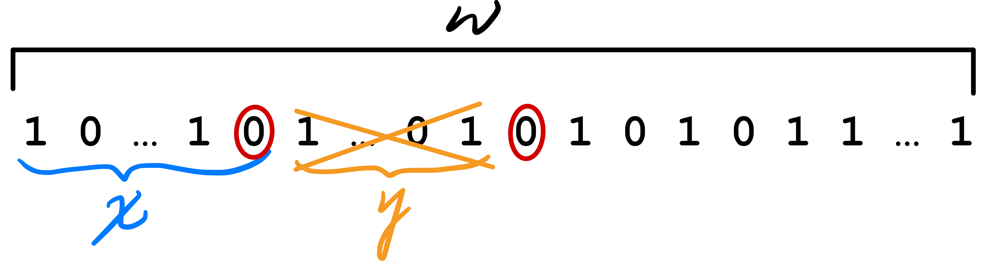
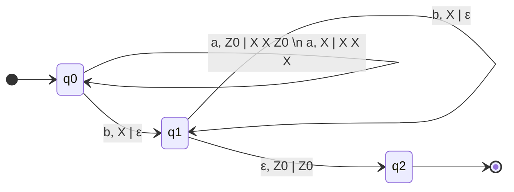
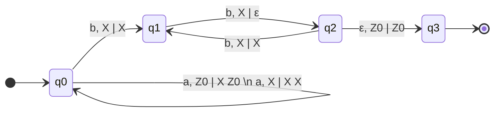
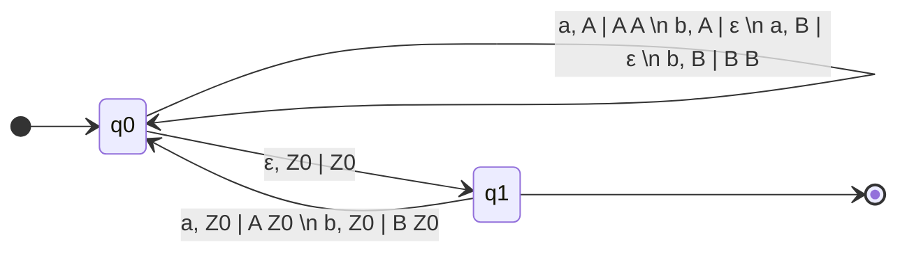
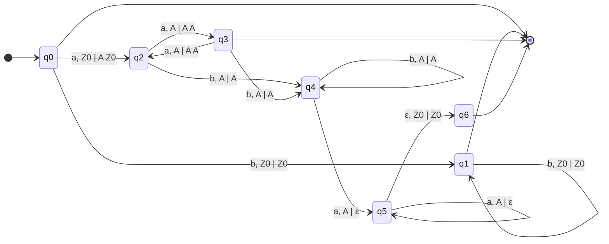
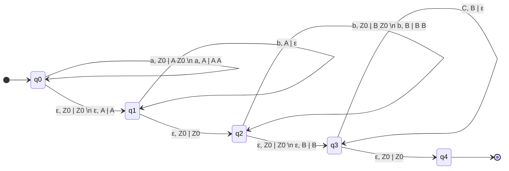
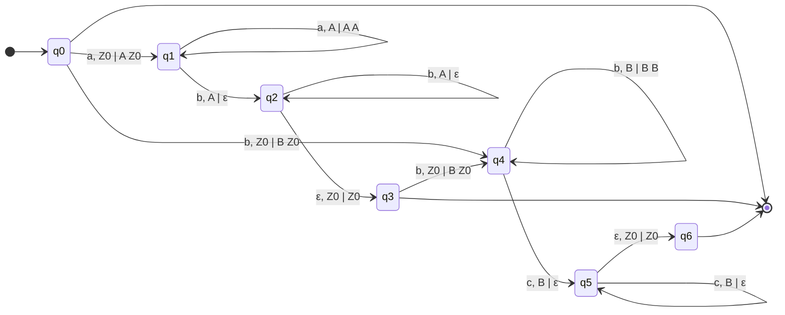
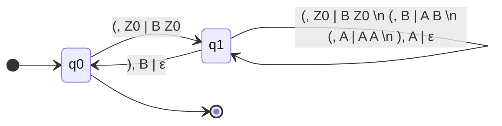

# Pumping Lamma

If $L$ is a **regular** language, then there exists $n \in \mathbb{N}$ ("pumping length", normally $n$ is number of states of the **minimal** automaton that recognizes $L$) such that **for all** $w \in L$ of length $\ge n$, there exist 3 words $x, y, z$  such that 

* $w=xyz$
* $|y|\ge 1 \space (y \neq \epsilon)$
* $|xy| \leq n$
* for all $k \in \mathbb{N}$ (also for $k = 0$): $xy^{k}z \in L$

# Prove that $L=\{(10)^{p}1^{q} \space | \space p,q \in \mathbb{N}, \space p \geq q\}$ is not a regular language

$L =\{\epsilon, 10, 1010, ..., 101, 10101, 1010101,...\}$, By contradict, suppose $L$ is regular. So there exists $n \in \mathbb{N}$ as in the pumping lemma, and consider the word $w=(10)^{n}1^{n} \in L$. Observe that $|w|=3n$, there exists $x,y,z$ such that

* $w=xyz$
* $|y|\ge 1 \space (y \neq \epsilon)$
* $|xy| \leq n$
* for all $k \in \mathbb{N}$ (also for $k = 0$): $xy^{k}z \in L$

If $u$ is the prefix of $w$ of length $n$, then $u=(10)^{n/2}$ if n is even or $u=(10)^{(n-1)/2}1$  if n is odd, $xy$ is a prefix of $u$ (as $|xy| \leq n=|u|$)

There are 3 cases:

* y starts with 0 and ends with 0

	the word $xy^0z=xz$ has 110 as a factor, a contradiction to $L$ definition

	

* y starts with 1 and ends with 1

	the word $xy^0z=xz$ has 00 as a factor, a contradiction to $L$ definition

	

* y starts and ends with different letters

	* $y=(10)^i$ or $y=(01)^i$ when $i \gt 0$, so $|y|=2i$, thus $xy^{*}z=xz=(10)^{n-i}1^{n} \notin L$ because $n-i=p < q=n$, a contradiction to $L$ definition

# Let $L=ab^{*}$ ($L$ is regular) and $L'=\{w^n \space | \space w \in L, \space n \in \mathbb{N}\}$, prove that $L'$ is not regular

Notice that $L' \neq L^*, L' \subset L$, e.g. $ababb \in L^*, ababb \notin L', abab \in L'$

Suppose $L'$ is regular, so $L' \cap ab^*ab^*$ is regular because $ab^{*}ab^{*}$ is regular, but  $L' \cap ab^*ab^*=\{ab^{n}ab^{n} \space | \space n \geq 0\}$, this is NOT a regular language

# Design a PA that recognizes the language $L=\{a^{n}b^{2n} \space | \space n \geq 1 \}$

## Read 1 `a` push 2 `X` and read 1 `b` pop 1 `X`

Use the stack (LIFO) as a "bucket", if we read `a`, put 2 "pebbles" in the "bucket"; When define a `b`, remove "pebbles" from the stack and check there are no `a` after `b`, and when there is no more input and stack is empty, you can accpet

* Input: `aabbbb`
* Stack(bottom to top): `Z0` --read a--> `Z0 X X` --read a--> `Z0 X X X X` --read b--> `Z0 X X X` --read b--> `Z0 X X` --read b--> `Z0 X` --read b--> `Z0` --read nothing--> `Z0`

## Read 1 `a` push 1 `X` and read 2 `b` pop 1 `X`

The space complexity (maximum stack size) is less than previous method

* Input: `aabbbb`
* Stack(bottom to top): `Z0` --read a--> `Z0 X` --read a--> `Z0 X X` --read b--> `Z0 X X` --read b--> `Z0 X` --read b--> `Z0 X` --read b--> `Z0` --read nothing--> `Z0`

# Design a PA for the language $L=\{w \in \{a,b\}^{*} \space | \space \#_{a}(w)=\#_{b}(w)\}$

* Input: `aabbba`
* Stack(bottom to top): `Z0` --**read nothing (ε move)**--> `Z0` --read a--> `Z0 A` --read a--> `Z0 A A` --read b--> `Z0 A` --read b--> `Z0` --**read nothing (ε move)**--> `Z0` --read b--> `B Z0` --read a--> `Z0` --read nothing--> `Z0`

# Design a PA for the language $L=\{a^{n}b^{m}a^{n} \space | \space n,m \geq 0\}$

We can rewrite $L = \{\epsilon\} \space \cup \space b^+ \space \cup \space (aa)^{+} \space \cup \space \{a^{n}b^{m}a^{n} \space | \space n,m > 0\}$

* `q0 --> [*]` accepts $\epsilon$
* `q0 --> q1 --> [*]` accepts $b^{+}$
* `q0 --> q2 --> q3 --> [*]` accepts $(aa)^{+}$
* `q0 --> q2 | q3 --> q4 --> q5 --> q6 --> [*]` accepts $\{a^{n}b^{m}a^{n} \space | \space n,m > 0\}$

# Design a PA for the language $L=\{a^{i}b^{j}c^{k} \space | \space i+k=j, \space i,k \geq 0\}$

We can rewrite $L=\{a^{i}b^{i}b^{k}c^{k} \space | \space i+k \geq 0\}$ 

But this is a **NON DETERMINISTIC** PA

* `a, Z0 | A Z0` with `ε, Z0 | Z0`, they both pop `Z0`
* `a, A | A A` with `ε, A | A`, they both pop `A`
* `b, Z0 | B Z0` with `ε, Z0 | Z0`, they both pop `Z0`
* `b, B | B B` with `ε, B | B`, they both pop `B`

Here is a **DETERMINISTIC** PA:

* `q0 --> [*]` accepts $\epsilon$

* `q0 --> q1 --> q2 --> q3 --> [*]` accepts $a^{n}b^{n} \space | \space n>0$
* `q0 --> q4 --> q5 --> q6 --> [*]` accepts $b^{m}c^{m} \space | \space m>0$

# Design a PA for the language of balanced strings of brackets (with only one type  of brackets `()`)

* Balanced: `()(())()()(()())` 
* Not balanced: `()(()))(`

