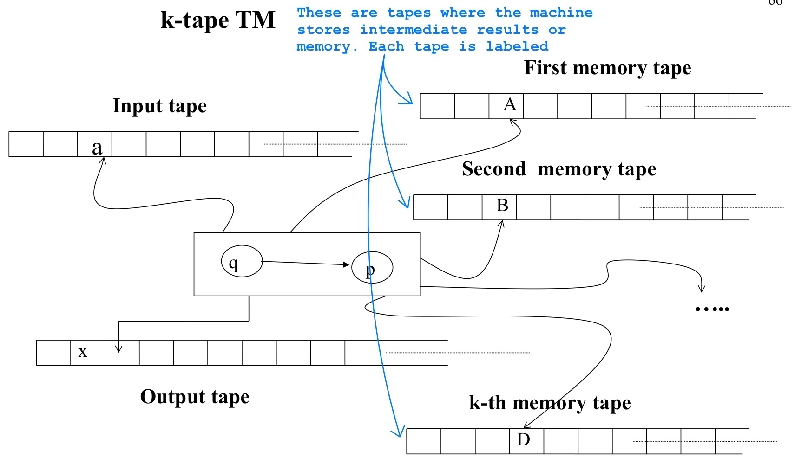

# Turing Machine

k-tape Turing machine ($k \in \mathbb{N}$, $k$ must be set **BEFORE** the definition of the machine) have $k+2$ tapes

* 1 input tape
* k memory tapes
* 1 output tape (optional)

* A TM has **exactly ONE** find (halting) state and **NO** transitions starts from the final state, if the TM is in this state, then it halts and accepts the entire content (without blanks(`_`))
* At the beginning of the computation, all the input is in input tape

https://turingmachinesimulator.com

# Design a k-tapes TM for $L=\{w \in \{a,b,c\}^{*} \space | \space \#_{a}(w)=\#_{b}(w)=\#_{c}(w)\}$

## Using 3 memory tapes

* 3 memory tapes
* keep trace on each memory tape (in unary) of the number of `a`, `b` and `c`

## Using 2 memory tapes

* 2 memory tapes scan input left to right
* For each `a` put a token in the two tapes
* When read `_` in input , scan the input right to left and erase a token from the first tape for each `b` and from the second one for each `c` 

## Using 1 memory tapes

* 1 memory tapes scan input left to right
* For each `a` put a token in the memory tape
* When read `_` in input, scan the input right to left and move the memory head left for each `b` (without erasing the token). 
* When reach the `_` in input and `Z0` in memory, scan the input left to right and move right the memory head for each `c`

# Design a k-tapes TM for $L=\{ a^{2^{n}} \space | \space n \geq 0\}=\{ a, aa, aaaa, a^{8}, a^{16}, ... \}$

## First Idea: Divide 2 every time

* 1 memory tape
* Copy the input in memory tape
* Scan the memory several times, change every second symbol
* It accepts when there is only one `a` left in memory tape
	* **Accept**: `aaaaaaaa` -> `a*a*a*a*` -> `a***a***` -> `a*******` (one a left)
	* **Reject**: `aaaaaa` -> `a*a*a*` -> `a***a*` (two a left)

## Second Idea: Convert to base 2

* 1 memory tape
* Write on the memory tape the number of `a` in base 2
	* input tape: `a a a a a a a a`
	* memory tape: `Z0 1` -> `Z0 0 1`  -> `Z0 1 1` -> `Z0 0 0 1` -> `Z0 1 0 1` -> `Z0 0 1 1` -> `Z0 1 1 1` -> `Z0 0 0 0 1`
* It accepts If `1 0 0 ... 0` in memory (right to left)

# Design a k-tapes TM transducer (input/output)

given $w = \{a^{n}b^{m} \space | \space n,m \in \mathbb{N}\}$, output a string u with respect to

* it has the same number of `a` and of `b` as w
* the `a` and `b` appear alternately (until is possible)
	* Input: `aaabbb` --> Output: `ababab`
	* Input: `aaab` --> Output: `abaa`
	* Input: `abbb` --> Output: `abbb`
	* If $w \notin \{a^{n}b^{m} \space | \space n, m \in \mathbb{N}\}$, then the machine does not produce an output

## k = 2

One tape to count in unary the number of `a` , one for the `b`

* Input tape: `aaab`
* Memory tape 1: `aaa`
* Memory tape 2: `b`
* Output tape: `abaa`

## k = 1

* Input tape: `aaaaabbbbbbbb`
* Memory tape: `aaaaabbbbbbbb`  --modify the second a to c and reach the first b modify it to a--> `acaaaabbbbbbb` --modify c to b and next second a to c then reach the first b modify it to a--> `abacaaabbbbbb`  ----> `ababacaabbbbb` ----> `ababababacabbbb` ----> `ababababababbbb`
* Output tape: `ababababababbbb`

# Design a k-tapes TM transducer that outputs (in unary) the product of two naturals numbers (in unary)

* Input tape: `1 1 1 $ 1 1` (`$` is a separator)
* Output tape: `1 1 1 1 1 1` ($3 \times 2 = 6$)

## k = 1

* $q_0$ to copy in memory the first sequence of `1` 
* $q_1$ to read the input after `$`, 
* $q_w$ to write the memory to the output
* $q_r$ to rewind the memory tape
* $q_f$ final

# Consider $L = \{uww^{R}v \space | \space u, v, w \in \{a, b\}^{+}\}$ (R is the reverse (as mirror) of $w$, if $w=abb$, then $w^{R}=bba$), find a minimal power machine t hat recgonizes $L$

Consider $|w| \geq 2$, $w = w' \cdot c$, $c \in \{a,b\}$

* $uww^{R}v = \underbrace{u \cdot w'}_{u' \in \{a,b\}^{+}} \cdot c \cdot c \cdot \underbrace{(w')^{R} \cdot v}_{v' \in \{a,b\}^{+}} = u' \cdot c \cdot c \cdot v'$
* we can rewrite $L=(a\overset{\downarrow OR}{+}b)^{+} \cdot (aa+bb) \cdot (a+b)^{+}$
* $L$ is  regular, we can recognize it with **FSA**
* $aa \notin L$, $aabab \notin L$, $aaab \in L$

This is a **NON DETERMINISTIC** automaton (exist at least one state has multiple path with same label, e.g., q1), we can translate it to **DETERMINISTIC**:

# Prove that $L=\{w \in \{a,b\}^{*}$ | for all substring $u$ of $w$, we have $-5 \leq \#_{a}(u)-\#_{b}(u) \leq 5 \}$ is regular

We can construct FSA for it:

