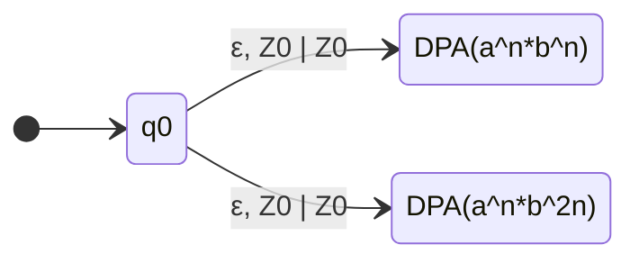
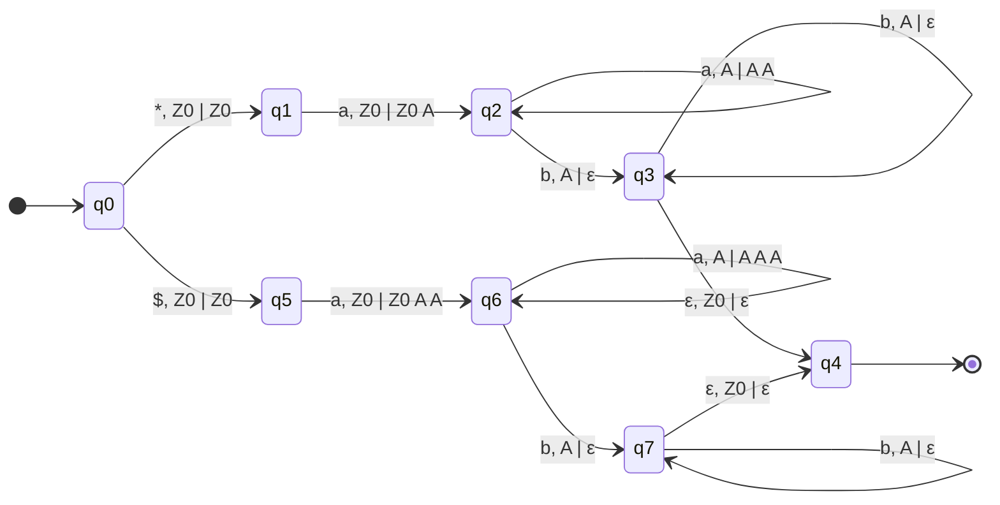
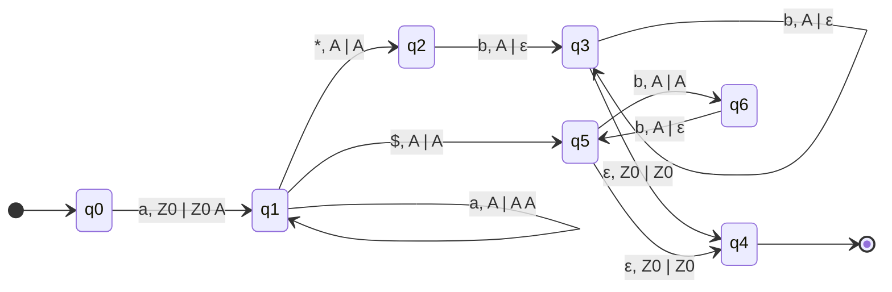
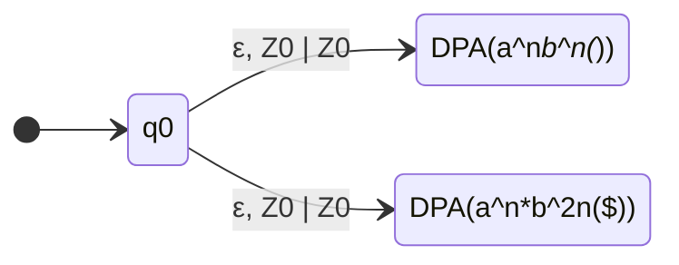
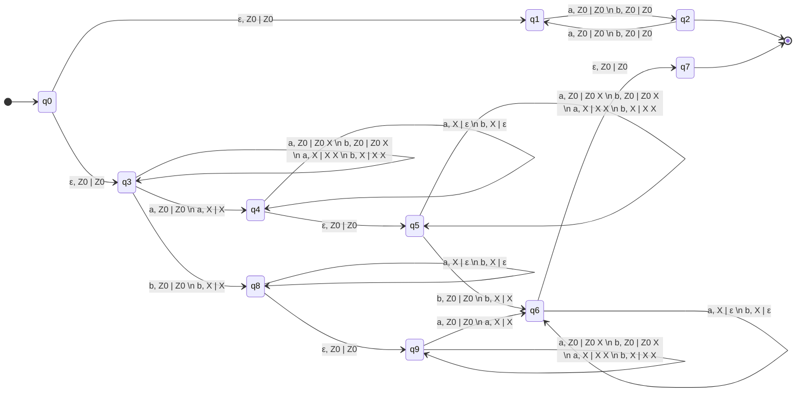

Alphabet $\Sigma=\{a, b, \$, *\}$

# $L_1 = \{a^n b^n \space | \space n \geq 1\} \cup \{a^n b^{2n} \space | \space n \geq 1\}$

# $L_2 = \{*a^n b^n \space | \space n \geq 1\} \cup \{\$a^n b^{2n} \space | \space n \geq 1\}$

This is a **deterministic** pushdown automata: 

# $L_3 = \{a^n * b^n \space | \space n \geq 1\} \cup \{a^n \$ b^{2n} \space | \space n \geq 1\}$

This is a **deterministic** pushdown automata: 

# $L_4 = \{a^n b^n * \space | \space n \geq 1\} \cup \{a^n b^{2n} \$ \space | \space n \geq 1\}$

# $L = \{ww \space | \space w \in \{a,b\}^*\}$

It's complementary is $L'=\overline{\{ww \space | \space w \in \{a,b\}^*\}} = \{u \in \{a,b\}^* \space | \space \forall w \in \{a,b\}^* : ww \neq u\}$ which is recognized by a **NDPA**

$L' = \{w \in \{a,b\}^* \space | \space |w| \space \text{is odd}\} \\ \cup \{w = \alpha a \beta b \gamma \space | \space \alpha, \beta, \gamma \in \{a,b\}^* \space \text{and} \space |\beta| = |\alpha \gamma| \} \\ \cup \{w = \alpha b \beta a \gamma \space | \space \alpha, \beta, \gamma \in \{a,b\}^* \space \text{and} \space |\beta| = |\alpha \gamma| \}$

e.g. $aabbabaaabbb \in L'$

* we can select first two $a$ as $\alpha$
* last three $b$ as $\gamma$
* the middle $babaa$ as $\beta$

* `q0 --> q1 --> q2 --> [*]`  accepts $\{w \in \{a,b\}^* \space | \space |w| \space \text{is odd}\}$
* `q0 --> q3 --> q4 --> q5 --> q6 --> q7 --> [*]` accepts $\{w = \alpha a \beta b \gamma \space | \space \alpha, \beta, \gamma \in \{a,b\}^* \space \text{and} \space |\beta| = |\alpha \gamma| \}$
* `q0 --> q3 --> q8 --> q9 --> q6 --> q7 --> [*]` accepts $\{w = \alpha b \beta a \gamma \space | \space \alpha, \beta, \gamma \in \{a,b\}^* \space \text{and} \space |\beta| = |\alpha \gamma| \}$