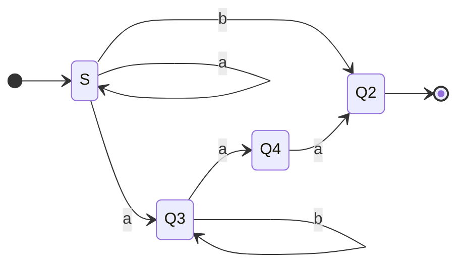
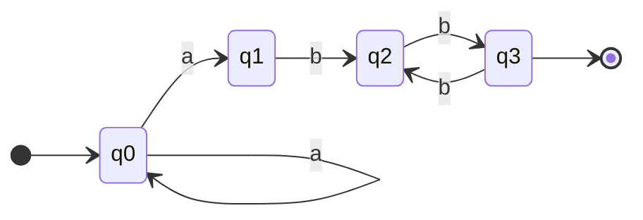
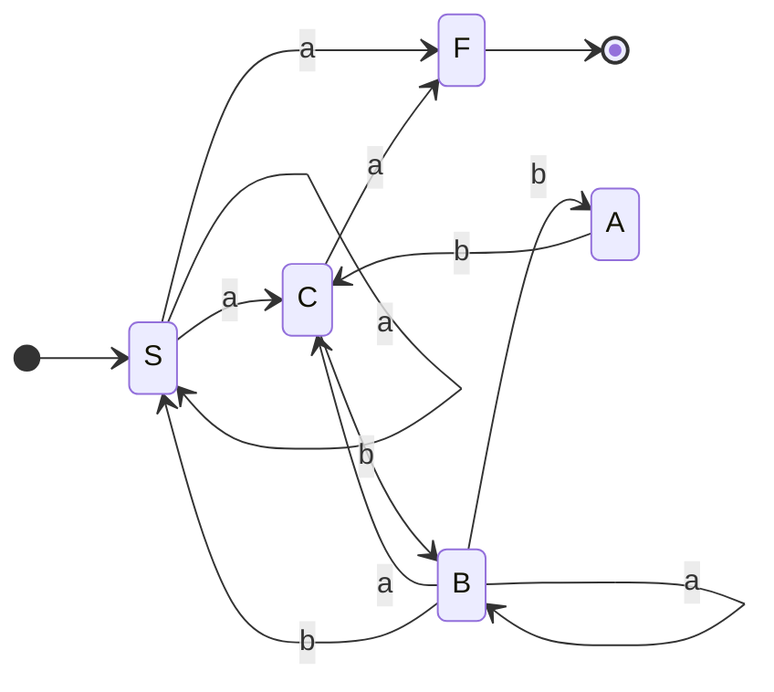
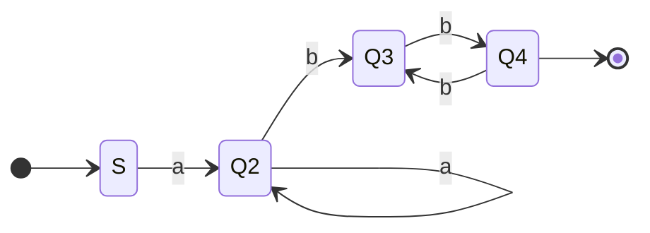
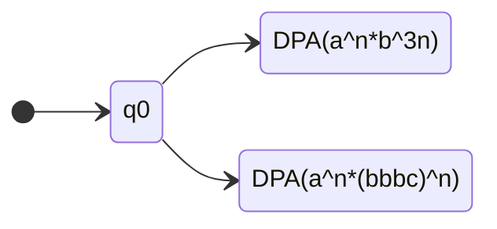

# Formal grammars

* Start from a symbol
* Repeatly apply some "rewriting-rules"
* Generate a word of **terminal symbols**

$G = \langle V_N, V_T, P, S \rangle$

* $V_N$ : Represents the set of **nonterminal symbols**. These symbols are placeholders that can be replaced by other symbols (both terminal and nonterminal) according to the grammar rules
	* $V_N = \{S, A, B, C, D\}$
* $V_T$ : Represents the set of **terminal symbols**. These symbols are the actual characters or tokens that appear in the strings of the language being generated. Terminals cannot be replaced further
	* $V_T = \{a, b, c\}$
* $V = V_N \cup V_T$ : This is the complete set of symbols, which includes both the terminal and nonterminal symbols ($V_N$ and $V_T$)
* $S \in V_N$ : Represents a specific nonterminal symbol called the **start symbol** or **axiom**. This is the initial symbol from which the generation or derivation of strings begins
* $P \subseteq V_N^+ \times V^*$ : Represents the set of **rewriting rules** or **productions**. Each rule specifies how a nonterminal (from $V_N$) can be replaced by a sequence of symbols (which could be terminals or nonterminals from $V$)
	* $P = \{ \langle \alpha, \beta \rangle \ |\ \alpha \in V_N^+ \ \text{and} \ \beta \in V^* \}$
		* $\alpha$ : a sequence of one or more nonterminal symbols ($\alpha \in V_N^+$).
		* $\beta$ : a sequence of symbols (either terminals, nonterminals, or both, denoted as $\beta \in V^*$)
		* The production rule $\langle \alpha, \beta \rangle$ can be written as $\alpha \rightarrow \beta$ , where $\alpha$ is rewritten as $\beta$ . This emphasizes the idea of **rewriting** in the grammar
		* $P = \{S \rightarrow AB, BA \rightarrow cCD, CBS \rightarrow ab, A \rightarrow \varepsilon\}$
			* $S \rightarrow AB$ : This rule means that the nonterminal $S$ can be replaced with the nonterminal sequence $AB$
			* $BA \rightarrow cCD$ : This rule states that the nonterminal sequence $BA$ can be replaced by the sequence $cCD$. This involves both terminal ($c$) and nonterminal symbols ($C$ and $D$)
			* $CBS \rightarrow ab$ : This rule states that the nonterminal sequence $CBS$ can be replaced with the terminal string $ab$
			* $A \rightarrow \varepsilon$ : This rule specifies that the nonterminal $A$ can be replaced by the empty string (denoted by $\varepsilon$). This is known as an **epsilon production** and means that $A$ can “disappear” during the rewriting process

| type | name                           | production                                                   | machine         |
| ---- | ------------------------------ | ------------------------------------------------------------ | --------------- |
| 0    | Unrestricted (general) grammar | $-$                                                          | TM              |
| 1    | Monotone (context-sensitive)   | $|\alpha| \leq |\beta|$                                      | Linear automata |
| 2    | Context-free                   | $|\alpha| = 1$                                               | NDPA            |
| 3    | Regular                        | $A \rightarrow aB \\ A \rightarrow a \\ S \rightarrow \varepsilon$ | (D/ND) FA       |

 # Define a (regular) grammar such that $L(G) = L(A)$

## Ex 1: From FA to Grammar

From the diagram we can know $L(A) = a^*b + a^+b^*aa$

Idea: 

* states are non-terminal

* Terminal: $a$ , $b$
* Transitions are simulated by productions

$G = \langle V_T = \{a, b\}, \space V_N=\{S, Q_2, Q_3, Q_4\}, \space S, \space P \rangle$

* $P = \{S \rightarrow aS |aQ_3|bQ_2|b, \space Q_3 \rightarrow aQ_4|bQ_3, \space Q_4 \rightarrow aQ_2|a\}$
* e.g., $S \overset{s \rightarrow aS}{\Rightarrow}aS \overset{S \rightarrow aQ_3}{\Rightarrow} aaQ_3 \overset{Q_3 \rightarrow bQ_3}{\Rightarrow} aabQ_3 \overset{Q_3 \rightarrow aQ_4}{\Rightarrow} aabaQ_4 \overset{Q_4 \rightarrow a}{\Rightarrow} aabaa \in L(A)$

## Ex 2: From FA to Grammer

From the diagram we can know $L(A) = a^+(bb)^+$

$G = \langle V_T = \{a, b\}, \space V_N=\{S, Q_2, Q_3, Q_4\}, \space S, \space P \rangle$

* $P = \{S \rightarrow aS|aQ_1, \space Q_1 \rightarrow bQ_2, \space Q_2 \rightarrow bQ|b, \space Q_3 \rightarrow bQ_2\}$

## Ex 3: From Grammar to FA

$G = \langle V_T = \{a, b\}, \space V_N=\{S, A, B, C\}, \space S, \space P \rangle$

* $P = \{S \rightarrow a|aS|aC, \space A \rightarrow bC, \space B \rightarrow aC|aB|bS|bA, \space C \rightarrow a|bB\}$

## Ex 4: $L_1 = \{a^nb^{2m} \space | \space n,m \geq 1\}$

$G = \langle V_T = \{a, b\}, \space V_N=\{S, Q_2, Q_3, Q_4\}, \space S, \space P \rangle$

* From the FA we can see $P = \{S \rightarrow aQ_2, \space Q_2 \rightarrow aQ_2|bQ_3, \space Q_3 \rightarrow bQ_4|b, \space Q_4 \rightarrow bQ_3\}$

* Or we can simply see the expression of $L_1$ then deduce $P = \{S \rightarrow aQbb|abb, \space Q \rightarrow a|aQ|bb|Qbb\}$, but this is **not** regular

## Ex 5: $L_2 = \{a^nb^{3n} \space | \space n \geq 0\}$

$P = \{S \rightarrow aSbbb|\varepsilon\}$

## Ex 6: $L_3 = L_1 \cap L_2$

We can find the expression of $L3 = \{a^{2n}b^{6n} \space | \space n \geq 1\}$

$P = \{S \rightarrow aaSbbbbbb|aabbbbbb\}$

# $L = \{a^n (bc)^m \ | \ n,m \geq 1, m \lt \frac{n}{2}\}$, find a grammar for $L$ of "minimal power"

* $n = 1$ implies $1 \leq m \lt \frac{1}{2}$ , which is impossible
* $n = 2$ implies $1 \leq m \lt \frac{2}{2} = 1$, which is impossible
* $n = 3$ implies $1 \leq m \lt \frac{3}{2}$, where $m$ can be $1$, the shortest string $aaabc \in L$
* $n = 4$ implies $1 \leq m \lt 2$, where $m$ can be $1$, the string can be $aaaabc \in L$
* $n = 5$ implies $1 \leq m \lt \frac{5}{2}$, where $m$ can be $1$ or $2$, the string can be $aaaaabc \in L$, $aaaaabcbc \in L$

Follow this rule, we can deduce $P = \{S \rightarrow ASB|aaabc|aaaabc, \ A \rightarrow aa, \ B \rightarrow bc|\varepsilon\}$

* e.g., $S \overset{S \rightarrow ASB}{\Rightarrow} ASB \overset{S \rightarrow aaabc}{\Rightarrow} AaaabcB \overset{A \rightarrow aa}{\Rightarrow} aaaaabcB \overset{B \rightarrow \varepsilon}{\Rightarrow} aaaaabc$

Another possible solution can be $P = \{S \rightarrow aaaXbc, \ X \rightarrow aaXbc|aX|\varepsilon\}$

# $L = \{a^n b^{3n} \ | \ n \geq 0\} \cup \{a^n (bbbc)^n \ | \ n \geq 0\}$, find a grammar for $L$ of "minimal power"

We can use a simple NDPA consists of DPA to recognize this language:

So we can easily find $P = \{S \rightarrow S_1|S_2, \ S_1 \rightarrow aS_1bbb|\varepsilon, \ S_2 \rightarrow aS_2bbbc|\varepsilon\}$

* $S_1$ recognise $a^nb^{3n}$
* $S_2$ recognise $a^n(bbbc)^n$

# $L_1 = \{a^nw\ | \ w \in \{b,c\}^*, \ \#_b(w) = \#_c(w) = n, \ n \geq 1\}$

If $L_1$ is CF, consider $R = a^*b^*c^*$ (regular) , then $L_1 \cap R = \{a^nb^nc^n \ | \ n \geq 1\}$ which is not CF (can not be recognised by NDPA) , thus is not CF **(Intersection between CF and REG is CF)**

We can expressed it as **Monotone** grammar: $P = \{S \rightarrow aSBC|aBC, \ BC \rightarrow CB, \ CB \rightarrow BC, \ B \rightarrow b, \ C \rightarrow c \}$

* e.g., for string `aaabbbccc` : $S \overset{S \rightarrow aSBC}{\Rightarrow} aSBC \overset{S \rightarrow aSBC}{\Rightarrow} aaSBCBC \overset{S \rightarrow aBC}{\Rightarrow} aaaBCBCBC \overset{CB \rightarrow BC}{\Rightarrow} aaaBBCCBC \overset{CB \rightarrow BC}{\Rightarrow} aaaBBCBCC \overset{CB \rightarrow BC}{\Rightarrow} aaaBBBCCC$

# $L_2 = \{a^nw\ | \ w \in \{b,c\}^*, \ \#_b(w) + \#_c(w) = n, \ n \geq 1\}$

We can recognise the language as **NDPA**, so it can be expressed as **CF** grammar

* One solution can be $P = \{S \rightarrow aSX|ab|ac, \ X \rightarrow b|c\}$
* We can also rewrite the solution as $P = \{S \rightarrow aSX|aX, \ X \rightarrow b|c\}$

# $L_3 = \{a^nw\ | \ w \in \{b,c\}^*, \ \#_b(w) + \#_c(w) = 2n, \ n \geq 1\}$

We can recognise the language as **NDPA**, so it can be expressed as **CF** grammar

* One solution can be $P = \{S \rightarrow aSXX|abb|abc|acb|acc, \ X \rightarrow b|c\}$
* We can also rewrite the solution as $P = \{S \rightarrow aSXX|aXX, \ X \rightarrow b|c\}$