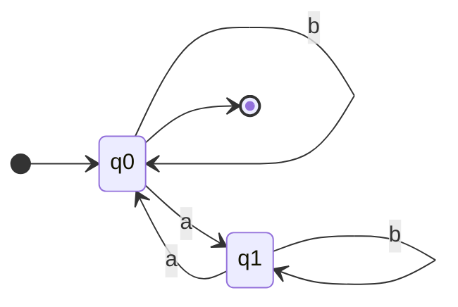

# MFO

## Given $I = \{a, b\}$ and $w = \{abbab\}$

* $F_1 = \forall x (a(x))$ is **false** for $w$, which means $w$ is **NOT a model** for $F_1$ , represents as $w \not\models F_1$
* $F_2 = \exists x(a(x))$ is **true** for $w$, whichi mean $w$ is **a model** for $F_2$ , represents as $w \models F_2$
* $F_3 = \forall x \exists y(x < y \land (a(x) \rightarrow b(y)))$ is **true** for $w$, which means $w$ is **a model** for $F_3$ , represents as $w \models F_2$

## Given $L(F) = \{w \in I^* \ | \ w \models F\}$

* $F_1 = \forall x(a(x))$ implies $L(F_1) = a^*$
* $F_2 = \forall x(a(x) \land \neg a(x))$ implies $L(F_2) = \varepsilon$
* $F_3 = \exists x(a(x) \land \neg a(x)$ implies $L(F_3) = \empty$
* $F_4 = \exists x(a(x) \lor \neg a(x))$ implies $L(F_4) = I^+$
* $F_5 = \forall x(a(x) \lor \neg a(x))$ implies $L(F_5) = I^*$

## $L$ is star-free which the words starting with $a$ , ending with $b$ over $I=\{a, b\}$ , find a MFO formula $F$ such that $L(F)=L$

$F = \forall x(\text{if} \ x \ \text{is the first position then there is an}\ a \ \text{in that position, and if} \ x \ \text{is the last position then there is a}\ b \ \text{in that position}) \\ = \forall x((\neg \exists y(y < x) \rightarrow a(x)) \land (\neg \exists y(x < y) \rightarrow b(x)))$

* $\neg \exists y(y < x)$ : It indicates $x$ is the first position
	* **Short hand**: $first(x) = \neg \exists y(y < x)$
* $\neg \exists y(x < y)$ : It indicates $x$ is the last postion
	* **Short hand**: $last(x) = \neg \exists y(x < y)$

So the formula can be replaced as: $\forall x(first(x) \rightarrow a(x)) \land (last(x) \rightarrow b(x)))$

## $L$ is star-free which the words over $\{a, b\}$ in which occur exactly two $b$'s in the second and second to last position, find a MFO formula $F$ such that $L(F)=L$

e.g., $bb \in L$ , $aba \not\in L$ , $abba \in L$ , $ababa \in L$, so the language can be expressed as $L = aba^*ba + bb = ab\overline{\overline{\empty}b\overline{\empty}} + bb$

* $\overline{\empty}b\overline{\empty}$ : There is at least one $b$ in the string, implies $\overline{\overline{\empty}b\overline{\empty}}=a^*$ : there is no $b$ in the string

The formula can be $F = \forall x \forall y ( \\ (x=1 \land y=last(y+1) \land x<y) \rightarrow (b(x) \land b(y) \land \forall z( (z \neq x \lor z \neq y) \rightarrow a(z) )) \land (\forall x(last(x) \rightarrow x\geq3) \\ \lor \\ (\forall x(last(x) \rightarrow (x=1 \land b(x) \land b(x-1)) ) \\ )$

* $(x=1 \land y=last(y+1) \land x<y) \rightarrow (b(x) \land b(y) \land \forall z( (z \neq x \lor z \neq y) \rightarrow a(z) )) \land (\forall x(last(x) \rightarrow x\geq3)$ accepts $b\overline{\overline{\empty}b\overline{\empty}}$
* $(\forall x(last(x) \rightarrow (x=1 \land b(x) \land b(x-1)) )$ accepts $bb$

# MSO

Alphabet $I = \{a, b\}$ 

## $L_1 = a a^*b^*$

A MFO formula will suffice: $a(0) \land \forall x \forall y((a(x) \land b(y)) \rightarrow x < y)$

## $L_2 = \{w \in I^* \ | \ \text{there is an 'a' in every even positions in w}\}$

The first position of $L_2$ corresponds index 0, so the language can be expressed as $(a(a+b))^*(a+\varepsilon)$

We need a monadic predicate $P$ ($P$ is a set of positions) that is true over all even positions (If $x$ is an even position, then $x \in P$): $P(0) \land \forall x \forall y ((P(x) \land y = x + 2) \rightarrow P(y))$

We can define $L2$ as: $\exists P(P(0) \land \forall x \forall y ((P(x) \land y = x + 2) \rightarrow P(y)) \land (\forall z (P(z) \rightarrow a(z))))$

* Consider $w = abaaa$, $P$ can be $\{0,2,4\}$, also $\{0,2,3,4\}$

## $L_3 = \{w \in I^* \ | \ \#_a(w) \ \text{is even}\}$

$L_3$ is regular because it can be recognized by FA:

But is it not star-free, so we can not find MFO formula for $L_3$, but we can find MSO formula for it

### **Some useful short hand**: e.g., $P = \{0,3,4,7\}$

* $First(x, P) = P(x) \land \forall y (y < x \rightarrow \neg P(y))$
	* $x$: position
	* $P$: set of positions
	* $First(x, P)$ if and only if $x$ is the first position in $P$
		* $First(0,P)$ is true
* $Last(x, P) = P(x) \land \forall y (x < y \rightarrow \neg P(y))$
	* $Last(x, P)$ if and only if $x$ is the last position in $P$
		* $Last(7,P)$ is true
* $Next(x, y, P) = P(x) \land P(y) \land x < y \land \forall z ((x < z \land z < y) \rightarrow \neg P(z))$
	* $Next(x, y, P)$ is true if and only if $y$ is the position following $x$ in $P$
		* $Next(0,4,P)$ is false
* $Odd(Q, P) = \forall x (Q(x) \leftrightarrow (First(x,P) \lor \exists y \exists z (Next(z,x,P) \land Next(y,z,P) \land Q(y))))$
	* $Odd(Q, P)$ is true if and only if $Q$ is the subset of $P$ made by the first, third, fifth, ... , position of $P$
		* $Q = \{0,4\}$ implies $Odd(Q, P)$ is true
* $OddCard(P) = \exists Q (Odd(Q, P) \land \forall x (Last(x,P) \rightarrow Q(x)) \land \exists x(P(x))$
	* $\exists x(P(x))$: $P$ is not empty
	* $OddCard(P)$ is true if and only if the cardinality of $P$ is odd
		* $Card(P) = 4$ implies $OddCard(P)$ is false
* $EvenCard(P) = \neg OddCard(P)$
	* $EvenCard(P)$ is true if and only if the cardinality of $P$ is even
		* $Card(P) = 4$ implies $EvenCard(P)$ is true

Then we can define MSO formula of $L_3$ as: $\exists P(EvenCard(P) \land \forall x (P(x) \leftrightarrow a(x)))$

## $L_4$ : when between each two a's, with no other a in between, there is a block of an odd number of letters b

e.g., $bbb \in L_4$, $babb \in L_4$, $baba \in L_4$, $bbabbbababbbbbabb \in L_4$

The language can be expressed as $L_4 = b^*(a(bb)^*b)^*b^* + b^*a$

The MSO formula for $L_4$ can be defined as: $\forall x \forall y((x < y \land a(x) \land a(y) \land \forall z ((x < z \land z < y) \rightarrow \neg a(z))) \rightarrow \exists P(\forall w(P(w) \leftrightarrow (x < w \land w < y)) \land OddCard(P) )$

* e.g., $abbbbba \in L_4$, first `a` is $x$, last `a` is $y$, the intermediate `b`'s is the set $P$
