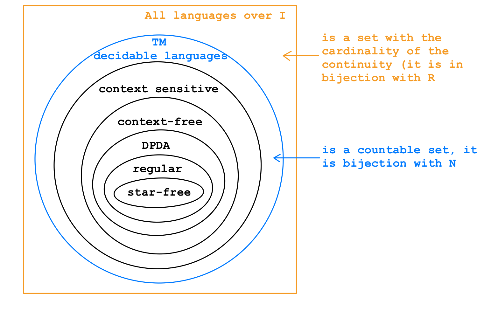
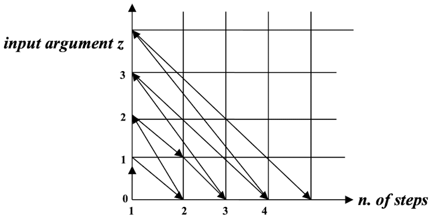

# Computability

A language $L$ over $I$ is decidable (or recursive) if there exists a TM $m$ that recognizes it:

* If $x \in L$ then $m$ **halts** on input $x$ and prints "YES"
* If $x \notin L$ then $m$ **halts** on input $x$ and prints "NO"

A function $f: \mathbb{N} \rightarrow \mathbb{N}$ is decidable (or computable) if there exists a TM $m$ with I/O that calculates $f$ : that is if $[x]$ is the encoding of $x \in \mathbb{N}$ , then $m$ produces the string $[y]$ having $[x]$ in input if and only if $f(x)=y$

A decision problem $P$ (a problem such that the answer to each instance is only "YES" or "NO", in this case, it decides if $x \in L$) is decidable if there is a TM $m$ that solves it:

* If $[x]$ is the encoding of an instance of $P$, then
	*  $P(x)$ is "YES" if and only if $m$ **halts** on $[x]$ and prints "YES"
	*  $P(x)$ is "NO" if and only if $m$ **halts** on $[x]$ and prints "NO"

**Notation**:

* If $P$ is a program of a TM
	* $P(x) \downarrow$ : denotes that $P$ **halts** on $x$
	* $P(x) \uparrow$ : denotes that $P$ **does not halts** on $x$

## HP: Input: the encoding of a TM $m$ and encoding of an input $x$ of $m$, Output: 1 if $m(x) \downarrow$ ; 0 otherwise, prove HP is NOT decidable

Suppose by contradiction that a TM $n$ solves it: that is $n$ calculates the function 

$\varphi ([m,x]) = \begin{cases} 1, \ m(x) \downarrow \\ 0, \ m(x) \uparrow \end{cases}$

* $[m,x]$ : encoding of $m$ and $x$ as a single natural number

We can use $n$ as a part of a TM $n'$ that operates as follow: $n'$ simulates $n$ over the input $[m,m]$ , <u>when $n$ halts if it prints "1", then $n'$ enters an infinite loop ($n'$ does not halt)</u>, otherwise $n'$ prints "1" and halts

$n'$ cannot exist, indeed: $n'([n']) \downarrow$ or $n'([n']) \uparrow$

* If $\boxed{n'([n']) \downarrow}$ , then $\varphi ([n',n']) = 1$, then <u>$n$ halts over $[n',n']$ , but this means that $n'$ enters an infinity loop</u> and so $\boxed{n'([n']) \uparrow}$ , violates !!
* <u>if $\boxed{n'([n']) \uparrow}$ , then $n$ prints "1"</u>, this means that $\varphi ([n',n']) = 1$, implies $\boxed{n'([n']) \downarrow}$ , violates !!

So we can deduce HP is not decidable

## $HALT = \{[m] \ | \ m([m]) \downarrow\}$ is not a decidable language

HALT is **semdecidable**: indeed given a TM $m$ and an input $x$ of $m$ , we can simulate with a **universal** TM $m'$ , the computation of $m$ over $x$ , if the simulation ends, then the TM $m'$ prints "YES" and halts, otherwise $m'$ will loop forever

## $g(y,x) = \begin{cases} 1, \ \text{if} \ m_y(x) \ \text{is even} \\ 0, \ \text{otherwise} \end{cases}$ , prove that $g$ is NOT computable

* $m_y(x) \ \text{is even}$ : meaning the output of the TM with Gödel number $y$ halts over the input $x$ and prints an even number

Consider $h(x) = \begin{cases} 2, \ \text{if } m_x(x) \text{ is NOT even} \\ \perp, \text{otherwise} \end{cases}$

* if $g$ is computable, then also $h$ is computable, indeed $$h(x) = \begin{cases} 2, \ \text{if } g(x,x) = 1 \\ \perp, \text{if } g(x,x) = 0 \end{cases}$$

Suppose by contradiction, let $m_z$ ($z$ is the Gödel number of the TM $m$) a TM (program) that calculates $h$ , which means $h(w) = m_z(w) \ \forall w$

* If $h(z)$ is even ($h(z) = 2$) , then $g(z,z) = 0$ and so $m_z(z)$ is not even, violate !!
* if $h(z)$ is not even (that is, $h(z) = \perp$), then $g(z,z) = 1$ and so $m_z(z)$ is even, violate !!

## $g(y,x) = \begin{cases} 1, \ \text{if} \ m_y(x) \ \text{is even} \\ \perp , \ \text{otherwise} \end{cases}$ , prove that $g'$ is computable

* Different from the previous $g$ , in here, $g'$ is a partial function

$g'$ is computable, indeed, consider an **universal** TM $m$ , given $y$ and $x$ , $m$ can simulate the computation of the TM $m_y$ over $x$ :

* If this simulation ends, then $m$ checks if the output is even
	* If "YES", $m$ prints "1" and halts
	* Otherwise, it loops forever

# Reduction

Reduce a problem whose undecidability is already known (e.g., the HP) to the problem under consideration, then the actual problem is also undecidable

## Let $X \subseteq \mathbb{N}$ and $Y \subseteq \mathbb{N}$ be problem, so $X$ and $Y$ are sets for which we are interested to solve the "membership problem"

Let $f$ be a function $f:X \rightarrow Y$ such that

* If $x \in X$ , then $f(x) \in Y$

* If $x \notin X$ , then $f(x) \notin Y$

* $f$ is total and computable function

	* total: $f(x)$ is always defined

	* computable: $f$ can be calculated by a TM

Then $f$ is a **reduction** from $X$ to $Y$

* If $Y$ is recursive then so is $X$
* If $X$ is NOT recursive then neither is $Y$

<u>Indeed</u>: suppose $Y$ is recursive, then to decide if a given $x \in \mathbb{N}$ belongs to $X$ I can

* Calculate $f(x)$
* Decide if $f(x) \in Y$ or not

## Given a TM $m$ (over a fixed alphabet), decide if there is at least one input for which $m$ halts and prints (the encoding of) the number "1"

Equivalent to decide the membership for the set $ONE := \{[m] \ | \ m \ \text{is a TM such that there exists an input } x \text{ for which } m(x)=1\}$

* $[m]$ : the Gödel number of the TM (or program) $m$

$HP:= \{[m] \ | \ m \text{ is a TM that halts on the input } [m]\}$ , we know that $HP$ is not recursive

* Consider $f: HP \rightarrow ONE$

Given $x \in \mathbb{N}$ , construct the TM $m'$ in this way: $m'$ is an UTM that simulates the TM $m$ such that $[m] = x$ over the input $x$ , if the simulation ends, then $m'$ halts and prints "1"

* So $f(x)$ is the Gödel number of the TM $m'$

* $f$ is defined for all $x \in \mathbb{N}$ and can be calculated by a TM

	* if $x \in HP$ , then $f(x)$ is the Gödel number of a TM that **always** halts and prints "1", so $f(x) \in ONE$

	* if $x \notin HP$ , then $f(x)$ is the Gödel number of never ending TM, so $f(x) \notin ONE$

But the problem $ONE$ is **semi-decidable**, indeed

* Given $x \in \mathbb{N}$ , construct the TM $m$ such that $[m]=x$ , and start simulating $m$ over all input using a "dovetailing technique"

	1. Simulate **1 step** of $f_x(0)$ .
	2. Simulate **1 step** of $f_x(1)$ .
	3. Simulate **2 steps** of $f_x(0)$ .
	4. Simulate **2 steps** of $f_x(1)$ , followed by **1 step** of $f_x(2)$ .
	5. Continue this process as shown in the diagram.

	

### $TOT = \{[m] \ | \ m \text{ is a TM that halts on every input}\}$

$f$ is again a reduction from $HP$ to $TOT$, so $TOT$ is undecidable (Actually: $TOT$ is not semi-decidable)

# Rice Theorem

Let $F$ be a set of computable function and let $S$ be the set of **all and only** the Gödel number of the TM's (or programs) that calculate a function in $F$ : $S = \{[m] \ | \ m \text{ is a TM that calculates a function of } f \text{ of } F\}$

* If $F \neq \empty$ and $F \neq \text{ALL}$ (the set of all computable functions), then $S$ is not recursive

<u>Observe</u>: if $F = \{f\}$ (**finite** set) when $f$ is a computable function, then $S = \{[m] \ | \ m \text{ is a TM that calculates } f \}$ is an **infinite** set

## Decide whether a given TM halts exactly over the inputs that encode a power of 2 (Correctness Theorem)

Let $F = \{f\}$ when $f: \mathbb{N} \rightarrow \mathbb{N}, \ n \mapsto \begin{cases} 1, \text{ if } n \text{ is a power of } 2 \\ \perp , \text{ otherwise} \end{cases}$

and $S = \{[m] \ | \ m \text{ calculate the function } f\}$ , to decide if a TM halts exactly over the encoding of a power of 2 is the same as to decide if a natural number $x$ belongs to $S$ , but $S$ is not recursive by Rice Theorem and so the problem is undecidable

## Let $F = \{f = \mathbb{N} \rightarrow \mathbb{N}, \ x \mapsto \begin{cases} 1, \text{ if } m_X(x) \downarrow \\ 0, \text{ otherwise} \end{cases}\}$, $S = \{[m] \ | \ m \text{ is a TM that calculates } f\}$ , is $S$ recursive?

YES!! Because $f$ is a function that sloves halting problem (that means $f$ is not a computable function), and there is no TM can solve halting problem, so $S = \empty$

## $S = \{[m] \ | \ m \text{ is a TM with 5 states}\}$ , is $S$ recursive?

This is a recursive set, just count the number of states of a TM and check if it is 5 or not

we cannot use Rice Theorem in here, because $S$ does not respect function:

* Let $x \in S$ (which is not empty) and consider the TM $m$ such that $[m] = x$
* Then consider the TM $m'$ : $m'$ is equal to $m$ but it has one more state that cannot be reached from the initial state, and let $x' = [m']$
* Then $x \in S$ and $x' \notin S$ , but $m$ and $m'$ calculate the **same** computable function

If we change to $S = \{[m] \ | \ m \text{ is a TM with even number of states}\}$ , which is not a finite set, but is also a recursive set

## Let $F = \{f \ | \ f \text{ is not the always undefined function}\}$, $S = \{[m] \ | \ m \text{ calculates a function of } F\}$ , is $S$ recursive?

$S$ is NOT recursive for Rice Theorem

* Decide whether a given TM $m$ halts at least for an input: This is not decidable, it is equivalent to the membership for $S$

## $g(y,x) = \begin{cases} 1, \text{ if } f_y(x) \text{ is even} \\ \perp, \text{ otherwise} \end{cases}$ , $h(y) = \begin{cases} 1, \text{ if } f_y(x) \text{ is even for all } x \in \mathbb{N} \\ 0, \text{ otherwise} \end{cases}$ , are $g$ and $h$ computable?

* $f_y$ is the function calculated by the TM $m$ such that $[m] = y$

$g$ is computable: 

* Given $y$ and $x$ , it is possible to construct the TM $m_y$ such that $[m_y] = y$, then with a UTM we can simulate $m_y$ over $x$ , when (**and if**) this simulation ends, we can check is the output is even

	* If it is the case, then prints "1" and stop

	* otherwise enter an infinite loop

However, $h$ is not computable:

* Consider $S = \{ [m] \ | \ m \text{ is a TM that always halts printing } 2\}$ , $S$ is not recursive for Rice Theorem:
	* Same as $F = \{f \ | \ \forall x : f(x) = 2\}$ , $S = \{[m] \ | \ m \text{ calculates a function of } F\}$
	* If $h$ is computable, so is $S$ :
		* $y \in S$ if and only if $h(y) = 1$
		* $y \notin S$ if and only if $h(y) = 0$

## Let $F$ be the MSO formula: $\forall P (\forall x (a(x) \rightarrow \exists y((b(y) \land x < y ) \rightarrow \neg P(y))))$ , it is decidable whether $F$ is satisfiable (that is, the set defined by $F$ is non-empty)?

Yes, it is decidable: this is a closed-question problem: there is no input

* Consider the TM $m_1$ that always prints "YES", the TM $m_2$ that always prints "NO": One between $m_1$ and $m_2$ decide the problem

## Let $F$ be the MSO formula, it is decidable whether $F$ is satisfiable (that is, the set defined by $F$ is non-empty)?

This is no more a closed-question, but this is also decidable:

* For a given MSO formula $F$ , we can effectively draw a DFA $A$ such that: $L(F) = L(A)$ , so the problem is equivalent to: given a (generic) DFA $A$ , decide whether $L(A) = \empty$ 

## For a fixed $k \in \mathbb{N}$ , consider this problem: Given a generic single tape (deterministic) TM $m$ and a generic input $x$ of $m$ , decide whether $m$ halts on $x$ that accessing at most $k$ different cells of $m$ , is the problem decidable or not?

Yes, it is decidable:

* There is **only** a finite number of configurations for a TM that accesses at most $k$ cells, namely: $m \cdot k \cdot |\Sigma|^k$
	* $m$ : number of states
	* $|\Sigma|$ : size of alphabet of the TM

* We can simulate $m$ for at most $m \cdot k \cdot |\Sigma|^k$ steps, where $m$ is 

	* If $m$ exceeds the $k$ cells, the answer is "NO"

	* If $m$ halts not exceeding the $k$ cells, the answer is "YES"

	* If $m$ does not halt in at most $m \cdot k \cdot |\Sigma|^k$ steps and does not exceed the $k$ cells, the answer is "NO": this means that $m$ enters an infinite loop

## Let $f$ be $f: \mathbb{N} \times \mathbb{N} \rightarrow \mathbb{N}$

$f(y,x)= \begin{cases} \# \ \text{of step to halts over the input } x \text{ for the TM } m \text{ s.t. } [m] = y, \text{if } m_y(x) \downarrow \\ \perp, \ \text{otherwise} \end{cases}$ , is $f$ computable? Yes, it is decidable

* Is it decidable if for a (generic) $y$ there exists $x$ such that

	* $f(y,x) = 0$ ? Yes, there is no such $x$

	* $f(y,x) \leq y$ ? Yes, only consider the input of length $\leq y$

	* $f(y,x) = \perp$ ? No, for Rice Theorem
		* $F = \{f \ | \ f \text{ is a computable function and } f \text{ is NOT the always undefined function}\}$
		* $S = \{[m] \ | \ m \text{ is a TM that calculates a function in } F\}$
		* $F \neq \empty$ , $F \neq ALL$ , so $S$ is not recursive, but deciding for a $y$ if there exists $x$ such that $f(y,x) = \perp$ is the same as deciding if $y \in S$

## Is the problem of establishing the equivalence between

### a DFA and a TM decidable?

The problem is equivalent to $A$ is DFA, $m$ is TM, $L(A) = L(m)$ ? The answer is No

* Consider a fixed DFA $A$ , let $F = \{f \ | \ f \text{ calculates } L(A)\}$ , where $f(w) = \begin{cases} 1, \ w \in L(A) \\ 0, \ w \notin L(A) \end{cases}$ , so $F = \empty$ , $F \neq ALL$ , and $S = \{[m] \ | \ m \text{ is a TM that calculates } f \in F\}$ is not recursive
* If the problem 1 is decidable, you can also decide the membership for $S$

### a Type 1 grammar and a TM decidable?

The answer is No

* A regular grammar is also a type 1 grammar, so fix a type 1 grammar that is also regular, and consider again the previous problem which is undecidable, by reduction, this problem is also undecidable

### a TM and the grammar $G : S \rightarrow AcS | bBS | bac, \ A \rightarrow ba, \ B \rightarrow ac$ decidable?

The answer is No

* The language generated by $G$ is $L(G) = (bac)^+$ , which is regular

### two DFA decidable?

The answer is Yes

* Given $A_1$ and $A_2$ , I can (effectively) construct $\bar{A_1}$ and $\bar{A_2}$ such that $L(\bar{A_1}) = \overline{L(A_1)}$ , $L(\bar{A_2}) = \overline{L(A_2)}$ and also $A_3$ such that $L(A_3) = L(A_1) \cap L(A_2)$
* $L(A_1) = L(A_2)$ if and only if $(L(A_1) \cap \overline{L(A_2)}) = \empty$ and $(\overline{L(A_1)} \cap L(A_2)) = \empty$

### a DFA and a DPA decidable?

The answer is Yes

* Given $A \in DFA$ and $P \in DPA$ , I can (effectively) construct $\bar{A}$ and $\bar{P}$ such that $L(\bar{A}) = \overline{L(A)}$ , $L(\bar{P}) = \overline{L(P)}$ and also $A_3$ such that $L(C) = L(A) \cap L(AP)$
* $L(A) = L(P)$ if and only if $(L(A) \cap \overline{L(P)}) = \empty$ and $(\overline{L(A)} \cap L(P)) = \empty$

