# Ex 2: Pushdown Automata

## Pumping Lamma

If $L$ is a **regular** language, then there exists $n \in \mathbb{N}$ ("pumping length", normally $n$ is number of states of the **minimal** automaton that recognizes $L$) such that **for all** $w \in L$ of length $\ge n$, there exist 3 words $x, y, z$  such that 

* $w=xyz$
* $|y|\ge 1 \space (y \neq \epsilon)$
* $|xy| \leq n$
* for all $k \in \mathbb{N}$ (also for $k = 0$): $xy^{k}z \in L$


## Prove that $L=\{(10)^{p}1^{q} \space | \space p,q \in \mathbb{N}, \space p \geq q\}$ is not a regular language

$L =\{\epsilon, 10, 1010, ..., 101, 10101, 1010101,...\}$, By contradict, suppose $L$ is regular. So there exists $n \in \mathbb{N}$ as in the pumping lemma, and consider the word $w=(10)^{n}1^{n} \in L$. Observe that $|w|=3n$, there exists $x,y,z$ such that

* $w=xyz$
* $|y|\ge 1 \space (y \neq \epsilon)$
* $|xy| \leq n$
* for all $k \in \mathbb{N}$ (also for $k = 0$): $xy^{k}z \in L$

If $u$ is the prefix of $w$ of length $n$, then $u=(10)^{n/2}$ if n is even or $u=(10)^{(n-1)/2}1$  if n is odd, $xy$ is a prefix of $u$ (as $|xy| \leq n=|u|$)

There are 3 cases:

* y starts with 0 and ends with 0

	the word $xy^0z=xz$ has 110 as a factor, a contradiction to $L$ definition

	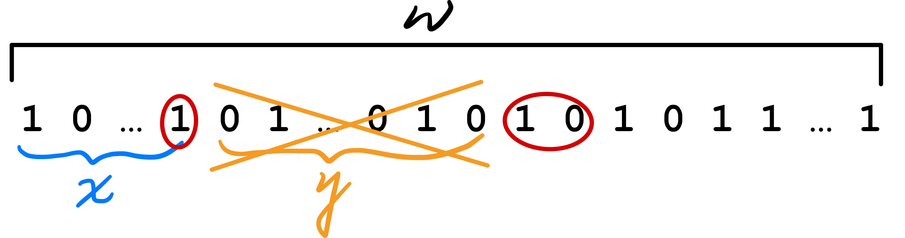

* y starts with 1 and ends with 1

	the word $xy^0z=xz$ has 00 as a factor, a contradiction to $L$ definition

	

* y starts and ends with different letters
	* $y=(10)^i$ or $y=(01)^i$ when $i \gt 0$, so $|y|=2i$, thus $xy^{*}z=xz=(10)^{n-i}1^{n} \notin L$ because $n-i=p < q=n$, a contradiction to $L$ definition


## Let $L=ab^{*}$ ($L$ is regular) and $L'=\{w^n \space | \space w \in L, \space n \in \mathbb{N}\}$, prove that $L'$ is not regular

Notice that $L' \neq L^*, L' \subset L$, e.g. $ababb \in L^*, ababb \notin L', abab \in L'$

Suppose $L'$ is regular, so $L' \cap ab^*ab^*$ is regular because $ab^{*}ab^{*}$ is regular, but  $L' \cap ab^*ab^*=\{ab^{n}ab^{n} \space | \space n \geq 0\}$, this is NOT a regular language


## Design a PA that recognizes the language $L=\{a^{n}b^{2n} \space | \space n \geq 1 \}$

### Read 1 `a` push 2 `X` and read 1 `b` pop 1 `X`

Use the stack (LIFO) as a "bucket", if we read `a`, put 2 "pebbles" in the "bucket"; When define a `b`, remove "pebbles" from the stack and check there are no `a` after `b`, and when there is no more input and stack is empty, you can accpet

* Input: `aabbbb`
* Stack(bottom to top): `Z0` --read a--> `Z0 X X` --read a--> `Z0 X X X X` --read b--> `Z0 X X X` --read b--> `Z0 X X` --read b--> `Z0 X` --read b--> `Z0` --read nothing--> `Z0`

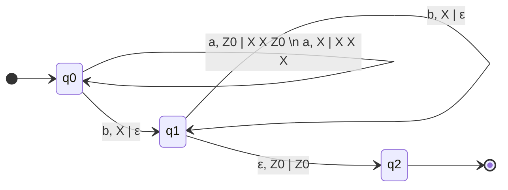


### Read 1 `a` push 1 `X` and read 2 `b` pop 1 `X`

The space complexity (maximum stack size) is less than previous method

* Input: `aabbbb`
* Stack(bottom to top): `Z0` --read a--> `Z0 X` --read a--> `Z0 X X` --read b--> `Z0 X X` --read b--> `Z0 X` --read b--> `Z0 X` --read b--> `Z0` --read nothing--> `Z0`

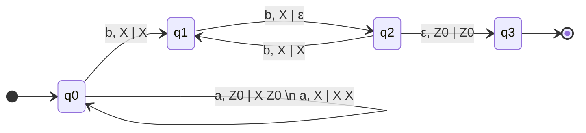


## Design a PA for the language $L=\{w \in \{a,b\}^{*} \space | \space \#_{a}(w)=\#_{b}(w)\}$

* Input: `aabbba`
* Stack(bottom to top): `Z0` --**read nothing (ε move)**--> `Z0` --read a--> `Z0 A` --read a--> `Z0 A A` --read b--> `Z0 A` --read b--> `Z0` --**read nothing (ε move)**--> `Z0` --read b--> `B Z0` --read a--> `Z0` --read nothing--> `Z0`

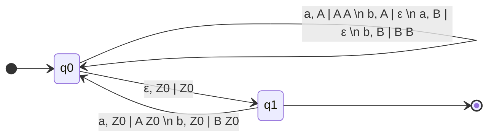


## Design a PA for the language $L=\{a^{n}b^{m}a^{n} \space | \space n,m \geq 0\}$

We can rewrite $L = \{\epsilon\} \space \cup \space b^+ \space \cup \space (aa)^{+} \space \cup \space \{a^{n}b^{m}a^{n} \space | \space n,m > 0\}$

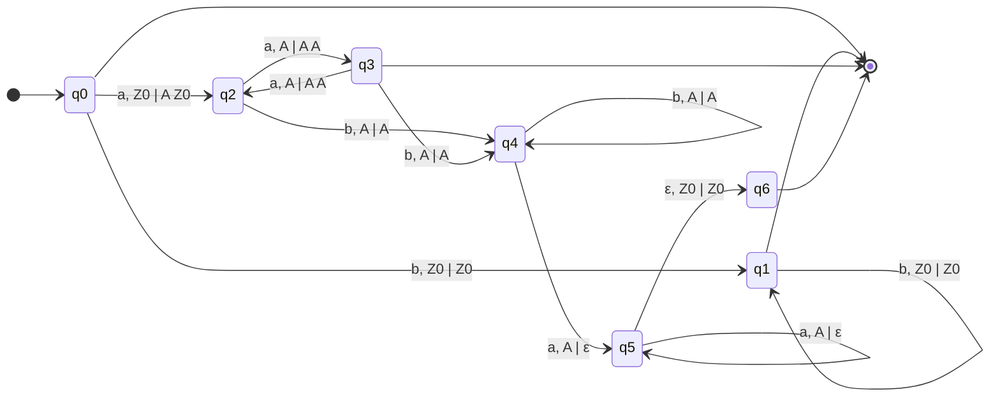

* `q0 --> [*]` accepts $\epsilon$
* `q0 --> q1 --> [*]` accepts $b^{+}$
* `q0 --> q2 --> q3 --> [*]` accepts $(aa)^{+}$
* `q0 --> q2 | q3 --> q4 --> q5 --> q6 --> [*]` accepts $\{a^{n}b^{m}a^{n} \space | \space n,m > 0\}$


## Design a PA for the language $L=\{a^{i}b^{j}c^{k} \space | \space i+k=j, \space i,k \geq 0\}$

We can rewrite $L=\{a^{i}b^{i}b^{k}c^{k} \space | \space i+k \geq 0\}$ 

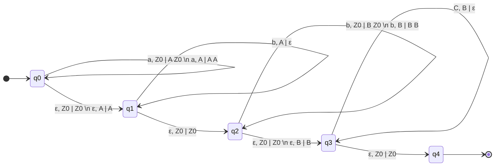

But this is a **NON DETERMINISTIC** PA

* `a, Z0 | A Z0` with `ε, Z0 | Z0`, they both pop `Z0`
* `a, A | A A` with `ε, A | A`, they both pop `A`
* `b, Z0 | B Z0` with `ε, Z0 | Z0`, they both pop `Z0`
* `b, B | B B` with `ε, B | B`, they both pop `B`

Here is a **DETERMINISTIC** PA:

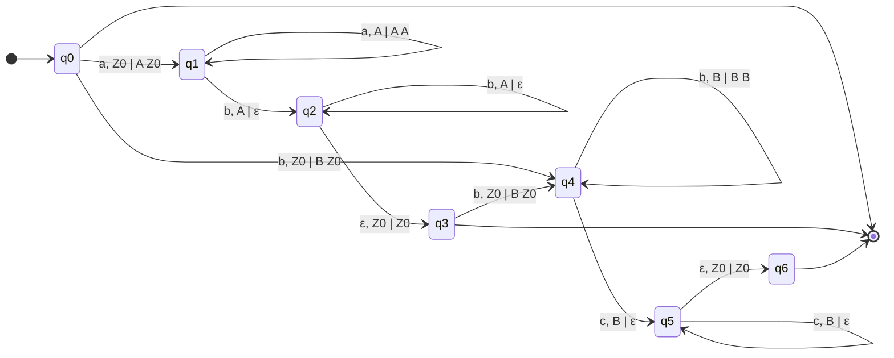

* `q0 --> [*]` accepts $\epsilon$

* `q0 --> q1 --> q2 --> q3 --> [*]` accepts $a^{n}b^{n} \space | \space n>0$
* `q0 --> q4 --> q5 --> q6 --> [*]` accepts $b^{m}c^{m} \space | \space m>0$


## Design a PA for the language of balanced strings of brackets (with only one type  of brackets `()`)

* Balanced: `()(())()()(()())` 
* Not balanced: `()(()))(`

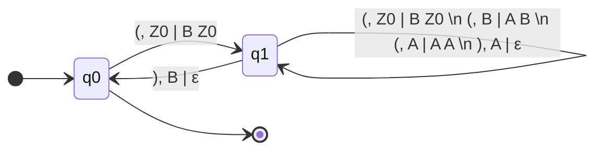


# Ex 3: Turing Machine

## Turing Machine

k-tape Turing machine ($k \in \mathbb{N}$, $k$ must be set **BEFORE** the definition of the machine) have $k+2$ tapes

* 1 input tape
* k memory tapes
* 1 output tape (optional)

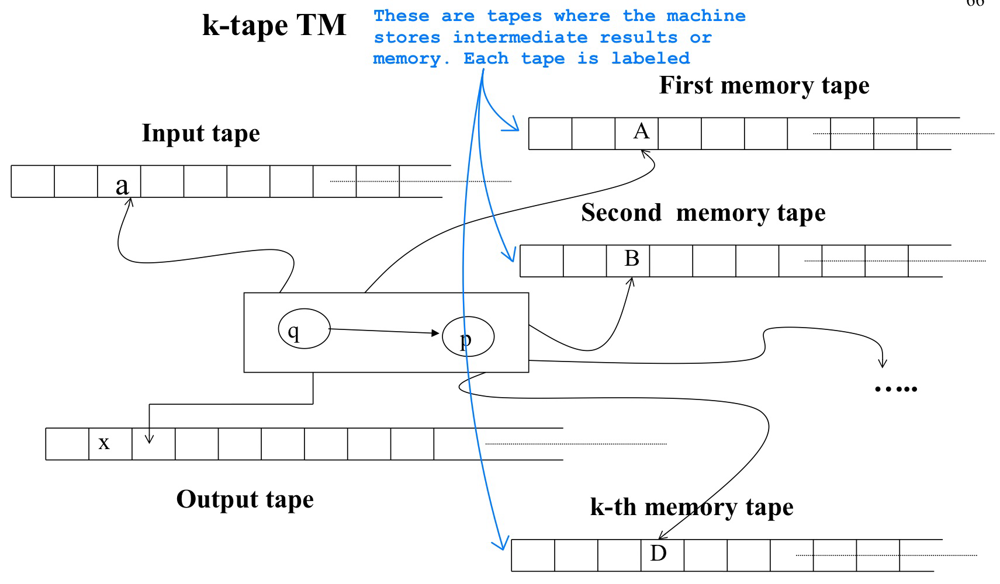

* A TM has **exactly ONE** find (halting) state and **NO** transitions starts from the final state, if the TM is in this state, then it halts and accepts the entire content (without blanks(`_`))
* At the beginning of the computation, all the input is in input tape

https://turingmachinesimulator.com


## Design a k-tapes TM for $L=\{w \in \{a,b,c\}^{*} \space | \space \#_{a}(w)=\#_{b}(w)=\#_{c}(w)\}$

### Using 3 memory tapes

* 3 memory tapes
* keep trace on each memory tape (in unary) of the number of `a`, `b` and `c`

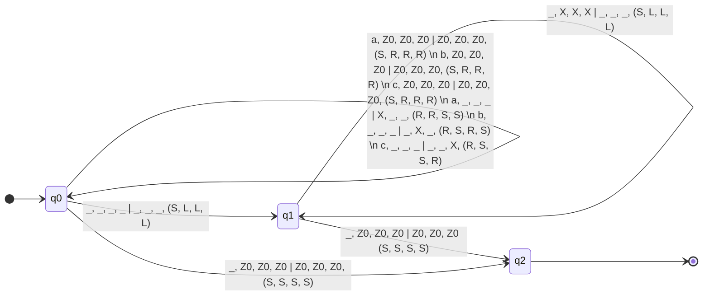


### Using 2 memory tapes

* 2 memory tapes scan input left to right
* For each `a` put a token in the two tapes
* When read `_` in input , scan the input right to left and erase a token from the first tape for each `b` and from the second one for each `c` 


### Using 1 memory tapes

* 1 memory tapes scan input left to right
* For each `a` put a token in the memory tape
* When read `_` in input, scan the input right to left and move the memory head left for each `b` (without erasing the token). 
* When reach the `_` in input and `Z0` in memory, scan the input left to right and move right the memory head for each `c`


## Design a k-tapes TM for $L=\{ a^{2^{n}} \space | \space n \geq 0\}=\{ a, aa, aaaa, a^{8}, a^{16}, ... \}$

### First Idea: Divide 2 every time

* 1 memory tape
* Copy the input in memory tape
* Scan the memory several times, change every second symbol
* It accepts when there is only one `a` left in memory tape
	* **Accept**: `aaaaaaaa` -> `a*a*a*a*` -> `a***a***` -> `a*******` (one a left)
	* **Reject**: `aaaaaa` -> `a*a*a*` -> `a***a*` (two a left)


### Second Idea: Convert to base 2

* 1 memory tape
* Write on the memory tape the number of `a` in base 2
	* input tape: `a a a a a a a a`
	* memory tape: `Z0 1` -> `Z0 0 1`  -> `Z0 1 1` -> `Z0 0 0 1` -> `Z0 1 0 1` -> `Z0 0 1 1` -> `Z0 1 1 1` -> `Z0 0 0 0 1`
* It accepts If `1 0 0 ... 0` in memory (right to left)

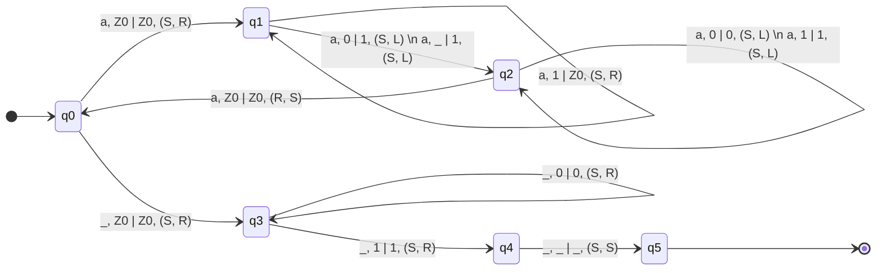


# Ex 4

## Design a k-tapes TM transducer (input/output)

given $w = \{a^{n}b^{m} \space | \space n,m \in \mathbb{N}\}$, output a string u with respect to

* it has the same number of `a` and of `b` as w
* the `a` and `b` appear alternately (until is possible)
	* Input: `aaabbb` --> Output: `ababab`
	* Input: `aaab` --> Output: `abaa`
	* Input: `abbb` --> Output: `abbb`
	* If $w \notin \{a^{n}b^{m} \space | \space n, m \in \mathbb{N}\}$, then the machine does not produce an output

### k = 2

One tape to count in unary the number of `a` , one for the `b`

* Input tape: `aaab`
* Memory tape 1: `aaa`
* Memory tape 2: `b`
* Output tape: `abaa`

### k = 1

* Input tape: `aaaaabbbbbbbb`
* Memory tape: `aaaaabbbbbbbb`  --modify the second a to c and reach the first b modify it to a--> `acaaaabbbbbbb` --modify c to b and next second a to c then reach the first b modify it to a--> `abacaaabbbbbb`  ----> `ababacaabbbbb` ----> `ababababacabbbb` ----> `ababababababbbb`
* Output tape: `ababababababbbb`


## Design a k-tapes TM transducer that outputs (in unary) the product of two naturals numbers (in unary)

* Input tape: `1 1 1 $ 1 1` (`$` is a separator)
* Output tape: `1 1 1 1 1 1` ($3 \times 2 = 6$)

### k = 1

* $q_0$ to copy in memory the first sequence of `1` 
* $q_1$ to read the input after `$`, 
* $q_w$ to write the memory to the output
* $q_r$ to rewind the memory tape
* $q_f$ final

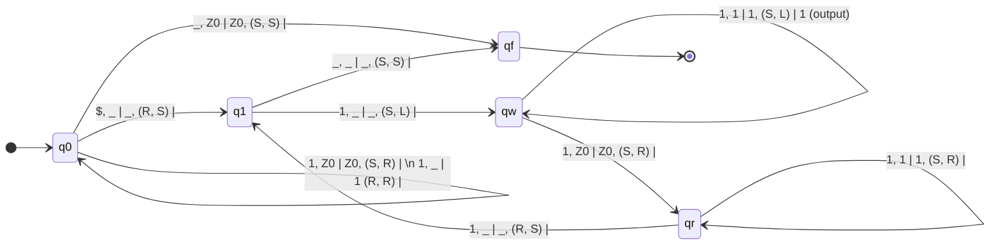


## Consider $L = \{uww^{R}v \space | \space u, v, w \in \{a, b\}^{+}\}$ (R is the reverse (as mirror) of $w$, if $w=abb$, then $w^{R}=bba$), find a minimal power machine t hat recgonizes $L$

Consider $|w| \geq 2$, $w = w' \cdot c$, $c \in \{a,b\}$

* $uww^{R}v = \underbrace{u \cdot w'}_{u' \in \{a,b\}^{+}} \cdot c \cdot c \cdot \underbrace{(w')^{R} \cdot v}_{v' \in \{a,b\}^{+}} = u' \cdot c \cdot c \cdot v'$
* we can rewrite $L=(a\overset{\downarrow OR}{+}b)^{+} \cdot (aa+bb) \cdot (a+b)^{+}$
* $L$ is  regular, we can recognize it with **FSA**
* $aa \notin L$, $aabab \notin L$, $aaab \in L$

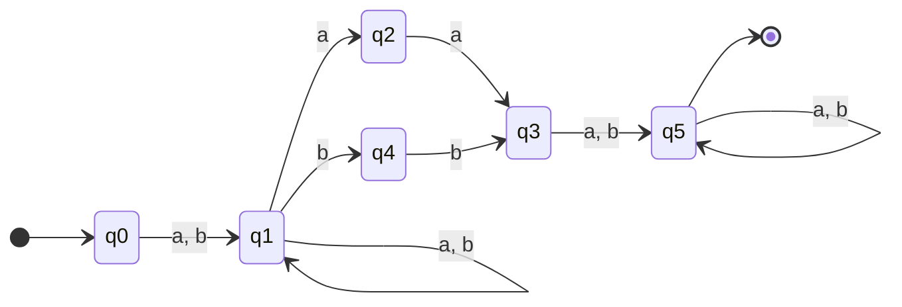

This is a **NON DETERMINISTIC** automaton (exist at least one state has multiple path with same label, e.g., q1), we can translate it to **DETERMINISTIC**:

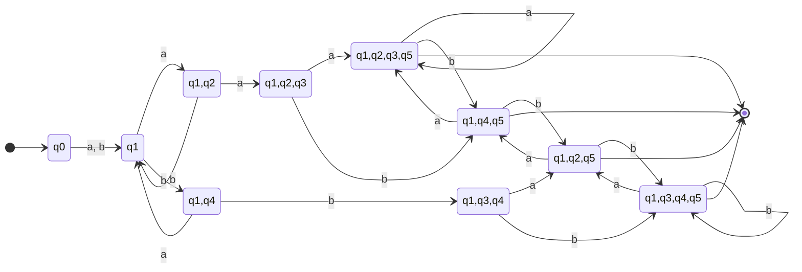


## Prove that $L=\{w \in \{a,b\}^{*}$ | for all substring $u$ of $w$, we have $-5 \leq \#_{a}(u)-\#_{b}(u) \leq 5 \}$ is regular

We can construct FSA for it:

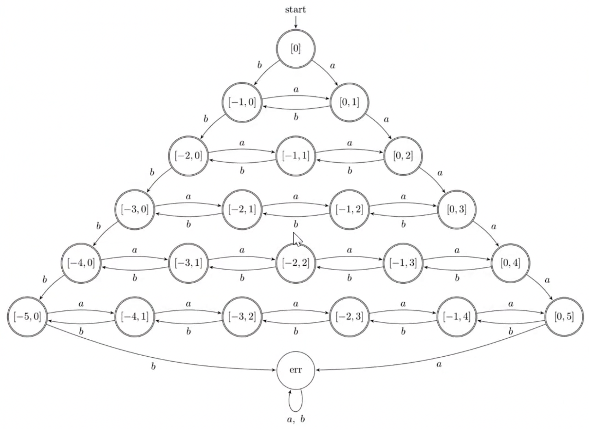


# Ex 5: Non-deterministic Pushdown automata & Grammar

Alphabet $\Sigma=\{a, b, \$, *\}$


## $L_1 = \{a^n b^n \space | \space n \geq 1\} \cup \{a^n b^{2n} \space | \space n \geq 1\}$

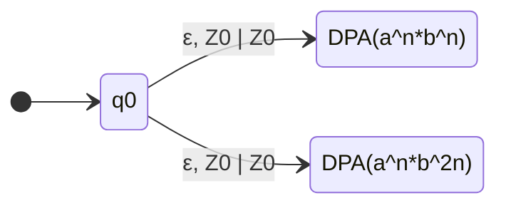


## $L_2 = \{*a^n b^n \space | \space n \geq 1\} \cup \{\$a^n b^{2n} \space | \space n \geq 1\}$

This is a **deterministic** pushdown automata: 

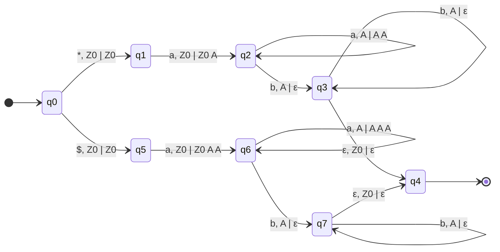


## $L_3 = \{a^n * b^n \space | \space n \geq 1\} \cup \{a^n \$ b^{2n} \space | \space n \geq 1\}$

This is a **deterministic** pushdown automata: 

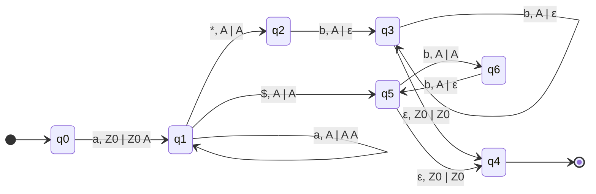


## $L_4 = \{a^n b^n * \space | \space n \geq 1\} \cup \{a^n b^{2n} \$ \space | \space n \geq 1\}$

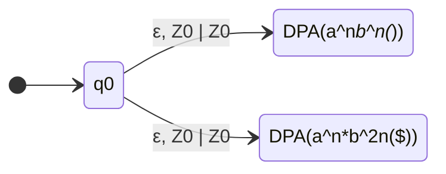


## $L = \{ww \space | \space w \in \{a,b\}^*\}$

It's complementary is $L'=\overline{\{ww \space | \space w \in \{a,b\}^*\}} = \{u \in \{a,b\}^* \space | \space \forall w \in \{a,b\}^* : ww \neq u\}$ which is recognized by a **NDPA**

$L' = \{w \in \{a,b\}^* \space | \space |w| \space \text{is odd}\} \\ \cup \{w = \alpha a \beta b \gamma \space | \space \alpha, \beta, \gamma \in \{a,b\}^* \space \text{and} \space |\beta| = |\alpha \gamma| \} \\ \cup \{w = \alpha b \beta a \gamma \space | \space \alpha, \beta, \gamma \in \{a,b\}^* \space \text{and} \space |\beta| = |\alpha \gamma| \}$

e.g. $aabbabaaabbb \in L'$

* we can select first two $a$ as $\alpha$
* last three $b$ as $\gamma$
* the middle $babaa$ as $\beta$

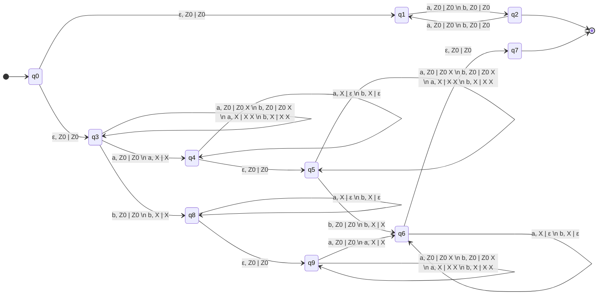

* `q0 --> q1 --> q2 --> [*]`  accepts $\{w \in \{a,b\}^* \space | \space |w| \space \text{is odd}\}$
* `q0 --> q3 --> q4 --> q5 --> q6 --> q7 --> [*]` accepts $\{w = \alpha a \beta b \gamma \space | \space \alpha, \beta, \gamma \in \{a,b\}^* \space \text{and} \space |\beta| = |\alpha \gamma| \}$
* `q0 --> q3 --> q8 --> q9 --> q6 --> q7 --> [*]` accepts $\{w = \alpha b \beta a \gamma \space | \space \alpha, \beta, \gamma \in \{a,b\}^* \space \text{and} \space |\beta| = |\alpha \gamma| \}$

 

## Formal grammars

* Start from a symbol
* Repeatly apply some "rewriting-rules"
* Generate a word of **terminal symbols**


$G = \langle V_N, V_T, P, S \rangle$

* $V_N$ : Represents the set of **nonterminal symbols**. These symbols are placeholders that can be replaced by other symbols (both terminal and nonterminal) according to the grammar rules
	* $V_N = \{S, A, B, C, D\}$
* $V_T$ : Represents the set of **terminal symbols**. These symbols are the actual characters or tokens that appear in the strings of the language being generated. Terminals cannot be replaced further
	* $V_T = \{a, b, c\}$
* $V = V_N \cup V_T$ : This is the complete set of symbols, which includes both the terminal and nonterminal symbols ($V_N$ and $V_T$)
* $S \in V_N$ : Represents a specific nonterminal symbol called the **start symbol** or **axiom**. This is the initial symbol from which the generation or derivation of strings begins
* $P \subseteq V_N^+ \times V^*$ : Represents the set of **rewriting rules** or **productions**. Each rule specifies how a nonterminal (from $V_N$) can be replaced by a sequence of symbols (which could be terminals or nonterminals from $V$)
	* $P = \{ \langle \alpha, \beta \rangle \ |\ \alpha \in V_N^+ \ \text{and} \ \beta \in V^* \}$
		* $\alpha$ : a sequence of one or more nonterminal symbols ($\alpha \in V_N^+$).
		* $\beta$ : a sequence of symbols (either terminals, nonterminals, or both, denoted as $\beta \in V^*$)
		* The production rule $\langle \alpha, \beta \rangle$ can be written as $\alpha \rightarrow \beta$ , where $\alpha$ is rewritten as $\beta$ . This emphasizes the idea of **rewriting** in the grammar
		* $P = \{S \rightarrow AB, BA \rightarrow cCD, CBS \rightarrow ab, A \rightarrow \varepsilon\}$
			* $S \rightarrow AB$ : This rule means that the nonterminal $S$ can be replaced with the nonterminal sequence $AB$
			* $BA \rightarrow cCD$ : This rule states that the nonterminal sequence $BA$ can be replaced by the sequence $cCD$. This involves both terminal ($c$) and nonterminal symbols ($C$ and $D$)
			* $CBS \rightarrow ab$ : This rule states that the nonterminal sequence $CBS$ can be replaced with the terminal string $ab$
			* $A \rightarrow \varepsilon$ : This rule specifies that the nonterminal $A$ can be replaced by the empty string (denoted by $\varepsilon$). This is known as an **epsilon production** and means that $A$ can “disappear” during the rewriting process


| type | name                           | production                                                   | machine         |
| ---- | ------------------------------ | ------------------------------------------------------------ | --------------- |
| 0    | Unrestricted (general) grammar | $-$                                                          | TM              |
| 1    | Monotone (context-sensitive)   | $|\alpha| \leq |\beta|$                                      | Linear automata |
| 2    | Context-free                   | $|\alpha| = 1$                                               | NDPA            |
| 3    | Regular                        | $A \rightarrow aB \\ A \rightarrow a \\ S \rightarrow \varepsilon$ | (D/ND) FA       |


 ## Define a (regular) grammar such that $L(G) = L(A)$

### EX 1: From FA to Grammar

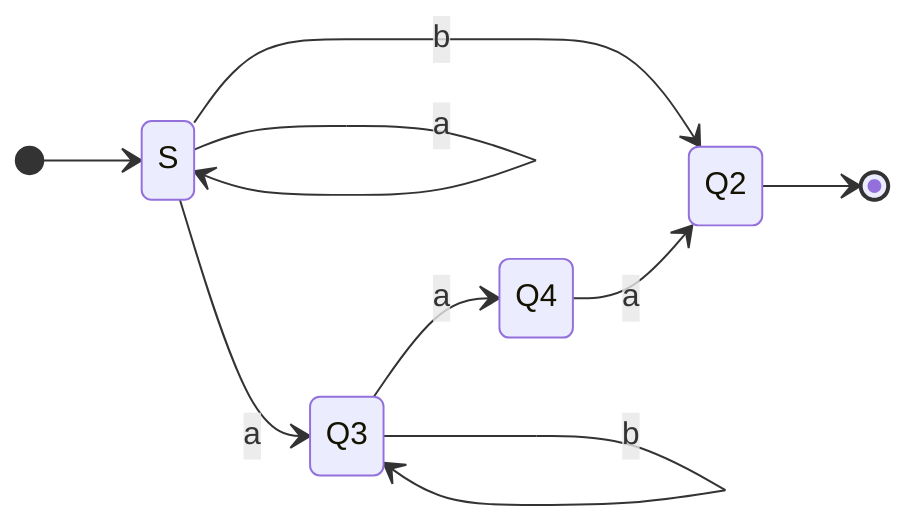

From the diagram we can know $L(A) = a^*b + a^+b^*aa$

Idea: 

* states are non-terminal

* Terminal: $a$ , $b$
* Transitions are simulated by productions

$G = \langle V_T = \{a, b\}, \space V_N=\{S, Q_2, Q_3, Q_4\}, \space S, \space P \rangle$

* $P = \{S \rightarrow aS |aQ_3|bQ_2|b, \space Q_3 \rightarrow aQ_4|bQ_3, \space Q_4 \rightarrow aQ_2|a\}$
* e.g., $S \overset{s \rightarrow aS}{\Rightarrow}aS \overset{S \rightarrow aQ_3}{\Rightarrow} aaQ_3 \overset{Q_3 \rightarrow bQ_3}{\Rightarrow} aabQ_3 \overset{Q_3 \rightarrow aQ_4}{\Rightarrow} aabaQ_4 \overset{Q_4 \rightarrow a}{\Rightarrow} aabaa \in L(A)$


### EX 2: From FA to Grammer

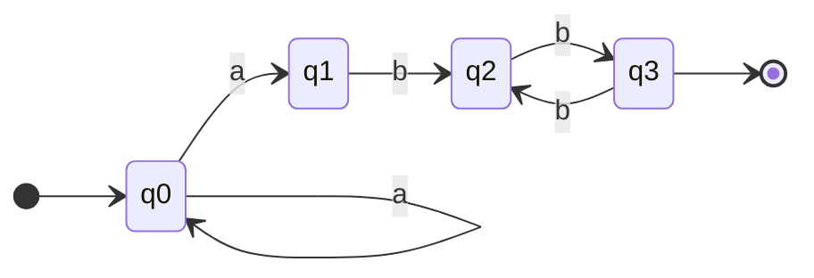

From the diagram we can know $L(A) = a^+(bb)^+$

$G = \langle V_T = \{a, b\}, \space V_N=\{S, Q_2, Q_3, Q_4\}, \space S, \space P \rangle$

* $P = \{S \rightarrow aS|aQ_1, \space Q_1 \rightarrow bQ_2, \space Q_2 \rightarrow bQ|b, \space Q_3 \rightarrow bQ_2\}$


### EX 3: From Grammar to FA

$G = \langle V_T = \{a, b\}, \space V_N=\{S, A, B, C\}, \space S, \space P \rangle$

* $P = \{S \rightarrow a|aS|aC, \space A \rightarrow bC, \space B \rightarrow aC|aB|bS|bA, \space C \rightarrow a|bB\}$

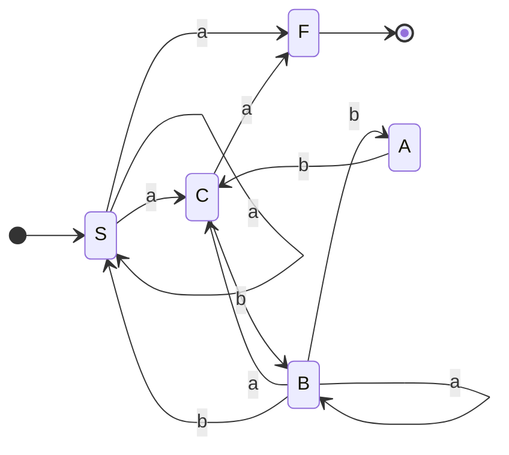


### EX 4: $L_1 = \{a^nb^{2m} \space | \space n,m \geq 1\}$

```mermaid
stateDiagram
	direction LR
	[*] --> S
	S --> Q2 : a
	Q2 --> Q2 : a
	Q2 --> Q3 : b
	Q3 --> Q4 : b
	Q4 --> Q3 : b
	Q4 --> [*]
```

$G = \langle V_T = \{a, b\}, \space V_N=\{S, Q_2, Q_3, Q_4\}, \space S, \space P \rangle$

* From the FA we can see $P = \{S \rightarrow aQ_2, \space Q_2 \rightarrow aQ_2|bQ_3, \space Q_3 \rightarrow bQ_4|b, \space Q_4 \rightarrow bQ_3\}$

* Or we can simply see the expression of $L_1$ then deduce $P = \{S \rightarrow aQbb|abb, \space Q \rightarrow a|aQ|bb|Qbb\}$, but this is **not** regular


### EX 5: $L_2 = \{a^nb^{3n} \space | \space n \geq 0\}$

$P = \{S \rightarrow aSbbb|\varepsilon\}$


### EX 6: $L_3 = L_1 \cap L_2$

We can find the expression of $L3 = \{a^{2n}b^{6n} \space | \space n \geq 1\}$

$P = \{S \rightarrow aaSbbbbbb|aabbbbbb\}$

 
