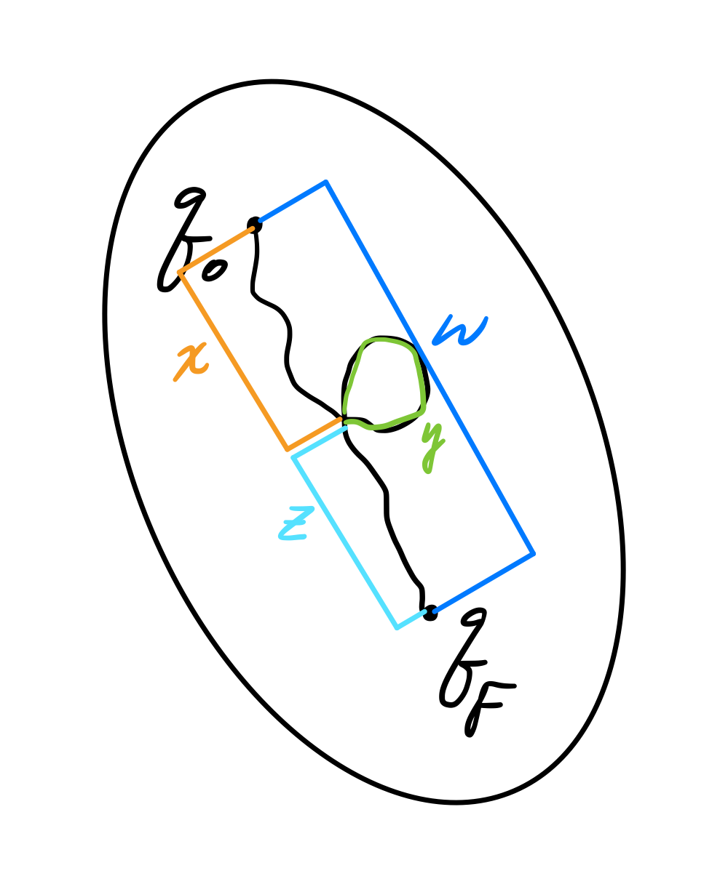

# Exercise 2

==Pumping Lamma==: If $L$ is a **regular** language, then there exists $n \in \mathbb{N}$ ("pumping length", normally $n$ is number of states of the **minimal** automaton that recognizes $L$) such that **for all** $w \in L$ of length $\ge n$, there exist 3 words $x, y, z$  such that 

* $w=xyz$
* $|y|\ge 1 \space (y \neq \epsilon)$
* $|xy| \leq n$
* for all $k \in \mathbb{N}$ (also for $k = 0$): $xy^{k}z \in L$

## Ex1

Prove that $L=\{(10)^{p}1^{q} \space | \space p,q \in \mathbb{N}, \space p \geq q\}$ is not a regular language

$L =\{\epsilon, 10, 1010, ..., 101, 10101, 1010101,...\}$, By contradict, suppose $L$ is regular. So there exists $n \in \mathbb{N}$ as in the pumping lemma, and consider the word $w=(10)^{n}1^{n} \in L$. Observe that $|w|=3n$, there exists $x,y,z$ such that

* $w=xyz$
* $|y|\ge 1 \space (y \neq \epsilon)$
* $|xy| \leq n$
* for all $k \in \mathbb{N}$ (also for $k = 0$): $xy^{k}z \in L$

If $u$ is the prefix of $w$ of length $n$, then $u=(10)^{n/2}$ if n is even or $u=(10)^{(n-1)/2}1$  if n is odd, $xy$ is a prefix of $u$ (as $|xy| \leq n=|u|$)

There are 3 cases:

* y starts with 0 and ends with 0

	the word $xy^0z=xz$ has 110 as a factor, a contradiction to $L$ definition

	

* y starts with 1 and ends with 1

	the word $xy^0z=xz$ has 00 as a factor, a contradiction to $L$ definition

	

* y starts and ends with different letters
	* $y=(10)^i$ or $y=(01)^i$ when $i \gt 0$, so $|y|=2i$, thus $xy^{*}z=xz=(10)^{n-i}1^{n} \notin L$ because $n-i=p < q=n$, a contradiction to $L$ definition

## Ex2

Let $L=ab^{*}$ ($L$ is regular) and $L'=\{w^n \space | \space w \in L, \space n \in \mathbb{N}\}$, prove that $L'$ is not regular

Notice that $L' \neq L^*, L' \subset L$, e.g. $ababb \in L^*, ababb \notin L', abab \in L'$

Suppose $L'$ is regular, so $L' \cap ab^*ab^*$ is regular because $ab^{*}ab^{*}$ is regular, but  $L' \cap ab^*ab^*=\{ab^{n}ab^{n} \space | \space n \geq 0\}$, this is NOT a regular language